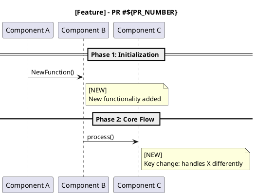

# Code Review Workflow for GitCode PRs

## Overview

This skill provides a standardized workflow for reviewing PRs on GitCode, including:
1. Fetching PR details and diffs
2. Analyzing key code changes
3. Generating PlantUML sequence diagrams
4. Creating review reports
5. Posting comments via GitCode API

## Required Environment

- `GITCODE_TOKEN`: GitCode API Bearer token (create in GitCode Settings → Access Tokens)

## Step-by-Step Workflow

### Step 1: Create Code Review Directory

```bash
REVIEW_DIR="code-review/$(date +%Y-%m-%d)-pr${PR_NUMBER}-${short-description}"
mkdir -p "$WORKSPACE_DIR/$REVIEW_DIR"
```

### Step 2: Fetch PR Information

```bash
# Get PR details
curl -s -H "Authorization: Bearer $GITCODE_TOKEN" \
  "https://api.gitcode.com/api/v5/repos/openeuler/yuanrong-datasystem/pulls/${PR_NUMBER}"

# Get changed files (full diff)
curl -s -H "Authorization: Bearer $GITCODE_TOKEN" \
  "https://api.gitcode.com/api/v5/repos/openeuler/yuanrong-datasystem/pulls/${PR_NUMBER}/files"
```

### Step 3: Analyze Key Changes

For each changed file, analyze:
- **New functions/classes**: What do they do?
- **Modified logic**: What changed and why?
- **Memory safety**: Any potential leaks or unclosed resources?
- **Concurrency**: Thread-safety of shared data structures
- **Edge cases**: Error handling and boundary conditions

Focus areas:
- Memory leaks and resource leaks (unreleased pointers, file handles, etc.)
- Concurrent access safety (race conditions, deadlocks)
- Business logic correctness
- Performance implications

### Step 4: Generate PlantUML Sequence Diagram



Mark **NEW** vs **EXISTING** code paths with different colors:
- `<color:#FF6B00>**[NEW]**</color>` for new code
- `<color:#0066CC>**[EXISTING]**</color>` for existing code

### Step 5: Create Review Report

```markdown
# PR #${PR_NUMBER} Review: ${Title}

**Author**: ${author}
**Review Date**: $(date +%Y-%m-%d)

## Summary
[Brief description of what this PR does]

## Key Changes
[Detailed analysis of main changes]

## Risk Analysis

### Memory Safety
- [ ] Resource leaks found
- [ ] Unreleased handles

### Concurrency
- [ ] Race conditions
- [ ] Thread-safety issues

### Logic
- [ ] Edge cases handled
- [ ] Error handling

## Final Assessment
| Category | Rating | Notes |
|----------|--------|-------|
| Correctness | ⭐⭐⭐⭐ | ... |
| Memory Safety | ⭐⭐⭐⭐ | ... |
| Concurrency | ⭐⭐⭐⭐ | ... |
```

### Step 6: Post Comments to GitCode

#### General Comment (PR-level)
```bash
curl -s -X POST -H "Authorization: Bearer $GITCODE_TOKEN" \
  -H "Content-Type: application/json; charset=utf-8" \
  -d '{
    "body": "## Review Comment\n\n[Category] Issue description..."
  }' \
  "https://api.gitcode.com/api/v5/repos/openeuler/yuanrong-datasystem/pulls/${PR_NUMBER}/comments"
```

#### Line-level Comment (via `path` + `position`)
```bash
curl -s -X POST -H "Authorization: Bearer $GITCODE_TOKEN" \
  -H "Content-Type: application/json; charset=utf-8" \
  -d '{
    "body": "[Category] Issue description",
    "path": "src/path/to/file.cpp",
    "position": 123
  }' \
  "https://api.gitcode.com/api/v5/repos/openeuler/yuanrong-datasystem/pulls/${PR_NUMBER}/comments"
```

**Note**: GitCode API may convert `position`-based comments to general comments. Verify on the PR page.

#### Comment Categories
- `[Critical]` - Must fix before merge
- `[Minor]` - Non-blocking issue
- `[Suggestion]` - Improvement recommendation
- `[确认]` - Confirmation of expected behavior
- `[LGTM]` - Looks good to me

## Key API Endpoints

| Operation | Method | Endpoint |
|-----------|--------|----------|
| Get PR details | GET | `/repos/{owner}/{repo}/pulls/{number}` |
| Get PR files | GET | `/repos/{owner}/{repo}/pulls/{number}/files` |
| Get comments | GET | `/repos/{owner}/{repo}/pulls/{number}/comments` |
| Post comment | POST | `/repos/{owner}/{repo}/pulls/{number}/comments` |

## Common Issues

### Line Comments Not Showing on Correct Line
GitCode's `position` parameter uses diff-based line numbers, not source file line numbers. For accurate positioning, use the diff's `new_line` position.

### API Rate Limiting
Add delays between batch comment operations:
```bash
sleep 1
```

## Example Workflow

```bash
# Review PR 815
PR_NUMBER=815
TOKEN=$GITCODE_TOKEN

# 1. Create directory
mkdir -p "code-review/$(date +%Y-%m-%d)-pr${PR_NUMBER}-review"

# 2. Fetch PR
curl -s -H "Authorization: Bearer $TOKEN" \
  "https://api.gitcode.com/api/v5/repos/openeuler/yuanrong-datasystem/pulls/${PR_NUMBER}" \
  > "pr_${PR_NUMBER}_info.json"

# 3. Analyze and generate report
# (Manual analysis based on fetched data)

# 4. Post a comment
curl -s -X POST -H "Authorization: Bearer $TOKEN" \
  -H "Content-Type: application/json; charset=utf-8" \
  -d '{
    "body": "## Code Review\n\n**[Minor]** Consider adding error handling for edge case X."
  }' \
  "https://api.gitcode.com/api/v5/repos/openeuler/yuanrong-datasystem/pulls/${PR_NUMBER}/comments"
```

## Additional Resources

- For repository context, see `../yuanrong-datasystem/.repo_context/`
- For coding standards, see `../yuanrong-datasystem/.cursor/rules/`