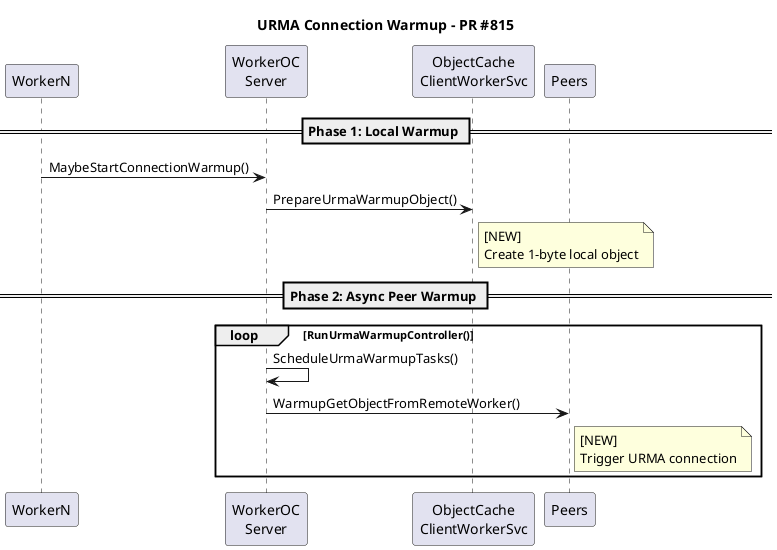

# Code Review Skill - Examples

## Example 1: Basic PR Review

### Step 1: Create Review Directory
```bash
PR_NUMBER=815
REVIEW_DIR="code-review/$(date +%Y-%m-%d)-pr${PR_NUMBER}-urma-warmup"
mkdir -p "$WORKSPACE_DIR/$REVIEW_DIR"
```

### Step 2: Fetch PR Details
```bash
curl -s -H "Authorization: Bearer $GITCODE_TOKEN" \
  "https://api.gitcode.com/api/v5/repos/openeuler/yuanrong-datasystem/pulls/815" \
  | python3 -c "
import json, sys
data = json.load(sys.stdin)
print(f\"PR #{data['number']}: {data['title']}\")
print(f\"Author: {data['user']['login']}\")
print(f\"State: {data['state']}\")
print(f\"Labels: {[l['name'] for l in data['labels']]}\")
"
```

Output:
```
PR #815: feat(worker): warm up URMA connections
Author: yaohaolin
State: open
Labels: ['sig/sig-YuanRong', 'ci_failed']
```

### Step 3: Generate Sequence Diagram



## Example 2: Posting Comments

### General PR Comment
```bash
curl -s -X POST -H "Authorization: Bearer $GITCODE_TOKEN" \
  -H "Content-Type: application/json; charset=utf-8" \
  -d '{
    "body": "## Code Review\n\n**[确认] 双向 URMA 建链确认**\n\n经分析确认，此 PR 覆盖了 N×(N-1) 个有向 worker-worker 对的 URMA 建链预热。"
  }' \
  "https://api.gitcode.com/api/v5/repos/openeuler/yuanrong-datasystem/pulls/815/comments"
```

### Line-level Comment
```bash
curl -s -X POST -H "Authorization: Bearer $GITCODE_TOKEN" \
  -H "Content-Type: application/json; charset=utf-8" \
  -d '{
    "body": "[Minor] 考虑添加资源清理的 RAII wrapper",
    "path": "src/datasystem/worker/worker_oc_server.cpp",
    "position": 152
  }' \
  "https://api.gitcode.com/api/v5/repos/openeuler/yuanrong-datasystem/pulls/815/comments"
```

## Example 3: Review Report Template

```markdown
# PR #815 Review: URMA Connection Warmup

## Summary
本 PR 新增 worker 间 URMA 连接预热能力...

## Key Changes

| File | Change | Risk |
|------|--------|------|
| worker_oc_server.cpp | MaybeStartConnectionWarmup() | Medium |
| worker_oc_service_impl.cpp | PrepareUrmaWarmupObject() | Low |
| worker_oc_service_get_impl.cpp | WarmupGetObjectFromRemoteWorker() | Low |

## Risk Analysis

### Memory Safety
- ✅ 本地对象正确清理
- ⚠️ warmupThreadPool_ 异常路径可能泄露

### Concurrency
- ✅ warmupThreadPool_ 内部管理并发
- ✅ scheduledPeers set 防重复调度

## Final Assessment
**Overall: LGTM with minor suggestions**
```

## Example 4: Complete Workflow Script

```bash
#!/bin/bash
PR_NUMBER=${1:-815}
TOKEN=${GITCODE_TOKEN}

echo "=== Step 1: Fetch PR Info ==="
PR_INFO=$(curl -s -H "Authorization: Bearer $TOKEN" \
  "https://api.gitcode.com/api/v5/repos/openeuler/yuanrong-datasystem/pulls/${PR_NUMBER}")

echo "$PR_INFO" | python3 -c "
import json, sys
d = json.load(sys.stdin)
print(f\"PR #{d['number']}: {d['title']}\")
"

echo "=== Step 2: Fetch Changed Files ==="
curl -s -H "Authorization: Bearer $TOKEN" \
  "https://api.gitcode.com/api/v5/repos/openeuler/yuanrong-datasystem/pulls/${PR_NUMBER}/files" \
  > "pr_${PR_NUMBER}_files.json"

echo "=== Step 3: Post Review Comment ==="
curl -s -X POST -H "Authorization: Bearer $TOKEN" \
  -H "Content-Type: application/json; charset=utf-8" \
  -d '{
    "body": "## Automated Review\n\nReview started..."
  }' \
  "https://api.gitcode.com/api/v5/repos/openeuler/yuanrong-datasystem/pulls/${PR_NUMBER}/comments"

echo "=== Done ==="
```

## Example 5: Analyzing Diff for Key Changes

```bash
curl -s -H "Authorization: Bearer $GITCODE_TOKEN" \
  "https://api.gitcode.com/api/v5/repos/openeuler/yuanrong-datasystem/pulls/815/files" \
  | python3 -c "
import json, sys

files = json.load(sys.stdin)

# Focus on key source files
key_patterns = ['worker_oc_server.cpp', 'worker_oc_service_impl.cpp']

for f in files:
    for pattern in key_patterns:
        if pattern in f['filename']:
            print(f\"\\n=== {f['filename']} ===\")
            print(f\"Additions: {f['additions']}, Deletions: {f['deletions']}\")
            # Show first 500 chars of diff
            if 'patch' in f and f['patch']:
                diff = f['patch'].get('diff', '')[:500]
                print(diff + '...' if len(diff) >= 500 else diff)
"
```

Output:
```
=== src/datasystem/worker/worker_oc_server.cpp ===
Additions: 152, Deletions: 0
@@ -19,12 +19,18 @@
 #include "datasystem/worker/worker_oc_server.h"

+#include <algorithm>
+#include <cctype>
...

=== src/datasystem/worker/object_cache/worker_oc_service_impl.cpp ===
Additions: 57, Deletions: 0
...
```