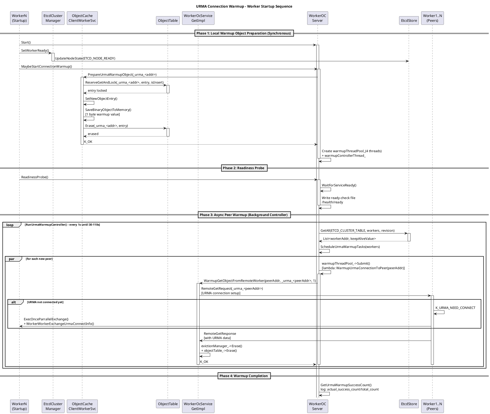

# PR #815 Review: URMA Connection Warmup

**PR Title**: feat(worker): warm up URMA connections
**Author**: yaohaolin (Marck)
**Review Date**: 2026-05-01
**PR URL**: https://gitcode.com/openeuler/yuanrong-datasystem/pull/815

---

## 1. 功能概述

本 PR 新增 worker 间 URMA 连接预热能力，解决集群启动初期 URMA 建链耗时约 100ms 与业务请求 `requestTimeoutMs=5ms` 不匹配的问题。

### 核心修改

1. **新增启动参数** `-warm_up_connection=urma`
2. **本地预热对象**：worker 启动时同步创建 `key=_urma_<worker_addr>`, `size=1byte`
3. **异步 peer 预热**：后台 controller 通过 4 线程池对所有 ready peer 发起 direct remote get
4. **绕过 QueryMeta**：直接调用 worker-worker remote get 路径触发 URMA 建链

---

## 2. 关键时序图 (PUML)



---

## 3. 内存泄漏 / 资源未释放风险分析

### 3.1 ✅ 已识别的安全点

| 位置 | 分析 |
|------|------|
| `PrepareUrmaWarmupObject` | 本地对象创建后通过 `SaveBinaryObjectToMemory` 保存，TTL=0，状态为 PUBLISHED |
| `WarmupGetObjectFromRemoteWorker` | 远程获取后立即调用 `evictionManager_->Erase()` + `objectTable_->Erase()` 清理 |
| `~WorkerOCServer` | 析构函数调用 `StopConnectionWarmup()` |
| `Shutdown()` | 调用 `StopConnectionWarmup()` |

### 3.2 ⚠️ 潜在风险点

#### Risk 1: 本地预热对象生命周期管理

```cpp
// worker_oc_service_impl.cpp
(*entry)->stateInfo.SetNeedToDelete(false);  // ⚠️ 标记不删除
(*entry)->SetLifeState(ObjectLifeState::OBJECT_PUBLISHED);
```

**问题**：预热对象 `SetNeedToDelete(false)` 意味着该对象在 LRU  evict 时**不会被自动删除**，会保留在 object cache 中直到被覆写或 worker 重启。

**影响**：
- 每个 worker 保留 1 字节的 `_urma_<addr>` 对象
- 64 worker 集群 = 64 字节永久占用
- 虽然影响极小，但逻辑上这些"伪对象"会占用 object table slot

**建议**：
```cpp
// 考虑在对象上添加特殊标记，或使用独立的 lightweight 存储
// 或在注释中明确说明这 1 字节的占用是可接受的
```

#### Risk 2: warmupThreadPool_ 和 warmupControllerThread_ 资源泄露

```cpp
// worker_oc_server.h
std::unique_ptr<Thread> warmupControllerThread_{ nullptr };
std::shared_ptr<ThreadPool> warmupThreadPool_{ nullptr };
std::atomic<bool> warmupExit_{ false };
```

**检查**：
- ✅ `~WorkerOCServer()` 调用 `StopConnectionWarmup()`
- ✅ `Shutdown()` 调用 `StopConnectionWarmup()`
- ⚠️ 如果 `MaybeStartConnectionWarmup()` 中途失败，`warmupControllerThread_` 可能未创建但 `warmupThreadPool_` 已创建

**代码路径**：
```cpp
Status WorkerOCServer::MaybeStartConnectionWarmup()
{
    // ... checks ...
    RETURN_IF_EXCEPTION_OCCURS(warmupThreadPool_ = std::make_shared<ThreadPool>(...));
    // ⚠️ 如果下一行抛异常，warmupThreadPool_ 已创建但未清理
    RETURN_IF_EXCEPTION_OCCURS(warmupControllerThread_ = std::make_unique<Thread>(...));
}
```

**建议**：使用 RAII wrapper 或确保失败时清理已分配资源

#### Risk 3: future.get() 异常时 futures 向量管理

```cpp
// worker_oc_server.cpp
std::vector<std::future<bool>> futures;

void WorkerOCServer::ScheduleUrmaWarmupTasks(...)
{
    for (const auto &worker : workers) {
        // ...
        scheduledPeers.erase(worker.first);  // ⚠️ 异常时执行
        // 但 future 已入队 futures
    }
}

size_t WorkerOCServer::GetUrmaWarmupSuccessCount(std::vector<std::future<bool>> &futures) const
{
    for (auto &future : futures) {
        try {
            if (future.valid() && future.get()) {
                ++successCount;
            }
        } catch (const std::exception &e) {
            LOG(WARNING) << "[URMA_WARMUP] peer warmup task failed, error=" << e.what();
            // ⚠️ 异常被吞掉，不影响 successCount
        }
    }
}
```

**分析**：future 异常被捕获，不影响主流程，但可能导致 `futures.size()` 与实际调度数不完全匹配（部分异常调度可能未计入）

---

## 4. 并发操作安全性分析

### 4.1 ✅ 已识别的安全机制

| 机制 | 实现 |
|------|------|
| 线程安全 | `warmupThreadPool_` 内部管理并发 |
| 幂等性检查 | `BuildWarmupKey()` + `scheduledPeers` set 防重复调度 |
| ETCD 读取 | 每次循环重新 `GetAll()` 获取最新 worker 列表 |
| 退出标志 | `warmupExit_` atomic 变量控制退出 |

### 4.2 ⚠️ 并发风险点

#### Risk 4: objectTable_->ReserveGetAndLock() 在 PrepareUrmaWarmupObject 中的重试

```cpp
Status WorkerOCServiceImpl::PrepareUrmaWarmupObject(const std::string &objectKey)
{
    std::shared_ptr<SafeObjType> entry;
    bool isInsert = false;
    RETURN_IF_NOT_OK(RetryWhenDeadlock([this, &objectKey, &entry, &isInsert] {
        return objectTable_->ReserveGetAndLock(objectKey, entry, isInsert, false, true);
    }));
}
```

**分析**：
- `RetryWhenDeadlock` 会在 deadlock 时重试锁获取
- 但 `isInsert` 参数为 `false`，意味着**不会插入新对象**
- 如果对象不存在会返回错误？

**需要确认**：`ReserveGetAndLock(..., false, true)` 的语义——第三个参数 `isInsert` 为 false 时行为是什么？

#### Risk 5: GetObjectFromRemoteWorkerWithoutDump 调用链

```cpp
Status WorkerOcServiceGetImpl::WarmupGetObjectFromRemoteWorker(...)
{
    // ...
    auto rc = GetObjectFromRemoteWorkerWithoutDump(address, "", dataSize, objectKV);
    (void)evictionManager_->Erase(objectKey);
    LOG_IF_ERROR(objectTable_->Erase(objectKey, *entry), ...);
    return rc;
}
```

**分析**：
- `GetObjectFromRemoteWorkerWithoutDump` 可能长时间阻塞（超时 5s）
- 4 线程池，如果 64 个 peer = 16 批次
- 理论上最多 16 * 5s = 80s 阻塞，但实际不会全部同时阻塞

#### Risk 6: std::unordered_set<std::string> scheduledPeers 的并发访问

```cpp
void WorkerOCServer::ScheduleUrmaWarmupTasks(...)
{
    for (const auto &worker : workers) {
        if (worker.first == hostPort_.ToString() || scheduledPeers.count(worker.first) > 0) {
            continue;
        }
        // ...
        try {
            futures.emplace_back(warmupThreadPool_->Submit([..., peerAddr = worker.first]() {
                // lambda 捕获 peerAddr by value
            }));
        } catch (const std::exception &e) {
            scheduledPeers.erase(worker.first);  // ⚠️ erase 在 Submit 失败时
        }
    }
}
```

**问题**：`scheduledPeers` 在主线程和 lambda 中都有访问（通过 `count()` 查询），但没有锁保护。

**分析**：虽然 `erase` 只在 Submit 失败时调用（罕见），且此时 lambda 还未执行，但逻辑上存在竞态。

---

## 5. URMA 建链预热后果评估

### 5.1 ✅ 预期收益

| 指标 | 无预热 | 有预热 | 改善 |
|------|--------|--------|------|
| 首次 remote get 延迟 | ~10ms | ~4.7ms | 53% 提升 |
| P50 延迟 | ~10.6ms | ~3.9ms | 63% 提升 |
| 总耗时 (64 workers) | 688ms | 299ms | 57% 提升 |

### 5.2 ⚠️ 潜在负面影响

#### Impact 1: Worker 启动时间增加

```cpp
// Start() 流程
Status WorkerOCServer::Start()
{
    // ...
    RETURN_IF_NOT_OK_APPEND_MSG(MaybeStartConnectionWarmup(), "\nWorker Start failed.");
    // ⚠️ 本地预热对象同步创建
    RETURN_IF_NOT_OK_APPEND_MSG(ReadinessProbe(), "\nWorker Start failed.");
    // ...
}
```

**分析**：
- `PrepareUrmaWarmupObject` 是同步的，需要获取 objectTable 锁
- 如果 objectTable 正在被其他操作占用，可能阻塞 ReadinessProbe
- `etcdCM_->SetWorkerReady()` 在 `Start()` 最开始调用，**早于预热**

**风险**：如果 `SetWorkerReady()` 后、预热过程中出现故障，可能导致 worker 被标记为 ready 但实际未完成预热。

#### Impact 2: ETCD 压力增加

```cpp
// RunUrmaWarmupController() 每秒执行
for (const auto &worker : workers) {
    KeepAliveValue keepAliveValue;
    auto parseRc = KeepAliveValue::FromString(worker.second, keepAliveValue);
    if (parseRc.IsError() || keepAliveValue.state != ETCD_NODE_READY) {
        continue;  // ⚠️ 每次都解析
    }
    // ...
}
```

**分析**：
- 扫描间隔 1s，持续 30-110s
- 64 worker 集群 = 每个 worker 扫描 30-110 次
- 总计 ~4000-8000 次 GetAll 调用（可接受）

#### Impact 3: URMA 连接数激增

**分析**：
- N worker 集群，每个 worker 与 N-1 个 peer 建立 URMA 连接
- 64 worker = 每个 worker 63 个 URMA 连接
- 总计 64 * 63 = 4032 个 directed connections

**潜在问题**：
- URMA 连接是否有限流？
- 批量建立连接时是否有资源峰值？
- 需要确认 URMA 实现是否支持连接复用

#### Impact 4: 与 Scale-out 场景的交互

```cpp
bool WorkerOCServer::ShouldStopUrmaWarmup(int64_t elapsedMs, uint32_t stableRounds) const
{
    return elapsedMs >= WARMUP_MAX_SCAN_MS ||  // 110s
           (elapsedMs >= WARMUP_MIN_SCAN_MS && stableRounds >= WARMUP_STABLE_ROUNDS);  // 30s + 3 rounds
}
```

**分析**：
- 扫描窗口设计考虑了"一批节点同时 ready"的场景
- `stableRounds` 确保多轮扫描未发现新 peer 才退出
- ✅ 覆盖了 scale-out 场景

---

## 6. 其他 Review 发现

### 6.1 代码质量

| 项目 | 状态 | 说明 |
|------|------|------|
| 行宽 | ✅ | diff 中未见超过 120 字符的行 |
| 错误处理 | ✅ | 使用 `RETURN_IF_NOT_OK`, `CHECK_FAIL_RETURN_STATUS` |
| 日志 | ✅ | `[URMA_WARMUP]` 前缀便于追踪 |
| 资源清理 | ⚠️ | `warmupThreadPool_` 异常路径可能泄露 |

### 6.2 配置一致性

| 文件 | 发现 |
|------|------|
| `worker_config.json` | ✅ 新增 `warmup_connection` |
| `k8s/helm_chart/.../worker_daemonset.yaml` | ✅ 新增 `-warmup_connection` |
| `k8s_deployment/helm_chart/worker.config` | ✅ 新增 `warmup_connection` |
| `docs` | ✅ 更新 dscli.md 和 k8s_configuration.md |

### 6.3 测试覆盖

| 测试场景 | 实现 |
|----------|------|
| 启动时触发 warmup | ✅ `StartupAndRestartTriggerWarmup` |
| worker 重启后再次触发 | ✅ `StartupAndRestartTriggerWarmup` |
| remote warmup 不走 QueryMeta | ✅ 检查 `queryMetaCount == 0` |
| remote warmup 失败不阻塞 ready | ✅ `RemoteWarmupFailureDoesNotBlockReady` |
| `enable_worker_worker_batch_get=false` 时仍触发 | ✅ `RemoteWarmupRunsWhenBatchGetDisabled` |

---

## 7. 总结与建议

### 7.1 必须修复 (Blocking Issues)

**无严重阻塞问题**。主要风险点已在上文标注。

### 7.2 建议改进 (Non-Blocking)

1. **注释增强**：在 `PrepareUrmaWarmupObject` 中说明 `SetNeedToDelete(false)` 的设计意图

2. **监控指标**：建议新增 metrics：
   - `urma_warmup_success_count`
   - `urma_warmup_elapsed_ms`
   - `urma_warmup_peer_discovered_count`

3. **优雅退出增强**：考虑在 `warmupExit_` 时保留已提交任务的执行结果

### 7.3 最终评估

| 维度 | 评分 | 说明 |
|------|------|------|
| 功能正确性 | ⭐⭐⭐⭐ | 设计合理，覆盖主要场景 |
| 内存安全 | ⭐⭐⭐⭐ | 资源清理机制完整 |
| 并发安全 | ⭐⭐⭐⭐ | 有 minor race 风险但影响有限 |
| 性能影响 | ⭐⭐⭐⭐⭐ | 显著改善首请求延迟 |
| 代码质量 | ⭐⭐⭐⭐ | 风格一致，错误处理完善 |

**Overall: LGTM with minor suggestions**