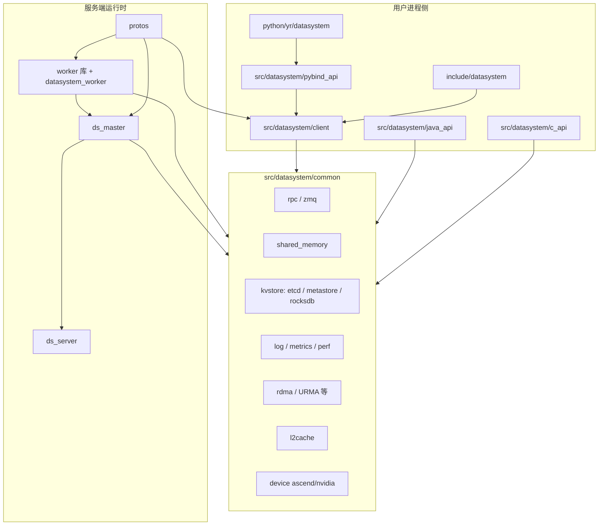

# 开发视图（4+1）

本文档描述 **openYuanrong 数据系统** 在源码仓库 **`yuanrong-datasystem`**（PyPI 包名 `openyuanrong-datasystem`）中的 **模块划分、主要构建产物、依赖方向**，以及与 [特性树](../../feature-tree/openyuanrong-data-system-feature-tree.md) 的对应关系。

**权威细节以源码为准**；仓库内更细的模块说明见 `yuanrong-datasystem/.repo_context/`（尤其 `modules/overview/repository-overview.md`、`modules/client/client-sdk.md`、`modules/runtime/worker-runtime.md`、`modules/infra/common-infra.md`）。

---

## 1. 构建系统与入口

| 入口 | 作用 |
| --- | --- |
| `CMakeLists.txt`（仓库根） | 工程根：`project(Datasystem)`，引入 `cmake/options.cmake`、`cmake/dependency.cmake`，按需 `add_subdirectory(transfer_engine)`，再 `add_subdirectory(src/datasystem)`、`dsbench`、`tests`、`java` 等。 |
| `cmake/options.cmake` | CMake 选项：`WITH_TESTS`、`BUILD_PYTHON_API`、`BUILD_GO_API`、`BUILD_JAVA_API`、`BUILD_HETERO` / `BUILD_HETERO_NPU` / `BUILD_HETERO_GPU`、`BUILD_TRANSFER_ENGINE`、`BUILD_PIPLN_H2D`、`BUILD_WITH_URMA`、`ENABLE_PERF`、`BUILD_COVERAGE` 等。 |
| `build.sh` | 一键配置/编译封装：`-b cmake\|bazel`（默认 cmake）、`-P`/`-J`/`-G` 多语言、`-X` 异构、`-M` URMA、`-T` pipeline H2D、`-t` 测试等；具体映射以脚本内 CMake 变量为准。 |
| `src/datasystem/CMakeLists.txt` | 核心子目录顺序：`protos` → `client` → `common` → `master` → `server` → `worker`；条件启用 `pybind_api`、`c_api`、`java_api`。 |

**说明**：根 `CMakeLists.txt` 在 `BUILD_TRANSFER_ENGINE AND BUILD_HETERO AND BUILD_HETERO_NPU` 时纳入 `transfer_engine/` 子工程；与特性树中的「近计算 / 异构 / 传输」相关能力主要落在此子树与 `common/device`、`client/hetero_cache` 等路径。

---

## 2. 逻辑分层与依赖方向（谁依赖谁）

依赖方向概括为：**用户进程中的 SDK / 绑定** → **`common`（协议、RPC、共享内存、元数据存储、观测等）** ← **worker / master / server 运行时组装**。

- **`common`**：client、master、worker 的共享底座（传输、内存、元数据访问、日志指标等）。详见 `.repo_context/modules/infra/common-infra.md`。
- **`client`**：对外 `KV` / `Object` / `Stream` / `Hetero` 等 API 的实现与连接、服务发现等；Python 通过 `pybind_api` 绑定到 C++，而非平行实现一套逻辑。
- **`master`**：静态库 `ds_master`，组合 `master_object_cache`、`master_stream_cache`、`cluster_manager`、`ds_server` 等，承担元数据/副本/资源等与「协调面」相关的逻辑。
- **`server`**：静态库 `ds_server`，ZMQ 等通用服务端拼装，被 master/worker 链路依赖。
- **`worker`**：可执行文件 `datasystem_worker`（`datasystem_worker_bin`），并产出 `datasystem_worker_static` / `datasystem_worker_shared`；内含 cluster_manager、hash_ring、client_manager、object_cache、stream_cache 等子域。

---

## 3. 源码目录与职责（开发视图速查）

| 路径 | 开发视图中的角色 |
| --- | --- |
| `src/datasystem/protos` | Protobuf / 生成代码与 RPC 契约；依赖向外辐射至 client、master、worker。 |
| `src/datasystem/common` | 跨组件基础设施：RPC、共享内存、etcd/metastore/rocksdb、RDMA/URMA、设备、二级缓存、日志与指标等。 |
| `src/datasystem/client` | SDK 核心实现：`kv_cache`、`object_cache`、`stream_cache`、`hetero_cache`、`context`、`service_discovery`、`mmap` 等。 |
| `src/datasystem/master` | 协调与元数据相关：`object_cache`、`stream_cache` 下 store 与 master 侧服务、副本与重定向等（与 worker 分工以源码为准）。 |
| `src/datasystem/server` | 通用服务端组件 `ds_server`。 |
| `src/datasystem/worker` | Worker 进程主体：注册客户端、共享内存 FD 传递、对象/流缓存服务、集群与一致性哈希等。 |
| `include/datasystem` | 对外 C++ 头文件与稳定 API 表面。 |
| `python/yr/datasystem` | Python 包表面（如 `DsClient`、各子客户端）。 |
| `cli/` | `dscli` 部署与运维：启动/停止、`up`、生成配置与 Helm 等（对应特性树「运维 / 部署」）。 |
| `k8s_deployment/`、`k8s/` | 容器与 Helm 等资源定义。 |
| `tests/` | `ut` / `st` / `perf` / `common` 等测试树。 |
| `transfer_engine/` | 条件编译的传输子系统；与异构/NPU 路径强相关。 |
| `example/`、`dsbench/` | 示例与基准。 |

---

## 4. 主要 CMake 产物（名称级）

以下为开发视图中常引用的 **库/可执行文件名**（具体 `add_library`/`add_executable` 以各目录 `CMakeLists.txt` 为准）。

| 产物类型 | 代表名称 |
| --- | --- |
| Worker 可执行 | `datasystem_worker`（target `datasystem_worker_bin`） |
| 静态库 | `ds_master`、`ds_server`、`datasystem_worker_static`、以及大量 `common_*`、`worker_*`、`master_*` 子库 |
| Python | 条件构建 `libds_client_py` 等（见 `pybind_api/CMakeLists.txt`） |
| 测试 | `WITH_TESTS` 开启时注册 CTest，子目录含 `tests/ut`、`tests/st`、`tests/perf` 等 |

---

## 5. 与特性树的映射（可追溯，非穷举）

特性树文档：[openyuanrong-data-system-feature-tree.md](../../feature-tree/openyuanrong-data-system-feature-tree.md)。下表将 **特性维度** 锚定到 **主要源码/组件**，便于从「产品子特性」跳到开发视图。

| 特性树维度（摘要） | 主要落地位置（仓库内） |
| --- | --- |
| 基本功能：KV 读写、存在性、超时、发布订阅 | `client/kv_cache`、`client/object_cache`、`worker` 侧 object 服务、`common/object_cache`、相关 protos |
| 性能：本地亲和、跨节点副本、共享内存、UB/MF/URMA、批量访问 | `common/shared_memory`、`common/rdma`、`worker` 路由与缓存路径、`transfer_engine`（条件）、`BUILD_WITH_URMA` 等编译选项 |
| 扩展性：一致性哈希、扩缩容迁移、元数据重定向 | `worker/hash_ring`、`worker/cluster_manager`、`master`（副本/重定向/元数据辅助） |
| 运维：SDK/worker 分离、服务发现、多集群、探针、可观测 | `client/service_discovery`、`cli/`、`k8s_deployment/`、`common/log`、`common/metrics` |
| 可用性：链路降级、worker 故障切流、etcd 降级 | `common/rdma`、worker 健康与集群逻辑、`common/kvstore/etcd` 交互路径 |
| 可靠性：二级持久化、恢复、元数据重建 | `common/l2cache`、`common/kvstore/rocksdb`、master/worker 副本与恢复相关实现 |

新增或变更子特性时，建议在特性树或并行表增加 **「实现锚点」**（目录 + 关键 target），与 `.repo_context` 同步更新。

---

## 6. 相关链接

| 说明 | 路径 |
| --- | --- |
| 特性树（Agent 读本） | [../../feature-tree/openyuanrong-data-system-feature-tree.md](../../feature-tree/openyuanrong-data-system-feature-tree.md) |
| 数据系统总览与组件说明（官方 README） | `yuanrong-datasystem/README.md` |
| 仓库级模块地图 | `yuanrong-datasystem/.repo_context/modules/overview/repository-overview.md` |
| 构建与测试入口（质量域） | `yuanrong-datasystem/.repo_context/modules/quality/build-test-debug.md` |

---

*若本文件与 `yuanrong-datasystem` 源码或 `.repo_context` 冲突，以源码及仓库内 context 为准，并回写修正本节。*
