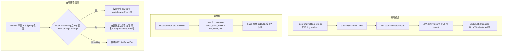

# 原地重启 vs 被动缩容：现状与统一思路

## 当前设计里两类场景各自依赖什么信号

**原地重启（对“当事节点”）**

- 环：`[HashRing::InitRing](src/datasystem/worker/hash_ring/hash_ring.cpp)` 若本机 `workerAddr` **仍在** `HashRingPb.workers`，则 `startUpState_ = RESTART`，并复用 `worker_uuid`；若不在环里则视为 **START**（新节点路径）。
- 另有约束：若 `del_node_info` 仍包含本机地址，Init 会 **K_TRY_AGAIN 重试**（“缩容未完成不允许当重启继续”），见同文件 `InitRing` 内对 `del_node_info` 的检查。
- 集群表：`[EtcdStore::InitKeepAlive](src/datasystem/common/kvstore/etcd/etcd_store.cpp)` 根据 `HashRing::IsRestart` 写入首包 `**restart` 或 `start`**，首包成功后内部把后续基线切成 `**recover`**（同文件 `AutoCreate` 注释）。

**主动缩容**

- 业务侧会 `UpdateNodeState(ETCD_NODE_EXITING)`（例如 `[worker_oc_server.cpp](src/datasystem/worker/worker_oc_server.cpp)`、`[worker_oc_service_impl.cpp](src/datasystem/worker/object_cache/worker_oc_service_impl.cpp)`）。
- 环侧有 `LEAVING` / `need_scale_down` / `del_node_info` 等与 `[HashRing::UpdateLocalState](src/datasystem/worker/hash_ring/hash_ring.cpp)`、`ProcessUpdateRingEventIfLeaving` 配合。

**被动缩容 / 故障隔离（关键分歧点）**

- 本机被环“摘掉”时：`[HashRing::NeedToTryRemoveWorker](src/datasystem/worker/hash_ring/hash_ring.cpp)` 对 **本机** 会区分 `PRE_LEAVING` / `voluntaryScaleDownDone_`（SIGTERM）与其余（**SIGKILL** 的被动缩容路径），并打日志区分网络/不在环等。
- **他机**对“某地址 lease 删除”的反应：`[EtcdClusterManager::HandleNodeRemoveEvent](src/datasystem/worker/cluster_manager/etcd_cluster_manager.cpp)` 在 `foundNode->NodeWasExiting()` 为真时，用 **本机 `hashRing_->IsPreLeaving/IsLeaving(对方)`** 再分子分支：仍认为对方在主动缩容过程中则走“崩溃式主动缩容”通知；否则走“主动缩容正常结束”清理。

---

## 为何会出现「有的认为是重启、有的认为是被动缩容」

本质：**“意图”分散在多个 eventually-consistent 源上，且部分分支用的是观察者本地的 ring 快照**。

| 因素                        | 影响                                                                                                                                                                                               |
| ------------------------- | ------------------------------------------------------------------------------------------------------------------------------------------------------------------------------------------------ |
| **Ring 单 key + watch 延迟** | 节点 A、B 的 `hashRing_` 可能在同一时刻对应 **不同 mod_revision**；`HandleNodeRemoveEvent` 里对 `IsPreLeaving/IsLeaving` 的判断是 **本地环视图**，易与已处理集群事件的节点不一致。                                                           |
| **集群事件缓存**                | 分布式 master 下，`[DequeEventCallHandler](src/datasystem/worker/cluster_manager/etcd_cluster_manager.cpp)` 在环不可用时把 **CLUSTER 事件缓存在 `tmpClusterEvents_`**，RING 优先；flush 顺序会造成 **集群表与环在本地应用顺序** 与他人不同。 |
| **exiting 与时间窗**          | 节点先写 **EXITING** 后崩溃：他人可能先看到 **DELETE**，此时本地表中 `NodeWasExiting()` 为真，但 ring 是否仍显示 LEAVING 取决于 watch 顺序与版本 → 正好落在 `HandleNodeRemoveEvent` 的分叉上。                                                   |
| **重启判定主要在“起机方”**          | 其他节点主要通过集群 value 的 `restart`/`recover` 等推断；若与 ring 上是否仍保留该 worker 的语义不同步，对“同一物理事件”的叙事可能不同。                                                                                                       |

因此：**不是**“所有 worker 在同一时刻对同一事件做同一分类”的模型，而是 **etcd 线性历史 + 各节点本地投影**；在边界时间窗内分歧是结构性的，除非收紧规则。

---

## 可考虑的统一思路（按侵入性从低到高）

### 1. 明确「判定优先级」：以环为权威，集群表为辅助

- **原则**：凡涉及 **数据归属 / 是否触发迁移 / 是否视为成员剔除** 的动作，以 `**[HashRingPb](src/datasystem/protos/hash_ring.pb.h)` + 其 revision** 为准；集群表 `restart`/`exiting` 只用于 **对账、加速路径、运维语义**。
- **落地倾向**：将 `[HandleNodeRemoveEvent](src/datasystem/worker/cluster_manager/etcd_cluster_manager.cpp)` 中与 `IsPreLeaving/IsLeaving` 相关的分支，改为读取 **与本次 DELETE 可关联的 ring 版本**（或强制先等 ring 事件处理到 ≥ 某 revision），减少“集群事件先到、环未到”的错分支。
- 与现有 `[SkipUpdateRing` / `baselineModRevisionOfRing](src/datasystem/worker/hash_ring/hash_ring.cpp)_` 思路一致：都是防 **旧版本**；这里需要的是防 **跨键因果顺序**（cluster delete vs ring update）。

### 2. 引入显式「成员世代 / incarnation」

- 在 **集群表 value 或 ring 的 WorkerPb** 中增加单调 **epoch**（进程每次 **start** 递增；**restart** 不变；**彻底退群** 后该地址再注册为新 epoch）。
- **所有** “这是重启还是新实例 / 是否被动剔除” 的争议，收敛为比较 **(addr, epoch)** 与 ring 中记录的是否一致。
- 优点：观察者无需猜 `restart` 字符串与 ring 是否同步；缺点：要规范谁在何时 bump epoch（涉及 etcd 写与兼容）。

### 3. 被动路径上的「仲裁 / 宽限」

- 在触发 **强副作用**（如 `[RemoveDeadWorkerEvent](src/datasystem/worker/cluster_manager/etcd_cluster_manager.cpp)`、`[ChangePrimaryCopy](src/datasystem/worker/cluster_manager/etcd_cluster_manager.cpp)`、本机 **SIGKILL**）之前，增加 **短宽限 + 再读 ring** 或 **向 master / 多数 peer 拉取 `GetClusterState` 式对账**（已有 `[ReconcileClusterInfo](src/datasystem/worker/worker_oc_server.cpp)` 比较 `HashRingPb.workers` 的先例，可抽象为通用“重大决策前对账”）。
- 目标：把“瞬时视图不一致”过滤掉，只保留 **稳定后仍不一致** 的情况。

### 4. 收紧 EXITING 与 ring 变更的因果顺序（运维/协议层）

- 协议上规定：**只有** ring 已反映 LEAVING/del_node_info（或等价状态）后，才允许进入“可被他人判为正常缩容结束”的路径；否则一律按 **异常退出** 或 **待定** 处理。
- 与现有 `del_node_info` 阻塞 Init 的逻辑同向：**用环状态约束进程生命周期**。

### 5. 观测与排障

- 统一打 **同一 trace：cluster_revision + ring_mod_revision + 本地对 worker X 的判定**（restart / exiting / passive），便于复盘“分歧窗口”是否来自 watch 顺序。
- 文档化状态机：ACTIVE → EXITING → ring 更新 → lease 消失 → 各观察者应执行的 **唯一** 分支表。

---

## 小结建议

- **现状**：重启主要由 **环内是否仍存在该 worker + InitKeepAlive 首包** 定义；被动/主动缩容分支在 **remove 事件处理** 中混合了 `**NodeWasExiting` + 观察者本地 `hashRing`_ 的 PreLeaving/~~Leaving~~**，这是 **跨观察者分歧** 的主要来源。
- **若要“全员一致的措施”**：需要要么 **单一权威源（优先 ring revision）+ 严格处理顺序**，要么 **显式 epoch**，要么 **强副作用前仲裁**；三者可组合。

本计划为架构与实现路线梳理；若你后续要落代码，建议在 Agent 模式下指定优先项（例如只改 `HandleNodeRemoveEvent` 排序 vs 引入 epoch）。