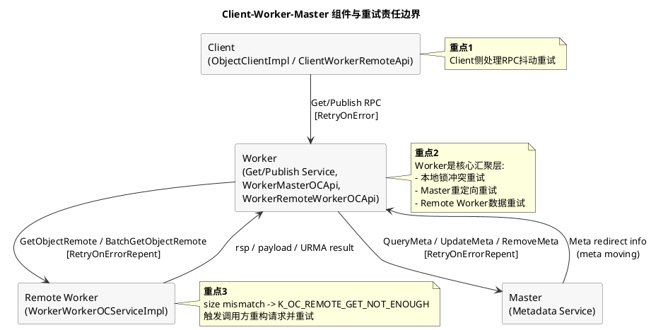
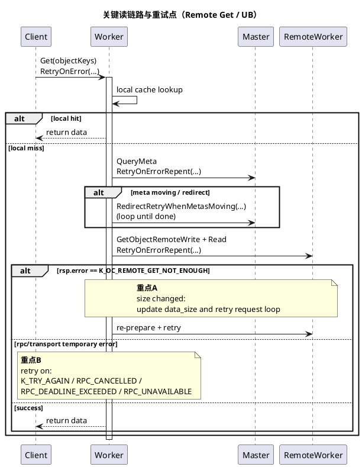
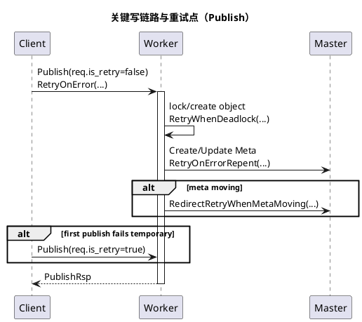

# Client-Worker-Master 故障处理与重试机制总结

## 文档目标

聚焦 `client -> worker -> master -> worker` 链路，梳理当前代码中的故障处理机制与重试路径，尤其是 Remote Get（含 UB/URMA）场景。

范围参考：

- `src/datasystem/client/object_cache/object_client_impl.cpp`
- `src/datasystem/client/object_cache/client_worker_api/client_worker_remote_api.cpp`
- `src/datasystem/worker/object_cache/service/worker_oc_service_get_impl.cpp`
- `src/datasystem/worker/object_cache/worker_worker_oc_service_impl.cpp`
- `src/datasystem/worker/object_cache/worker_master_oc_api.cpp`
- `src/datasystem/worker/object_cache/service/worker_oc_service_crud_common_api.h`
- [`remote-get-ub-urma-flow.md`](remote-get-ub-urma-flow.md)（Remote Get UB/URMA 流程梳理）

---

## 1. 总体结论（重点）

1. **统一重试框架**主要是 `RetryOnError` / `RetryOnErrorRepent`，核心重试码为：
   - `K_TRY_AGAIN`
   - `K_RPC_CANCELLED`
   - `K_RPC_DEADLINE_EXCEEDED`
   - `K_RPC_UNAVAILABLE`
   - 业务特定路径还会包含 `K_URMA_TRY_AGAIN`、`K_OUT_OF_MEMORY`

2. **Remote Get（worker->worker）是双层重试**：
   - **RPC 层**临时错误重试（连接/超时）
   - **业务层**对象大小变化 `K_OC_REMOTE_GET_NOT_ENOUGH` 触发请求重构并循环重试

3. **Master 元数据迁移是“重定向重试”模型**：
   - `RedirectRetryWhenMetasMoving` 循环到迁移完成
   - 可能等待后重试，或切到新 master 地址重发

4. **UB/URMA 单对象 remote get 语义是“先传完再回 rsp”**：
   - 源 worker 侧 `UrmaWritePayload(..., blocking=true)` 完成后才 `Write(rsp)`
   - 不是“rsp 成功后后台异步补传数据”

---

## 2. 链路分层与重试点

## 2.1 Client -> Worker（Get 请求入口）

主要位置：

- `ObjectClientImpl::Get` -> `GetBuffersFromWorker`
- `ClientWorkerRemoteApi::Get`

行为：

- `ClientWorkerRemoteApi::Get` 使用 `RetryOnError` 包裹 `stub_->Get(...)`
- 若 `rsp.last_rc()` 解析后是可重试错误（如 `K_TRY_AGAIN` / RPC timeout 类），继续重试
- UB 场景下可能先 `GetObjMetaInfo` 再分批 Get；单批失败不必然导致全部失败

**重点**：Client 层以“网络/RPC 短暂失败兜底重试”为主，尽量提高成功率并支持部分成功。

## 2.2 Worker -> Master（元数据查询/写入）

主要位置：

- `WorkerOcServiceGetImpl::QueryMetaDataFromMasterImpl`
- `WorkerRemoteMasterOCApi::*`（`QueryMeta`/`CreateMeta`/`UpdateMeta`/`RemoveMeta` 等）
- `WorkerOcServiceCrudCommonApi::RedirectRetryWhenMetasMoving`

行为：

- Worker 调 master 的核心 RPC 普遍走 `RetryOnErrorRepent`
- `RedirectRetryWhenMetasMoving` 对元数据迁移中场景循环重试
  - 未迁移完成：继续重试（含短暂 sleep）
  - 已迁移：切换新 master 后重发

**重点**：Master 侧不是仅靠通用重试，还叠加了“迁移感知+重定向”。

## 2.3 Worker -> Worker（Remote Get 核心）

### 拉取端（调用方 Worker）

主要位置：

- `WorkerOcServiceGetImpl::PullObjectDataFromRemoteWorker`

行为：

- `GetObjectRemoteWrite + Read(rsp)` 包在 `RetryOnErrorRepent` 中
- 若 `rsp.error == K_OC_REMOTE_GET_NOT_ENOUGH`：
  - 使用返回的新 `data_size` 重新准备内存和请求
  - 循环重试直到稳定或超时

### 源端（被拉取 Worker）

主要位置：

- `WorkerWorkerOCServiceImpl::GetObjectRemoteImpl`
- `WorkerWorkerOCServiceImpl::BatchGetObjectRemote`

行为：

- `TryRLock` 在 `K_TRY_AGAIN` 时最多重试 5 次
- size mismatch 返回 `K_OC_REMOTE_GET_NOT_ENOUGH`
- batch 路径对 `K_URMA_TRY_AGAIN` 有显式重试

**重点**：Remote Get 把“锁争用/尺寸漂移/URMA瞬时失败/RPC失败”拆分处理，降低整条链路脆弱性。

---

## 3. 写请求补充（client -> worker -> master）

主要位置：

- `ClientWorkerRemoteApi::Publish`
- `WorkerOcServicePublishImpl::PublishImpl`
- `WorkerRemoteMasterOCApi::*`

行为：

- Client Publish：`RetryOnError`，并通过 `req.is_retry` 标记重试请求
- Worker Publish：核心发布逻辑用 `RetryWhenDeadlock` 防止锁冲突放大
- Worker->Master：元数据写 RPC 大量 `RetryOnErrorRepent`，并复用 meta moving 重定向机制

**重点**：写链路重试核心是“死锁/锁冲突消化 + master RPC 抖动重试 + 元数据迁移重定向”。

---

## 4. 关键错误码与处理策略

| 错误码 | 常见触发层 | 处理策略 | 是否重试 |
| --- | --- | --- | --- |
| `K_TRY_AGAIN` | client/worker/master 多层 | 通用可重试错误，交由 `RetryOnError*` | 是 |
| `K_RPC_CANCELLED` | RPC 层 | 临时通讯失败，重试 | 是 |
| `K_RPC_DEADLINE_EXCEEDED` | RPC 层 | 超时，剩余时间内重试 | 是 |
| `K_RPC_UNAVAILABLE` | RPC 层 | 服务暂不可用，重试 | 是 |
| `K_OC_REMOTE_GET_NOT_ENOUGH` | worker->worker remote get | 更新 data_size，重构请求，循环 | 是（业务重试） |
| `K_URMA_TRY_AGAIN` | URMA/batch remote get | 传输瞬时不可用，重试 | 是 |
| `K_OUT_OF_MEMORY` | 部分链路 | 视场景降级/终止，通常不无限重试 | 视路径 |
| `K_WORKER_DEADLOCK` | worker<->master/内部锁 | `RetryWhenDeadlock` 或纳入重试集合 | 是（特定接口） |

---

## 5. PlantUML - 组件粒度总览

---

## 6. PlantUML - 关键读链路（client -> worker -> master -> worker）

---

## 7. PlantUML - 关键写链路（补充）

---

## 8. 排障建议（面向线上）

1. 首先区分失败层级：`Client<->Worker`、`Worker<->Master`、`Worker<->RemoteWorker`。
2. 若出现大量 `K_OC_REMOTE_GET_NOT_ENOUGH`，优先检查对象版本/大小波动是否频繁。
3. 若出现大量 `K_TRY_AGAIN` + `K_WORKER_DEADLOCK`，优先检查热点 key 锁竞争。
4. 若出现 `RPC_*` 超时类，结合剩余超时预算看是否在重试阶段已耗尽时间窗。
5. UB/URMA 场景中，区分 `K_URMA_TRY_AGAIN`（可恢复）与持久性失败（需降级或切换链路）。

