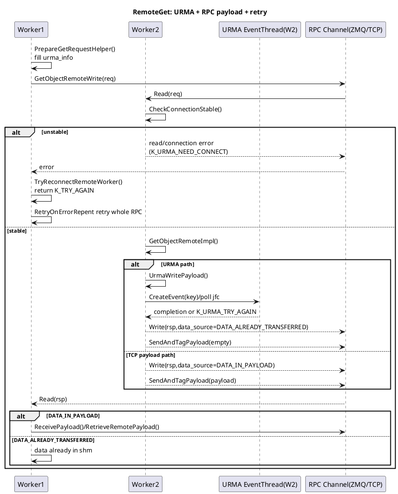

# RemoteGet：TCP回包、URMA失败与重试关系

## 1. 关键结论

- `serverApi->SendAndTagPayload(...)` 负责把 payload 通过 RPC（ZMQ/TCP）回包发给对端，本身不做 retry loop。
- Worker1->Worker2 的 remote get 重试主要由外层 `RetryOnErrorRepent(...)` 触发，属于“整次 RPC 重发”。
- `K_URMA_NEED_CONNECT` 由连接稳定性检查/读响应失败路径触发，随后通过 `TryReconnectRemoteWorker()` 做握手重建，再返回 `K_TRY_AGAIN` 给重试框架。
- `K_URMA_TRY_AGAIN` 主要用于 URMA 可恢复错误（例如 JFS 重建后重试），batch 服务端路径有专门捕获。
- 当前代码中未看到“同一次请求内显式清除 urma_info 并强制改走 TCP payload”的状态机；更多是重试/重连后重新执行请求，由结果决定是否走 payload。

## 2. SendAndTagPayload 在链路中的定位

在 `worker_worker_oc_service_impl.cpp` 的服务端处理：

1) `serverApi->Read(req)`  
2) 处理 `GetObjectRemote/GetObjectRemoteImpl`（可能 URMA 写）  
3) `serverApi->Write(rsp)`  
4) `serverApi->SendAndTagPayload(payload, ...)`

其中第 4 步只是发送 payload 帧：

- `DATA_ALREADY_TRANSFERRED / DATA_DELAY_TRANSFER / DATA_ALREADY_TRANSFERRED_MEMSET_META`：通常发送空 payload
- `DATA_IN_PAYLOAD`：发送实际 payload

真正的失败重试发生在调用方（Worker1）对整次 RPC 的 `RetryOnErrorRepent` 包裹中，而不是 `SendAndTagPayload` 内部。

## 3. Worker1 与 Worker2 交互（含重试/重连）

### 3.1 单对象 remote get（简化）

- Worker1 `PrepareGetRequestHelper` 填充 `urma_info`（若启用 fast transport）。
- Worker1 发起 `GetObjectRemoteWrite(req)`，随后 `Read(rsp)`。
- Worker2 `GetObjectRemoteImpl`：
  - 若 URMA 可用且请求带 `urma_info`，调用 `UrmaWritePayload(...)`，成功后 `rsp.data_source=DATA_ALREADY_TRANSFERRED`
  - 否则走 `DATA_IN_PAYLOAD`（通过 RPC payload 返回）
- Worker2 `Write(rsp)` 后调用 `SendAndTagPayload(...)`。
- Worker1 按 `data_source`：
  - `DATA_IN_PAYLOAD` -> `RetrieveRemotePayload(...)`
  - `DATA_ALREADY_TRANSFERRED` -> 数据已写入目标 SHM

### 3.2 重试触发点

Worker1 在 `PullObjectDataFromRemoteWorker` / batch path 中，用 `RetryOnErrorRepent(timeout, func, ..., {K_TRY_AGAIN, K_RPC_*})` 包裹：

- `GetObjectRemote(...)`
- `...Write(reqPb)`
- `...Read(rspPb)`

若 `Read(rspPb)` 报 `K_URMA_NEED_CONNECT`，会先 `TryReconnectRemoteWorker(address, rc)`：

- 发 transport exchange（重建连接）
- 返回 `K_TRY_AGAIN`
- 被 `RetryOnErrorRepent` 捕获后重试整次 RPC

## 4. URMA 异步完成与 poll jfc

URMA 提交后通过 `CreateEvent(key)` + 后台事件线程完成通知：

- `ServerEventHandleThreadMain` 循环 `PollJfcWait(...)`
- event mode 使用 `ds_urma_wait_jfc(..., RPC_POLL_TIME)`；`RPC_POLL_TIME` 为 100ms
- 完成后 `CheckAndNotify()` 唤醒 `WaitToFinish` 的等待方
- CQE 失败时进入 `HandleUrmaEvent`，部分错误策略可触发 `RECREATE_JFS` 并返回 `K_URMA_TRY_AGAIN`

## 5. 已覆盖错误类型（本次关注）

- `K_OC_REMOTE_GET_NOT_ENOUGH`：对象大小变化，更新 size 后重试
- `K_URMA_NEED_CONNECT`：连接不稳定，需要重建连接
- `K_URMA_TRY_AGAIN`：URMA 可恢复错误，允许重试
- `K_RPC_CANCELLED / K_RPC_DEADLINE_EXCEEDED / K_RPC_UNAVAILABLE`：RPC 超时/不可用重试
- `K_WORKER_PULL_OBJECT_NOT_FOUND`：远端对象不存在
- `K_OUT_OF_MEMORY`：直接失败，不继续远端拉取

## 6. 20ms 超时 + UB 链路闪断（poll jfc 可能 128ms 才感知）的影响

假设用户配置 `get timeout = 20ms`：

- `WaitToFinish/Read(rsp)` 的业务等待预算只有 20ms 左右；
- 但 UB 闪断时若 `poll jfc` 迟至约 128ms 才感知，完成/失败信号会显著晚于业务预算；
- 结果是业务线程先返回超时（常见 `K_RPC_DEADLINE_EXCEEDED` / `K_TRY_AGAIN`），后续 completion 变成“晚到事件”；
- 在 batch 场景里，timeout/try-again 可能导致不再尝试某些后续路径（取决于分支条件与剩余时间），20ms 下成功率和尾延迟都容易恶化。

一句话：`poll jfc` 感知粒度（~100ms+）与 20ms 目标冲突时，重试机制会频繁触发但窗口过短，难以兑现低时延 SLA。

## 7. PlantUML：Worker1/Worker2 + RPC回包 + URMA异步



## 8. 收敛结论（面向问题本身）

- “TCP 重试逻辑是 `serverApi->SendAndTagPayload`”这句话可修正为：
  - `SendAndTagPayload` 是 **TCP/RPC payload 发送动作**
  - **重试逻辑**在外层 `RetryOnErrorRepent`（整次 RPC 维度）
- 在 20ms 超时目标下，若 UB 闪断感知晚于超时预算（例如 128ms），系统将偏向“超时先发生、重试预算不足”，需重点评估低时延场景下 fast transport 的等待与重试参数匹配。

## 9. 开发改造指导（面向 20ms SLA）

目标：在 UB 链路异常（尤其闪断）时，优先做到“快速失败 + 快速降级”，避免请求被 100ms 级感知粒度拖死。

### 9.1 P0：剩余预算 fast-fail（必须优先做）

- 改造点：
  - `src/datasystem/common/rdma/fast_transport_manager_wrapper.cpp` `WaitFastTransportEvent(...)`
  - `src/datasystem/common/rdma/urma_manager.cpp` `WaitToFinish(...)` 调用前
- 建议逻辑：
  - 取 `remaining = reqTimeoutDuration.CalcRealRemainingTime()`
  - 若 `remaining <= FLAGS_urma_fast_fail_threshold_ms`（建议默认 3~5ms），直接返回 `K_RPC_DEADLINE_EXCEEDED` 或 `K_TRY_AGAIN`
  - 不再进入可能触发 `poll jfc` 长等待的路径
- 收益：
  - 避免 20ms 请求被 UB 等待拖到 >100ms，尾延迟立刻改善

### 9.2 P0：UB 异常短期熔断并降级 TCP payload

- 改造点：
  - `src/datasystem/worker/object_cache/service/worker_oc_service_get_impl.cpp`
  - 重点函数：`PullObjectDataFromRemoteWorker(...)`、`BatchGetObjectFromRemoteWorker(...)` 的请求构造阶段
- 建议逻辑：
  - 维护按 remote address 维度的短期熔断表（例如 200ms~1s）
  - 命中 `K_URMA_NEED_CONNECT / K_URMA_TRY_AGAIN / K_URMA_ERROR` 时打开熔断窗口
  - 熔断窗口内不填 `urma_info`（或显式禁用 fast transport），直接走 `DATA_IN_PAYLOAD` 路径
- 收益：
  - 闪断期间减少重复 UB 失败和无效重试，提升可用性与稳定性

### 9.3 P1：低时延场景拆分 poll 粒度

- 改造点：
  - `src/datasystem/common/rpc/rpc_constants.h`
  - `src/datasystem/common/rdma/urma_manager.cpp` 中 `PollJfcWait` 的 wait/poll 时间
- 建议逻辑：
  - 增加独立配置（例如 `FLAGS_urma_poll_time_ms_low_latency`）
  - 当请求超时预算 <= 某阈值（如 20ms 场景）时，使用 1~5ms 的轮询粒度
  - 保持默认路径不变，避免对通用吞吐场景造成 CPU 回归
- 风险：
  - CPU 占用上升，需要灰度和压测评估

### 9.4 P1：重连与重试分层策略

- 改造点：
  - `TryReconnectRemoteWorker(...)` 及其调用点
  - `RetryOnErrorRepent(...)` 的重试码与重试次数控制
- 建议逻辑：
  - `K_URMA_NEED_CONNECT`：允许 1 次快速重连尝试；失败即降级 TCP，不在 UB 上循环
  - `K_URMA_TRY_AGAIN`：只给 1 次极短 backoff（1~2ms）重试，之后降级
  - 避免在 20ms 窗口内进行多次“重连 + UB重试”叠加

### 9.5 P0：可观测性与验收门槛（必须同步）

- 新增指标（最少）：
  - `remote_get_ub_wait_ms`
  - `remote_get_ub_timeout_before_cqe_count`
  - `remote_get_ub_fallback_tcp_count`
  - `remote_get_ub_reconnect_count`
  - `remote_get_ub_circuit_breaker_open_count`
- 验收门槛（建议）：
  - 20ms 配置下，UB 闪断注入场景的 p99 请求时延显著下降
  - `timeout_before_cqe_count` 占比下降
  - 失败类型从“慢超时”转为“快速可预期失败或成功降级”

## 10. 最小可落地实施顺序

1) 先上 `fast-fail + 熔断降级 + 指标`（不改协议、风险最低）  
2) 再上低时延 poll 粒度（按集群灰度）  
3) 最后根据指标决定是否深化 URMA 事件机制优化

## 11. 实施注意事项

- 保持“仅低时延场景启用激进策略”，避免影响通用吞吐场景。
- 降级到 TCP payload 时需保证与 `DATA_IN_PAYLOAD` 接收路径兼容（`RetrieveRemotePayload`/batch payload 分支）。
- 所有新策略建议加开关，支持快速回滚。

## 12. TCP 回切后的限流设计（防止降级风暴）

背景：UB 异常时会触发 TCP 回切；若不控量，容易把网络和 RPC 线程池打满，导致全局抖动。

### 12.1 目标与原则

- 目标：把“UB 异常”从链路抖动问题，收敛为“可控的快速失败/受控降级”。
- 原则：
  - 限流发生在**请求侧决策点**（优先），发送侧做兜底；
  - 限 bytes/s + qps，而不是只限并发；
  - 小请求优先，大请求受限更严，保障 20ms 场景。

### 12.2 三层限流（推荐）

1) **全局桶（Global Token Bucket）**  
- 维度：`fallback_tcp_bytes_per_sec` + `fallback_tcp_qps`  
- 作用：总量封顶，防止全局雪崩。

2) **按远端地址桶（Per-peer Bucket）**  
- 维度：`remoteAddress`  
- 作用：热点单节点隔离，避免“一台坏节点拖垮全局”。

3) **按大小分级桶（Small/Large Class Bucket）**  
- 建议阈值：`64KB` 或 `128KB`  
- 作用：小包优先放行，大包限流更严格。

### 12.3 两层退化（限流命中后的处理）

- 退化层 1：优先尝试其他副本（primary/other replica）
- 退化层 2：尝试 L2（若可用）
- 若都不可行：快速返回 `K_TRY_AGAIN`（不要排队长等）

### 12.4 代码落点（最小侵入）

- 请求侧主落点（优先改）：
  - `src/datasystem/worker/object_cache/service/worker_oc_service_get_impl.cpp`
  - `PullObjectDataFromRemoteWorker(...)`
  - `BatchGetObjectFromRemoteWorker(...)`
  - 在“决定 UB 失败后切 TCP payload”前，调用 `AcquireTcpFallbackToken(size, remoteAddress, priority)`

- 发送侧兜底（可选）：
  - `src/datasystem/worker/object_cache/worker_worker_oc_service_impl.cpp`
  - `SendAndTagPayload(...)` 之前检查发送预算，超限则返回可重试错误

### 12.5 参数起步建议（20ms 场景）

- `FLAGS_remote_get_tcp_fallback_global_bytes_ratio = 0.2~0.3`（占网卡预算比例）
- `FLAGS_remote_get_tcp_fallback_peer_bytes_ratio = 0.05~0.1`
- `FLAGS_remote_get_tcp_fallback_small_req_threshold = 64KB`
- `FLAGS_remote_get_tcp_fallback_queue_limit = 100~300`
- `FLAGS_remote_get_tcp_fallback_refill_ms = 10`（建议与时延目标对齐）

说明：先保守配置，结合压测和线上指标逐步放开。

### 12.6 伪代码（请求侧）

```cpp
Status DecideFallbackToTcp(const std::string &peer, uint64_t bytes, bool isLatencySensitive)
{
    Priority p = (bytes <= FLAGS_remote_get_tcp_fallback_small_req_threshold) ? Priority::HIGH : Priority::LOW;
    auto rc = tcpFallbackLimiter_.Acquire(peer, bytes, p);
    if (rc.IsOk()) {
        return Status::OK(); // allow TCP fallback
    }

    // throttled: avoid waiting, do fast degrade
    if (TryOtherReplica(peer).IsOk()) {
        return Status(K_TRY_AGAIN, "switch replica");
    }
    if (TryL2Cache().IsOk()) {
        return Status(K_TRY_AGAIN, "switch l2");
    }
    return Status(K_TRY_AGAIN, "tcp fallback throttled");
}
```

### 12.7 观测与验收

- 必加指标：
  - `remote_get_tcp_fallback_bytes`
  - `remote_get_tcp_fallback_throttled_count`
  - `remote_get_tcp_fallback_peer_hot_count`
  - `remote_get_tcp_fallback_queue_drop_count`
  - `remote_get_switch_replica_after_throttle_count`
- 验收标准（建议）：
  - UB 闪断注入时：p99 不出现持续放大
  - 网络出口与 RPC 线程不再被 fallback 流量打满
  - 失败分布从“慢超时”转为“快速可预期失败/降级成功”

### 12.8 100GE 网卡参数建议（默认值）

前提：100GE 理论带宽约 `12.5 GB/s`。为避免回切流量挤占正常业务，建议先给 TCP fallback 预留固定带宽预算。

**保守档（推荐首发）**

- `global_fallback_budget_bytes_per_sec = 2.5 GB/s`（约 20%）
- `per_peer_fallback_budget_bytes_per_sec = 625 MB/s`（全局 25%）
- `fallback_qps_global = 40k`
- `fallback_qps_per_peer = 5k`
- `small_req_threshold = 64 KB`
- `refill_interval_ms = 10`
- `queue_limit = 200`

**激进档（链路稳定后可灰度）**

- `global_fallback_budget_bytes_per_sec = 3.75 GB/s`（约 30%）
- `per_peer_fallback_budget_bytes_per_sec = 937 MB/s`
- `fallback_qps_global = 60k`
- `fallback_qps_per_peer = 8k`
- `small_req_threshold = 128 KB`
- `refill_interval_ms = 10`
- `queue_limit = 300`

**切换建议**

- 首发使用保守档，先观察 24h：
  - `remote_get_tcp_fallback_throttled_count`
  - `remote_get_tcp_fallback_bytes`
  - `p95/p99 latency`
  - `RPC thread pool busy ratio`
- 若 throttle 长时间偏高且延迟平稳，再逐步提升到激进档（每次提升 10% 预算）。

### 12.9 按对象大小分桶模板（适配 0.5MB / 2MB / 8MB）

针对你们常见对象大小（`0.5MB`, `2MB`, `8MB`），建议把 TCP fallback 分成三档桶，分别限流，避免大对象挤压小对象。

**分桶定义**

- `S` 桶：`<= 1MB`（覆盖 0.5MB）
- `M` 桶：`(1MB, 4MB]`（覆盖 2MB）
- `L` 桶：`> 4MB`（覆盖 8MB）

**100GE 下建议带宽配比（在 global fallback budget 内再切分）**

- `S` 桶：`50%`
- `M` 桶：`35%`
- `L` 桶：`15%`

示例：若 `global_fallback_budget = 2.5GB/s`

- `S` 桶：`1.25GB/s`
- `M` 桶：`0.875GB/s`
- `L` 桶：`0.375GB/s`

这样可确保小对象（时延敏感）优先通过，大对象不会淹没通道。

**令牌消耗规则（建议）**

- 基础按字节扣减：`token_cost = payload_bytes`
- 对大对象加权（可选）：
  - `S`: `1.0x`
  - `M`: `1.1x`
  - `L`: `1.25x`

加权后同等带宽预算下，大对象被自然抑制，更符合 20ms 目标。

**限流命中时的处理顺序**

1. `L` 桶先拒绝（返回 `K_TRY_AGAIN` 或转副本/L2）  
2. `M` 桶其次  
3. 尽量保 `S` 桶可用

**实施建议**

- 首发先不开加权，只做三桶带宽切分（更稳定、易观测）。
- 观察 24h 后若 `L` 桶仍挤占明显，再开启 `M/L` 加权系数。
- 若 8MB 请求占比高，建议额外加单请求上限：`max_fallback_object_size_for_latency_path`，超过直接不走低时延路径。
