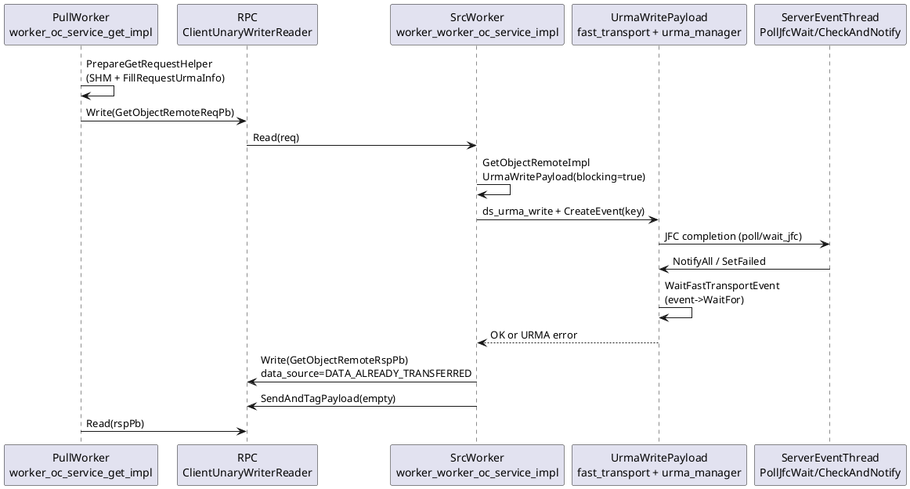

# Remote Get（UB/URMA）现状逻辑梳理

## 关键文件定位（`src/datasystem/worker`）

| 角色                           | 文件                                                                                                                                                                                                | 职责                                                                                                                                                                                                        |
| ---------------------------- | ------------------------------------------------------------------------------------------------------------------------------------------------------------------------------------------------- | --------------------------------------------------------------------------------------------------------------------------------------------------------------------------------------------------------- |
| **RPC 服务端（源 Worker：被 pull）** | `[object_cache/worker_worker_oc_service_impl.cpp](src/datasystem/worker/object_cache/worker_worker_oc_service_impl.cpp)`                                                                          | `GetObjectRemote`：先 `Read(req)`，再 `GetObjectRemote(req,rsp,payload)`（内部 `UrmaWritePayload`），然后 `**Write(rsp)`**，最后 `SendAndTagPayload`（URMA 成功时多为空 payload）                                               |
| **RPC 客户端（拉取 Worker）**       | `[object_cache/service/worker_oc_service_get_impl.cpp](src/datasystem/worker/object_cache/service/worker_oc_service_get_impl.cpp)`                                                                | `PullObjectDataFromRemoteWorker`：`PrepareGetRequestHelper` 分配本地 SHM 并 `**FillRequestUrmaInfo`**，再 `GetObjectRemoteWrite` + `**Read(rspPb)**`；若 `data_source == DATA_IN_PAYLOAD` 则 `RetrieveRemotePayload` |
| **RPC API 封装**               | `[object_cache/worker_worker_oc_api.cpp](src/datasystem/worker/object_cache/worker_worker_oc_api.cpp)`                                                                                            | `GetObjectRemote` / `GetObjectRemoteWrite` 调 `rpcSession_`                                                                                                                                                |
| **面向 Client 的 UB Get 回写**    | `[object_cache/worker_request_manager.cpp](src/datasystem/worker/object_cache/worker_request_manager.cpp)`                                                                                        | `UbWriteHelper`：对客户端下发的 `urma_info` 调 `**UrmaWritePayload(..., blocking=true, keys)`**，失败则回退 TCP payload                                                                                                  |
| **批量 Remote Get**            | 同上 `worker_worker_oc_service_impl.cpp`（`BatchGetObjectRemote`）+ `[service/worker_oc_service_batch_get_impl.cpp](src/datasystem/worker/object_cache/service/worker_oc_service_batch_get_impl.cpp)` | 并行子请求可走 `blocking=false`，随后在 `**WaitFastTransportEvent`** 聚合等待后再 `Write(rsp)`                                                                                                                             |

**URMA 实现（不在 worker 子目录）**：`[src/datasystem/common/rdma/urma_manager.cpp](src/datasystem/common/rdma/urma_manager.cpp)` + `[fast_transport_manager_wrapper.cpp](src/datasystem/common/rdma/fast_transport_manager_wrapper.cpp)`（`UrmaWritePayload`、`WaitFastTransportEvent`）。

---

## 单对象 Worker→Worker Remote Get 时序（UB 开启）

1. **拉取端**：`PrepareGetRequestHelper` 设置 `data_size`，分配/绑定 `ShmUnit`，`FillRequestUrmaInfo` 把本机可写段 VA、offset、`request_address` 等放进 `GetObjectRemoteReqPb`。
2. **RPC**：`GetObjectRemoteWrite(reqPb)` → 对端 `serverApi->Read(req)`。
3. **源端**：`CheckConnectionStable`（URMA/UCP 连接）→ `GetObjectRemoteImpl`：若 `IsUrmaEnabled() && req.has_urma_info()` 且尺寸匹配，则 `**UrmaWritePayload(..., blocking=true, keys)`**（见 `GetObjectRemoteHandler` 传入的 `blocking`，单 Get 为 **true**，见约 121–128 行）。
4. `**UrmaWritePayload`（urma_manager）**：`ds_urma_write` 提交写，为每个 WR 的 `key` `**CreateEvent`**；若 `blocking`，调用 `**WaitFastTransportEvent` → `WaitToFinish` → `event->WaitFor()**`，直到完成或失败。
5. **完成通知路径**：后台 `**ServerEventHandleThreadMain`** 循环 `**PollJfcWait**`（`FLAGS_urma_event_mode` 为真时用 `**ds_urma_wait_jfc` + `ds_urma_poll_jfc**`，否则轮询 `ds_urma_poll_jfc`）→ 将完成的 `user_ctx`（即 key）放入集合 → `**CheckAndNotify**`：`GetEvent` → 失败时 `**event->SetFailed()**` → `**NotifyAll**`。
6. **源端返回 RPC**：`UrmaWritePayload` 阻塞返回成功后，`rsp.set_data_source(DATA_ALREADY_TRANSFERRED)`，再 `**serverApi->Write(rsp)`**，`SendAndTagPayload({})`。
7. **拉取端**：`clientApi->Read(rspPb)` 在 **步骤 6 之后**才收到 meta；数据已在步骤 4–5 期间写入本地 SHM。

**尺寸不一致**：`K_OC_REMOTE_GET_NOT_ENOUGH` 在 `GetObjectRemoteImpl` 中通过 **rsp 内 error + data_size** 返回，注释明确此时 **不会** URMA 写数据（与 `[worker_worker_oc_service_impl.cpp](src/datasystem/worker/object_cache/worker_worker_oc_service_impl.cpp)` 97–100 行一致）；拉取端在 `PullObjectDataFromRemoteWorker` 中按新 `data_size` 重试循环。

---

## 与后续「异步错误经 RPC payload 重试」的关系（现状缺口）

- 当前 **单 Get** 路径：**先**在源 Worker 上 **同步等完 URMA**（`blocking=true`），**再** `Write(rspPb)`，因此调用方通常不会在「RPC 已返回成功 meta、数据未就绪」的状态下推进。
- **Batch** 路径：子请求可先非阻塞写，再 `**WaitFastTransportEvent`** 后统一 `Write(rsp)`（约 685–697 行），仍是 **先发 meta、再等齐**，不是「纯异步错稍后由另一通道告知」。
- 若要做「URMA 异步完成失败 → **rsp/payload 携带可重试错误**」，需要新增协议/状态机（例如在 `GetObjectRemoteRspPb` 或 side channel 中显式错误码、与 `DATA_IN_PAYLOAD` 回退协同），并区分 **源端** 与 **Client UB `UbWriteHelper`** 两条写路径。

---

## PlantUML（单对象 Remote Get + URMA 同步）

---

## 小结

- **Remote Get RPC 的处理核心**：服务端 `[worker_worker_oc_service_impl.cpp](src/datasystem/worker/object_cache/worker_worker_oc_service_impl.cpp)`，实现写 `**GetObjectRemote` / `GetObjectRemoteImpl` / `UrmaWritePayload`**。
- **拉取端拼请求与收包**：`[worker_oc_service_get_impl.cpp](src/datasystem/worker/object_cache/service/worker_oc_service_get_impl.cpp)` 的 `**PullObjectDataFromRemoteWorker`**。
- **UB 同步机制**：`[urma_manager.cpp](src/datasystem/common/rdma/urma_manager.cpp)` 中 **JFC 轮询/事件模式 + 内部 Event**，与 `**WaitToFinish`**；与 RPC 返回顺序配合形成「数据落盘后再回 meta」的当前语义。

