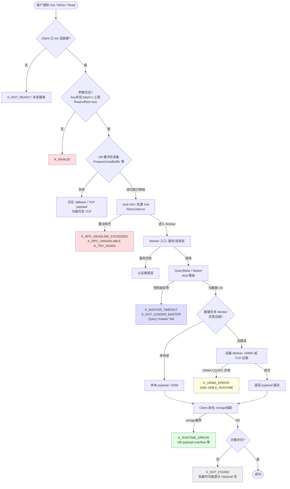
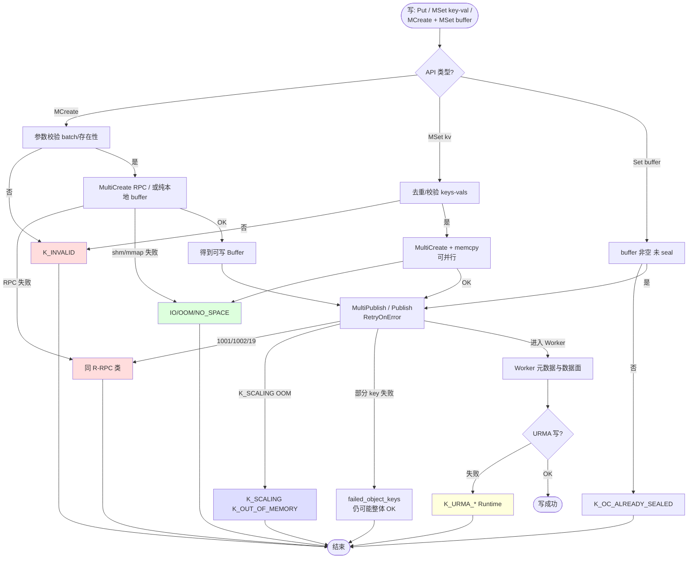
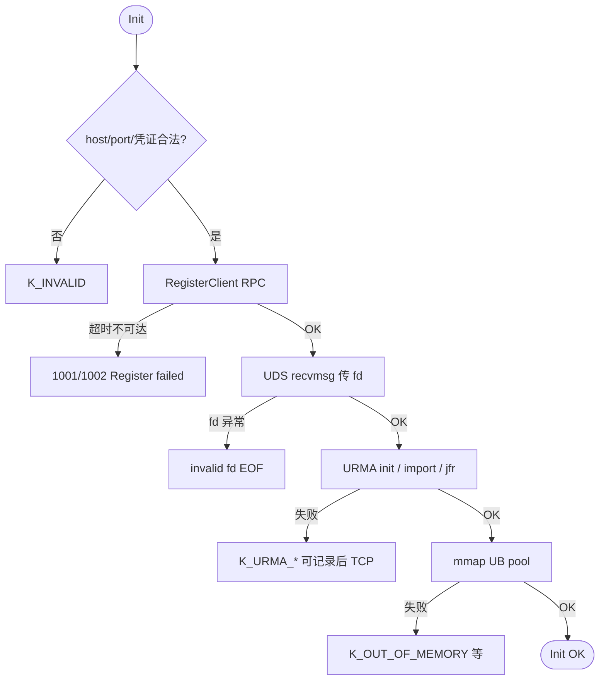

# KV Client 定位定界 — 客户操作手册（读写分支全量 × Trace 粒度）

> **目标**：让使用方按 **「一次 SDK 调用 = 一条请求 Trace」** 上的日志，把问题 **落到具体阶段与责任域**；并有一张 **尽量细的流程图** 对照「代码里可能出现哪些分支」。  
> **配套 PlantUML**：**总图（客户先错误码+手册）** 与 **分图 02～05** 见 [`puml/README-总图与分图.md`](puml/README-总图与分图.md)；时序级见 [`步骤1-Init.puml`](puml/kv-client-定位定界-步骤1-Init.puml)、[`步骤2-读路径Get_MGet.puml`](puml/kv-client-定位定界-步骤2-读路径Get_MGet.puml)、[`步骤3-写路径Put_MSet.puml`](puml/kv-client-定位定界-步骤3-写路径Put_MSet.puml)。  
> **配套 Excel**：[`kv-client-观测-调用链与URMA-TCP.xlsx`](kv-client-观测-调用链与URMA-TCP.xlsx) Sheet5 定界-case。

---

## 1. 观测粒度说明（必读）

| 事实 | 对客户排障的含义 |
|------|------------------|
| **单次请求**在客户端日志里通常有 **TraceID**（与 `TraceGuard` 一致的前缀字段）。 | 你的筛选条件应以 **TraceID = 本次失败调用** 为主，避免把其它请求的日志混进来。 |
| **Worker / 远端**日志是否带 **同一 TraceID**，取决于部署是否全链路透传。 | 若 **只有 Client 日志带 Trace**：你只能 **确定 Client 侧分支**；Worker 行为需 **时间窗 + objectKey + 运维侧检索**，或要求平台补齐 trace 透传。 |
| **分支是否「在代码里存在」≠「本次日志一定能看见」**。 | 例如未走 UB 时不会出现 `urma_*` 行；**未覆盖分支**在覆盖率报告里可能为未染色（见 [`分支覆盖率与定位定界-流程指南.md`](../分支覆盖率与定位定界-流程指南.md)）。 |

**结论**：本手册中的「全量分支」指 **产品设计/代码路径上应考虑的决策点**；**客户在一次工单中能严格证明的**，是 **该 Trace 上实际出现的日志 + SDK 返回码**。

---

## 2. 客户标准操作步骤（SOP）

按顺序执行；任一步可终止并出结论。

| 步骤 | 你要做的事 | 产出 / 判据 |
|------|------------|-------------|
| **1** | 记录 **API 名称**（如 `MGet`）、**参数摘要**（key 个数、timeout、是否 offset 读）、**返回值**（数值码 + 文本）。 | 一行「复现摘要」 |
| **2** | 在 **同一秒级时间窗** 的 Client 日志中，找到该次调用的 **TraceID**（常见为日志前缀中与官方文档一致的 UUID/串）。 | 字符串 `TRACE_ID` |
| **3** | 在日志平台执行过滤：`TraceID == TRACE_ID`（或你们字段名等价写法），时间窗 ±5s。 | 仅该请求的日志序列 |
| **4** | 按时间 **升序** 浏览，标出 **第一条 ERROR** 或 **第一条含失败语义** 的 INFO/WARN（如 `failed`、`error`、`Return`）。 | `FIRST_FAIL_LINE` |
| **5** | 用下面 **§4～§6 分支表**，根据 **返回码 + FIRST_FAIL_LINE 关键词** 圈定 **Branch_ID**。 | 1 个主分支 + 备选 |
| **6** | **URMA 相关**：在同一 Trace 下额外检索 `urma|URMA|jfc|IMPORT|REGISTER|poll|fallback|TCP/IP payload`（大小写按平台）。 | 是否 UB 面参与 |
| **7** | **RPC 相关**：同 Trace 检索 `rpc|RPC|deadline|unavailable|Send.*Get|Send.*Publish|multi publish|Register client`。 | 是否链路超时/不可达 |
| **8** | 打开 Excel **Sheet5**，用 **现象/关键词** 找对应 **Dxx** 行，再跳到 Sheet1 对应 **调用链行**。 | 责任归属 + 下钻列 |
| **9** | 若需 Worker 侧确认：向运维/平台提交 **TRACE_ID + key + 时间 UTC**，索取 **Worker 同源 trace**（若当前没有透传，在工单中标注 **观测缺口**）。 | 工单附件说明 |
| **10** | **性能类**（非明确错误码）：在同一 Trace 时间窗收集 **耗时**；对照 [`kv-client-性能关键路径与采集手册.md`](kv-client-性能关键路径与采集手册.md) 与 Sheet4。 | 是否尾延迟 / 排队 |

**命令行 grep 示例**（离线日志文件时）：

```bash
# 将 TRACE 替换为实际 ID
grep 'TRACE' client.log | grep -Ei 'error|fail|urma|rpc|deadline|mmap|NOT_FOUND|status'

# URMA 是否与该次请求同事务
grep 'TRACE' client.log | grep -Ei 'urma|jfc|IMPORT|fallback|TCP/IP payload'
```

---

## 3. 详细流程图（Mermaid）— 读路径 Get / MGet / Read

> 与 [`步骤2-读路径Get_MGet.puml`](puml/kv-client-定位定界-步骤2-读路径Get_MGet.puml) **一致**，节点更密以便 **打印/评审**。若渲染失败，请用支持 Mermaid 的 IDE 或导出 PNG。



---

## 4. 读路径分支对照表（Trace 上可观测 → 操作）

| Branch_ID | 阶段 | 触发条件 / 代码语义 | 典型返回或日志线索 | Trace 上客户通常能看到？ | 客户下一步 |
|-----------|------|---------------------|-------------------|---------------------------|------------|
| R-PRE-01 | Client | 参数非法 | `K_INVALID` | 是 | 改 key/batch/offset/size |
| R-PRE-02 | Client | 未 Init / ShutDown | `K_NOT_READY` 等 | 是 | 先 Init；禁止并发乱序 |
| R-UB-01 | Client | UB 准备失败 | `fallback` / `TCP/IP payload` 类 | 若有 UB 日志是 | 性能问题看 UB；功能可走 TCP |
| R-RPC-01 | Client→W1 | RPC 重试失败 | `1001` `1002` `19` + Send Get | 是 | Sheet5 D02/D14；查网络/Worker |
| R-META-01 | W2 | etcd/Master | `master` `etcd` `Query` 失败 | 若 trace 到 Worker 是 | 控制面；否则仅 Client 侧超时 |
| R-DAT-01 | W3 远端 | URMA 读 | `urma` `jfc` `1004` `1008` | Client 或 Worker 一侧 | **同 Trace 拉 URMA 行** |
| R-DAT-02 | W3 远端 | TCP 读 | 无 urma 但有 RPC/payload | 是 | 对比 UB 降级 |
| R-ASM-01 | Client | mmap/组装 | `mmap` `overflow` `Runtime` | 是 | OS fd/shm；协议一致性 |
| R-BIZ-01 | 语义 | 不存在 | `NOT_FOUND`；MGet 部分空 | 是 | 业务确认 TTL/写入 |
| R-READ-01 | Read API | offset 非法 | `K_INVALID` / `OUT_OF_RANGE` | 是 | 对齐对象大小 |

---

## 5. 详细流程图（Mermaid）— 写路径（含 MCreate + MSet）

`Put/MSet(keys,vals)` 与 `MCreate+MSet(buffer)` **前半段不同、后半段都落到 Publish/MultiPublish**。



---

## 6. 写路径分支对照表

| Branch_ID | 阶段 | 触发条件 | 典型码/日志 | Trace 可见？ | 客户操作 |
|-----------|------|----------|-------------|--------------|----------|
| W-PRE-01 | Client | keys/vals/batch 非法 | `K_INVALID` | 是 | 对齐接口约束 |
| W-PRE-02 | Client | NX/存在性冲突 | `K_OC_KEY_ALREADY_EXIST` 等 | 是 | 换 key 或删后写 |
| W-MC-01 | Client | MultiCreate 失败 | MultiCreate / shm 错误 | 是 | 对照 R-RPC / R-SHM |
| W-PUB-01 | Client→Worker | MultiPublish 重试失败 | `Send multi publish` `1001/1002` | 是 | 网络/Worker；Sheet5 |
| W-PUB-02 | Client→Worker | 扩缩容窗口 | `K_SCALING` `K_OUT_OF_MEMORY` | 是 | 降并发；等集群稳定 |
| W-PUB-03 | 语义 | 部分失败 | `failed_object_keys` | 是 | 逐 key 重试 |
| W-UR-01 | Worker | URMA 写失败 | `urma` `1004` `1006` | 若 Worker trace 是 | 同 Trace URMA |
| W-UB-02 | Client | UB 单对象直发失败 | `Failed to send buffer via UB` | 是 | UB 池/长度/连接 |

---

## 7. Init 路径 — 流程图与表



| Branch_ID | 典型现象 | Trace 上关键词 | 客户操作 |
|-----------|----------|----------------|----------|
| I-RPC-01 | 连不上 Worker | `Register` `1002` | 端口/路由/防火墙 |
| I-OS-01 | fd 传递失败 | `invalid fd` `EOF` | ulimit/UDS/对端进程 |
| I-UR-01 | UB 初始化失败 | `Failed to urma` `1004` | UMDK/设备/bonding |
| I-MEM-01 | 映射失败 | `mmap` `OOM` | 内存与 vm 参数 |

（与 [`步骤1-Init.puml`](puml/kv-client-定位定界-步骤1-Init.puml) 对齐。）

---

## 8. 「识别所有分支」在工程上如何实现

| 手段 | 作用 |
|------|------|
| **本手册 + 分支表** | 给人看的 **决策树全集（主路径）**；细分到 **模块责任**。 |
| **PlantUML 四张** | **时序级** 分支（alt/opt），适合评审与培训。 |
| **覆盖率 HTML + lcov_branch_coverage=1** | 验证 **哪些分支测试没走到**；与 [`分支覆盖率与定位定界-流程指南.md`](../分支覆盖率与定位定界-流程指南.md) 联动。 |
| **源码** | `object_client_impl.cpp`、`client_worker_remote_api.cpp`、`worker_oc_service_get_impl.cpp` 等为 **最终裁决**。 |

若你希望 **分支表与源码行号自动对齐**，需要在 CI 中增加 **自定义脚本** 从注解或 YAML 生成表（当前手册为 **人工维护 + 版本升级时 diff**）。

---

## 9. 相关文档

| 文档 | 用途 |
|------|------|
| [kv-client-读接口-定位定界.md](../kv-client-读接口-定位定界.md) | 读链路叙述与错误树 |
| [kv-client-写接口-定位定界.md](../kv-client-写接口-定位定界.md) | 写链路含 MCreate/MultiPublish |
| [kv-client-定位定界手册-基于Excel.md](kv-client-定位定界手册-基于Excel.md) | Excel 使用顺序 |
| [workspace/reliability/kv-sdk-fema-使用步骤.md](../../../workspace/reliability/kv-sdk-fema-使用步骤.md) | FEMA 工作簿步骤 |

---

*维护说明：SDK 大版本升级时，请对照 `yuanrong-datasystem` 客户端 Get/Put/MultiCreate/MultiPublish 变更，更新本文件 §4～§7 与 Mermaid。*
