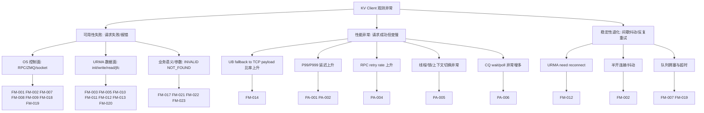

# KV Client 故障模式库：故障清单 · 日志索引 · 告警（含性能）

> **范围**：SDK（client）与 Object Cache Worker 侧 KV Client 相关路径；与 [`../workbook/kv-client/kv-client-观测-调用链与URMA-TCP.xlsx`](../workbook/kv-client/kv-client-观测-调用链与URMA-TCP.xlsx) Sheet1、[`../../../scripts/observable/kv-client-excel/sheet1_system_presets.py`](../../../scripts/observable/kv-client-excel/sheet1_system_presets.py)、[`kv-client-URMA-错误枚举与日志-代码证据.md`](kv-client-URMA-错误枚举与日志-代码证据.md) 对齐。  
> **分层约定**：syscall 传输层 **URMA 与 OS 互斥定界**（见 Sheet1 第 5～8 列）；业务 Status、参数校验等为 **NEITHER**。

---

## 0. 故障树表达（推荐标准）

建议采用三层表达：**故障树（结构） + FM 清单（证据） + 告警清单（运营）**。  
其中故障树只描述“怎么分叉”，叶子节点一律落到 `FM-xxx`，避免图和表脱节。

### 0.1 主树（Mermaid，可直接放 Wiki/Markdown）



### 0.2 与现有时序图的映射

- URMA 分支：对齐 [`puml/kv-client-定位定界-总图-02-URMA.puml`](puml/kv-client-定位定界-总图-02-URMA.puml)
- RPC/网络分支：对齐 [`puml/kv-client-定位定界-总图-03-RPC与网络.puml`](puml/kv-client-定位定界-总图-03-RPC与网络.puml)
- OS/资源分支：对齐 [`puml/kv-client-定位定界-总图-04-OS与资源.puml`](puml/kv-client-定位定界-总图-04-OS与资源.puml)
- 参数/业务分支：对齐 [`puml/kv-client-定位定界-总图-05-参数与业务语义.puml`](puml/kv-client-定位定界-总图-05-参数与业务语义.puml)
- 读写时序证据：分别对齐步骤图 2/3（Get/MGet 与 Put/MSet）

### 0.3 落地规则（避免“画树好看但不好排障”）

- 每个叶子必须绑定一个或多个 `FM-xxx`，不能只写“网络问题/系统问题”
- 每个 `FM-xxx` 必须有日志关键字（见 §2）和责任域（URMA/OS/NEITHER）
- 告警优先接性能叶子（`PA-001~PA-007`），可用性告警在平台落地后补齐

### 0.4 Init / MCreate / MSet / MGet 的“三个关键接口”

以下按每条主流程固定三类接口：**控制面/RPC**、**OS/syscall**、**URMA/UMDK**。  
用于故障树叶子归因时快速判断先查哪一层（与“URMA/OS 互斥定界”一致）。

| 流程 | 关键接口 1（控制面 / RPC） | 关键接口 2（OS / syscall） | 关键接口 3（URMA / UMDK） |
|------|-----------------------------|------------------------------|----------------------------|
| **Init** | `ClientWorkerRemoteApi::Init`，`Connect`，`RegisterClient`，`GetSocketPath` | `socket/connect/send/recv`，`recvmsg(SCM_RIGHTS)`，`mmap`（UB 匿名池） | `ds_urma_init`，`ds_urma_get_device_by_name`，`ds_urma_create_context/jfc/jfs/jfr`，`ds_urma_import_jfr` |
| **MCreate** | `stub_->MCreate` / Worker `ProcessMCreate`（按分支实现） | `open/pwrite/fsync`（若落盘），`sendmsg/recvmsg`（fd/控制面传输） | `ds_urma_write`（若走 UB 数据面），`ds_urma_poll_jfc` |
| **MSet** | `stub_->MultiPublish` / `Publish`，`RetryOnError` | `socket send/recv/poll`，必要时 `mmap`/内存复制 | `UrmaWritePayload`，`ds_urma_write`，`ds_urma_poll_jfc/wait_jfc` |
| **MGet** | `stub_->Get`，`RetryOnError`，Worker `ProcessGetObjectRequest` / `QueryMeta` | `socket send/recv/poll`，`mmap(MmapShmUnit)`，`recvmsg(SCM_RIGHTS)` | `PrepareUrmaBuffer`，`ds_urma_read/write`，`ds_urma_poll_jfc/wait_jfc/rearm_jfc` |

补充：
- 若某次请求命中 `fallback to TCP/IP payload`，该次数据面按 **OS/RPC 路径**排查，URMA 仅作旁证。
- 若出现 `1004/1006` 且命中 `Failed to urma...` / `need to reconnect`，优先走 **URMA 分支**，不要与 `1001/1002` 的 RPC 问题混排。

---

## 1. 故障清单（功能 / 可用性）

| 编号 | 故障模式 | 责任域 | 典型 Status / 内部码 | 典型现象 | 主要日志原文 / 模式（grep） |
|------|----------|--------|------------------------|----------|-----------------------------|
| FM-001 | Init：Register / ZMQ 控制面不可达 | OS | `1001` `K_RPC_DEADLINE_EXCEEDED`，`1002` `K_RPC_UNAVAILABLE` | Init 失败、反复重连 | `Register client failed`；`1001` `1002`；`rpc unavailable`；`deadline exceeded`；worker：`Register client failed because worker is exiting` |
| FM-002 | RPC 已连上后 send/recv 抖动、半开连接 | OS | `1002` `19` `K_TRY_AGAIN` | 间歇超时、try again | `send` `recv` `failed`；`unavailable`；`try again`；`timeout`；stub / zmq 路径 |
| FM-003 | UB 初始化失败（UMDK 设备 / context / jfc 等） | URMA | `1004` `K_URMA_ERROR` | Init 或握手前失败 | `Failed to urma init`；`Failed to urma get device`；`Failed to urma get eid list`；`Failed to urma create context`；`Failed to initialize URMA dlopen loader` |
| FM-004 | 客户端 UB 匿名内存池 mmap 失败 | OS | `6` `K_OUT_OF_MEMORY` | 分配池失败 | `Failed to allocate memory buffer pool for client`；`Failed to register memory buffer pool`；`K_OUT_OF_MEMORY` |
| FM-005 | FastTransport / import jfr / advise jfr 失败 | URMA | 常 `1004` 或握手失败返回链 | UB 握手失败、回退 | `Fast transport handshake failed`；`Failed to import` `jfr`；`advise jfr`；`1004` |
| FM-006 | SCM_RIGHTS 传 fd 异常（RecvPageFd / UDS） | OS | `K_UNKNOWN_ERROR` / `K_RUNTIME_ERROR` 等 | fd 无效、EOF | `Pass fd`；`SCM_RIGHTS`；`recvmsg`；`invalid fd`；`Unexpected EOF` |
| FM-007 | 读路径：Get 请求未达或 ZMQ 超时 | OS | `1001` `1002` `19` | client 超时、worker 无对应 INFO | `Start to send rpc to get object`；`Process Get from client`；`RetryOnError` |
| FM-008 | 读路径：Directory（QueryMeta）失败 | OS | `K_RUNTIME_ERROR` 等 | 元数据查不到、目录分片异常 | `Query from master failed`（日志原文仍为 master）；`QueryMetadataFromMaster` |
| FM-009 | 读路径：W1→W3 拉对象数据失败 | OS | 依封装 | 元数据有、数据拉失败 | `Get from remote failed`；`Failed to get object data from remote`；`ObjectKey` |
| FM-010 | 数据面：urma write / read 失败 | URMA | `5` `1004` 等 | 读写到对端 UB 失败 | `Failed to urma write object`；`Failed to urma read object`；`urma_write`；`urma_read` |
| FM-011 | CQ：poll / wait / rearm jfc 失败 | URMA | `1004` | 完成事件异常、停滞 | `Failed to wait jfc`；`Failed to poll jfc`；`Failed to rearm jfc`；`Polling failed with an error for requestId`；`CR.status` |
| FM-012 | UB 连接状态不稳定 / 需重建 | URMA | `1006` `K_URMA_NEED_CONNECT` | 需重连、抖动 | `URMA_NEED_CONNECT`；`remoteAddress`；`remoteInstanceId`；`remoteWorkerId`；`need reconnect`；`1006` |
| FM-013 | JFS 重建策略（如 CR.status=9 ACK timeout） | URMA | `1004` 等 | 自动 Recreate JFS 失败 | `URMA_RECREATE_JFS`；`URMA_RECREATE_JFS_FAILED`；`URMA_RECREATE_JFS_SKIP`；见 urma_manager 策略表 |
| FM-014 | 客户端 UB Get 缓冲：超上限 / 分配失败 → 降级 TCP payload | NEITHER（功能仍可用，**性能**见 §4） | 常无 URMA 错误码上抛 | 大对象走 TCP、延迟升高 | `UB Get buffer size` `exceeds max`；`fallback to TCP/IP payload`；`UB Get buffer allocation failed` |
| FM-015 | UB payload 与应答尺寸不一致 | NEITHER | 业务返回链 | 解析失败、非法 payload | `UB payload overflow`；`Invalid UB payload size`；`Build UB payload rpc message failed` |
| FM-016 | 客户端 SHM mmap 组装失败 | OS | 依 ToString | Get 响应处理失败 | `Failed for` + `objectKey`；`Get mmap entry failed`；`mmap failed` |
| FM-017 | 业务：对象不存在 | NEITHER | `K_NOT_FOUND` 等 | 正常语义失败 | `Can't find object`；`K_NOT_FOUND` |
| FM-018 | etcd 不可用（租约/路由） | OS | `1002` 等 | W1 侧依赖失败 | `etcd is unavailable`；`etcd` `fail`（以分支实际字符串为准） |
| FM-019 | 写路径：Publish / MultiPublish 控制面超时或不可用 | OS | `1001` `1002` `19` | 写入卡住、失败 | `Start to send rpc to publish object`；`publish object`；`MultiPublish`；`Publish` |
| FM-020 | 写路径：UB 直发失败 | URMA | 依封装 | Put/MSet UB 失败 | `Failed to send buffer via UB`；`UrmaWritePayload`；`urma_write` |
| FM-021 | 写路径：扩缩容 / 内存策略拒绝 | NEITHER | `K_SCALING(32)` `K_OUT_OF_MEMORY(6)` | 批次过大、集群状态 | `K_SCALING`；`MultiPublish` 返回；OOM 相关枚举 |
| FM-022 | 入参非法（HostPort、batch、offset 等） | NEITHER | `K_INVALID` | 未发起下游 | `Invalid`；`out of range`；`OBJECT_KEYS_MAX_SIZE_LIMIT` |
| FM-023 | 业务 last_rc 触发部分 key 重试 | NEITHER | 混合 | 部分成功、重试风暴 | `last_rc`；`IsAllGetFailed`；对齐 worker `ReturnToClient` |

说明：**同一时间段排查时，FM-001～002 与 FM-003 不要混为「都是网络问题」**；先看 Status 与日志是否落在 URMA 固定字符串还是 ZMQ/errno 路径。

---

## 2. 日志与关键字清单（便于统一检索）

下列字符串用于 **现网 / ST 日志聚合** 或 **临时 grep**；具体文件与行号以 [`kv-client-URMA-错误枚举与日志-代码证据.md`](kv-client-URMA-错误枚举与日志-代码证据.md) 为准。

### 2.1 按关键字（建议保存为检索规则）

| 类别 | 关键字或正则片段 | 关联故障编号 |
|------|------------------|--------------|
| ZMQ / RPC | `Register client failed`, `1001`, `1002`, `rpc unavailable`, `deadline exceeded`, `try again`, `send`, `recv`, `zmq_` | FM-001, FM-002, FM-007, FM-019 |
| URMA 初始化 | `Failed to urma init`, `get device by name`, `get eid list`, `create context`, `jfce`, `jfc`, `jfs`, `jfr`, `dlopen loader` | FM-003 |
| URMA 数据面 / CQ | `Failed to urma write`, `Failed to urma read`, `URMA_POLL_ERROR`, `Failed to wait jfc`, `Failed to rearm jfc`, `CR.status`, `requestId` | FM-010, FM-011 |
| URMA 连接 | `URMA_NEED_CONNECT`, `remoteAddress`, `remoteInstanceId`, `remoteWorkerId`, `need reconnect`, `1006` | FM-012 |
| URMA JFS 重建 | `URMA_RECREATE_JFS`, `URMA_RECREATE_JFS_FAILED`, `URMA_RECREATE_JFS_SKIP`, `newJfsId` | FM-013 |
| 握手 / JFR | `Fast transport handshake`, `import`, `jfr`, `advise jfr` | FM-005 |
| 降级（性能敏感） | `fallback to TCP/IP payload`, `UB Get buffer` | FM-014 |
| UB 逻辑错误 | `UB payload overflow`, `Invalid UB payload`, `Build UB payload rpc message failed` | FM-015 |
| fd / UDS | `Pass fd`, `SCM_RIGHTS`, `Unexpected EOF`, `invalid fd` | FM-006 |
| Directory | `Query from master failed` | FM-008 |
| 远程数据 | `Get from remote failed`, `Failed to get object data from remote` | FM-009 |
| 内存 / mmap | `memory buffer pool`, `mmap`, `Get mmap entry`, `K_OUT_OF_MEMORY` | FM-004, FM-016 |
| etcd | `etcd is unavailable`（以实际分支为准） | FM-018 |

### 2.2 一键 grep 示例（开发机）

```bash
# 广谱：RPC + URMA + 降级
grep -E 'Register client failed|1001|1002|Failed to urma|fallback to TCP/IP payload|Failed to poll jfc|Urma connect unstable|1006|Query from master failed' client.log worker.log

# 性能相关（与 §4 告警信号一致）
grep -E 'fallback to TCP/IP payload|RPC timeout|Retry|poll jfc|wait jfc' worker.log sdk.log
```

---

## 3. 告警清单

### 3.1 可用性与错误类告警（当前：**无统一告警机制**）

| 告警 ID | 告警名称 | 级别 | 触发条件（预留） | 通知对象 | 状态 |
|---------|----------|------|------------------|----------|------|
| — | — | — | **当前产品侧未建设日志/指标告警平台，本表留空。** 上线后建议按 §1 故障编号拆分规则，与 Status、日志关键字、TraceId 关联。 | — | **未建设** |

### 3.2 性能异常告警（**建议项**：待接入监控后启用）

以下不依赖「错误日志」，侧重 **SLO 退化** 与 §1 中 **FM-014** 等「非错误但变慢」模式。与 [`kv-client-性能关键路径与采集手册.md`](kv-client-性能关键路径与采集手册.md) 一致。

| 建议告警 ID | 告警名称 | 建议信号 | 建议阈值思路（需按集群基线调参） | 关联故障 / 说明 |
|-------------|----------|----------|----------------------------------|-----------------|
| PA-001 | 读延迟 P99 升高 | 端到端 Get/MGet 耗时直方图或 Trace span | P99 较 7 日同时间段基线上升 ≥ X% 且持续 ≥ N 分钟 | FM-007、FM-010、FM-011、排队 |
| PA-002 | 写延迟 P99 升高 | Put/MSet Publish 耗时 | 同上 | FM-019、FM-020、磁盘/网络 |
| PA-003 | UB 降级为 TCP payload 比率 | 日志计数：`fallback to TCP/IP payload` / 总 Get 请求（或采样） | 单位时间计数 > 基线 3σ 或 > 固定每分钟上限 | **FM-014**；CPU 拷贝放大 |
| PA-004 | RPC 重试率上升 | `RetryOnError` 或框架重试指标 + `1001`/`1002`/`19` 率 | 重试率较基线翻倍且持续 N 分钟 | FM-001、FM-002、FM-007 |
| PA-005 | Worker 上下文切换异常 | `pidstat -w` 或 cgroup / 主机指标 `cswch` | 较基线持续高百分位 | 锁竞争、线程池、阻塞 syscall |
| PA-006 | URMA CQ 等待异常 | 日志：`Failed to wait jfc` / `poll jfc` 频率；若有 UMDK 延迟指标可并入 | 单位时间超过阈值 | FM-011、设备或链路抖动 |
| PA-007 | 控制面与数据面时延背离 | client→W1 RPC span vs W1→W3 数据 span | 一侧正常一侧尖刺 → 分段告警 | 定界 Sheet4 |

**落地建议**：优先接 **PA-003、PA-004**（日志可计数）与 **PA-001、PA-002**（若有 Trace/APM）；主机指标 **PA-005** 作为辅助。阈值 X、N 需在预发按 QPS 与硬件规格校准。

---

## 4. 维护说明

- 新增调用链行时：同步更新 [`../../../scripts/observable/kv-client-excel/sheet1_system_presets.py`](../../../scripts/observable/kv-client-excel/sheet1_system_presets.py) 与本文 **§1** 行（保持编号可追溯）。  
- URMA 枚举与源码日志增删：以 [`kv-client-URMA-错误枚举与日志-代码证据.md`](kv-client-URMA-错误枚举与日志-代码证据.md) 为单一事实来源，本文 **§2** 做索引级同步即可。
