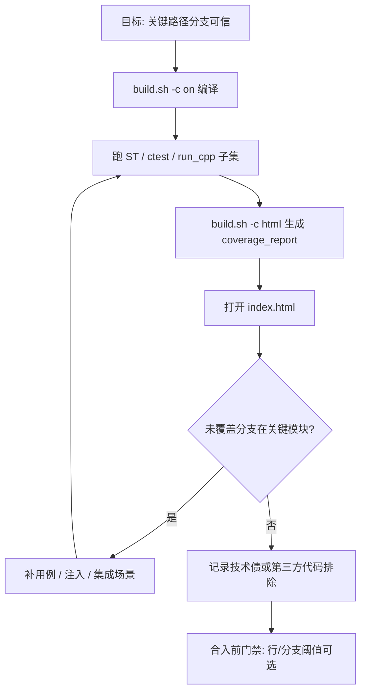
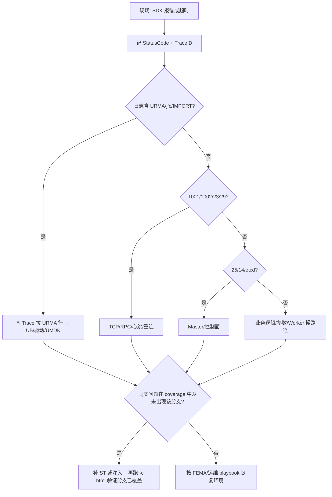

# 分支覆盖率与定位定界 — 流程指南

本文回答两件事：**如何判断代码分支是否被测试覆盖**（含工程上可行的「尽量全覆盖」做法），以及**用一张总流程图把「覆盖率工作」与「线上/工单定位定界」串起来**。与 KV Client 专用 PlantUML 总图互补：[`kv-client-excel/puml/kv-client-定位定界-总图.puml`](kv-client-excel/puml/kv-client-定位定界-总图.puml)。

---

## 1. 能否证明「所有分支都覆盖到了」？

| 说法 | 含义 |
|------|------|
| **数学上「每一个分支都执行过」** | 对大型 C++/多线程/RPC 系统，通常**不现实**也**难以形式化证明**；工程上靠 **插桩统计 + 测试集 + CR 评审** 逼近。 |
| **工程上「可信地覆盖关键分支」** | 使用 **带分支统计的覆盖率报告**（本仓库 `yuanrong-datasystem` 的 `build.sh` 已开启 **`lcov_branch_coverage=1`**），对 **核心业务路径、错误返回路径、URMA/RPC 降级分支** 设阈值并持续补用例。 |
| **与定位定界的关系** | 若某次 **StatusCode / 日志关键词** 对应的分支在报告里**长期未覆盖**，则现场问题可能是 **新路径、配置组合或缺陷**；排障后应 **补 ST 或注入用例** 把该分支染绿。 |

结论：**没有单一按钮保证「全部分支」**；正确做法是 **分支覆盖率 HTML + 关键模块门禁 + 与 FEMA/ observable 对齐的用例矩阵**。

---

## 2. 如何生成分支覆盖率报告（datasystem）

在 **`yuanrong-datasystem` 根目录**（`$DS`）执行（与 [`cmake-non-bazel.md`](../verification/cmake-non-bazel.md) §3 一致）：

```bash
cd "$DS"
bash build.sh -c on -t build
bash build.sh -c html -t run_cpp -l 'st*'
```

- **`-c on`**：打开 `CMake` 的 `BUILD_COVERAGE`（`-fprofile-arcs -ftest-coverage`）。  
- **`-c html`**：聚合 `.gcda` 并调用 **`lcov --rc lcov_branch_coverage=1`**，再 **`genhtml`**。

**报告目录**：一般为 **`$DS/coverage_report/`**，浏览器打开 **`index.html`**。

**brpc / executor 聚焦**（可选）：

```bash
bash "$VIBE/scripts/verify/validate_brpc_kv_executor.sh" --build-dir "$DS/build" --coverage-html
```

（`$VIBE` 为 `vibe-coding-files` 根路径。）

---

## 3. 在报告里看什么（判断是否「覆盖到分支」）

1. **打开 HTML 后进入关心的编译单元**（如 `object_client_impl.cpp`、`urma_manager.cpp`）。  
2. **行颜色**：未执行行为红色/浅色（依主题），表示 **边/基本块未走到**。  
3. **分支信息**：启用 `lcov_branch_coverage=1` 后，**genhtml** 会在页面中体现 **分支覆盖**（未拿全的分支会单独计数）；不同版本 UI 可能显示为 **Branches** 列或行内标记。  
4. **关注**：  
   - `if (rc.IsError())` / `RETURN_IF_NOT_OK` 后的 **错误分支**；  
   - **URMA 失败重试 / fallback TCP**；  
   - **RPC 超时、重连、缩容** 相关分支。  

若某分支**始终未出现**，说明当前 **`run_cpp`/ST 集合** 没有驱动到该条件 —— 需要 **新增用例、故障注入或集成测试**。

---

## 4. 流程图 A：从「想提高覆盖」到「可发布」



---

## 5. 流程图 B：定位定界 × 覆盖率联动（工单思维）

与 **Sheet5 定界-case**、**StatusCode**、**URMA+Trace** 同一套语义；此处强调 **「现象 → 是否缺测试」**。



---

## 6. 相关文档（避免重复造轮子）

| 文档 | 用途 |
|------|------|
| [`docs/verification/cmake-non-bazel.md`](../verification/cmake-non-bazel.md) §3 | 覆盖率命令速查 |
| [`kv-client-excel/puml/kv-client-定位定界-总图.puml`](kv-client-excel/puml/kv-client-定位定界-总图.puml) | **更细**的 Init/读/写 PlantUML 分支 |
| [`kv-client-excel/README.md`](kv-client-excel/README.md) | Excel Sheet5、URMA 证据 md |
| [`workspace/reliability/kv-sdk-fema-使用步骤.md`](../../workspace/reliability/kv-sdk-fema-使用步骤.md) | FEMA 工作簿使用步骤 |
| [`docs/reliability/00-kv-client-visible-status-codes.md`](../reliability/00-kv-client-visible-status-codes.md) | StatusCode 与现象对照 |

---

## 7. 局限说明

- **多进程 / ZMQ / 多线程**：覆盖率进程维度需与 **实际跑测进程** 一致；只跑 client 不跑 worker 时，worker 侧 `.gcda` 可能不更新。  
- **条件编译**（`#ifdef ENABLE_UB` 等）：未编译进的代码不会出现在当前配置的报告里。  
- **第三方库**：通常在 `lcov --remove` 中已排除部分路径；以 `build.sh` 中 **extract/remove** 规则为准。

---

*若你希望把「图 B」固化进 kv-client 观测 xlsx 的新 Sheet，可在 `generate_kv_client_observability_xlsx.py` 中增加一页 Mermaid 文本列。*
