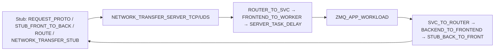

# KV Get 性能定界：分析思路 + 代码 Breakdown 树（合并版）

面向 **metrics_summary** 与 **`[Perf Log]`**（`perf_manager.cpp`，纳秒）联合定界：从端到端不达标收敛到 **client / ZMQ / 入口 worker / master / 对端 worker / URMA / 线程池**。  
代码根路径：`yuanrong-datasystem/src/datasystem/`（下文写相对该目录的路径）。

---

## 一、分析思路（怎么用树定界）

1. **先分进程**：client 日志看 `client_rpc_get_latency`；worker 看 `worker_*` 与 `WORKER_*`；`MASTER_*` 在 master 进程（与 worker 同进程时同一日志会出现两套 key）。
2. **比量级，不做加法**：Perf 有**嵌套**与 **`RecordAndReset`**，子项之和 ≠ 父项；只看**哪段最大、是否与总延迟同量级**。
3. **MsgQ**：`WORKER_GET_OBJECT` 常只覆盖 **入队前**；真实处理看 **`WORKER_PROCESS_GET_OBJECT`**、`worker_process_get_latency`、池队列指标。
4. **Query meta ≠ worker→worker**：`worker_rpc_query_meta_latency` / `WORKER_QUERY_META` 是 **worker→master**；副本间拉数据看 **`WORKER_BATCH_REMOTE_GET_RPC`**（batch）或单对象 **`worker_rpc_remote_get_outbound_latency`**。
5. **Batch remote**：batch 路径**没有**与 unary 完全对应的 outbound metric，RPC 段以 **`WORKER_BATCH_REMOTE_GET_RPC`** 为准。
6. **ZMQ**：tick/lap 类 key 易出现**天文数字**；定界以 **`ZMQ_APP_WORKLOAD`** 与 **WORKER/URMA** 为主；ZMQ **metrics** 中 tick 分段曾不可靠，慎用。
7. **URMA**：写多在**持有数据**侧；wait 多在**请求方**等完成；对照 `worker_urma_write_latency` / `worker_urma_wait_latency` 与 **`URMA_WRITE_*`** / **`URMA_WAIT_*`** / **`FAST_TRANSPORT_TOTAL_EVENT_WAIT`**。

**分层扫视顺序**：压测 P99 ↔ client 指标 → 入口 `WORKER_PROCESS_GET_OBJECT` → `WORKER_QUERY_META` vs **`WORKER_BATCH_REMOTE_GET_RPC`** → 对端 `WORKER_SERVER_GET_REMOTE_*` → **URMA** → **ZMQ_APP_WORKLOAD** 辅证。

---

## 二、Get 全链路 Breakdown 树（代码关联）

`M:` = metrics 直方图（µs，除非另有说明）；`P:` = Perf（ns）。缩进表示**调用/阶段先后**，不是 Perf 统计父子。

```text
[Client] client/object_cache/client_worker_api/client_worker_remote_api.cpp
├── M: client_rpc_get_latency
└── P: RPC_CLIENT_GET_OBJECT          // 含 stub_->Get；USE_URMA 时 Record 在 FillUrmaBuffer 之后

        [ZMQ] common/rpc/zmq/*
        ├── P: ZMQ_NETWORK_TRANSFER_STUB_TCP / …
        ├── P: ZMQ_STUB_FRONT_TO_BACK / ROUTE_MSG / …
        ├── P: ZMQ_NETWORK_TRANSFER_SERVER_TCP    // zmq_server_impl ClientToService
        ├── P: ZMQ_ROUTER_TO_SVC → ZMQ_FRONTEND_TO_WORKER
        ├── P: ZMQ_SERVER_TASK_DELAY
        └── P: ZMQ_APP_WORKLOAD                   // 业务 RPC 处理（定界主看）

[入口 Worker] worker/object_cache/service/worker_oc_service_get_impl.cpp
├── P: WORKER_GET_OBJECT
├── P: WORKER_GET_REQUEST_INIT
└── threadPool Execute / 同步 ProcessGetObjectRequest
    ├── M: worker_get_threadpool_queue_latency / worker_get_threadpool_exec_latency
    ├── M: worker_process_get_latency
    └── P: WORKER_PROCESS_GET_OBJECT
        ├── P: WORKER_PROCESS_GET_FROM_LOCAL（+ CHECK_ROLLBACK / BATCH / UPDATE_REQ）
        └── P: WORKER_PROCESS_GET_FROM_REMOTE
            ├── [Meta] worker/object_cache/worker_master_oc_api.cpp
            │   ├── M: worker_rpc_query_meta_latency
            │   └── P: WORKER_QUERY_META
            │   细段：worker_oc_service_get_impl.cpp
            │   └── P: WORKER_QUERY_META_PRE → ROUTER → BATCH_BY_ADDR → HANDLE_* / OTHER
            └── [跨 Worker] worker_oc_service_get_impl.cpp + worker_oc_service_batch_get_impl.cpp
                ├── P: WORKER_CONSTRUCT_BATCH_GET_REQ
                ├── P: WORKER_GET_BATCH_*（GROUPBY … RUN …）
                ├── P: WORKER_PULL_REMOTE_DATA
                └── P: WORKER_BATCH_GET_CONSTRUCT_AND_SEND
                    └── … PRE → CONSTRUCT_GET_REQUEST → CREATE_REMOTE_API
                    └── P: WORKER_BATCH_GET_SEND_AND_RECV
                        └── P: WORKER_BATCH_REMOTE_GET_RPC
                            └── WorkerRemoteWorkerOCApi::BatchGetObjectRemote
                                （worker_worker_oc_api.cpp；unary 才有 M: remote_get_outbound）

[对端 Worker] worker/object_cache/worker_worker_oc_service_impl.cpp
├── M: worker_rpc_remote_get_inbound_latency
├── P: WORKER_SERVER_GET_REMOTE
│   └── P: READ → IMPL → WRITE → SENDPAYLOAD
├── P: WORKER_SERVER_BATCH_GET_REMOTE
└── LoadObjectData
    ├── P: WORKER_LOAD_OBJECT_DATA
    ├── P: WORKER_REMOTE_GET_READ_KEY → PAYLOAD_* / FROM_DISK → WORKER_REMOTE_GET_PAYLOAD
    └── P: WORKER_REMOTE_GET_RESP
        └── UrmaWritePayload 等

[URMA] common/rdma/urma_manager.cpp、urma_resource.cpp、worker_worker_oc_service_impl.cpp
├── M: worker_urma_write_latency / worker_urma_wait_latency
├── P: URMA_WRITE_TOTAL → FIND_CONNECTION → FIND_REMOTE_SEGMENT
│       → REGISTER_LOCAL_SEGMENT → WRITE_LOOP / URMA_WRITE_SINGLE
├── P: URMA_WAIT_TO_FINISH / URMA_WAIT_TIME
├── P: FAST_TRANSPORT_TOTAL_EVENT_WAIT
└── 冷路径：URMA_SETUP_CONNECTION、URMA_IMPORT_*、URMA_IMPORT_JFR、URMA_REGISTER_SEGMENT

[回 Client] worker/object_cache/worker_request_manager.cpp
└── P: WORKER_RETURN_TO_CLIENT_PRE → CONSTRUCT_RESPONSE → OTHER
```

---

## 三、ZMQ / URMA 子树（逻辑层次）

与 **第二节** 互补：只看传输与数据面时的缩略树。

### 3.1 ZMQ（Stub ↔ Server ↔ 业务）



横切：`ZMQ_COM_*` 解析/序列化；`ZMQ_SOCKET_*`；生成代码 `ZMQ_ADAPTOR_LAYER_*` → `ZMQ_*_RPC`（见 `stub_cpp_generator.cpp`）。

### 3.2 URMA（冷启动 → 写 → 等完成）

```text
URMA_MANAGER_INIT / URMA_SETUP_CONNECTION / URMA_IMPORT_* / URMA_IMPORT_JFR（冷）
URMA_WRITE_TOTAL
├── URMA_WRITE_FIND_CONNECTION
├── URMA_WRITE_FIND_REMOTE_SEGMENT
├── URMA_WRITE_REGISTER_LOCAL_SEGMENT
└── URMA_WRITE_LOOP → URMA_WRITE_SINGLE
URMA_WAIT_* / FAST_TRANSPORT_TOTAL_EVENT_WAIT
Batch: URMA_GATHER_MEMSET、URMA_GATHER_WRITE_DO
```

概念嵌套：**`WORKER_BATCH_REMOTE_GET_RPC`** → 对端 **`WORKER_SERVER_GET_REMOTE_IMPL`** → **`WORKER_LOAD_OBJECT_DATA`** → **`UrmaWritePayload`** → **`URMA_WRITE_*`** → **`URMA_WAIT_*` / FAST_TRANSPORT**。

---

## 四、Perf Key → 代码速查表（节选）

| 前缀/Key | 主要文件 | 备注 |
|----------|----------|------|
| `WORKER_PROCESS_GET_*`、`WORKER_PULL_*`、`WORKER_CONSTRUCT_BATCH_*` | `worker_oc_service_get_impl.cpp`、`worker_oc_service_batch_get_impl.cpp` | Get 主链 |
| `WORKER_QUERY_META` | `worker_master_oc_api.cpp` | 与 `worker_rpc_query_meta_latency` 同段 |
| `WORKER_SERVER_GET_REMOTE_*`、`WORKER_LOAD_OBJECT_DATA`、`WORKER_REMOTE_GET_*` | `worker_worker_oc_service_impl.cpp` | 对端服务 |
| `WORKER_RPC_STUB_CACHE_*` | `rpc_stub_cache_mgr.cpp` | Worker-Worker stub 缓存 |
| `WORKER_RETURN_TO_CLIENT_*` | `worker_request_manager.cpp` | 回包 |
| `MASTER_*` | `master/object_cache/master_oc_service_impl.cpp`、`oc_metadata_manager.cpp`、`object_meta_store.cpp` | Master 侧 |
| `JEMALLOC_*`、`ALLOCATE_*` | `shared_memory/arena.cpp`、`jemalloc.cpp`、`mmap/base_mmap.cpp` | 分配器 |
| `ZMQ_*` | `zmq_service.cpp`、`zmq_server_impl.cpp`、`zmq_stub_conn.cpp`、`zmq_common.h`、… | 部分为 lap tick |
| `URMA_*`、`FAST_TRANSPORT_*` | `urma_manager.cpp`、`urma_resource.cpp`、`worker_worker_oc_service_impl.cpp` | 数据面 |
| `LOG_MESSAGE_*`、`GET_MESSAGE_LOGGER`、`APPEND_LOG_*` | `log/spdlog/log_message_impl.cpp` | 高频，易占统计 |

完整 key 列表以 `common/perf/perf_point.def` 为准。

---

## 五、快速落点表

| 根因方向 | 典型信号 |
|----------|----------|
| Client / UB | `client_rpc_get_latency`↑，`RPC_CLIENT_GET_OBJECT`↑，worker 处理不高 |
| 线程池 | `worker_get_threadpool_queue_latency`↑ |
| Master | `WORKER_QUERY_META`↑，`MASTER_QUERY_META*`↑ |
| 跨 Worker RPC | `WORKER_BATCH_REMOTE_GET_RPC`↑ 或 `worker_rpc_remote_get_outbound_latency`↑ |
| 对端 IO/计算 | 对端 `WORKER_SERVER_GET_REMOTE_IMPL`、`WORKER_REMOTE_GET_PAYLOAD*`↑ |
| URMA | `URMA_WAIT_*`、`FAST_TRANSPORT_TOTAL_EVENT_WAIT`↑ 或 `URMA_WRITE_*`↑ |
| 纯传输疑云 | 总延迟高但 `ZMQ_APP_WORKLOAD` 不高；慎信 `NETWORK_TRANSFER_*` 极大值 |

---

## 六、辅助工具与日志

- 从 glog 抽 metrics + 节选 Perf：`scripts/metrics/gen_kv_perf_report.py`（输出示例：`docs/yche-perf-report.md`）。`--ascii-tree` 会在 **metrics_summary 所在行附近** 解析 `[Perf Log]:` 块：图 1 末尾增加 **Perf 关键锚点**，图 2 开头为 **Perf 细化分组树**（与 metrics 两套数据勿混加）；无 Perf 时会有占位说明。
- 同日志混有 `MASTER_*` 与 `WORKER_*` 时，确认是否 **同进程多角色** 或 **日志合并**。
- **yche.log 类 Perf**：嵌套导致不可加；`ZMQ_NETWORK_TRANSFER_*`、`ZMQ_SVC_TO_ROUTER` 等极大 avg 多属 **tick/时钟异常**。

---

*合并自原「定界逻辑」「Perf Key 走读」「ZMQ/URMA 子树」三份材料；后续只维护本文件即可。*
