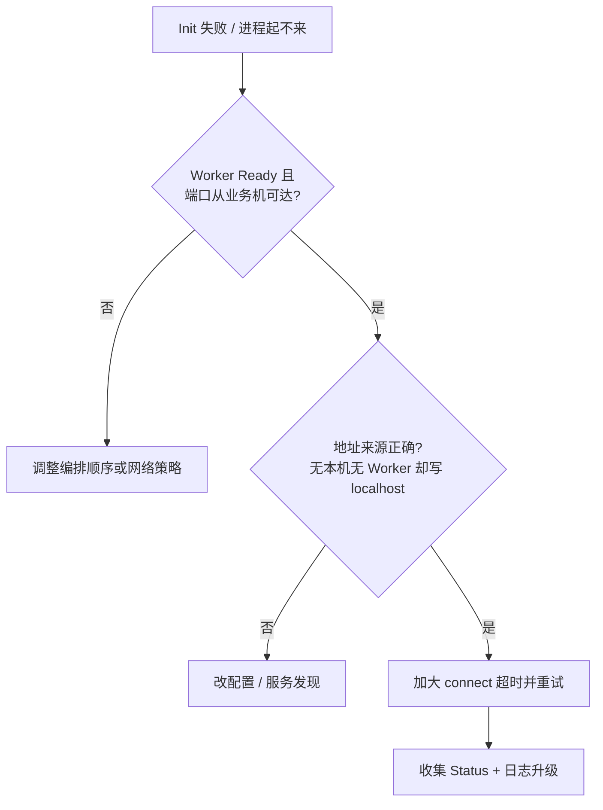
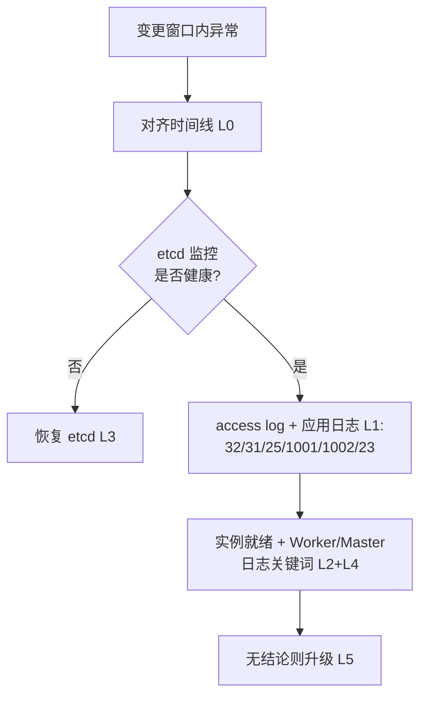

# 运维部署与扩缩容操作失败：排查逻辑（与当前方案对齐）

面向：**KVC 故障检测** 中 **运维侧主动操作**（发布、Worker 扩缩容、自愿缩容、元数据迁移窗口）**未按预期完成**或与 **控制面异常** 叠加；以及 **部署冷启动** 时 **业务进程（集成 SDK）与 Worker** 的 **初始化与建链**（含 **本机无 Worker、首连远端 Worker**）。

**方案锚点**：[FAULT_HANDLING_AND_DATA_RELIABILITY.md](../../plans/kv_client_triage/FAULT_HANDLING_AND_DATA_RELIABILITY.md) **§二–§四**。**客户端码与 31/32**：[kv-client-scaling-scale-down-client-paths.md](./kv-client-scaling-scale-down-client-paths.md)、Playbook **§4.2 / §4.3**。**建链细节（研发向）**：[CLIENT_WORKER_AND_WORKER_WORKER_LINK_FAILURE_ANALYSIS.md](../../plans/kv_client_triage/CLIENT_WORKER_AND_WORKER_WORKER_LINK_FAILURE_ANALYSIS.md)。

---

## 排查前置：可观测项与操作清单（优先读）

排障时 **不要求** 先会看 etcd 里 ring 的 CAS、key 修订号等实现细节。按下面 **分层** 从上到下做；**上一层能定界就不必下钻**。

### 分层总表

| 层级 | 典型谁来看 | **具体观测什么**（可操作） | 判读要点 |
|------|------------|---------------------------|----------|
| **L0 业务与编排** | 业务 SRE / 集成方 | **变更时间线**（发布单、滚动批次、etcd 维护窗）；业务监控 **KV 读/写成功率、P99**；进程是否 **反复重启** | 现象是否与 **变更窗口** 对齐 |
| **L1 客户端落盘** | 集成方 | **`ds_client_access_<pid>.log`**（见 Playbook §1）：按 `handleName` 聚合 **第一列 code**；**`Init` 失败**时看 **应用日志**里的 `Status` / 错误串（冷启动常 **早于** access 行） | **32** 写路径聚集、**1001/1002/23** 突发、**31** 与探活 |
| **L2 实例与网络** | 运维 | **Worker / Master / 业务 Pod** 是否 Running、**Ready 探针**是否通过；从业务机 **`telnet`/`nc` 目标 `ip:port`**；云平台 **安全组 / 网络策略** | 冷启动 **连不上** 时优先层 |
| **L3 etcd 与基础设施** | 平台运维 | **etcd 配套监控**（成员健康、是否有 leader、读写延迟/失败率、告警是否触发）；**全集群 etcd 不可用** 时按方案 **§四** 理解「扩缩容/隔离会卡」 | **不必** 打开 CAS；监控 **不健康** 即升级给平台 |
| **L4 Worker / Master 日志** | 平台 / 二线 | 在 **已锁定节点** 上拉 **ERROR/WARN**（见下节 **关键词**）；可选拉 **`resource.log`**（`log_monitor`）看 **RPC 池排队、etcd 队列/成功率、SHM** 等与变更对齐（见 [kv-client-worker-resource-log-triage.md](./kv-client-worker-resource-log-triage.md)），按 **时间戳** 与变更对齐 | 用于确认 **缩容/迁移/元数据** 是否在报错，以及 **服务端是否排队/控制面是否异常** |
| **L5 实现级深挖** | 研发 | etcd 内 ring 对比、源码路径、抓包 | 仅 L0–L4 **仍无结论** 时启用 |

### L1：客户端侧 **你要打开的文件 / 指标**

| 观测物 | 路径或位置 | 怎么用 |
|--------|------------|--------|
| Access log | `{log_dir}/ds_client_access_{pid}.log`，或环境变量覆盖名（Playbook §1.2） | `grep DS_KV_CLIENT_SET` / `GET`，统计 **第一列 code**；对照 **变更时间** |
| 应用日志 | 业务进程标准输出 / 你们统一日志平台 | 搜 **`Init` 失败**、`KVClient`、`StatusCode`、**1001/1002/8/23/25/31/32** |
| 业务监控 | 负载均衡 / APM / 自建看板 | **成功率、P99** 是否与 **单一 code** 或 **单一批次实例** 相关 |

### L3：etcd **看什么、不看什么**

| 建议看 | 不建议一线强依赖 |
|--------|------------------|
| **监控大盘**：集群是否 quorum、leader 切换、请求错误、延迟突刺 | 手工比对 **ring 的 CAS 是否成功**（属 L5） |
| **告警**：etcd 全挂、单 AZ 网络断 | 理解 **「控制面卡住时，数据面可能仍部分可读」** 即可（FH §四） |

### L4：Worker / Master 日志 **可选关键词**（有权限再 grep）

下列仅作 **线索**，不同版本文案可能略有差异；**命中后再把片段交给平台/研发**，不要求一线读懂内部状态机。

- **缩容 / 迁移**：`scale down`、`voluntary scale`、`migrate`、`Scale down failed`、`task id has expired`  
- **容量与放弃**：`no available nodes`、`Give up voluntary`  
- **元数据繁忙**（与客户端 **32** 呼应）：`scaling`、`meta`、`moving`（具体组合以日志为准）

---

## 0. 部署冷启动：业务（集成 SDK）与 Worker 初始化 / 建链

### 0.1 拓扑与 `cases.md` 对照（背景）

| FEMA / cases | 场景 | 对冷启动的含义 |
|-------|------|----------------|
| **1 / 4** | 本机有 Worker | 通常连 **本机端口**，路径最短。 |
| **2 / 5 / 6** | 本机无 Worker | **合法形态**：必须连 **远端** 或 **服务发现**；忌 **localhost**。 |
| **3** | 仅 Worker 部署 | **Worker Ready 应早于** 业务起，否则 `Init` 易失败。 |

### 0.2 冷启动时 **观测什么**（对齐 L0–L2）

| 步骤 | 观测 | 操作 |
|------|------|------|
| 1 | 业务进程 **是否因 Init 退出/重启** | 看 **编排事件**、应用 **退出码**、启动日志里 **`Init` 返回的 Status** |
| 2 | **目标 Worker 是否就绪** | **K8s Ready / 进程存活**；从业务机 **`nc -vz ip port`** |
| 3 | **地址是否配错** | 配置中心或环境变量：**本机无 Worker 时不能写本机地址**；服务发现是否 **返回空/旧 IP** |
| 4 | **超时是否过短** | 跨机首连时 **`connectTimeoutMs`** 是否明显低于网络 RTT×重试余量 |
| 5 | 仍失败 | 带上 **Status 全文 + 时间线** 升级；研发侧再对 [CLIENT_WORKER…](../../plans/kv_client_triage/CLIENT_WORKER_AND_WORKER_WORKER_LINK_FAILURE_ANALYSIS.md) |

（`Init` 内部先后调 RPC 建连、监听心跳等，**不必**为排障背顺序；**以日志里的错误码与英文 msg 为准**，对照 Playbook **§4.2**。）

### 0.3 冷启动流程图（决策用）

---

## 1. 与「有机故障」的区分

| 维度 | 有机故障 | 运维/部署类 |
|------|----------|-------------|
| **时间** | 与发布无必然关系 | 与 **变更工单、滚动、维护窗** 强相关 |
| **控制面** | etcd 多可用 | **etcd 监控异常** 时，优先按 **L3** 处理，不先猜 ring 细节 |
| **客户端** | 23 / 1001 / 1002 突发 | 多见 **32**、**31**、**25**；或 **Init 即失败**（见 **「0. 部署冷启动」**） |

**产品语义**：扩缩容对用户语义为 **元数据重定向、不中断**；排障目标是 **恢复服务与完成变更**，业务不按 31/32 做用户分支（Playbook **§4.3**）。

---

## 2. 运行中变更：按可观测信号推进（原「排查逻辑」）

下列步骤 **每一步都对应上表 L0–L4**，**不依赖** CAS 是否完成。

### 步骤 1：对齐时间与业务监控（L0）

- 记录 **变更开始/结束时间**、受影响 **AZ/集群/批次**。  
- 看 **KV 成功率、P99** 是否仅 KV 路径异常（可与 TREE 配合）。

### 步骤 2：etcd 是否健康（L3）

- 看 **etcd 监控**：quorum、leader、错误率/延迟。  
- **若 etcd 整体故障**：按 FH **§四**，预期 **扩缩容/隔离卡住**；**优先恢复 etcd**，不要只在客户端调超时。

### 步骤 3：客户端 access log + 应用日志（L1）

- **32** 在写接口上是否增多 → 提示 **元数据侧繁忙或变更中**（与 Playbook 表一致）。  
- **25**、**1001/1002/23** → 按 Playbook **§4.2** 做链路侧排查。  
- **31** 与 **HealthCheck** / 探活 → **LB 应摘掉** 正在退出的后端。

### 步骤 4：实例与 Worker/Master 日志（L2 + L4）

- **Pod/进程** 是否 CrashLoop、OOM、探针失败。  
- 在 **涉事 Worker/Master** 上按 **前置「关键词」** 拉 ERROR/WARN，**时间戳** 对齐变更。  
- **仍无结论**：工单附上 **监控截图 + access 聚合 + 日志片段**，走 **L5**。

### 步骤 5：仍不清

- [KV_CLIENT_FAULT_TRIAGE_TREE.md](../../plans/kv_client_triage/KV_CLIENT_FAULT_TRIAGE_TREE.md) 与 Playbook **§4.2**。

---

## 3. 与 FEMA 业务流程编号的对应

| FEMA / cases | 场景 | 一线侧重观测 |
|-------|------|--------------|
| 7 / 8 | 业务扩缩容 | 业务实例与 Worker **拓扑**、**23**、监控 |
| 9 / 10 | Worker 扩缩容 | **etcd 监控**、**32/31**、Worker **日志关键词** |
| 4–6 | 跨节点读 | **路由/服务发现** 是否仍指向 **已下线** 后端 |
| 1–3 | 业务 + Worker 部署 | **「0. 部署冷启动」**、Ready 探针、**端口可达** |

---

## 4. 修订记录

- 初版：对齐 FH、Playbook、cases；源码级关键词供对照。  
- 补充 **「0. 部署冷启动」** 与 CLIENT_WORKER 链接。  
- **可操作性改版**：增加 **排查前置（分层观测清单）**；**弱化 CAS/HashRing 实现细节**，改为 **监控 + access log + 应用日志 + 日志关键词 + 升级路径**。
