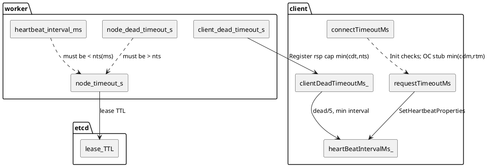
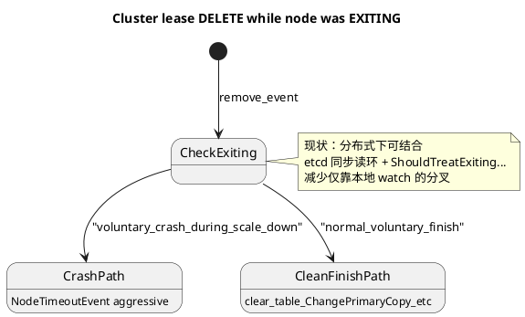
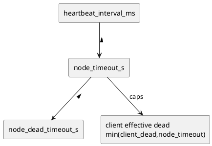

# 关键参数语义与配置（现状）

## Worker / 集群 / etcd 侧

| 参数                                                                                                     | 默认值（代码） | 语义（当前实现）                                                                                                                                                                                                                                   | 硬约束 / 校验                                                                                                                                                                                                                                                   | 配置建议                                                                           |
| ------------------------------------------------------------------------------------------------------ | ------- | ------------------------------------------------------------------------------------------------------------------------------------------------------------------------------------------------------------------------------------------ | ---------------------------------------------------------------------------------------------------------------------------------------------------------------------------------------------------------------------------------------------------------- | ------------------------------------------------------------------------------ |
| `[node_timeout_s](src/datasystem/common/util/gflag/common_gflag_define.cpp)`                           | 60      | etcd **lease TTL（秒）**；与 keep-alive 续约强相关；过短易触发 key 删除与集群 remove 事件                                                                                                                                                                         | 启动：`[EtcdClusterManager::Init](src/datasystem/worker/cluster_manager/etcd_cluster_manager.cpp)` 要求 `node_timeout_s * 1000 > heartbeat_interval_ms`；`[ValidateNodeTimeout](src/datasystem/common/util/validator.h)`：`>= NODE_TIMEOUT_LIMIT(1)` 且避免乘 1000 溢出 | 缩短「故障发现」时同步减小 `heartbeat_interval_ms`；为**原地重启**留足：进程起来 + InitRing + 续约成功 的典型时间 |
| `[node_dead_timeout_s](src/datasystem/common/util/gflag/common_gflag_define.cpp)`                      | 300     | **故障隔离 / 判死**更长窗口；与 `node_timeout_s` 共同刻画「失联后多久做更激进动作」；见 `[ClusterNode::DemoteTimedOutNode](src/datasystem/worker/cluster_manager/cluster_node.h)`、`[etcd_store` keep-alive 失败与 Put 拒绝](src/datasystem/common/kvstore/etcd/etcd_store.cpp) | `node_dead_timeout_s > node_timeout_s`（启动 + 热更 `[WorkerValidateNodeDeadTimeoutS](src/datasystem/worker/worker_update_flag_check.cpp)`）                                                                                                                     | `**dead - node` 的差值**应覆盖典型重启 + ring 收敛；只改小 `dead` 而不改 `node` 可能违反校验或挤压安全窗      |
| `[heartbeat_interval_ms](src/datasystem/common/kvstore/etcd/etcd_keep_alive.cpp)`                      | 1000    | etcd 续约/心跳相关间隔                                                                                                                                                                                                                             | 必须 **小于** `node_timeout_s` 换算成的毫秒数                                                                                                                                                                                                                         | 与 `node_timeout_s` 联动调小                                                        |
| `[auto_del_dead_node](src/datasystem/common/util/gflag/common_gflag_define.cpp)`                       | true    | 是否自动从 hash ring 剔除死节点等                                                                                                                                                                                                                     | 与 `node_dead_timeout_s` 等共同影响是否 SIGKILL / 禁止写 etcd 等路径                                                                                                                                                                                                     | 排障时可临时关闭以观察，生产需明确 SLA                                                          |
| `[passive_scale_down_ring_recheck_delay_ms](src/datasystem/common/util/gflag/common_gflag_define.cpp)` | **0**   | **仅本地被动 SIGKILL 前**：若 >0 且非集中式 master，sleep 后 **再读 etcd 环**；若本机在环上为 **ACTIVE** 且不在 `del_node_info`，则 `UpdateRing` 并**放弃 SIGKILL**（缓解短暂视图不一致）                                                                                               | 无额外校验；0 = 与旧行为一致                                                                                                                                                                                                                                           | 需要更稳的「误杀防护」时可设 1–3s 量级，按环境调；会增加最坏情况下的退出延迟                                      |

## Client / 心跳 / RPC 侧

| 参数                                                                                                                                 | 语义                                                                                                                                       | 约束                                                  | 配置建议                                                        |
| ---------------------------------------------------------------------------------------------------------------------------------- | ---------------------------------------------------------------------------------------------------------------------------------------- | --------------------------------------------------- | ----------------------------------------------------------- |
| `[client_dead_timeout_s](src/datasystem/worker/client_manager/client_info.cpp)`                                                    | Worker 判定 **client 失活**（RPC 心跳场景 `[ClientInfo::IsClientLost](src/datasystem/worker/client_manager/client_info.cpp)`）                     | 非 UT：`>= 3` 秒且上限防 ms 溢出（注释写 15 与代码 min=3 不一致，以校验为准） | 与业务心跳频率、网络抖动匹配                                              |
| **下发给 client 的有效 dead**                                                                                                            | Register 响应：`[min(client_dead_timeout_s, node_timeout_s)](src/datasystem/worker/worker_service_impl.cpp)`                                | 隐含：`client` 侧感知的 dead **不超过** `node_timeout_s`      | 调小 `node_timeout_s` 会**自动压低** client 侧 effective dead，心跳会更密 |
| `[MIN_HEARTBEAT_TIMEOUT_MS` 等](src/datasystem/client/client_worker_common_api.h)                                                   | Client 侧心跳 RPC 超时、间隔上界/下界（与 `SetHeartbeatProperties`](src/datasystem/client/client_worker_common_api.cpp) 中 `clientDead/3`、`dead/5` 等组合） | 老 worker 返回 0 时退化为 15s 等                            | 与 `requestTimeoutMs` 一起考虑                                   |
| `[RPC_MINIMUM_TIMEOUT](src/datasystem/common/rpc/rpc_constants.h)`（500 ms）                                                         | `[ClientWorkerRemoteCommonApi::Init](src/datasystem/client/client_worker_common_api.cpp)` 要求 `connectTimeoutMs >= 500`                   | 硬下限                                                 | connect 过短会直接 Init 失败                                       |
| **requestTimeoutMs**                                                                                                               | 总超时驱动 `[SetRpcTimeout](src/datasystem/client/client_worker_common_api.cpp)`，影响单次 RPC deadline 拆分                                         | 允许 0 的检查在 Init 中为 `>= 0`                            | 长任务需足够大；过短易误判与重试风暴                                          |
| **connectTimeoutMs**                                                                                                               | 建连 / Register 等握手超时                                                                                                                      | `>= 500`                                            | 按 RTT 与重试设；不必等同 request                                     |
| **OC stub 超时**（`[ClientWorkerRemoteApi::Init](src/datasystem/client/object_cache/client_worker_api/client_worker_remote_api.cpp)`） | 在 `clientDeadTimeoutMs_ > 0` 时，stub 使用 `**min(clientDeadTimeoutMs_, requestTimeoutMs)`**（变量名虽为 connect，实现与 request 取小）                   | 心跳/短 RPC 不会长于该上界                                    | `requestTimeoutMs` 过小会连带压短 stub 超时                          |

## 「limit」类常量

- `**NODE_TIMEOUT_LIMIT`**（`[validator.h](src/datasystem/common/util/validator.h)` = 1）：`node_timeout_s` 合法下限（秒），不是业务上的「推荐最小隔离时间」。
- **client_dead**：无单独 `*_limit` 常量名；下限由 **validator** 与 **min(client_dead, node_timeout)** 共同约束。

---

# PlantUML（辅助理解）

## 1）超时参数与角色关系（组件视角）

## 2）EXITING 节点 lease 删除后，观察者分支（逻辑状态）

## 3）配置联动（简化的依赖）

---

# 「被动缩容隔离 vs 原地重启」判断不一致：影响抽象

**问题本质**：系统把多种物理现实（进程崩溃、网络分区、lease 到期、主动 EXITING、ring 迁移中间态）映射到**有限几个离散决策**（对账、迁移、从环剔除、SIGTERM/SIGKILL、认为重启等）。信号来自 **etcd 多键**（cluster 表、ring 单 key）+ **各节点本地 watch 缓存**，且存在 **事件重排/延迟**（如 `[tmpClusterEvents](src/datasystem/worker/cluster_manager/etcd_cluster_manager.cpp)_` 在环未 workable 时缓存 cluster 事件）。

**直接影响（工程上）**：

- **元数据与主副本决策不一致**：部分节点走「正常缩容结束」清理，部分走「崩溃中缩容」强通知，导致迁移/主切换/客户端重连节奏不一致。
- **可用性与数据风险窗口**：误判可能拉长隔离时间，或相反过早剔除/误杀仍在恢复中的进程。
- **排障困难**：同一时刻不同节点日志对「同一地址」叙述不同（restart vs passive），若无统一 revision/trace 难以对齐。

**仓库已做的部分缓解（供 review 时对照）**：

- `[VoluntaryExitRemoveLooksLikeCrashDuringScaleDown](src/datasystem/worker/cluster_manager/etcd_cluster_manager.cpp)`：EXITING + remove 分支分类时，分布式场景下 **优先同步读 etcd 环** 再 fallback 本地环。
- `[worker_incarnation](src/datasystem/protos/hash_ring.proto)` + InitRing 赋值：为「同地址重新入环」提供世代字段（老数据为 0）；**尚未**看到全链路用它统一所有 restart/passive 叙事，属于可扩展点。
- `[passive_scale_down_ring_recheck_delay_ms](src/datasystem/common/util/gflag/common_gflag_define.cpp)`：本地被动 SIGKILL 前的 **etcd 环二次确认**（默认关）。

---

# 修改建议方案（供你 review，按侵入性大致递增）

1. **单一权威 + 顺序**（与计划文档一致）
  凡触发迁移/主变更/剔除的决策，以 `**HashRingPb` + mod_revision** 为准；cluster 表只做辅助。可扩展：在 dequeue 时对「cluster remove + ring 未更新到某 revision」做短暂合并或延迟判定。
2. **显式世代 / epoch 全链路使用**
  已有 `worker_incarnation`：可在 **add 事件、RPC GetClusterState、日志** 中携带并比较 `(addr, incarnation)`，将「重启 vs 新实例 vs 被动剔除」收敛为可比较三元组；需约定 bump 规则与 0 的兼容语义。
3. **强副作用前仲裁**
  在 `RemoveDeadWorkerEvent` / `ChangePrimaryCopy` / SIGKILL 等路径前，增加 **可配置宽限** + 再读环或 **多副本 GetClusterState 对账**（`[ReconcileClusterInfo](src/datasystem/worker/worker_oc_server.cpp)` / `[CompareHashRingWorkersForClusterReconcile](src/datasystem/worker/cluster_manager/cluster_ring_reconcile_utils.h)` 可作为范式）。
4. **协议/运维约束**
  规定 EXITING 与 ring 上 LEAVING/`del_node_info` 的**因果顺序**，减少「先 EXITING 后崩」造成的歧义窗口。
5. **可观测性**
  结构化日志：同一事件打 **cluster_mod_rev + ring_mod_rev + 本地分类结果 + worker_incarnation**（若可用），缩短分歧复盘成本。

---

若你希望下一步把某一条方案落到「具体改哪些函数、兼容策略、默认 flag」，可在 Agent 模式下指定优先级（例如只做 OtherAZ 的同步读环对齐，或把 `worker_incarnation` 接到 Register/GetClusterState）。