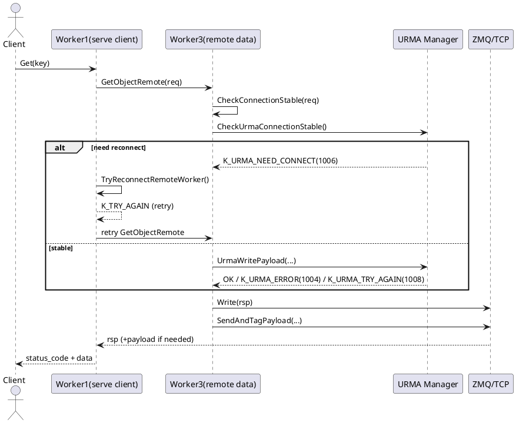
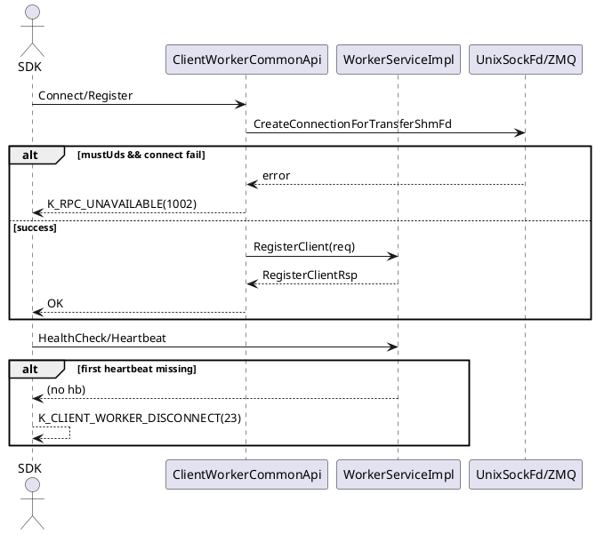
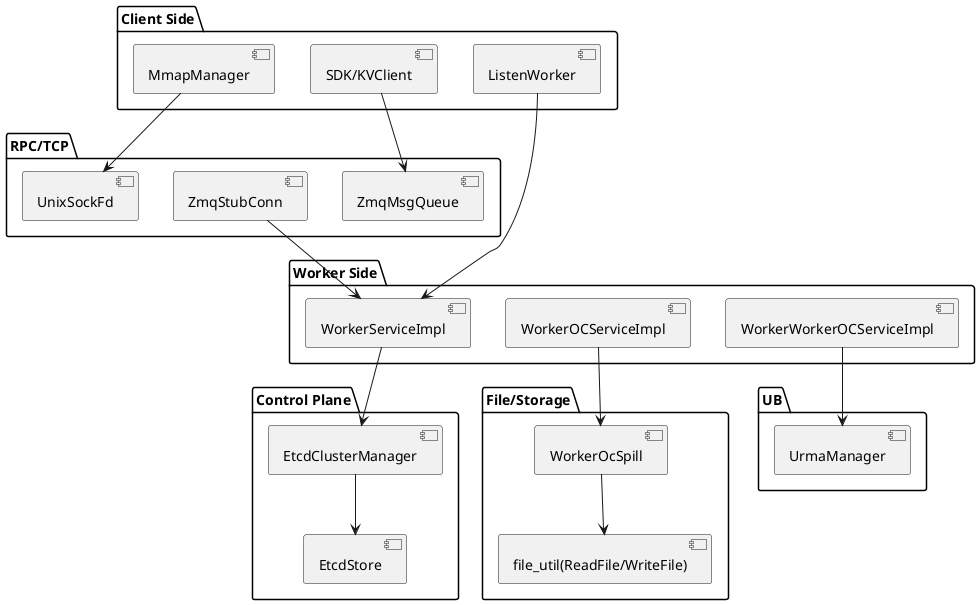

# KVC 定位定界：故障树、代码证据与告警设计（证据版）

本文目标：把“监控异常/接口报错/不符合规格（RPC、URMA Write、部署初始化等）”落到**可验证**的定位定界链路：
- 有代码证据（错误码、日志、调用传递）
- 有告警触发条件（当前无统一机制时的可落地设计）
- 覆盖 FEMA 场景，并按读写/部署流程给出排障与运维参与点

---

## 1. 范围与分类（按你的要求）

本文分 6 类：
1) TCP 链路故障（含 ZMQ 与 socket/UDS fd 交换）
2) UB 链路故障（URMA 数据面）
3) 组件本身故障（SDK/Worker 生命周期、健康检查）
4) 系统资源故障（内存/FD/队列/线程池/磁盘空间）
5) 第三方 etcd 故障（控制面）
6) 文件接口故障（pread/pwrite/mmap/spill）

并覆盖 FEMA 文档：`docs/reliability/00-kv-client-fema-scenarios-failure-modes.md`，重点映射：
- UB：25~31、39~42
- TCP：32~38
- etcd：43~48
- 资源/组件：4~24
- 文件/存储：7~9、49~53

---

## 2. 代码证据：错误码、日志、层层传递

### 2.1 状态码定义（总入口）
- 文件：`yuanrong-datasystem/include/datasystem/utils/status.h`
- 关键码：
  - TCP/RPC：`K_RPC_UNAVAILABLE(1002)`、`K_RPC_DEADLINE_EXCEEDED(1001)`
  - UB/URMA：`K_URMA_ERROR(1004)`、`K_URMA_NEED_CONNECT(1006)`、`K_URMA_TRY_AGAIN(1008)`
  - etcd/控制面：`K_MASTER_TIMEOUT(25)`
  - 生命周期：`K_CLIENT_WORKER_DISCONNECT(23)`、`K_SCALE_DOWN(31)`、`K_SCALING(32)`

### 2.2 TCP 与 ZMQ：1002 是“桶码”而非单一根因

**证据 A：TRY_AGAIN 被改写成 1002**
- 文件：`src/datasystem/common/rpc/zmq/zmq_msg_queue.h`
- 函数：`ClientReceiveMsg`
- 逻辑：`K_TRY_AGAIN`（阻塞模式）改写为 `K_RPC_UNAVAILABLE`，并附消息：
  `Rpc service for client ... has not responded within the allowed time`

**证据 B：socket/reset/建连超时归入 1002**
- 文件：`src/datasystem/common/rpc/unix_sock_fd.cpp`
- 函数：`ErrnoToStatus`
- 逻辑：`ECONNRESET/EPIPE -> K_RPC_UNAVAILABLE`，日志含 `Connect reset. fd ...`

- 文件：`src/datasystem/common/rpc/zmq/zmq_stub_conn.cpp`
- 逻辑：
  - 心跳发送时 `ZMQ_POLLOUT` 不可写：`K_RPC_UNAVAILABLE, "Network unreachable"`
  - 等待连接超时：`Timeout waiting for SockConnEntry wait` -> `K_RPC_UNAVAILABLE`
  - `Remote service is not available within allowable ... ms` -> `K_RPC_UNAVAILABLE`

**证据 C：fd 交换（SHM 建链）失败也返回 1002**
- 文件：`src/datasystem/client/client_worker_common_api.cpp`
- 逻辑：
  - `mustUds && !isConnectSuccess` -> `K_RPC_UNAVAILABLE`
  - 关键日志：
    - `Try connect worker for shm fd transfer...`
    - `Client can not connect to server for shm fd transfer within allowed time...`

结论：`1002` 同时覆盖 RPC 等待超时、socket 异常、fd 交换失败，必须结合日志关键词和链路上下文定界。

### 2.3 UB/URMA：1006 -> 重连 -> TRY_AGAIN -> Retry

**证据 D：URMA 连接不稳定返回 1006**
- 文件：`src/datasystem/common/rdma/urma_manager.cpp`
- 函数：`CheckUrmaConnectionStable`
- 逻辑：无连接/实例不一致时返回 `K_URMA_NEED_CONNECT(1006)`

**证据 E：服务端远端读路径的传递顺序**
- 文件：`src/datasystem/worker/object_cache/worker_worker_oc_service_impl.cpp`
- 路径：
  - `serverApi->Read(req)`
  - `CheckConnectionStable(req)`
  - `GetObjectRemoteImpl(...)`
  - URMA 分支：`UrmaWritePayload(...)` 成功后 `rsp.data_source=DATA_ALREADY_TRANSFERRED`
  - `serverApi->Write(rsp)`
  - `serverApi->SendAndTagPayload(...)`
- 关键日志：`GetObjectRemote read/write/send payload error`、`pull success`

**证据 F：1006 在调用侧被重连并转为重试**
- 文件：`src/datasystem/worker/object_cache/service/worker_oc_service_get_impl.cpp`
- 函数：`TryReconnectRemoteWorker`
- 逻辑：
  - 若 `lastResult == K_URMA_NEED_CONNECT`
  - 执行 transport exchange
  - 成功后返回 `K_TRY_AGAIN("Reconnect success")`
  - 由外层 `RetryOnError` 继续重试

结论：UB 故障可恢复链路明确，关键看 1006/1008 与重连窗口是否成功；若窗口不足，可能先表现为 1001/1002。

### 2.4 etcd：控制面失败上抛 25

**证据 G：远端连接失败 -> `K_MASTER_TIMEOUT(25)`**
- 文件：`src/datasystem/worker/cluster_manager/etcd_cluster_manager.cpp`
- 逻辑：节点连接失败或超时时返回：
  `Disconnected from remote node ...` + `K_MASTER_TIMEOUT`

结论：etcd/控制面故障与数据面 UB/TCP 需分开定界；读写可能暂时可用，但扩缩容/故障隔离能力受损。

### 2.5 组件故障：心跳与健康检查直接暴露

**证据 H：客户端收不到心跳 -> 23**
- 文件：`src/datasystem/client/listen_worker.cpp`
- 逻辑：首次心跳超时 -> `K_CLIENT_WORKER_DISCONNECT("Cannot receive heartbeat from worker.")`

**证据 I：Worker 退出态 -> 31**
- 文件：`src/datasystem/worker/object_cache/worker_oc_service_impl.cpp`
- 函数：`HealthCheck`
- 逻辑：`CheckLocalNodeIsExiting()` 为真时返回 `K_SCALE_DOWN(31)`，日志：
  `[HealthCheck] Worker is exiting now`

**证据 J：部署/初始化注册链有日志锚点**
- 文件：`src/datasystem/worker/worker_service_impl.cpp`
- 日志：`Register client: ... heartbeat: ... shmEnabled ...`
- 用途：部署阶段确认“SDK/Worker 初始化参数、心跳、shm 能力”是否一致

### 2.6 文件接口故障：pread/pwrite 的可追溯错误

**证据 K：`pread/pwrite` 失败统一出 `K_IO_ERROR`**
- 文件：`src/datasystem/common/util/file_util.cpp`
- 函数：`ReadFile/WriteFile/WriteFileNoErrorLog`
- 逻辑：
  - `pread` 失败：`K_IO_ERROR` + 错误细节（errno 或读写字节不符）
  - `pwrite` 失败：`K_IO_ERROR` + 错误细节
  - `WriteFile` 有恢复日志：失败后 `WriteFile failed...`，恢复后 `WriteFile success again`

**证据 L：spill 路径磁盘不足返回 `K_NO_SPACE`**
- 文件：`src/datasystem/worker/object_cache/worker_oc_spill.cpp`
- 逻辑：在 spill 流程中存在 `RETURN_STATUS(K_NO_SPACE, "No space when WorkerOcSpill::Spill")`

---

## 3. 故障树（分门别类）

```text
故障树（KVC）
├─ A. TCP 链路故障（含 ZMQ/socket/UDS）
│  ├─ A1. 建连/等待超时 -> 1002
│  ├─ A2. socket reset(EPIPE/ECONNRESET) -> 1002
│  ├─ A3. 心跳不可写(Network unreachable) -> 1002
│  └─ A4. fd 交换失败(shm fd transfer) -> 1002
├─ B. UB 链路故障（URMA）
│  ├─ B1. 连接不稳/实例不匹配 -> 1006
│  ├─ B2. 可恢复瞬时故障 -> 1008
│  ├─ B3. URMA 操作错误 -> 1004
│  └─ B4. 1006 -> exchange -> TRY_AGAIN -> Retry
├─ C. 组件本身故障（SDK/Worker）
│  ├─ C1. 客户端收不到心跳 -> 23
│  ├─ C2. Worker 退出窗口 -> 31
│  ├─ C3. 扩缩容/迁移窗口 -> 32
│  └─ C4. 注册/初始化参数不一致 -> 部署失败/后续不稳
├─ D. 系统资源故障
│  ├─ D1. OOM / No space / FD 限制（6/13/18）
│  ├─ D2. 队列/线程池饱和（重试与长尾）
│  └─ D3. spill/持久化资源争用（I/O 慢）
├─ E. 第三方 etcd 故障
│  ├─ E1. 连接失败/超时 -> 25
│  └─ E2. 控制面降级（扩缩容、隔离能力下降）
└─ F. 文件接口故障
   ├─ F1. pread/pwrite 失败 -> K_IO_ERROR
   └─ F2. spill 空间不足 -> K_NO_SPACE
```

---

## 4. 流程化定位定界（部署 + 读写）

### 4.1 本地读取（client -> 本地 worker）
- 首看：成功率、P99（读）
- 定位链：
  1) `status_code` 分布（1002/23/31/6/18）
  2) fd 交换日志（`shm fd transfer`）
  3) 心跳日志（`Cannot receive heartbeat...`）
- 定界：
  - 1002 + fd 关键词 -> TCP/UDS/fd 交换
  - 23 -> Worker 心跳/进程
  - 31/32 -> 生命周期窗口（运维变更）

### 4.2 远端读取（worker->worker，含 URMA）
- 首看：成功率、P99（remote_get）
- 定位链：
  1) `K_URMA_*` vs `1001/1002`
  2) `GetObjectRemote` 三段日志（read/urma_write/write/send payload）
  3) `TryReconnectRemoteWorker` 是否触发及是否成功
- 定界：
  - 1006/1008 主导 -> UB/URMA
  - 仅 1002/1001 且无 URMA 码 -> 先查 TCP/ZMQ 或 budget 不足

### 4.3 本地写入
- 首看：写成功率、写 P99
- 定位链：
  1) 资源码（6/13/18）
  2) spill/文件日志（`K_NO_SPACE`、`WriteFile failed`）
  3) 控制面码（25）
- 定界：
  - 6/13/18 + 资源日志打满 -> 系统资源
  - K_IO_ERROR/K_NO_SPACE -> 文件接口/磁盘

### 4.4 部署 SDK（初始化）
- 关键检查：
  - `Register client` 日志参数（heartbeat/shmEnabled/socket fd）
  - `GetSocketPath` 与 fd 握手是否成功
- 失败定界：
  - `shm fd transfer` 失败 -> TCP/UDS/fd 通道
  - 心跳首轮失败 -> 23，组件/网络

### 4.5 部署 Worker（初始化）
- 关键检查：
  - HealthCheck 是否 `OK` / `K_SCALE_DOWN`
  - etcd 连接稳定性（是否出现 25）
- 失败定界：
  - 31 -> 退出态/缩容流程
  - 25 -> etcd 控制面

### 4.6 UB/TCP 建链专题
- UB：`CheckUrmaConnectionStable -> 1006 -> TryReconnect -> TRY_AGAIN`
- TCP：`ZMQ_POLLOUT`、SockConn wait timeout、UnixSockFd errno 映射
- 判据：同一时间窗内比较 UB 码与 RPC 码占比，避免误判

---

## 5. PlantUML：时序与组件关系

### 5.1 远端读（UB 优先，失败可重连）



### 5.2 SDK/Worker 部署初始化（TCP+fd 交换）



### 5.3 组件关联图（定位责任域）



---

## 6. 告警设计（当前无统一机制时）

## 6.1 告警触发总原则
- 入口必须是双 SLI：
  - 读/写成功率下降
  - 读/写 P99 不满足
- 再用错误码+日志分流到故障域。

## 6.2 告警规则（第一版）

### R1：SLI 违约告警（P1/P2）
- 条件：
  - `read_p99` 连续 N 窗口 > 阈值 或 `write_p99` 连续 N 窗口 > 阈值
  - 或 `success_rate` 连续 N 窗口 < 阈值
- 输出：Top 状态码、Top 错误日志、trace 查询条件

### R2：UB 专项告警
- 条件：`1004/1006/1008` 速率或占比突增，且 remote_get 相关动作异常
- 输出：URMA 连接稳定性日志、重连次数、重试成功率

### R3：TCP/ZMQ 专项告警
- 条件：`1001/1002/23` 突增
- 细分：若出现 `shm fd transfer` / `Connect reset` / `Network unreachable` 关键词，标记子类

### R4：etcd 专项告警
- 条件：`K_MASTER_TIMEOUT(25)` 突增 + etcd 访问成功率下降
- 影响标记：控制面降级（扩缩容/隔离受影响）

### R5：资源与文件接口告警
- 条件：`6/13/18` 或 `K_IO_ERROR/K_NO_SPACE` 突增
- 辅助：资源日志（内存/队列/线程池）高位持续

## 6.3 告警分级与抑制
- P1：全局成功率明显下降或 P99 严重超阈，持续 T
- P2：单 AZ/单 worker 持续异常
- P3：单信号异常（观察）
- 抑制：变更窗口（部署/扩缩容）适度延迟升级
- 去重：按 `cluster + domain + status_code` 聚合

---

## 7. 巡检与告警复核（部署 + 读写）

### 7.1 巡检清单（日常）
1. 部署巡检（SDK/Worker）
   - 最近注册日志是否完整（`Register client...`）
   - 首心跳成功率（是否出现 23）
2. 读写巡检（本地/远端）
   - 读写成功率、P99
   - remote_get 中 URMA 与 RPC 码比例
3. 控制面巡检（etcd）
   - `25` 发生率、etcd 成功率
4. 存储巡检（文件接口）
   - `K_IO_ERROR/K_NO_SPACE`、spill 空间余量

### 7.2 告警复核流程（值班）
1. 先看 SLI：影响范围（全局/单点）
2. 看 Top 状态码与关键词日志
3. 按故障树归类（TCP/UB/组件/资源/etcd/文件）
4. 下钻 trace 与分段耗时
5. 输出结论：责任域 + 临时缓解 + 后续改进

---

## 8. 对应你要求的“本地读、远端读、本地写、部署、建链”

- 本地读取：重点 TCP/fd/heartbeat（1002/23/31）
- 远端读取：重点 URMA 三码与重连链（1006/1008/1004）+ RPC 回包链
- 本地写入：重点资源码（6/13/18）+ 文件接口码（K_IO_ERROR/K_NO_SPACE）
- 部署 SDK：重点 Register/SocketPath/fd 交换日志
- 部署 Worker：重点 HealthCheck（31）与 etcd（25）
- UB/TCP 建链：分别看 `CheckUrmaConnectionStable` 与 ZMQ/UnixSockFd 证据链

---

## 9. 建议产出到 PPT 的素材结构（可直接拆页）
1. 一页：六类故障树（本文件第 3 节）
2. 一页：代码证据链总表（第 2 节）
3. 两页：远端读与部署初始化时序（第 5 节 PlantUML）
4. 一页：告警规则（第 6 节）
5. 一页：巡检与告警复核（第 7 节）

