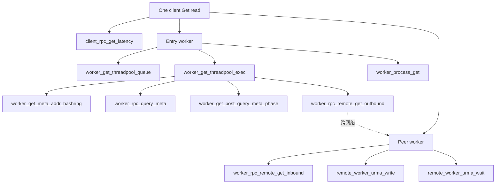
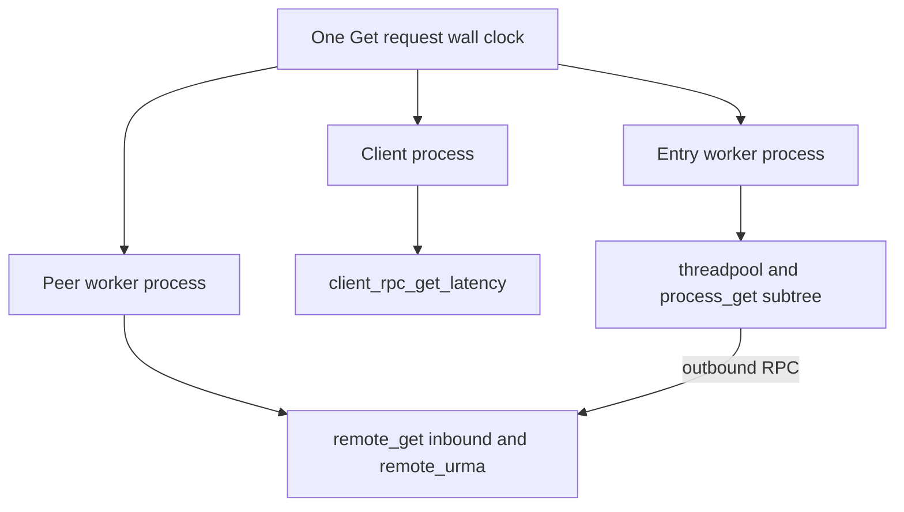

# design: Worker Get metrics breakdown（最小改动版）

> **产品目标**：为 **性能定位与定界** 提供可对照的分段时延与进程角色分桶；业务背景、Layer 表、**性能 Breakdown ASCII 树**、定界决策树见 [issue-rfc.md](./issue-rfc.md)。**分阶段实施顺序**见 [modification_plan.md](./modification_plan.md)。

## 1. 原则

- **不重组** 已有 `KvMetricId` 的数值顺序；**新 histogram 仅追加** 在 `URMA_IMPORT_JFR` 与 `KV_METRIC_END` 之间，避免外部按 id 绑定的看板整表错位。
- **唯一“改名”面**：`id=13` 的 Prometheus **字符串** 从 `worker_rpc_get_remote_object_latency` 改为表示 **outbound** 的名称；C++ 枚举可同步改名为 `WORKER_RPC_REMOTE_GET_OUTBOUND_LATENCY`，**全仓替换引用**（小范围，grep 可覆盖）。
- **逻辑改动集中**：`WorkerOcServiceGetImpl::Get`（线程池分段）、`WorkerOCServiceImpl::Get`（去掉误导 timer）、`Worker*Worker*Api/Impl`（in/out）、`urma_manager` + 极薄 `urma_metrics_peer`、etcd `GetMetaAddressNotCheckConnection`、get_impl 中 `ProcessObjectsNotExistInLocal` 后处理。

---

## 2. 指标表（name → 时间线位置）

| name（`kv_metrics.cpp` 字符串） | 类型 | 单位 | 时间线 |
|----------------------------------|------|------|--------|
| `client_rpc_get_latency` | 已有 | us | Client 单条读 E2E，**不**在本 RFC 内再拆。 |
| `worker_get_threadpool_queue_latency` | **新** | us | 仅 **MsgQ**：`threadPool->Execute` **之前** → 线程池 worker **开始执行**回调第一行。非 MsgQ **不** Observe（避免 0 样本稀释 avg）。 |
| `worker_get_threadpool_exec_latency` | **新** | us | 回调内 **`ProcessGetObjectRequest`** 整段。MsgQ/非 MsgQ 均 Observe。 |
| `worker_process_get_latency` | 已有 | us | **语义修正**：在 entry worker 上表示 **handle** 的 E2E：MsgQ 为 **queue+exec**；非 MsgQ 为 **exec**（与 `exec` 等值，或只写 E2E 之一，二选一并固定实现）。**删除** 外层对 `getProc_->Get` 的 ScopedTimer 导致的「只量到入队」错误。 |
| `worker_rpc_query_meta_latency` | 已有 | us | 本 worker 调 Master 的 `QueryMeta` RPC。 |
| `worker_rpc_remote_get_outbound_latency` | **id13 改串名** | us | 本 worker 作为 **发起方** 调对端 `GetObjectRemote*`。 |
| `worker_rpc_remote_get_inbound_latency` | **新** | us | 本 worker 作为 **被拉方** 处理 `GetObjectRemote` / `BatchGetObjectRemote`。原误用与 outbound 同 id 的问题消除。 |
| `worker_get_meta_addr_hashring_latency` | **新** | us | `GetMetaAddressNotCheckConnection` 在 **非 centralized** 时，**整次** 解析（hash/路由到 master 地址）耗时。 |
| `worker_get_post_query_meta_phase_latency` | **新** | us | `ProcessObjectsNotExistInLocal` 内，`QueryMetadataFromMaster` 成功并过 `INJECT` 之后，到该分支本地后处理**结束**（不重复计入 query_meta RPC 本身）。 |
| `remote_worker_urma_write_latency` | **新** | us | 在 **URMA 且** 处于「**对端为另一 worker 拉数**」上下文时，与 `worker_urma_write_latency` **同次操作双写**（或等价的第二 Observe）。 |
| `remote_worker_urma_wait_latency` | **新** | us | 同上，对应 `WaitToFinish` / 合并等待。 |
| `worker_urma_write_latency` / `worker_urma_wait_latency` | 已有 | us | 保持为 **全量** URMA 行为；与 `remote_worker_*` 并存便于对照。 |

**不做（一期）**：`remote_worker_rpc_query_meta` — 见 [README 非目标](./README.md#非目标刻意缩小范围)。

---

## 3. 代码落点（按文件，改动最小）

### 3.1 `yuanrong-datasystem/src/datasystem/common/metrics/`

- `kv_metrics.h`：追加枚举（inbound、queue、exec、hashring、post_qm、remote_urma×2）；**重命名** id13 的枚举名（outbound）并 `static_assert` 仍对。
- `kv_metrics.cpp`：在 **数组末尾、END 前** 增加 7+ 行 `MetricDesc`；id13 的 `name` 改 outbound 串；`id` 与数组下标保持一致。

### 3.2 `service/worker_oc_service_get_impl.cpp`

- `Get()`：MsgQ 路径在 `Execute` 前后和回调内用 `std::chrono::steady_clock`（或 `Timer`）`Observe` queue/exec/E2E；**同步**路径只 `Observe` exec 与 E2E。
- `ProcessObjectsNotExistInLocal`：在 `QueryMetadataFromMaster` 成功后的后处理用 `Timer` 包住 → `post_query_meta_phase`。

### 3.3 `worker_oc_service_impl.cpp`

- `Get()`：去掉对 `getProc_->Get` 整包 `METRIC_TIMER(WORKER_PROCESS_GET)`（避免与 `get_impl` 重复或时间错误）。

### 3.4 `worker_worker_oc_api.cpp`

- `GetObjectRemote` 两处 `METRIC_TIMER` → 使用 **outbound** id。

### 3.5 `worker_worker_oc_service_impl.cpp`

- 三处原 `GET_REMOTE` timer → **inbound** id。
- `GetObjectRemoteImpl` 函数入口：`UrmaRemoteDataProviderMetricsScope` RAII（与实现文件同新增 cpp）。
- `WaitFastTransportAndFallback` 内、调用 `WaitFastTransportEvent` **之前** 再 `Urma…Scope`（覆盖非阻塞后合并等）。

### 3.6 `common/rdma/`

- 新增 `urma_metrics_peer.{h,cpp}`：线程内深度计数，`UrmaRemoteDataProviderMetricsActive()`。
- `CMakeLists.txt`：把 `urma_metrics_peer.cpp` 加进与 `fast_transport_base` 同库的 **已存在** 源列表（不新建大 target）。
- `urma_manager.cpp`：在 `UrmaWriteImpl` 与 `WaitToFinish` 的 `METRIC_TIMER(worker_urma_*)` 旁，**若** `UrmaRemoteDataProviderMetricsActive()` 再套一层 `METRIC_TIMER(remote_worker_urma_*)`（行宽 ≤120）。

### 3.7 `worker/cluster_manager/etcd_cluster_manager.cpp`

- `GetMetaAddressNotCheckConnection`：`IsCentralized()` 早退 **不** `Observe`；否则在 return 前对 `Timer` 结果 `Observe(hashring)`。

### 3.8 `tests/ut/common/metrics/metrics_test.cpp`

- 更新 `count == KV_METRIC_END`、id13 相关字符串/辅助函数；**可选** 对 1～2 个新名做 `find("\"name\":...")` 断言。

### 3.9 Workbench 脚本

- 路径：[`yuanrong-datasystem-agent-workbench/scripts/metrics/grep_get_latency_breakdown.sh`](../../scripts/metrics/grep_get_latency_breakdown.sh)
- 行为：对参数传入的 `*.log` 或目录递归 `rg`/`grep` 上表 metric 名，解析 `count=` / `avg_us=` / `max_us=` 或 JSON 中对应字段，**打印为表**。依赖：bash + grep/rg，无强依赖 Python（若 JSON 难解析，可内嵌 `python3 -c` 可选分支）。

**行宽**：仅 `yuanrong-datasystem/**` 下 `.h/.hpp/.cpp` 需遵守 120 列；RFC 与 shell 不强制。

---

## 4. 时间线关系（与验收对照）

- **同一条用户请求**在墙上时钟上并行：**Client** 一条 E2E；**Entry worker** 一条链；**对端**一条链。三段 **不可** 数值相加与 client 严格相等（网络与并发）。
- 在 **同进程** 上应有近似：**`process_get`（修正后）≈ `queue` + `exec`（仅 MsgQ）**；**exec** 内包含 b/c/d 等子项，子项为 **部分重叠/嵌套**，与 `client_rpc` **无** 数学闭合关系，**验收不** 要求子项之和小于 client。

---

## 5. Breaking change 与文档

- **Grafana/告警** 若绑定 **字符串** `worker_rpc_get_remote_object_latency`：需改为 `worker_rpc_remote_get_outbound_latency`（**行为不变**，仅名与分桶意义清晰）。
- **语义变更**：`worker_process_get_latency` 从「常仅到入队」改为 **真实 handle 耗时**；历史曲线不可直接横比，在 release note 中注明。

---

## 6. 回滚

- 单 MR 可回退：revert 该 commit 即可；若已改 dashboard，恢复旧面板的 name 或双写一期（不属本仓库）。

---

## 7. 验收与回归

**构建与单测：优先 Bazel**（利用增量编译与 action cache，比反复全量 CMake 配置通常更快；与仓库 `build.sh -b bazel` 一致）。

```bash
export DATASYSTEM_ROOT=/path/to/yuanrong-datasystem
# 可选：与现网 build 习惯一致，第三方缓存与 build.sh 说明保持一致
# export DS_OPENSOURCE_DIR="${HOME}/.cache/yuanrong-datasystem-third-party"

cd "$DATASYSTEM_ROOT"

# 1) 仅跑 metrics 单测（推荐）
bazel test //tests/ut/common/metrics:metrics_test
# 需要完整单测输出时：
# bazel test //tests/ut/common/metrics:metrics_test --test_output=all

# 1b) 全量：bash build.sh -b bazel -t run 会调 build_bazel 内 bazel test //...（耗时更长，非本需求必跑）
```

**备选（无 Bazel 时）**：

```bash
cd "$DATASYSTEM_ROOT/build" && ctest -R metrics_test -V
```

**日志粗验**（样例，路径按实际 glog root）：

```bash
rg 'metrics_summary|worker_rpc_remote_get|worker_get_threadpool|remote_worker_urma' -n "$LOG_DIR"/*.INFO
```

**Workbench**（扫日志 + **末尾生成 RFC 性能 Breakdown ASCII 树**；验收时保存该树输出或 `> get_breakdown_tree.txt`）：

```bash
bash yuanrong-datasystem-agent-workbench/scripts/metrics/grep_get_latency_breakdown.sh "$LOG_DIR"
# 仅生成树、不读日志:
bash yuanrong-datasystem-agent-workbench/scripts/metrics/grep_get_latency_breakdown.sh --tree-only
```

远程验证主机：与 workspace 规则一致，优先在 **`xqyun-32c32g`** 上 **`bazel test //tests/ut/common/metrics:metrics_test`** 与 st/smoke，再取日志做本 § 检查，并**附 Breakdown 树**。

---

## 附录：时间线树（Tree）

从**一次读请求**出发，把 **metric 名** 按「进程内先后 / 父子关系」组织成树；**同一墙钟时刻**上，Client、Entry worker、Peer worker 三条子树**并行**，数值**不可**相加与 `client_rpc_get_latency` 严格闭合。

### Tree：谁包含谁（逻辑分解）



说明：

- **Entry** 下 `queue` → `exec` 为先后；`process_get` 为 handle 的 E2E（MsgQ 时与 queue+exec 对齐）。
- **exec 内部** `hashring` / `query_meta` / `post_query` / `outbound` 为「同一段处理内」的子步骤，路径不同会**缺省**若干叶节点（例如全本地命中则无 outbound）。
- **Peer** 上 `inbound` 与 `remote_worker_urma_*` 为对端拉数数据面；该进程上的 `worker_rpc_query_meta`（若存在）表示**该进程任意时刻**与 Master 的 meta RPC，**不一定**挂在本次 inbound 子树上，故上图中**不画**为 inbound 的子节点（一期不拆专桶，见 §2）。

### Tree：三进程在墙钟上并行（根并列）

下图中三个分支**同一次用户读**、**同墙钟**下并行展开；根结点表示「并行域」，不表示时序先后。



- **c1** 与 **e1** 在时间上重叠（Client 等 reply，Entry 已接到请求在跑）。
- **e1** 到 **p1** 的边表示跨进程 RPC/数据面，**不**要求 `c1` 已结束。

---

## 8. 实现规模估计（供评审）

- **Datasystem**：约 **10** 个文件、**+200 行** 量级（含头与测试），**无** 新三方依赖。
- **Workbench**：**1** 个 shell 脚本、**+80 行** 量级。
