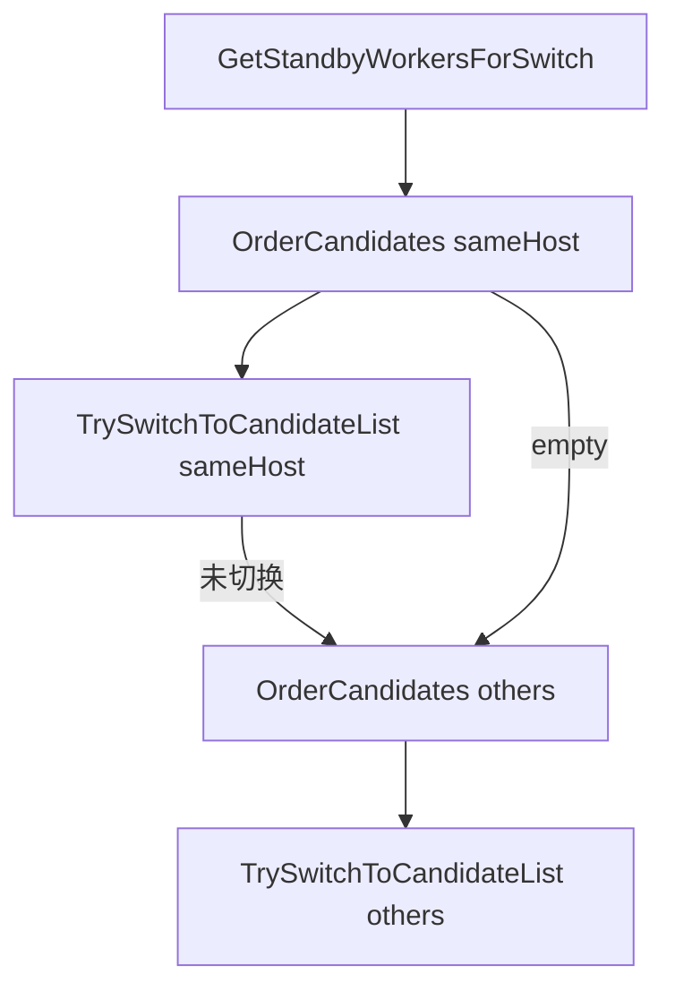

# design：Worker 故障切流与 C↔W 连接均衡（Po2 + 负载信号）

> **问题定义**：在 **Worker 故障** 时，保证 **Client 切流** 不过度挤向同一 Standby；在可度量范围内改善 **各 Worker 上 Client 连接/数据面负载** 的**均衡性**。业务动机、里程碑与**非目标** 见 [issue-rfc.md](./issue-rfc.md) 与 [README.md](./README.md)。

## 1. 原则

- **行为回退优先**：在 **无负载读数** 或 **候选数 < 2** 时，行为与当前 **`TrySwitchToCandidateList` 顺序首成** 一致，避免不可控的线上分支差异。  
- **可开关**：Po2 与「比较用负载信号源」通过 **gflag / 配置** 可关闭，默认关或灰度，由发布策略决定。  
- **C++ 行宽**：`yuanrong-datasystem` 下 `.h/.hpp/.cpp` 遵守 **120 列**（见仓库规则）。  
- **分里程碑**：A = **Client 连接数**；B = **近窗 UB 字节**（C↔W + W↔W）；B 的计量与现网 `client_*_urma_*_total_bytes`（Client 进程级）**区分**，见 [README.md](./README.md) §2。  
- **URMA/UB 生命周期**（`USE_URMA` 建链/回退/析构与切流顺序）与上述调度逻辑**正交**；上 Po2 或加负载仍须满足该约束，见 [notes-use-urma-ub-lifecycle.md](./notes-use-urma-ub-lifecycle.md)。  
- **用例** 与 **实现**：**ST/验收用例** 上 **先** 非 URMA 路径、**后** URMA 专项；**代码** 对 **两条 C↔W 路径**（非 URMA 与 `USE_URMA`）**均需** UT/可验证覆盖，不因用例分阶段而只合入单路径，见 [validation-test-design-and-observation.md](./validation-test-design-and-observation.md) §0。  

---

## 2. Power-of-Two 算法与分区

**输入**：当前分区的一条候选 `vector<HostPort> candidates`（如 `sameHost` 或 `others` 经 `GetStandbyWorkersForSwitch` 过滤后）；每个地址 `a` 的负载 `L(a)` 为**非负**标量；随机源 `RandomData`（与 `ServiceDiscovery` 一致更佳）。

**输出**：重排后的「**首轮**尝试序」；后续 `CONTINUE` 仍按**该序** 或按现有逻辑，由实现固定并在 MR 中写清（建议：首轮为 Po2 重排，失败则**继续沿列表** 试下一个）。

**伪代码**：

```text
function OrderCandidatesForFirstAttempt(candidates, L):
  if |candidates| < 2:
    return candidates  // 与现网一致
  if not L readable for at least 2 entries in pick:
    return candidates
  a, b = random distinct pair from candidates
  if L(a) <= L(b):
    return [a, b] + (candidates \ {a,b} in original order)
  else
    return [b, a] + (candidates \ {a,b} in original order)
```

**`L` 的里程碑定义**：

| 里程碑 | `L(地址)` 含义 | 数据从哪读 |
|--------|----------------|------------|
| **A** | 该 Worker 上 **当前活跃 Client 连接数** | Worker 内 `ClientManager` 聚合并经 **etcd 扩展**、**Heartbeat 响应** 或 **轻量 RPC** 对 Client/SD 可见；**同一快照** 下各节点可比。 |
| **B** | **近 T 秒** 内该 Worker **UB 面传输字节**（C↔W 与 W↔W 之和，或拆两条再相加） | Worker 在 URMA/UB 完成路径 **累加** + **滑窗** 或**周期**写入与 A 相同通道。 |

**缺数据**：`L` 未定义或**过期**（见 §5）→ 回退为**原 `candidates` 序**（不调 Po2 重排）。

**与 `PREFERRED_SAME_NODE`**：`SwitchToStandbyWorkerImpl` **先** `sameHost` 后 `others`；建议 **在各自向量内独立** 做 `OrderCandidatesForFirstAttempt`（不跨区抽二），以免违背「同机优先」的语义。若产品要求「全池 Po2」需单独签批。

---

## 3. 代码落点（按文件，里程碑 A 为最小可交付）

### 3.1 Client

| 路径 | 改动要点 |
|------|----------|
| `.../object_cache/object_client_impl.cpp` | 在 `SwitchToStandbyWorkerImpl` 在调用 `TrySwitchToCandidateList` **之前**，对 `sameHost`、`others` 分别调用 `OrderCandidatesForFirstAttempt`（或内联等效逻辑），受 gflag 控制。 |
| `.../client/service_discovery.cpp` 与 `.h` | 若从 etcd 值解析**负载**扩展 `GetAllWorkers` 的返回（例如 `map<HostPort, uint64_t>` 或与 key 平行的 value 解析）；**不破坏** 仅解析 `KeepAliveValue` 三段的**老**节点。 |
| `.../client/client_worker_common_api.cpp` | 若从 **Heartbeat** 带下全集群负载：在 `SaveStandbyWorker` 或新字段**合并** 入 Po2 可读缓存（注意**线程与锁**与现有 `standbyWorkerAddrs_` 一致）。 |

### 3.2 etcd / 节点 value（细规见专章）

**说明**：不新增「物理表名」；**仅** 扩展 `ETCD_CLUSTER_TABLE` 每行的 **value 文本**（`KeepAliveValue`）。**字段级格式、2/3/4 段兼容、「续租流 vs 带租约 Put」** 见 [design-etcd-keepalive-value.md](./design-etcd-keepalive-value.md)。

| 路径 | 改动要点 |
|------|----------|
| `.../common/kvstore/etcd/etcd_store.{h,cpp}` | `KeepAliveValue::ToString` / `FromString`：第 4 段等见专章。 |
| `.../worker/cluster_manager/etcd_cluster_manager.cpp` | **节流**后带租约 **Put**；与 `UpdateNodeState` 协调频率。 |

### 3.3 Worker 进程

| 路径 | 改动要点 |
|------|----------|
| `.../worker/client_manager/client_manager.{h,cpp}` | 提供**只读** `GetActiveClientCountForPo2()` 或等效（与 Add/Remove 一致）。 |
| `.../worker/worker_service_impl.cpp` | `Heartbeat` / `RegisterClient` 的 `rsp`：可选增加 **全集群简表** 或 **本机负载**（若采用「每心跳带表」需评估**大小**）。 |
| 里程碑 B：`.../common/rdma/urma_manager.cpp`、`urma_resource.cpp`、W↔W 如 `worker_worker_oc_service_impl.cpp` / `worker_worker_transport_*` | 在**完成**一次 UB/URMA 传字节处 **Observe** 到 Worker 级 counter 并维护滑窗/导出到与 A 相同通道。 |

### 3.4 测试

| 路径 | 内容 |
|------|------|
| `tests/ut/...` 或 `tests/st/client/...` | 候选 0/1/2+、负载全缺、一缺一有、gflag 关；**可选** 注入 etcd 值；**非 URMA 与 `USE_URMA` 两条路径** 在 MR 中**各** 有可执行覆盖。 |
| [validation-po2-client-count.md](./validation-po2-client-count.md) | 人工/自动化场景验收。 |
| [validation-test-design-and-observation.md](./validation-test-design-and-observation.md) §0 | **用例** 先非 URMA、后 URMA；**代码** 双路径必覆盖。 |
| 同上 **§7** | **Bazel ST**：`ds_cc_test`、`tests/st/client/object_cache`、**`manual`** 与 **`--define=enable_urma=true`**。 |

---

## 4. 负载通道对比（设计选型）

| 通道 | 优点 | 风险 |
|------|------|------|
| **etcd 节点 value** | Client `GetAll` 一次**与选路同路径**；与 SD 主路径**一致** | 写**放大**、需 **TTL/节流**、revision 与**陈旧** |
| **Heartbeat 附带** | 不增加 etcd 写、**更实时** | 包体增大、**每 Client 各自** 表可能不一致；需**合并策略** |
| **专用 RPC 查询** | 灵活 | **额外 RTT**、故障时可用性、实现量 |

**推荐**：里程碑 A 优先 **Heartbeat 或 etcd 二选一** 做**最小**闭环；B 与 A **同通道** 仅替换 `L` 的**计算**与打点。

---

## 5. 数据陈旧与回退

- **stale 阈值 `Δ`**：若负载时间戳 与 当前选路时刻 差 `> Δ`，**视为** 不可用 → 回退顺序。  
- **B 的 UB 窗**：T、采样间隔、counter reset 方式在合入前写入 **gflag 默认值** 与 **README 运维说明**。  

---

## 6. 验收与回归

1. **UT**：`bazel test` / `ctest` 目标由 MR 指定；至少覆盖 §2 伪代码分支；**非 URMA 与 URMA 路径** 均须有可验证用例，见 [validation-test-design-and-observation.md](./validation-test-design-and-observation.md) §0。  
2. **场景**：[validation-po2-client-count.md](./validation-po2-client-count.md) + **关 Po2** 对照组；**先** 跑通**非 URMA** 主场景、**再** 补 **URMA** 专项（与代码双覆盖**不矛盾**）。  
3. **B**：对比 **Worker 日志** 与 **metrics** 中 UB 累计与**滑窗** 一致（容差在 MR 中写死）。  
4. **远程主机**：与仓库规则一致，**验证** 优先 **`xqyun-32c32g`**。  

---

## 7. 回滚

- 关闭 gflag 或 **revert** 单 MR；**etcd value** 多段**向后兼容**时老版本 Client **不读** 新段即可。  

---

## 附录 A：与「连接均衡」和「切流均衡」的映射

| issue-rfc 核心表述 | 本 design 的落点 |
|--------------------|------------------|
| Worker 故障切流均衡 | §2 `OrderCandidatesForFirstAttempt` + `TrySwitchToStandbyWorker` 不变、仅**首轮**序变化 |
| Client–Worker 间连接均衡 | 里程碑 A 的 `L` = 连接数；**稳态**靠多次故障/扩容的 Po2 间接改善，**不** 在本 design 做全局迁移 |

## 附录 B：PlantUML 时序图（与 etcd 租约）

- [diagrams/seq-client-init-and-failover.puml](./diagrams/seq-client-init-and-failover.puml)：`ServiceDiscovery` **Init/SelectWorker** 与 **GetAllWorkers + 切 Standby**。  
- [diagrams/seq-worker-etcd-lease.puml](./diagrams/seq-worker-etcd-lease.puml)：`LeaseGrant`、**PutWithLeaseId**、`KeepAliveValue`、**续租流不更新 value**、**连接数** 需**显式 Put** 的说明。  
- 索引与渲染见 [diagrams/README.md](./diagrams/README.md)。

## 附录 C：Mermaid（切流时 Po2 在 Client 侧的位置）



说明：`O1`/`O2` 仅在 **gflag 开** 且 **L 可用** 时重排，否则**直通**。
