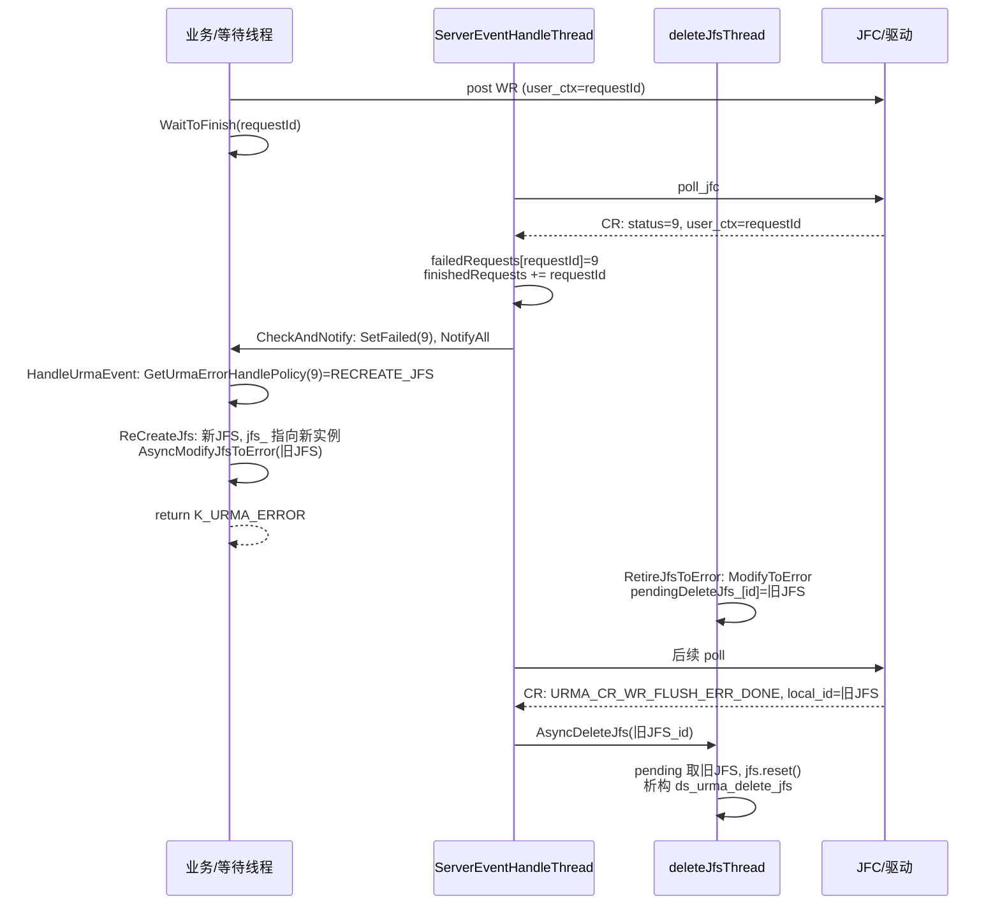

# URMA JFS：CQE Error 9 与 JFS 回收代码走读

本文档串联 **yuanrong-datasystem** 中与 URMA **JFS（Jetty For Send）** 相关的一条完整路径：完成队列上报 **CQE 状态码 9** 时的处理、**JFS 重建（ReCreateJfs）**、**RetireJfsToError** 与 **AsyncDeleteJfs** 的异步衔接。文内「Error 9」指 **`urma_cr_t.status` 的整型值 9**（与 Linux errno 无关），以代码 `GetUrmaErrorHandlePolicy` 表为准。

**代码根路径**：`yuanrong-datasystem/`

---

## 1. 术语与数据流

| 概念 | 含义 |
|------|------|
| JFS / JFR / JFC | 发送 Jetty、接收 Jetty、完成队列（Completion）。多条 JFS 共享同一 JFC 做 poll。 |
| `user_ctx` | 完成记录里与 WR 绑定的 64 位上下文，本实现中即 **`requestId`**。 |
| `UrmaEvent` | 按 `requestId` 挂上的等待点；内联 **`weak_ptr<UrmaJfs>`**，用于失败恢复时找到旧 JFS 与 connection。 |
| Error 9 | 轮询到 **非** `URMA_CR_SUCCESS` 且**非**下面「Flush 特判」分支时，将 **`crStatus` 整型** 写入 `failedRequests_`，经 `SetFailed` 进入 `HandleUrmaEvent`；策略表**仅**对 **9** 映射为 **RECREATE_JFS**。 |

---

## 2. 参与线程

| 线程/池 | 职责 |
|--------|------|
| **ServerEventHandleThread** | `ServerEventHandleThreadMain`：循环 `PollJfcWait` → 合并 `finishedRequests_` / `failedRequests_` → `CheckAndNotify`。 |
| 业务/调用方线程 | 提交 URMA 读写后 `WaitToFinish`；被 notify 后执行 `HandleUrmaEvent` → 可能 `ReCreateJfs`（在**本线程**上）。 |
| **deleteJfsThread_**（`RetireJfs`） | `AsyncModifyJfsToError` 投递的 **`RetireJfsToError`**；`AsyncDeleteJfs` 投递的 **真正 `shared_ptr` 置空 / 析构**。 |

---

## 3. 总览时序图（含 RetireJfsToError 与 AsyncDeleteJfs）

---

## 4. 分阶段走读（与上图对应）

### 4.1 轮询到失败完成（含 status=9）

**文件**：`src/datasystem/common/rdma/urma_manager.cpp`

- **`PollJfcWait`**：调用 `ds_urma_poll_jfc`（及 event 模式下 `ds_urma_wait_jfc` / `ack` / `rearm` 等），将结果交给 **`CheckCompletionRecordStatus`**。
- **`CheckCompletionRecordStatus`** 分支逻辑要点：
  - `URMA_CR_SUCCESS` → 记入 `successCompletedReqs`（requestId 集）。
  - `URMA_CR_WR_FLUSH_ERR_DONE` → 打日志，**`urmaResource_->AsyncDeleteJfs(jfsId)`**（见 §4.4，与 error-9 主路径的「先 retire 再删」配合）。
  - **其余状态**（含 **9**）→ `failedCompletedReqs[requestId] = crStatus`，本轮末尾 **`RETURN_STATUS(K_URMA_ERROR, "Failed to poll jfc")`**。

即使本轮 `PollJfcWait` 返回 error，**只要** `failedCompletedReqs` 已填充，下一节仍会合并进全局集合（见下）。

---

### 4.2 合并集合并唤醒等待方

**文件**：`src/datasystem/common/rdma/urma_manager.cpp` — **`ServerEventHandleThreadMain`**

- 将 `successCompletedReqs` 并入 `finishedRequests_`。
- 将 `failedCompletedReqs` 并入 `failedRequests_`（`requestId → status`），且**把失败 requestId 也插入 `finishedRequests_`**，保证会走通知逻辑。
- 调用 **`CheckAndNotify()`**。

**`CheckAndNotify`**：

- 对每个 `requestId`：`GetEvent` 取 **`UrmaEvent`**。
- 若存在于 `failedRequests_`： **`event->SetFailed(status)`**（此处为 **9**），随后 **`event->NotifyAll()`**。
- 从 `finishedRequests_` 中移除已处理项。

---

### 4.3 等待线程：策略与重建 JFS

**文件**：`src/datasystem/common/rdma/urma_manager.cpp`

- **`WaitToFinish`**：`event->WaitFor` 返回 OK 后调用 **`HandleUrmaEvent(requestId, event)`**。
- **`GetUrmaErrorHandlePolicy`（匿名命名空间）**：静态表 **`{ 9, RECREATE_JFS }`**，其余为 **DEFAULT**（仅返回错误，不自动重建）。
- **`HandleUrmaEvent`**：
  - 若 `!event->IsFailed()` 则直接 OK。
  - 失败时：若策略为 **RECREATE_JFS**，在能取到 `connection` 时调用 **`connection->ReCreateJfs(*urmaResource_, oldJfs)`**（`oldJfs` 来自 `event->GetJfs().lock()`）。
  - **无论是否重建，最终** **`return Status(K_URMA_ERROR, errMsg)`** —— 本次 IO 在语义上仍为失败；重建是为后续请求换新 JFS。

**文件**：`src/datasystem/common/rdma/urma_resource.cpp` — **`UrmaConnection::ReCreateJfs`**

- 在 **`jfsMutex_`** 下：对 **`failedJfs`** 调用 **`MarkInvalid()`**（`valid_` 的 CAS，多线程并发时仅一者可继续重建）；校验 **`jfs_` 仍指向 `failedJfs`**；**`CreateJfs(newJfs)`**、**`BindConnection`**、**`jfs_ = newJfs`**。
- 返回 **`resource.AsyncModifyJfsToError(failedJfs)`**，将**旧** JFS 交异步退休逻辑。

**文件**：`src/datasystem/common/rdma/urma_resource.h` — **`UrmaJfs::MarkInvalid` / `IsValid`**：上层 **`GetJfsFromConnection`** 会要求 **`jfs->IsValid()`**，避免继续使用已判死的 JFS。

---

### 4.4 RetireJfsToError：ERROR 态 + 进入 pending（不执行 delete_jfs）

**文件**：`src/datasystem/common/rdma/urma_resource.cpp`

- **`AsyncModifyJfsToError`**：`deleteJfsThread_->Execute` 投递 **`RetireJfsToError`**（见下）。
- **`RetireJfsToError`**：
  - **`jfs->ModifyToError()`**（内部 `ds_urma_modify_jfs`，状态 **`URMA_JETTY_STATE_ERROR`**）。
  - 将 **`{ jfs, traceId }`** 写入 **`pendingDeleteJfs_[jfsId]`**。

此处**不**调用 `ds_urma_delete_jfs`；删除延后到 **FlushDone 完成** 触发的 `AsyncDeleteJfs`。

---

### 4.5 AsyncDeleteJfs：FlushDone 后真正释放

**文件**：`src/datasystem/common/rdma/urma_manager.cpp` — **`CheckCompletionRecordStatus`**

- 当 **`crStatus == URMA_CR_WR_FLUSH_ERR_DONE`** 时，**`AsyncDeleteJfs(jfsId)`**（`local_id` 为 JFS id）。

**文件**：`src/datasystem/common/rdma/urma_resource.cpp` — **`AsyncDeleteJfs`**

- **`deleteJfsThread_->Submit`** 投递实际删除逻辑（与上节 **`Execute`** 投递的 `RetireJfsToError` 同池，由 **`ThreadPool`** 调度顺序决定先后）。
- 在任务内：若 **`pendingDeleteJfs_` 中存在 `jfsId`**，移出 `shared_ptr<UrmaJfs>`，**`jfs.reset()`** 触发析构，析构中 **`ds_urma_delete_jfs`**。
- 若 **不存在**（竞态：FlushDone 早于 `RetireJfsToError` 入 `pending`）：**打 WARNING 并 return**，本次不删。

**设计顺序（意图）**：先 **`RetireJfsToError` 入 pending**，再 **出现 `URMA_CR_WR_FLUSH_ERR_DONE`** 再 **`AsyncDeleteJfs`**；**最终 `delete_jfs` 与「处理 FlushDone CQE」绑定**，而非与 `ReCreateJfs` 同一线程同步完成。

---

## 5. 相关并行路径（简）

| 路径 | 说明 |
|------|------|
| **URMA 异步事件 `URMA_EVENT_JFS_ERR`** | `urma_async_event_handler.cpp` → **`HandleJfsErrAsyncEvent`**：按 jfsId 查 registry，**直接 `ReCreateJfs`**，不依赖 CQE 是否为 9。 |
| **其它 CQE 错误码** | `GetUrmaErrorHandlePolicy` 为 **DEFAULT** 时，**不** 调 `ReCreateJfs`，仅返回 **`K_URMA_ERROR`**。 |

---

## 6. 关键符号索引（方便跳转）

| 符号 | 文件 |
|------|------|
| `GetUrmaErrorHandlePolicy` | `urma_manager.cpp` |
| `ServerEventHandleThreadMain` / `CheckAndNotify` / `PollJfcWait` / `CheckCompletionRecordStatus` / `HandleUrmaEvent` / `WaitToFinish` | `urma_manager.cpp` |
| `UrmaEvent` | `urma_resource.h` |
| `UrmaConnection::ReCreateJfs` | `urma_resource.cpp` |
| `AsyncModifyJfsToError` / `RetireJfsToError` / `AsyncDeleteJfs` / `UrmaJfs::ModifyToError` / `~UrmaJfs` | `urma_resource.cpp` |
| `HandleJfsErrAsyncEvent` | `urma_async_event_handler.cpp` |

---

## 7. 读代码时的注意点

1. **本次请求始终失败**：Error 9 下即使重建 JFS 成功，**`HandleUrmaEvent` 仍返回 `K_URMA_ERROR`**；调用方需重试或走上层重试策略。
2. **pending 与 Flush 的竞态**：`AsyncDeleteJfs` 若找不到 pending，会 **WARNING 且本趟不析构**；需结合日志与是否后续仍有 FlushDone/Retire 顺序排查。
3. **并发多个错误完成**：`MarkInvalid` + `jfs_` 指针比较避免误伤**新** JFS；注释中说明**同一 JFS 多个 CQE error-9** 的并发语义。

---

*文档与仓库路径：`yuanrong-datasystem-agent-workbench/rfc/2026-04-urma-jfs-cqe-error9-walkthrough.md`*
