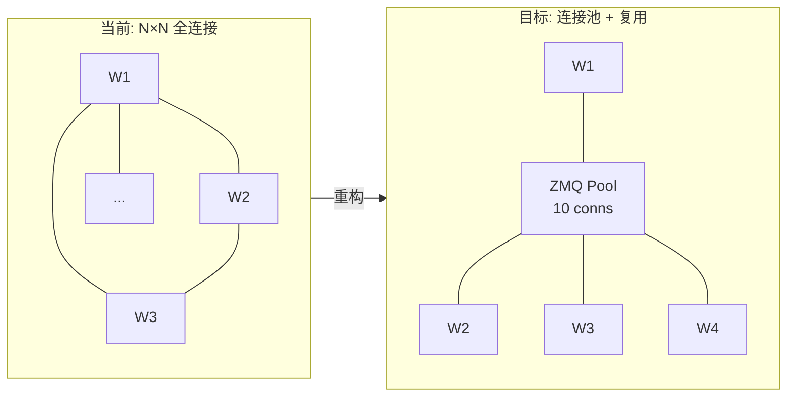
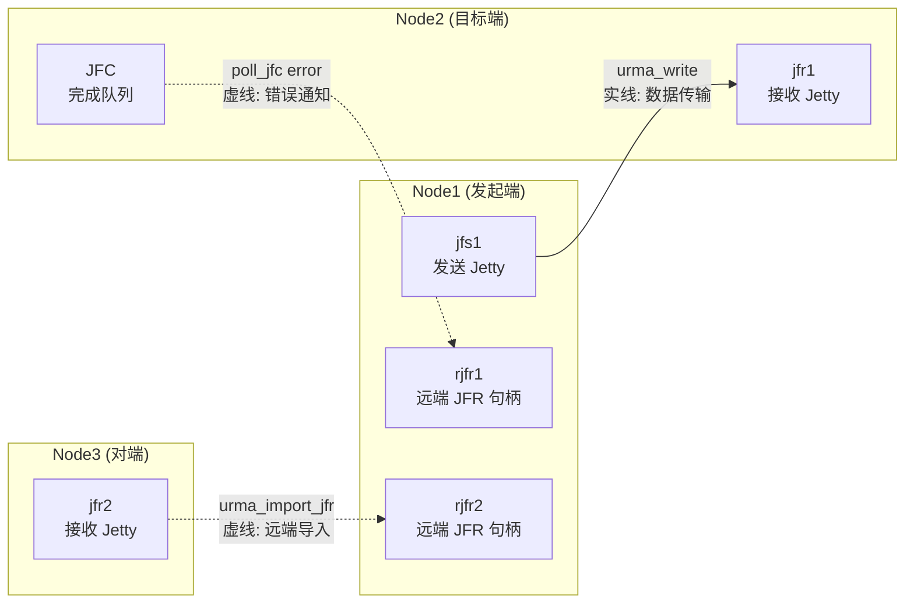
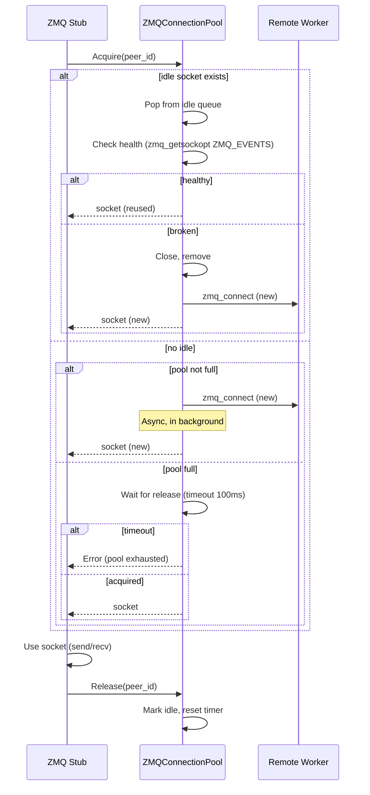
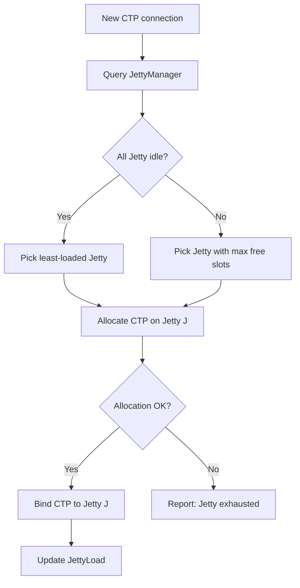
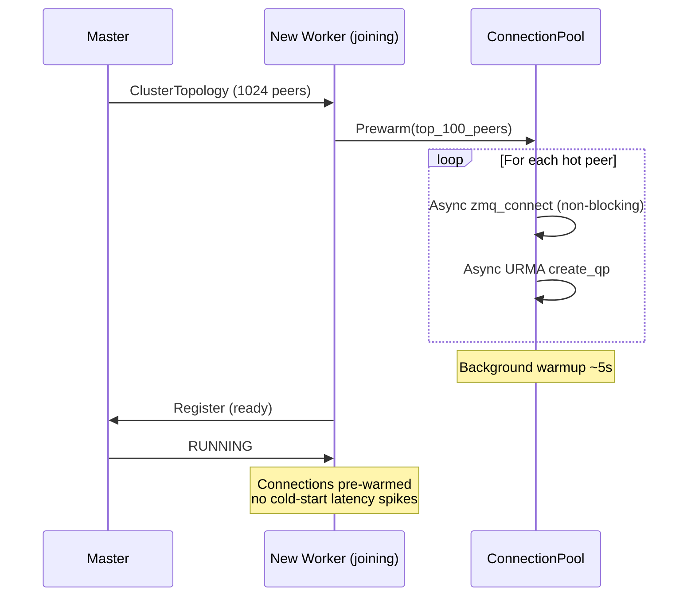
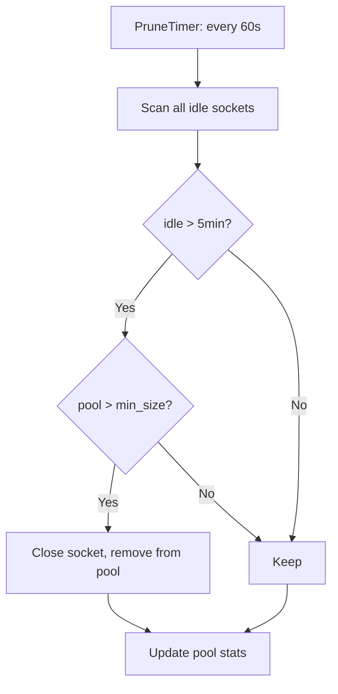

# 1K节点建链优化 — 详细设计

## 一、需求拆解规格

### 1.1 需求分解

| 子需求 ID | 名称 | 描述 | 优先级 |
|-----------|------|------|:--:|
| CO-01 | ZMQ 连接池 | Worker 间 ZMQ socket 复用，避免每请求新建连接 | P0 |
| CO-02 | Jetty 复用 | 单 Jetty 多 CTP 连接，降低[芯片厂商]片上 Jetty Cache 压力 | P0 |
| CO-03 | URMA QP 池化 | URMA QP 预建 + 复用，避免扩缩容建链毛刺 | P1 |
| CO-04 | 连接预热 | 扩容时预建连接，避免冷启动性能毛刺 | P1 |
| CO-05 | 连接数治理 | 连接数上限控制、LRU 淘汰、空闲回收 | P1 |

### 1.2 定量指标

| 指标 | 当前 (100节点) | 目标 (1024节点) |
|------|------|------|
| Worker-Worker 连接数 | O(N²) = 10K | O(N×K) ≈ 10K (K=10 pool) |
| ZMQ socket 创建耗时 | ~50ms/socket | < 1ms (池化复用) |
| URMA QP 创建耗时 | ~100ms/QP | < 1ms (预建) |
| 扩缩容毛刺 (P99.99) | > 100ms | < 10ms |
| [芯片厂商] Jetty Cache 压力 | 每连接独占 | 单 Jetty 多路复用 |
| 连接内存占用 | ~500MB | ~100MB |

### 1.3 问题根因分析

**[芯片厂商] Jetson 片上 Jetty Cache 不足：**
```
HCCS 互联拓扑: 每个 chip 有固定数量的 Jetty (片上互连单元)
1024 节点场景: Worker-Worker 全连接 → O(N²) = ~1M 连接
每连接消耗一个 Jetty Cache Line → Cache 溢出 → LRU 抖动 → 性能下降
```

**ZMQ socket 创建开销：**
```
zmq socket 创建: zmq_connect → TCP handshake → ZMTP greeting → metadata exchange
冷启动: 50-100ms，扩缩容时大量新连接创建 → P99.99 尖刺
```

---

## 二、概念模型

### 2.1 连接架构演进



### 2.2 URMA Jetty/JFR 连接模型

#### 核心概念

| 概念 | 全称 | 作用 |
|------|------|------|
| **Jetty** | URMA Jetty | URMA 层的 QP (Queue Pair)，负责发送/接收 |
| **JFS** | Jetty Flow Send? | 发送端 Jetty (带发送队列) |
| **JFR** | Jetty Flow Receive | 接收端 Jetty 的接收缓冲区 |
| **JFC** | Jetty Flow Completion | 完成队列，轮询获取操作结果 |
| **JFCE** | Jetty Flow Completion Event | 事件通道，JFC 的事件通知 |
| **rJFR** | Remote Jetty Flow Receive | 导入的远端 JFR 句柄 |

#### Jetty 连接与错误恢复模型



**数据写入路径 (正常):**
1. Node1 `urma_post_jetty_send_wr(jfs1, ...)` → 数据通过 RDMA 写入 Node2 的 jfr1 缓冲区
2. Node2 `poll_jfc` → 轮询完成队列，获取写入成功/失败事件
3. 成功 → 完成; 失败 → 触发错误恢复

**错误恢复路径 (虚线):**
1. Node2 的 JFC 轮询检测到 `URMA_CR_WR_FLUSH_ERR_DONE` (写入刷新错误)
2. Node2 → Node1: 通过 rjfr1 句柄通知 Node1 "写入失败"
3. Node1 收到错误 → 触发 `UrmaConnection::ReCreateJetty()`:
   - `MarkInvalid()` 原子标记旧 Jetty
   - `UrmaResource::CreateJetty()` 创建新 Jetty
   - `BindConnection()` 绑定新 Jetty
   - `AsyncModifyJettyToError()` 异步销毁旧 Jetty

**远端导入路径 (虚线):**
1. Node3 的 jfr2 → Node1 `urma_import_jetty(ctx, remote_jetty, token)` → 创建 rjfr2
2. rjfr2 是 Node1 本地对 Node3 远端 JFR 的引用
3. Node1 可以通过 rjfr2 向 Node3 发起 `urma_write`

#### Jetty 复用核心思想

```
当前 (每连接独占 Jetty):
  1024 节点 → 每个 Worker 维护 ~1024 个 Jetty
  总 Jetty 数: O(N²) ≈ 1M
  [芯片厂商]芯片每 chip Jetty Cache Line 有限 → LRU 抖动 → 性能下降

目标 (Jetty 复用):
  单 Jetty 承载 8 个 CTP 连接 → 每 Worker Jetty 数 = 1024/8 = 128
  总 Jetty 数: O(N×K) ≈ 100K (K=pool_size)
  Jetty Cache 压力降低 8× → Cache miss < 1%
```

### 2.3 新增核心对象

**ZMQConnectionPool** — ZMQ socket 连接池：

```
ZMQConnectionPool (per Worker):
  - size: uint32 (default=10)
  - sockets: deque<zmq::socket_t>  // idle sockets
  - active: map<peer_id, zmq::socket_t>  // in-use
  - Acquire(peer_id) → zmq::socket_t  // 获取连接 (复用或新建)
  - Release(peer_id) → void           // 归还连接
  - Prewarm(target_peers) → void     // 预热连接
  - PruneIdle(max_idle_time) → void  // 回收空闲
  - Stats() → PoolStats              // 统计
```

**JettyManager** — Jetty 复用管理：

```
JettyManager (per chip):
  - jetty_count: uint32  // 片上 Jetty 总数
  - ctp_per_jetty: uint32  // 每个 Jetty 承载的 CTP 连接数
  - AllocateCTP() → (jetty_id, ctp_id)
  - ReleaseCTP(jetty_id, ctp_id) → void
  - JettyLoad(jetty_id) → float  // Jetty 负载 (0-1)
```

**URMAConnectionPool** — URMA QP 连接池：

```
URMAConnectionPool (per Worker):
  - qp_pool: map<peer_id, QueuePair>
  - CreateQP(peer_id, config) → QueuePair  // 预建 QP
  - GetOrCreateQP(peer_id) → QueuePair
  - PruneQP(peer_id) → void
  - WarmupQP(target_peers) → void  // 扩容预热
```

---

## 三、关键流程设计

### 3.1 ZMQ 连接池获取



### 3.2 Jetty 分配



### 3.3 扩容预热



### 3.4 连接回收



### 3.5 连接池详细 API 设计

#### ZMQConnectionPool

```cpp
class ZMQConnectionPool {
public:
    struct Config {
        uint32_t pool_size = 10;           // 每 peer 最大连接数
        uint32_t max_total_conns = 10000;  // 全局最大连接数
        uint32_t acquire_timeout_ms = 100; // 获取超时
        uint32_t idle_timeout_s = 300;     // 空闲回收超时
        uint32_t health_check_interval_s = 30;  // 健康检查间隔
        uint32_t prewarm_conns = 100;      // 预热连接数
    };
    
    explicit ZMQConnectionPool(const Config &cfg);
    
    // 获取连接 (从池中借出)
    // 如果 peer 已有 idle socket → 复用
    // 如果 pool 未满 → 异步创建新 socket
    // 如果 pool 已满 → 等待 acquire_timeout_ms 或返回错误
    Status Acquire(const std::string &peer_id,
                   std::shared_ptr<zmq::socket_t> *socket);
    
    // 归还连接 (不关闭, 放回 idle 队列)
    void Release(const std::string &peer_id,
                 std::shared_ptr<zmq::socket_t> socket);
    
    // 预热连接 — 扩容时提前建连
    void Prewarm(const std::vector<std::string> &hot_peers);
    
    // 健康检查 — 检测断连并重建
    void HealthCheck();
    
    // 回收空闲 — 周期性调用
    void PruneIdle();
    
    struct PoolStats {
        uint64_t total_acquisitions;
        uint64_t cache_hits;          // 复用次数
        uint64_t cache_misses;        // 新建次数
        uint64_t acquire_timeouts;    // 超时次数
        size_t current_active;        // 当前使用中
        size_t current_idle;          // 当前空闲
        double hit_rate;              // 命中率
    };
    PoolStats Stats() const;

private:
    struct PeerPool {
        std::deque<std::shared_ptr<zmq::socket_t>> idle;    // 空闲队列
        std::set<std::shared_ptr<zmq::socket_t>> active;    // 使用中
        uint64_t last_used_us;                              // 最后使用时间
        size_t create_count;                                // 总创建数
    };
    
    std::mutex mutex_;
    std::unordered_map<std::string, PeerPool> pools_;  // peer_id → pool
    std::atomic<size_t> total_conns_{0};
    Config cfg_;
    PoolStats stats_;
};
```

#### URMAConnectionPool

```cpp
class URMAConnectionPool {
public:
    struct Config {
        uint32_t qp_pool_size = 10;         // 每 peer 最大 QP 数
        uint32_t prewarm_count = 100;       // 预热 QP 数
        uint32_t idle_timeout_s = 600;      // 空闲回收超时 (比 ZMQ 长, QP 创建更贵)
        uint32_t max_inflight_per_qp = 64;  // 每 QP 最大飞行请求数
    };
    
    explicit URMAConnectionPool(std::shared_ptr<UrmaResource> resource,
                                const Config &cfg);
    
    // 获取或创建 QP
    Status GetOrCreateQP(const std::string &peer_id,
                         std::shared_ptr<UrmaJetty> *jetty,
                         std::shared_ptr<UrmaTargetJetty> *target_jetty);
    
    // 预热 QP — 扩容时调用, 批量预建
    void Warmup(const std::vector<std::string> &hot_peers);
    
    // 回收空闲 QP
    void PruneIdle();
    
    // Peer 断开时清理
    void RemovePeer(const std::string &peer_id);
    
    struct QPPoolStats {
        uint64_t total_creates;
        uint64_t total_reuses;
        uint64_t total_deletes;
        uint64_t create_timeouts;
        size_t current_active_qps;
    };
    QPPoolStats Stats() const;

private:
    std::shared_ptr<UrmaResource> resource_;
    std::unordered_map<std::string, std::deque<QPair>> peer_qps_;
    std::mutex mutex_;
    Config cfg_;
};
```

#### JettyManager

```cpp
class JettyManager {
public:
    struct Config {
        uint32_t max_ctp_per_jetty = 8;     // 每 Jetty 最大 CTP 数
        AllocationMode mode = LEAST_LOADED;  // 分配策略
        bool enable_numa_affinity = true;    // NUMA 亲和性
    };
    
    enum AllocationMode { LEAST_LOADED, ROUND_ROBIN, NUMA_AWARE };
    
    struct AllocResult {
        urma_jetty_t *jetty;        // 分配的 Jetty 句柄
        uint32_t ctp_id;            // 分配的 CTP ID
        float jetty_load;           // 分配后的负载
    };
    
    explicit JettyManager(std::shared_ptr<UrmaContext> ctx,
                          const Config &cfg);
    
    // 分配一个 CTP 到负载最低的 Jetty
    Status AllocateCTP(AllocResult *result);
    
    // 释放 CTP
    Status ReleaseCTP(urma_jetty_t *jetty, uint32_t ctp_id);
    
    // 获取 Jetty 负载 (0-1)
    float GetJettyLoad(urma_jetty_t *jetty) const;
    
    // 获取所有 Jetty 的负载分布
    std::vector<float> GetJettyLoads() const;
    
    struct JettyStats {
        uint32_t total_jetties;
        uint32_t total_ctps;
        uint32_t allocated_ctps;
        float max_load;
        float avg_load;
        float load_variance;
    };
    JettyStats Stats() const;

private:
    struct JettySlot {
        urma_jetty_t *jetty;
        std::bitset<256> ctp_mask;  // bitmask 标记已分配的 CTP
        uint32_t allocated_count;
        uint8_t numa_node;
        uint8_t chip_id;
    };
    
    std::string SelectLeastLoadedJetty();
    std::string SelectRoundRobinJetty();
    std::string SelectNUMAAwareJetty(uint8_t preferred_numa);
    
    std::vector<JettySlot> jetties_;
    size_t rr_index_ = 0;  // Round-robin 指针
    std::mutex mutex_;
    Config cfg_;
};
```

### 3.6 连接池集成点 (与现有代码的对接)

```
当前代码路径 → 修改后

ZMQ Stub 创建:
  ZmqStubImpl::InitConn()
    → ZmqStubConnMgr::GetConn()        // 当前: 直接创建 ZMQ socket
    → [修改为] ZMQConnectionPool::Acquire()  // 从池中获取
    
URMA 数据传输:
  WorkerWorkerOCServiceImpl::GetObjectRemote()
    → UrmaWritePayload(urmaInfo, ...)             // 当前: 直接使用已创建 QP
    → [修改为] URMAConnectionPool::GetOrCreateQP()  // 从池中获取
    
Jetty 分配:
  UrmaJetty::Create(resource, type, &jetty)       // 当前: 每次新 Jetty
    → [修改为] JettyManager::AllocateCTP()          // 管理化分配
```

### 3.7 健康检查与恢复

```cpp
// ZMQ Pool 健康检查 (每 30s)
void ZMQConnectionPool::HealthCheck() {
    std::lock_guard<std::mutex> lock(mutex_);
    for (auto &[peer_id, pool] : pools_) {
        // 检查 idle 队列
        auto it = pool.idle.begin();
        while (it != pool.idle.end()) {
            int events = 0;
            size_t events_len = sizeof(events);
            zmq_getsockopt((*it)->handle(), ZMQ_EVENTS, &events, &events_len);
            
            if (!(events & ZMQ_POLLOUT)) {
                // Socket 不可写 → 连接断开 → 移除
                it = pool.idle.erase(it);
            } else {
                ++it;
            }
        }
        
        // 检查 active 集合
        for (auto &sock : pool.active) {
            int events = 0;
            size_t events_len = sizeof(events);
            zmq_getsockopt(sock->handle(), ZMQ_EVENTS, &events, &events_len);
            if (!(events & ZMQ_POLLIN)) {
                // Socket 不可读 → 标记为待替换
                MarkForReplacement(peer_id, sock);
            }
        }
    }
}

// URMA QP 健康检查
void URMAConnectionPool::HealthCheck(const std::string &peer_id) {
    auto &qps = peer_qps_[peer_id];
    for (auto &qp : qps) {
        if (!qp.connection->IsStable()) {
            // QP 不稳定 → 重建
            qp.connection->ReCreateJetty();
        }
    }
}
```

---

## 四、代码模块影响 (已更新)

| 模块 | 文件 | 改动类型 | 说明 |
|------|------|:--:|------|
| ZMQ Pool | `src/datasystem/common/rpc/zmq/zmq_connection_pool.h/.cpp` | **新增** | ZMQ 连接池实现 |
| ZMQ Stub | `src/datasystem/common/rpc/zmq/zmq_stub_impl.cpp` | **修改** | 使用连接池替代直连 |
| ZMQ Service | `src/datasystem/common/rpc/zmq/zmq_service.cpp` | **修改** | Server 端连接管理 |
| URMA Pool | `src/datasystem/common/rdma/urma_connection_pool.h/.cpp` | **新增** | URMA QP 池化 |
| URMA Manager | `src/datasystem/common/rdma/urma_manager.h/.cpp` | **修改** | 集成预建和复用 |
| Jetty Manager | `src/datasystem/common/transport/jetty_manager.h/.cpp` | **新增** | Jetty 分配管理 |
| Worker | `src/datasystem/worker/worker_oc_server.cpp` | **修改** | 启动时初始化连接池 |
| Config | `common/gflags/*` | **修改** | 连接池大小等配置 |

### 新增/修改 Flag

| Flag | Default | 说明 |
|------|---------|------|
| `zmq_pool_size` | `10` | ZMQ 连接池大小 |
| `zmq_pool_max_idle_s` | `300` | ZMQ 空闲超时回收 |
| `zmq_pool_health_check_s` | `30` | ZMQ 健康检查间隔 |
| `urma_qp_pool_size` | `10` | URMA QP 池大小 |
| `urma_qp_prewarm_count` | `100` | 预热目标数 |
| `jetty_ctp_per_jetty` | `8` | 每 Jetty 承载 CTP 数 |
| `jetty_allocation_mode` | `least_loaded` | Jetty 分配策略 |

---

## 五、工作量估算

| 子需求 | 开发 | 测试 | 合计 |
|--------|:--:|:--:|:--:|
| CO-01 ZMQ 连接池 | 5d | 2d | 7d |
| CO-02 Jetty 复用 | 8d | 3d | 11d |
| CO-03 URMA QP 池化 | 5d | 2d | 7d |
| CO-04 连接预热 | 3d | 2d | 5d |
| CO-05 连接治理 | 3d | 1d | 4d |
| **合计** | **24d** | **10d** | **34d** |

### 拆解到 2 人

| 角色 | 负责 |
|------|------|
| 人力 A: ZMQ + Jetty | CO-01 + CO-02 + CO-04 + CO-05 |
| 人力 B: URMA + 集成测试 | CO-03 + CO-04 (URMA预热) + 集成测试 |

---

## 六、与 Mooncake 对比

| 维度 | Mooncake | 我们方案 |
|------|---------|---------|
| 连接管理 | Transfer Engine 多路复用 (16KB slice) | ZMQ Pool + URMA Pool 双通道 |
| NUMA 感知 | 自动拓扑发现 + NUMA 绑定 RDMA NIC | 类似 + Jetty 独立管理 ([芯片厂商]特有) |
| 连接预热 | TE 内置 | 显式 Prewarm API |
| Jetty 问题 | 无 (NVLink/RDMA) | **自主解决** ([芯片厂商] HCCS 特有) |
| 1K 节点 | 产线验证 (Kimi) | **设计目标** |

### 我们的优势
1. **双通道解耦**: ZMQ 控制面 + URMA 数据面独立池化，互不影响
2. **Jetty 分配器**: 解决[芯片厂商]片上 Jetty Cache 不足问题（Mooncake 不涉及）
3. **Prewarm API**: 扩容场景显式控制，更精确
4. **连接治理**: 空闲回收 + LRU + 健康检查，避免连接泄漏

---

## 七、验证方案

| 测试场景 | 方法 | 通过标准 |
|----------|------|---------|
| 1024 节点建链 | 全集群启动，统计建链时间 | < 10s 全量建链 |
| 扩缩容毛刺 | 扩容 100→200 节点，监控 P99.99 | P99.99 < 10ms |
| Jetty 负载均衡 | 写入压力下统计各 Jetty 使用率 | 偏差 < 15% |
| 连接池耗尽 | 压测 > pool_size 并发，验证排队 | 排队不超时 |
| 空闲回收 | idle 5min 后检查连接数 | 连接正确回收 |
| [芯片厂商]环境验证 | 类鲲鹏/昇腾节点上实际测试 | Jetty Cache miss < 1% |

## 引用

- 词汇表: `rfc/shared/glossary.md`
- DFX 完整分析: `rfc/shared/dfx-analysis.md`
- FDS 模板: `rfc/shared/fds-template.md`
- 需求分解: `rfc/shared/requirement-decomposition.md`
