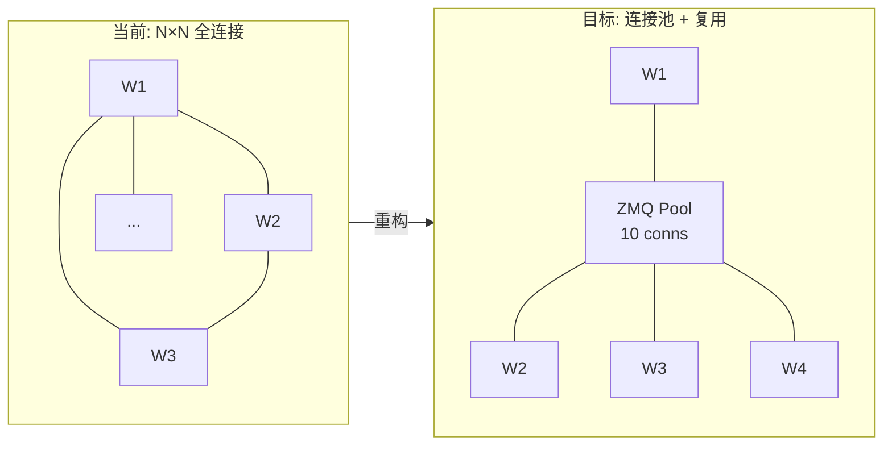
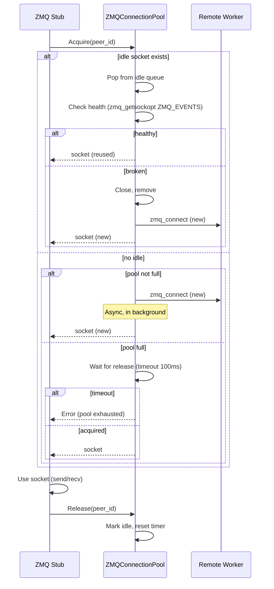
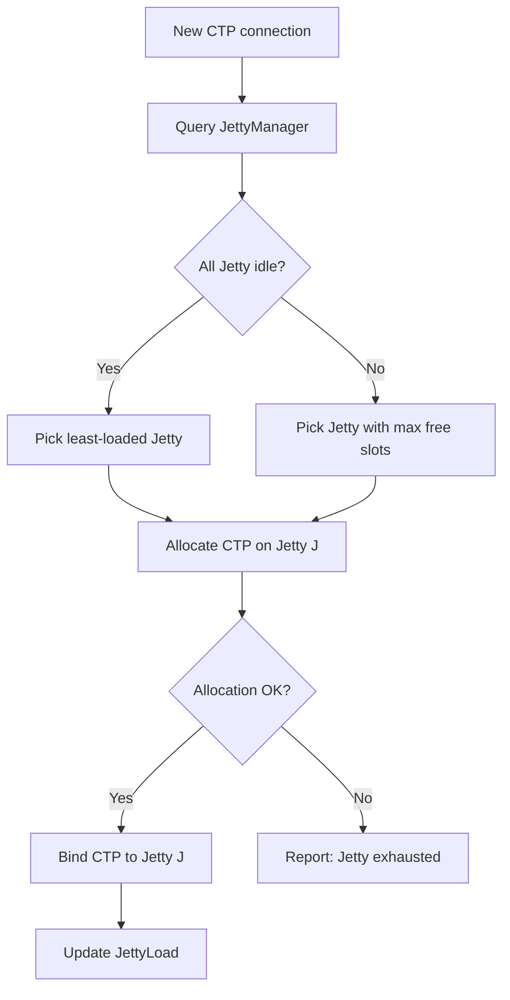
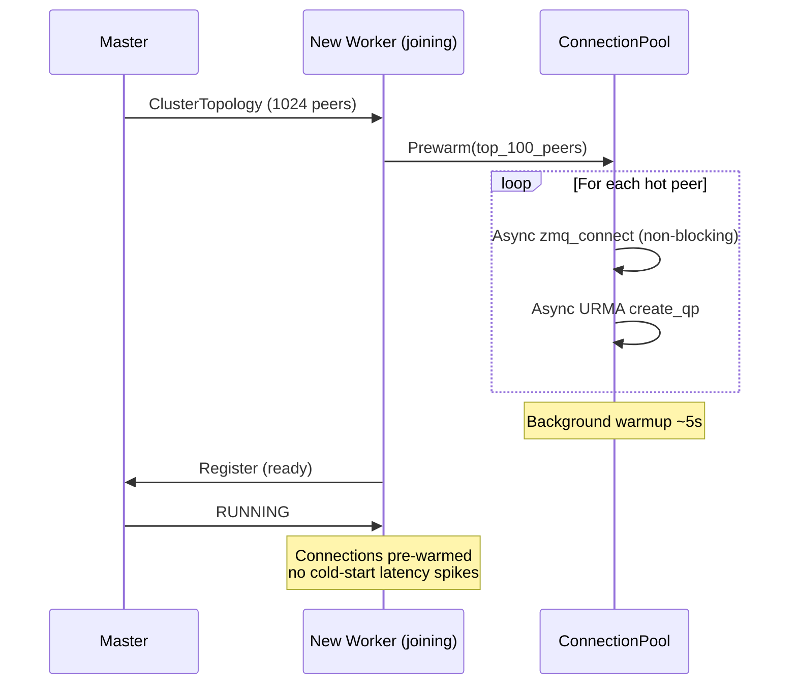
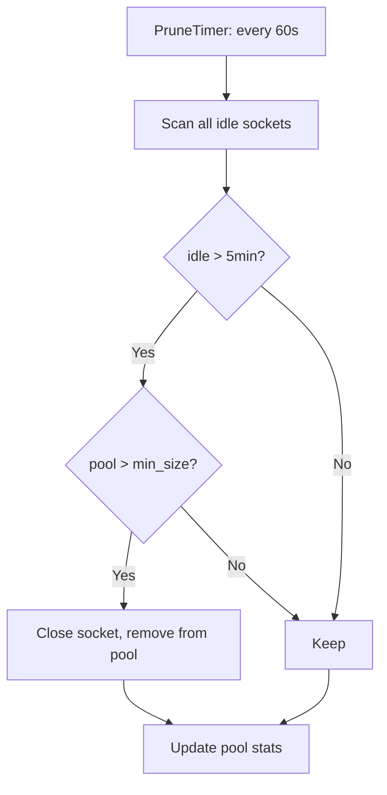

# 1K节点建链优化 — 详细设计

## 一、需求拆解规格

### 1.1 需求分解

| 子需求 ID | 名称 | 描述 | 优先级 |
|-----------|------|------|:--:|
| CO-01 | ZMQ 连接池 | Worker 间 ZMQ socket 复用，避免每请求新建连接 | P0 |
| CO-02 | Jetty 复用 | 单 Jetty 多 CTP 连接，降低海思片上 Jetty Cache 压力 | P0 |
| CO-03 | URMA QP 池化 | URMA QP 预建 + 复用，避免扩缩容建链毛刺 | P1 |
| CO-04 | 连接预热 | 扩容时预建连接，避免冷启动性能毛刺 | P1 |
| CO-05 | 连接数治理 | 连接数上限控制、LRU 淘汰、空闲回收 | P1 |

### 1.2 定量指标

| 指标 | 当前 (100节点) | 目标 (1024节点) |
|------|------|------|
| Worker-Worker 连接数 | O(N²) = 10K | O(N×K) ≈ 10K (K=10 pool) |
| ZMQ socket 创建耗时 | ~50ms/socket | < 1ms (池化复用) |
| URMA QP 创建耗时 | ~100ms/QP | < 1ms (预建) |
| 扩缩容毛刺 (P99.99) | > 100ms | < 10ms |
| 海思 Jetty Cache 压力 | 每连接独占 | 单 Jetty 多路复用 |
| 连接内存占用 | ~500MB | ~100MB |

### 1.3 问题根因分析

**海思 Jetson 片上 Jetty Cache 不足：**
```
HCCS 互联拓扑: 每个 chip 有固定数量的 Jetty (片上互连单元)
1024 节点场景: Worker-Worker 全连接 → O(N²) = ~1M 连接
每连接消耗一个 Jetty Cache Line → Cache 溢出 → LRU 抖动 → 性能下降
```

**ZMQ socket 创建开销：**
```
zmq socket 创建: zmq_connect → TCP handshake → ZMTP greeting → metadata exchange
冷启动: 50-100ms，扩缩容时大量新连接创建 → P99.99 尖刺
```

---

## 二、概念模型

### 2.1 连接架构演进



### 2.2 新增核心对象

**ZMQConnectionPool** — ZMQ socket 连接池：

```
ZMQConnectionPool (per Worker):
  - size: uint32 (default=10)
  - sockets: deque<zmq::socket_t>  // idle sockets
  - active: map<peer_id, zmq::socket_t>  // in-use
  - Acquire(peer_id) → zmq::socket_t  // 获取连接 (复用或新建)
  - Release(peer_id) → void           // 归还连接
  - Prewarm(target_peers) → void     // 预热连接
  - PruneIdle(max_idle_time) → void  // 回收空闲
  - Stats() → PoolStats              // 统计
```

**JettyManager** — Jetty 复用管理：

```
JettyManager (per chip):
  - jetty_count: uint32  // 片上 Jetty 总数
  - ctp_per_jetty: uint32  // 每个 Jetty 承载的 CTP 连接数
  - AllocateCTP() → (jetty_id, ctp_id)
  - ReleaseCTP(jetty_id, ctp_id) → void
  - JettyLoad(jetty_id) → float  // Jetty 负载 (0-1)
```

**URMAConnectionPool** — URMA QP 连接池：

```
URMAConnectionPool (per Worker):
  - qp_pool: map<peer_id, QueuePair>
  - CreateQP(peer_id, config) → QueuePair  // 预建 QP
  - GetOrCreateQP(peer_id) → QueuePair
  - PruneQP(peer_id) → void
  - WarmupQP(target_peers) → void  // 扩容预热
```

---

## 三、关键流程设计

### 3.1 ZMQ 连接池获取



### 3.2 Jetty 分配



### 3.3 扩容预热



### 3.4 连接回收



---

## 四、代码模块影响

| 模块 | 文件 | 改动类型 | 说明 |
|------|------|:--:|------|
| ZMQ Pool | `src/datasystem/common/rpc/zmq/zmq_connection_pool.h/.cpp` | **新增** | ZMQ 连接池实现 |
| ZMQ Stub | `src/datasystem/common/rpc/zmq/zmq_stub_impl.cpp` | **修改** | 使用连接池替代直连 |
| ZMQ Service | `src/datasystem/common/rpc/zmq/zmq_service.cpp` | **修改** | Server 端连接管理 |
| URMA Pool | `src/datasystem/common/rdma/urma_connection_pool.h/.cpp` | **新增** | URMA QP 池化 |
| URMA Manager | `src/datasystem/common/rdma/urma_manager.h/.cpp` | **修改** | 集成预建和复用 |
| Jetty Manager | `src/datasystem/common/transport/jetty_manager.h/.cpp` | **新增** | Jetty 分配管理 |
| Worker | `src/datasystem/worker/worker_oc_server.cpp` | **修改** | 启动时初始化连接池 |
| Config | `common/gflags/*` | **修改** | 连接池大小等配置 |

### 新增/修改 Flag

| Flag | Default | 说明 |
|------|---------|------|
| `zmq_pool_size` | `10` | ZMQ 连接池大小 |
| `zmq_pool_max_idle_s` | `300` | ZMQ 空闲超时回收 |
| `zmq_pool_health_check_s` | `30` | ZMQ 健康检查间隔 |
| `urma_qp_pool_size` | `10` | URMA QP 池大小 |
| `urma_qp_prewarm_count` | `100` | 预热目标数 |
| `jetty_ctp_per_jetty` | `8` | 每 Jetty 承载 CTP 数 |
| `jetty_allocation_mode` | `least_loaded` | Jetty 分配策略 |

---

## 五、工作量估算

| 子需求 | 开发 | 测试 | 合计 |
|--------|:--:|:--:|:--:|
| CO-01 ZMQ 连接池 | 5d | 2d | 7d |
| CO-02 Jetty 复用 | 8d | 3d | 11d |
| CO-03 URMA QP 池化 | 5d | 2d | 7d |
| CO-04 连接预热 | 3d | 2d | 5d |
| CO-05 连接治理 | 3d | 1d | 4d |
| **合计** | **24d** | **10d** | **34d** |

### 拆解到 2 人

| 角色 | 负责 |
|------|------|
| 人力 A: ZMQ + Jetty | CO-01 + CO-02 + CO-04 + CO-05 |
| 人力 B: URMA + 集成测试 | CO-03 + CO-04 (URMA预热) + 集成测试 |

---

## 六、与 Mooncake 对比

| 维度 | Mooncake | 我们方案 |
|------|---------|---------|
| 连接管理 | Transfer Engine 多路复用 (16KB slice) | ZMQ Pool + URMA Pool 双通道 |
| NUMA 感知 | 自动拓扑发现 + NUMA 绑定 RDMA NIC | 类似 + Jetty 独立管理 (海思特有) |
| 连接预热 | TE 内置 | 显式 Prewarm API |
| Jetty 问题 | 无 (NVLink/RDMA) | **自主解决** (海思 HCCS 特有) |
| 1K 节点 | 产线验证 (Kimi) | **设计目标** |

### 我们的优势
1. **双通道解耦**: ZMQ 控制面 + URMA 数据面独立池化，互不影响
2. **Jetty 分配器**: 解决海思片上 Jetty Cache 不足问题（Mooncake 不涉及）
3. **Prewarm API**: 扩容场景显式控制，更精确
4. **连接治理**: 空闲回收 + LRU + 健康检查，避免连接泄漏

---

## 七、验证方案

| 测试场景 | 方法 | 通过标准 |
|----------|------|---------|
| 1024 节点建链 | 全集群启动，统计建链时间 | < 10s 全量建链 |
| 扩缩容毛刺 | 扩容 100→200 节点，监控 P99.99 | P99.99 < 10ms |
| Jetty 负载均衡 | 写入压力下统计各 Jetty 使用率 | 偏差 < 15% |
| 连接池耗尽 | 压测 > pool_size 并发，验证排队 | 排队不超时 |
| 空闲回收 | idle 5min 后检查连接数 | 连接正确回收 |
| 海思环境验证 | 类鲲鹏/昇腾节点上实际测试 | Jetty Cache miss < 1% |
