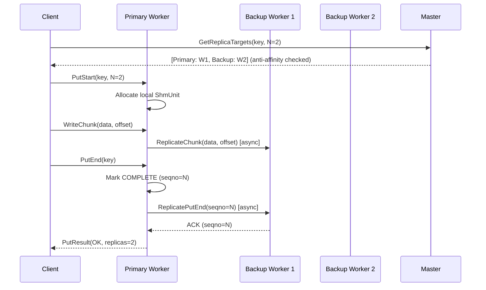
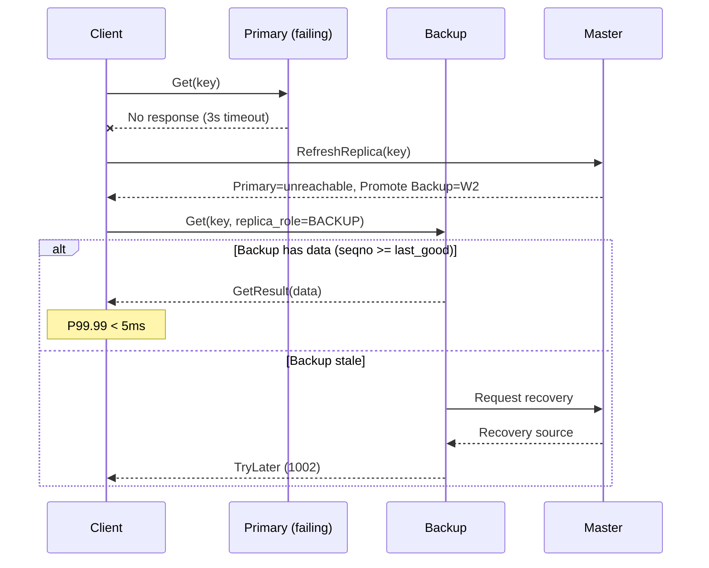
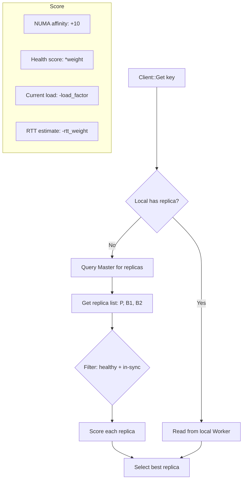
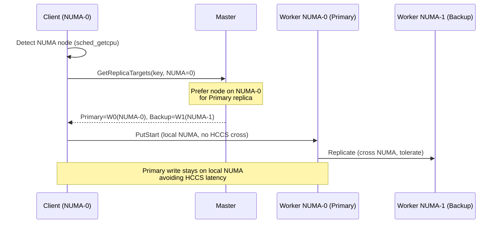
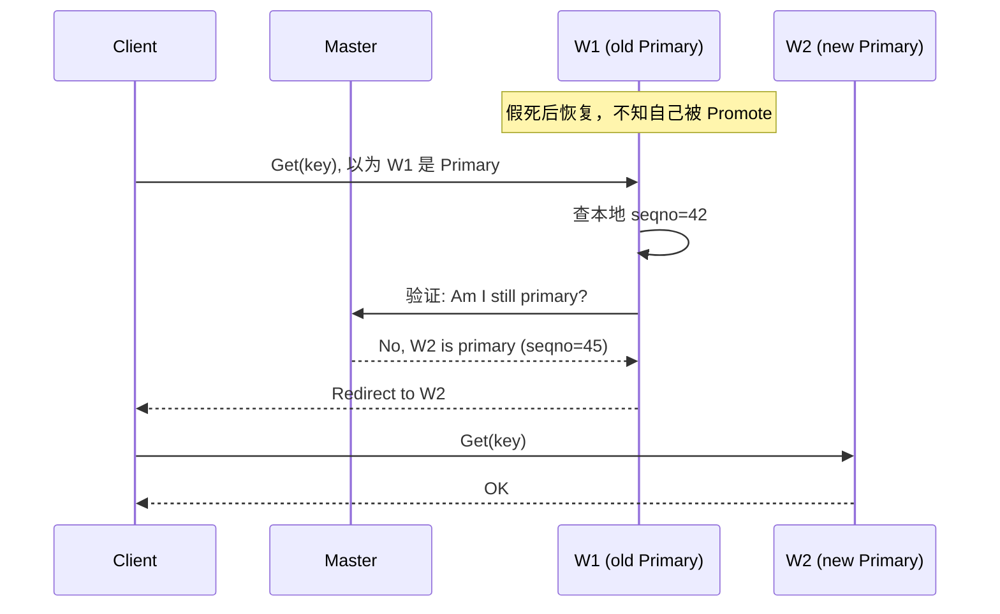
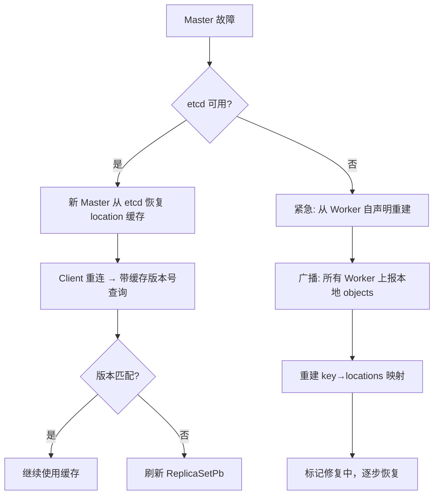

# 数据多副本 — 可靠性 + 性能设计

## 一、需求拆解规格

### 1.1 需求分解

| 子需求 ID | 名称 | 描述 | 优先级 |
|-----------|------|------|:--:|
| MR-01 | 写入多副本 | KV Put 时同步写入 N 个副本 (N=2/3) | P0 |
| MR-02 | 副本反亲和 | 副本分布在不同节点/机架/可用区 | P0 |
| MR-03 | 主备故障切换 | 主副本故障时备副本接管，P99.99 < 5ms | P0 |
| MR-04 | 数据恢复 | 备副本故障后从主副本恢复，不阻塞读写 | P1 |
| MR-05 | 一致性同步老化 | 主备副本 TTL 同步，到期一起淘汰 | P1 |
| MR-06 | 均衡读取 | 从主/备副本选择负载最低者读取 | P0 |
| MR-07 | NUMA 亲和写入 | 写入时优先选择 NUMA 本地节点 | P0 |
| MR-08 | 跨版本兼容 | 主备副本不同版本间可互读 (滚动升级场景) | P1 |

### 1.2 定量指标

| 指标 | 当前 | 目标 |
|------|------|------|
| 故障切换 P99.99 | 分钟级 (Client 重试) | **< 5ms** |
| 8MB KV Get P99.99 | ~10ms (单 Worker) | **< 5ms** (备副本分担) |
| 写入 P99 (副本同步) | ~1ms (单写) | **< 3ms** (主写 + 备异步确认) |
| QPS 提升 (1写10读) | 基准 100% | **+30%** |
| 副本数 | 1 | 2 (默认) |
| 数据丢失窗口 | 分钟级 | 0 (同步写入) |

### 1.3 规格约束

- **最大副本数**: 3 (主 + 2 备)
- **适用场景**: KV 8MB 对象、精排 Decode 1 写 10 读
- **NUMA 亲和**: 写请求路由到同 NUMA node Worker
- **跨 NUMA 容忍**: 不跨 HCCS (Huawei Cache Coherent System)

---

## 二、概念模型

### 2.1 副本模型

```
Object (name + hash_key)
├── PrimaryReplica    — leader copy, 写入入口
│   └── 所在 Worker:  hash_ring.GetNode(key, 0)
├── BackupReplica[0]  — 备副本 1, hash_ring.GetNode(key, 1)
└── BackupReplica[1]  — 备副本 2 (N=3时), hash_ring.GetNode(key, 2)
```

```mermaid
flowchart TB
    subgraph Client
        C[KV Client]
    end
    
    subgraph Node1 [NUMA Node 0]
        W1[Worker A<br/>Primary]
    end
    
    subgraph Node2 [NUMA Node 0]
        W2[Worker B<br/>Backup 1]
    end
    
    subgraph Node3 [Different Rack]
        W3[Worker C<br/>Backup 2]
    end
    
    C -->|1. Put (sync)| W1
    W1 -->|2. Replicate (async)| W2
    W1 -->|3. Replicate (async)| W3
    C -->|4. Get (load-aware)| W2
```

### 2.2 新增核心对象

**ReplicaManager** — 副本生命周期管理：

```
ReplicaManager (per Worker):
  - CreateReplicas(key, value, config) → Status
  - GetBestReplica(key) → ReplicaInfo (nearest/least-loaded)
  - PromoteToPrimary(key) → Status (failover)
  - RecoverReplica(key, from_replica) → Status
  - ReconcileReplicas(key) → Status (TTL sync)
  - ReportReplicaHealth() → HealthStatus

ReplicaInfo:
  - node_id, replica_id, role {PRIMARY, BACKUP}
  - state {INIT, SYNCING, READY, STALE}
  - last_sync_seqno
  - health_score (0-100)
```

---

## 三、关键流程设计

### 3.1 写入多副本流程



**关键决策:**
- 主副本同步写入 (Client → Primary)
- 备副本异步写入 (Primary → Backup)，Client 不等待
- PutEnd 时 Primary 确保 seqno 单调递增
- 备副本 ACK 返回后 Primary 标记 min_synced_seqno

### 3.2 故障切换流程



### 3.3 均衡读取流程



**副本选择策略：**
```python
def select_best_replica(replicas):
    for r in replicas:
        score = (
            +10 if r.local_numa else 0
            + r.health_score * 0.3
            - r.active_requests * 0.1
            - r.rtt_us * 0.001
        )
    return max(replicas, key=score)
```

### 3.4 NUMA 亲和写入



---

## 四、代码模块影响

| 模块 | 文件 | 改动类型 | 说明 |
|------|------|:--:|------|
| KV Client | `src/datasystem/client/kv_cache/kv_client.cpp` | **重构** | 多副本 Put/Get 路径 |
| Object Client | `src/datasystem/client/object_cache/object_client_impl.cpp` | **修改** | 副本选择逻辑 |
| Worker OC | `src/datasystem/worker/object_cache/service/worker_oc_service_impl.cpp` | **重构** | ReplicateChunk 处理 |
| Worker-Worker | `src/datasystem/worker/object_cache/worker_worker_oc_service_impl.cpp` | **修改** | 副本间数据传输 |
| ReplicaManager | `src/datasystem/worker/object_cache/replica_manager.h/.cpp` | **新增** | 副本管理核心 |
| Hash Ring | `src/datasystem/common/metastore/hash_ring.h` | **修改** | 多副本位置计算 |
| Master | `src/datasystem/master/*` | **修改** | 副本放置决策 |
| TTL/Eviction | `src/datasystem/worker/object_cache/*ttl*` | **修改** | 副本同步老化 |
| Metrics | `src/datasystem/common/metrics/kv_metrics.cpp` | **新增** | 副本相关指标 |

### 新增 Metrics

| Metric ID | 名称 | 类型 | 说明 |
|-----------|------|------|------|
| 50 | `replica_create_total` | COUNTER | 副本创建数 |
| 51 | `replica_sync_latency` | HISTOGRAM | 副本同步延迟 |
| 52 | `replica_failover_total` | COUNTER | 故障切换次数 |
| 53 | `replica_failover_latency` | HISTOGRAM | 故障切换延迟 |
| 54 | `backup_read_total` | COUNTER | 从备副本读次数 |
| 55 | `replica_out_of_sync_total` | COUNTER | 副本不同步次数 |

---

## 五、工作量估算

| 子需求 | 开发 | 测试 | 人员 | 合计 |
|--------|:--:|:--:|------|:--:|
| MR-01 写入多副本 | 8d | 3d | A | 11d |
| MR-02 反亲和 | 5d | 2d | B | 7d |
| MR-03 故障切换 | 6d | 3d | A | 9d |
| MR-04 数据恢复 | 5d | 2d | B | 7d |
| MR-05 一致性老化 | 3d | 1d | C | 4d |
| MR-06 均衡读取 | 5d | 2d | C | 7d |
| MR-07 NUMA 亲和 | 5d | 2d | B | 7d |
| MR-08 跨版本兼容 | 3d | 1d | A | 4d |
| **合计** | **40d** | **16d** | 3人 | **56d** |

### 拆解到 3 人并行

| 角色 | 负责 | 依赖 |
|------|------|------|
| 人力 A: 写入路径 | MR-01 + MR-03 + MR-08 | ReplicaManager 接口 |
| 人力 B: 放置/分布 | MR-02 + MR-04 + MR-07 | Hash Ring 修改 |
| 人力 C: 读取路径 | MR-05 + MR-06 | MR-01 (副本存在) |

---

## 六、验证方案

### 6.1 功能验证

| 场景 | 验证方法 | 标准 |
|------|---------|------|
| 正常多副本写入 | Put(N=2), 检查两个 Worker 都有数据 | 数据一致 |
| 主副本故障 | kill Primary, Get 返回备副本数据 | < 5ms 完成 |
| 副本恢复 | kill Backup, 等待自动恢复 | 5min 内恢复 READY |
| 均衡读取 | 1写10读，统计各副本读次数 | 偏差 < 20% |

### 6.2 性能测试

| 指标 | 方法 | 目标 |
|------|------|------|
| 写入 P99 | Put 8MB × 10000次 | < 3ms |
| 故障切换 P99.99 | 主副本 kill × 1000次 | < 5ms |
| QPS 提升 | 1写10读 对比 单副本 vs 多副本 | +30% |

---

## 七、元数据可靠性: key→locations 映射

### 7.1 问题分析

当前架构中，key→locations 映射存储在 Master 的 etcd 中。多副本引入后：

```
key=abc → locations: {
  primary: Worker-1 (running, seqno=42)
  backup_1: Worker-2 (running, seqno=42)
  backup_2: Worker-3 (syncing, seqno=40)
}
```

**元数据可靠性挑战：**

| 故障场景 | 影响 | 当前状态 |
|----------|------|:--:|
| Master 进程重启 | 内存中 location 缓存丢失，需 etcd 重建 | ⚠️ 有 etcd 恢复 |
| etcd 集群故障 | 全部 metadata 丢失，所有 key 位置信息消失 | ⚠️ 单 etcd |
| Master 脑裂 | 双 Master 同时更新 location → 不一致 | ❌ 无保护 |
| 网络分区 | Partition 一侧的 Master 无法更新 location | ❌ 无处理 |
| Worker 假死后恢复 | 旧 location 信息残留 → 脏读 | ⚠️ Lease 机制 |

### 7.2 设计方案

**L1: etcd 持久化 (已有)**
- 所有 `ObjectMetaPb` 持久化到 etcd
- Master 重启从 etcd 恢复

**L2: 客户端缓存 + 版本号 (新增)**

```protobuf
message ReplicaSetPb {
  string primary_address = 1;
  repeated string backup_addresses = 2;
  uint64 version = 3;          // 单调递增版本号
  uint64 primary_seqno = 4;    // 主副本当前 seqno
}
```

Client 本地缓存 `ReplicaSetPb`，每次 GetReplicaList 带版本号：
- Master 返回 `304 Not Modified` (版本不变) → Client 用缓存
- Master 返回新版本 → Client 更新缓存

**L3: Worker 端自声明 (兜底)**



Worker 每次处理 Get/Put 时**自检**：
- 本地 seqno >= Client 期望版本 → 正常服务
- 本地 seqno < Client 期望版本 → 重定向到 Master 返回的 Primary

**L4: Quorum 写入保证一致性**

```
写入时: Primary Write → 等待 ≥ quorum 个副本 ACK → 返回 Client
         Primary 写入 etcd: {key: abc, primary: W1, backups: [W2,W3], seqno: N, version: V}
         
读取时: Client 从 Master 获取 ReplicaSetPb (version=V, primary=W1)
        Client → W1 Get(key)
        W1 自检: 本地 seqno >= 期望版本 → 正常
        若 W1 故障: Client → Master 刷新 → 获得 promote 后的新 Primary
```

### 7.3 元数据故障恢复流程



### 7.4 新增的数据结构

```cpp
// Worker 端 — 每个 object 额外维护
struct ObjectReplicaInfo {
    uint64_t seqno;              // 本地最新 seqno
    bool is_primary;             // 当前是否为 Primary
    std::string primary_addr;    // Master 记录的 Primary 地址
};

// Master 端 — 增强的 location 管理
struct LocationEntry {
    std::string worker_addr;
    AckState state;              // UNACK / ACKED
    uint64_t seqno;              // 该副本的 seqno
    uint64_t last_heartbeat;     // 最后心跳时间
};

// Object → 增强的 location 映射
// Key: object_name → Value: LocationGroup
struct LocationGroup {
    std::string primary_addr;
    std::vector<LocationEntry> replicas;
    uint64_t version;            // 单调递增，Client 缓存用
    uint32_t quorum_size;        // min( (N/2)+1, replica_count )
};
```

### 7.5 数据修复流程

```python
def reconcile_replicas(key):
    """由 Master 定期 (60s) 或故障后触发"""
    locations = master.get_locations(key)
    primary = locations.primary
    
    for replica in locations.replicas:
        if replica.seqno < primary.seqno:
            # 备副本落后 → 触发增量同步
            master.send_recover_command(
                source=primary,
                target=replica,
                from_seqno=replica.seqno,
                to_seqno=primary.seqno
            )
        
        if replica.last_heartbeat < now - 30s:
            # 备副本失联 → 分配新备副本
            new_backup = hash_ring.get_next_node(key, skip=[primary, replica])
            master.send_replicate_command(
                source=primary,
                target=new_backup,
                mode=FULL_SYNC
            )
```

### 7.6 元数据 RPO/RTO

| 场景 | RPO | RTO | 恢复方式 |
|------|-----|-----|---------|
| Master 进程重启 | 0 | < 5s | etcd 恢复 |
| etcd 单点故障 | < 10s (最近 Put) | < 30s | etcd 恢复 + Worker 自声明 |
| 脑裂 | 0 | < 10s | etcd 选举 + fencing token |
| Worker 假死恢复 | 0 | 0 (实时) | Worker 自检 + 重定向 |

---

## 八、与 Mooncake 的对比

| 维度 | Mooncake | 我们方案 | 优势 |
|------|---------|---------|------|
| 副本操作 | Put/Copy/Move 三种 | Put (主+备同步) + Recover | 简化 API |
| 一致性 | PutStart/PutEnd 两阶段 | 同样两阶段 + seqno 锚点 | 等价 |
| 故障切换 | GetReplicaList 自动切换 | Master 主动 Promote + Client 刷新 | 更快的切换路径 |
| 均衡读取 | Conductor 全局调度 | Client 侧 score 选择 | 分散决策，无单点 |
| NUMA 亲和 | 自动拓扑发现 | 同样 sched_getcpu + Master 偏好 | 等价 |
| 反亲和 | Slice 级 | Object 级 (key hash) | 更粗粒度，但足够 |
