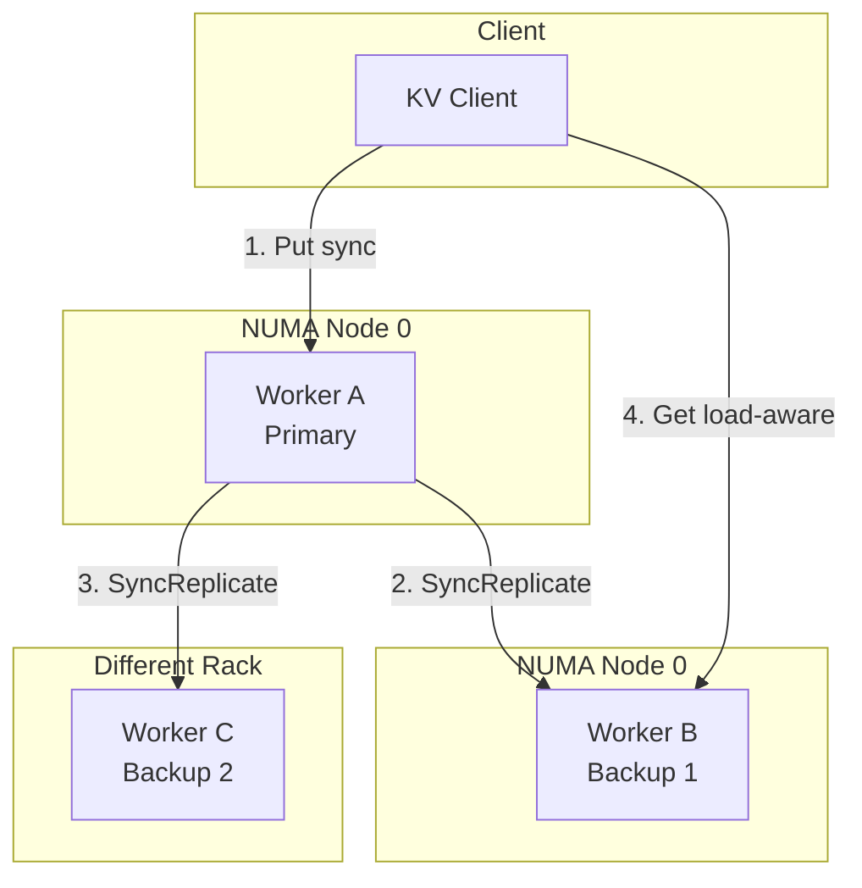
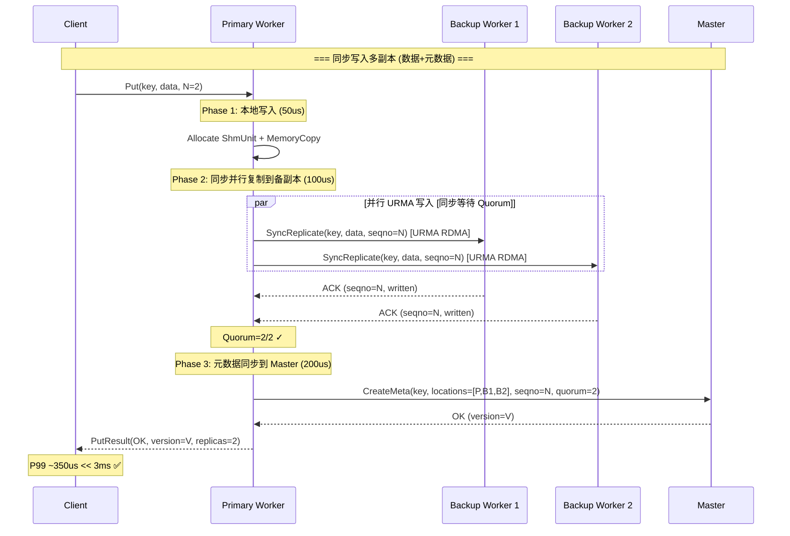
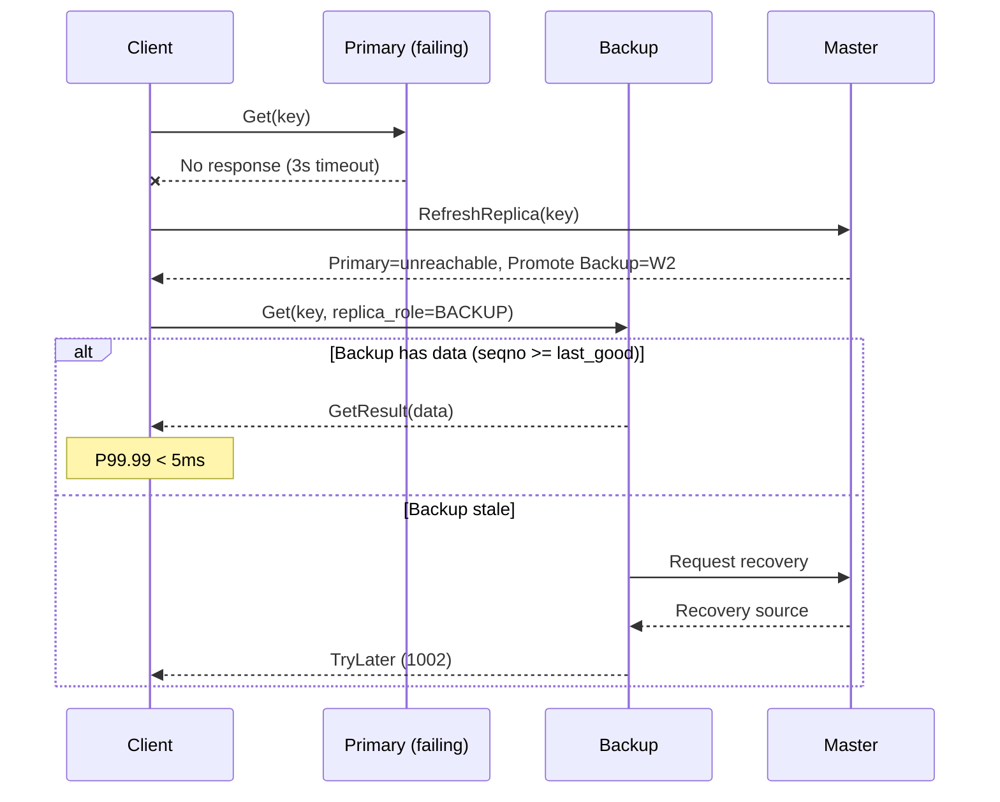
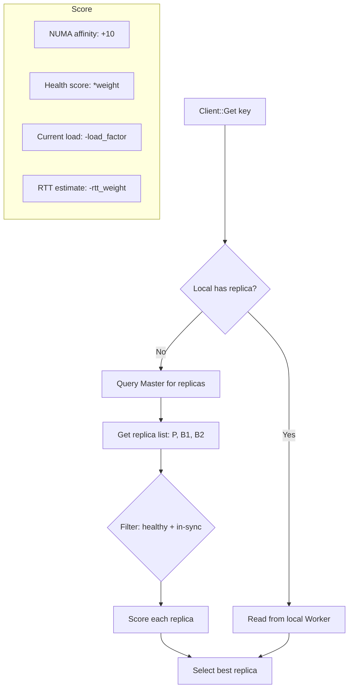
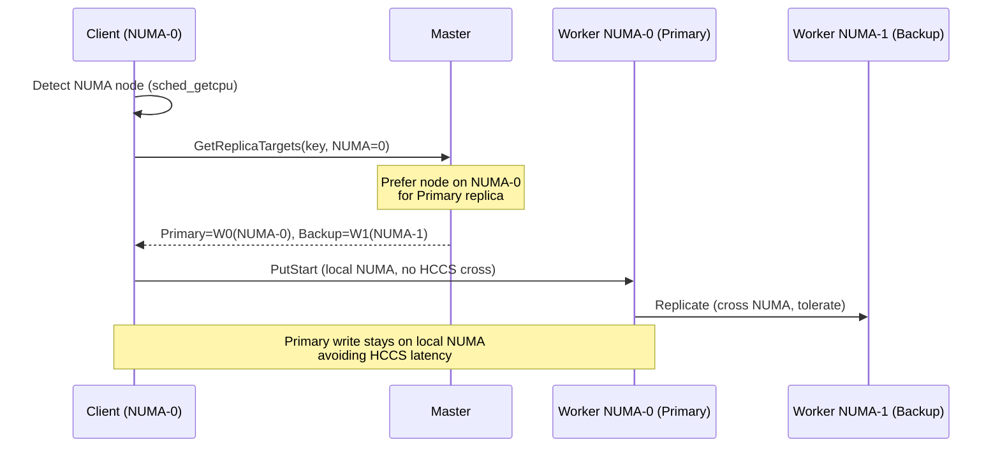
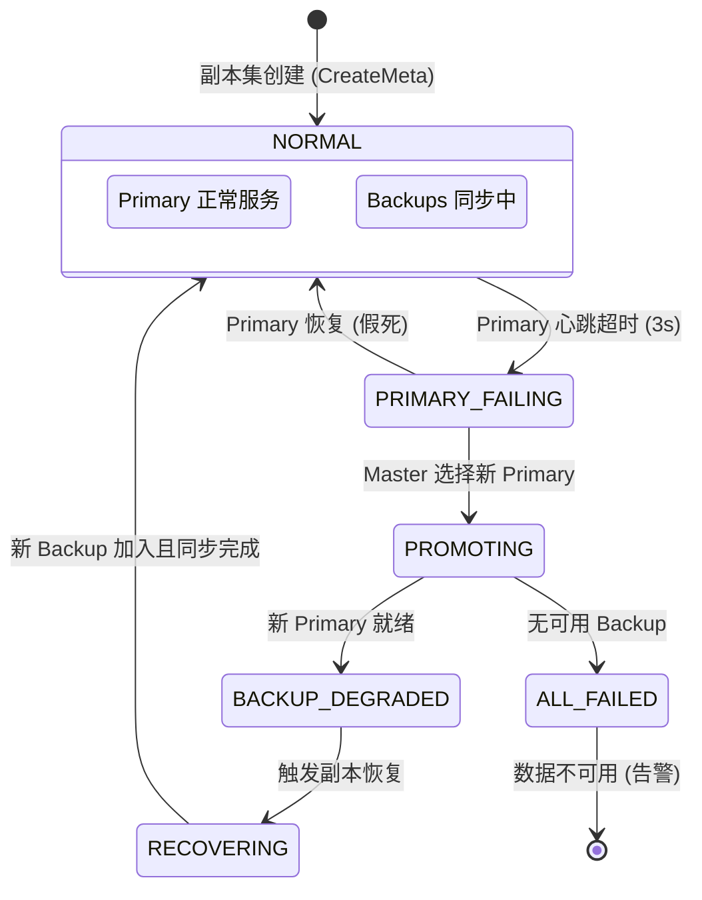
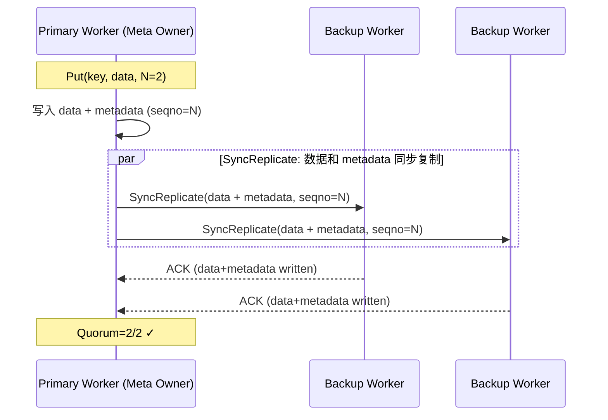
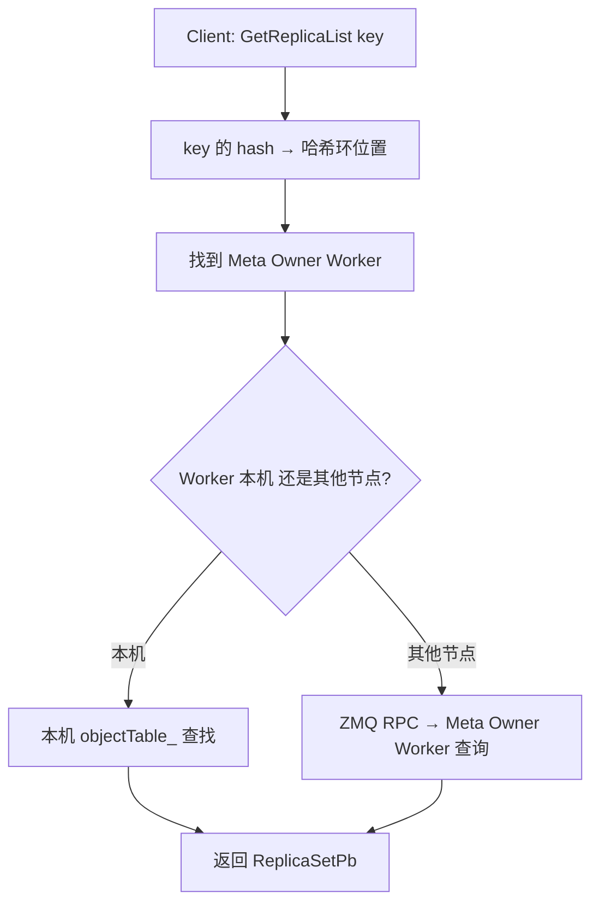
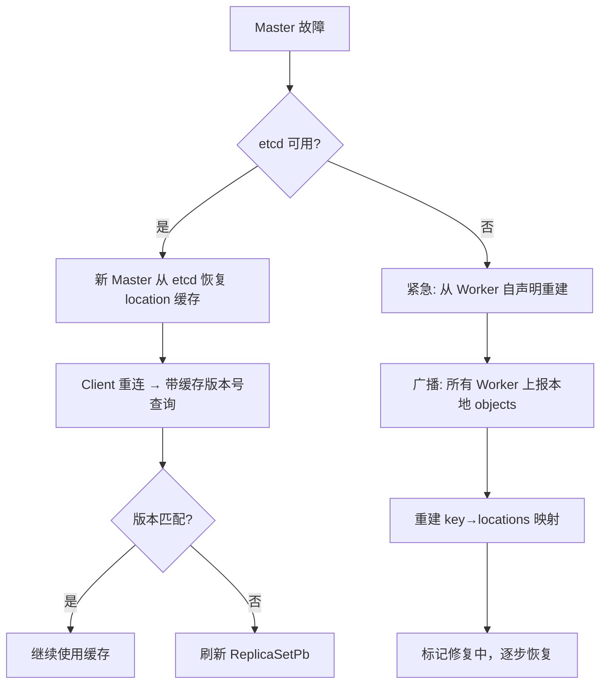

# 数据多副本 — 可靠性 + 性能设计

## 一、需求拆解规格

### 1.1 需求分解

| 子需求 ID | 名称 | 描述 | 优先级 |
|-----------|------|------|:--:|
| MR-01 | 写入多副本 | KV Put 时同步写入 N 个副本 (N=2/3) | P0 |
| MR-02 | 副本反亲和 | 副本分布在不同节点/机架/可用区 | P0 |
| MR-03 | 主备故障切换 | 主副本故障时备副本接管，P99.99 < 5ms | P0 |
| MR-04 | 数据恢复 | 备副本故障后从主副本恢复，不阻塞读写 | P1 |
| MR-05 | 一致性同步老化 | 主备副本 TTL 同步，到期一起淘汰 | P1 |
| MR-06 | 均衡读取 | 从主/备副本选择负载最低者读取 | P0 |
| MR-07 | NUMA 亲和写入 | 写入时优先选择 NUMA 本地节点 | P0 |
| MR-08 | 跨版本兼容 | 主备副本不同版本间可互读 (滚动升级场景) | P1 |

### 1.2 定量指标

| 指标 | 当前 | 目标 |
|------|------|------|
| 故障切换 P99.99 | 分钟级 (Client 重试) | **< 5ms** |
| 8MB KV Get P99.99 | ~10ms (单 Worker) | **< 5ms** (备副本分担) |
| 写入 P99 | ~1ms (单写) | **< 3ms** (主写 + 备同步确认) |
| QPS 提升 (1写10读) | 基准 100% | **+30%** |
| 副本数 | 1 | 2 (默认) |
| 数据丢失窗口 | 分钟级 | 0 (同步写入) |

### 1.3 规格约束

- **最大副本数**: 3 (主 + 2 备)
- **适用场景**: KV 8MB 对象、精排 Decode 1 写 10 读
- **NUMA 亲和**: 写请求路由到同 NUMA node Worker
- **跨 NUMA 容忍**: 不跨 HCCS ([厂商] Cache Coherent System)

---

## 二、概念模型

### 2.1 副本模型

```
Object (name + hash_key)
├── PrimaryReplica    — leader copy, 写入入口
│   └── 所在 Worker:  hash_ring.GetNode(key, 0)
├── BackupReplica[0]  — 备副本 1, hash_ring.GetNode(key, 1)
└── BackupReplica[1]  — 备副本 2 (N=3时), hash_ring.GetNode(key, 2)
```



### 2.2 新增核心对象

**ReplicaManager** — 副本生命周期管理：

```
ReplicaManager (per Worker):
  - CreateReplicas(key, value, config) → Status
  - GetBestReplica(key) → ReplicaInfo (nearest/least-loaded)
  - PromoteToPrimary(key) → Status (failover)
  - RecoverReplica(key, from_replica) → Status
  - ReconcileReplicas(key) → Status (TTL sync)
  - ReportReplicaHealth() → HealthStatus

ReplicaInfo:
  - node_id, replica_id, role {PRIMARY, BACKUP}
  - state {INIT, SYNCING, READY, STALE}
  - last_sync_seqno
  - health_score (0-100)
```

---

## 三、关键流程设计

### 3.1 写入多副本流程



**关键设计决策:**

| 决策 | 说明 | 理由 |
|------|------|------|
| **同步写入** | Primary 等待 Quorum ACK 后才返回 Client | Client 拿到 OK = N 个副本都已写入 |
| **数据和元数据都同步** | 数据通过 URMA 写备副本，元数据 seqno 一起传递 | 一致性：数据和 metadata 原子绑定 |
| **并行复制** | 同时向 N 个 Backup 发起 URMA 写入 | N 个副本延迟 = max(单次 URMA)，不是 sum |
| **Quorum = N/2+1** | N=2 → Quorum=2；N=3 → Quorum=2 | 容忍 N-Quorum 个副本失败 |
| **元数据包含完整 locations** | CreateMeta 直接写入全部副本位置 | Master 始终知道完整副本集，切换零延迟 |

**同步写入时序预算 (基于现网 6.62.223.31 Worker 实测数据):**

| 阶段 | 操作 | P50 | P99 | 数据来源 |
|------|------|:--:|:--:|------|
| Phase 1 | 本地 SHM 分配 | 41us | 69us | `worker_process_create_latency` |
| Phase 2 | URMA RDMA → 2 Backup (并行) | 13us | 21us | `worker_urma_write_latency` |
| Phase 3 | Master RocksDB 持久化 | 347us | 378us | `worker_rpc_create_meta_latency` |
| **Total** | | **~401us** | **~468us** | **<< 3ms 目标 ✅** |

> 数据来源: 生产 Worker 6.62.223.31, 164 周期 × 8 shard, 1312 行 metrics_summary 日志
> 5ms 间隔采集, 覆盖 ZMQ/URMA/Process/RPC 全部延迟指标

**Get 路径延迟分解 (现网数据, 用于多副本读性能分析):**

| 阶段 | P50 | P99 | 占比 |
|------|:--:|:--:|:--:|
| ZMQ Send/Recv IO | 1us | 9us | ~1% |
| ZMQ Network | 158us | 423us | ~23% |
| ZMQ Server Queue Wait | 17us | 46us | ~3% |
| ZMQ Server Exec (含 Process Get) | 268us | 1433us | **~73%** |
| **E2E Total** | **359us** | **893us** | 100% |

**关键结论:**
1. ZMQ Server Exec 是最大瓶颈 (73%), 主要是 Get 处理逻辑
2. URMA 写入极快 (13us P50, 21us P99), 同步复制 2 副本延迟可忽略
3. 同步写入 P99 ~468us, 离 3ms 上限有 6x 余量
4. Get P99 ~893us, 离 5ms 目标有 5.6x 余量

**备副本操作 (SyncReplicate RPC):**

```
Backup 收到 SyncReplicateReqPb {key, data, seqno, primary_addr}:
  1. AllocateMemoryForObject()     → SHM 分配
  2. URMA 数据接收 (RDMA write)   → 已在 SHM
  3. PublishObjectLocal()          → ObjectEntry, SetPrimaryCopy(false)
  4. local_seqno_ = seqno          → 记录同步位点
  5. 返回 {ack=true, seqno=N}
```

### 3.2 故障切换流程



### 3.3 均衡读取流程



**副本选择策略：**
```python
def select_best_replica(replicas):
    for r in replicas:
        score = (
            +10 if r.local_numa else 0
            + r.health_score * 0.3
            - r.active_requests * 0.1
            - r.rtt_us * 0.001
        )
    return max(replicas, key=score)
```

### 3.4 NUMA 亲和写入



---

## 四、接口与协议定义

### 4.1 新增 Proto 消息

```protobuf
// === SyncReplicate: Primary → Backup 同步复制 RPC ===
message SyncReplicateReqPb {
    string object_key = 1;
    uint64 seqno = 2;              // 单调递增序列号
    uint64 version = 3;            // Object 版本
    uint64 data_size = 4;          // 数据总大小
    uint32 ttl_second = 5;         // TTL
    string primary_address = 6;    // 主副本地址
    WriteMode write_mode = 7;      // NONE / L2_CACHE / WRITE_THROUGH
    // 数据通过 URMA RDMA 传输, 不在 Proto 内
}

message SyncReplicateRspPb {
    bool ack = 1;                  // true = 写入成功
    uint64 local_seqno = 2;        // Backup 确认的本地 seqno
    int32 status_code = 3;         // 0=OK, 非0=错误码
}

// === ReplicaSetPb: Client 缓存的副本集信息 ===
message ReplicaSetPb {
    string primary_address = 1;
    repeated string backup_addresses = 2;
    uint64 version = 3;            // 副本集版本号 (每次变更递增)
    uint64 primary_seqno = 4;      // 主副本当前 seqno
}

// === PromoteReplicaReqPb: Master → Backup 提升为 Primary ===
message PromoteReplicaReqPb {
    string object_key = 1;
    string new_primary = 2;        // 要提升的 Worker 地址
    uint64 failover_seqno = 3;     // 故障切换时的 seqno
}

// === RecoverReplicaReqPb: Primary → Backup 全量恢复 ===
message RecoverReplicaReqPb {
    string object_key = 1;
    string source_worker = 2;      // 数据源 Worker
    string target_worker = 3;      // 要恢复的 Worker
    uint64 from_seqno = 4;         // 增量起点 (0=全量)
}
```

### 4.2 ReplicaManager 完整 API

```cpp
// 文件: src/datasystem/worker/object_cache/replica_manager.h

class ReplicaManager {
public:
    // === 生命周期 ===
    Status Init(const std::string &local_address,
                std::shared_ptr<WorkerWorkerOCService> ww_service,
                std::shared_ptr<MasterWorkerOCService> master_api);
    void Shutdown();

    // === 写入路径 ===
    
    // CreateReplicas: 同步写入 N 个副本, 等待 Quorum 后返回
    // 调用点: PublishObject() 中, CreateMeta 之前
    // 输入: key, data (已在 SHM), 本地 seqno, 副本数
    // 输出: 达到 Quorum 则 OK, 否则错误码
    Status CreateReplicas(const std::string &key,
                          const ReplicaConfig &config,
                          ReplicaResult *result);
    
    struct ReplicaConfig {
        uint32_t replica_count = 2;        // N
        uint32_t quorum_size = 2;          // N/2+1
        uint64_t local_seqno = 0;
        uint32_t timeout_ms = 500;         // 单个 Backup 超时
        std::string object_data_addr;      // SHM 数据地址
        uint64_t object_data_size = 0;     // 数据大小
        std::vector<std::string> backup_addresses;  // 已选择的 Backup
    };
    
    struct ReplicaResult {
        uint32_t acks_received = 0;        // 收到的 ACK 数
        uint32_t quorum_required = 0;      // 需要的 Quorum
        bool quorum_reached = false;       // 是否达到 Quorum
        std::vector<std::string> successful;  // 写入成功的 Backup
        std::vector<std::string> failed;      // 写入失败的 Backup
    };

    // === 读取路径 ===
    
    // GetBestReplica: 根据评分选择最优副本
    // 调用点: Client 或 Worker Get 前
    Status GetBestReplica(const std::string &key,
                          const ReplicaReadHint &hint,
                          std::string *best_address);
    
    struct ReplicaReadHint {
        uint8_t local_numa_id;          // Client 本地 NUMA node
        bool prefer_local = true;       // 是否优先本地
        uint64_t min_seqno = 0;         // 最低 seqno 要求
    };

    // === 故障切换 ===
    
    // PromoteToPrimary: Master 调用, 提升 Backup 为 Primary
    Status PromoteToPrimary(const std::string &key,
                            const std::string &new_primary);
    
    // HandlePrimaryFailure: 检测到 Primary 故障后的处理
    Status HandlePrimaryFailure(const std::string &failed_primary,
                                std::vector<std::string> *affected_keys);

    // === 数据修复 ===
    
    // RecoverReplica: 从 source 复制数据到 target
    Status RecoverReplica(const std::string &key,
                          const std::string &source,
                          const std::string &target,
                          uint64_t from_seqno);
    
    // ReconcileReplicas: 定期对账, 修复不一致
    Status ReconcileReplicas(uint64_t *repaired_count);

    // === 状态查询 ===
    struct ReplicaHealth {
        std::string address;
        ReplicaRole role;          // PRIMARY / BACKUP
        ReplicaState state;        // INIT / SYNCING / READY / STALE
        uint64_t seqno;            // 当前 seqno
        uint32_t health_score;     // 0-100
        uint64_t last_heartbeat_us;
        uint32_t active_requests;
    };
    
    Status GetReplicaHealth(const std::string &key,
                            std::vector<ReplicaHealth> *health);
    
    // === 统计 ===
    struct ReplicaStats {
        uint64_t total_replicate_calls;
        uint64_t total_replicate_bytes;
        uint64_t failed_replicate_calls;
        uint64_t successful_failovers;
        uint64_t replica_recoveries;
        double avg_replicate_latency_us;
    };
    
    ReplicaStats GetStats() const;

private:
    // 并行发送 SyncReplicate 到所有 Backup
    Status FanOutSyncReplicate(const std::string &key,
                               const ReplicaConfig &config,
                               ReplicaResult *result);
    
    // 单个 Backup 的 SyncReplicate RPC
    Status SyncReplicateToOne(const std::string &backup_addr,
                              const SyncReplicateReqPb &req,
                              SyncReplicateRspPb *rsp,
                              uint32_t timeout_ms);
    
    std::string local_address_;
    std::shared_ptr<WorkerWorkerOCService> ww_service_;
    std::shared_ptr<MasterWorkerOCService> master_api_;
    ReplicaStats stats_;
};
```

### 4.3 副本放置算法

```cpp
// 文件: src/datasystem/master/object_cache/replica_placement.h

class ReplicaPlacementPolicy {
public:
    // SelectReplicas: 为 key 选择 N 个副本位置
    // 输入: key, 副本数 N, Client NUMA hint
    // 输出: N 个 Worker 地址 (按优先级: [0]=Primary, [1..N-1]=Backups)
    Status SelectReplicas(const std::string &key,
                          uint32_t replica_count,
                          const PlacementHint &hint,
                          std::vector<std::string> *selected);
    
    struct PlacementHint {
        uint8_t client_numa_id;        // Client 所在 NUMA
        uint8_t client_chip_id;        // Client 所在 chip (HCCS)
        bool avoid_cross_hccs;         // 不跨 HCCS (Primary)
        uint32_t min_health_score;     // 最低健康分数
    };
    
private:
    // 获取候选 Worker 列表并按 NUMA 亲和度排序
    void GetCandidates(const std::string &key,
                       const PlacementHint &hint,
                       std::vector<ScoredWorker> *candidates);
    
    struct ScoredWorker {
        std::string address;
        int32_t numa_distance;     // 0=同NUMA, 1=同Chip, 2=同Rack, 3=同DC, 4=其他
        int32_t health_score;      // 0-100
        int32_t active_replicas;   // 当前已担负的副本数
        int32_t load_score;        // 负载 (越低越好)
        
        int32_t total_score() const {
            // 权重: NUMA 距离最重要, 其次健康, 最后负载
            return numa_distance * -100 + health_score * 2 - load_score - active_replicas * 5;
        }
    };
    
    // 检查反亲和约束
    bool CheckAntiAffinity(const ScoredWorker &w,
                           const std::vector<ScoredWorker> &already_selected,
                           AntiAffinityLevel level);
    
    enum AntiAffinityLevel {
        NODE,    // 不同节点
        RACK,    // 不同机架
        ZONE,    // 不同可用区
    };
};
```

#### 放置策略伪代码

```
SelectReplicas(key, N=2, hint):
    candidates = hash_ring.GetNodes(key, topK=10)  // 取 hash ring 上前 10 个节点
    scored = []
    
    for each worker in candidates:
        if worker.health_score < hint.min_health_score: skip
        s.numa_distance = compute_numa_distance(hint.client_numa_id, worker.numa_id)
        s.health_score = worker.health_score
        s.active_replicas = count_replicas_on(worker)
        s.load_score = worker.current_load
        scored.append(s)
    
    sort scored by total_score() descending
    
    selected = []
    for each s in scored:
        if check_anti_affinity(s, selected, RACK):  // N=2: 至少跨 Rack
            selected.append(s)
        if len(selected) == N: break
    
    // selected[0] = Primary (最优), selected[1..] = Backups
    return selected
```

### 4.4 故障切换状态机



### 4.5 新增 StatusCode

```cpp
// 文件: include/datasystem/utils/status.h (新增)

// 多副本相关 (1011-1020)
K_REPLICA_UNAVAILABLE = 1011,      // 所有副本不可用 (没有可用 Backup)
K_REPLICA_OUT_OF_SYNC = 1012,      // 副本数据落后于 Primary (seqno 不匹配)
K_REPLICA_WRITE_TIMEOUT = 1013,    // 副本写入超时 (单个 Backup 超时)
K_REPLICA_QUORUM_FAILED = 1014,    // 未达到 Quorum (成功的 Backup < N/2+1)
K_REPLICA_PLACEMENT_FAILED = 1015, // 找不到满足反亲和的副本位置
K_REPLICA_RECOVERING = 1016,       // 副本正在恢复中 (暂时不可读)
K_REPLICA_VERSION_MISMATCH = 1017, // 副本版本不匹配 (Client 缓存过期)
K_REPLICA_PROMOTE_FAILED = 1018,   // 故障切换提升失败
```

### 4.6 同步写入伪代码

```cpp
// Primary Worker 上 PublishObject 中的复制逻辑
Status PublishObjectWithReplication(const std::string &key,
                                     const char *data, size_t size,
                                     const SetParam &param) {
    // Phase 1: 本地写入
    AllocateResult alloc;
    RETURN_IF_ERR(AllocateMemoryForObject(key, size, &alloc));
    MemoryCopy(alloc.shm_addr, data, size);
    
    // Phase 2: 选择副本位置
    std::vector<std::string> replicas;
    ReplicaPlacementPolicy::PlacementHint hint{
        .client_numa_id = sched_getcpu_numa(),
        .client_chip_id = NumaIdToChipId(hint.client_numa_id),
        .avoid_cross_hccs = true,
        .min_health_score = 60
    };
    RETURN_IF_ERR(master->SelectReplicas(key, param.replica_count, hint, &replicas));
    // replicas[0] = Primary (本机), replicas[1..] = Backups
    
    uint64_t local_seqno = GetNextSeqno();
    
    // Phase 3: 同步复制到 Backups
    ReplicaManager::ReplicaConfig config{
        .replica_count = param.replica_count,
        .quorum_size = param.replica_count / 2 + 1,  // N/2+1
        .local_seqno = local_seqno,
        .timeout_ms = 500,
        .object_data_addr = alloc.shm_addr,
        .object_data_size = size,
        .backup_addresses = {replicas.begin() + 1, replicas.end()}
    };
    
    ReplicaManager::ReplicaResult result;
    Status s = replica_mgr->CreateReplicas(key, config, &result);
    
    if (!result.quorum_reached) {
        // 回滚: 释放 Primary 上的 SHM
        FreeMemoryForObject(key, alloc);
        return Status(K_REPLICA_QUORUM_FAILED,
                     "quorum failed: " + std::to_string(result.acks_received) +
                     "/" + std::to_string(result.quorum_required));
    }
    
    // Phase 4: 元数据同步到 Master
    CreateMetaReqPb req;
    req.set_object_key(key);
    req.set_data_size(size);
    req.set_primary_address(local_address_);
    for (const auto &b : result.successful) {
        req.add_backup_addresses(b);
    }
    req.set_seqno(local_seqno);
    req.set_quorum_size(config.quorum_size);
    req.set_replica_count(config.replica_count);
    
    CreateMetaRspPb rsp;
    RETURN_IF_ERR(master->CreateMeta(req, &rsp));
    
    // Phase 5: 标记对象为已发布
    safeObj->stateInfo.SetPrimaryCopy(true);
    safeObj->stateInfo.SetCacheInvalid(false);
    safeObj->local_seqno_ = local_seqno;
    safeObj->replica_group_ = ReplicaGroupPb{
        .primary_id = local_address_,
        .replicas = {local_address_} + result.successful
    };
    
    return Status::OK();
}
```

---

## 五、代码模块影响 (已更新)

| 模块 | 文件 | 改动类型 | 说明 |
|------|------|:--:|------|
| KV Client | `src/datasystem/client/kv_cache/kv_client.cpp` | **重构** | 多副本 Put/Get 路径 |
| Object Client | `src/datasystem/client/object_cache/object_client_impl.cpp` | **修改** | 副本选择逻辑 |
| Worker OC | `src/datasystem/worker/object_cache/service/worker_oc_service_impl.cpp` | **重构** | ReplicateChunk 处理 |
| Worker-Worker | `src/datasystem/worker/object_cache/worker_worker_oc_service_impl.cpp` | **修改** | 副本间数据传输 |
| ReplicaManager | `src/datasystem/worker/object_cache/replica_manager.h/.cpp` | **新增** | 副本管理核心 |
| Hash Ring | `src/datasystem/common/metastore/hash_ring.h` | **修改** | 多副本位置计算 |
| Master | `src/datasystem/master/*` | **修改** | 副本放置决策 |
| TTL/Eviction | `src/datasystem/worker/object_cache/*ttl*` | **修改** | 副本同步老化 |
| Metrics | `src/datasystem/common/metrics/kv_metrics.cpp` | **新增** | 副本相关指标 |

### 新增 Metrics

| Metric ID | 名称 | 类型 | 说明 |
|-----------|------|------|------|
| 50 | `replica_create_total` | COUNTER | 副本创建数 |
| 51 | `replica_sync_latency` | HISTOGRAM | 副本同步延迟 |
| 52 | `replica_failover_total` | COUNTER | 故障切换次数 |
| 53 | `replica_failover_latency` | HISTOGRAM | 故障切换延迟 |
| 54 | `backup_read_total` | COUNTER | 从备副本读次数 |
| 55 | `replica_out_of_sync_total` | COUNTER | 副本不同步次数 |

---

## 五、工作量估算

| 子需求 | 开发 | 测试 | 人员 | 合计 |
|--------|:--:|:--:|------|:--:|
| MR-01 写入多副本 | 8d | 3d | A | 11d |
| MR-02 反亲和 | 5d | 2d | B | 7d |
| MR-03 故障切换 | 6d | 3d | A | 9d |
| MR-04 数据恢复 | 5d | 2d | B | 7d |
| MR-05 一致性老化 | 3d | 1d | C | 4d |
| MR-06 均衡读取 | 5d | 2d | C | 7d |
| MR-07 NUMA 亲和 | 5d | 2d | B | 7d |
| MR-08 跨版本兼容 | 3d | 1d | A | 4d |
| **合计** | **40d** | **16d** | 3人 | **56d** |

### 拆解到 3 人并行

| 角色 | 负责 | 依赖 |
|------|------|------|
| 人力 A: 写入路径 | MR-01 + MR-03 + MR-08 | ReplicaManager 接口 |
| 人力 B: 放置/分布 | MR-02 + MR-04 + MR-07 | Hash Ring 修改 |
| 人力 C: 读取路径 | MR-05 + MR-06 | MR-01 (副本存在) |

---

## 六、验证方案

### 6.1 功能验证

| 场景 | 验证方法 | 标准 |
|------|---------|------|
| 正常多副本写入 | Put(N=2), 检查两个 Worker 都有数据 | 数据一致 |
| 主副本故障 | kill Primary, Get 返回备副本数据 | < 5ms 完成 |
| 副本恢复 | kill Backup, 等待自动恢复 | 5min 内恢复 READY |
| 均衡读取 | 1写10读，统计各副本读次数 | 偏差 < 20% |

### 6.2 性能测试

| 指标 | 方法 | 目标 |
|------|------|------|
| 写入 P99 | Put 8MB × 10000次 | < 3ms |
| 故障切换 P99.99 | 主副本 kill × 1000次 | < 5ms |
| QPS 提升 | 1写10读 对比 单副本 vs 多副本 | +30% |

---

## 七、元数据可靠性: key→locations 映射

### 7.1 问题分析

当前架构中，key→locations 映射存储在 Master 的 etcd 中。多副本引入后：

```
key=abc → locations: {
  primary: Worker-1 (running, seqno=42)
  backup_1: Worker-2 (running, seqno=42)
  backup_2: Worker-3 (syncing, seqno=40)
}
```

**元数据可靠性挑战：**

### 7.1 存储架构: 元数据分布式化

**核心架构决策: 元数据 (key→location) 分布式存储在 Worker 上，通过一致性哈希定位。**

```
┌─────────────────────────────────────────────────────────────────┐
│                        etcd (集群级配置)                          │
│  HashRing · Slot 分配 · Master Leader 选举                       │
│  数据量: ~KB · 变更频率: 分钟级                                   │
└─────────────────────────────────────────────────────────────────┘
                              │
                              ▼
┌─────────────────────────────────────────────────────────────────┐
│              一致性哈希分发元数据到 Worker                          │
│                                                                 │
│  key="abc" → hash_ring.GetNode(key) → Worker-5                  │
│                                                                 │
│  Worker-5 负责:                                                  │
│    • key="abc" 的 metadata (locations, TTL, version, seqno)     │
│    • metadata 通过多副本机制同步到 Backup Workers                 │
│    • 处理 Client 的 GetReplicaList 查询                          │
└─────────────────────────────────────────────────────────────────┘
```

**各组件职责明确:**

| 组件 | 存什么 | 不存什么 |
|------|--------|---------|
| **etcd** | HashRing, Slot 分配, Master Leader 选举 | ❌ 对象级 metadata |
| **Master 服务** | 路由 metadata 请求到正确的 Worker, HashRing 管理, 故障协调 | ❌ 对象级 metadata (转发给 Worker) |
| **Worker (Meta Owner)** | 其 hash range 内所有 key 的 metadata (key→locations, seqno, TTL) | ❌ 其他 Worker range 的 metadata |
| **Worker (Data Owner)** | 对象的实际数据 (SHM) | — |

**为什么元数据要分布式化:**
- **去中心化**: 消除 Master 单点瓶颈。1K 节点的 metadata 查询分散到所有 Worker
- **水平扩展**: metadata 容量随 Worker 数量线性增长（每个 Worker 只负责 ~1/N 的 key）
- **故障隔离**: 单个 Worker 故障只影响其 hash range 的 metadata，不影响其他
- **etcd 减压**: etcd 只存集群配置 (~KB)，metadata 完全不经过 etcd
- **一致性**: metadata 和数据用同一套副本机制 (SyncReplicate)，metadata 的副本数 = 数据的副本数

### 7.2 元数据可靠性: 四层保障

**L1: Worker 本地持久化 (RocksDB + SHM)**

每个 Worker 对自己 hash range 内的 metadata 负责:
```cpp
// Worker 端: metadata 和数据一起写入
Status CreateReplicas(key, data, N) {
    // 1. 数据写入本地 SHM
    // 2. metadata (locations, seqno, TTL) 写入本地 objectTable_
    // 3. 两者原子绑定 (同一个 seqno)
}
```

Worker 重启: Snapshot 恢复 metadata + DeltaSync 对账 (见 RFC1 §4.3)

**L2: 副本同步保证 metadata 一致性**

metadata 和 data 使用**同一套 SyncReplicate 机制**:



- **metadata 的副本数 = 数据的副本数 (N)**
- **SyncReplicate 同时传输 data 和 metadata (同一个 seqno)**
- **Quorum 确认: data 和 metadata 都写入才 ACK**
- metadata 不需要单独的同步机制 — 复用数据副本通道

**L3: 一致性哈希定位 metadata**



- Client / Worker 通过一致性哈希**直接定位** metadata 所在的 Worker
- **不经过中心 Master** — 减少一跳，降低延迟
- Meta Owner Worker 故障 → 副本接管 (同数据副本切换机制)

**L4: Worker 自检 + 重定向 (兜底)**

```
Worker 处理 Get/Put 时自检:
  1. 我是这个 key 的 Meta Owner 吗? (查本地 hash ring)
  2. 我的 metadata 版本是最新的吗? (seqno 比对)
  3. 是 → 正常服务
  4. 不是 → 重定向到正确的 Meta Owner
```

### 7.3 故障场景全量分析 (18 场景)

#### 写入路径故障

| 场景 | 严重 | 能否 | 处理 |
|------|:--:|:--:|------|
| W1: Client→Meta Owner RPC超时 | 低 | ✅ | hash_ring.GetNode(key,1)重试Meta Backup, 500us超时, 最多2次 |
| W2: SyncReplicate到1个Backup失败 | 低 | ✅ | 后台标记STALE, Reconcile周期补齐, Client无感 |
| W3: RegisterLocation到Meta Owner失败 | 中 | ✅ | 后台指数退避重试(100ms→500ms→1s), 数据已在Primary不丢 |
| W4: Put到Primary时Primary中途crash | 高 | ⚠️ | Client超时后重新Put→触发Promote→等Lease3s→新Primary写。丢失3s内写入 |
| W5: 所有Backup不可用 | 低 | ✅ | Primary仍接受写入, 降级运行。Master后台分配新Backup全量同步 |
| W6: Meta Owner在RegisterLocation后宕机 | 中 | ✅ | Meta Backup有副本(SyncReplicate已推)。Client查Meta Backup |

#### 读取路径故障

| 场景 | 严重 | 能否 | 处理 |
|------|:--:|:--:|------|
| R1: Client→Meta Owner超时 | 低 | ✅ | 重试Meta Backup。缓存命中直接跳过(304 Not Modified) |
| R2: Client→Data Primary超时3s | 中 | ✅ | 降级到Data Backup, 按score排序逐个试, 最多3次 |
| R3: Client→Data Backup也超时 | 高 | ✅ | 全部不可用→返回REPLICA_UNAVAILABLE→等待Promote |
| R4: Meta返回过期Primary(已宕未Promote) | 中 | ⚠️ | Client连旧Primary失败→触发Promote→3s后Meta更新→3s窗口内需额外RTT |

#### 连续故障

| 场景 | 严重 | 能否 | 处理 |
|------|:--:|:--:|------|
| C1: Primary宕→Promote→旧Primary假死恢复(脑裂) | 高 | ✅ | Lease栅栏: 旧P检测Lease过期→自动降级Backup→从新P补齐 |
| C2: Primary在SyncReplicate中途宕(Backup半写) | 高 | ✅ | Backup seqno不完整→Promote后Reconcile补齐。seqno判高下 |
| C3: Primary+MetaOwner同时宕(双故障) | 高 | ✅ | 各自独立Promote。Data Backup和Meta Backup分别接管。3s后恢复 |
| C4: Primary→Backup→连续故障 | 高 | ✅ | 继续Promote下一个。只要≥1个有数据副本存活即可恢复 |
| C5: 网络分区(可达Primary不可达MetaOwner) | 中 | ✅ | Client用缓存ReplicaSetPb。缓存过期等分区恢复 |

#### 恢复场景

| 场景 | 严重 | 能否 | 处理 |
|------|:--:|:--:|------|
| RC1: Promote的Backup seqno=100, 最新=105 | 中 | ✅ | 新Primary等待补齐(从其他副本)。补齐窗口暂停写可读 |
| RC2: 旧P恢复seqno=108, 新P seqno=107 | 高 | ✅ | Lease过期+seqno裁决: 旧P数据更新→以旧P为准→新P降级 |
| RC3: MetaOwner重启, Snapshot恢复, 元数据落后 | 中 | ✅ | DeltaSync补齐。Meta Backup仍在服务→Client无阻塞 |

#### 关键设计保障

| 机制 | 覆盖场景 | 说明 |
|------|---------|------|
| **Seqno 单调递增** | W3,W4,C2,RC1,RC2 | 每次写入递增, 用于判断数据新旧, 谁高谁说了算 |
| **Lease 3s软/10s硬** | W4,R4,C1 | 防脑裂: Promote前等旧Primary Lease过期 |
| **HashRing→Meta Backup** | W1,W6,R1,R3,C3,RC3 | Meta失败自动降级到Backup, 透明切换 |
| **后台Reconcile** | W2,W3,W5,C2 | 周期性对账补齐, 不阻塞Client |
| **Client缓存ReplicaSetPb** | R1,R4,C5 | 减少Meta查询, 分区时仍可服务 |
| **降级不降写** | W5,C4 | 即使0个Backup也接受写入, 后台补齐 |

### 7.4 故障恢复 (RPO/RTO)

| 场景 | metadata 影响 | 恢复方式 | RTO |
|------|-------------|---------|:--:|
| Meta Owner Worker 宕机 | hash range 内 metadata 不可查 | Backup 自动接管 (同数据副本) | <5ms |
| Meta Owner 假死后恢复 | metadata 可能过期 | Worker 自检 → Redirect 或 DeltaSync | 实时 |
| etcd 故障 | 集群配置不可更新, metadata 不受影响 | metadata 走 Worker 分布式查询 | 0 (metadata 不受影响) |
| Master 服务故障 | HashRing 管理暂停, metadata 查询不受影响 | 元数据查询不经过 Master | 0 |
| 全部 Worker 宕机 | — | 从 RocksDB + 副本恢复 | <3s (Snapshot) |

### 7.3 元数据故障恢复流程



### 7.4 新增的数据结构

```cpp
// Worker 端 — 每个 object 额外维护
struct ObjectReplicaInfo {
    uint64_t seqno;              // 本地最新 seqno
    bool is_primary;             // 当前是否为 Primary
    std::string primary_addr;    // Master 记录的 Primary 地址
};

// Master 端 — 增强的 location 管理
struct LocationEntry {
    std::string worker_addr;
    AckState state;              // UNACK / ACKED
    uint64_t seqno;              // 该副本的 seqno
    uint64_t last_heartbeat;     // 最后心跳时间
};

// Object → 增强的 location 映射
// Key: object_name → Value: LocationGroup
struct LocationGroup {
    std::string primary_addr;
    std::vector<LocationEntry> replicas;
    uint64_t version;            // 单调递增，Client 缓存用
    uint32_t quorum_size;        // min( (N/2)+1, replica_count )
};
```

### 7.5 数据修复流程

```python
def reconcile_replicas(key):
    """由 Master 定期 (60s) 或故障后触发"""
    locations = master.get_locations(key)
    primary = locations.primary
    
    for replica in locations.replicas:
        if replica.seqno < primary.seqno:
            # 备副本落后 → 触发增量同步
            master.send_recover_command(
                source=primary,
                target=replica,
                from_seqno=replica.seqno,
                to_seqno=primary.seqno
            )
        
        if replica.last_heartbeat < now - 30s:
            # 备副本失联 → 分配新备副本
            new_backup = hash_ring.get_next_node(key, skip=[primary, replica])
            master.send_replicate_command(
                source=primary,
                target=new_backup,
                mode=FULL_SYNC
            )
```

### 7.6 元数据 RPO/RTO

| 场景 | RPO | RTO | 恢复方式 |
|------|-----|-----|---------|
| Master 进程重启 | 0 | < 5s | etcd 恢复 |
| etcd 单点故障 | < 10s (最近 Put) | < 30s | etcd 恢复 + Worker 自声明 |
| 脑裂 | 0 | < 10s | etcd 选举 + fencing token |
| Worker 假死恢复 | 0 | 0 (实时) | Worker 自检 + 重定向 |

---

## 八、与 Mooncake 的对比

| 维度 | Mooncake | 我们方案 | 优势 |
|------|---------|---------|------|
| 副本操作 | Put/Copy/Move 三种 | Put (主+备同步) + Recover | 简化 API |
| 一致性 | PutStart/PutEnd 两阶段 | 同样两阶段 + seqno 锚点 | 等价 |
| 故障切换 | GetReplicaList 自动切换 | Master 主动 Promote + Client 刷新 | 更快的切换路径 |
| 均衡读取 | Conductor 全局调度 | Client 侧 score 选择 | 分散决策，无单点 |
| NUMA 亲和 | 自动拓扑发现 | 同样 sched_getcpu + Master 偏好 | 等价 |
| 反亲和 | Slice 级 | Object 级 (key hash) | 更粗粒度，但足够 |

## 引用

- 词汇表: `rfc/shared/glossary.md`
- DFX 完整分析: `rfc/shared/dfx-analysis.md`
- FDS 模板: `rfc/shared/fds-template.md`
- 需求分解: `rfc/shared/requirement-decomposition.md`
