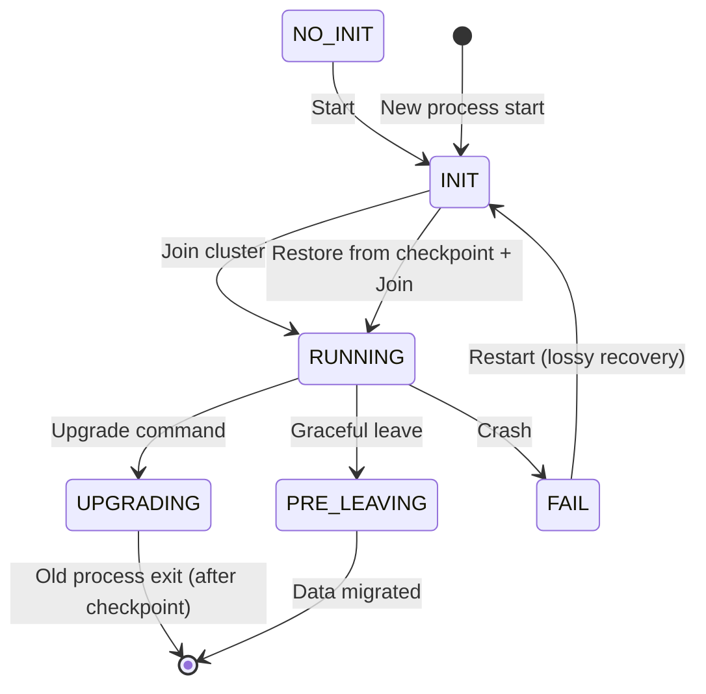
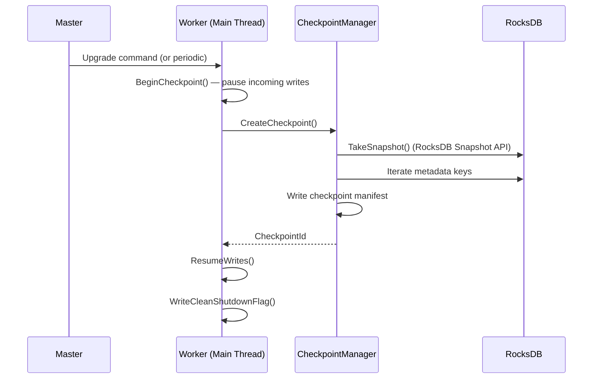
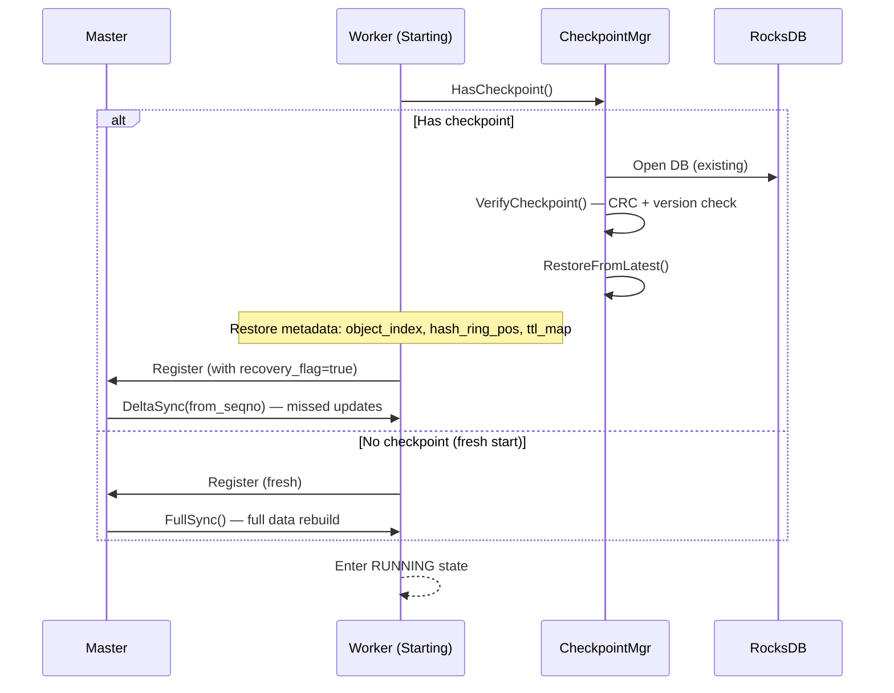
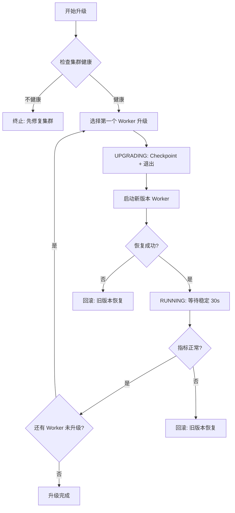

# 滚动升级原地恢复 — 详细设计

## 一、需求拆解规格

### 1.1 需求分解

| 子需求 ID | 名称 | 描述 | 优先级 |
|-----------|------|------|:--:|
| IR-01 | Worker 本地 Checkpoint | Worker 周期性将内存状态快照到本地 RocksDB | P0 |
| IR-02 | Worker 快速恢复 | Worker 重启时从本地 Checkpoint 恢复，跳过全量重建 | P0 |
| IR-03 | Hash Ring 升级态 | 新增 UPGRADING 节点状态，升级中保留数据不迁移 | P0 |
| IR-04 | 版本兼容 | Worker 新旧版本间可互操作（相同协议版本） | P1 |
| IR-05 | Master 无状态升级 | Master 升级不丢失元数据（etcd 已有） | P1 |

### 1.2 定量指标

| 指标 | 当前 | 目标 |
|------|------|------|
| Worker 重启恢复时间 | 分钟级 (全量重建) | < 3s (Checkpoint 恢复) |
| 滚动升级单节点影响 | 全量迁移数据 | 零迁移 (原地恢复) |
| 升级期间服务可用性 | 中断 (节点摘除) | 持续服务 (UPGRADING 态保留读) |
| 恢复后数据完整性 | 等 peer 对账 | Checkpoint 校验 (CRC/SeqNo) |
| Checkpoint 对性能影响 | — | < 5% 吞吐下降 |

### 1.3 规格约束

- **适用规模**: 单集群 10~1024 Worker
- **Checkpoint 数据量**: 典型 < 1GB (metadata + hot keys)
- **存储介质**: 本地 NVMe SSD（优先级）/ HDD
- **兼容性**: 同大版本内 (v0.8.x) 可滚动升级，跨大版本 (v0.9) 需全量

---

## 二、用例描述

### UC-1: 正常滚动升级

```
参与者: 运维人员, Master, Worker-A(旧版), Worker-A(新版)
前置: 集群正常服务，Worker-A 为 RUNNING 态，版本 v0.8.1.rc24

流程:
1. 运维人员通过 dscli 发起升级命令
2. Master 将 Worker-A 标记为 UPGRADING
3. Worker-A 执行 Checkpoint (同步阻塞，< 1s)
4. Worker-A 进程退出 (SIGTERM)
5. 新版本 Worker-A 进程启动
6. Worker-A 从本地 RocksDB 恢复 Checkpoint 数据
7. Worker-A 向 Master 注册，恢复 RUNNING 态
8. 升级完成

后置: Worker-A 升级到 v0.8.1.rc26，数据完整，服务未中断
```

### UC-2: 异常断电恢复

```
参与者: Worker-A (非计划重启)
前置: Worker-A 运行时系统断电/崩溃

流程:
1. 系统重启后 Worker-A 进程启动
2. Worker-A 检测到非正常退出 (no clean shutdown flag)
3. Worker-A 从最近一次成功 Checkpoint 恢复 (可能丢失最近周期数据)
4. Master 检测到 Worker-A 恢复，触发增量对账
5. 对账完成，恢复 RUNNING 态

后置: 恢复最近 Checkpoint 之后的数据，丢失量 < Checkpoint 间隔 (默认 10s)
```

### UC-3: 升级失败回滚

```
参与者: 运维人员, Master, Worker-A
前置: Worker-A 升级到新版后启动失败

流程:
1. 新版本 Worker-A 多次启动失败 (crash loop)
2. Master 检测到 UPGRADING 态超时 (30s)
3. Master 通知使用旧版本重新启动
4. Worker-A 旧版本从 Checkpoint 恢复
5. 恢复 RUNNING 态

后置: 回退到旧版本，数据不丢失
```

---

## 三、概念模型变化

### 3.1 新增概念

```
WorkerStates (existing):  NO_INIT → INIT → RUNNING → PRE_LEAVING → FAIL
WorkerStates (new):      NO_INIT → INIT → RUNNING → UPGRADING → RUNNING
                                                       ↕
                                                  (旧版退出→新版恢复)
                                                  RUNNING (via Checkpoint)
```



### 3.2 新增核心对象

**CheckpointManager** — 负责快照的创建、恢复、清理：

```
CheckpointManager:
  - CreateCheckpoint() → CheckpointId  // 同步快照
  - RestoreFromCheckpoint(id) → Status // 从快照恢复
  - ListCheckpoints() → []CheckpointMeta
  - PruneOldCheckpoints(maxKeep)        // 保留最近 N 个
  - VerifyCheckpoint(id) → bool        // CRC/版本校验

CheckpointMeta:
  - id: uint64           // 单调递增
  - timestamp: uint64    // 创建时间 (steady_clock)
  - worker_version: string // 创建时版本
  - data_size: uint64    // 字节数
  - rocksdb_seqno: uint64 // RocksDB 序列号 (一致性锚点)
  - status: enum { CREATING, COMPLETE, CORRUPTED }
```

---

## 四、关键流程设计

### 4.1 Checkpoint 创建流程



**关键设计决策：**
- 使用 RocksDB `GetSnapshot()` + `GetIter()` 获得一致性视图
- Checkpoint 仅序列化 metadata（对象引用、hash ring 位置、TTL 信息），不序列化实际数据
- 实际数据通过 RocksDB 已有持久化保证一致性
- Checkpoint Manifest 记录：seqno、版本、时间戳、key range

### 4.2 快速恢复流程



### 4.3 滚动升级编排



**升级策略：**
- MaxUnavailable: 10% (100 个 Worker 集群最多同时升级 10 个)
- 每个 Worker 升级间隔 > 30s（确保恢复稳定）
- 先升级非关键节点（无 Primary 数据），后升级有 Primary 的节点

---

## 五、代码模块影响分析

### 5.1 修改文件清单

| 模块 | 文件 | 改动类型 | 工作量 |
|------|------|---------|:--:|
| Worker 主流程 | `worker/worker_oc_server.cpp` | **重构**: 启动流程加入 Checkpoint 恢复 | 3d |
| Checkpoint | `worker/object_cache/checkpoint_manager.h/.cpp` | **新增**: CheckpointManager 实现 | 5d |
| Hash Ring | `common/metastore/hash_ring.h` | **修改**: 新增 UPGRADING 状态 | 2d |
| Hash Ring | `common/metastore/hash_ring_task_executor.h/.cpp` | **修改**: UPGRADING 态下跳过迁移 | 3d |
| Master | `master/cluster_manager.*` | **修改**: 升级编排逻辑 | 3d |
| CLI | `cli/upgrade.py` | **新增**: dscli upgrade 命令 | 2d |
| 配置 | `common/gflags/*` | **修改**: 新增 checkpoint 相关 flag | 1d |
| 测试 | `tests/st/upgrade/` | **新增**: 升级测试用例 | 3d |

### 5.2 不修改的模块

- KV 客户端 — 升级对客户端透明
- RocksDB 存储层 — 复用已有持久化
- URMA 传输层 — 不受影响
- ZMQ RPC — 协议不变

### 5.3 新增 Flag

| Flag | Default | 说明 |
|------|---------|------|
| `checkpoint_enabled` | `true` | 是否启用 Checkpoint |
| `checkpoint_interval_s` | `10` | Checkpoint 周期 (秒) |
| `checkpoint_max_keep` | `3` | 最多保留 Checkpoint 数 |
| `checkpoint_data_dir` | `./checkpoint_data` | Checkpoint 存储路径 |
| `upgrade_timeout_s` | `300` | 单个节点升级超时时间 |

---

## 六、工作量估算

| 子需求 | 开发 | 测试 | 合计 |
|--------|:--:|:--:|:--:|
| IR-01 CheckpointManager | 5d | 2d | 7d |
| IR-02 快速恢复 | 3d | 2d | 5d |
| IR-03 Hash Ring UPGRADING 态 | 5d | 2d | 7d |
| IR-04 版本兼容 | 2d | 1d | 3d |
| CLI + 部署集成 | 3d | 1d | 4d |
| **合计** | **18d** | **8d** | **26d** |

> 注：这是单开发人员估算。可拆解到 2-3 人并行。

### 拆解到个人

| 角色 | 负责 | 依赖 |
|------|------|------|
| 人力 A: Worker 侧 | IR-01 + IR-02 + IR-04 | 无 |
| 人力 B: Master/HashRing 侧 | IR-03 | IR-01 (Checkpoint 接口) |
| 人力 C: CLI + 测试 + 部署 | dscli upgrade + 集成测试 | IR-01, IR-02, IR-03 |

---

## 七、验证方案

### 7.1 功能验证

| 测试场景 | 验证方法 | 通过标准 |
|----------|---------|---------|
| 正常升级 | 3 Worker 集群，逐个升级 | 升级过程无数据丢失，客户端读写正常 |
| 异常恢复 | kill -9 Worker，等待恢复 | 30s 内恢复 RUNNING 态，数据完整 |
| 回滚 | 升级后故障 → 回退旧版本 | 回退成功，数据从未丢失 |
| 多次连续升级 | rc24 → rc25 → rc26 | 每次升级后数据一致 |

### 7.2 性能验证

| 指标 | 测试方法 | 目标 |
|------|---------|------|
| Checkpoint 耗时 | 单节点 Checkpoint 耗时 | < 1s |
| 恢复耗时 | 从 Checkpoint 恢复到 RUNNING | < 3s |
| Checkpoint 吞吐影响 | 对比开/关 Checkpoint | < 5% |
| 升级窗口 | 100 Worker 集群全量升级 | < 30min |

---

## 八、风险

| 风险 | 影响 | 缓解 |
|------|------|------|
| Checkpoint 数据损坏 | 恢复失败，等全量重建 | CRC 校验 + 多版本保留 |
| RocksDB 版本不兼容 | 新旧版本打开同一 DB 失败 | 版本检测 + 自动降级到全量恢复 |
| 升级期间写入丢失 | 数据不一致 | UPGRADING 态保留读、暂停写 |
| 磁盘空间不足 | Checkpoint 失败 | 保留 N 个 + 空间预检 |
