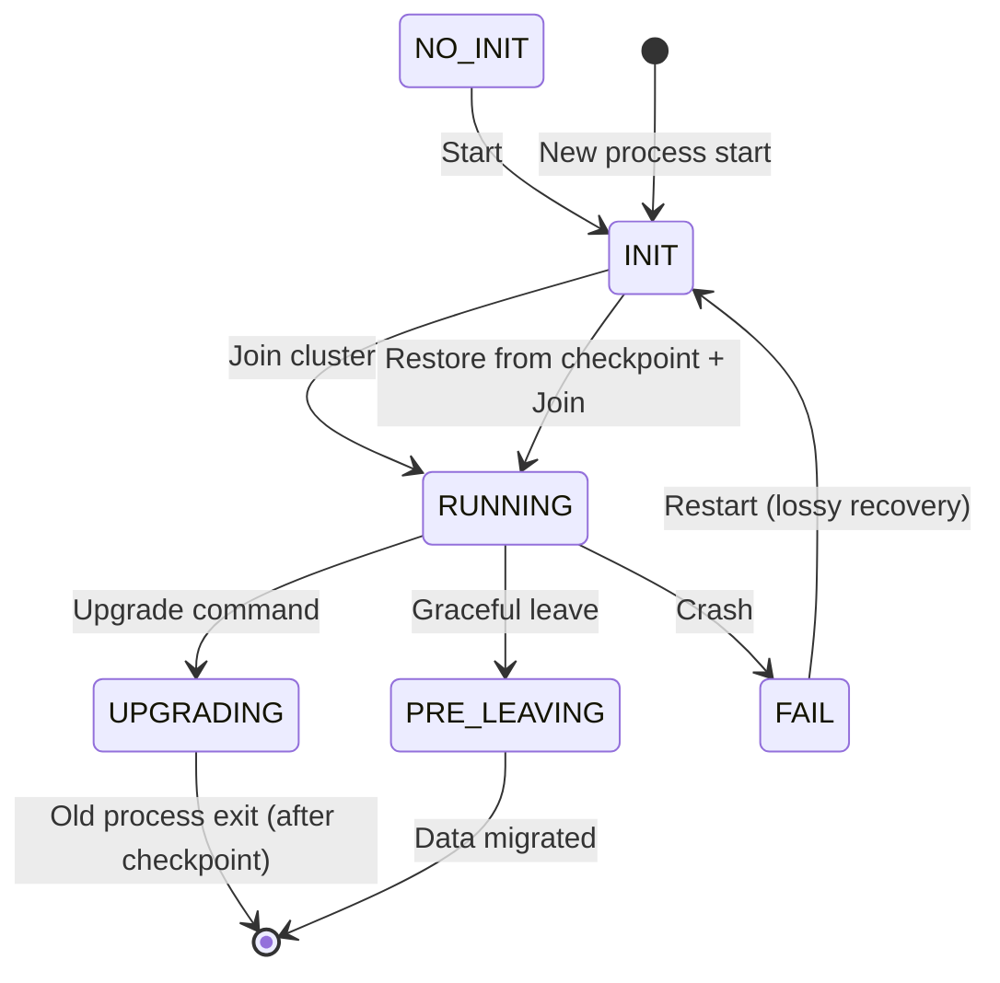
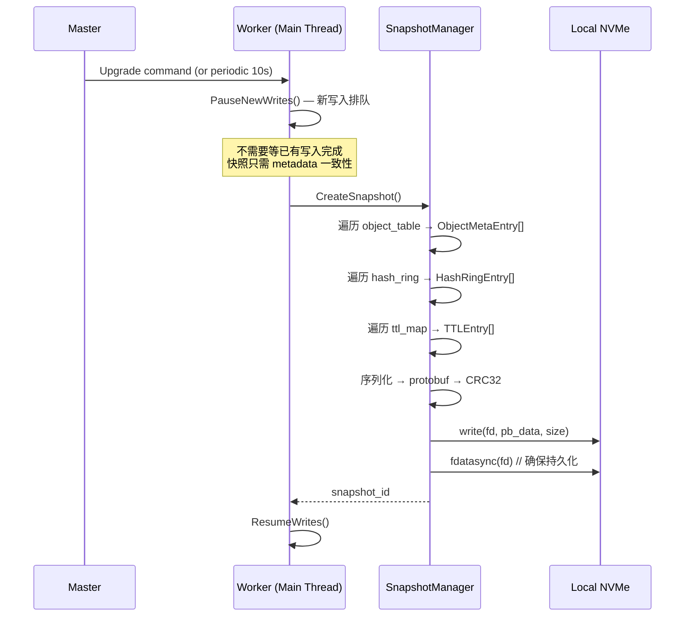
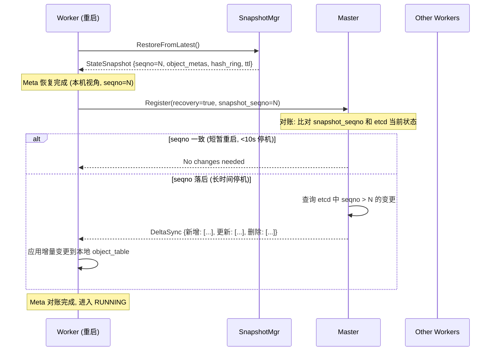
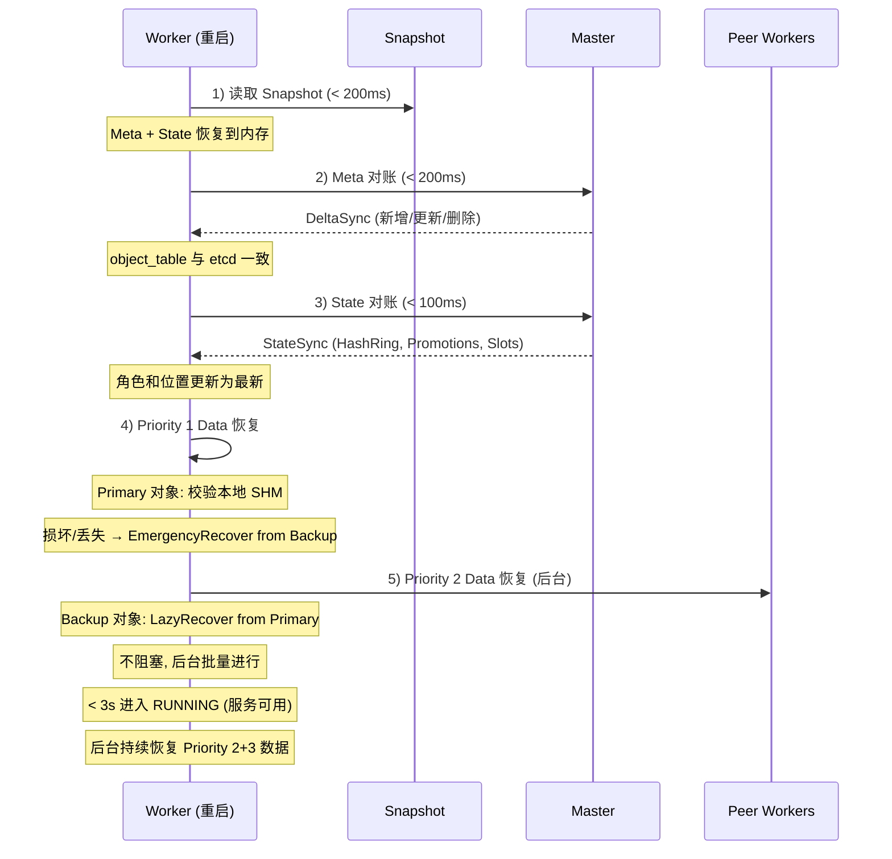
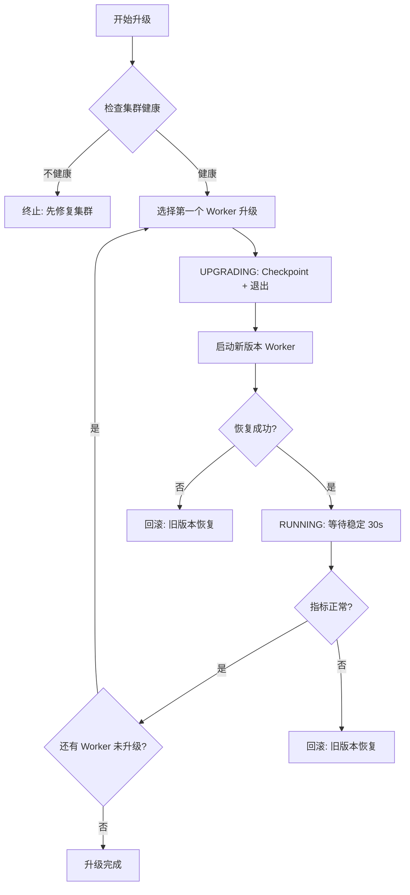

# 滚动升级原地恢复 — 详细设计

## 一、需求拆解规格

### 1.1 需求分解

| 子需求 ID | 名称 | 描述 | 优先级 |
|-----------|------|------|:--:|
| IR-01 | Worker 本地 Checkpoint | Worker 周期性将内存状态快照到本地 RocksDB | P0 |
| IR-02 | Worker 快速恢复 | Worker 重启时从本地 Checkpoint 恢复，跳过全量重建 | P0 |
| IR-03 | Hash Ring 升级态 | 新增 UPGRADING 节点状态，升级中保留数据不迁移 | P0 |
| IR-04 | 版本兼容 | Worker 新旧版本间可互操作（相同协议版本） | P1 |
| IR-05 | Master 无状态升级 | Master 升级不丢失元数据（etcd 已有） | P1 |

### 1.2 定量指标

| 指标 | 当前 | 目标 |
|------|------|------|
| Worker 重启恢复时间 | 分钟级 (全量重建) | < 3s (Checkpoint 恢复) |
| 滚动升级单节点影响 | 全量迁移数据 | 零迁移 (原地恢复) |
| 升级期间服务可用性 | 中断 (节点摘除) | 持续服务 (UPGRADING 态保留读) |
| 恢复后数据完整性 | 等 peer 对账 | Checkpoint 校验 (CRC/SeqNo) |
| Checkpoint 对性能影响 | — | < 5% 吞吐下降 |

### 1.3 规格约束

- **适用规模**: 单集群 10~1024 Worker
- **Checkpoint 数据量**: 典型 < 1GB (metadata + hot keys)
- **存储介质**: 本地 NVMe SSD（优先级）/ HDD
- **兼容性**: 同大版本内 (v0.8.x) 可滚动升级，跨大版本 (v0.9) 需全量

---

## 二、用例描述

### UC-1: 正常滚动升级

```
参与者: 运维人员, Master, Worker-A(旧版), Worker-A(新版)
前置: 集群正常服务，Worker-A 为 RUNNING 态，版本 v0.8.1.rc24

流程:
1. 运维人员通过 dscli 发起升级命令
2. Master 将 Worker-A 标记为 UPGRADING
3. Worker-A 执行 Checkpoint (同步阻塞，< 1s)
4. Worker-A 进程退出 (SIGTERM)
5. 新版本 Worker-A 进程启动
6. Worker-A 从本地 RocksDB 恢复 Checkpoint 数据
7. Worker-A 向 Master 注册，恢复 RUNNING 态
8. 升级完成

后置: Worker-A 升级到 v0.8.1.rc26，数据完整，服务未中断
```

### UC-2: 异常断电恢复

```
参与者: Worker-A (非计划重启)
前置: Worker-A 运行时系统断电/崩溃

流程:
1. 系统重启后 Worker-A 进程启动
2. Worker-A 检测到非正常退出 (no clean shutdown flag)
3. Worker-A 从最近一次成功 Checkpoint 恢复 (可能丢失最近周期数据)
4. Master 检测到 Worker-A 恢复，触发增量对账
5. 对账完成，恢复 RUNNING 态

后置: 恢复最近 Checkpoint 之后的数据，丢失量 < Checkpoint 间隔 (默认 10s)
```

### UC-3: 升级失败回滚

```
参与者: 运维人员, Master, Worker-A
前置: Worker-A 升级到新版后启动失败

流程:
1. 新版本 Worker-A 多次启动失败 (crash loop)
2. Master 检测到 UPGRADING 态超时 (30s)
3. Master 通知使用旧版本重新启动
4. Worker-A 旧版本从 Checkpoint 恢复
5. 恢复 RUNNING 态

后置: 回退到旧版本，数据不丢失
```

---

## 三、概念模型变化

### 3.1 新增概念

```
WorkerStates (existing):  NO_INIT → INIT → RUNNING → PRE_LEAVING → FAIL
WorkerStates (new):      NO_INIT → INIT → RUNNING → UPGRADING → RUNNING
                                                       ↕
                                                  (旧版退出→新版恢复)
                                                  RUNNING (via Checkpoint)
```



### 3.2 设计决策: 不用 RocksDB Checkpoint

**Mooncake 参考**: Mooncake 使用 SharedMemory (`/dev/shm`) + 本地 NVMe 快照，进程重启后 mmap 直接加载。
不需要重量级 KV 查询，只需要把内存热数据 dump 到盘、启动时读回。

**我们的方案: 直接内存序列化 → 本地 NVMe**

```
优点:
  - 零 RocksDB 依赖，不需要 Checkpoint API / WAL 回放 / ColumnFamily
  - 序列化/反序列化比 RocksDB 迭代快 10x+
  - 可精确控制序列化内容（metadata、对象索引、TTL map）
  - 文件格式简单: protobuf + CRC32，跨版本可解析

缺点:
  - 需要自行管理一致性（利用现有的 SlotRecovery 框架保证）
  - 大对象数据不在 snapshot 内（仅序列化引用，实际数据通过 peer 对账恢复）
```

### 3.3 新增核心对象

**StateSnapshot** — 轻量级内存快照：

```cpp
struct StateSnapshot {
    // 对象索引: key_hash → ObjectMeta (不含实际数据)
    std::vector<ObjectMetaEntry> object_metas;
    
    // Hash Ring 位置: key_hash → owner_worker
    std::vector<HashRingEntry> hash_assignments;
    
    // TTL 信息: key_hash → expire_time
    std::vector<TTLEntry> ttl_entries;
    
    // Master 分配的 slot 信息
    std::vector<SlotInfo> slots;
    
    // 元数据
    uint64_t checkpoint_id;
    uint64_t timestamp_us;
    std::string worker_version;
    uint64_t master_seqno;           // etcd 中的序列号锚点
    uint32_t crc32;
};
```

**SnapshotManager** — 直接文件读写，不走 RocksDB：

```
SnapshotManager (per Worker):
  - CreateSnapshot(path) → Status      // 内存 → protobuf → write() → fdatasync
  - RestoreFromSnapshot(path) → Status // read() → protobuf → 内存
  - VerifySnapshot(path) → bool        // 读文件 → CRC32 校验
  - PruneOldSnapshots(maxKeep) → void  // 保留最近 N 个
  - GetLatestSeqno() → uint64          // 从 snapshot 读取锚点 seqno

存储路径: {checkpoint_data_dir}/snapshot_{id}.pb
文件大小: 典型 < 500MB (仅 metadata，不含实际数据块)
```

---

## 四、关键流程设计

### 4.1 Snapshot 创建流程 (参考 Mooncake SHM 快照)



**关键设计决策 (参考 Mooncake):**
- Snapshot 包含三类信息：**Meta**（对象索引）+ **State**（Worker 运行时状态）+ **Data 引用**（SHM 单元 ID）
- 实际对象数据 (SHM) 不在 Snapshot 内——太大，且有 peer 可用
- fdatasync 保证落盘（NVMe 上 < 100ms）
- 暂停新写入时间窗口 < 500ms

### 4.2 快速恢复：三类信息分别处理

Worker 需要恢复三类信息，每类的恢复策略不同：

```
┌─────────────────────────────────────────────────────────────┐
│ Worker 状态                           恢复方式              │
├─────────────────────────────────────────────────────────────┤
│ Meta: 对象索引、key→location、TTL     Snapshot + Master对账 │
│ Data: SHM 中的实际对象数据             peer 拉取或等恢复     │
│ State: HashRing 位置、Slot 分配        Master 重新下发       │
└─────────────────────────────────────────────────────────────┘
```

### 4.3 Meta 恢复 + 对账

Meta 是最关键的一层——必须保证 key→location 映射正确。



**Meta 对账的数据来源:**
- **etcd (Master)**: 权威元数据。etcd 中有所有对象的完整 key→location 映射
- **对账单位**: seqno。Snapshot 记录了快照时的 etcd seqno，Master 对比当前 seqno 计算 delta
- **Delta 内容**: 新增对象、删除对象、location 变更、TTL 更新

### 4.4 Data 恢复

实际对象数据 (SHM) 可能是 TB 级，不能序列化到 Snapshot。通过 peer 按需恢复。

```
Worker 重启恢复后:

对于每个本地 object:
  Priority 1 (本机是 Primary)：
    → 必须恢复数据，否则 Client Get 会失败
    → 策略: 立即从 Snapshot 中记录的 shm_unit_id 校验 SHM 是否完好
    → 若 SHM 丢失 (进程重启后 SHM 失效): 触发紧急恢复
        EmergencyRecover() → 从 Backup 拉取数据 (URMA, < 100us)
    
  Priority 2 (本机是 Backup)：
    → 数据可推迟恢复 (Client 优先从 Primary 读)
    → 策略: 后台异步从 Primary 拉取
        LazyRecover() → 批量拉取, 不阻塞服务
    
  Priority 3 (本机只是临时缓存)：
    → 不需要恢复 (Client 会从 Primary/Backup 拉取)
    → 策略: 标记 NeedToDelete, 等待自然淘汰
```

### 4.5 Worker 状态恢复 + 对账

Worker 重启后，集群中的角色可能已变化：

| 状态项 | Snapshot 中 | 恢复方式 |
|--------|:--:|------|
| Hash Ring 位置 | ✅ 有 | 向 Master 重新获取最新 Hash Ring (可能已变化) |
| Slot 分配 | ✅ 有 | SlotRecoveryManager::HandleLocalRestart() 重新协调 |
| 副本角色 (Primary/Backup) | ✅ 有 | 对账时 Master 告知是否有 Promote 发生 |
| 迁移任务 | ❌ 无 | HashRingTaskExecutor::RestoreScalingTask() 恢复 |

**状态对账流程:**

```
1. Worker → Master: Register(recovery=true)
2. Master 检查:
   - 此 Worker 的 Hash Ring 位置是否变化 (扩容/缩容)
   - 此 Worker 上的 Primary 对象是否已被 Promote 到其他 Worker
   - 是否有新的 Slot 分配
3. Master → Worker: StateSync {hash_ring, primary_promotions, slot_assignments}
4. Worker:
   - 更新 Hash Ring
   - 对于被 Promote 的对象: 标记为 Backup
   - 对于新 Slot: SlotRecoveryManager 处理
```

### 4.6 三类对账时序



**恢复时间预算:**

| 阶段 | 操作 | 时间 |
|------|------|:--:|
| 1 | 读取 Snapshot | < 200ms |
| 2 | Meta 对账 (DeltaSync) | < 200ms |
| 3 | State 对账 (StateSync) | < 100ms |
| 4 | Priority 1 Data 紧急恢复 | < 2ms/object (URMA) |
| | **服务可用** | **< 3s** ✅ |
| 5 | Priority 2 Data 后台恢复 | 后台, 不阻塞 |

### 4.7 滚动升级编排



**升级策略：**
- MaxUnavailable: 10% (100 个 Worker 集群最多同时升级 10 个)
- 每个 Worker 升级间隔 > 30s（确保恢复稳定）
- 先升级非关键节点（无 Primary 数据），后升级有 Primary 的节点

### 4.8 Protobuf 消息定义

```protobuf
// 文件: src/datasystem/protos/state_snapshot.proto (新增)

message StateSnapshotPb {
    // 版本信息
    uint64 checkpoint_id = 1;
    uint64 timestamp_us = 2;
    string worker_version = 3;       // "v0.8.1.rc26"
    
    // 锚点信息 (用于增量对账)
    uint64 master_seqno = 4;         // etcd 中最后确认的序列号
    string etcd_cluster_id = 5;      // etcd 集群 ID (重启后验证)
    
    // Meta 表项
    message ObjectMetaEntry {
        string key_hash = 1;
        uint64 data_size = 2;
        uint32 ttl_second = 3;
        uint64 create_time_us = 4;
        uint64 version = 5;
        bool is_primary_copy = 6;
        string primary_address = 7;
        bytes shm_unit_id = 8;       // SHM 单元引用
    }
    repeated ObjectMetaEntry object_metas = 10;
    
    // Hash Ring 分配
    message HashRingEntry {
        string key_hash = 1;
        string owner_worker = 2;
        uint32 slot_id = 3;
    }
    repeated HashRingEntry hash_assignments = 11;
    
    // TTL 信息
    message TTLEntry {
        string key_hash = 1;
        uint64 expire_time_us = 2;
    }
    repeated TTLEntry ttl_entries = 12;
    
    // Slot 信息 (从 Master 分配)
    message SlotInfo {
        uint32 slot_id = 1;
        string slot_path = 2;
        uint64 allocated_bytes = 3;
        uint64 used_bytes = 4;
    }
    repeated SlotInfo slots = 13;
    
    // CRC32 校验 (对整个消息计算)
    uint32 crc32 = 20;
}
```

### 4.9 SnapshotManager 完整 API

```cpp
// 文件: src/datasystem/worker/object_cache/snapshot_manager.h (新增)

class SnapshotManager {
public:
    // 初始化: data_dir = FLAGS_checkpoint_data_dir
    explicit SnapshotManager(const std::string &data_dir);
    ~SnapshotManager();
    
    // === 快照生命周期 ===
    
    // CreateSnapshot: 创建当前状态的快照
    // 内部流程:
    //   1. PauseNewWrites() — 标记 "快照进行中", 新写入排队
    //   2. IterateObjectTable() → ObjectMetaEntry[]
    //   3. IterateHashRing() → HashRingEntry[]
    //   4. IterateTTLMap() → TTLEntry[]
    //   5. SerializeProtobuf() + CRC32
    //   6. write(fd, pb_data) + fdatasync(fd)
    //   7. ResumeWrites()
    //   8. 返回 snapshot_id
    Status CreateSnapshot(uint64_t *snapshot_id);
    
    // RestoreFromLatest: 从最新的快照恢复
    // 内部流程:
    //   1. ListSnapshots() → 取最新
    //   2. VerifySnapshot(snapshot_id) → CRC32 + 版本检查
    //   3. read(fd) → protobuf 反序列化
    //   4. ApplyToObjectTable() → 重建内存索引
    //   5. ApplyToHashRing() → 重建 hash ring 位置
    //   6. ApplyToTTLMap() → 重建 TTL 映射
    //   7. 返回恢复的快照 seqno (用于增量对账)
    Status RestoreFromLatest(uint64_t *restored_seqno);
    
    // === 快照管理 ===
    
    // ListSnapshots: 列出所有快照
    Status ListSnapshots(std::vector<SnapshotMeta> *snapshots);
    
    // VerifySnapshot: 校验指定快照
    Status VerifySnapshot(uint64_t snapshot_id, bool *valid);
    
    // PruneOldSnapshots: 保留最近 N 个, 删除其余
    Status PruneOldSnapshots(uint32_t max_keep = 3);
    
    // === 状态查询 ===
    bool HasSnapshot() const;
    uint64_t GetLatestSnapshotId() const;
    uint64_t GetLatestSnapshotSeqno() const;
    size_t GetSnapshotCount() const;
    
    // === 统计 ===
    struct SnapshotStats {
        uint64_t total_snapshots_created;
        uint64_t total_snapshots_restored;
        uint64_t failed_snapshots;
        uint64_t last_snapshot_size_bytes;
        uint64_t last_snapshot_duration_us;
        uint64_t last_restore_duration_us;
    };
    SnapshotStats GetStats() const;

private:
    // 序列化到文件
    Status WriteSnapshotToFile(const StateSnapshotPb &pb,
                               uint64_t snapshot_id);
    
    // 从文件反序列化
    Status ReadSnapshotFromFile(uint64_t snapshot_id,
                                StateSnapshotPb *pb);
    
    // CRC32 校验
    uint32_t ComputeCRC32(const StateSnapshotPb &pb);
    
    // 构建快照文件名
    std::string SnapshotPath(uint64_t snapshot_id) const {
        return data_dir_ + "/snapshot_" +
               std::to_string(snapshot_id) + ".pb";
    }
    
    std::string data_dir_;
    std::mutex snapshot_mutex_;
    std::atomic<bool> snapshot_in_progress_{false};
    SnapshotStats stats_;
};
```

### 4.10 恢复流程伪代码

```cpp
// WorkerOCServer::Start() 中加入恢复逻辑 (修改 worker_oc_server.cpp)

Status WorkerOCServer::Start() {
    // ... 现有初始化 ...
    
    // Step 1: Slot 恢复 (已有框架)
    RETURN_IF_ERR(slotRecoveryOrchestrator_->Init());
    RETURN_IF_ERR(slotRecoveryOrchestrator_->RepairLocalSlots());
    
    // Step 2: 尝试快速恢复 (新增)
    SnapshotManager snapshot_mgr(FLAGS_checkpoint_data_dir);
    
    if (FLAGS_enable_fast_recovery && snapshot_mgr.HasSnapshot()) {
        uint64_t restored_seqno = 0;
        Status s = snapshot_mgr.RestoreFromLatest(&restored_seqno);
        
        if (s.ok()) {
            LOG(INFO) << "[FastRecovery] Restored from snapshot, seqno="
                      << restored_seqno
                      << ", duration=" << snapshot_mgr.GetStats().last_restore_duration_us << "us";
            
            // Step 3: 向 Master 注册为恢复模式
            RegisterWithRecoveryFlag(restored_seqno);
            
            // Step 4: Master 进行增量对账
            // Master 对比 etcd 中的 seqno 与 restored_seqno
            // 推送缺失的元数据更新
            DeltaSync(restored_seqno);
            
            return Status::OK();
        } else {
            LOG(WARNING) << "[FastRecovery] Snapshot restore failed: " << s.ToString()
                        << ", falling back to full recovery";
            // 降级到现有的全量 Slot Recovery 路径
        }
    }
    
    // Step 5: 回退到现有路径
    // HandleLocalRestart() → 等 SlotRecoveryManager 的 ETCD 协调恢复
    RETURN_IF_ERR(slotRecoveryManager_->HandleLocalRestart());
    
    return Status::OK();
}
```

### 4.11 与现有 SlotRecovery 的集成点

```
Worker Start
  ├── SlotRecoveryOrchestrator::RepairLocalSlots()  ← 已有, 本地磁盘修复
  ├── [NEW] SnapshotManager::RestoreFromLatest()     ← 快速恢复路径
  │   └── 成功 → RegisterWithRecoveryFlag → DeltaSync
  └── 失败或无可恢复快照 → SlotRecoveryManager::HandleLocalRestart()
      ├── ResumeStaleCrossIncidentTasksOnRestart()   ← 已有
      ├── TakeOverPendingFromSourceIncident()        ← 已有
      ├── RebuildLocalRestartIncident()              ← 已有
      └── ScheduleLocalRestartTasks()                ← 已有
```

**关键: 快照恢复成功后跳过 ETCD 协调的 Slot Recovery (最慢部分), 仅做增量对账 (毫秒级)。**

---

## 五、代码模块影响分析 (已更新)

### 5.1 修改文件清单

| 模块 | 文件 | 改动类型 | 工作量 |
|------|------|---------|:--:|
| Worker 主流程 | `worker/worker_oc_server.cpp` | **重构**: 启动流程加入 Checkpoint 恢复 | 3d |
| Checkpoint | `worker/object_cache/checkpoint_manager.h/.cpp` | **新增**: CheckpointManager 实现 | 5d |
| Hash Ring | `common/metastore/hash_ring.h` | **修改**: 新增 UPGRADING 状态 | 2d |
| Hash Ring | `common/metastore/hash_ring_task_executor.h/.cpp` | **修改**: UPGRADING 态下跳过迁移 | 3d |
| Master | `master/cluster_manager.*` | **修改**: 升级编排逻辑 | 3d |
| CLI | `cli/upgrade.py` | **新增**: dscli upgrade 命令 | 2d |
| 配置 | `common/gflags/*` | **修改**: 新增 checkpoint 相关 flag | 1d |
| 测试 | `tests/st/upgrade/` | **新增**: 升级测试用例 | 3d |

### 5.2 不修改的模块

- KV 客户端 — 升级对客户端透明
- 本地 NVMe 持久化 — 直接文件 IO，无需通过 RocksDB
- URMA 传输层 — 不受影响
- ZMQ RPC — 协议不变

### 5.3 新增 Flag

| Flag | Default | 说明 |
|------|---------|------|
| `checkpoint_enabled` | `true` | 是否启用 Checkpoint |
| `checkpoint_interval_s` | `10` | Checkpoint 周期 (秒) |
| `checkpoint_max_keep` | `3` | 最多保留 Checkpoint 数 |
| `checkpoint_data_dir` | `./checkpoint_data` | Checkpoint 存储路径 |
| `upgrade_timeout_s` | `300` | 单个节点升级超时时间 |

---

## 六、工作量估算

| 子需求 | 开发 | 测试 | 合计 |
|--------|:--:|:--:|:--:|
| IR-01 CheckpointManager | 5d | 2d | 7d |
| IR-02 快速恢复 | 3d | 2d | 5d |
| IR-03 Hash Ring UPGRADING 态 | 5d | 2d | 7d |
| IR-04 版本兼容 | 2d | 1d | 3d |
| CLI + 部署集成 | 3d | 1d | 4d |
| **合计** | **18d** | **8d** | **26d** |

> 注：这是单开发人员估算。可拆解到 2-3 人并行。

### 拆解到个人

| 角色 | 负责 | 依赖 |
|------|------|------|
| 人力 A: Worker 侧 | IR-01 + IR-02 + IR-04 | 无 |
| 人力 B: Master/HashRing 侧 | IR-03 | IR-01 (Checkpoint 接口) |
| 人力 C: CLI + 测试 + 部署 | dscli upgrade + 集成测试 | IR-01, IR-02, IR-03 |

---

## 七、验证方案

### 7.1 功能验证

| 测试场景 | 验证方法 | 通过标准 |
|----------|---------|---------|
| 正常升级 | 3 Worker 集群，逐个升级 | 升级过程无数据丢失，客户端读写正常 |
| 异常恢复 | kill -9 Worker，等待恢复 | 30s 内恢复 RUNNING 态，数据完整 |
| 回滚 | 升级后故障 → 回退旧版本 | 回退成功，数据从未丢失 |
| 多次连续升级 | rc24 → rc25 → rc26 | 每次升级后数据一致 |

### 7.2 性能验证

| 指标 | 测试方法 | 目标 |
|------|---------|------|
| Checkpoint 耗时 | 单节点 Checkpoint 耗时 | < 1s |
| 恢复耗时 | 从 Checkpoint 恢复到 RUNNING | < 3s |
| Checkpoint 吞吐影响 | 对比开/关 Checkpoint | < 5% |
| 升级窗口 | 100 Worker 集群全量升级 | < 30min |

---

## 八、风险

| 风险 | 影响 | 缓解 |
|------|------|------|
| Checkpoint 数据损坏 | 恢复失败，等全量重建 | CRC 校验 + 多版本保留 |
| Snapshot 版本不兼容 | 新旧格式 Snapshot 无法解析 | protobuf 向后兼容 + 版本检测降级 |
| 升级期间写入丢失 | 数据不一致 | UPGRADING 态保留读、暂停写 |
| 磁盘空间不足 | Checkpoint 失败 | 保留 N 个 + 空间预检 |
