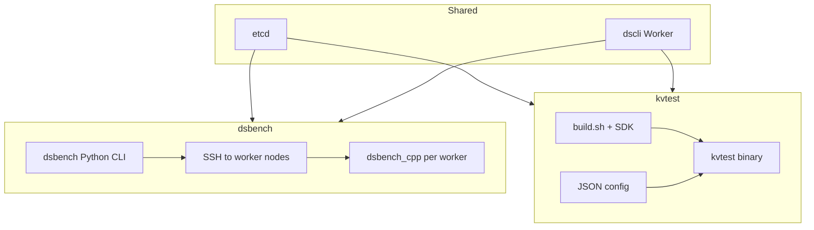

# RFC: dsbench / kvtest 调研与 Skills 基础

- **Status**: In-Progress
- **Started**: 2026-06-19

---

## 目标

为 Agent 提供 dsbench 与 kvtest 的可复现运行 playbook、harness smoke 脚本；bench profiles 归 **wb-perf**（`bench.dsbench.smoke` / `bench.kvtest.smoke`）。

## 工具概览

| 维度 | dsbench | kvtest |
|------|---------|--------|
| 入口 | Python CLI（wheel `openyuanrong-datasystem`） | C++ 二进制 `tests/kvtest/output/kvtest` |
| 执行模型 | CLI 通过 SSH 在 Worker 节点启动 `dsbench_cpp` | JSON 配置驱动，本地或 `deploy_client.py` 远程部署 |
| 模式 | SINGLE / FULL / CUSTOMIZED | Pipeline / Cache / Benchmark（16 种 test_mode） |
| 前置 | dscli + etcd + Worker | SDK + etcd + Worker |
| 官方文档 | `docs/source_zh_cn/deployment/dsbench.md` | `tests/kvtest/README.md` + `tests/kvtest/docs/` |

## 架构

## 本目录文件

| 文件 | 说明 |
|------|------|
| [tool-selection.md](tool-selection.md) | 何时用 dsbench vs kvtest |
| [dsbench-playbook.md](dsbench-playbook.md) | dsbench 安装、部署前置、运行、输出解读 |
| [kvtest-playbook.md](kvtest-playbook.md) | kvtest 编译、配置、Benchmark/Pipeline/Cache |
| [tiantiyun-validation-log.md](tiantiyun-validation-log.md) | tiantiyun-80c128g 实跑记录 |

## Harness 集成

| 脚本 | Profile |
|------|---------|
| `scripts/testing/bench/bootstrap_bench_cluster.sh` | 共用 etcd + Worker |
| `scripts/testing/bench/run_dsbench_smoke_remote.sh` | `bench.dsbench.smoke` |
| `scripts/testing/bench/run_kvtest_smoke_remote.sh` | `bench.kvtest.smoke` |

## Skills（workbench）

- `.skills/wb-perf/SKILL.md` — dsbench/kvtest bench smoke（`profiles.yaml`）

稳定后迁移至 `yuanrong-datasystem/.skills/ds-bench` 与 `ds-kvtest`。

## 相关文档

- [dscli-dsbench-guide.md](../../docs/dscli-dsbench-guide.md)
- [dsbench-install-deploy-run-observe.md](../../docs/flows/narratives/dsbench-install-deploy-run-observe.md)
- [wb-perf](../../.skills/wb-perf/SKILL.md) — bench 异常时的热点分析 handoff
