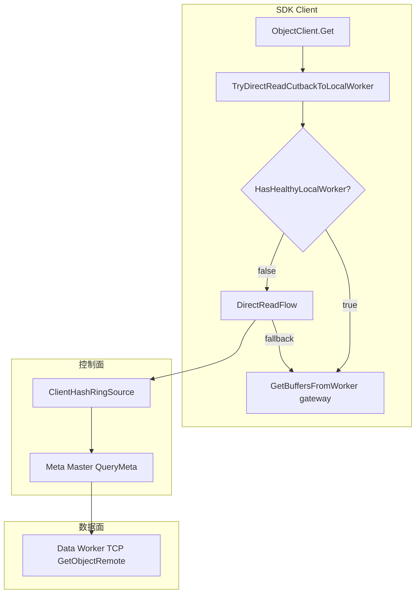
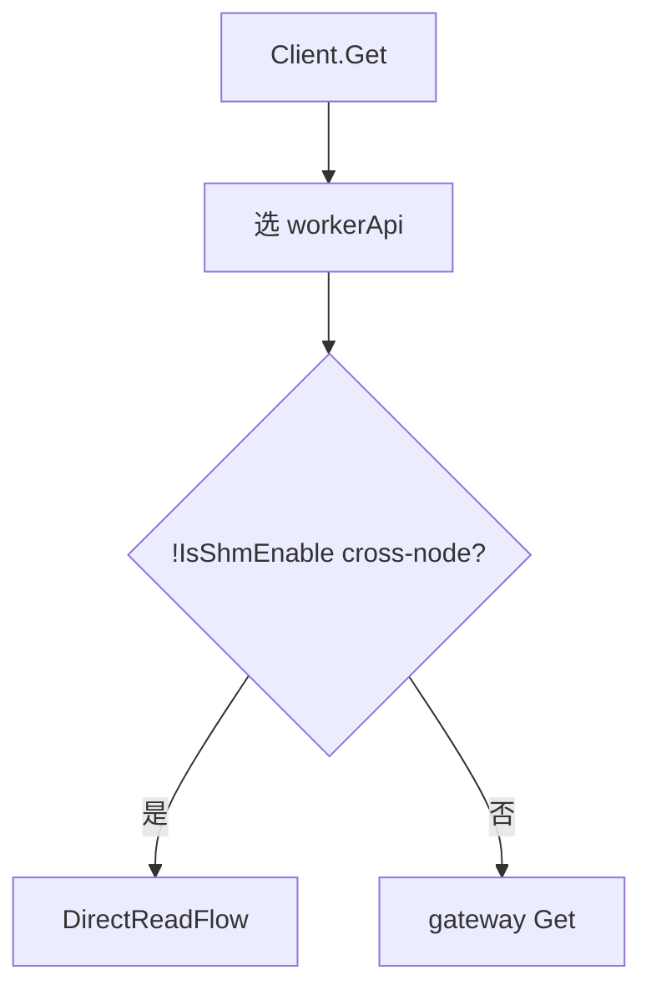
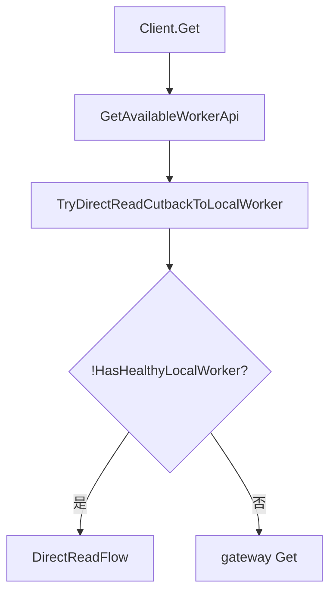
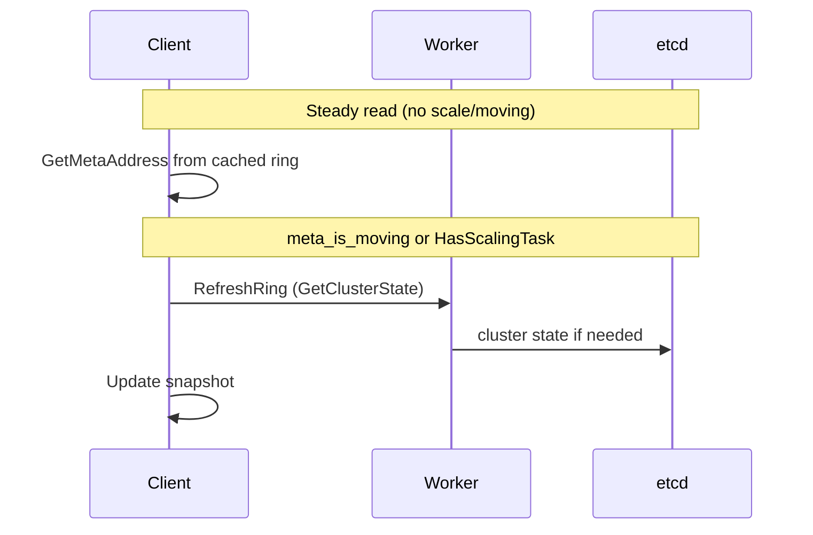
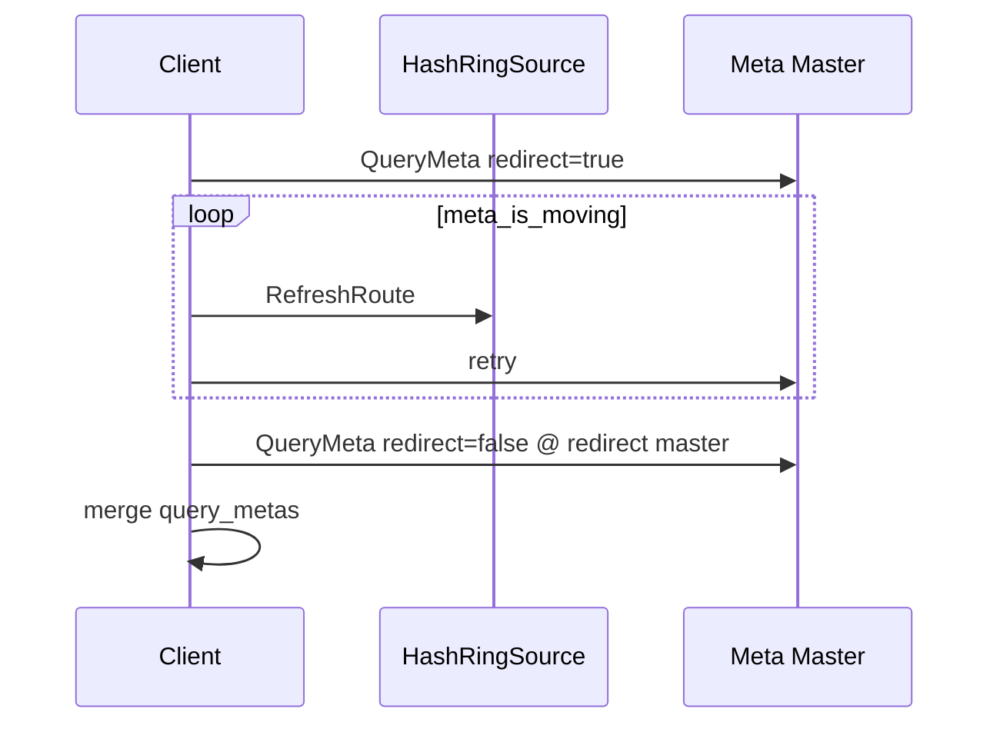
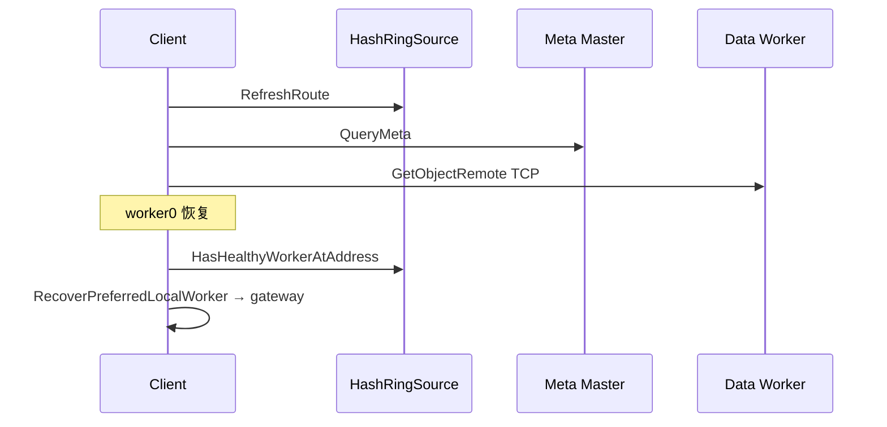

# Client Direct Read — AS IS vs TO BE 时序

**Status:** Done  
**Scope:** Phase 1 TCP read path; URMA / remote-write / colocated-read deferred.  
**HTML:** https://yche.me/design/client-direct-read-flow-20260624.html

---

## 0. 整体设计（TO-BE）

---

## 1. 读路径门控

### AS IS（错误）

### TO BE（当前）

**变化点：** 门控从「是否跨节点读」改为「是否无 healthy local worker」；Get 前增加 ring 驱动的回切。

---

## 2. HashRing 刷新

| | AS-IS | 旧 TO-BE（已废弃） | **目标 TO-BE** |
|---|-------|-------------------|----------------|
| Bootstrap | etcd → worker | 不变 | 不变 |
| Steady | 仅 HasScalingTask 时刷新 | ~~每次 route lookup~~ | **cached snapshot**；仅 scaling / 控制面事件 / 版本不一致时刷新 |

详见 [hash-ring-refresh-policy.md](./hash-ring-refresh-policy.md)。

---

## 3. 元数据查询（迁移 / 重定向）

### AS IS

- `meta_is_moving` → continue，不刷新 ring
- redirect → 换地址重试，丢弃 partial query_metas

### TO BE

---

## 4. Direct Read 端到端 + 回切

---

## 验证矩阵（TCP · 19/19 PASS）

| ID | 场景 | ST |
|----|------|-----|
| V1 | 无 local worker → direct meta+TCP | `StandbyWithoutLocalWorkerUsesDirectRead` |
| V2 | 扩缩容 / moving 仍可读 | `ReadSurvivesWorkerScaleDownAndUp`, `MetaMovingRefreshesRingAndSucceeds` |
| V3 | local worker 恢复回切 gateway | `LocalWorkerRecoveryCutbackToGateway` |

全量用例见 HTML 页 §6。
