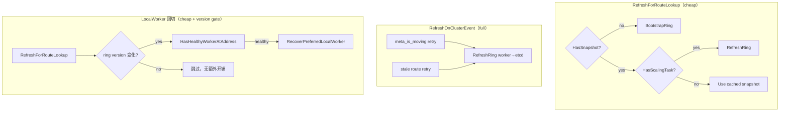

# HashRing 刷新策略

**Status:** Draft  
**Branch:** `feature/client-direct-read-flow`  
**Related:** [design.md](./design.md), [as-is-to-be-sequences.md](./as-is-to-be-sequences.md)

---

## 1. 原则（目标语义）

HashRing 刷新是**有成本**的控制面操作（etcd / Worker RPC）。应遵循：

| 触发条件 | 是否刷新 | 说明 |
|----------|----------|------|
| **Bootstrap**（Client 无 ring 快照） | ✅ | 首次 etcd → worker fallback |
| **扩缩容进行中**（`add_node_info` / `del_node_info` 非空） | ✅ | ring 内容正在变更 |
| **故障 / 迁移**（`meta_is_moving`、stale route、节点失效） | ✅ | 控制面显式信号 |
| **版本不一致**（Client 版本 ≠ 权威版本） | ✅ | 见 §3 |
| **稳态普通读**（无上述信号） | ❌ | 使用本地快照 |

**不应**在稳态每次 `GetMetaAddress` / route lookup 都拉全量 ring（此前 TO-BE 文档写法有误，已纠正）。

---

## 2. 现状 vs 目标

### 2.1 Client Direct Read（已按目标修正）

| 路径 | 之前（错误） | 现在 |
|------|-------------|------|
| `RefreshForRouteLookup` | 稳态**每次** worker→etcd 全量刷新 | 仅 bootstrap 或 `HasScalingTask()` |
| `RefreshOnClusterEvent` | （无） | meta moving / stale route / cutback 时全量刷新 |
| `ObjectReadAccessFlow` 入口 | `RefreshRouteIfNeeded` → 等价全量 | 仍走 cheap `RefreshForRouteLookup` |
| moving 重试 `beforeMovingRetry` | `RefreshRouteIfNeeded` | `RefreshRouteOnClusterEvent` |
| 外层 stale 重试 | `RefreshRouteIfNeeded` | `RefreshRouteOnClusterEvent` |
| gateway cutback 判定 | `RefreshOnClusterEvent` 每次 Get | 共享 ring 快照 + **仅 ring 版本变化时**评估；cheap `RefreshForRouteLookup` |



### 2.2 版本字段（Gap，待补）

| 来源 | 版本 | 现状 |
|------|------|------|
| etcd | `modRevision` | Client `LoadFromEtcd` ✅ 已用 |
| Worker `GetClusterState` | 应返回权威版本 | ✅ `ring_etcd_mod_revision` + Client 使用 |
| Client → Worker gateway | Client 携带本地 ring 版本 | ❌ proto 未定义 |

`ReadOnlyHashRingView::UpdateFromPb` 已有「新版本 < 本地版本则忽略」逻辑，但 Worker 路径版本恒为 -1 时**版本语义失效**。

---

## 3. Client–Worker 版本协同（待实现）

### 3.1 场景

Client 走 **gateway**（`GetBuffersFromWorker`）时，Worker 用本地 ring 做路由。若 Client 缓存 ring 过旧，Worker 应能发现并推动 Client 更新。

### 3.2 建议协议扩展

**Client → Worker**（`GetReqPb` / 或现有 cluster 相关字段）：

```protobuf
int64 client_hash_ring_version = N;  // Client 本地 ReadOnlyHashRingView::Version()
```

**Worker 处理**（gateway Get / QueryMeta 入口）：

```text
if req.client_hash_ring_version != worker.currHashRingVersion:
    return STALE_HASH_RING  // 或 K_NOT_READY + reason
```

**Client 收到 STALE_HASH_RING** → 调用 `RefreshOnClusterEvent()` → 重试。

Worker 内部已有类似概念：`RouteInfo::currHashRingVersion` 用于 `hash2MetaInfo` 路由缓存失效（`etcd_cluster_manager.cpp`），可对 Client 暴露同一版本号。

### 3.3 GetClusterState 扩展

```protobuf
message GetClusterStateRspPb {
  bool etcd_available = 1;
  HashRingPb hash_ring = 2;
  int64 ring_etcd_mod_revision = 3;   // etcd modRevision，与 Client etcd 路径一致
  int64 ring_local_version = 4;       // Worker currHashRingVersion（可选）
}
```

Client `LoadFromWorker` 使用 `ring_etcd_mod_revision` 写入 `ReadOnlyHashRingView`，与 etcd 路径版本空间统一。

---

## 4. Worker 侧刷新（已有机制）

Worker 不通过 Client 式快照；ring 由 etcd watch + `HashRing::UpdateRing` 驱动：

| 事件 | Worker 行为 |
|------|-------------|
| etcd ring mod_revision 变化 | `UpdateRing`（含 SkipUpdateRing 过滤旧版本） |
| 节点故障 | `HashRingHealthCheck` 拉 etcd → 更新 ring |
| 扩缩容任务 | `add_node_info` / `del_node_info` → migrate task |

Worker **不需要**每次 Client 请求都刷新 ring；需要的是 **Client 版本不对时拒绝并 signal**（§3）。

---

## 5. 与 meta_is_moving 的关系

| 信号 | 含义 | Client 动作 |
|------|------|-------------|
| `meta_is_moving` | Meta 迁移进行中 | `RefreshOnClusterEvent`（全量 ring）+ 重试 QueryMeta |
| `HasScalingTask()` | Ring 上仍有 scale 任务 | cheap 路径也会 `RefreshRing` |
| 无信号，稳态 | 正常读 | 用缓存 ring |

二者互补：scaling task 来自 ring 内容；moving 来自 Meta Master 响应。

---

## 6. 测试 / 单机验证用 gflag

生产默认走事件驱动刷新；单机或手工验证可通过 **Client gflag**（定义于 `direct_read_test_hook.cpp`）覆盖：

| Flag | 默认 | 用途 |
|------|------|------|
| `enable_client_direct_read` | `false` | 总开关 |
| `enable_client_direct_read_fallback` | `true` | 失败回切 gateway |
| `client_direct_read_force` | `false` | **单机**：有 healthy local worker 时也走 direct read |
| `client_direct_read_refresh_ring_every_lookup` | `false` | **调试**：每次 route lookup 全量刷新 ring（等同旧 TO-BE） |
| `client_direct_read_retry_count` | `1` | moving / stale route 重试预算 |

**单机示例：**

```bash
# Client 进程启动参数
-enable_client_direct_read=true \
-client_direct_read_force=true \
-enable_distributed_master=true
```

ST 仍可使用 `DirectReadTestHook::SetForceDirectRead(true)`；与 `client_direct_read_force` 语义等价。

---

## 7. 测试影响

| ST | 预期 |
|----|------|
| `MetaMovingRefreshesRingAndSucceeds` | moving 路径仍触发 `RefreshOnClusterEvent`，refresh count ≥ 1 |
| `BootstrapLoadsHashRingFromEtcd` | bootstrap 不变 |
| `ReadSurvivesWorkerScaleDownAndUp` | scale 期间 `HasScalingTask` 触发刷新 |
| 稳态多次 Get | `hashRingWorkerRefreshCount` **不应**随每次 Get 线性增长（修正后） |

---

## 8. 实施阶段

| 阶段 | 内容 | 状态 |
|------|------|------|
| R1 | Client cheap vs event 双路径刷新 + 单机 gflag | **Done**（本分支） |
| R2 | `GetClusterStateRspPb` 带 ring 版本；Client LoadFromWorker 使用 | **Done**（本分支） |
| R3 | Gateway Get 携带 client ring version；Worker 校验并返回 STALE | Planned |
| R4 | Worker direct read 复用 `ReadOnlyHashRingView` + 同一版本语义 | Planned（P3） |

---

## 9. 代码锚点

| 组件 | 路径 |
|------|------|
| Client cheap/event | `client_hash_ring_source.{h,cpp}` |
| Route 入口 | `direct_read_route_provider.{h,cpp}` |
| moving 刷新 | `client_direct_read_meta_options.cpp` → `beforeMovingRetry` |
| Worker GetClusterState | `worker_worker_oc_service_impl.cpp` |
| Worker 路由缓存版本 | `etcd_cluster_manager.cpp` `currHashRingVersion` |
| 只读快照 | `read_only_hash_ring_view.{h,cpp}` |
