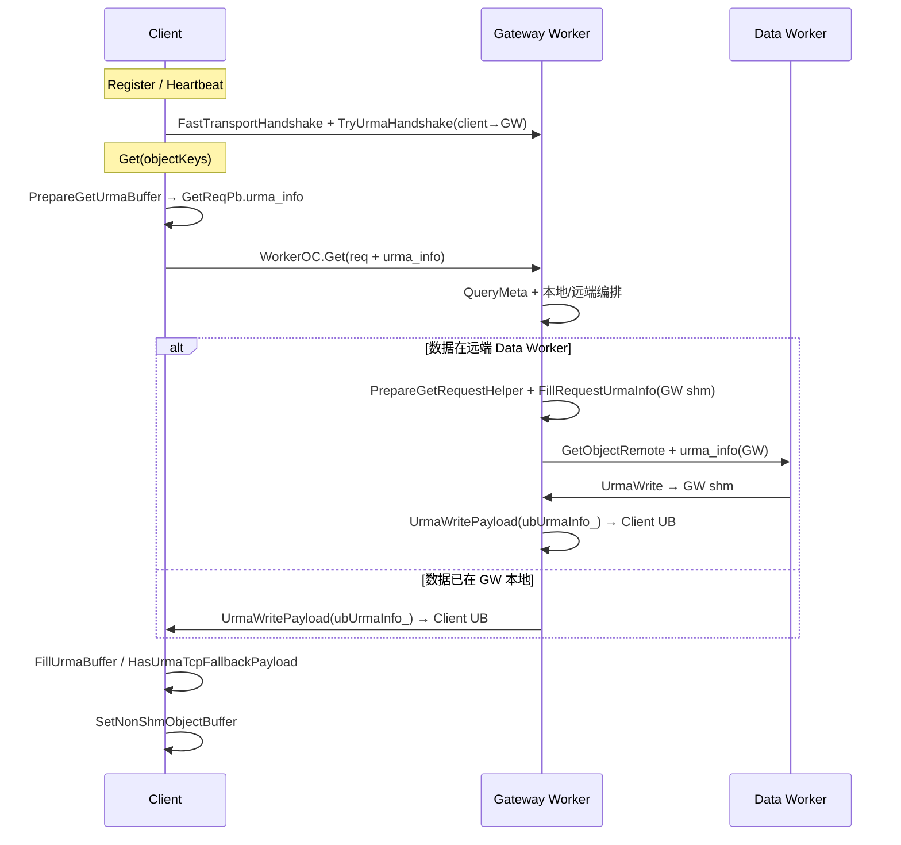
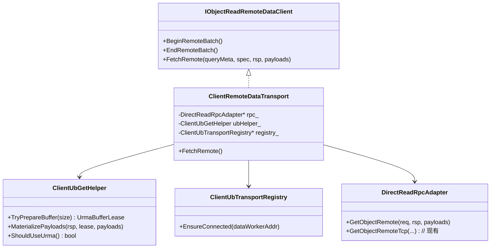
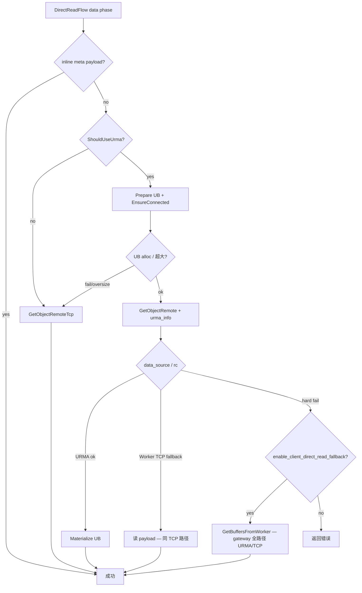

# Client Direct Read — URMA Data Path 设计（P4）

**Status:** In-Progress（TCP batch 已实现并验证；URMA 路径已实现，ST 待 1129 fake）  
**前置：** MR 1119（TCP direct read + gateway fallback）已合入  
**原则：** **复用** 非 direct（gateway Get）已打通的 URMA 传输逻辑；**不改 Worker** data 面；**兼容** 现有三层 fallback。

---

## 1. 背景与目标

### 1.1 1119 现状（TCP）

```
Client ──QueryMeta──► Meta Worker
       ──GetObjectRemote(TCP payload)──► Data Worker
       ──FinishDirectReadGet──► Buffer
```

- Data transport：`ClientRemoteTcpDataTransport` → `DirectReadRpcAdapter::GetObjectRemoteTcp`
- 显式拒绝 `data_source != DATA_IN_PAYLOAD`（`direct_read_non_tcp_data_source`）
- Meta phase / ring / fallback **不变**

### 1.2 目标（URMA）

跨节点、UB 开启时，direct read data phase 与 gateway Get **同等 URMA 能力**：

```
Client ──QueryMeta──► Meta Worker          （不变）
       ──[URMA] GetObjectRemote + urma_info──► Data Worker
       ──UrmaManager buffer → RpcMessage ──► FinishDirectReadGet
```

**性能收益：** 去掉 gateway 中转（gateway 拉数 + gateway→client URMA/TCP），变为 **client↔data worker 一跳 URMA**。

**非目标（本 MR）：** Remote H2D / pipeline RH2D、UCP/RDMA、Worker 改动。

**已实现（2026-06-28）：** `BatchGetObjectRemote` deferred batch（`enable_client_direct_read_batch`）；MGet UB batch 按 worker 分组 + `SplitDirectReadUbBatches`。

---

## 2. 非 Direct 已打通的传输逻辑（复用基线）

### 2.1 端到端：Gateway Get（Client → Gateway Worker → Data Worker）



**关键代码锚点（复用而非重写）：**

| 阶段 | 组件 | 文件 |
|------|------|------|
| Client UB 分配 | `PrepareUrmaBuffer` / `GetMemoryBufferInfo` | `client_worker_base_api.cpp`, `urma_manager.cpp` |
| 尺寸决策 / meta 缺失 → TCP | `ResolveUBGetSize` / `PrepareGetUrmaBuffer` | `client_worker_remote_api.cpp` |
| Client↔Gateway 建链 | `TryUrmaHandshake` → `WorkerRemoteWorkerTransApi` | `client_worker_common_api.cpp` |
| Gateway↔Data 拉数 | `PrepareGetRequestHelper` + `PullObjectDataFromRemoteWorker` | `worker_oc_service_get_impl.cpp` |
| Data Worker 写 URMA | `UrmaWritePayload(req.urma_info())` | `worker_worker_oc_service_impl.cpp` |
| Worker URMA→TCP | `enable_transport_fallback` + `TrackUrmaFallbackTcp` | `worker_worker_oc_service_impl.cpp`, `urma_fallback_tcp_limiter.h` |
| Client 收数 materialize | `FillUrmaBuffer` / `HasUrmaTcpFallbackPayload` | `client_worker_base_api.cpp` |
| URMA 失败统计 / 切 worker | `RecordUrmaDataPlaneResult` / `UrmaSuccessRateTracker` | `client_worker_remote_api.cpp`, `object_client_impl.cpp` |
| 集群预热 | `WarmupUrmaConnectionToPeer` (GW→peer) | `worker_oc_service_impl.cpp` |

### 2.2 Direct Read 与 Gateway 的差异（设计输入）

| 维度 | Gateway Get | Direct Read URMA |
|------|-------------|------------------|
| 控制面 RPC | `WorkerOC.Get` | `MasterOC.QueryMeta`（已有） |
| 数据面 RPC | 无（由 GW 代拉） | **`WorkerWorkerOC.GetObjectRemote`**（已有 TCP） |
| `urma_info` 接收方 | Client UB buffer | **同为 Client UB buffer** |
| `urma_info.request_address` | Client `UrmaManager.localUrmaInfo_` | **相同** |
| URMA 建链对端 | Client↔**Gateway**（已有） | Client↔**Data Worker**（**新增**） |
| 谁填 `GetObjectRemoteReqPb` | Gateway `PrepareGetRequestHelper` | **Client direct read transport** |
| Worker 侧行为 | `GetObjectRemoteImpl` + `UrmaWritePayload` | **完全复用**（req 含 client `urma_info`） |

**结论：** Worker data 面 **无需修改**；缺口在 Client 侧把 gateway 路径里分散的三段逻辑（UB 分配、建链、GetObjectRemote 编排）接到 direct read 的 `IObjectReadRemoteDataClient` 上。

---

## 3. 总体架构

### 3.1 模块划分

```
direct_read/
  direct_read_flow.cpp              # 不变：meta phase + ObjectReadDataFlow
  direct_read_rpc_adapter.cpp/h     # 扩展：URMA GetObjectRemote + reconnect
  client_remote_data_transport.cpp/h  # 新：统一 data transport（URMA 优先，内嵌 TCP fallback）
  client_ub_get_helper.cpp/h        # 新：从 ClientWorkerBaseApi 抽出的可共享 UB 逻辑

client/object_cache/
  client_ub_transport_registry.cpp/h  # 新：按 data worker 地址复用 WorkerRemoteWorkerTransApi（建链）

common/object_cache/read_access/
  object_read_data_flow.cpp         # 不变（transport 内部消化 URMA/TCP）
```

**不重写：**

- `UrmaManager` / `FillRequestUrmaInfo`（`rdma_util.h`）
- `WorkerRemoteWorkerTransApi` / `ExecOnceParrallelExchange`
- `UrmaFallbackTcpLimiter`
- `DirectReadFallback` / gateway 外层 fallback（`ObjectClientImpl::GetBuffersFromWorker`）

### 3.2 类关系



`DirectReadFlow` 将 `ClientRemoteTcpDataTransport` 替换为 `ClientRemoteDataTransport`（或持有 interface + 工厂）。

---

## 4. 数据路径详细设计

### 4.1 选路（与 gateway 一致）

```cpp
bool ClientUbGetHelper::ShouldUseUrma(const IClientWorkerApi &workerApi) {
#ifdef USE_URMA
  return UrmaManager::IsUrmaEnabled() && !workerApi.IsShmEnable();
#else
  return false;
#endif
}
```

- 同节点有 local worker（`IsShmEnable()`）→ **不走 direct read**（1119 门控不变）
- URMA 未启用 → 现有 TCP direct read

可选 gflag：`enable_client_direct_read_urma`（默认 `true` 当 `enable_urma`），便于灰度。

### 4.2 单对象 FetchRemote（对齐 gateway + worker-worker）

**Phase A — 准备（复用 gateway client 逻辑）**

1. 从 `queryMeta.meta()` 取 `object_key / version / data_size`；从 `GetParam` 取 offset/size、`subTimeoutMs`
2. **UB 尺寸检查**（对齐 `ResolveUBGetSize` 简化版：direct read meta 已在 hand，**无需二次 GetObjMetaInfo RPC**）
   - `readSize > UrmaManager::GetUBMaxGetDataSize()` → **L1：本对象走 TCP**（不 fail 整次 Get）
3. `UrmaManager::GetMemoryBufferHandle` + `GetMemoryBufferInfo` → 得到 `UrmaRemoteAddrPb`（含 client `request_address`）
4. `GetLocalTransportInstanceId` → 填入 `GetObjectRemoteReqPb.urma_instance_id`
5. `FillRequestUrmaInfo(clientLocalAddress, ptr, offset, metaSz, req)` — 与 worker `PrepareGetRequestHelper` 同模板，**localAddress 用 client 侧 UrmaManager 地址**

**Phase B — 建链（新增，语义同 TryUrmaHandshake）**

6. `ClientUbTransportRegistry::EnsureConnected(dataWorkerHostPort)`
   - 内部：`WorkerRemoteWorkerTransApi(dataAddr, clientId)` + `ExecOnceParrallelExchange`
   - 与 `ClientWorkerRemoteCommonApi::TryUrmaHandshake` **同 API**，仅 key 从 `gatewayHostPort` 改为 **`queryMeta.address()`**
   - 失败 → **L1 TCP** 或 **L2 返回 error 触发 gateway fallback**（见 §5）

**Phase C — RPC + 重试（对齐 PullObjectDataFromRemoteWorker）**

7. `DirectReadRpcAdapter::GetObjectRemote`（统一入口，内部 URMA/TCP）
   - `RetryOnError` 错误集对齐 gateway：
     `K_TRY_AGAIN`, `K_RPC_*`, **`K_URMA_WAIT_TIMEOUT`**
   - 遇 `K_URMA_NEED_CONNECT` → `EnsureConnected` + 重试（对齐 `TryReconnectRemoteWorker`）
   - 遇 `K_OC_REMOTE_GET_NOT_ENOUGH` → 更新 `data_size` 重试（尺寸变更环）
8. 检查 `rsp.data_source()`：
   - `DATA_ALREADY_TRANSFERRED` / `DATA_ALREADY_TRANSFERRED_MEMSET_META` → URMA 成功，**无 TCP payload**
   - `DATA_IN_PAYLOAD` → Worker 侧 URMA→TCP fallback（`enable_transport_fallback`）
   - 其他 → 映射为 `data_worker_unavailable` 或具体 Status

**Phase D — Materialize（复用 FillUrmaBuffer）**

9. URMA 成功：`ClientUbGetHelper::MaterializePayloads`
   - 逻辑同 `ClientWorkerBaseApi::FillUrmaBuffer`：按 `payload_info` 从 UB 切片构造 `RpcMessage`，填 `part_index`
10. TCP 路径：沿用现有 `GetObjectRemoteTcp` + payloads
11. 返回 `ObjectReadDataFlow`，最终 **`FinishDirectReadGet` 不变**

### 4.3 与 `ObjectReadDataFlow` 的边界

- `ObjectReadDataFlow::Execute` **不改**；仍调用 `transport.FetchRemote`
- inline colocate（`payload_indexs`）**不变**
- `BeginRemoteBatch` / `EndRemoteBatch`：URMA 路径可用于 batch 级 UB 复用（二期）；首版可 per-object 分配

### 4.4 删除/替换的硬编码

移除 `GetObjectRemoteTcp` 中：

```cpp
if (rsp.data_source() != DataTransferSource::DATA_IN_PAYLOAD) {
    return Status(K_NOT_SUPPORTED, "direct_read_non_tcp_data_source");
}
```

改为在 `ClientRemoteDataTransport` 按 `data_source` 分支处理。

---

## 5. Fallback 设计（兼容 1119）

保持 **与 gateway 相同语义的三层 fallback**，不破坏 `enable_client_direct_read_fallback`。



### 5.1 L0 — Inline colocate

- 已有；`ObjectReadDataFlow` + `ExtractInlinePayloads`

### 5.2 L1 — Direct 内部 URMA → TCP

| 条件 | 行为 | 对齐参考 |
|------|------|----------|
| UB 分配失败 | 打日志，本对象改 TCP | `PrepareUrmaBuffer` warning |
| 对象 > `GetUBMaxGetDataSize` | 本对象 TCP | `BuildUBGetBatches` oversized 分支 |
| Worker `enable_transport_fallback` 回 TCP payload | 解析 `DATA_IN_PAYLOAD` + payloads | worker `TrackUrmaFallbackTcp` |
| `UrmaFallbackTcpLimiter` 拒绝 | 本对象 fail 或 TCP（与 gateway 一致） | 建议 **direct read 独立 pending 计数器**，避免与 gateway 抢同一 `processPendingBytes_` |

**原则：** L1 失败 **不** 直接上升 gateway，除非 TCP 也失败或 URMA 硬错误。

### 5.3 L2 — Direct → Gateway（1119 已有）

- `DirectReadFlow::Get` 返回非 OK
- `ObjectClientImpl` → `GetBuffersFromWorker` → 完整 gateway URMA 栈（§2.1）
- `DirectReadNotifyPathFallback` 计数不变
- `DirectReadFallback::ToPathFallbackStatus` 补充 data phase 映射（可选）：
  - `K_URMA_*` / `data_worker_unavailable` / `direct_read_non_tcp_data_source` → 统一 reason 字符串

### 5.4 L3 — URMA 数据面故障 → 切换 Gateway Worker

- 复用 `UrmaSuccessRateTracker` + `SwitchWorkerNode(URMA_DATA_PLANE_FAILURE)`
- 触发点：direct read URMA 尝试后 `K_URMA_ERROR` 或 `HasUrmaTcpFallbackPayload` 统计
- **注意：** 切换对象是 **gateway worker 连接**，不是 data worker

### 5.5 `enable_client_direct_read_fallback=false`

- L1 URMA→TCP 仍允许（与 gateway `PrepareUrmaBuffer` 一致）
- L2 **禁止**：direct 失败直接返回，不调用 `GetBuffersFromWorker`

---

## 6. 共享逻辑抽取（避免双份实现）

从 `ClientWorkerBaseApi` / `ClientWorkerRemoteApi` **下沉** 到 `client_ub_get_helper`（header-only 或 .cpp）：

| 函数 | 来源 | Direct read 适配 |
|------|------|------------------|
| `PrepareUrmaBufferForSize` | `PrepareUrmaBuffer` | 输入 `uint64_t size` → `UrmaBufferLease{handle, ptr, size, urmaInfo}` |
| `MaterializeUrmaGetPayloads` | `FillUrmaBuffer` | 输入 `GetObjectRemoteRspPb` 或通用 payload_info |
| `HasTcpFallbackPayload` | `HasUrmaTcpFallbackPayload` | 共用 |
| `ResolveDirectReadUbSize` | `ResolveUBGetSize` 简化 | **用 QueryMeta 的 meta.data_size**，无 tenant GetObjMetaInfo |

Gateway Get **改调 helper**（行为不变，单点维护）— 可作为 P4 同一 MR 或紧随 refactor MR。

`FillRequestUrmaInfo` 继续用 `rdma_util.h` 模板，不搬家。

---

## 7. URMA 建链：ClientUbTransportRegistry

### 7.1 职责

- Key：`HostPort dataWorkerAddress`（来自 `queryMeta.address()`）
- Value：`shared_ptr<WorkerRemoteWorkerTransApi>` + 连接世代
- API：`EnsureConnected(addr) → Status`
- 实现复制 `ClientWorkerRemoteCommonApi::TryUrmaHandshake` 的 table 逻辑（`client_worker_common_api.cpp:1042-1058`），**不**绑定 gateway `hostPort_`

### 7.2 生命周期

- 挂在 `DirectReadSession`（与 `DirectReadRpcAdapter` 同级），`AcquireDirectReadSession` 时 lazy init
- Client 进程级 singleton table（TBB concurrent_hash_map），与 gateway handshake table **分离**（不同 peer 集合）
- `clientId` 使用现有 `IClientWorkerApi::clientId()`（与 gateway handshake 相同 entity id）

### 7.3 预热（可选，二期）

- Gateway 有 `WorkerOCServer::RunUrmaWarmupController` 对 cluster peer 预热
- Direct read 可 **lazy connect on first read**；后续 MR 可加 client-side 对 ring 内 worker 地址列表预热

---

## 8. DirectReadRpcAdapter 扩展

### 8.1 统一 `GetObjectRemote`

```cpp
Status DirectReadRpcAdapter::GetObjectRemote(
    const HostPort &dataAddress,
    GetObjectRemoteReqPb &req,  // 已含 urma_info 或纯 TCP
    int64_t subTimeoutMs,
    GetObjectRemoteRspPb &rsp,
    std::vector<RpcMessage> &payloads);
```

- Stub：`GetDirectReadWorkerOcStub`（已有 RpcStubCacheMgr）
- Timeout：`min(subTimeoutMs, requestTimeoutMs_)`（1119 已有）
- Signature：`signature_->GenerateSignature(req)`（已有）

### 8.2 `GetObjectRemoteTcp`

- 保留为 L1 fallback 实现；或无 `urma_info` 的 req 调用统一入口

---

## 9. 构建 / 开关 / 观测

| 项 | 说明 |
|----|------|
| 编译 | `#ifdef USE_URMA`；CMake/Bazel 链 `common_rdma`、`urma_manager` |
| gflag | `enable_client_direct_read_urma`（默认 true if URMA on） |
| Observer | 扩展 `DirectReadObserver`：`urmaAttemptCount`, `urmaSuccessCount`, `urmaTcpFallbackCount`, `dataTransportUbCount` |
| Perf JSON | `DS_DIRECT_READ_PERF=1` 增加 `data_ub_avg_us` / `data_tcp_avg_us` |

---

## 10. 测试计划

| 类别 | 用例 | 构建 |
|------|------|------|
| L0 inline | 已有 colocate ST | 默认 |
| L1 URMA 成功 | 跨节点 direct URMA Get，字节一致 | `USE_URMA` |
| L1 URMA→TCP | inject UB alloc fail / worker transport fallback | `USE_URMA` |
| L2 gateway fallback | direct URMA 硬失败 → `GetBuffersFromWorker` 成功 | `USE_URMA` |
| 建链 | 首次读触发 `EnsureConnected`；`K_URMA_NEED_CONNECT` 重试 | `USE_URMA` |
| 回归 | 1119 全量 ST + perf（TCP direct read 无回归） | 默认 + URMA |
| 对比 | 同 key：direct URMA vs gateway URMA 延迟 | perf ST |

参考 ST：`urma_object_client_test.cpp`、`client_direct_read_test.cpp`。

---

## 11. 实施顺序（建议独立 MR / P4）

1. **抽取 `client_ub_get_helper`**，gateway Get 改调（无行为变更）+ UT  
2. **`ClientUbTransportRegistry`** + 单测 / inject  
3. **`ClientRemoteDataTransport`** + 去掉 `direct_read_non_tcp_data_source`  
4. **ST**：L1/L2 fallback 链  
5. **Perf / observer**  
6. （二期）MGet UB batch、`BeginRemoteBatch` 按 worker 分组并发  

---

## 12. 风险

| 风险 | 缓解 |
|------|------|
| Client↔DataWorker 建链风暴 | Registry 去重 + `ExecOnceParrallelExchange` |
| 与 gateway 抢 URMA 资源 | 独立 TCP fallback limiter；监控 `UrmaManager` 内存池 |
| Worker 假设 request_address 是 worker | **已支持任意 caller**（`CheckConnectionStable` 只认 urma_info 地址） |
| 双份 UB 逻辑漂移 | §6 抽取 + gateway 同库 |
| fallback 语义回归 | §5 状态机 ST 全覆盖 |

---

## 13. 与 1119 边界

| 在 P4 | 不在 P4 |
|-------|---------|
| Client direct read URMA data transport | Meta+Data 合并 RPC（1153） |
| Client↔DataWorker URMA registry | Worker 改动 |
| UB helper 抽取 | Colocate inline read |
| Fallback 兼容 | MGet 批量 URMA perf 优化 |

---

## 附录 A：Gateway vs Direct 代码映射表

| Gateway 步骤 | Direct Read P4 对应 |
|--------------|---------------------|
| `PrepareGetUrmaBuffer` | `ClientUbGetHelper::PrepareForObject(meta, getParam)` |
| `stub_->Get` | `DirectReadRpcAdapter::GetObjectRemote` |
| `FillUrmaBuffer` | `ClientUbGetHelper::MaterializePayloads` |
| `TryUrmaHandshake(gateway)` | `ClientUbTransportRegistry::EnsureConnected(dataWorker)` |
| `PullObjectDataFromRemoteWorker` | **省略**（client 直连 data worker） |
| `PrepareGetRequestHelper` (GW shm) | **省略**（client 提供 UB） |
| `GetObjectRemoteImpl` UrmaWrite | **Worker 已有**（req.urma_info = client） |
| `GetBuffersFromWorker` (L2) | **1119 已有** |
