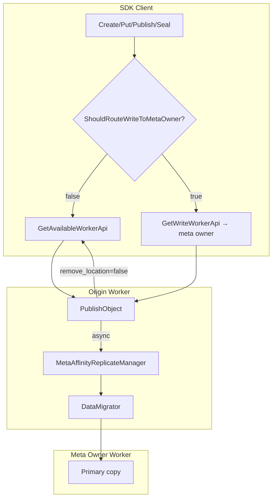
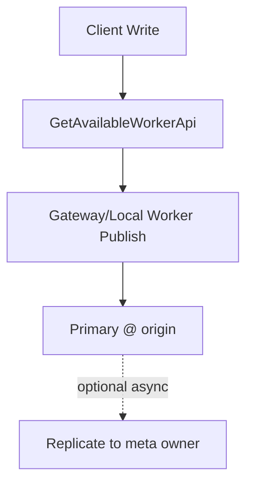
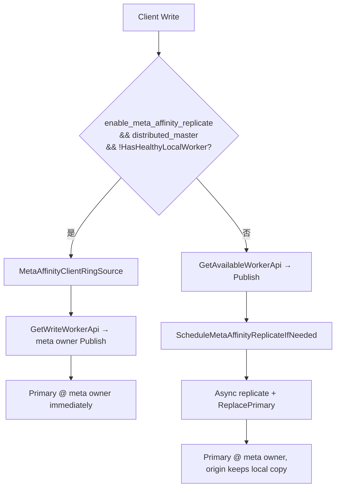
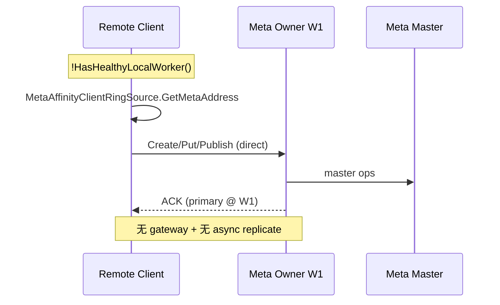
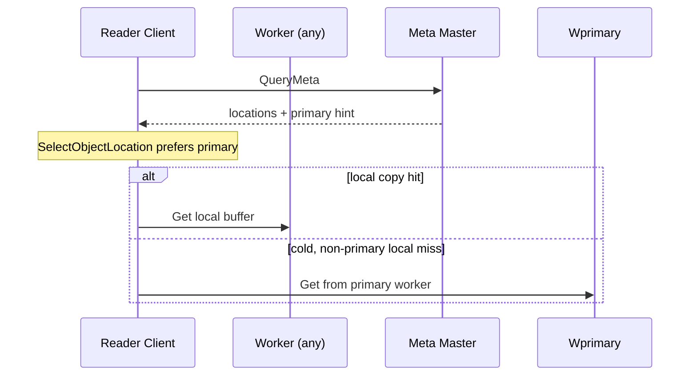

# Meta-Affinity Write — AS IS vs TO BE 时序

**Status:** Done (Phase 1)  
**Scope:** 同节点 async replicate + remote-only 直写 + Get primary 优先  
**MR:** [!1151](https://gitcode.com/openeuler/yuanrong-datasystem/merge_requests/1151)

---

## 0. 整体设计（TO-BE）



---

## 1. 写路径门控

### AS IS



### TO BE（Phase 1）



**变化点：**

- 跨节点写：跳过 gateway replicate 链，直写 meta owner
- 同节点写：Publish 后异步 replicate（不阻塞 ACK）
- `ReplacePrimary(remove_location=false)`：origin 保留 local copy

---

## 2. 同节点 Publish + Replicate

```mermaid
sequenceDiagram
    participant C as Client@W0
    participant W0 as Origin Worker W0
    participant M as Meta Master
    participant W1 as Meta Owner W1

    C->>W0: Publish(objectKey)
    W0->>M: RequestingToMaster
    W0-->>C: Publish ACK (primary @ W0)
    Note over W0: ScheduleMetaAffinityReplicateIfNeeded
    W0->>W1: DataMigrator.MigrateData
    W0->>M: ReplacePrimary(remove_location=false)
    Note over W0,W1: W0 保留 local copy; primary → W1
    C->>W0: Get (local hit)
    W0-->>C: serve local copy
    C->>W0: InvalidateBuffer
    C->>W0: Get (cold)
    W0->>W1: fetch from primary
    W1-->>C: data
```

---

## 3. Remote-only 直写 meta owner



---

## 4. Get 读侧（primary 优先）



---

## 5. 与 Direct Read 组合（Deferred ST）

| 场景 | 写 | 读 | 期望 |
|------|----|----|------|
| Remote-only | meta-affinity 直写 | direct read | primary colocate + 少 Get hop |
| 同节点 | async replicate | gateway/local | local copy + primary 切换 |

Phase 2 需补组合 ST（见 [issue-rfc.md](./issue-rfc.md)）。
