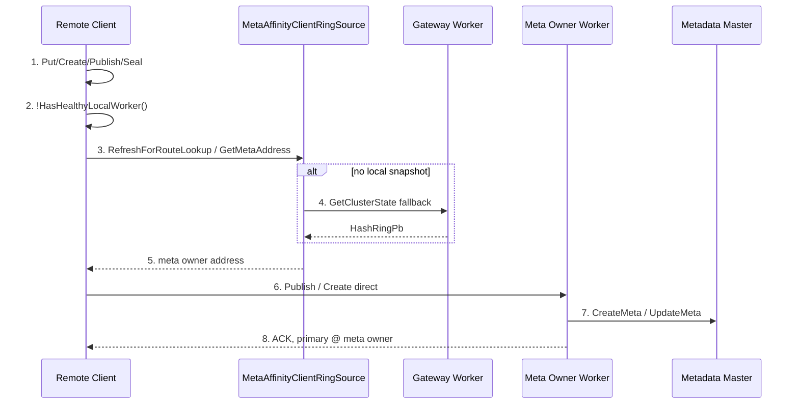
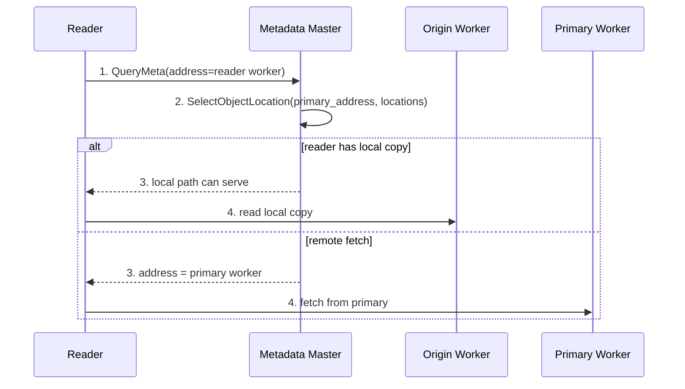
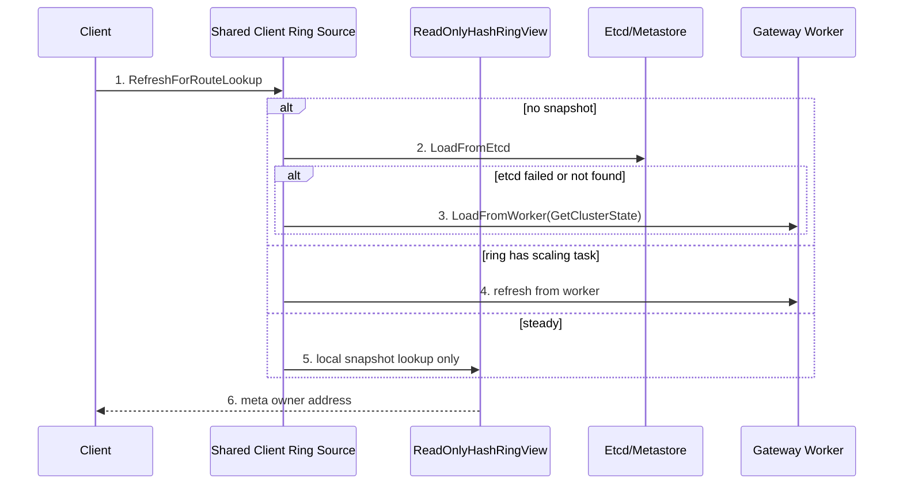
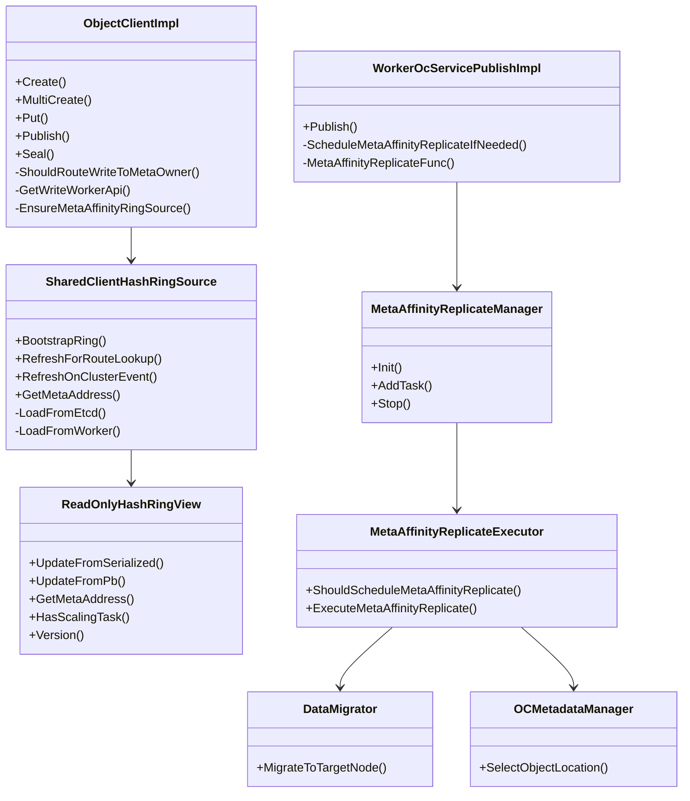

关联AR:

+ PR1151: Meta-Affinity Write
+ PR1119: Client Direct Read Flow
+ PR1153: Meta+Data RPC Merge
+ Codex session `019f1cc5-c4fc-76f1-b2b3-1afd8709d6b8`: Client hash ring routing 复用特性

# Story 整体设计

## 功能描述

+ Why: Object 的 metadata owner 由 hash ring 决定，但数据 primary copy 可能落在 client 当前连接的 origin/gateway worker。读侧需要先 QueryMeta，再从另一个 data owner 拉取数据；如果 primary 不在 meta owner 上，容易多一次 worker 间跳转。本特性通过 metadata-affinity write 让数据 primary 尽早与 metadata owner colocate，为后续 meta/data 合并和 direct read 减少一次 RPC hop。
+ Who: 使用 ObjectClient 写入并随后读取对象的业务、无本地 worker 的 remote-only client、同节点 local worker 写入后跨 worker 读的业务，以及需要验证元数据/数据亲和、迁移、路由和性能收益的测试人员。
+ When: `enable_meta_affinity_replicate=true` 时生效。client-worker 非亲和部署且 client 没有 healthy local worker 时，写请求直接路由到 object key 的 meta owner worker；client-worker 亲和或有 healthy local worker 时，仍先写本地 worker，随后 worker 异步把 binary object 数据迁移到 meta owner 并切换 primary。
+ Where: Client 侧 `ObjectClientImpl::GetWriteWorkerApi`、`MetaAffinityClientRingSource`、`ReadOnlyHashRingView`；Worker 侧 `WorkerOcServicePublishImpl`、`MetaAffinityReplicateManager`、`MetaAffinityReplicateExecutor`、`DataMigrator`；Master 侧 `OCMetadataManager::SelectObjectLocation`；配置侧 `enable_meta_affinity_replicate`、`enable_distributed_master`、`master_address`。
+ How: Client 写路径先通过 `ShouldRouteWriteToMetaOwner()` 判断本次写应该走 local/gateway worker 还是直写 meta owner。remote-only 场景复用关联特性的 hash ring snapshot/route 逻辑，按 object key 找 meta owner，并复用或创建 `ClientWorkerRemoteApi` 直写 meta owner。local worker 场景保持原 Publish ACK 语义，Worker Publish 成功后把 binary object 加入异步队列，后台通过 `DataMigrator::MigrateToTargetNode` 迁移到 meta owner，再调用 `ReplacePrimary(remove_location=false)` 切 primary，origin 保留 local copy。
+ What happen: 影响 ObjectClient `Create`、`MultiCreate`、`Put`、`Publish`、`Seal` 写 worker 选择，影响 worker binary Publish 成功后的后台复制和 master 读位置选择。不改变 SDK API 签名，不新增 protobuf 字段，不改变 flag 关闭时的现网路径。
+ Experience: remote-only 写入后 primary 立即在 meta owner，读者冷读可减少 gateway/replicate 后的额外 RPC；local worker 写入不阻塞 Publish ACK，后台完成 colocate，origin local copy 仍可本地命中。测试需要同时验证路径、primary、locations、Get fetch hint、性能 JSON 和失败/延迟场景。

### 术语说明

| 术语/简写 | 含义 | 本文使用说明 |
| ---- | ---- | ---- |
| metadata owner / meta owner | object key 经 hash ring 路由得到的元数据归属 worker/master | 也是本特性的目标 data primary worker |
| primary copy | `ObjectMetaPb.primary_address` 指向的主数据副本 | replicate 完成后应切到 meta owner |
| origin worker | client 当前写入的 worker，通常是 local worker 或 gateway worker | local worker 场景 Publish ACK 时 primary 先在 origin |
| remote-only client | client 所在节点没有 healthy local worker，只能连接远端 worker | 本特性在该场景下直写 meta owner |
| meta-affinity write | 让写入后的 primary copy 与 metadata owner colocate 的能力 | 包括 remote-only 直写和 local worker 异步 replicate |
| gateway replicate | remote-only 旧路径先写 gateway worker，再后台迁移到 meta owner | 本特性通过 client 直写 meta owner 跳过该链路 |
| 共享 hash ring 逻辑 | 关联特性中沉淀的 client hash ring snapshot、route lookup、refresh policy 和 version/stale guard | 本特性写路径不另造路由算法，测试按同一 object key 应路由到同一 meta owner 的口径验证 |

## 场景分析

### 场景 1: Client-worker 非亲和部署下 remote-only 直写 meta owner



编号含义：

+ 1-2: 写入口使用统一 `GetWriteWorkerApi(objectKey)`，只有 `enable_meta_affinity_replicate && enable_distributed_master && !HasHealthyLocalWorker()` 成立才直写。
+ 3-5: client 本地 ring source 先尝试 etcd/metastore bootstrap，失败时通过当前 gateway worker 的 `GetClusterState` 获取 ring。
+ 6-8: client 直接连接 meta owner worker，Put 返回时 primary 已经在 meta owner，不再依赖 gateway worker 异步 replicate。

测试关注：

+ 构造 remote-only client 时要通过 service discovery 设置不同 host id，确保 `HasHealthyLocalWorker()` 为 false。
+ object key 需要按 `ReadOnlyHashRingView` 命中目标 worker；ST 中 `GetClientRouteKeysForMetaOwner` 就是这个口径。
+ 验证 `primary_address`、`locations` 数量和读 payload，不只看 Put 返回成功。

### 场景 2: Client-worker 亲和部署下 local Publish + worker 异步 meta-affinity replicate

```mermaid
sequenceDiagram
    participant C as Client@W0
    participant W0 as Origin Worker W0
    participant Q as MetaAffinityReplicateManager
    participant W1 as Meta Owner W1
    participant M as Metadata Master
    C->>W0: 1. Create/Put/Publish/Seal
    W0->>M: 2. CreateMeta/UpdateMeta
    W0-->>C: 3. Publish ACK, primary @ W0
    W0->>Q: 4. enqueue binary object task
    Q->>W1: 5. DataMigrator.MigrateToTargetNode
    Q->>M: 6. ReplacePrimary(remove_location=false)
    M-->>Q: 7. success / expired / retryable moving
    Note over W0,W1: primary -> W1; W0 keeps local copy
```

编号含义：

+ 1-3: 有 healthy local worker 时不改变写入口，保证同节点 SHM/UB/local worker 快路径和 Publish ACK 语义。
+ 4: `WorkerOcServicePublishImpl::ScheduleMetaAffinityReplicateIfNeeded` 仅对 `DataFormat::BINARY` 调度。
+ 5: 后台队列按 object key hash 到 4 个队列，异步线程执行迁移，不阻塞写返回。
+ 6-7: `ReplacePrimary` 设置 `remove_location=false`，origin worker 保留 location；如果对象已过期，expired 也视为任务完成。

测试关注：

+ local worker 写返回后 primary 可能还在 origin，需要等待 replicate 完成再断言。
+ replicate 后 `GetObjMetaInfo.locations` 应包含 origin 和 meta owner 两个 worker uuid。
+ origin worker 本地有 copy 时 Get 仍可 local hit；Invalidate 本地 buffer 后下一次冷 Get 应按 primary 到 meta owner 拉取。

### 场景 3: 读侧多副本优先 primary



编号含义：

+ `OCMetadataManager::SelectObjectLocation` 新增 `primaryAddress` 参数。
+ 如果 primary location ACK 且没有 cache invalid / primary invalid 异步操作，则优先返回 primary。
+ 如果 primary 不可用，继续使用原有随机 location fallback。

测试关注：

+ QueryMeta 返回的 `address` 要优先指向 primary，而不是 origin local copy。
+ 本地 hit 与 remote fetch 是两类路径：测试需要通过 Invalidate 或冷读构造 remote fetch，否则只验证到 local copy。

### 场景 4: 复用关联特性的 hash ring 路由逻辑



测试关注：

+ `019f1cc5-c4fc-76f1-b2b3-1afd8709d6b8` 关联特性中的 hash ring 逻辑是本特性的路由基础；meta-affinity write 只消费 route result，不重新定义 hash、worker 状态过滤、版本比较或刷新策略。
+ 稳态写路由不能每次访问 etcd 或 worker cluster-state；只有 bootstrap、显式 route event、版本变化或 ring 中存在 unfinished `add_node_info`/`del_node_info` 时刷新。
+ `ReadOnlyHashRingView::UpdateFromPb` 的 version/stale guard、`HashRingSnapshotBuilder` 或等价 snapshot builder 的 worker 状态过滤，需要与 direct read 和 write route 共用同一语义。
+ Phase 1 代码中 `MetaAffinityClientRingSource` 仍是独立 wrapper；集成关联特性后，应收敛为 shared `ClientHashRingSource`/placement provider。测试用例名称和预期应以 shared ring 行为为准。

## 方案详细设计

### 现状分析

旧路径中，client 写入通常落在当前连接的 local/gateway worker，metadata owner 由 master/hash ring 决定，二者可能不一致。读者冷读需要先 QueryMeta，再按 location 拉数据；如果 selected location 不是 primary 或 primary 与 meta owner 不 colocate，容易产生额外 worker 间 RPC 和 data hop。

PR1151 的核心不是直接合并 Meta RPC 和 Data RPC；它是先让 metadata 与 data primary colocate，为 PR1153 的 meta/data RPC 合并和 PR1119 direct read 提供更稳定的数据布局前提。关联 Codex session `019f1cc5-c4fc-76f1-b2b3-1afd8709d6b8` 中的 client hash ring 路由能力会作为本特性的路由基础，PR1151 不应保留一套长期分叉的写路径 hash ring 计算。

风险点：

+ 写路径是 foreground hot path，remote-only 直写不能把频繁 ring 刷新放进每次 Put。
+ 写路径与读路径必须复用同一 hash ring snapshot 语义；否则同一个 object key 可能出现“写到 A、读查 B”的路由分歧。
+ local worker 异步 replicate 是后台路径，不能阻塞 Publish ACK，也不能无界放大迁移任务。
+ `remove_location=false` 会保留双 location，读侧必须优先 primary，否则 colocate 后仍可能读到非 primary。
+ 默认必须关闭，避免现网行为变化；开关打开也只有在明确的写入路由条件下改变路径。

### 方案设计

#### 1. 构建

新增或调整的构建单元：

+ `src/datasystem/client/object_cache/meta_affinity/*`: Phase 1 中的 `MetaAffinityClientRingSource`，client remote-only 写路由 ring source；集成关联 hash ring 特性后应降级为 wrapper 或被 shared client ring source 替换。
+ `src/datasystem/common/object_cache/read_only_hash_ring_view.{h,cpp}` / shared client placement route: client 侧只读 hash ring route view，必须由 meta-affinity write 与 direct read 共享。
+ `src/datasystem/worker/object_cache/meta_affinity_replicate_*`: worker 后台 replicate manager、executor、task param。
+ `src/datasystem/common/util/gflag/cluster_master_flags.cpp`: 将 `enable_distributed_master`、`master_address` 定义下沉到 common gflag，避免 client/common 链接 worker 目标。
+ `tests/ut/worker/object_cache/meta_affinity_replicate_test.cpp`: replicate 调度与队列 UT。
+ `tests/st/client/object_cache/meta_affinity_replicate_st_test.cpp`: colocate 与 remote-only 功能 ST。
+ `tests/st/client/object_cache/meta_affinity_write_perf_test.cpp`: manual 性能专项 ST。

#### 2. 部署

生产部署不新增进程。特性依赖：

+ `enable_meta_affinity_replicate=false` 为默认；打开后 Worker async replicate 和 Client remote-only 直写都受该开关控制。
+ `enable_distributed_master=true` 是 client 直写 meta owner 的前置条件；集中式 master 模式下 `ReadOnlyHashRingView` 退化为 `master_address`，但 `ShouldRouteWriteToMetaOwner` 不会进入 direct route。
+ worker 需要配置 etcd 或 metastore，hash ring 能完成初始化并返回 `HashRingPb`。
+ remote-only client 构造依赖 service discovery 和 `enableCrossNodeConnection=true`。

#### 3. 运行

运行期分为四层：

+ 写入路由判定层：`ObjectClientImpl::Create`、`MultiCreate`、`Put`、`Publish`、`Seal` 调用 `GetWriteWorkerApi`。不开关或有 healthy local worker 时走 `GetAvailableWorkerApi`；remote-only 且开关打开时走 meta owner。
+ Client route 层：复用关联特性的 shared client hash ring source。无 snapshot 时 bootstrap；版本变化、route event 或 snapshot 中有 unfinished scale task 时 refresh；稳态只读 `ReadOnlyHashRingView`/snapshot。
+ Worker async 层：`WorkerOcServicePublishImpl::PublishObject` 成功后调用 `ScheduleMetaAffinityReplicateIfNeeded`，仅 binary object 入队；`MetaAffinityReplicateManager` 4 队列异步执行。
+ Worker migration/master 层：executor 先通过 `ClusterManager::GetMetaAddress` 获取目标 meta owner，再 `DataMigrator` 迁移数据，最后 `ReplacePrimary(remove_location=false)` 切 primary。

#### 4. 元戎整体如何使用

+ 关闭 `enable_meta_affinity_replicate` 时，ObjectClient 写和读行为保持原路径。
+ 开启后，同节点业务仍可获得原本 local worker 写入体验；后台完成 colocate 后，跨节点或冷读更容易直达 primary。
+ remote-only 业务写入时，client 不再把对象先写到 gateway worker，而是直接写 meta owner；Put 返回时即可断言 primary 与 meta owner 一致。
+ 与 direct read 同时打开时，写侧布局和读侧直连可以组合降低 hop；二者必须通过同一 hash ring route source 计算 meta owner，组合 ST 需要验证写路由和读路由一致。

#### 5. 代码关键类图、运行视图、数据表设计



关键模块要点：

+ `ObjectClientImpl::GetWriteWorkerApi`: 写路径 worker 选择的唯一入口；remote-only 时缓存一个 meta owner worker api，meta owner 变化才重建。
+ Shared client hash ring source: ring bootstrap 优先 etcd/metastore，失败 fallback 到 gateway worker `GetClusterState`；与 direct-read route source 共享 refresh policy、version guard 和 worker 状态过滤。
+ `ReadOnlyHashRingView`: 使用 `MurmurHash3_32` 和 hash ring token map 计算 meta owner；`add_node_info` changed range 优先命中新 owner；`ACTIVE/LEAVING` workers 参与 token map。若关联特性引入 `HashRingSnapshotBuilder`，以 builder 输出的 snapshot 为准。
+ `MetaAffinityReplicateManager`: 4 个队列和 4 个线程；当前队列无显式容量上限，测试高压场景需要关注后台积压和 shutdown。
+ `ExecuteMetaAffinityReplicate`: 开关关闭直接 no-op；上下文不完整返回 `K_INVALID`；迁移失败或 `ReplacePrimary` 失败仅 warning，不影响已经返回的 Publish。
+ `OCMetadataManager::SelectObjectLocation`: 多副本时先尝试 primary，再 fallback 原随机选择；同时过滤 invalidating worker。

#### 6. 高性能设计 topic

+ remote-only 写路径的 ring lookup 必须使用共享本地 snapshot；稳态不允许每次 Put 都访问 etcd 或 `GetClusterState`。
+ 写路径 hash ring 计算不得与 direct read 分叉；测试要比较同一个 key 在 write route 与 read route 下得到的 meta owner 是否一致。
+ remote-only 直写 worker api 应复用；不能每个 object 都新建 RPC channel/stub。
+ local worker Publish ACK 不等待迁移完成；测试 primary ready latency 要单独统计，不应计入 Put latency。
+ 后台 replicate 使用 `DataMigrator`，会引入 worker-worker data transfer 和 master `ReplacePrimary`；高并发写下要观察队列积压、迁移失败 warning、primary ready p99。
+ 多副本读优先 primary 能减少冷读 remote fetch 的不确定性，但本地 copy hit 仍优先服务，测试要明确是 local hit 还是 cold fetch。

### 开源软件选型

不新增开源软件。复用项目已有 protobuf/gflags、EtcdStore、RpcStubCacheMgr、HashRing、DataMigrator、WorkerMasterOCApi、Status、inject point、ST fixture 和 perf JSON 输出机制。

### 外部交互分析&&上下游依赖需求

+ Client -> Etcd/Metastore: 通过关联 hash ring source 读取或刷新 serialized `HashRingPb`/snapshot，用于 ring bootstrap。
+ Client -> Gateway Worker: fallback 调用 `WorkerWorkerOCService::GetClusterState` 获取 `HashRingPb` 和版本信息。
+ Client -> Meta Owner Worker: remote-only 直接发 Create/Put/Publish/Seal 对应 worker RPC。
+ Origin Worker -> Meta Owner Worker: `DataMigrator::MigrateToTargetNode` 迁移 binary object 数据。
+ Origin Worker -> Master: `ReplacePrimary(remove_location=false)` 切 primary 并保留 origin location。
+ Reader -> Master: QueryMeta 中 `SelectObjectLocation` 优先返回 primary fetch hint。

## 对外接口

客户最外层接口结论：本特性不改变 ObjectClient / C API / Java API / Python API 的函数签名，也不要求业务代码新增参数。客户仍调用既有 `Create`、`Put`、`Publish`、`Seal`、`Get` 等接口；变化发生在开关开启后的内部 worker 选择、后台 replicate 和读侧 location 选择。测试需要重点感知新增启动配置和行为变化，而不是寻找 SDK 形态变化。

### Proto/RPC 接口

+ 不新增 protobuf 字段或 RPC。
+ 复用已有 `GetClusterStateReqPb/GetClusterStateRspPb` 和 `WorkerWorkerOCService::GetClusterState`。
+ 复用已有 master `ReplacePrimaryReqPb.remove_location=false` 语义。

### C++ 接口

+ Client 内部新增 `ObjectClientImpl::GetWriteWorkerApi(const std::string &, std::shared_ptr<IClientWorkerApi> &, std::unique_ptr<Raii> &)`.
+ Client 内部新增 `ObjectClientImpl::ShouldRouteWriteToMetaOwner()`、`HasHealthyLocalWorker()`、`EnsureMetaAffinityRingSource()`。
+ Phase 1 新增 `MetaAffinityClientRingSource::BootstrapRing()`、`RefreshForRouteLookup()`、`GetMetaAddress()`；集成关联特性后应复用 shared `ClientHashRingSource`/placement provider 的等价接口。
+ 复用 `ReadOnlyHashRingView::UpdateFromSerialized()`、`UpdateFromPb()`、`GetMetaAddress()`、`HasScalingTask()`、`Version()` 或关联特性提供的等价 snapshot view。
+ Worker 内部新增 `MetaAffinityReplicateManager::Init/AddTask/Stop`。
+ Worker 内部新增 `ShouldScheduleMetaAffinityReplicate()`、`ExecuteMetaAffinityReplicate()`。
+ Master 内部 `OCMetadataManager::SelectObjectLocation` 增加 `primaryAddress` 参数。

### 配置接口

| 参数 | 变更类型 | 默认值 | 客户/测试感知 | 含义 | 测试怎么配 |
| ---- | ---- | ---- | ---- | ---- | ---- |
| `enable_meta_affinity_replicate` | 新增产品 gflag | `false` | 客户和测试都可感知；默认关闭，开启后行为变化 | meta-affinity write 总开关；控制 Worker async replicate 和 Client remote-only 直写 | 功能/性能验证设为 `true`；baseline 设为 `false` |
| `enable_distributed_master` | 已有产品 gflag | `true` | 客户已有配置；本特性依赖其为 true | 分布式 master/hash ring 路由开关；client 直写前置条件 | meta-affinity 路由验证固定为 `true` |
| `master_address` | 已有产品 gflag，定义位置调整 | 空字符串 | 客户语义不变；构建/链接层可感知 | 集中式 master 地址；本 PR 将定义移动到 common gflag，避免 worker/client 重复定义 | 不作为分布式路由验证主路径 |

## 约束

+ 范围约束: PR1151 Phase 1 不做 SDK API 变更，不做 meta/data RPC 合并，不做同节点 client 直写 meta owner，不做 direct-read ring source 统一。
+ 数据格式约束: 当前 `ScheduleMetaAffinityReplicateIfNeeded` 仅对 `DataFormat::BINARY` 调度，非 binary Publish 不在本轮覆盖。
+ 写入口约束: remote-only direct route 仅在 `enable_meta_affinity_replicate && enable_distributed_master && !HasHealthyLocalWorker()` 时触发。
+ 路由复用约束: meta-affinity write 复用关联特性的 hash ring 逻辑；不接受写路径单独维护一套 hash、scale range、worker 状态过滤或版本比较算法。
+ MultiCreate 约束: 当前 `MultiCreate` 用 `objectKeyList.front()` 选择写 worker；测试多 key 分散 meta owner 时需关注是否属于本轮支持范围。
+ 异步语义约束: local worker 场景 Publish ACK 不代表 primary 已到 meta owner；需要等待或轮询 `QueryMeta`。
+ 失败语义约束: 后台 replicate 失败不回滚已成功 Publish；当前主要通过 warning/log 和后续 primary/location 状态感知。
+ 队列约束: `MetaAffinityReplicateManager` 队列当前无容量上限；压力测试需要观察内存和 primary ready 延迟。
+ Ring 约束: `ReadOnlyHashRingView` 稳态只读 snapshot；有 unfinished scale task 才刷新。Scale 后写路由 ST 是 deferred。

## Example

### 启动配置示例

```bash
# worker/client 所在进程
-enable_distributed_master=true \
-enable_meta_affinity_replicate=true
```

### Remote-only client 构造示例

```cpp
ServiceDiscoveryOptions sdOpts;
sdOpts.etcdAddress = clusterEtcdAddress;
sdOpts.hostIdEnvName = "meta_affinity_remote_client_env_w0";
sdOpts.affinityPolicy = ServiceAffinityPolicy::PREFERRED_SAME_NODE;

ConnectOptions connectOptions;
connectOptions.host = gatewayWorkerAddr.Host();
connectOptions.port = gatewayWorkerAddr.Port();
connectOptions.connectTimeoutMs = 60000;
connectOptions.enableCrossNodeConnection = true;
connectOptions.serviceDiscovery = serviceDiscovery;
connectOptions.accessKey = accessKey;
connectOptions.secretKey = secretKey;

auto client = std::make_shared<ObjectClient>(connectOptions);
DS_ASSERT_OK(client->Init());
```

### 功能验证命令示例

```bash
# UT: 调度条件、flag、队列执行
ctest --test-dir <build> -R 'MetaAffinityReplicateTest' -j20 --output-on-failure

# ST: colocate + remote-only direct write
ctest --test-dir <build> -R 'MetaAffinityReplicateStTest' -j1 --output-on-failure
```

### 性能专项环境变量（仅测试用例）

以下 `DS_META_AFFINITY_WRITE_PERF_*` 都是 `tests/st/client/object_cache/meta_affinity_write_perf_test.cpp` 里的手工性能 ST 环境变量，用于选择/放大/断言测试场景；不是产品源代码运行配置，也不会被 worker/client 生产路径读取。生产或功能路径只看上文“配置接口”里的 gflag，例如 `enable_meta_affinity_replicate`、`enable_distributed_master`。

| 环境变量 | 默认值 | 含义 | 怎么配置 |
| ---- | ---- | ---- | ---- |
| `DS_META_AFFINITY_WRITE_PERF` | off | 打开 manual perf ST | 性能专项设为 `1` |
| `DS_META_AFFINITY_WRITE_PERF_RPC` | off | 打开 4KB Get RPC reduction 门禁模式 | Get RPC 收益专项设为 `1` |
| `DS_META_AFFINITY_WRITE_PERF_ASSERT` | off | 打开自动阈值断言 | 门禁验收设为 `1` |
| `DS_META_AFFINITY_WRITE_PERF_MODE` | `all` | 选择场景 | `local` / `remote` / `all` |
| `DS_META_AFFINITY_WRITE_PERF_OP` | `all` | 选择操作 | `put` / `get` / `all` |
| `DS_META_AFFINITY_WRITE_PERF_SIZE` | RPC 模式 `4096`，普通模式 `262144` | payload bytes | 小对象 RPC hop 验证建议 4KB |
| `DS_META_AFFINITY_WRITE_PERF_WARMUP` | RPC 模式 `15`，普通模式 `20` | warmup 次数 | 正式验证可提高 |
| `DS_META_AFFINITY_WRITE_PERF_ITERS` | RPC 模式 `60`，普通模式 `200` | 统计次数 | 正式验证可提高 |

### 性能验证命令示例

```bash
# 4KB Get RPC reduction，同节点
DS_META_AFFINITY_WRITE_PERF=1 \
DS_META_AFFINITY_WRITE_PERF_RPC=1 \
DS_META_AFFINITY_WRITE_PERF_ASSERT=1 \
DS_META_AFFINITY_WRITE_PERF_MODE=local \
ctest --test-dir <build> -R 'MetaAffinityWritePerfTest.GetRpcReductionSameNodeBenchmark' -j1 --output-on-failure

# 4KB Get RPC reduction，remote-only/cross-node
DS_META_AFFINITY_WRITE_PERF=1 \
DS_META_AFFINITY_WRITE_PERF_RPC=1 \
DS_META_AFFINITY_WRITE_PERF_ASSERT=1 \
DS_META_AFFINITY_WRITE_PERF_MODE=remote \
ctest --test-dir <build> -R 'MetaAffinityWritePerfTest.GetRpcReductionCrossNodeBenchmark' -j1 --output-on-failure
```

ST 输出：

+ `META_AFFINITY_WRITE_PERF_JSON=...`: 分 scenario 的 put/get/primary_ready avg、p99、p99.99。
+ `META_AFFINITY_GET_RPC_REDUCTION_JSON=...`: 汇总同节点和跨节点 Get RPC reduction。

### 性能 case 对比验证口径

性能 case 不是单纯跑开启/关闭开关，而是在同一个 2-worker 分布式 master ST fixture 中构造不同数据布局，确保同 payload、同 warmup、同 iters、同 key 路由口径下对比 Get hop 差异。

| 用例 | baseline 怎么构造 | 优化后怎么构造 | 对比指标 | 判定 |
| ---- | ---- | ---- | ---- | ---- |
| `GetRpcReductionSameNodeBenchmark` | client0 写 meta owner=worker1 的 key，经 local worker0 Publish，等待 async replicate 到 worker1；随后 Invalidate worker0 本地 copy，制造 cross-worker cold Get | client0 写 meta owner=worker0 的 key，metadata/data/reader colocate，Put 后立即 Get | `same_node_colocated_immediate_get_avg_us` vs `same_node_cross_worker_cold_get_avg_us` | colocated immediate Get 更低，`improvement_pct > 15%` |
| `GetRpcReductionCrossNodeBenchmark` | gateway writer 写 meta owner=worker1 的 key，等待 async replicate；client0/remote reader 冷读，形成 gateway replicate 后读路径 | remote-only client 使用 shared hash ring route 直写 worker1；client0/remote reader 对 direct write 后对象冷读或立即读 | `cross_node_direct_cold_get_avg_us` vs `cross_node_gateway_cold_get_avg_us`，以及 remote immediate Get | direct cold Get 更低，`improvement_pct > 15%`；remote immediate Get 低于 gateway cold Get |
| `SameNodePutLatencyBenchmark` | same-node cross-worker replicate：Put 返回时 primary 仍在 origin，后台 primary ready 另计 | same-node local meta colocated：Put 返回后无需跨 worker primary 切换 | `put_avg_us`、`primary_ready_avg_us`、`primary_immediate_at_put_return_count` | Put latency 不把 async replicate 算进去；cross-worker immediate count 应为 0 |
| `CrossNodePutLatencyBenchmark` | remote-only legacy/gateway replicate：关闭测试内 flag 或构造 gateway path，primary 需要后台迁移才 ready | remote-only direct meta owner：Put 直接发到 meta owner | `primary_immediate_at_put_return_count`、`primary_ready_avg_us` | direct case immediate count = iters；gateway replicate immediate count = 0 |

关键验证步骤：

+ 先用 fixture 生成命中指定 meta owner 的 keys，避免随机 hash 导致路径混杂。
+ 写入后通过 `QueryMeta`/`WaitUntilPrimaryOnWorker` 确认 primary 是否到 meta owner；Put benchmark 单独统计 primary ready，不把后台迁移混进 Put RPC。
+ Get benchmark 对 baseline 会主动 Invalidate 或使用 cold keys，避免本地缓存命中掩盖跨 worker RPC hop。
+ 从 `META_AFFINITY_GET_RPC_REDUCTION_JSON` 汇总 avg 和 improvement；从 `META_AFFINITY_WRITE_PERF_JSON` 核对每个 scenario 的 count、payload、warmup、iters、p99/p99.99。

预期收益：

+ 功能目标: remote-only Put 返回时 primary 已在 meta owner；local worker 写入后后台最终把 primary 切到 meta owner，origin 保留 local copy。
+ 性能目标: 4KB Get RPC 门禁中，同节点 colocated Put+Get 相对 cross-worker cold Get improvement > 15%；跨节点 direct remote write 后 W0 reader cold Get 相对 gateway replicate cold Get improvement > 15%。
+ 已有摸测: 2026-06-29 tiantiyun 上，同节点约 70% Get 延迟下降，跨节点 W0 reader 约 68% Get 延迟下降。

# 可信软件

### 安全性 Security

+ 不新增外部 API，不新增鉴权绕过路径；remote-only 直写仍使用 `ClientWorkerRemoteApi`、AK/SK signature、tenant 信息和现有 worker RPC 认证。
+ 新增 ring bootstrap 从 etcd/metastore 或 worker 获取拓扑，不包含用户 payload。

### 韧性 Resilience

+ ring bootstrap 优先 etcd/metastore，失败 fallback gateway worker `GetClusterState`。
+ local worker async replicate 失败不影响已成功写入；对象仍至少保留 origin primary。
+ `ReplacePrimary` 最多重试 3 次；meta moving 未完成时重试，expired object 视为完成。

### 隐私性 Privacy

不引入个人信息收集、存储、披露变化。日志中包含 object key、worker address 和状态码，测试环境需按现有日志规范避免敏感 object key。

### 可靠性 Reliability

+ `remove_location=false` 保留 origin location，降低迁移后 local copy 丢失风险。
+ `SelectObjectLocation` primary 优先前先检查 ACK 和 invalidating 状态，避免返回正在失效的副本。
+ `ReadOnlyHashRingView` 使用 shared mutex 保护 ring snapshot 和派生 token map。

### 可用性 Availability

+ 默认开关关闭，保留现网路径。
+ 开关打开后，有 healthy local worker 时仍走 local worker 写入，不牺牲本地 fast path。
+ remote-only direct route 失败会返回写失败；测试需覆盖无 ring、worker unavailable、meta owner unavailable 等异常。

### 安全 Safety

该特性不涉及人身安全或物理设备控制。失败模式限定为对象写入失败、后台 primary 未切换或后续冷读多 hop，不会引入不可接受的人身或环境风险。

# 自验 用例

| 测试大类 | 测试场景 | 用例目的(名称) | 用例执行步骤 | 预期 |
| ---- | ---- | -------- | ------ | --- |
| 功能正确性 | 调度条件: meta owner 不同 | `MetaAffinityReplicateTest.ShouldScheduleWhenMetaOwnerDiffers` | 打开 `enable_meta_affinity_replicate`；local addr 与 meta owner addr 不同 | 返回 true，可调度 replicate |
| 功能正确性 | 调度条件: meta owner 相同 | `MetaAffinityReplicateTest.ShouldNotScheduleWhenSameNode` | 打开 flag；local addr 等于 meta owner addr | 返回 false，不做无意义迁移 |
| 功能正确性 | 调度条件: flag 关闭 | `MetaAffinityReplicateTest.ShouldNotScheduleWhenFlagDisabled` | 关闭 `enable_meta_affinity_replicate`；地址不同 | 返回 false，保持现网行为 |
| 功能正确性 | 异步队列执行 | `MetaAffinityReplicateTest.ManagerExecutesQueuedTask` | 初始化 manager，AddTask，等待执行回调 | 任务被执行一次；Stop 后线程退出 |
| 功能正确性 | 同节点写后 colocate | `MetaAffinityReplicateStTest.ColocatePrimaryWithMetaOwnerAndReadLocalCopy` | client0 写 key 到 meta owner worker1；等待 primary=worker1；QueryMeta/GetObjMetaInfo/Get | primary 切到 worker1；QueryMeta address 优先 worker1；locations 包含 worker0/worker1；payload 正确 |
| 功能正确性 | origin local copy 保留 | 同上 | replicate 后 client0 直接 Get，再 InvalidateBuffer 后再次 Get | 第一次可本地读；Invalidate 后从 primary worker1 拉取且 payload 一致 |
| 功能正确性 | remote-only 直写 | `MetaAffinityReplicateStTest.RemoteOnlyClientPutDirectlyOnMetaOwner` | 构造无 local worker client；key 按 client ring 命中 worker1；Put | Put 返回后 primary 立即是 worker1；locations 只有 worker1；Get payload 正确 |
| 功能正确性 | 有 local worker 不直写 | Same-node write path sanity | client0 与 worker0 同节点，打开 flag，写 meta owner=worker1 的 key | Put/Create 返回时 primary 可先在 worker0；需要后台 replicate 后才到 worker1，证明没有同节点 client direct write |
| 功能正确性 | 非 binary 不调度 | NonBinaryPublishNoReplicate | 构造非 `DataFormat::BINARY` publish 或通过单测直接传 state | 不入队，不触发 DataMigrator；现有写语义不变 |
| 功能正确性 | MultiCreate 路由边界 | MultiCreateFirstKeyRoute | MultiCreate 多 key，first key 与其他 key meta owner 不同 | 记录当前行为使用 first key 选择 worker；如业务要求多 owner 拆分，作为 Phase 2/bug 跟踪 |
| 控制面/路由 | ring bootstrap from etcd | MetaAffinityClientRingSourceBootstrapEtcd | etcd 中有 `ETCD_RING_PREFIX`；client EnsureMetaAffinityRingSource | 加载成功；GetMetaAddress 与 worker hash ring 一致 |
| 控制面/路由 | ring bootstrap fallback worker | MetaAffinityClientRingSourceBootstrapWorkerFallback | 注入 etcd get 失败或无 ring；gateway worker `GetClusterState` 可用 | fallback 成功；后续写可路由 |
| 控制面/路由 | snapshot 稳态无刷新 | StableRouteLookupNoRefreshStorm | 预加载 ring，无 scale task；连续 Put 不同 key | `LoadFromEtcd/GetClusterState` 调用不随 Put 次数线性增长 |
| 控制面/路由 | 读写路由一致 | SharedHashRingRouteParity | 使用同一批 object keys，分别通过 write route 和 direct-read/shared route 计算 meta owner | 每个 key 的 meta owner 完全一致；scale range 和 worker uuid/address 映射一致 |
| 控制面/路由 | ring version 复用 | SharedHashRingVersionGuard | 先加载高版本 snapshot，再返回旧版本或 `-1` worker snapshot | 不覆盖已有可用 snapshot；写路由与读路由 stale 行为一致 |
| 控制面/路由 | scale task 刷新 | RefreshWhenHasScalingTask | ring snapshot 中存在 unfinished `add_node_info` 或 `del_node_info` | `RefreshForRouteLookup` 从 worker refresh；路由按 changed range 处理 |
| 控制面/路由 | centralized master guard | DistributedMasterDisabledNoDirectWrite | `enable_distributed_master=false` 且 flag true | `ShouldRouteWriteToMetaOwner` 为 false；写路径走 legacy |
| 扩缩容/可靠性 | ReplacePrimary retry | ReplacePrimaryMetaMovingRetry | 注入 ReplacePrimary 返回 meta moving，随后成功 | 最多重试 3 次；成功后 primary 切换 |
| 扩缩容/可靠性 | ReplacePrimary expired | ReplacePrimaryExpiredIsOk | 对象写入后过期或删除，再执行 replicate | expired ids 被视为完成，不反复失败 |
| 扩缩容/可靠性 | migrate 失败 | MetaAffinityReplicateMigrateFailure | 注入 `MetaAffinityReplicate.Migrate.skip` 或目标 worker 不可用 | Publish 已成功；replicate warning；primary 保持 origin；后续读仍可用但不享受 colocate |
| 扩缩容/可靠性 | 后台队列压力 | ReplicateQueueBacklogUnderBurst | 同节点高并发写 meta owner 不同的 binary objects | 无 crash；队列可逐步清空；primary ready p99 可观测；内存不异常增长 |
| 扩缩容/可靠性 | shutdown | ReplicateManagerStop | worker shutdown 或 manager 析构时仍有空/非空队列 | `Stop` 可 join 线程；不出现悬挂线程 |
| 读侧行为 | primary 优先 | QueryMetaSelectsPrimary | 构造 locations 包含 origin 和 primary，sourceWorker 非 primary | QueryMeta `address` 返回 primary |
| 读侧行为 | primary invalid fallback | QueryMetaPrimaryInvalidFallback | primary 存在 `CACHE_INVALID` 或 `PRIMARY_COPY_INVALID` 异步操作 | 不返回 invalid primary，fallback 到可用 ACK location 或空 |
| 性能收益 | same-node Put latency | `MetaAffinityWritePerfTest.SameNodePutLatencyBenchmark` | `DS_META_AFFINITY_WRITE_PERF=1 DS_META_AFFINITY_WRITE_PERF_MODE=local DS_META_AFFINITY_WRITE_PERF_OP=put` | 输出 `same_node_local_meta_colocated`、`same_node_cross_worker_replicate` JSON；cross-worker Put 返回不等待 primary ready |
| 性能收益 | same-node Get latency | `MetaAffinityWritePerfTest.SameNodeGetLatencyBenchmark` | `DS_META_AFFINITY_WRITE_PERF=1 DS_META_AFFINITY_WRITE_PERF_MODE=local DS_META_AFFINITY_WRITE_PERF_OP=get` | 输出 direct remote write 后冷读与 local replicate 后冷读数据 |
| 性能收益 | cross-node Put latency | `MetaAffinityWritePerfTest.CrossNodePutLatencyBenchmark` | `DS_META_AFFINITY_WRITE_PERF=1 DS_META_AFFINITY_WRITE_PERF_MODE=remote DS_META_AFFINITY_WRITE_PERF_OP=put` | `cross_node_remote_direct_meta_owner` Put 返回时 primary immediate count=iters；gateway replicate immediate count=0 |
| 性能收益 | cross-node Get latency | `MetaAffinityWritePerfTest.CrossNodeGetLatencyBenchmark` | `DS_META_AFFINITY_WRITE_PERF=1 DS_META_AFFINITY_WRITE_PERF_MODE=remote DS_META_AFFINITY_WRITE_PERF_OP=get` | 输出 direct write vs gateway replicate 后 Get avg/p99/p99.99 |
| 性能收益 | same-node RPC reduction | `MetaAffinityWritePerfTest.GetRpcReductionSameNodeBenchmark` | `DS_META_AFFINITY_WRITE_PERF=1 DS_META_AFFINITY_WRITE_PERF_RPC=1 DS_META_AFFINITY_WRITE_PERF_ASSERT=1` | colocated immediate Get < cross-worker cold Get；improvement > 15% |
| 性能收益 | cross-node RPC reduction | `MetaAffinityWritePerfTest.GetRpcReductionCrossNodeBenchmark` | 同上，`DS_META_AFFINITY_WRITE_PERF_MODE=remote` | direct cold Get < gateway cold Get；improvement > 15%；remote immediate Get < gateway cold Get |
| 兼容性 | flag 默认关闭 | DefaultFlagLegacyBehavior | 不配置 `enable_meta_affinity_replicate` 跑原 object cache 写读 ST | 不发生 remote-only direct write，不发生 meta-affinity replicate |
| 兼容性 | SDK API 无变化 | Header/API compatibility | 对比 public headers 或编译现有 client examples | 无 public C++/C/JNI/Python API 签名变化 |
| 构建/集成 | CMake gflag 去重 | Embedded ST / build | 编译 worker/client/common gflag，跑 embedded 初始化相关测试 | `master_address`、`enable_distributed_master` 无重复定义 |
| 构建/集成 | Bazel deps | Bazel `meta_affinity_*` targets | 构建 `meta_affinity_replicate_test`、`meta_affinity_replicate_st_test`、`meta_affinity_write_perf_test` | deps 完整，不依赖不存在的 `etcd_cluster_manager_header` |
