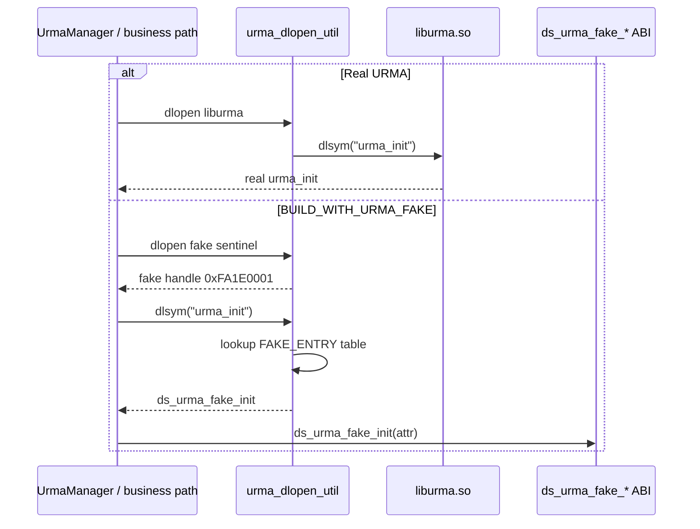
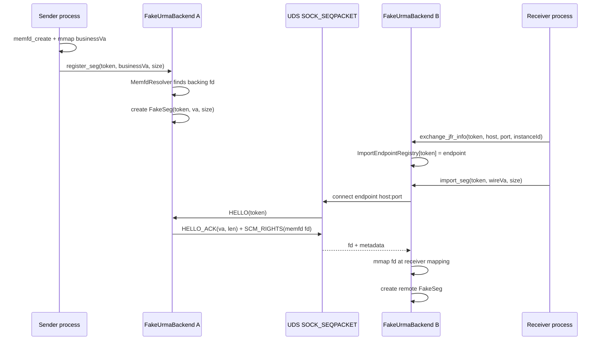
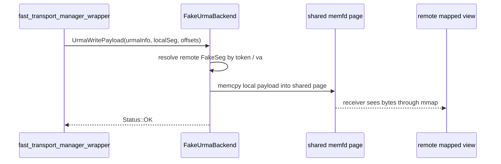
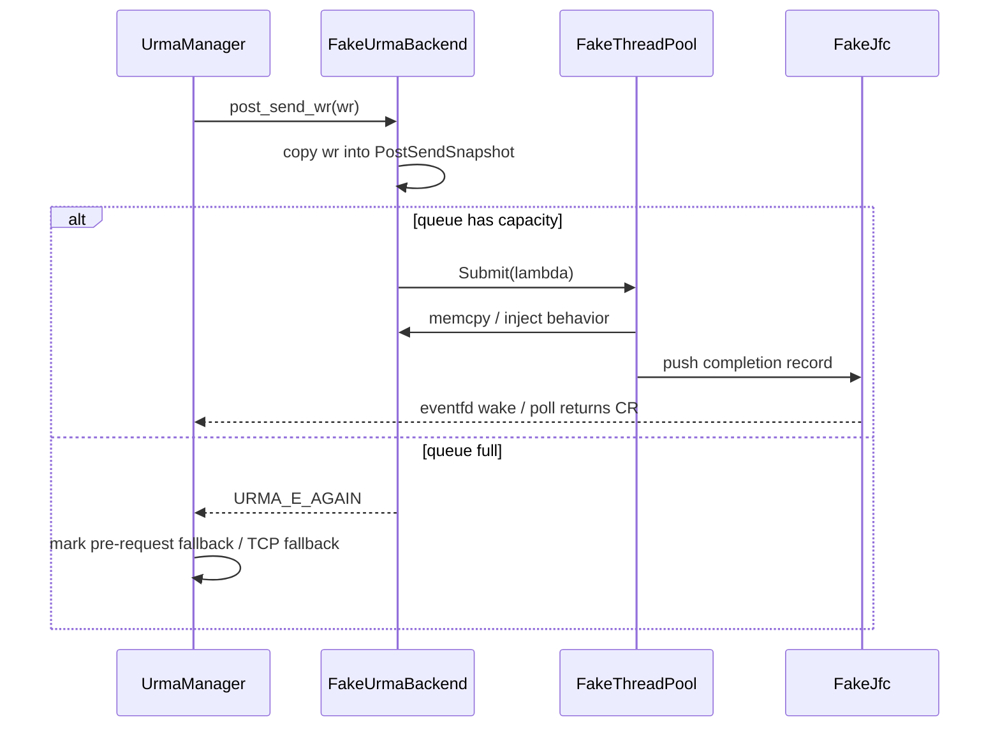
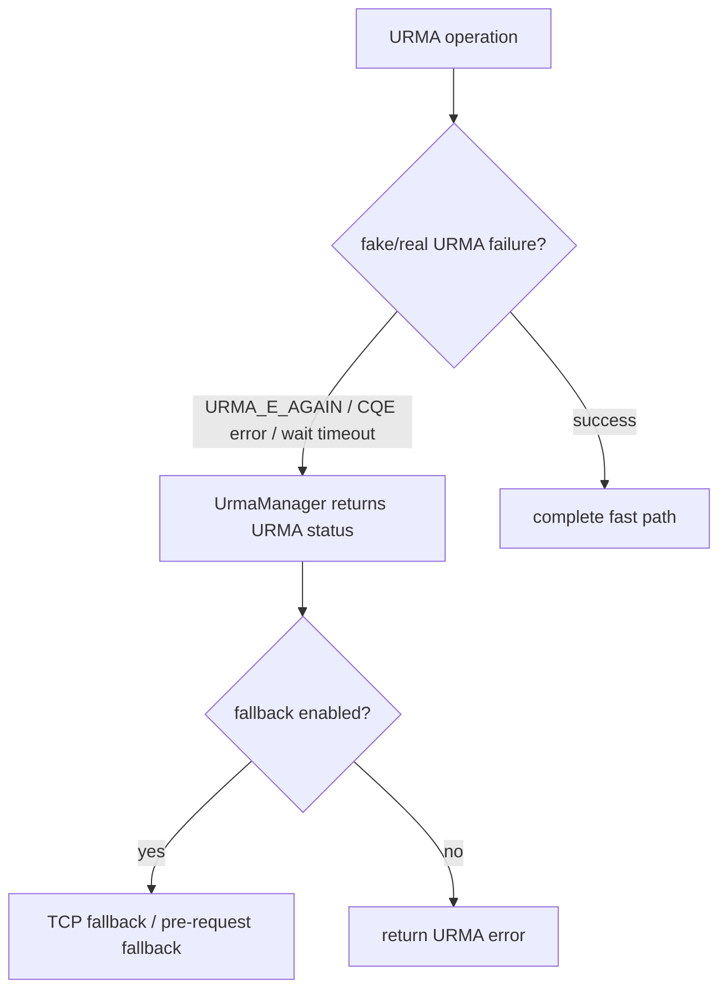
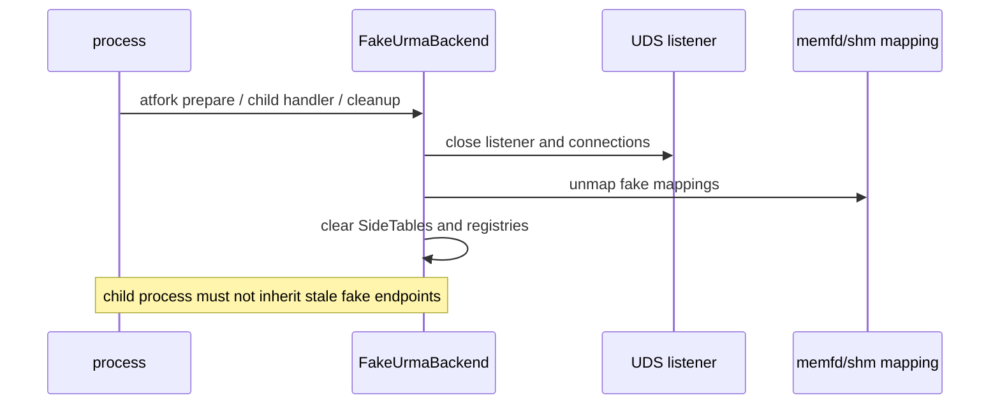

# URMA Fake Backend - As-Is / To-Be Sequences

**Status**: Draft  
**Related**: [design.md](./design.md)

---

## 1. dlopen Dispatch

关键点：业务仍按 URMA SDK API 调用，fake 替换的是 dispatch 结果。

## 2. Register / Import Segment

To-Be 约束：已注册 endpoint 的 import 必须真实走 UDS，失败即失败，不回退成本地 shm 假成功。

## 3. UrmaWritePayload Fast Path

fake 模式下 payload 不通过 UDS 传输。UDS 只用于 import 阶段交换 fd。

## 4. PostSendWr Async Path

`PostSendSnapshot` 深拷贝 WR 字段，caller 可在返回后释放原始 WR。

## 5. Fallback Is Business Semantics

fake 的职责是稳定制造 URMA failure 信号；是否 fallback、如何限流、错误码如何暴露属于 Object/KV 业务语义。

## 6. Cleanup / Fork

