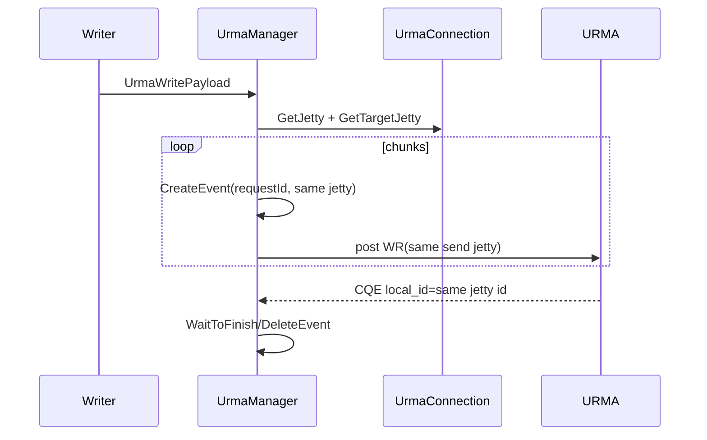
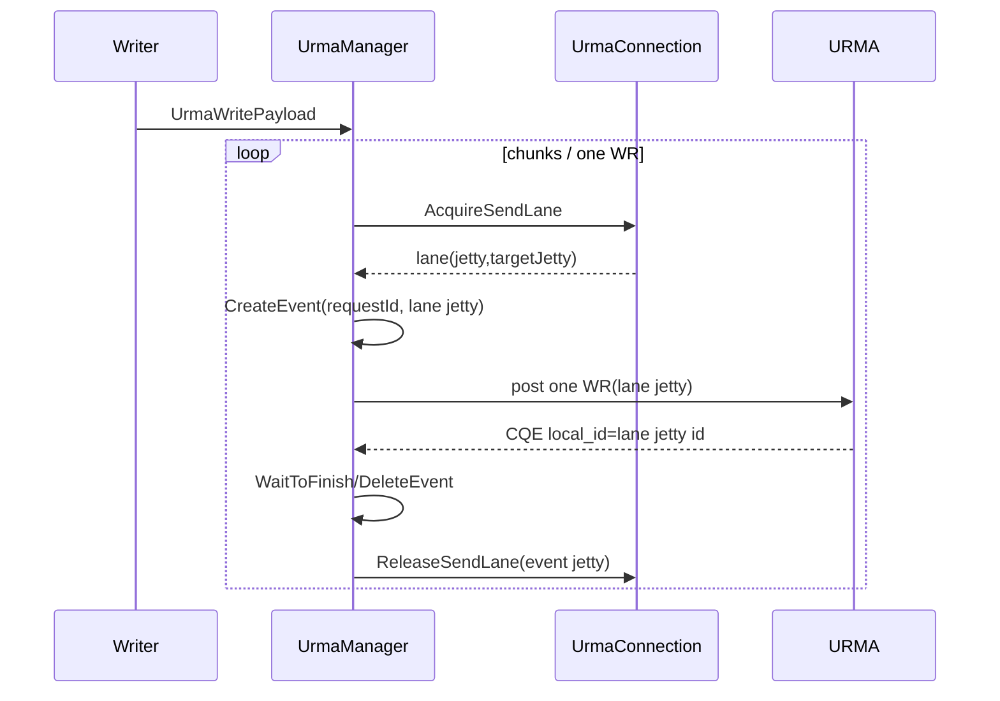
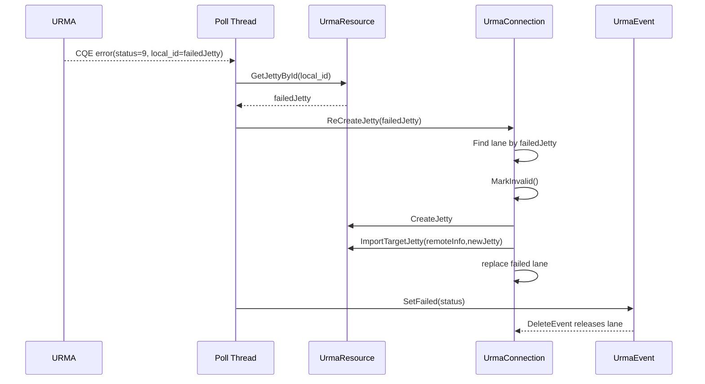
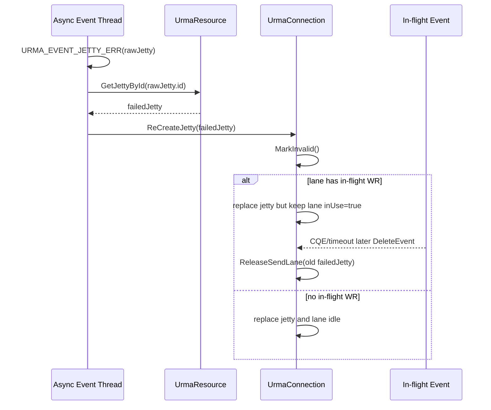
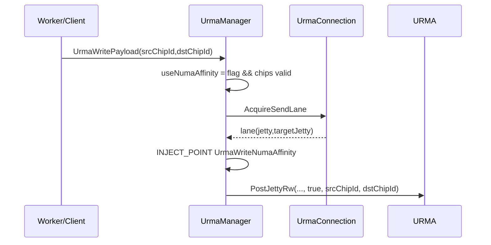
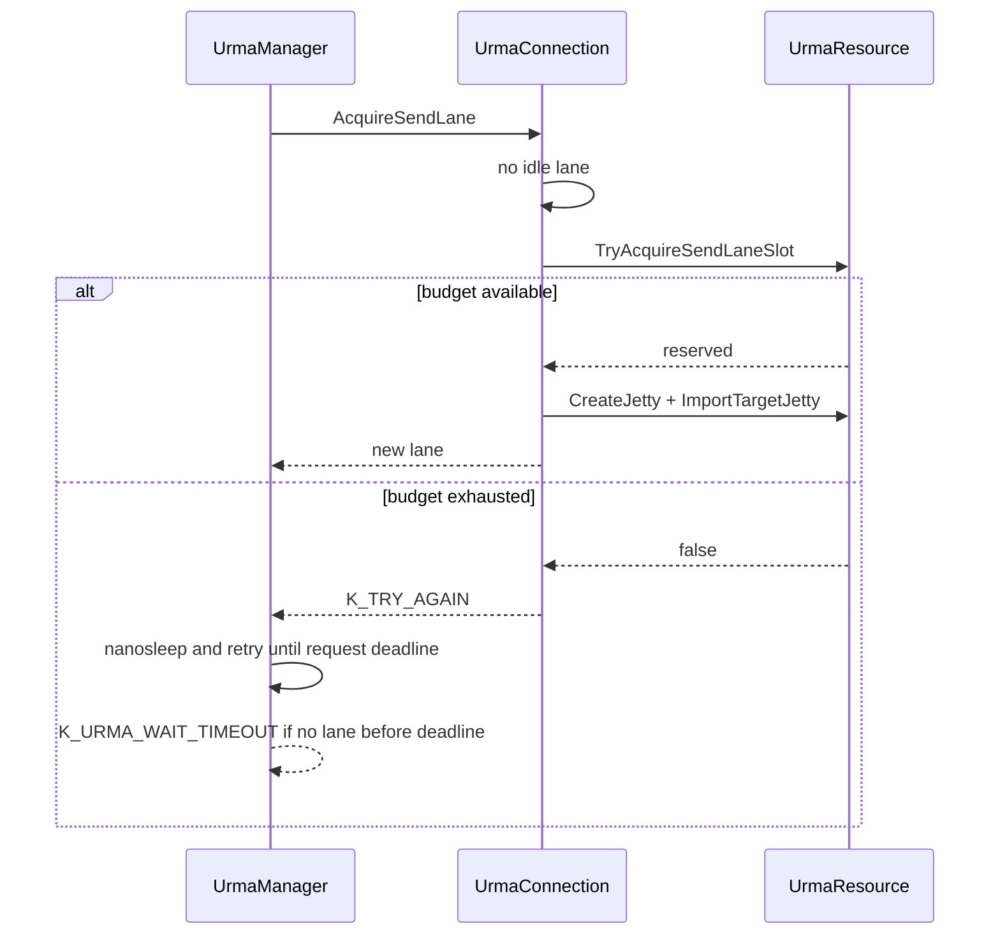

# URMA Send Jetty Lane Isolation — AS IS vs TO BE

**Status**: Draft

## 1. 普通写路径

### AS IS

### TO BE

## 2. CQE jetty failure

## 3. AE jetty failure

## 4. NUMA affinity 普通路径

## 5. 无空闲 lane

