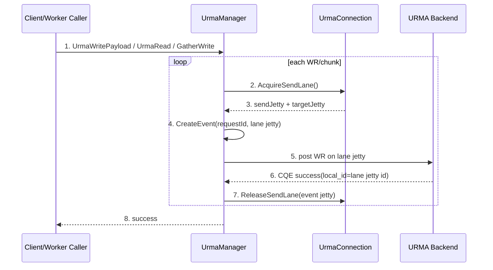
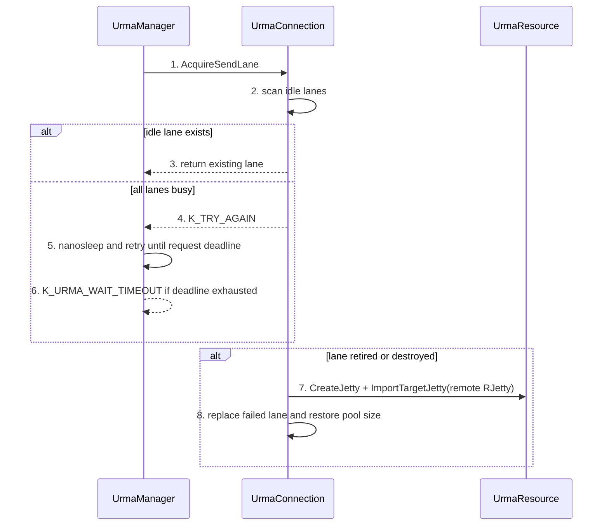
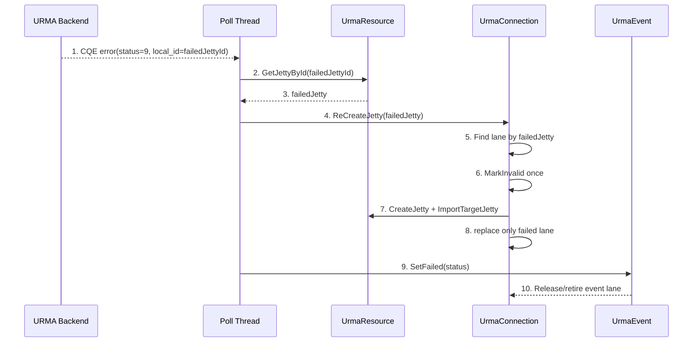
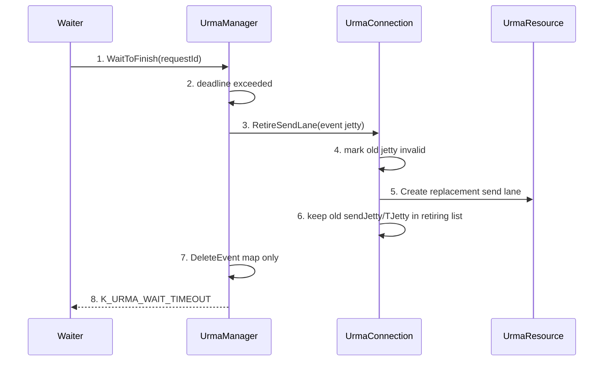
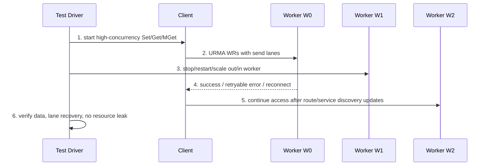
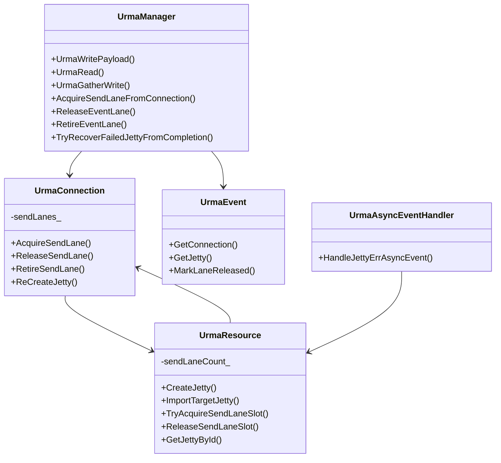

关联AR:

+ PR1192: URMA Send Jetty Lane Isolation / Jetty 复用

# Story 整体设计

## 功能描述

+ Why: URMA 原连接模型中，一个 `UrmaConnection` 主要复用一组 send Jetty / target Jetty。当同一个 send Jetty 上存在多个 in-flight WR 时，单个 Jetty/CTP 故障、CQE error 或 timeout 可能影响同 Jetty 内其它 WR。该特性把发送侧拆成可池化复用的 send lane，让每个 WR 独占一个 send Jetty lane，降低单个 Jetty 故障的影响面，并为 meta/data colocate、client/worker 直接写远端节点等大并发 URMA 访问场景提供资源隔离。
+ Who: 使用 KV/ObjectClient 触发 UB/URMA 远端写和远端读的业务、worker-to-worker 迁移/remote get 场景、client-to-worker UB Set/Get 场景，以及需要验证 Jetty 资源、故障恢复、扩缩容和大并发稳定性的测试人员。
+ When: `enable_rdma=true` 且本次数据传输走 URMA/UB 时生效。普通 TCP 路径、URMA 未启用路径不受影响。每次 URMA Write/Read/GatherWrite/Pipeline H2D 发送一个 WR 前都会 acquire send lane，completion/error/timeout 后 release 或 retire。
+ Where: Common RDMA 层 `UrmaManager`、`UrmaConnection`、`UrmaResource`、`UrmaEvent`、`UrmaAsyncEventHandler`；调用侧覆盖 client-to-worker、worker-to-client、worker-to-worker 远端数据传输路径；测试侧覆盖 fake URMA UT、Object/KV URMA ST。
+ How: 接收端只创建并复用一个接收 Jetty/RJetty 信息，不做 lane 化，也不按 WR 扩展接收端 Jetty。发送端在握手/连接建立时 import 对端 RJetty 得到 target Jetty/TJetty。发送端维护固定总容量的 send lane pool，每个 lane 是一组 `(send Jetty, target Jetty, inUse/retiring state)`。每个 WR acquire 一个空闲 lane；无空闲 lane 时等待到请求 deadline，超时返回错误；lane 因故障或 timeout 被销毁/retire 后，需要重新创建 replacement lane，把池容量补齐。
+ What happen: 新增公共 gflag `urma_send_jetty_lane_pool_size` 控制发送端 Jetty lane pool 总容量；SDK 进程和 Worker 进程作为 URMA sender 时都使用同一个配置项。SDK 对外接口、protobuf 对外语义、接收端单 RJetty 复用模型不变。故障恢复从 connection 单 Jetty 重建收敛为 failed lane 重建并补齐池容量。
+ Experience: 大并发 URMA 访问时，不再把多个 WR 堆到同一个 send Jetty；单 lane 故障只影响该 lane 上的当前 WR，其它 lane 上的 WR 可以继续完成。测试需要从“传输成功”提升到“lane 独占、资源上限、故障隔离、timeout 安全、扩缩容期间持续访问”的可观测验证。

### 术语说明

| 术语/简写 | 含义 | 本文使用说明 |
| ---- | ---- | ---- |
| WR | Work Request，提交给 URMA Jetty 的一次 read/write 请求 | 本特性要求每个 in-flight WR 独占一个 send lane |
| RJetty / 接收 Jetty | 目的端创建并暴露给对端 import 的 remote Jetty 信息 | 接收端复用单 RJetty，不做接收端 lane 化，不按 WR 扩展 |
| TJetty / target Jetty | 发送端 import 对端 RJetty 后得到的 target Jetty 句柄 | 每个 send lane 持有自己的 TJetty |
| send lane | 发送端 `(send Jetty, TJetty)` 组合及其状态 | 一个 lane 同一时间只服务一个 in-flight WR |
| send lane pool | 发送端固定容量的 send lane 集合 | 由 `urma_send_jetty_lane_pool_size` 控制总容量；lane 销毁/retire 后需要重建补齐 |
| retiring lane | 已 timeout 或故障替换、但旧 WR 可能仍在硬件/后端收口中的旧 lane 资源 | 旧 send Jetty/TJetty 必须保留到 completion/timeout 收口，不能提前析构 |

## 场景分析

### 场景 1: 正常大并发 URMA 写，每个 WR 独占一个 send lane



生命周期编号：

+ 1: 上层发起 URMA 数据传输，可能是 client-to-worker Set、worker-to-client Get、worker-to-worker remote get/迁移。
+ 2-3: 每个 WR 在发送前从 connection acquire 一个 lane；lane 必须 idle、valid 且有可用 TJetty。
+ 4: `UrmaEvent` 记录 request id、connection、send Jetty、remote address、data size 和 operation type，作为 completion/error/timeout 后释放 lane 的依据。
+ 5-6: URMA completion 中的 `local_id` 应能对应本次 WR 使用的 local send Jetty id。
+ 7: 正常 completion 后释放 event 对应 lane，后续 WR 可以复用同一 Jetty。
+ 8: 上层看到的接口行为不变。

测试关注：

+ 高并发下同一时刻 in-flight WR 不复用同一个 send Jetty。
+ completion 后 lane 可以复用，Jetty id 可再次被后续 WR 使用。
+ `urma_inflight_wr_count`、URMA access log、注入点或 fake backend 能辅助判断 lane acquire/release 未泄漏。

### 场景 2: 固定 lane pool acquire、等待与补齐



测试关注：

+ `urma_send_jetty_lane_pool_size=N` 表示发送端 lane pool 总容量为 N；并发 WR 数超过 N 时应出现等待或超时，而不是临时突破容量。
+ 正常 completion 只 release lane，不销毁 lane；后续 WR 应复用已有 lane。
+ lane 因 CQE/AE/timeout 被 retire 或销毁后，应创建 replacement lane 补齐池容量；测试需要确认补齐后的新 Jetty id 与旧 failed Jetty id 不同。
+ 无空闲 lane 返回路径应是可诊断的 `K_TRY_AGAIN` 内部等待，最终按请求 deadline 返回 `K_URMA_WAIT_TIMEOUT`，不能无限等待。

### 场景 3: CQE error 只恢复 failed lane



测试关注：

+ CQE `local_id` 必须是 local send Jetty id，能定位到 failed lane。
+ 只有 failed lane 被 invalid/recreate，其它 lane 仍 valid，正在执行的其它 WR 不应被整体 connection 重建牵连。
+ 同一个 failed Jetty 多次 CQE/AE 通知应通过 `MarkInvalid()` 幂等处理，只触发一次有效重建。

### 场景 4: wait timeout 不释放 still in-flight lane



测试关注：

+ timeout 不等价于硬件 WR 完成，不能直接 release 旧 lane 给新 WR 使用。
+ retiring list 能保存多个连续 timeout 的旧 send Jetty/TJetty，不能覆盖更早 still in-flight 的资源。
+ 后续迟到 completion 找不到 event 时应被安全丢弃或清理，不能访问已析构 targetJetty。

### 场景 5: 扩缩容/worker 故障期间持续 URMA 访问



测试关注：

+ 扩容、缩容、worker kill/restart 与大并发访问叠加时，数据正确性优先：Set 成功的数据 Get 必须一致，失败要有明确错误码。
+ URMA lane 故障恢复不应阻塞后续 TCP fallback、heartbeat reconnect、service discovery 切换。
+ 需要观察 worker 日志中 `[URMA_SEND_LANE]`、`[URMA_RECREATE_JETTY]`、`[URMA_SEND_LANE_RETIRE]`、`[URMA_MODIFY_JETTY_TO_ERROR]` 等关键日志，确认恢复路径符合预期。

## 方案详细设计

### 现状分析

PR1192 之前，`UrmaConnection` 更接近单 send Jetty 模型：连接建立时创建 local send Jetty，import 对端 RJetty 得到 TJetty，后续多个 URMA WR 可能复用同一个 send Jetty/TJetty。该模型实现简单，但在大并发和故障场景下存在几个测试风险：

+ 同一 send Jetty 上多个 in-flight WR 难以做到故障隔离，一个 CQE status 9 或 AE JETTY_ERR 可能影响同 Jetty 上其它请求。
+ wait timeout 时，如果直接释放 lane，仍在硬件/后端执行的 WR 可能继续引用旧 TJetty，造成资源生命周期风险。
+ 真实部署中 Jetty 是有限资源，需要一个配置控制发送端 lane 池总容量，测试必须覆盖池容量、补齐和 backpressure。
+ 接收端实际只需要一个接收 Jetty/RJetty 信息用于被发送端 import；需求明确不要求接收端 lane 化，只要求接收端 Jetty 可复用。

PR1192 的方向是最小化改造：connection/handshake/segment cache 边界保持不变，只把发送侧 `(send Jetty, targetJetty)` lane 化。

### 方案设计

#### 1. 构建

主要代码变更单元：

+ `src/datasystem/common/rdma/urma_resource.{h,cpp}`: `UrmaConnection` 内部从单 Jetty 改为 `sendLanes_`，新增 `AcquireSendLane`、`ReleaseSendLane`、`RetireSendLane`、lane 级 `ReCreateJetty`；`UrmaResource` 新增 `ImportTargetJetty`、`TryAcquireSendLaneSlot`、`ReleaseSendLaneSlot`。
+ `src/datasystem/common/rdma/urma_manager.{h,cpp}`: 发送 WR 前统一 `AcquireSendLaneFromConnection`；`UrmaWriteImpl`、`UrmaRead`、`UrmaGatherWrite`、pipeline H2D 按 WR acquire lane；completion/error/timeout 通过 `UrmaEvent` 释放或 retire lane。
+ `src/datasystem/common/rdma/urma_async_event_handler.{h,cpp}`: AE JETTY_ERR 根据 Jetty id 从 `UrmaResource` registry 找 failed Jetty，再按 owning connection 恢复 failed lane。
+ `src/datasystem/common/util/gflag/common_gflag_define.cpp` / `common_gflags.h`: 新增 `urma_send_jetty_lane_pool_size`。
+ `src/datasystem/common/urma_fake/*`: fake URMA completion `local_id` 贯通 local send Jetty id，支持 CQE lane 定位和本地 UT。
+ `tests/ut/client/urma_send_lane_test.cpp`: lane acquire/reuse、池容量耗尽、failed lane recreate、timeout retire replacement UT。
+ `tests/st/client/object_cache/urma_object_client_test.cpp`、`tests/st/client/kv_cache/kv_client_urma_failover_test.cpp`: Object/KV URMA 普通路径、故障、reconnect、fallback 回归。

#### 2. 部署

生产部署不新增进程，不改变 SDK API。特性依赖：

+ `enable_rdma=true` 或已有 UB/URMA 启用配置：只有实际走 URMA 的传输受影响。
+ `urma_send_jetty_lane_pool_size=200` 默认提供发送端 Jetty lane pool 总容量。该 gflag 位于 common gflags，SDK 进程和 Worker 进程都需要配置；哪个进程发起 URMA WR，哪个进程就按本进程的该配置限制 send lane pool。
+ SDK 侧配置影响 client-to-worker UB Set/Put、worker-to-client UB Get pre-request 等由 SDK 进程作为 sender 的路径；Worker 侧配置影响 worker-to-client Get payload、worker-to-worker remote get/迁移等由 Worker 进程作为 sender 的路径。
+ 接收端不需要新增 lane pool 配置。接收端创建并复用一个接收 Jetty/RJetty，多个发送端或多条发送 lane 都通过 import 该 RJetty 得到各自的 TJetty。
+ fake URMA 验证需要构建时开启 `BUILD_WITH_URMA_FAKE=ON` 或对应 Bazel/CMake 选项；真实 URMA 上线前建议补充长稳压测。

#### 3. 运行

运行期分为五层：

+ 连接/握手层：连接仍以 remote address 或 connection client id 为 key。接收端复用并暴露单 RJetty/JFR 信息，发送端 import 后得到 TJetty，并构造发送端 send lane。
+ lane acquire 层：`AcquireSendLane` 先找 idle+valid lane；全部 lane busy 时返回 `K_TRY_AGAIN` 让 `UrmaManager` 按请求 deadline 等待。只有 lane 初始化或 failed/retired lane 补齐时才创建新 send Jetty，并用该 send Jetty import 对端 RJetty 得到对应 TJetty。
+ event 绑定层：`CreateEvent` 保存本次 WR 使用的 connection 和 send Jetty。正常 completion、post 失败、pipeline hook、wait timeout 都必须通过 event 找回 lane。
+ completion/error 层：成功 CQE 释放 lane；CQE error 根据 `local_id` 找 failed Jetty，恢复 failed lane，并把当前 request 标记失败。
+ timeout/retire 层：wait timeout 通过 `RetireSendLane` 替换 lane，旧 send Jetty/TJetty 进入 retiring list；event map 只删除 request，不提前释放 still in-flight lane。

#### 4. 元戎整体如何使用

+ 业务无需修改 Object/KV SDK 调用方式，但 SDK 启动参数或 client config 需要能传入 `urma_send_jetty_lane_pool_size`；Worker 启动参数也需要配置同名 gflag。
+ 正常小并发场景下，lane 可被反复 acquire/release，行为接近旧路径。
+ 大并发场景下，最多同时使用 `urma_send_jetty_lane_pool_size` 个 send lane；全部 lane busy 时形成 backpressure。
+ 故障场景下，CQE/AE/timeout 只处理事件对应 lane，目标是缩小影响面，而不是提升所有错误的成功率。当前失败的 WR 仍可能返回 `K_URMA_ERROR` 或 `K_URMA_WAIT_TIMEOUT`，后续 WR 可使用恢复后的 lane 继续访问。
+ 与扩缩容、worker failover、TCP fallback 组合时，该特性只负责 URMA lane 生命周期；上层路由、服务发现和 fallback 策略保持原语义。

#### 5. 代码关键类图、运行视图、数据表设计



关键结构：

+ `SendLane`: 持有当前 active `send Jetty`、`targetJetty`、`inUse` 状态和 `retiringLanes`。
+ `RetiringSendLane`: 保存已被替换但仍可能被旧 WR 引用的 old send Jetty/TJetty，以及旧 WR completion 时是否释放 active lane 的标记。
+ `sendLaneCount_`: `UrmaResource` 进程级 send lane 计数，用于约束 lane pool 总容量。`Clear` 或 connection 清理时必须释放。
+ `UrmaEvent::laneReleased_`: 原子幂等标记，避免 completion、timeout、DeleteEvent 多入口重复 release/retire 同一 lane。

#### 6. 高性能设计 topic

+ 每个 WR 独占 send lane，使单 Jetty queue depth 控制为 1，减少同 Jetty 多 WR 故障耦合。
+ lane 是池内复用资源，不是每个 WR 都新建 Jetty；completion 后 lane 立即归还。
+ 全部 lane busy 时 `AcquireSendLaneFromConnection` 采用短 sleep 重试并受请求 deadline 控制，避免 busy spin 和无限等待。
+ `UrmaGatherWrite` 不能在一个 Jetty 上提交长 WR 链表；需要按 dst chunk 建 event 并处理 partial post 清理。
+ NUMA affinity 的 `srcChipId/dstChipId` 参数传递不应被 lane 选择改变，测试需覆盖 affinity inject count。

### 开源软件选型

不新增开源软件。复用项目已有 gflags、Status、Raii、TBB map、URMA API、fake URMA backend、gtest/ST harness。

### 外部交互分析&&上下游依赖需求

+ SDK API: 不新增、不删除、不改变 Object/KV 对外 API。
+ Protobuf: 本特性不要求新增外部协议字段；已有 `UrmaRemoteAddrPb.client_id` 可用于区分同 worker address 下多个 client-mode URMA connection identity。
+ gflags: 新增公共 `--urma_send_jetty_lane_pool_size`，默认 `200`，含义为本进程作为 URMA sender 时的 Jetty lane pool 总容量。SDK 和 Worker 使用同一个 gflag 名称，但各自读取本进程配置。
+ 日志/观测:
+ `[URMA_SEND_LANE] Created send lane jettyId=...`
+ `[URMA_RECREATE_JETTY] ... lane switched to newJettyId=...`
+ `[URMA_SEND_LANE_RETIRE] Retired timed-out Jetty ...`
+ `[URMA_MODIFY_JETTY_TO_ERROR] Mark Jetty ... invalid`
+ `[URMA_POLL_JFC] ... local_id/jetty id ...`

## 接口与配置变化

### 配置变化

| 配置项 | 类型 | 默认值 | 作用范围 | 测试关注 |
| ---- | ---- | ---- | ---- | ---- |
| `urma_send_jetty_lane_pool_size` | uint32 gflag | `200` | SDK 进程、Worker 进程 | 控制本进程作为 URMA sender 时的 Jetty lane pool 总容量；设为 1、小值和默认值分别验证 backpressure、复用、补齐和并发能力 |

说明：

+ 当前语义是发送端 lane pool 总容量，而不是“额外 lazy lane 上限”。
+ SDK 和 Worker 都使用同名 gflag。测试部署时需要同时检查 SDK/client 配置文件与 worker gflag 参数，避免只改 Worker 导致 client-to-worker 方向未生效，或只改 SDK 导致 worker-to-client/worker-to-worker 方向未生效。
+ 测试按“总 send Jetty lane 数”断言时，应把 active lane 与 retiring lane 区分开：active lane 数应维持配置容量；retiring lane 是等待旧 WR 收口的临时旧资源。
+ lane 正常 completion 只 release；只有 failed/timeout/retire 场景才替换 lane，并在替换后补齐 active pool。

### 接口变化

| 层级 | 变化 | 对测试的影响 |
| ---- | ---- | ---- |
| SDK 对外 API | 无变化 | 原 Object/KV 用例无需修改调用方式 |
| 内部 RDMA API | `UrmaConnection` 新增 lane acquire/release/retire；`UrmaResource` 下沉 `ImportTargetJetty` | UT 可直接验证 lane 语义；ST 通过日志/注入点间接验证 |
| 接收端 Jetty | 复用单个接收 RJetty/JFR 信息，不 lane 化 | 接收端 Jetty 数不应随并发 WR 或发送端 lane 数增长 |
| 发送端 Jetty | lane 池化，每个 lane 一组 send Jetty/TJetty | 发送端 Jetty 数随并发增长到配置容量上限，completion 后复用 |

## 测试 Story

### Story 1: 正常运行

目标：验证打开 URMA 后普通 Object/KV Set/Get、Put/Get、MGet、remote get/write 语义不变。

建议用例：

| Case | 配置 | 操作 | 预期 |
| ---- | ---- | ---- | ---- |
| SDK sender Set/Put | SDK 和 Worker 均配置默认 lane pool | client0 Set/Put 到 worker | 数据写入成功；SDK 侧 sender lane 日志/计数符合配置 |
| Worker sender Get | SDK 和 Worker 均配置默认 lane pool | client1 从远端 worker Get | Get 成功；Worker 侧 sender lane 日志/计数符合配置 |
| MGet 批量 | 默认 lane pool | 多 key 批量 Get，覆盖 payload_info 成功路径 | 混合成功/失败不误判 all failed |
| NUMA affinity | `enable_ub_numa_affinity=true` | worker-to-worker URMA write | `UrmaWriteNumaAffinity` 注入计数达到预期，数据正确 |

### Story 2: lane 池化与资源上限

目标：让测试明确感知新增 gflag 对资源和并发的影响。

建议用例：

| Case | 配置 | 操作 | 预期 |
| ---- | ---- | ---- | ---- |
| lane 复用 | `urma_send_jetty_lane_pool_size=1` | 串行多次 URMA WR | 同一 lane completion 后可复用；Jetty id 保持稳定 |
| 多 lane 并发 | `urma_send_jetty_lane_pool_size=2` | 两个并发 in-flight WR | 两个 WR 使用不同 Jetty id；均成功后 lane 回到 idle |
| 池容量耗尽 | `urma_send_jetty_lane_pool_size=2` | 三个并发 in-flight WR，并阻塞 completion | 第三个 acquire 内部 `K_TRY_AGAIN`，最终按 deadline 返回 `K_URMA_WAIT_TIMEOUT` 或在前两个完成后成功 |
| failed lane 补齐 | 小 lane pool | 注入 CQE/AE/timeout 让一个 lane retire | active pool 创建 replacement lane 补齐容量；new Jetty id 不等于 failed Jetty id |
| 连接清理释放容量 | 小 lane pool | 创建连接并压满 lane pool，断开/清理后重建连接 | 新连接仍可创建完整 lane pool，无 send lane slot 泄漏 |

### Story 3: CQE/AE 故障隔离

目标：验证单个 Jetty 故障只影响 failed lane。

建议用例：

| Case | 注入 | 操作 | 预期 |
| ---- | ---- | ---- | ---- |
| CQE status 9 | `UrmaManager.CheckCompletionRecordStatus` 注入 status 9 | 并发 Get/MGet | 当前 failed WR 返回可诊断错误；其它 lane 上请求成功；日志出现 lane recreate |
| AE JETTY_ERR | fake/真实 async event 注入 `URMA_EVENT_JETTY_ERR` | 有 in-flight WR 时触发 AE | failed lane 重建；old targetJetty 保留到旧 WR 收口；无崩溃 |
| AE + CQE 双触发 | 同一 Jetty 先 AE 后 CQE 或反向 | 并发访问 | `MarkInvalid` 幂等，只一次有效恢复；后续访问成功 |
| post WR 失败 | `UrmaManager.UrmaWriteError` 或 post error | Set/Get | event 被释放并删除；lane 不泄漏 |

### Story 4: timeout 与 retiring list

目标：验证 timeout 不错误复用 still in-flight lane。

建议用例：

| Case | 配置/注入 | 操作 | 预期 |
| ---- | ---- | ---- | ---- |
| 单次 timeout retire | 小 timeout，阻塞 completion | 发起 URMA WR 等待超时 | 返回 `K_URMA_WAIT_TIMEOUT`；旧 Jetty invalid；替换 lane 可服务后续 WR |
| 连续 timeout | 连续阻塞多个 WR completion | 同一 connection 多次 timeout | retiring list 保留多个 old send Jetty/TJetty；后续 WR 不复用旧 Jetty id |
| 迟到 completion | timeout 后再释放 fake completion | 旧 event 已删除 | 不访问已释放 targetJetty；无崩溃、无 double release |

### Story 5: 扩缩容和 worker 故障

目标：覆盖拓扑变化下 lane 生命周期与上层路由/重连的组合。

建议用例：

| Case | 操作 | 预期 |
| ---- | ---- | ---- |
| worker restart | 大并发 Set/Get 期间 kill 并重启 data worker | 已成功写入的数据最终可读；失败请求错误码明确；后续新请求恢复 |
| scale out | 大并发 MSet/MGet 期间新增 worker | 数据正确；URMA lane 不泄漏；无长时间 acquire timeout 风暴 |
| scale in | 大并发访问期间缩容/停止 worker | 上层迁移/服务发现按原语义处理；URMA 故障恢复不导致进程崩溃 |
| heartbeat reconnect | client heartbeat 超时后重连 worker | UB Set/Get smoke 成功；旧 connection lane 清理，新 connection 可创建 lane |

### Story 6: 大并发数据访问

目标：验证特性效果，不只验证功能成功。

建议压测维度：

+ key 数：单 key 热点、多 key 均匀、MGet batch。
+ payload：小对象、接近 fallback 限制的对象、大对象分 chunk。
+ 并发：小于 lane pool、等于 lane pool、超过 lane pool。
+ 拓扑：client-to-worker 重点验证 SDK 侧 gflag；worker-to-client、worker-to-worker 重点验证 Worker 侧 gflag。
+ 故障叠加：并发访问中插入 CQE error、AE JETTY_ERR、worker restart。

验收观察：

+ 成功率、P99/P999 时延、`urma_inflight_wr_count`、`URMA_WAIT_LATENCY`、`URMA_JETTY_RECREATE_LATENCY`。
+ 日志中 active lane 创建数不超过配置容量；completion 后 lane 能复用；failed/retired lane 会被 replacement 补齐。
+ 池容量耗尽时错误收敛为 deadline/backpressure，不出现死等或进程崩溃。
+ 故障后稳定阶段恢复到可持续成功访问。

## 验收标准

+ 功能: Object/KV URMA 普通路径、remote get/write、batch get、fallback/reconnect 用例通过。
+ 配置: SDK 和 Worker 的 `urma_send_jetty_lane_pool_size` 默认值、1、小值、默认值均有覆盖；测试能解释固定总容量和故障销毁/retire 后补齐语义。
+ 正确性: 每个 in-flight WR 独占 send lane；completion 释放；timeout retire；CQE/AE 只恢复 failed lane。
+ 故障: CQE status 9、AE JETTY_ERR、post 失败、wait timeout、worker restart 均不会造成 lane 泄漏或进程崩溃。
+ 扩缩容: scale out/in 与大并发访问叠加时，已成功数据保持可读，失败有明确错误码。
+ 性能/资源: 大并发下 Jetty 数受 gflag 约束；无无限增长；无持续 `K_URMA_WAIT_TIMEOUT` 风暴。

## 推荐验证命令

```bash
# fake URMA UT: lane acquire/reuse/recreate/retire
tests/ut/ds_ut --gtest_filter='UrmaSendLaneTest.*'

# fake URMA 全量语义回归
tests/ut/ds_ut --gtest_filter='UrmaFake*'

# Object URMA ST 全量
tests/st/ds_st_object_cache --gtest_filter='*Urma*:*URMA*:*urma*' --gtest_also_run_disabled_tests

# KV URMA ST 全量
tests/st/ds_st_kv_cache --gtest_filter='*Urma*:*URMA*:*urma*' --gtest_also_run_disabled_tests
```

## 风险与遗留

+ `urma_send_jetty_lane_pool_size` 是发送端 lane pool 总容量，且 SDK/Worker 都使用同名 gflag。测试报告和用户文档必须明确：正常 completion 不销毁 lane；failed/timeout 销毁或 retire 后要创建 replacement lane 补齐 active pool。
+ fake URMA 能覆盖 lane 生命周期和故障语义，但真实硬件的 AE/CQE race、设备资源上限、长稳压测仍需要真实 URMA 环境验证。
+ 接收端单 RJetty 复用是当前需求边界；如果未来接收端也需要 lane 化或池化，需要重新设计握手、RJetty 发布和 import 映射。
+ lane 池化主要改善隔离和生命周期正确性，不承诺单独提升吞吐；性能收益需结合并发度、payload 大小和硬件资源实测。
