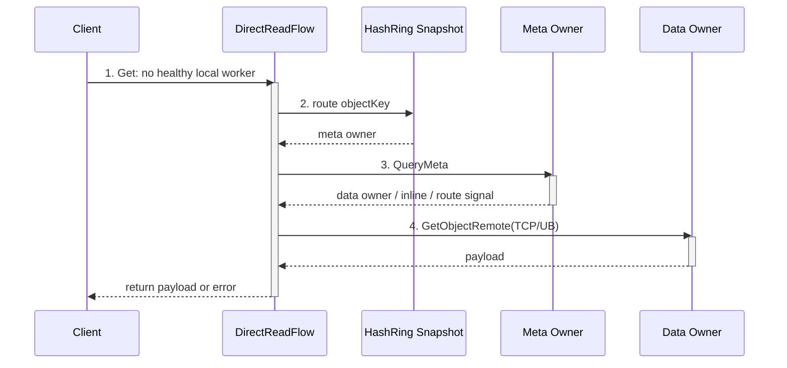
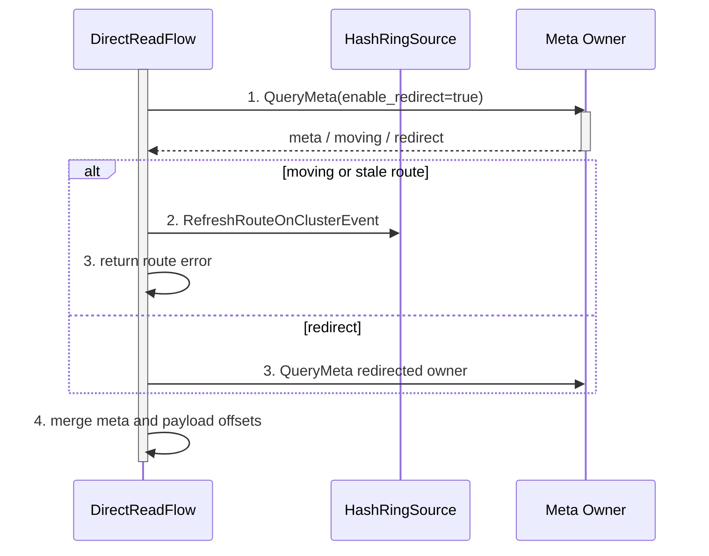
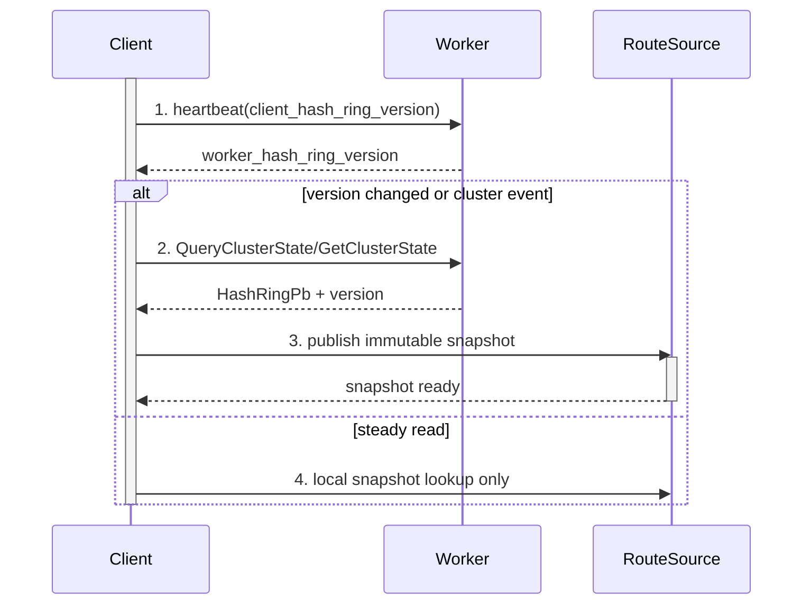
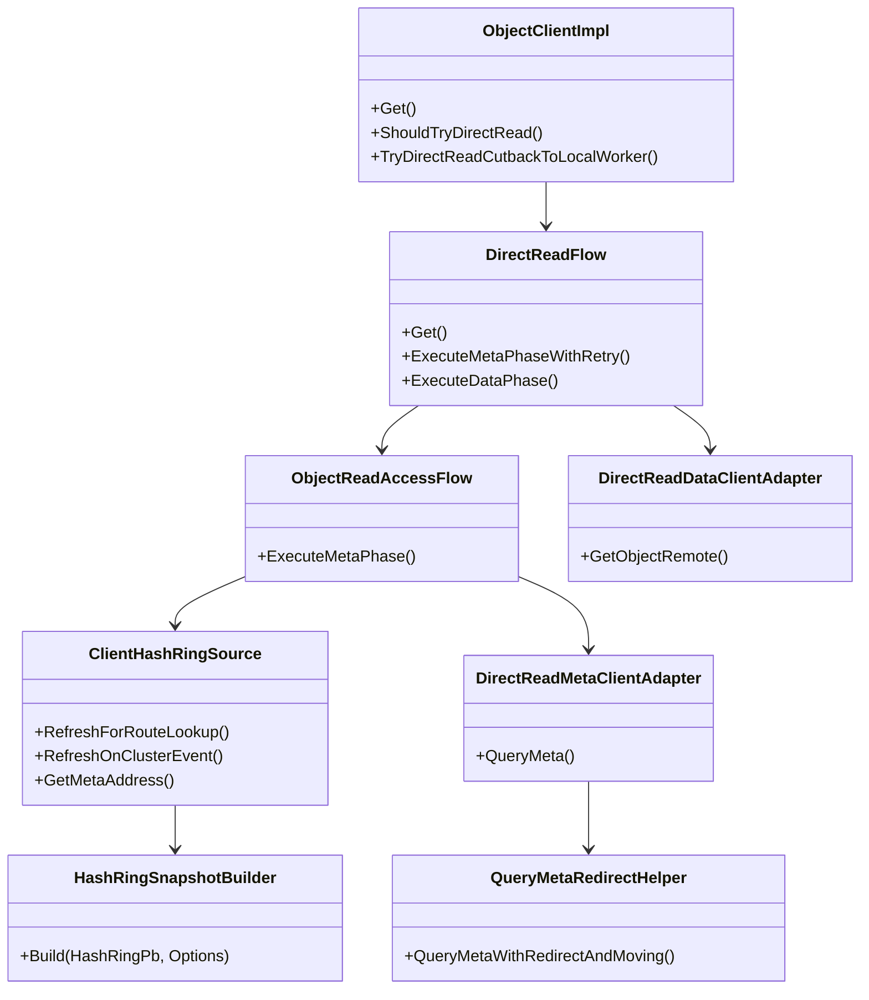

关联AR:

+ PR1119: Client Direct Read Flow
+ PR1206: Client Hash-Ring Based Object Routing

# Story 整体设计

## 功能描述

+ Why: 当 Object Client 所在节点没有 healthy local worker 时，旧读路径需要先访问当前连接的远端 worker，再由该 worker 代理 QueryMeta 和拉取对象数据。该特性让 client 在无本地 worker 场景下分别直连 meta owner 和 data owner，减少不必要的中间 worker 跳数；典型“无本地 worker 读”（remote-only read）从“worker 中转读路径”的 2 跳收敛为 client 直连 meta/data 的 1 跳数据访问路径。
+ Who: 使用 ObjectClient 的远端 client、无本地 worker 的业务进程、跨节点读取高频对象的推理/训练业务，以及验证 object cache 分布式 master 读路径的测试人员。
+ When: client 启动后找不到同节点可用 worker、local worker 故障切到 remote worker、或测试通过 service discovery 构造无本地 worker client（remote-only client）时生效。存在 healthy local worker 时仍优先使用原 local worker/worker 中转路径，避免改变同节点共享内存读语义。
+ Where: Client 侧 `ObjectClientImpl`、`DirectReadFlow`、`ClientHashRingSource`/`ClientPlacementProvider`、`DirectReadRpcAdapter`、`DirectReadDataClientAdapter`；Common 侧 `ObjectReadAccessFlow`、`query_meta_redirect_helper`、`query_meta_merge_helper`、`ReadOnlyHashRingView`；Worker 侧 `QueryClusterState`/`GetClusterState` 和 `HashRing` 快照。
+ How: Client 本地维护 hash ring 只读快照，用于定位 meta owner；meta phase 直接 QueryMeta 并处理 moving/redirect；data phase 根据 meta 返回的 data location 直接通过 TCP/UB 拉取对象数据；hash ring 仅在 bootstrap、scale/moving/stale route、版本不一致等事件下刷新，稳态普通读不刷新。direct read 单次读取失败后返回错误，不额外重试，也不回退 worker 中转路径。
+ What happen: 影响 ObjectClient Get/MGet 读取链路、QueryMeta 控制面链路、data owner 远端读取链路、hash ring 刷新策略、heartbeat/cluster-state 版本协同；不包含 meta-affinity write/replicate，Create/Put/Publish/Seal 等写路径不在本文档范围内。
+ Experience: Client 无本地 worker 时减少 RPC/UB 中间跳数，降低冷读和无本地 worker 读（remote-only read）时延；稳态读不把 hash ring 刷新放进关键路径；刷新过程避免大粒度锁覆盖 RPC 或 snapshot build，从而降低长尾风险。

### 术语说明

| 术语/简写 | 含义 | 本文使用说明 |
| ---- | ---- | ---- |
| 无本地 worker 场景（remote-only） | ObjectClient 所在节点没有 healthy local worker，只能连接远端 worker 的场景 | 后文 `remote-only client/read` 均指该场景，不表示只有一个远端 worker，也不表示只读远端副本 |
| worker 中转路径 | Client 先请求当前连接的 worker，再由该 worker 代理访问 meta owner 或 data owner | 文档中统一使用该术语，避免使用容易误解的旧称 |
| direct read | Client 绕过 worker 中转路径，自己完成 QueryMeta 和 data worker 读取 | 本文只讨论读取流程，不包含 meta-affinity write/replicate |

## 场景分析

### 场景 1: 无本地 worker client（remote-only client）直接读



旧路径中，client 先访问当前连接的中转 worker，再由中转 worker 访问 meta/data owner。新读取流程中，client 根据本地 ring 快照直连 meta owner，再按 meta 返回的数据位置直连 data owner，减少中转 worker 代理。

生命周期编号：

+ 1: 入口判定，确认无 healthy local worker 后进入 direct read。
+ 2: 读取本地 hash ring 快照，定位 meta owner。
+ 3: QueryMeta，返回 data owner、inline payload 或 moving/redirect/stale route 等路由信号。
+ 4: 直连 data owner 读取对象；失败后返回错误，不额外重试，不回退 worker 中转路径。

### 场景 2: Meta moving / redirect



moving/redirect 由 common helper 统一处理，Client 只注入刷新策略和 RPC transport。测试需要重点验证 moving 时刷新 ring、redirect 响应合并、payload offset 正确。

编号含义：1 首次 QueryMeta；2 根据 moving/stale route 刷新 ring，供后续请求使用；3 当前请求返回路由错误，或 redirect 到目标 owner 查询；4 合并 meta 和 payload offset。

### 场景 3: Hash ring 版本变化刷新



稳态普通 Get 只读本地快照；hash ring 全量刷新只在 bootstrap、scale/moving/stale route、版本不一致或调试强制刷新时发生。

编号含义：1 心跳感知版本；2 获取新 ring；3 发布不可变快照；4 稳态读只查本地快照。

## 方案详细设计

### 现状分析

PR1119 已实现 Client Direct Read 主流程：client 无本地 worker 时直接访问 meta 和 data，避免中转 worker 代理。该版本需要在测试和设计中显式感知两个风险：

+ hash ring 处理不能放在每次读关键路径上。旧实现/旧设计中如果 route lookup 伴随 worker/etcd 全量刷新，会把控制面 RPC 放入普通 Get 时延。
+ 锁粒度不能覆盖耗时 RPC 或 snapshot build。业务读路径应使用已发布的只读快照；刷新可串行化，但不能在持锁状态下访问 worker/etcd 或进行重型构建，避免并发读长尾。

PR1206 提供 hash-ring based object routing 能力，补齐 worker `QueryClusterState`、heartbeat ring version、client placement provider、hash ring snapshot builder 等基础能力，可用于把 ring 刷新和路由快照从读关键路径中剥离。

### 方案设计

#### 1. 构建

新增或调整的构建单元：

+ `src/datasystem/client/direct_read/*`: Client direct read 的 meta/data adapter、flow、失败诊断/test hook。
+ `src/datasystem/common/object_cache/read_access/*`: `ObjectReadAccessFlow`、QueryMeta moving/redirect helper、merge helper。
+ `src/datasystem/common/object_cache/read_only_hash_ring_view.{h,cpp}` 或 `src/datasystem/client/placement/*`: client 本地只读 hash ring 快照和 route provider。
+ `src/datasystem/topology/routing/hash_ring_snapshot_builder.{h,cpp}`: 从 `HashRingPb` 构造不可变 routing/directory snapshot，供 worker/client 复用。
+ `src/datasystem/protos/object_posix.proto`、`share_memory.proto`、`worker_object.proto`: cluster-state 查询消息、heartbeat ring version 字段。
+ 测试目标覆盖 direct read UT/ST、hash ring route UT、QueryMeta redirect/moving UT、无本地 worker 场景（remote-only）latency benchmark。

#### 2. 部署

生产部署不要求新增进程。特性依赖：

+ `enable_distributed_master=true` 是 direct read 路由验证的前置配置，必须打开；否则 client 使用 centralized master address，不走分布式 hash ring 路由。
+ `enable_client_direct_read=true` 打开读取直连能力。
+ 同拓扑 direct A/B 仅通过 ST/perf 内部 hook 忽略 healthy local worker gate；不作为用户启动配置暴露。
+ worker 正常接入 etcd 或 coordination backend，能返回 `HashRingPb` 与 `hash_ring_version`。
+ UB/RDMA 读取收益验证需要原有 URMA/UB 能力可用；功能正确性必须同时覆盖 TCP direct read。

#### 3. 运行

运行期分为三层：

+ Gate 层：`ObjectClientImpl::Get` 判断是否有 healthy local worker。无 local worker 时进入 direct read；有 local worker 时使用 local worker 或 worker 中转路径。测试如需同拓扑 A/B，可通过 ST/perf 内部 hook 忽略 local-worker gate。
+ Meta phase：`DirectReadFlow` 调用 `ObjectReadAccessFlow`，先按 hash ring 对 object keys 分组，再通过 `IObjectReadMetaClient` 直接 QueryMeta。moving/redirect 由 common helper 消化，Client 只负责 refresh callback、RPC transport、失败原因记录和错误返回。
+ Data phase：根据 QueryMeta 结果按 data owner 分组，`DirectReadDataClientAdapter` 直连 data worker，优先走 UB/URMA 能力，失败或不支持时使用 TCP `GetObjectRemote`。

hash ring 刷新策略：

+ `RefreshForRouteLookup`: cheap path。无 snapshot 时 bootstrap；ring 带 scale task 时刷新；稳态读不刷新。
+ `RefreshOnClusterEvent`: event path。meta moving、stale route、worker version mismatch、local worker 回切判定等事件触发全量刷新。

#### 4. 元戎整体如何使用

+ 默认不开启时，ObjectClient Get 仍走原 local worker 或 worker 中转读取。
+ 开启 `enable_client_direct_read` 后，client 无 healthy local worker 时，Get/MGet 通过 direct read 读取。
+ ST/perf 中如需在有 local worker 的拓扑下对比 direct path，可使用内部 hook 忽略 local-worker gate；该能力不是关闭缓存，也不改变 L2 查询、L2 fallback 或写入 cache mode。
+ local worker 恢复后，client 回切 local worker 或 worker 中转读取，保持同节点共享内存优先。

#### 5. 代码关键类图、运行视图、数据表设计



关键模块要点：

+ `DirectReadFlow`: 读取主编排。Meta phase 完成 QueryMeta、moving/redirect、payload merge；Data phase 按 data worker 分组直连读取；失败时记录 direct read 失败原因并向调用方返回错误，不额外重试，不回退 worker 中转路径。
+ `ObjectReadAccessFlow`: Common meta phase 骨架，负责按 meta owner 分组、调用 meta client、合并多组 QueryMeta 响应。测试需覆盖跨组 payload offset 和 redirect merge。
+ `query_meta_redirect_helper`: Common moving/redirect 算法。moving/stale route 时触发 route refresh callback，当前请求返回可诊断错误；redirect 时 follow 到目标 master 并合并响应。
+ `ClientHashRingSource`/`ClientPlacementProvider`: Client 本地 ring source。稳态 route lookup 只读 snapshot；`RefreshOnClusterEvent` 才访问 worker/etcd 获取全量 ring。
+ `HashRingSnapshotBuilder`/`ReadOnlyHashRingView`: 将 `HashRingPb` 转为只读路由结构，过滤 JOINING/LEAVING/ACTIVE、redirect hint、worker uuid/address 等信息。
+ `WorkerOCServiceImpl::QueryClusterState` 和 `WorkerWorkerOCServiceImpl::GetClusterState`: 返回 worker 当前 `HashRingPb` 与 `hash_ring_version`，供 client bootstrap/refresh。

#### 6. 高性能设计 topic

+ RPC stub/channel 必须复用缓存，不能每次 Get、每个 object key、每个 data worker 都新建 stub 或重新建链。Client direct data/meta RPC 应优先走 `RpcStubCacheMgr` 或等价缓存；性能分析时需区分首包建链耗时和稳态耗时。
+ Hash ring route lookup 只能读本地 snapshot。稳态 Get 不允许每次访问 worker `GetClusterState` 或 etcd；moving/stale route/scale/版本不一致才触发全量刷新。
+ 批量 Get 需要按 meta owner/data worker 分组后批量 RPC，不能退化成每个 key 串行一次远端 RPC。
+ URMA/UB 资源、remote address、buffer handle 等能够缓存的路径应复用；不可用或超过限制时再在 direct read 内部降级到 TCP direct。
+ RPC timeout/deadline 必须沿用本次 Get 的剩余预算，不能因为 direct path 新增一层 adapter 而变成无限等待或过短 timeout。

### 开源软件选型

不新增开源软件。复用项目已有 protobuf、gflags、RpcStubCacheMgr、topology routing、EtcdStore、Status/RpcOptions、URMA/UB 传输能力。

### 外部交互分析&&上下游依赖需求

+ Client -> WorkerOCService: `QueryClusterState(GetClusterStateReqPb) returns (GetClusterStateRspPb)`，用于 client 获取 hash ring 快照。
+ Client -> Worker heartbeat: `HeartbeatReqPb.client_hash_ring_version` 上报 client 本地 version；`HeartbeatRspPb.worker_hash_ring_version` 返回 worker 当前 ring store revision。
+ Client -> Meta Owner: QueryMeta RPC，需支持 moving/redirect 和 payload 返回。
+ Client -> Data Worker: `GetObjectRemote` TCP/UB 远端读取。
+ Worker -> HashRing: `GetRingSnapshot(HashRingPb&, int64_t&)` 在短读锁内返回 ring 与 revision 一致快照。

## 对外接口

### Proto 接口

+ `object_posix.proto`
  + 新增 `GetClusterStateReqPb`，含 `timestamp/signature/access_key`。
  + 新增 `GetClusterStateRspPb`，字段包括 `coordinator_available`、`hash_ring`、`hash_ring_version`。
  + `WorkerOCService` 新增 `QueryClusterState` RPC。
+ `share_memory.proto`
  + `HeartbeatReqPb` 新增 `int64 client_hash_ring_version = 9`。
  + `HeartbeatRspPb` 新增 `int64 worker_hash_ring_version = 9`。
+ `worker_object.proto`
  + 复用 `GetClusterStateReqPb/RspPb`，`GetClusterStateRspPb` 增加 `hash_ring_version`。

### C++ 接口

+ `IClientWorkerApi::GetClusterState(HashRingPb &ring, int64_t &version)`。
+ `ClientWorkerLocalApi::GetClusterState` 和 `ClientWorkerRemoteApi::GetClusterState`。
+ `ClientWorkerLocalCommonApi::SendHeartbeat`、`ClientWorkerRemoteCommonApi::SendHeartbeat` 参数新增 `clientHashRingVersion` 和 `workerHashRingVersion` 输出。
+ `WorkerOCServiceImpl::QueryClusterState`。
+ `HashRing::GetRingSnapshot(HashRingPb &ring, int64_t &revision) const`。
+ Direct read 内部接口：`IObjectReadRouteProvider`、`IObjectReadMetaClient`、`IObjectReadDataClient`。

### 配置接口

+ `enable_client_direct_read`，默认关闭，控制 client 无本地 worker 时是否尝试 direct read。
+ `enable_distributed_master`，必须配置为 `true`，用于启用分布式 hash ring 路由。

## 约束

+ 范围约束：本文档只覆盖读取流程；meta-affinity write/replicate 属另一个 PR，不纳入本 story 和测试验收。
+ 入口约束：仅在 client 无 healthy local worker 时默认进入 direct read；有 local worker 时保持 local worker 或 worker 中转路径。
+ 失败语义：direct read 过程中 QueryMeta、路由刷新、data RPC 任一关键步骤失败，当前 Get 直接向调用方返回错误；不额外重试，不回退 worker 中转路径。测试需要断言失败状态码、错误原因和 direct read 失败计数。
+ Hash ring 约束：稳态 route lookup 只能读取本地 snapshot，不能访问 etcd 或发起 worker cluster-state RPC；moving/stale route/scale/版本不一致等事件才允许刷新。
+ 并发与锁约束：刷新过程不能在大粒度锁内执行 worker/etcd RPC 或重型 snapshot build；业务读路径不能被刷新长时间阻塞。
+ 版本约束：worker 返回 `hash_ring_version=-1` 表示 ring not ready，client 不应覆盖已有可用快照；backend revision reset 后允许接受更低但有效的 version，不能只按单调递增过滤。

## Example

### 启动配置示例

```bash
# worker/client 所在进程
-enable_distributed_master=true \
-enable_client_direct_read=true
```

### 新增/专项用例配置说明

新增启动参数：

| 参数 | 默认值 | 含义 | 怎么配置 |
| ---- | ---- | ---- | ---- |
| `enable_client_direct_read` | `false` | direct read 总开关。打开后，仅无本地 worker 场景（remote-only）默认进入 direct read | 生产灰度/功能验证设为 `true`；baseline 设为 `false` |
| `enable_distributed_master` | 必须为 `true` | 分布式 master/hash ring 路由总开关 | direct read 路由验证固定配置为 `true` |

专项性能 ST：

+ 文件：`tests/st/client/object_cache/client_direct_read_perf_test.cpp`。
+ 默认行为：以下 ST 只有设置 `DS_DIRECT_READ_PERF=1` 才执行，否则 `GTEST_SKIP`。
+ 输出：用例打印 `DIRECT_READ_PERF_JSON=...`，测试结论需要从该 JSON 汇总 avg、p99、p99.99、payload、warmup、iters 和 direct read phase stats。

| ST 用例名 | 用途 | 关键覆盖 |
| ---- | ---- | ---- |
| `ClientDirectReadCrossNodeTest.CrossNodeGetLatencyBenchmark` | 有 local worker 拓扑下，同一对象重复 Get 的 worker 中转路径 vs ST 内部 hook direct path A/B | 验证 direct path 稳态开销；不用于证明本地有 worker 无劣化 |
| `ClientDirectReadCrossNodeTest.CrossNodeColdGetLatencyBenchmark` | cold read A/B | 当前代码只支持 `256KB` 和 `8MB`；如设置其他 size 会 skip |
| `ClientDirectReadRecoveryTest.CrossNodeGetLatencyBenchmarkRemoteOnly` | 无本地 worker 场景（remote-only）A/B | UB 收益重点用例；`DS_DIRECT_READ_PERF_SIZE` 可指定 `3670016` 和 `8388608` |

专项性能环境变量只在上述 ST 中使用：

| 环境变量 | 含义 | 怎么配置 |
| ---- | ---- | ---- |
| `DS_DIRECT_READ_PERF` | 打开 `client_direct_read_perf_test.cpp` 中的专项性能 ST | 跑性能专项时设为 `1`，常规 ST 可不设置 |
| `DS_DIRECT_READ_PERF_MODE` | 选择执行 local/remote-only 场景 | `local` 只跑 `ClientDirectReadCrossNodeTest.*LatencyBenchmark`；`remote` 只跑 `ClientDirectReadRecoveryTest.CrossNodeGetLatencyBenchmarkRemoteOnly`；未设置或 `all` 跑全部 |
| `DS_DIRECT_READ_PERF_SIZE` | 单对象 payload 大小，单位 byte | TCP 摸底可设 `262144`；UB remote-only 专项必须覆盖 `3670016` 和 `8388608`；cold ST 当前只接受 `262144` 或 `8388608` |
| `DS_DIRECT_READ_PERF_ITERS` | 正式统计迭代次数 | 建议 `100` 起步，正式性能材料按测试规范提高 |
| `DS_DIRECT_READ_PERF_WARMUP` | 预热次数，不计入统计 | 建议 `10` 起步，用于排除首包建链等一次性开销 |
| `DS_DIRECT_READ_PERF_PREFER_REMOTE_DATA` | cold ST 中强制 direct path 走 data worker 远端读，减少 inline data 干扰 | UB/远端数据专项可设为 `1` |
| `DS_DIRECT_READ_PERF_AB_REMOTE_DATA` | cold ST 同时输出 direct 默认路径和 direct remote-data 路径 | 需要比较 inline/direct remote data 差异时设为 `1` |

常用配置组合：

+ Baseline：`enable_client_direct_read=false`，读取走原 local worker 或 worker 中转路径。
+ 优化后 remote-only：`enable_distributed_master=true`、`enable_client_direct_read=true`，并构造无 healthy local worker client。
+ 同拓扑 direct A/B：`enable_client_direct_read=true`，通过 ST/perf 内部 hook 忽略 local-worker gate；该 hook 不作为用户配置。

### 无本地 worker direct read 构造示例（remote-only）

```cpp
ServiceDiscoveryOptions sdOpts;
sdOpts.etcdAddress = clusterEtcdAddress;
sdOpts.hostIdEnvName = "remote_client_host_id_env";
sdOpts.affinityPolicy = ServiceAffinityPolicy::PREFERRED_SAME_NODE;

ConnectOptions connectOptions;
connectOptions.host = workerAddr.Host();
connectOptions.port = workerAddr.Port();
connectOptions.enableCrossNodeConnection = true;
connectOptions.serviceDiscovery = serviceDiscovery;
connectOptions.accessKey = accessKey;
connectOptions.secretKey = secretKey;

auto client = std::make_shared<ObjectClient>(connectOptions);
DS_ASSERT_OK(client->Init());
```

### 性能验证命令示例

对比方法：

+ Baseline: 关闭 direct read，读取请求走原 worker 中转路径。测试中使用 `enable_client_direct_read=false` 或 perf case 内部 baseline scenario。
+ 优化后: 打开 direct read；无本地 worker 场景（remote-only）自然进入 direct path；如需在有 local worker 的拓扑下对比 direct path，仅使用 ST/perf 内部 hook 忽略 local-worker gate。
+ 指标: 至少记录 avg；正式性能材料建议同时记录 p99、p99.99、payload size、iters、warmup、测试机器和是否启用 UB。
+ 重点: 当前已有摸测主要是 TCP 口径，只能说明 TCP direct 现状；最终收益必须重点验证 UB 1 跳路径，至少覆盖 3.5MB 和 8MB 两档对象大小。
+ 判定口径: 同一 payload、同一拓扑、同一轮测试中比较 baseline 与 direct；以 `direct / baseline` ratio 或 latency reduction 说明收益。

```bash
# TCP 摸底，不能替代 UB 收益结论
DS_DIRECT_READ_PERF=1 \
DS_DIRECT_READ_PERF_MODE=remote \
DS_DIRECT_READ_PERF_SIZE=262144 \
DS_DIRECT_READ_PERF_ITERS=100 \
DS_DIRECT_READ_PERF_WARMUP=10 \
ctest -R 'ClientDirectReadRecoveryTest.CrossNodeGetLatencyBenchmarkRemoteOnly' -j1 --timeout 600

# UB remote-only 专项 3.5MB
# Transport 不使用额外伪造环境变量；需通过 URMA/UB 部署开关启用，并用 trace/access log 证明命中 UB。
DS_DIRECT_READ_PERF=1 \
DS_DIRECT_READ_PERF_MODE=remote \
DS_DIRECT_READ_PERF_SIZE=3670016 \
DS_DIRECT_READ_PERF_ITERS=100 \
DS_DIRECT_READ_PERF_WARMUP=10 \
ctest -R 'ClientDirectReadRecoveryTest.CrossNodeGetLatencyBenchmarkRemoteOnly' -j1 --timeout 600

# UB remote-only 专项 8MB
# Transport 不使用额外伪造环境变量；需通过 URMA/UB 部署开关启用，并用 trace/access log 证明命中 UB。
DS_DIRECT_READ_PERF=1 \
DS_DIRECT_READ_PERF_MODE=remote \
DS_DIRECT_READ_PERF_SIZE=8388608 \
DS_DIRECT_READ_PERF_ITERS=100 \
DS_DIRECT_READ_PERF_WARMUP=10 \
ctest -R 'ClientDirectReadRecoveryTest.CrossNodeGetLatencyBenchmarkRemoteOnly' -j1 --timeout 600

# cold read A/B 8MB，可用于补充冷读收益；当前 cold ST 不支持 3.5MB。
DS_DIRECT_READ_PERF=1 \
DS_DIRECT_READ_PERF_MODE=local \
DS_DIRECT_READ_PERF_SIZE=8388608 \
DS_DIRECT_READ_PERF_PREFER_REMOTE_DATA=1 \
DS_DIRECT_READ_PERF_ITERS=100 \
DS_DIRECT_READ_PERF_WARMUP=10 \
ctest -R 'ClientDirectReadCrossNodeTest.CrossNodeColdGetLatencyBenchmark' -j1 --timeout 600
```

预期收益：

+ 功能目标: 无本地 worker client（remote-only client）读取时，client 直接访问 meta/data，去掉中转 worker 的一次代理访问。
+ 性能目标: 冷读场景 direct path 应显著低于中转路径，目标 `direct / baseline <= 0.6`；无本地 worker 稳态读（remote-only steady read）至少不劣化，目标 `direct / baseline <= 1.0`；UB 1 跳路径是本特性的重点收益验证项，3.5MB 和 8MB 下预期优于 TCP 中转路径，并需要给出 `direct_ub / baseline` ratio；本地有 worker 场景默认不进入 direct read，开启特性后相对原 local worker 路径不能有性能劣化，目标 `enabled / baseline <= 1.05`。
+ 刷新开销目标: 稳态连续 Get 不应触发每次 hash ring 全量刷新；`GetClusterState`/etcd refresh 次数不能随 Get 次数线性增长。

当前摸测结果：

| 日期 | payload | iters | 场景 | baseline: worker 中转 avg | direct avg | direct/baseline | 结论 |
| ---- | ---- | ---- | ---- | ---- | ---- | ---- | ---- |
| 2026-06-28 | 256KB | 100 | cold read | ~4.8 ms | ~2.1 ms | ~0.44x | 已达到冷读收益，约 56% 时延下降 |
| 2026-06-28 | 256KB | 100 | local-hit baseline vs forced direct TCP | ~1.3 ms | ~2.0 ms | ~1.5x | 该 case 的 baseline 为本地命中，基本没有 RPC 和 payload 传输开销；direct path 至少包含 QueryMeta 和 data Get 两次 RPC，因此不能作为 remote-only 优化收益结论，只能用于识别 direct path 额外开销 |

UB 收益专项必须补充：

| payload | transport | baseline | direct | 验收说明 |
| ---- | ---- | ---- | ---- | ---- |
| 3.5MB | UB | worker 中转路径，记录 avg/p99/p99.99 | direct UB 1 跳，记录 avg/p99/p99.99 | 必须证明命中 UB，给出 `direct_ub / baseline` |
| 8MB | UB | worker 中转路径，记录 avg/p99/p99.99 | direct UB 1 跳，记录 avg/p99/p99.99 | 必须证明命中 UB，给出 `direct_ub / baseline`；同时观察大对象 buffer/remote address 缓存效果 |

本地有 worker 场景也需要单独给出 A/B：

| 场景 | baseline | 开启特性后 | 验收 |
| ---- | ---- | ---- | ---- |
| same-node/local worker Get | `enable_client_direct_read=false`，走原 local worker 路径 | `enable_client_direct_read=true`，不使用忽略 local-worker gate 的内部 hook，仍应走 local worker 路径 | avg/p99 不劣化；目标 `enabled / baseline <= 1.05`；如超过需检查 gate 判断、hash ring 检查、监听线程刷新是否进入同步读路径 |

测试结论要求：

+ PR 验收至少给出 cold read、无本地 worker 读（remote-only read）、本地有 worker 读三组 A/B 数据；其中无本地 worker 读必须包含 3.5MB 和 8MB 的 UB 专项。
+ 本地有 worker 读用于证明开启特性后不影响原 local worker 快路径；该场景不能使用忽略 local-worker gate 的内部 hook。
+ 如果 local-hit baseline vs forced direct TCP 中 direct 慢于 baseline，需要在测试结论中标注该 case 的 baseline 是本地命中，无 RPC/payload 传输开销；direct path 有 QueryMeta 和 data Get 两次 RPC，该结果只用于识别 direct path 额外开销，不能外推为 remote-only 收益。
+ UB 1 跳收益是重点验收项，需要单独列出 UB transport 生效证据，例如 access log/trace 中 transport type、data owner 地址、是否未经过中转 worker 代理。

# 可信软件

### 安全性 Security

+ Direct read 仍沿用现有对象访问鉴权、租户和 RPC 签名链路。
+ heartbeat 新增的 ring version 不包含敏感数据，仅为 int64 version。

### 韧性 Resilience

+ etcd/metastore bootstrap 失败时，可改从 worker cluster-state 获取 ring。
+ worker ring not ready 返回 -1 时，client 保持已有 snapshot，不用空 ring 覆盖可用状态。
+ meta moving/stale route 触发 `RefreshOnClusterEvent`，刷新后的 ring 供后续请求使用；当前 direct read 请求按错误返回。
+ heartbeat 版本不一致触发异步刷新，单次刷新失败仅记录 warning，后续 heartbeat 可继续触发。

### 隐私性 Privacy

不引入个人信息收集、存储、披露变化。新增字段为 hash ring 版本和拓扑信息，仅用于系统内部路由。

### 可靠性 Reliability

+ `GetRingSnapshot` 在 HashRing 短读锁内同时复制 ring 和 revision，保证二者一致。
+ immutable snapshot publish 后，业务 route lookup 读取的是已发布视图，不依赖正在变更的 HashRing 内部结构。
+ moving/redirect response merge 使用 common helper，降低 Client/Worker 两套实现不一致风险。

### 可用性 Availability

+ 默认开关关闭，保留原读取路径。
+ 开关打开后，local worker 可用时仍走 local worker 或 worker 中转路径；无本地 worker 场景（remote-only）才默认 direct read。
+ cluster state 查询失败不影响已有连接的 heartbeat 存活逻辑；direct read 失败时返回错误，不额外重试，不回退 worker 中转路径。

### 安全 Safety

该特性不涉及人身安全或物理设备安全控制。失败模式限定为对象读取失败或路由刷新延迟，不会引入不可接受的人身或环境风险。

# 自验 用例

| 测试大类 | 测试场景 | 用例目的(名称) | 用例执行步骤 | 预期 |
| ---- | ---- | -------- | ------ | --- |
| 性能收益 | 冷读 A/B | `ClientDirectReadCrossNodeTest.CrossNodeColdGetLatencyBenchmark` | 同拓扑、同 payload 下分别跑 worker 中转路径和 direct path；记录 avg/p99/p99.99；当前 ST 支持 256KB/8MB | direct/baseline 目标 <= 0.6；当前摸测 256KB cold read 约 4.8 ms -> 2.1 ms |
| 性能收益 | 无本地 worker A/B（remote-only A/B） | `ClientDirectReadRecoveryTest.CrossNodeGetLatencyBenchmarkRemoteOnly` | 构造无 healthy local worker client；分别跑 worker 中转路径和 direct remote-only Get benchmark | 输出 avg/p99/p99.99；目标 direct/baseline <= 1.0；需重点结合 UB 验证 |
| 性能收益 | 本地有 worker 无劣化 | `ClientDirectReadTest.SameNodeUsesWorkerPathWhenEnabled` / same-node latency A/B | 同节点 client+worker；分别以 `enable_client_direct_read=false` 和 `true` 跑 Get benchmark，不使用忽略 local-worker gate 的内部 hook | 路径仍为 local worker；avg/p99 不劣化，目标 enabled/baseline <= 1.05 |
| 性能收益 | UB 1 跳读取 3.5MB | `ClientDirectReadRecoveryTest.CrossNodeGetLatencyBenchmarkRemoteOnly` | 开启 URMA/UB；`DS_DIRECT_READ_PERF_SIZE=3670016`；分别跑 worker 中转路径和 direct UB；抓取 trace/log 或 perf JSON | Client 直接访问 data owner；payload 正确；命中 UB；不出现中转 worker 代理 data 读取；给出 `direct_ub / baseline` |
| 性能收益 | UB 1 跳读取 8MB | `ClientDirectReadRecoveryTest.CrossNodeGetLatencyBenchmarkRemoteOnly` | 开启 URMA/UB；`DS_DIRECT_READ_PERF_SIZE=8388608`；分别跑 worker 中转路径和 direct UB；抓取 trace/log 或 perf JSON | Client 直接访问 data owner；payload 正确；命中 UB；验证大对象 buffer/remote address 缓存效果；给出 `direct_ub / baseline` |
| 性能收益 | 稳态 route lookup 开销 | hash ring 不在读关键路径刷新 | 预加载 snapshot；连续执行多次 direct Get；统计 loader/GetClusterState 调用数 | 稳态 refresh 次数不随 Get 次数线性增长；无 scale/moving 时不访问 etcd/worker cluster-state |
| 扩缩容/可靠性 | scale down/up 期间读可用 | ReadSurvivesWorkerScaleDownAndUp | 2 worker 分布式 master；触发 scale down/up 或 changed ranges；direct Get 持续读取对象 | 未命中迁移窗口时读取成功；命中迁移窗口时返回可诊断错误；ring refresh 后后续请求路由到正确 meta/data owner |
| 扩缩容/可靠性 | Meta moving | MetaMovingRefreshesRingAndReturnsError | 注入 meta moving 或 scale 中状态；执行 direct Get | 触发 `RefreshOnClusterEvent`；当前请求返回 moving/route 相关错误；refresh count >= 1；后续请求使用新 ring |
| 扩缩容/可靠性 | stale route 刷新失败返回 | StaleRouteRefreshesRingAndReturnsError | client 预加载旧 ring；迁移 key 的 meta owner；执行 Get | 首次 route stale 后触发 ring refresh；当前请求返回可诊断错误；后续请求使用新路由 |
| 扩缩容/可靠性 | Local worker 回切 | LocalWorkerRecoveryCutbackToWorkerRelay | client 先无 local worker 走 direct read；恢复 local worker；再次 Get | 后续读取回到 local worker 或 worker 中转路径；direct read cutback 计数可观测 |
| 扩缩容/可靠性 | 高并发刷新 | 版本变化时不产生刷新风暴 | 多线程 Get 或多次 heartbeat 同时观察 worker version mismatch | 同一 listener/route source 同时最多一个 refresh 任务；业务请求不被长时间阻塞 |
| 功能正确性 | 无本地 worker direct read（remote-only direct read） | StandbyWithoutLocalWorkerUsesDirectRead | 构造无 healthy local worker 的 client；预置测试对象；执行 Get | 读取成功；路径统计显示 direct read；不依赖中转 worker 代理 meta/data |
| 功能正确性 | Direct/中转路径字节一致 | worker 中转 vs direct parity | 同一对象分别通过 worker 中转路径和 ST/perf 内部 hook direct path 读取；比较 payload | 两条路径 payload 完全一致；object not found/empty payload 行为一致；内部 hook 只忽略 local-worker gate，不关闭 L2/cache 相关逻辑 |
| 功能正确性 | 有 local worker 不直连 | `ClientDirectReadTest.SameNodeUsesWorkerPathWhenEnabled` | 开启 direct read；client 与 local worker 同节点；执行 Get | 不进入 direct read；仍走 local worker 读取，保持共享内存优先 |
| 功能正确性 | Direct 传输降级 | UB 不可用或超限时走 TCP direct | 关闭 UB 或构造超过 UB 限制对象；执行 direct Get | 在 direct read 内部从 UB 降级到 TCP `GetObjectRemote` 并读取成功；该降级不等同于回退 worker 中转路径 |
| 控制面/路由 | Redirect merge | QueryMeta redirect payload merge | 构造 redirect master 返回 partial meta/payload；执行 QueryMeta helper 单测或 ST | redirect 后 query_metas 和 payload offsets 合并正确；无重复/丢失 payload |
| 控制面/路由 | Worker ring not ready | -1 version 不覆盖已有 snapshot | 先加载 version=7 ring；再返回 version=-1 的 ring；执行 GetMetaAddress/Get | client 保持 version=7；原路由结果不变；读取不因空 ring 失败 |
| 控制面/路由 | Backend revision reset | 低版本 ring 不被错误丢弃 | 先让 provider 加载 version=8 ring；再模拟 worker 返回 version=0 或 7 且内容有效 | provider 接受新快照；后续 direct Get 使用新路由 |
| 控制面/路由 | Heartbeat version | client/worker version 不一致触发异步刷新 | 构造 client，本地 version=-1；worker heartbeat 返回有效 version；等待一次 heartbeat 周期 | `ShouldRefreshHashRing` 为 true；触发一次异步刷新；刷新 in-flight 不重复并发 |
| 接口/安全 | Proto/RPC 接口 | QueryClusterState 返回 ring 与 version | 启动 2 worker distributed master；通过 `ClientWorkerRemoteApi::GetClusterState` 调 worker0；记录 `HashRingPb` 和 `hash_ring_version` | RPC 成功；`hash_ring_version >= 0`；`workers_size > 0` |
