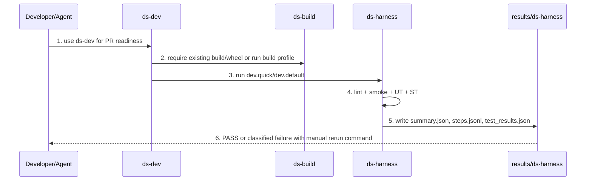
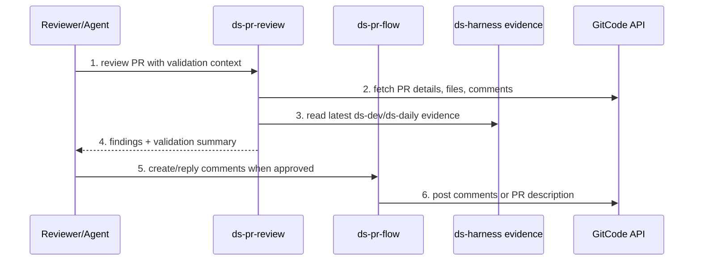
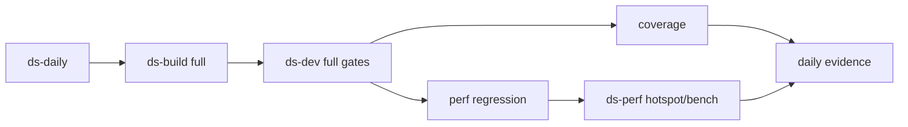
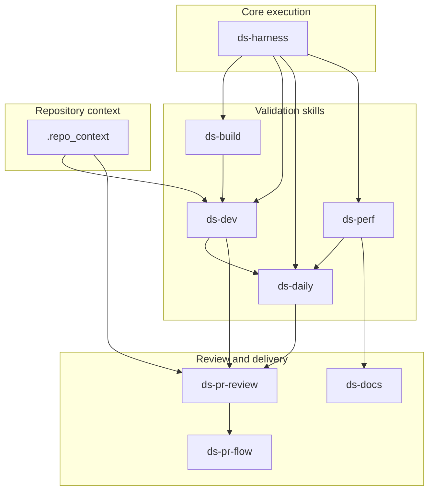

关联 RFC:

+ RFC-DS-SKILLS: Datasystem Skills Migration and Verification

# Story 整体设计

## 功能描述

+ Why: workbench 仓已经沉淀出 build/dev/daily/perf/docs/html publish 等 Agent skills，但 datasystem 源码仓内只有部分 `ds-*` 雏形，且还存在 `ds-pr-review`、`ds-dev-loop`、`ds-log-analysis` 等半迁移残留。继续让 workbench 和 datasystem 并行维护会造成入口分叉、验证口径不一致、PR review 无法引用真实测试证据。本 RFC 目标是把 datasystem 开发、测试、验证、PR 交付相关 skills 收敛到 datasystem 仓内，workbench 只保留跨仓和私有发布职责。
+ Who: datasystem C++/Python 开发者、测试人员、PR reviewer、Agent/Codex/Cursor/Claude Code、维护 daily/perf/bench 验证链的工程师。
+ When: 修改 datasystem 源码、测试、构建脚本、性能验证、PR 创建/评审/回复、日构与专项回归时使用。迁移期内 workbench `wb-*` 仍可作为兼容入口，但 canonical 逐步切到 `yuanrong-datasystem/.skills/ds-*`。
+ Where: canonical skills 落在 `yuanrong-datasystem/.skills/`；RFC、迁移脚本、历史材料和 HTML 发布仍位于 `yuanrong-datasystem-agent-workbench`。远端节点通过本地私有 overlay 接入，不写入开源 datasystem 仓。
+ How: 以 `ds-harness` 作为唯一编排底座，统一 profiles、script owner、node routing、evidence schema 和 `verify_skill`。把 `wb-build/wb-dev/wb-daily/wb-perf/wb-docs` 能力迁移到对应 `ds-*`；把 datasystem 现有半技能目录归并到 active skills。每个 skill 先补 contract tests，再跑 dry-run，再跑真实本地/远端验证。
+ What happen: 新增或补齐 `ds-perf`、`ds-docs`、`ds-pr-review`、`ds-pr-flow`；强化 `ds-build`、`ds-dev`、`ds-daily`、`ds-harness`；归档或合并只剩缓存痕迹的历史目录；workbench `wb-*` 最终降级为指向 datasystem skills 的薄壳。
+ Experience: 使用者不需要记忆 workbench 路径或私有机器细节。Agent 触发 skill 后优先自动发现可用 build/wheel/cache/node；具备条件就直接执行；缺条件时输出可诊断、可行动的前置条件失败。人工也能复制同一组命令复现验证。

## 场景分析

### 场景 1: 开发者修改 C++ 后准备 PR



要求：

+ `ds-dev` 不应假通过。缺 build、缺 worker、缺 node、测试失败要分开。
+ `ds-dev` 应能告诉用户下一步手工命令，例如 `run_smoke_remote.sh --node <node> --skip-build`。
+ `ds-pr-review` 后续读取同一 evidence，避免评审和验证脱节。

### 场景 2: PR reviewer 读取验证证据并评论



要求：

+ `ds-pr-review` 必须是正式 skill，不只是一组 API helper。
+ PR 评论应引用验证 evidence 路径和失败层，不能只写“已验证”。
+ `ds-pr-flow` 统一 create PR、生成 PR 描述、读取评论、回复评论，避免 `ds-create-pr` / `ds-pr-comment-proc` 分叉。

### 场景 3: 日构或专项回归



要求：

+ `ds-daily` 的 PASS 必须代表真实 full quality gate，不得用 dry-run 冒充。
+ `ds-perf` 吸收 `wb-perf`、`ds-log-analysis`、`rdma-ucx-perf-debug` 能力，统一成 perf/bench/log/rdma 专项 profile。
+ daily/perf evidence 要能被 `ds-docs` 生成报告，被 `ds-pr-review` 引用。

## 方案详细设计

### 现状分析

workbench 当前有 6 个正式 skills：

| Workbench skill | 当前职责 | 迁移目标 |
|------|------|------|
| `wb-build` | CMake/Bazel build、构建耗时、长尾定位 | `ds-build` |
| `wb-dev` | clang-format、smoke、UT、ST、change-type gates | `ds-dev` |
| `wb-daily` | full quality、coverage、perf regression | `ds-daily` |
| `wb-perf` | perf/bpftrace/strace/metrics_summary/dsbench/kvtest | `ds-perf` |
| `wb-docs` | 报告、commit draft、workbook sources | `ds-docs` |
| `wb-html-publish` | yche.me HTML 发布 | workbench 保留 |

datasystem 当前 `.skills` 可见状态：

| 目录 | 可用性 | 问题 |
|------|------|------|
| `ds-harness` | Active | 需要私有节点 overlay、远端 verify 总入口、完整 skill registry contract |
| `ds-build` | Active | 已迁移雏形，需补前置条件分类、离线 cache/网络诊断、真实远端 PASS |
| `ds-dev` | Active | 已迁移雏形，需补 worker/wheel 自动发现、smoke/UT/ST 真实验证 |
| `ds-daily` | Active | 当前偏 dry-run 编排，需要 full daily 实跑证据 |
| `ds-pr-review` | Promote | 有 GitCode API helper 和测试，但缺正式 `SKILL.md` 和 evidence 读取 |
| `ds-create-pr` | Residual | 只见缓存痕迹，合并进 `ds-pr-flow` |
| `ds-pr-comment-proc` | Residual | 只见缓存痕迹，合并进 `ds-pr-flow` |
| `ds-pr-flow` | Residual | 只见缓存痕迹，作为 PR 流程合并目标 |
| `ds-dev-loop` | Residual | 合并为 `ds-dev` profile |
| `ds-log-analysis` | Residual | 合并进 `ds-perf` |
| `ds-refresh-docs` | Residual | 合并进 `ds-docs` |
| `ds-infra-engineering` | Residual | 合并进 `.repo_context` 和 `ds-dev` |
| `rdma-ucx-perf-debug` | Residual | 合并进 `ds-perf` |

### 方案设计

#### 1. Skill 分层



职责边界：

+ `ds-harness`: 只负责 profile 编排、节点配置、证据落盘、`verify_skill`，不承载业务判断。
+ `ds-build`: 回答“源码和构建依赖是否能完成构建”。
+ `ds-dev`: 回答“这次改动能否进入 review”。
+ `ds-daily`: 回答“全量质量门禁是否通过”。
+ `ds-perf`: 回答“性能/bench/log/rdma 问题如何定位和复查”。
+ `ds-pr-review`: 回答“PR 代码和验证证据有什么风险”。
+ `ds-pr-flow`: 执行 GitCode PR 创建、评论读取、评论回复、PR 描述更新。
+ `ds-docs`: 生成验证报告、PR evidence summary、commit draft；不直接发布私有 HTML。

#### 2. 开箱即用规则

每个 skill 都按同一发现顺序执行：

1. 从当前目录向上寻找 datasystem repo root，验证 `build.sh` 和 `CMakeLists.txt`。
2. 读取 `.skills/ds-harness/references/profiles.yaml`。
3. 读取 public `nodes.yaml`，再叠加私有 overlay。
4. 自动发现 build 目录、wheel、`datasystem_worker`、`libds_client_py.so`、third-party cache。
5. 满足条件时直接运行。
6. 不满足条件时输出分类失败，并列出搜索路径、缺失项、手工补救命令。

失败分类建议：

| 分类 | 含义 | 示例 |
|------|------|------|
| `FAIL_PREREQ_BUILD_MISSING` | 缺 build 产物 | 找不到 `build/tests/ut/ds_ut` 或 `datasystem_worker` |
| `FAIL_PREREQ_NETWORK` | 缺网络或下载源不可达 | `cannot resolve gitee.com` |
| `FAIL_PREREQ_CACHE` | 缺 third-party cache | 离线环境无 cached dependency |
| `FAIL_PREREQ_NODE` | 远端节点未配置或不可达 | private overlay 无对应 node |
| `FAIL_SOURCE_BUILD` | 源码构建失败 | 编译错误、链接错误 |
| `FAIL_TEST` | 测试真实失败 | gtest/ctest/smoke 失败 |
| `PASS` | 真实通过 | 所需 evidence 文件齐全 |

#### 3. Evidence schema

所有 profile 至少产出：

+ `summary.json`
+ `steps.jsonl`
+ step logs

按 skill 追加：

| Skill | Required evidence |
|------|------|
| `ds-build` | `build_timing.csv`、构建日志、long-tail summary |
| `ds-dev` | `test_results.json`、lint/smoke/UT/ST logs |
| `ds-daily` | `test_results.json`、`coverage.json`、`perf_hotspots.md` |
| `ds-perf` | `perf_hotspots.md`、bench results、metrics/log parse report |
| `ds-pr-review` | PR metadata snapshot、validation evidence summary |
| `ds-pr-flow` | created/updated PR/comment response JSON |
| `ds-docs` | generated report path、source evidence list |

#### 4. 远端节点和私有配置

datasystem 开源仓不能硬编码 tiantiyun/xqyun。推荐：

+ public: `.skills/ds-harness/references/nodes.yaml`
+ private: `~/.config/yuanrong/ds-harness/nodes.yaml`
+ environment override: `DS_HARNESS_NODES=/path/to/nodes.yaml`

私有 overlay 示例：

```yaml
default: tiantiyun-80c128g
roles:
  build: tiantiyun-80c128g
  verify_smoke: tiantiyun-80c128g
  verify_ut: tiantiyun-80c128g
  verify_st: tiantiyun-80c128g
  publish_web: xqyun-32c32g
nodes:
  tiantiyun-80c128g:
    ssh_host: tiantiyun-80c128g
    ssh_user: root
    workspace_root: /root/workspace/git-repos
    build_dir: /root/workspace/build-remote-datasystem
    thirdparty_cache: /root/.cache/yuanrong-datasystem-third-party
  xqyun-32c32g:
    ssh_host: xqyun-32c32g
    ssh_user: root
    workspace_root: /root/workspace/git-repos
    web_root: /var/www/html
```

#### 5. Workbench 降级策略

迁移完成后：

+ `wb-build`、`wb-dev`、`wb-daily`、`wb-perf` 变成薄壳，指向 sibling datasystem repo 的 `ds-*`。
+ `wb-docs` 保留跨仓 workbook/report 聚合能力，但 datasystem 代码验证报告由 `ds-docs` 生成。
+ `wb-html-publish` 保留 yche.me 私有发布，不进入 datasystem 开源仓。
+ workbench `scripts/harness` 可以保留兼容 wrapper，但 canonical profile 在 datasystem。

## 对外接口

### 自动入口

```bash
python3 .skills/ds-harness/scripts/ds_harness.py build --backend cmake --profile build.quick
python3 .skills/ds-harness/scripts/ds_harness.py dev --profile dev.quick
python3 .skills/ds-harness/scripts/ds_harness.py daily --profile daily.full
python3 .skills/ds-harness/scripts/ds_harness.py perf --profile perf.hotspot
bash .skills/ds-harness/scripts/verify_skill.sh --skill ds-dev
```

### 手工验证入口

```bash
bash .skills/ds-build/scripts/build_cmake.sh
bash .skills/ds-dev/scripts/verify/smoke/run_smoke_remote.sh --node <node> --skip-build
bash .skills/ds-dev/scripts/verify/ut/run_ut_remote.sh --node <node> --skip-build
bash .skills/ds-dev/scripts/verify/st/run_st_remote.sh --node <node> --skip-build
python3 .skills/ds-harness/scripts/render_skill_dashboard.py
```

### PR/交付入口

```bash
python3 .skills/ds-pr-review/scripts/review_pr.py --pr <number> --evidence <results-dir>
python3 .skills/ds-pr-flow/scripts/pr_flow.py describe --evidence <results-dir>
python3 .skills/ds-docs/scripts/evidence_report.py <results-dir>
```

脚本名为目标接口，实施时可按现有文件拆分，但功能边界保持不变。

## 约束

+ 不把私有 token、私有主机、真实用户名写入 datasystem 开源仓。
+ 不用 dry-run 结果声明真实 PASS。
+ 不保留多个 canonical skill 入口回答同一个问题。
+ `SKILL.md` 保持短，只写触发语义、核心流程、自动/手工入口和 pass/fail 口径；详细 cookbook 放 `references/`。
+ 新增脚本必须有 contract test；脆弱环境探测逻辑优先写成脚本而不是长提示词。
+ 所有真实验证结论都必须指向 evidence 路径和具体日志。

## Example

### Example 1: 缺 worker 产物

期望 `ds-dev` 输出：

```text
FAIL_PREREQ_BUILD_MISSING: datasystem_worker not found.
Searched:
  - build/bin/datasystem_worker
  - output/bin/datasystem_worker
  - python site-packages yr/datasystem/datasystem_worker
Next:
  python3 .skills/ds-harness/scripts/ds_harness.py build --backend cmake --profile build.quick
  or provide DS_WORKER_BIN=/path/to/datasystem_worker
Log: results/ds-harness/<stamp>-dev.quick/smoke.log
```

### Example 2: PR review 引用验证证据

```markdown
Validation:
- ds-dev: FAIL_PREREQ_BUILD_MISSING
- Evidence: results/ds-harness/20260709T120000Z-dev.quick/summary.json
- Blocking reason: smoke did not run because datasystem_worker was absent.
- Manual rerun: bash .skills/ds-dev/scripts/verify/smoke/run_smoke_remote.sh --node tiantiyun-80c128g --skip-build
```

# 可信软件

### 安全性 Security

+ GitCode token 只通过环境变量或本机 secret 配置读取，不写入 evidence。
+ private nodes overlay 不进入仓库。
+ 远端同步默认排除 build、cache、token、日志中的敏感路径。

### 韧性 Resilience

+ 远端不可达时给 `FAIL_PREREQ_NODE`，本地 dry-run 和手工验证仍可执行。
+ 网络不可达时给 `FAIL_PREREQ_NETWORK`，不把 third-party 下载失败误判为源码构建失败。
+ 每个 step 独立记录 log，支持失败后 focused rerun。

### 隐私性 Privacy

+ evidence summary 默认不包含 token、SSH key、完整私有路径中的用户名。
+ PR 评论只发布必要验证摘要，不发布远端机器敏感配置。

### 可靠性 Reliability

+ profile、script owner、required evidence 由 contract tests 固化。
+ 每个 skill 的 PASS 必须由真实执行和 evidence 文件共同证明。
+ 历史残留目录被合并或归档，减少入口漂移。

### 可用性 Availability

+ 本地没有远端配置时，仍能运行 contract tests、dry-run 和手工前置诊断。
+ 有私有 overlay 时，一键远端验证可覆盖 build/dev/daily/perf。

### 安全 Safety

+ 不在验证脚本中执行破坏性清理；远端同步默认不使用 `--delete`，除非显式确认。
+ 构建/测试失败不自动修改源码。

# 自验 用例

| 测试场景 | 用例目的(名称) | 用例执行步骤 | 预期 |
| ---- | -------- | ------ | --- |
| Skill registry | active/merge/archive 分类正确 | 运行 `.skills` registry contract test | 只有正式 skill 要求 `SKILL.md`；残留目录必须有 merge/archive 决策 |
| Harness dry-run | 编排层可用 | `python3 .skills/ds-harness/scripts/ds_harness.py dev --profile dev.quick --dry-run --json` | `status=DRY_RUN`，产出 `summary.json`、`steps.jsonl` |
| Build prereq | 网络失败分类 | 在无外网环境运行 `verify_skill.sh --skill ds-build` | 失败分类为 `FAIL_PREREQ_NETWORK` 或 `FAIL_PREREQ_CACHE`，不是 traceback |
| Dev smoke prereq | 缺 worker 分类 | 删除或隐藏 worker 产物后运行 `verify_skill.sh --skill ds-dev` | 失败分类为 `FAIL_PREREQ_BUILD_MISSING`，列出搜索路径和补救命令 |
| Remote overlay | 私有节点接入 | 设置 `DS_HARNESS_NODES` 后运行 remote skill verify | 使用 overlay node，不要求 public `nodes.yaml` 写私有主机 |
| PR review evidence | review 读取验证结果 | 给 `ds-pr-review` 一个 `results/ds-harness/.../summary.json` | review 摘要包含 status、failed_layer、log、manual rerun |
| Perf bench | bench profile 实跑 | `ds_harness.py perf --profile bench.dsbench.smoke` | 产出 bench results 和 perf handoff |
| Workbench thin shell | 兼容入口不分叉 | 从 workbench 运行 `wb-dev` wrapper | wrapper 指向 datasystem `ds-dev`，不维护第二套 profile |
