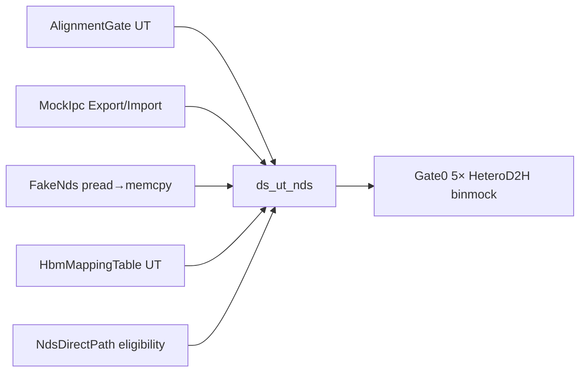
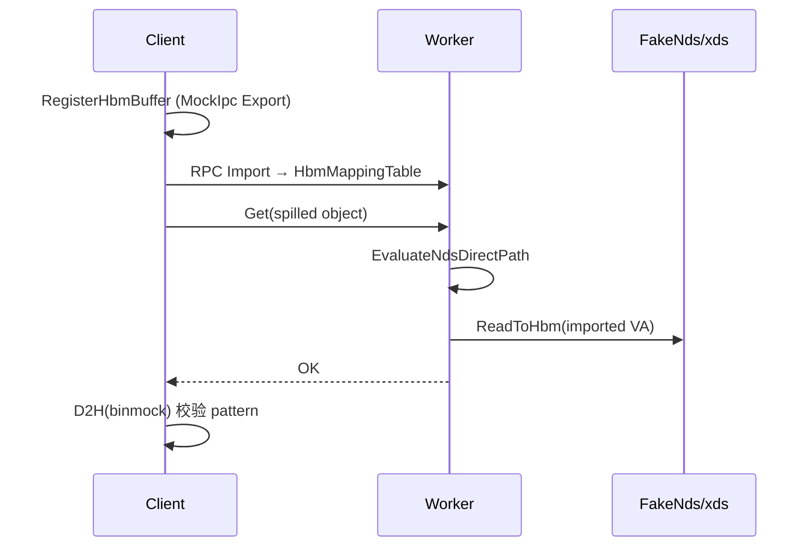

关联 RFC:

+ [2026-07-12-ssd-hbm-direct](README.md): SSD→HBM Direct (NDS)
+ Branch: `feat/ssd-hbm-direct` ← `main/master`
+ PR: [!1312](https://gitcode.com/openeuler/yuanrong-datasystem/merge_requests/1312) · Issue: [#12](https://gitcode.com/yche-huawei/yuanrong-datasystem/issues/12)

# Story 整体设计

## 功能描述

+ **Why**: 本地 **已落盘 spill** 对象今天走 `LoadSpilledObjectToMemory`（SSD→DRAM）再 H2D/RH2D，多一次 DDR 驻留。NDS/xds 支持 NVMe 读进 NPU 物理地址；配合 CANN IPC 可把数据直接落到 Client 已 Import 的 HBM VA，降时延（目标量级 10MB ~30ms→~20ms，待 L2 基准锁定）。
+ **Who**: 使用 KV `Get`/`MGet` + Ascend HBM buffer 的推理业务；无 NPU 的 L0/L1 开发/测试人员（binmock + Fake backend）；L2 真机验证人员（Stage A IPC / Stage B xds）。
+ **When**: 本机 object table hit 且 `IsSpilled()` 且数据**已在 spill 文件**（非 SpillBuffer）、Client 已 `RegisterHbmBuffer`（或内部 comm 路径）、`AlignmentGatePass` 通过、NDS reader 可用时走直通；否则 **DRAM fallback**（现有 `LoadSpilledObjectToMemory`）。
+ **Where**: `common/device/nds`（对齐、Fake/xds reader）、`common/device/hbm_ipc`（IPC 抽象）、`worker/object_cache/hbm_mapping_table`（Import 映射表）、`worker_oc_service_get_impl.cpp`（Get 旁路挂钩点，后续 PR）、Client Register RPC（后续 PR）。
+ **How**: 业务只依赖两个可注入接口：`IpcHbmBackend`（②）与 `NdsSpillReader`（③）。L0/L1 用 `MockIpcHbmBackend` + `FakeNdsSpillReader` + `AclDeviceManagerMock` 串通；L2 换 `CannIpcHbmBackend` + `XdsNdsSpillReader`，不改 Get 分支语义。
+ **What happen**: Phase-1 **不改** spilled→RH2D 禁令、**不做**跨机 SSD→HBM、**不改** spill 写路径。仅新增内部接口、mapping 表、聚焦 UT/Gate0 脚本；Worker 热路径行为在本 PR 不变（旁路后续 issue）。
+ **Experience**: 未 Register 时 SDK 用内部 comm buffer，Get 完成后拷到用户 data，**不暴露** comm VA。对齐失败、SpillBuffer 命中、无 mapping 时静默 fallback，可观测区分 direct vs fallback（Task 8）。

### 术语说明

| 术语 | 含义 |
|------|------|
| NDS / xds | SSD→设备物理地址直通栈（userspace `read_file` + kernel P2P） |
| RegisterHbmBuffer | Client Export IPC → Worker Import，登记 HBM VA |
| SpillBuffer | 尚未 flush 到文件的 spill 内存缓冲；**禁** NDS 直通 |
| AlignmentGate | fileOff/len/hbmAddr 对齐门禁，默认 4KiB |
| DRAM fallback | 不满足直通条件时走 `LoadSpilledObjectToMemory` |

## 场景分析

### 场景 1: Track① PR — 可注入接口 + 聚焦 UT（本 PR）



**验收（xqyun 隔离树）**

| ID | 用例 | 预期 |
|----|------|------|
| UT-1 | `AlignmentGateTest.*` (3) | 4K 通过；不对齐/零长/零 VA 拒绝 |
| UT-2 | `MockIpcHbmBackendTest.*` (3) | Export→Import 同指针；Close 后失败 |
| UT-3 | `FakeNdsSpillReaderTest.*` (2) | 临时文件 pattern 写入 imported VA |
| UT-4 | `HbmMappingTableTest.*` (3) | Register/Lookup；inflight 拒 Unregister |
| UT-5 | `NdsDirectPathTest.*` (3) | SpillBuffer/不对齐→fallback；对齐→DIRECT |
| ST-0 | Gate0 5× `HeteroD2HTest` | binmock MSetD2H/MGetH2D 基线不退化 |

```bash
bash rfc/2026-07-12-ssd-hbm-direct/scripts/verify_track1_xqyun.sh
```

### 场景 2: Register → Get 旁路 → HBM 交付（Task 4b–6，后续 PR）



**验收（待实现）**

| ID | 用例 | 预期 |
|----|------|------|
| E2E-1 | `NdsBinmockFlow*` | Register→spill→Get→pattern match |
| E2E-2 | 未 Register | comm 内部拷贝，API 不返回 comm VA |

### 场景 3: L2 真机穿刺（人工 Stage A/B）

| Stage | 脚本 | 判据 |
|-------|------|------|
| A | `run_stage_a_npu.sh` | 真 CANN IPC Export/Import |
| B | `run_stage_b_nds.sh` | 真 xds SSD→HBM（依赖 A） |

## 分阶段交付（1 PR ↔ 1 issue）

| 阶段 | 交付物 | 跟踪 |
|------|--------|------|
| **PR-1（本 PR）** | 接口 + mapping 表 + UT + Gate0 | GitCode [#12](https://gitcode.com/yche-huawei/yuanrong-datasystem/issues/12) · `Fixes #12` |
| Task 4b | RegisterHbmBuffer RPC | [work-breakdown.md](./work-breakdown.md) · 后续 PR |
| Task 5 | Get 旁路 | 同上 |
| Task 6 | NdsBinmockFlow e2e | 同上 |
| Task 8 | 观测 PerfKey | 同上 |
| L2-A/B | 真 IPC / 真 xds | [docs/env-validation.md](./docs/env-validation.md) · 人工 |

## 测试 Story

### Story 1: 对齐门禁（UT-1，本 PR ✅）

Worker 在调用 NDS reader 前必须用 `AlignmentGatePass` 校验 file offset、length、HBM VA（含 `hbmAddr==0` 拒绝）。默认 4KiB 对齐；不对齐必须走 DRAM fallback，不得硬调 xds。

```bash
./ds_ut_nds --gtest_filter='AlignmentGateTest.*'
```

### Story 2: Mock IPC Export/Import（UT-2，本 PR ✅）

无 CANN 时 `MockIpcHbmBackend` 在同进程模拟 Export→Import：Import 后 local VA 与 Export 源指针一致；Close 后 Import 失败。为后续 Register RPC 提供可测 backend。

### Story 3: Fake NDS 读 spill 到 HBM VA（UT-3，本 PR ✅）

`FakeNdsSpillReader` 用 `pread` 读 spill 文件并 `memcpy` 到 imported VA，支持 file offset 与 dest offset。无 xds 时灌通 ③ 的契约。

### Story 4: HBM 映射表与直通判定（UT-4/5，本 PR ✅）

`HbmMappingTable` 管理 Register 后的 imported mapping；in-flight Get 时拒 Unregister。`EvaluateNdsDirectPath`：SpillBuffer / 不对齐 → `FALLBACK`；已落盘 + 对齐 + 有 mapping → `DIRECT`。

### Story 5: Gate0 binmock 基线不退化（ST-0，本 PR ✅）

隔离树编出 `ds_device_llt` 后，只跑 5 个 `HeteroD2HTest`（见 `gtest_filters.sh`），确认 hetero mock 路径未被 Track① 改动破坏。**禁止**用 `HeteroD2H*` 扫全 suite。

```bash
bash rfc/2026-07-12-ssd-hbm-direct/scripts/run_existing_hetero_st_xqyun.sh
```

### Story 6: Register → Get → pattern 全链路（E2E，后续 PR 待实现）

Client `RegisterHbmBuffer` → Worker Import 填表 → spill 落盘 → Get 走 NDS 旁路 → Client D2H 校验 pattern。未 Register 时走 comm buffer + 拷到 user data，API 不暴露 comm VA。

## 约束

+ 范围：Phase-1 仅本机已落盘 spill；**不改** spilled→RH2D 禁令；**不做**跨机 SSD→HBM。
+ 对齐：`AlignmentGate` 为一等门禁；默认 4K（见 [docs/alignment.md](./docs/alignment.md)）。
+ 验证：xqyun 隔离 worktree + `verify_track1_xqyun.sh`；日志在 `/root/workspace/nds-ssd-hbm-meta/`。
+ 热路径：本 PR **不**改 Worker Get 生产行为；旁路接线留待后续 PR（WBS Task 5）。

## 非目标（本 Story / PR-1）

- 真 CANN IPC、真 xds ioctl
- 跨机 SSD→HBM
- Worker `KeepObjectDataInMemory` 旁路接线
- 全量 `ds_device_llt` / `ctest` 扫描

## 参考文档

| 文档 | 用途 |
|------|------|
| [design.md](./design.md) | 架构与范围闸门 |
| [decisions.md](./decisions.md) | 已锁决策 |
| [docs/](./docs/README.md) | flow、对齐、L2 brief、implementation-plan |
| [test-walkthrough.md](./test-walkthrough.md) | 复现命令 |
| [issue-rfc.md](./issue-rfc.md) | Issue / PR 跟踪 |

# 自验用例

| 测试大类 | 场景 | 用例 | 步骤 | 预期 | 状态 |
| ---- | ---- | ---- | ---- | ---- | ---- |
| 功能正确性 | 4K 对齐 | `AlignmentGateTest.Default4kRejects512AlignedOnly` | fileOff/len/hbmAddr 仅 512B 对齐 | 拒绝 | ✅ xqyun |
| 功能正确性 | 边界 | `AlignmentGateTest.OffByOneFails` | 4K 对齐但 length+1 | 拒绝 | ✅ |
| 功能正确性 | 零长/零 VA | `AlignmentGateTest.ZeroLengthOrAlignRejected` | len=0 或 hbmAddr=0 | 拒绝 | ✅ |
| 功能正确性 | IPC 往返 | `MockIpcHbmBackendTest.ExportImportSamePointer` | Export→Import | 同指针 | ✅ |
| 功能正确性 | IPC 生命周期 | `MockIpcHbmBackendTest.CloseRemovesExport` | Close 后再 Import | 失败 | ✅ |
| 功能正确性 | IPC 复用 | `MockIpcHbmBackendTest.ReExportSameVaReturnsSameHandle` | 同 VA 再 Export | 同 handle | ✅ |
| 功能正确性 | Fake NDS | `FakeNdsSpillReaderTest.ReadToHbmCopiesFileBytes` | 临时文件→imported VA | pattern 一致 | ✅ |
| 功能正确性 | Fake NDS offset | `FakeNdsSpillReaderTest.ReadWithFileOffsetAndDestOff` | 非零 fileOff/destOff | 正确切片 | ✅ |
| 功能正确性 | Mapping 表 | `HbmMappingTableTest.*` (3) | Register/Lookup/Unregister | inflight 拒注销 | ✅ |
| 功能正确性 | 直通判定 | `NdsDirectPathTest.*` (3) | SpillBuffer/不对齐/对齐 | fallback vs DIRECT | ✅ |
| 基线回归 | Gate0 ST | `HeteroD2HTest` ×5 | `run_existing_hetero_st_xqyun.sh` | 5/5 PASS | ✅ |
| 端到端 | binmock 全链路 | `NdsBinmockFlow*` | Register→spill→Get | pattern match | ⏳ WBS Task 6 |
| L2 | CANN IPC | Stage A script | 真 Export/Import | 双向 pattern | ⏳ L2 人工 |
| L2 | xds 直通 | Stage B script | 真 read_file→HBM | 文件==HBM | ⏳ L2 人工 |
