# UB Data Plane Quarantine Story

关联文档:

+ [design.md](./design.md): 隔离语义、状态机、组件设计
+ [flow-analysis.md](./flow-analysis.md): 基于 `main/master`
  `ddba645424a857bbbd14d256cb0b97d3c155ac4f` 的读写、迁移、Rebalance
  代码流分析

# Story 整体设计

## 功能描述

+ Why: 当前系统同时存在 UB 和 TCP 数据路径，UB 主要承担单边写/读类数据搬运。当 UB 多端口、连接、completion 或握手异常时，请求可能通过重试、TCP payload fallback 或迁移重选继续执行，导致成功率下降但故障没有形成明确隔离。该特性要把“UB 不通”转成可观测、可阻断、可恢复的数据面状态，避免持续向异常目的端写入或迁移数据。
+ Who: 使用 Object/KV Client 通过 UB/TCP 访问 worker 的业务；执行 worker-worker remote get、migration、rebalance、hash-ring 迁移的 worker；负责定位 UB 成功率下降、worker 数据面抖动和迁移失败的开发/测试/运维人员。
+ When: `enable_rdma=true` 且本次数据搬运计划走 UB/URMA 时生效。UB 连接失败、写失败、读失败、wait timeout、reconnect 失败或 ERROR 4 端口不可用时，将对应目的端 worker UB path 标为 `UNAVAILABLE`。普通 TCP-only 部署、URMA 未启用路径不进入 UB 隔离；etcd/TCP membership 断链继续由现有集群隔离处理。
+ Where: Client 侧 `ObjectClientImpl`、`ClientWorkerBaseApi`、`ClientWorkerRemoteApi`、`TransportAdvisor`、`DataPlaneManager`；Worker 侧 create/publish/get、worker-worker remote get、migrate service、DataMigrator、NodeSelector、RebalanceExecutor、hash-ring 迁移；恢复侧复用 URMA warmup/handshake 路径。
+ How: 引入按目的 worker 地址建模的轻量 `WorkerUbPathHealth`，状态只有 `AVAILABLE / UNAVAILABLE / PROBING`。当 sender 看到 ERROR 4、reconnect 失败、timeout 或 handshake 失败时，把该目的端 worker 的 UB path 标为 `UNAVAILABLE`。quarantine 是口语含义，指数据面 eligibility 隔离，不是 worker membership 下线：隔离后默认阻断新写入、阻断迁移/rebalance 选择该 worker、读取只剩该 worker 时快速失败。TCP fallback 不作为默认兜底，只能通过显式策略打开，且单次 payload 只有不超过 1 MiB 才允许 fallback，并必须记录降级事件。恢复通过后台 probe 完成，正常业务流量在 `PROBING` 阶段仍被挡住。
+ What happen: 不改变 SDK 对外 API，不替代 etcd membership 状态，不把 worker 从集群 `READY` 中直接摘除。新增的是数据面写可用性状态：worker 可以控制面可达、TCP/RPC 可达，但 UB 数据面被隔离为不可写目标。迁移和 Rebalance 需要把这个状态作为 target eligibility 的一部分。
+ Experience: UB 故障后，业务不再看到“偶发成功、持续降级、日志里才知道 fallback”的隐性状态。写请求要么被快速路由到其他健康 worker，要么明确失败；迁移/Rebalance 不再反复撞同一个坏目标；恢复后通过探测平稳放开，而不是依赖第一波真实业务流量试错。

### 术语说明

| 术语/简写 | 含义 | 本文使用说明 |
| ---- | ---- | ---- |
| UB / URMA | 当前数据面快速传输路径，主要用于单边写/读数据搬运 | 本特性只处理 UB 数据面健康，不替代 TCP/RPC membership |
| destination worker | 本次数据写入、remote get 写回、迁移写入的目的 worker | quarantine 主要按 destination worker 建模 |
| source worker | 读或迁移时持有数据、被拉取的一侧 worker | 读取时需要过滤隔离 source；迁移 direct read 失败也会记录 source 维度 |
| write quarantine | 目的 worker 不再接收新数据写入或迁移写入 | 默认包含 client write、worker-worker write、migration/rebalance target |
| quarantine | 数据面可用性隔离，不是 worker 下线 | worker 可继续 TCP/RPC 可达，但不能作为 UB 写入/迁移目的端；读到它时快速失败 |
| read fail-fast | 当读取必须依赖隔离 source 且无其他健康 location 时直接失败 | 不通过长时间 retry 或静默 TCP fallback 掩盖 |
| TCP fallback | UB 失败后改用 TCP payload 搬运数据 | 默认关闭；显式开启时也只有不超过 1 MiB 的 payload 可切 TCP，且必须可观测 |
| recovery probe | quarantine 后的恢复探测 | 使用 handshake/warmup/小数据传输，成功 N 次后恢复 |

## 双视角故障处理模型

同一次 UB 数据传输按三个角色看最清楚：**Coordinator**、**URMA Operator** 和
**Endpoint**。

+ **Coordinator 视角**: 发起业务动作或 RPC 的一端。它可能自己执行 URMA，也可能只是
  通过 RPC 触发对端执行 URMA。它负责发起前准入、选点过滤、消费返回的 URMA 错误并
  快速失败或重选。
+ **URMA Operator 视角**: 真正调用 `UrmaWritePayload` / `UrmaRead` 的一端。它最先
  知道 ERROR 4、timeout、reconnect 失败等真实原因，负责分类、记录本地 health，并把
  错误传回 Coordinator/Endpoint。
+ **Endpoint 视角**: 被写入/被读取的一端，或将要接收新写入/迁移的 worker。它通过
  RPC status、fallback tracking 或 health publication 学到对端 URMA 失败；未恢复前要
  gate 新写入和迁移，读取则快速失败。

关键机制是 **发起 URMA 单边操作的一端先报错，被操作端学习后做 gate**：

+ 发起 `UrmaWritePayload` / `UrmaRead` 的一端最先知道真实失败原因，比如 ERROR 4、
  timeout、reconnect 失败或 handshake 失败，因此它要快速返回明确错误。
+ 被单边操作的一端不能天然知道对端发生了什么，需要通过当前 RPC response/status、
  fallback tracking 或 worker health publication 学到这个错误。
+ 一旦知道对应 UB path 还没恢复，被操作端要避免继续接受写入或迁移 target 流量。
+ Get 可以尝试读取，但如果数据只在 UB path unavailable 的 worker 上，需要快速返回
  `K_URMA_DATA_WORKER_UNAVAILABLE`，不能靠长超时暴露问题。

### 三角色职责

核心策略是：Coordinator 不选坏路径，URMA Operator 快速上报真实错误，Endpoint 学到错误后
gate 新写入/迁移。

`rdma/urma_resource` 与 `rdma/urma_manager` 的职责保持在传输资源层：维护
URMA context、JFC/JFCE、remote target Jetty、send lane/Jetty pool、event
completion、lane release/retire/recreate。PR1277 引入发送端 Jetty 池化后，
一次业务传输会借一个 `UrmaSendLaneLease`，多个 chunk/event 共用这条 lane，
完成后释放，失败/timeout 后退休或重建。这个机制适合给上层提供结构化失败上下文
（peer、READ/WRITE、CQE status、Jetty id、lane 是否 retired、data size），但
不应该在 `common/rdma` 里直接决定 worker 是否还能接收对象写入。

因此模块协同按下面方式收敛:

+ `common/rdma`: 负责真实 URMA 执行结果、lane/Jetty 本地恢复、ERROR 4/CQE/timeout
  等原始信号。
+ URMA Operator wrapper: 在现有 `UrmaWritePayload` / `UrmaRead` 调用点把 status
  转成 `UbFailureClassifier` 输入，并回传给当前 RPC/业务 response。
+ Coordinator adapter: 写前准入、读 source 过滤、migration/rebalance target 过滤、
  fallback 策略。
+ Endpoint gate: 学到自身 UB path 未恢复时，拒绝新写入和迁移 target；Get 只在有健康
  location 时继续，否则快速失败。

特别地，PR1277 的 send Jetty pool 耗尽更像本地资源压力，应该快速返回/重试或背压，
但不能单独把远端 worker 标成 UB unavailable；ERROR 4、握手失败、reconnect 失败、
连续 timeout 这类 path/port 失败才进入 `WorkerUbPathHealth` 的 `UNAVAILABLE`。

| 场景 | Coordinator | URMA Operator | Endpoint / 后续 gate |
| ---- | ---- | ---- | ---- |
| Client Put/Set | client | client | target worker 学到/自检 UB unavailable 后拒绝新写 |
| Client Get | client | worker | client 学到 receive path 失败后避免继续暴露同一路径 |
| Worker remote get | requester worker | source worker | requester 学到 source->requester 写回失败后避免继续暴露同一路径 |
| Batch remote get | requester worker | source worker | batch 内不要反复 TCP fallback；失败通过 batch response 汇总 |
| Direct migration read source | source/driver worker | target worker | target 返回 failedIds/status，source/driver 避免继续选同一路径 |
| Recovery probe | probe provider | quarantined peer | probe 只传小数据，不承载业务对象；失败只更新健康状态 |

URMA Operator 侧必须避免的静默故障:

+ UB write/read 失败后继续为同一 receiver 准备 TCP payload，导致业务成功但 UB
  成功率持续下降。
+ batch 内多对象重复撞同一个坏 receiver，放大延迟和错误日志。
+ remote get 的 source worker 只看到“本次请求失败”，没有把 requester 作为
  目的端记录到健康状态。

URMA Operator 侧落点:

+ `GetRequest::UbWriteHelper`: worker -> client Get 写回。
+ `WorkerWorkerOCServiceImpl::CheckConnectionStable`: worker-worker UB 连接稳定性检查。
+ `WorkerWorkerOCServiceImpl::WriteViaFastTransport`: worker -> worker remote get 写回。
+ `WorkerWorkerOCServiceImpl::HandlePayloadFallback`: worker -> worker TCP fallback gate。
+ `WorkerOcServiceMigrateImpl::ProcessRemoteReadForObject`: direct migration target
  读 source 失败后，需要把 source/target 维度反馈到健康状态。

### 数据发起端侧应该做什么

数据发起端侧的核心策略是 **do not select or advertise an unhealthy UB path**。

| 发起端场景 | 发起端是谁 | 目的端/Provider | 发起端侧处理 |
| ---- | ---- | ---- | ---- |
| Client Put/Set | client | target worker | client 写前检查 target worker UB path；worker create/admission 也做本地自检 |
| Client Get | client | data worker | client/worker 读路径过滤 UB path unavailable 的唯一 source，无法替代时 fail fast |
| Worker remote get | requester worker | source worker/provider | requester 构造 request 前过滤 source；source provider 负责单边写回 |
| Migration | source/driver worker | target worker | worker-only 流程；NodeSelector/ConnectAndCreateRemoteApi 过滤 target |
| Rebalance | source worker executing task | target worker | worker-only 流程；执行 task 前二次检查 target UB path |

数据发起端侧必须避免的静默故障:

+ worker 已经无法作为可靠写入目的端，但仍在 `Create/MultiCreate` 返回 URMA
  remote addr，让 client 继续写。
+ DataMigrator/NodeSelector 只看 memory 和 membership，把 UB 不通的 worker
  继续选为 target。
+ requester worker 继续向 UB path unavailable 的 source 发 remote get 请求，导致 source
  provider 反复失败或 TCP fallback。

数据发起端侧落点:

+ `WorkerOcServiceCreateImpl::CreateImpl` / `MultiCreateImpl`: worker 是否还允许接收新写。
+ `ClientWorkerBaseApi::SendBufferViaUb`、`ClientWorkerRemoteApi::Publish/MultiPublish`:
  client 侧目的 worker admission 和 fallback gate。
+ `WorkerOcServiceGetImpl::PullObjectDataFromRemoteWorker` /
  `ConstructBatchGetRequest`: requester 过滤 source，且检查自身 receive path。
+ `DataMigrator::ConnectAndCreateRemoteApi`: migration target admission。
+ `NodeSelector::*::SelectNode`: target 候选过滤。
+ `RebalanceExecutor::ValidateTask` / `MigrateToTarget`: stale target 二次检查。

### 状态维度建议

实现上不需要把 provider 和 receiver 做成复杂多维状态。第一版健康状态只按目的端
worker 记录:

| 状态维度 | 含义 | 典型消费者 |
| ---- | ---- | ---- |
| `CheckUbReachable(worker)` | 当前进程是否还应通过 UB 访问该 worker | client Put、Create、Get、migration、rebalance |
| `IsUbReachable(worker)` | 轻量布尔判断，用于过滤候选 worker | read source selection、NodeSelector |
| `MarkUbFailure(worker, op, rc, reason)` | sender 观察到该目的端 UB path 失败 | client/worker UB write、remote get、migration |
| `MarkProbeSuccess/Failure(worker)` | 恢复探测结果 | recovery probe |

写入、迁移 target、remote get source、Get 数据所在 worker 都先按这个 worker 的 UB path
是否可达来判断。这样既覆盖“worker UB 端口坏”，也覆盖“当前 client/worker 到该目的
worker 的中间路径不通”。

## 场景分析

### 场景 1: Client Put/Set 写入远端 worker，UB 写失败后隔离目的端

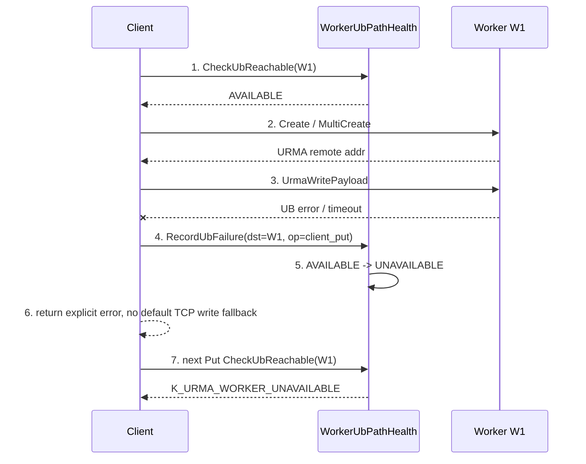

编号含义:

+ 1: Client 在准备写目的 worker 前先检查数据面写可用性。
+ 2: Worker create 阶段会分配对象内存并返回 URMA 写地址；如果本 worker 已被本地标记为不可写，应该在 create 阶段拒绝。
+ 3-4: UB 写失败是隔离信号，记录到目的 worker。
+ 5-7: 目的端 UB path 进入 `UNAVAILABLE` 后，后续写请求不再尝试 UB，也不默认塞 TCP payload。

测试关注:

+ 构造 `UrmaWritePayload` 失败后，后续同目的 worker 的 Put/Create/MultiCreate 应快速返回隔离状态。
+ `Publish` / `MultiPublish` 不应因为 UB 数据没写完就默认用 TCP payload 把写成功率“救回来”，除非显式打开 fallback。
+ 指标中能看到 `client_put`、目的 worker、失败码、quarantine epoch。

### 场景 2: ShmOnly Worker 写入时发现 UB 异常，向 Client 返回异常

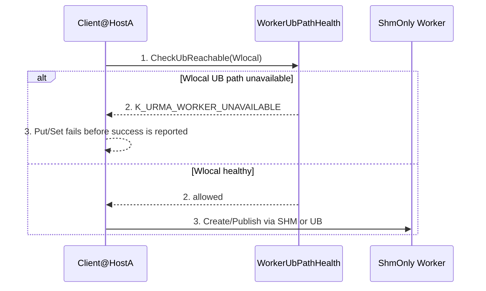

编号含义:

+ 1: 本地场景也要明确做 admission，而不是绕过隔离语义。
+ 2: ShmOnly/本地 SHM 写虽然本机 client 可能可见，但如果 worker UB 已异常，其他 client/worker 后续无法通过 UB 读到这份数据；因此不能把写作为成功提交。
+ 3: Worker/Client 要向调用方返回 UB 数据面异常，而不是产生一个只有本地可见、集群不可读的对象。

测试关注:

+ worker UB quarantine 后，ShmOnly client Put/Set 返回 URMA 数据面异常。
+ 返回失败后不应发布对象元数据，不应让其他 client Get 到一个随后必然失败的 location。
+ 已存在对象的同节点 SHM read 可以按现有能力命中，但不能把该对象声明为对其他节点 UB 可读。

### 场景 3: Client Get 从 worker 读取，worker-to-client UB 写失败

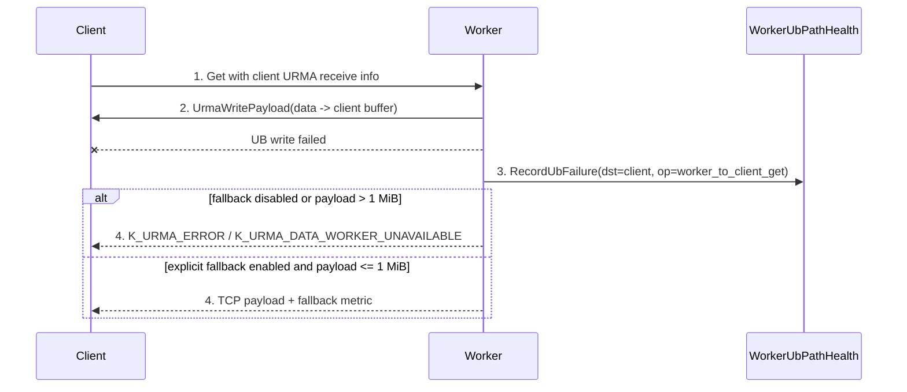

编号含义:

+ 1-2: 读路径的 UB sender 是 worker，destination 是 client receive buffer。
+ 3: 该失败不应直接把 worker 当作写目标隔离，但必须记录为 client-bound UB 失败。
+ 4: 读取 fallback 必须显式开启，并且只允许不超过 1 MiB 的 payload；超过上限直接失败，不能吞掉健康信号。

测试关注:

+ worker `GetRequest::UbWriteHelper` 失败后有明确日志/metric。
+ fallback 关闭时，Get 返回失败而不是自动带 TCP payload 成功。
+ fallback 打开时，只有 payload 不超过 1 MiB 才能成功；fallback 计数、失败码、目的端信息可观测。

### 场景 4: Worker A 从 Worker B remote get，隔离坏 source 或坏 destination

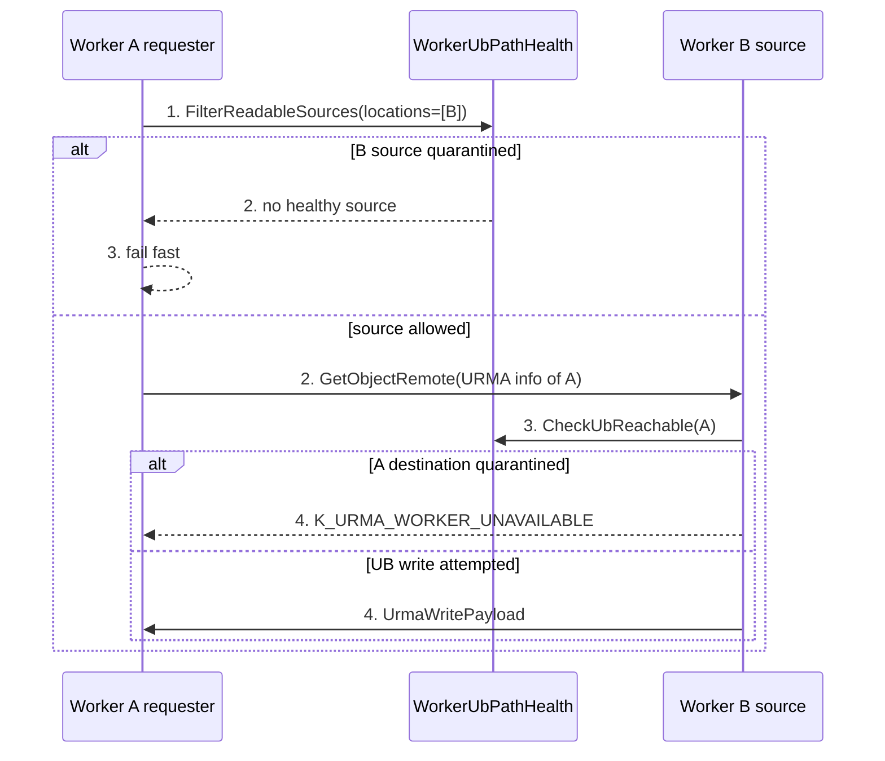

编号含义:

+ 1: requester 在构造 remote get 前过滤 source worker。
+ 2-3: 如果只剩隔离 source，直接失败，不进入 worker-worker RPC 长等待。
+ 3-4: source worker 写回 requester 时，requester 也是一次数据写入目的端；若 requester 被隔离，source 不应默认转 TCP payload。
+ 失败反馈：source worker 作为 `UrmaWritePayload` 发起端先知道 ERROR 4/timeout 等原因，
  需要通过 remote get response/status 告诉 requester；requester 在恢复前不要继续暴露同一
  UB receive path，读不到其他 source 时快速失败。

测试关注:

+ `GetObjectRemote` / `BatchGetObjectRemote` 对 source quarantine 能 fail fast。
+ `CheckConnectionStable` 中反复 `K_URMA_NEED_CONNECT` 或 exchange 失败会进入健康记录。
+ `HandlePayloadFallback` 的 TCP payload 不能让 worker-worker UB 持续降级但业务无感。

### 场景 5: 远端节点 UB 故障后，Client/Worker 避免继续向其写入

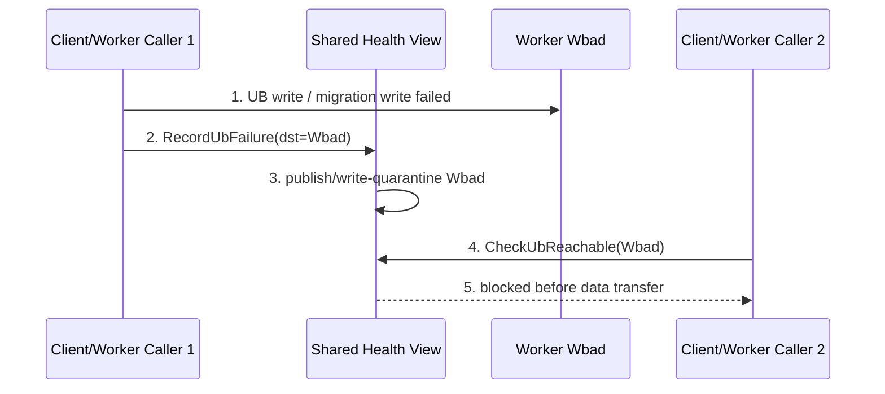

编号含义:

+ 1-2: 一个调用方观察到目的端 UB 故障。
+ 3: 理想状态下，健康信息需要从本地进程扩散到 worker/master 或资源报告，避免只有单个 client 自救。
+ 4-5: 其他调用方在 admission 阶段就挡住，避免继续以真实业务请求探测坏节点。

测试关注:

+ 第一版如果只实现 client-local/worker-local，需要明确作用范围；cluster-wide 隔离需要单独验证传播延迟。
+ 隔离传播后，新的写、迁移、rebalance target 选择都不应命中 `Wbad`。

### 场景 6: Migration 选择目标 worker，目标已隔离时跳过

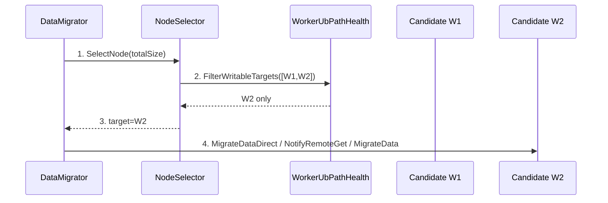

编号含义:

+ 1-2: 迁移 target selection 不能只看 memory/resource/member ready。
+ 3: quarantined target 被加入 exclude，不作为迁移目标。
+ 4: 真正发 RPC 前，`ConnectAndCreateRemoteApi` 还需要二次检查，防止 stale selection。

测试关注:

+ `NodeSelector`、scale-down selector、spill selector 都过滤隔离 target。
+ `ConnectAndCreateRemoteApi` 在目标隔离时快速返回，不创建 remote API，不进入数据搬运。
+ `RedirectMigrateData` 不会把失败对象又选回同一个隔离目标。

### 场景 7: Direct migration 中目标 `UrmaRead` source 失败

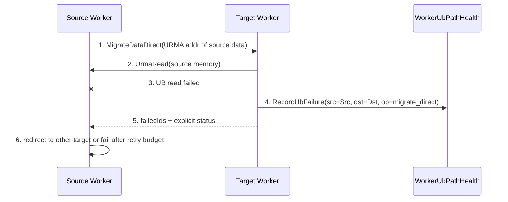

编号含义:

+ 1-2: direct migration 的数据读取由 target 从 source 拉取，不是 source 主动写给 target。
+ 3-4: `UrmaRead` 失败需要同时帮助判断 source pull health 和 target 本地 UB 能力。
+ 5-6: 失败不能只作为普通 per-object failure 吞掉，应带上可诊断状态并参与 redirect exclusion。

测试关注:

+ `MigrateDataDirect` 的 `UrmaRead` 注入失败后，failedIds 正确、对象不切 primary。
+ 同目标连续失败后，source 侧不再继续选择该 target。
+ 如果 source 被标记为不可读，后续迁移不再从该 source 发起 direct pull。

### 场景 8: Rebalance 任务的 target 在执行前变为隔离

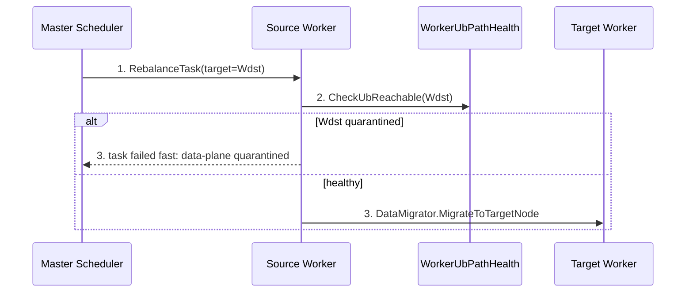

编号含义:

+ 1: master 可能基于稍旧 resource report 派发 task。
+ 2-3: worker 执行前必须做 target health 二次校验，避免 stale master decision 导致真实迁移失败。

测试关注:

+ `RebalanceExecutor::ValidateTask` 或 `MigrateToTarget` 能拒绝隔离 target。
+ Master scheduler 后续应消费 data-plane-ready 信息，减少派发无效任务。
+ 返回码应可区分“资源不足/节点退出”和“数据面隔离”。

### 场景 9: Hash-ring scale-up/scale-down/recovery 触发迁移时遇到隔离节点

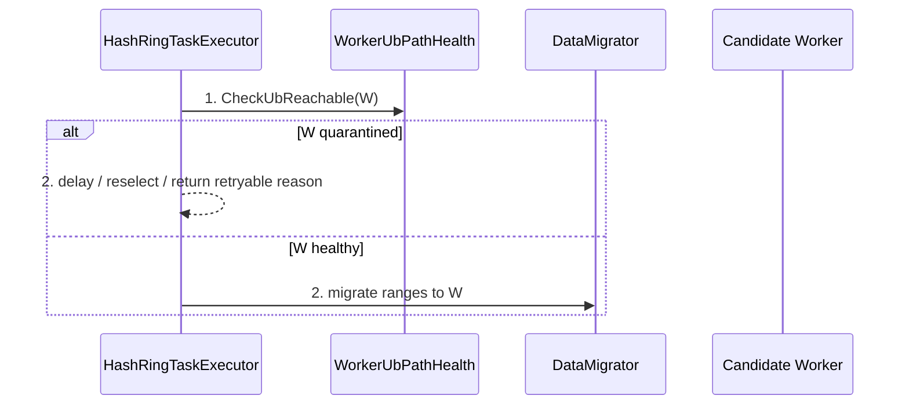

编号含义:

+ 1: hash-ring 任务里的目标 worker 也要视为迁移写入目标。
+ 2: 隔离不是对象级失败，不能让 hash-ring retry loop 无界撞同一目标。

测试关注:

+ scale-up 新节点 UB 不通时，不向该节点迁移数据范围。
+ scale-down/recovery 时，如果替代目标被隔离，应重选或延迟，而不是持续 `K_TRY_AGAIN` 自旋。

### 场景 10: UB 恢复后通过 probe 平稳放开写入

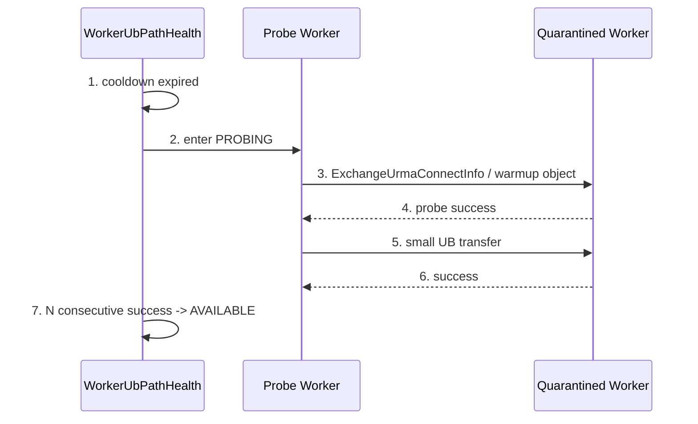

编号含义:

+ 1-2: quarantine 后不由正常业务请求负责试错。
+ 3-6: probe 复用已有 URMA handshake/warmup 能力，避免新增大数据业务语义。
+ 7: 连续成功后清理 cached transporter/connection 状态，正常写入逐步恢复。

测试关注:

+ `PROBING` 阶段正常写请求仍被挡住。
+ probe 失败回到 `UNAVAILABLE` 并指数退避。
+ recovery 后第一批写入不再命中旧坏连接缓存。

### 场景 11: etcd/TCP membership 故障与 UB 数据面故障解耦

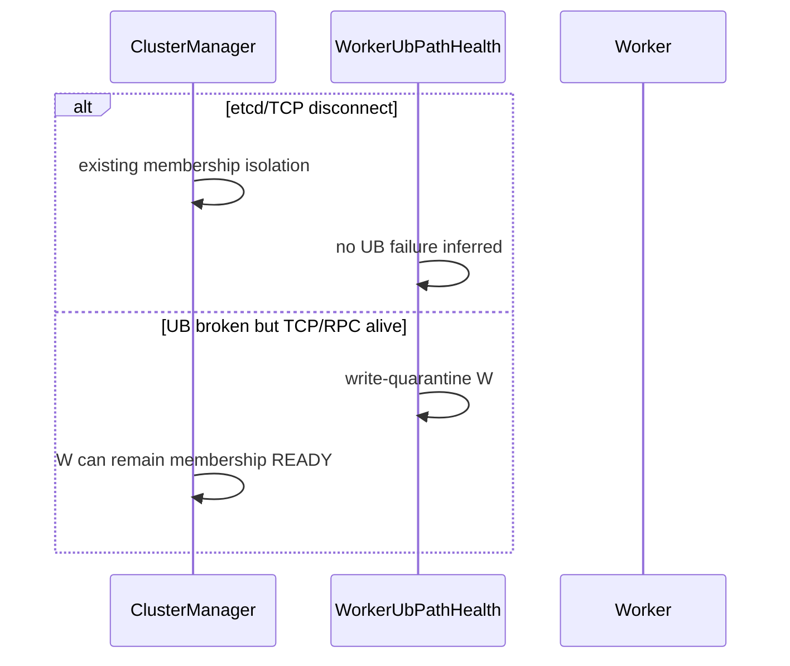

编号含义:

+ etcd/TCP 断链继续由现有 cluster manager、node timeout、network recovery 处理。
+ UB 不通但 RPC 仍通时，不能把 worker 当成整体 dead；它只是数据面写不可用。

测试关注:

+ TCP/RPC 正常、UB 注入失败时，worker membership 不被误摘除，但写 target 被隔离。
+ etcd disconnect 不应被误计入 UB success rate。

### 场景 12: URMA 未启用或 TCP-only 部署

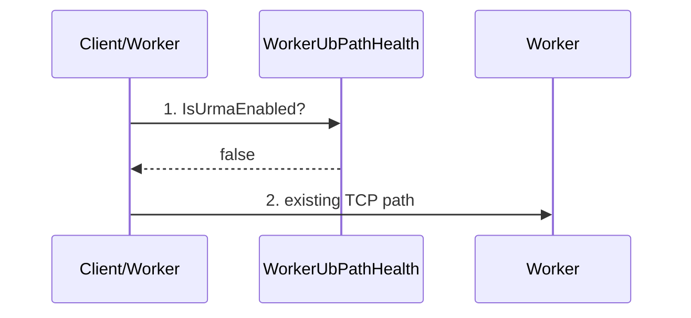

编号含义:

+ URMA 未启用时，不产生 UB quarantine。
+ TCP-only 路径保持现有行为和错误处理，不因为没有 UB 而误报隔离。

测试关注:

+ `enable_rdma=false` 时，新增逻辑不改变现有 TCP read/write/migration 回归。
+ UB-specific metrics 不应在 TCP-only 正常失败中误增。

## Use Case 矩阵

| UC | 触发条件 | 当前风险 | 目标行为 | 默认 TCP fallback |
| ---- | ---- | ---- | ---- | ---- |
| UC-1 Client 远端 Put/Set UB 写失败 | client 写远端 worker，`UrmaWritePayload` 失败/超时 | Publish payload fallback 或下次继续写同一 worker | 记录目的端失败，达到阈值后阻断后续写 | 写 fallback 关闭 |
| UC-2 ShmOnly Worker 写入时 UB 异常 | client 与 worker 同节点，SHM 可用，但 worker UB 已异常 | 本地写成功，其他 client/worker 后续读不到 | 向 client 返回 UB 数据面异常，不提交一个集群不可读对象 | 关闭 |
| UC-3 Client Get，worker-to-client UB 写失败 | worker 写 client receive buffer 失败 | 自动 TCP payload 导致读成功但 UB 降级不明显 | 记录 client-bound 失败；read fallback 策略化 | 读 fallback 可选 |
| UC-4 Worker remote get source 被隔离 | location 只有隔离 source 或候选含隔离 source | 仍发 remote get，等待超时或 fallback | 过滤 source；无健康 source 直接失败 | 读 fallback 可选 |
| UC-5 Worker remote get destination 被隔离 | source worker 需要写回 requester | source 仍尝试 UB/TCP payload | source 端检查 requester write eligibility，隔离则失败 | 默认关闭 |
| UC-6 Migration target 被隔离 | DataMigrator/NodeSelector 选到坏 target | 迁移反复失败、redirect 可能回到坏目标 | target selection 和 RPC 前双重过滤 | 关闭 |
| UC-7 Direct migration `UrmaRead` source 失败 | target 从 source 拉数据失败 | per-object failure 掩盖数据面故障 | 记录 source/destination 健康信号，redirect 避开坏节点 | 关闭 |
| UC-8 Rebalance target 被隔离 | master 派发 target 已过期或 UB 坏 | worker 执行后才失败 | worker fail fast，master 后续消费 data-plane-ready | 关闭 |
| UC-9 Hash-ring 迁移遇到隔离节点 | scale/recovery 目标 UB 不通 | retry loop 反复撞同一节点 | reselect/delay，并返回明确原因 | 关闭 |
| UC-10 UB 恢复 | cooldown 到期 | 用真实业务请求试错 | probe 成功 N 次后恢复写入 | 不适用 |
| UC-11 etcd/TCP 故障 | membership 断链 | 和 UB 健康混淆 | 继续走现有 membership 隔离，不计 UB failure | 不适用 |
| UC-12 TCP-only | `enable_rdma=false` | 新逻辑误伤 TCP 路径 | 行为不变，不产生 UB quarantine | 不适用 |

## 方案详细设计

### 现状分析

当前代码已经能感知很多 URMA 失败，但这些信号分散在不同层:

+ client 写 worker 时，`ClientWorkerBaseApi::SendBufferViaUb` /
  `ClientWorkerRemoteApi::Publish/MultiPublish` 能看到 UB 写失败和 payload
  fallback。
+ worker 写 client 或 worker 写 worker 时，`GetRequest::UbWriteHelper`、
  `WorkerWorkerOCServiceImpl::WriteViaFastTransport`、`HandlePayloadFallback`
  能看到 `UrmaWritePayload` 失败。
+ direct migration 中，target worker 的
  `WorkerOcServiceMigrateImpl::ProcessRemoteReadForObject` 能看到 `UrmaRead`
  source 失败。
+ migration/rebalance 的 target 选择主要看 membership、resource 和排除集合，
  尚未把 UB 数据面可写性作为 eligibility。
+ `rdma/urma_manager` 和 `rdma/urma_resource` 在 PR1277 后能管理 send lane、
  Jetty pool、event completion、lane retire/recreate，但它们不知道对象语义、
  migration 语义，也不应该直接决定 worker 是否可写。

因此当前最大风险不是“没有错误码”，而是“错误码没有形成统一决策”：
一次 UB ERROR 4、timeout 或 reconnect 失败之后，业务可能通过 TCP payload
fallback 成功，后续写入/迁移仍继续选择同一个坏 worker，形成持续静默降级。

### 方案设计

#### 0. 最小化修改原则

第一版只把 UB 故障从“单次请求错误”提升为“目的 worker UB path 状态”，不重做读写、
迁移、rebalance 主流程。

+ 不改 SDK 对外 API，不新增业务必需 RPC。
+ 不把 quarantine 策略放进 `common/rdma`；RDMA 层只提供原始 status/outcome。
+ 不引入复杂 provider/receiver 多维状态，先按 worker address 建模。
+ 不做 per-port/per-device 精细隔离，先隔离目的 worker 的 UB 写入 eligibility。
+ 不默认 TCP fallback；只在现有 fallback 点加统一 policy gate。
+ 不重构现有 selector/transport，只在现有选点、RPC 前、URMA 调用后增加轻量 hook。
+ cluster-wide health publication 作为后续增强；第一版优先保证本进程/本 worker 内不再持续静默失败。

#### 1. 构建

第一版按最小改动新增轻量组件，不把对象策略塞进 `common/rdma`:

+ `UbFailureClassifier`: common/object-cache 侧工具类。输入 `Status`、CQE/provider
  status、operation、reporter role，输出 `SUCCESS`、`PORT_OR_PATH_UNAVAILABLE`、
  `CONNECT_OR_PATH_FAILURE`、`LOCAL_UB_UNAVAILABLE`、`NON_UB_FAILURE`。
+ `WorkerUbPathHealth`: 每个 client/worker 进程内维护按 worker address 建模的
  `AVAILABLE / UNAVAILABLE / PROBING` 状态，提供 `CheckUbReachable`、
  `IsUbReachable`、`MarkUbFailure`、`FilterUbReachableWorkers` 等接口。
+ `UbRecoveryProbe`: worker 优先实现，client 可 lazy probe。复用已有 handshake、
  warmup 或小数据 UB transfer，cooldown 后进入 `PROBING`，连续成功 N 次才恢复。
+ `UbFallbackPolicy`: 统一判断 read/write/migration 是否允许 fallback。默认关闭；
  显式开启时 payload `<= 1 MiB` 才能 TCP fallback，并且 fallback 不清除 UB failure。
+ 状态码: 建议新增 `K_URMA_WORKER_UNAVAILABLE` 和
  `K_URMA_DATA_WORKER_UNAVAILABLE`。前者用于写/迁移目的端被挡，后者用于 Get
  只能依赖 UB unavailable 数据 worker 时 fail-fast。

PR1277 相关边界:

+ `common/rdma` 继续负责 lane acquire/release/retire、Jetty recreate、completion
  原始 status。
+ 如果 PR1277 已合入，优先从 `UrmaEvent`/completion 中向上暴露结构化
  `UbOpOutcome`，包含 peer、operation、CQE status、local Jetty id、data size、
  laneRetired。
+ 如果第一版不改 `common/rdma` 接口，则先在现有 `UrmaWritePayload` /
  `UrmaRead` 调用点按返回 `Status` 分类，后续再补 outcome。
+ send Jetty pool 耗尽导致的 `K_TRY_AGAIN` 是本地资源压力，只做快速返回/背压，
  不单独隔离远端 worker。

最小代码落点:

| 目标 | 最小接入点 | 不做什么 |
| ---- | ---- | ---- |
| Client 写失败后隔离目的 worker | `ClientWorkerBaseApi::SendBufferViaUb` / `ClientWorkerRemoteApi::Publish/MultiPublish` 调用后记录失败，下一次写前查 health | 不重写 `ObjectClientImpl` 整体写路由 |
| Worker 拒绝自身 UB 异常下的新写 | `WorkerOcServiceCreateImpl::CreateImpl/MultiCreateImpl` 返回 URMA addr 前做 self-health gate | 不改 Publish 元数据提交流程 |
| Get/remote get provider 写回失败 | `GetRequest::UbWriteHelper`、`WorkerWorkerOCServiceImpl::WriteViaFastTransport` 后记录 failure，`HandlePayloadFallback` 加 policy | 不重写 GetRequest 生命周期 |
| 读 source 过滤 | `PullObjectDataFromRemoteWorker` / batch request 构造前过滤 location | 不改 master metadata 选择算法 |
| Migration target 过滤 | `NodeSelector::SelectNode`、`DataMigrator::ConnectAndCreateRemoteApi` | 不改迁移协议 |
| Rebalance stale target 拦截 | `RebalanceExecutor::ValidateTask/MigrateToTarget` 执行前二次检查 | 不要求 master 第一版感知 UB health |
| Recovery | 后台/lazy probe 复用 handshake/warmup | 不用真实业务写请求探测恢复 |

#### 2. 部署

生产部署不新增进程，不改变 SDK API。新增能力通过 flag 保守打开:

+ `enable_rdma=true` 时启用 UB health 逻辑；`enable_rdma=false` 或 TCP-only
  路径不产生 UB quarantine。
+ `enable_ub_data_plane_quarantine=true` 建议作为总开关，默认可按发布策略灰度。
+ `enable_transport_fallback=false` 仍为默认；若现有 fallback flag 已存在，则新增
  `ub_fallback_max_payload_size=1MiB` 或复用现有 size cap，但默认不得无限 fallback。
+ `ub_quarantine_cooldown_ms`、`ub_recovery_probe_success_count`、
  `ub_quarantine_failure_threshold` 控制隔离与恢复。ERROR 4 可一击隔离，
  timeout/reconnect 可按阈值隔离。
+ 第一版状态至少在 worker 进程内共享；cluster-wide 扩散可通过 resource report、
  master/resource view 或轻量健康广播作为后续增强。

与现有 etcd/TCP 隔离的关系:

+ etcd/TCP membership 继续表示 worker 是否属于集群、RPC 是否可达。
+ UB path health 只表示该 worker 是否适合作为 UB 数据写入/迁移目的端，或是否能作为
  Get 唯一 source。
+ worker 可以 membership `READY`，但 UB path `UNAVAILABLE`；此时控制面可达，
  数据面写入/迁移被挡。

#### 3. 运行

运行期按三角色协作:

+ Coordinator: 发起业务动作或 RPC。写前检查 target，读前过滤 source，
  migration/rebalance 选择 target 前过滤，收到 URMA 错误后快速失败或重选。
+ URMA Operator: 真正调用 `UrmaWritePayload` / `UrmaRead` 的一端。它最先知道
  ERROR 4、timeout、reconnect 失败，负责 `MarkUbFailure` 并把错误返回给
  Coordinator/Endpoint。
+ Endpoint: 被写入/被读取的一端，或未来要接收写入/迁移的 worker。它通过当前 RPC
  status、fallback tracking 或健康发布学习对端失败，未恢复前 gate 新写入/迁移。

关键运行规则:

+ 写入 admission: `ObjectClientImpl`/client worker api 写目的 worker 前检查
  `CheckUbReachable(targetWorker)`；worker `Create/MultiCreate` 返回 URMA addr 前也做
  本地 self-health 检查。
+ 读取 source 过滤: Get 若有多 location，过滤 UB unavailable source；若只剩一个
  unavailable source，返回 `K_URMA_DATA_WORKER_UNAVAILABLE`。
+ worker-provider 写回: worker->client Get、worker->worker remote get 的 provider
  在执行 `UrmaWritePayload` 后记录失败；fallback 只能按策略执行。
+ migration/rebalance: `NodeSelector`、`ConnectAndCreateRemoteApi`、
  `RebalanceExecutor::ValidateTask/MigrateToTarget` 做 target 二次检查，redirect retry
  把坏 target 加入 exclusion。
+ ShmOnly/local SHM: worker UB 已异常时，不能提交一个只有本机 client 可见、其他
  client/worker 后续无法 UB 读取的对象；应在成功返回前报 UB 数据面异常。
+ recovery: `UNAVAILABLE` 到 cooldown 后进入 `PROBING`。探测期间业务写仍 blocked；
  连续探测成功才回 `AVAILABLE`。

#### 4. 元戎整体如何使用

+ 正常 UB 健康时，Object/KV 读写、remote get、migration、rebalance 保持现有路径。
+ UB 端口或 path 故障时，发起 URMA 的一侧快速拿到真实错误；错误进入
  `WorkerUbPathHealth` 后，后续 client/worker 不再把该 worker 作为写入或迁移目标。
+ 读取遇到数据只在故障 worker 上时直接失败，避免长 timeout 或静默 TCP fallback；
  如果还有健康副本/location，沿现有选择逻辑读取健康 source。
+ migration/rebalance 不再反复撞同一个 UB 坏 target；恢复前任务可失败、延迟或重选，
  由上层调度继续处理。
+ UB 恢复不依赖第一波真实业务请求试错，而由 probe 平稳放开。

#### 5. 代码关键类图、运行视图

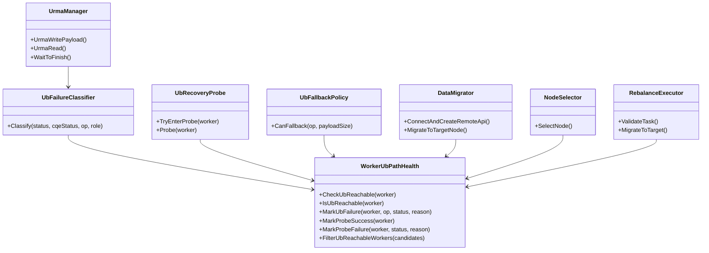

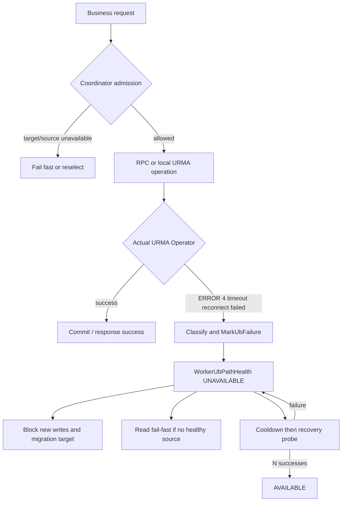

## 测试 Story

### Story 1: Client Put/Set UB 写失败后阻断目的 worker

注入 client->worker `UrmaWritePayload` 返回 ERROR 4 或 `K_URMA_WAIT_TIMEOUT`。
首次请求返回明确 URMA 错误；后续同 target 写入在 admission 阶段返回
`K_URMA_WORKER_UNAVAILABLE` 或重选健康 worker，默认不附带 TCP payload。

### Story 2: ShmOnly Worker UB 异常不提交集群不可读对象

构造 local SHM 可用但 worker self UB health 为 `UNAVAILABLE`。Put/Set 应返回
UB 数据面异常，不发布对象元数据；已存在对象的本地 SHM read 不应改变全局可读性判断。

### Story 3: Client Get / Worker remote get fallback 受策略控制

worker->client 或 source worker->requester 的 `UrmaWritePayload` 失败时，fallback
关闭直接返回失败；fallback 打开且 payload `<= 1 MiB` 才允许 TCP payload，同时记录
UB failure metric。payload 超过上限必须失败。

### Story 4: 多 location 读取过滤隔离 source

对象有多个 location 时，Get 过滤 `UNAVAILABLE` source 并选择健康 location；只有坏
source 时直接返回 `K_URMA_DATA_WORKER_UNAVAILABLE`，不等待 worker-worker remote get
超时。

### Story 5: Migration/Rebalance target 隔离

构造 target worker UB path `UNAVAILABLE`。`NodeSelector` 不选该 target；
`ConnectAndCreateRemoteApi` 做二次检查；已下发的 rebalance stale task 在 worker 执行前
fail fast，redirect retry 不回到同一坏 target。

### Story 6: Recovery probe 平稳恢复

隔离后正常写入仍被挡；cooldown 到期后 probe 执行小数据/handshake，连续成功 N 次后
恢复 `AVAILABLE`。probe 失败回到 `UNAVAILABLE` 并增加 backoff。

## 约束

+ 第一版按 worker address 建模，不做 per-port/per-device 精细隔离。
+ 默认不做 TCP fallback；显式 fallback 也只允许小 payload，并必须可观测。
+ `common/rdma` 不承载对象写入/迁移策略，只提供 URMA 执行结果和资源恢复。
+ etcd/TCP membership 与 UB 数据面健康状态分离。
+ `PROBING` 期间正常业务写仍 blocked，避免用真实写请求做恢复探测。

## 非目标

+ 不替代 worker membership、etcd 断链隔离或 RPC control-plane 失败处理。
+ 不把 worker 从集群 `READY` 中摘除。
+ 不在第一版实现 per-UB-port routing 或多端口局部绕行。
+ 不默认把 UB 故障切 TCP 保成功率。
+ 不改变 SDK 对外 API。

## 验收标准

- [ ] UB 写失败后，目的 worker 在阈值内进入 `UNAVAILABLE`，后续 client/worker 写入快速失败或重选，不继续真实 UB 写。
- [ ] ShmOnly Worker 在 UB 异常时向 Client 返回 URMA 数据面异常，不提交只有本地可见、其他节点无法读取的对象。
- [ ] fallback 默认关闭；若显式开启，只有不超过 1 MiB 的 payload 允许 TCP fallback，并必须产生可观测 metric/log。
- [ ] 读取只剩隔离 source 时快速失败；存在其他健康 location 时优先选择健康 source。
- [ ] worker-worker remote get、batch remote get 的 UB write/fallback 路径都有失败记录和隔离判断。
- [ ] migration target selection、`ConnectAndCreateRemoteApi`、redirect retry 都跳过 UB path unavailable target。
- [ ] Rebalance/hash-ring 迁移执行前检查 target 数据面状态，stale task fail fast。
- [ ] UB recovery 只通过 probe 放开，`PROBING` 阶段正常业务写仍被阻断。
- [ ] etcd/TCP membership 故障和 UB 数据面故障指标、状态、日志分离。
- [ ] TCP-only / URMA disabled 回归行为不变。

## 待确认策略

1. `UNAVAILABLE` 状态第一版是否 cluster-wide 发布。推荐至少 worker 进程内共享；为了避免其他 client/worker 继续打坏目标，需要通过 resource report/master 或轻量健康广播扩散。
2. 状态码是否新增两个 URMA 相关码：`K_URMA_WORKER_UNAVAILABLE` 用于写/迁移目的端隔离，`K_URMA_DATA_WORKER_UNAVAILABLE` 用于数据所在 worker UB 故障导致 Get fail-fast。若第一版只加一个，优先加 `K_URMA_DATA_WORKER_UNAVAILABLE`。
3. 1 MiB fallback 上限是否复用现有 UB max get/part size 配置，还是新增独立 fallback cap flag。默认 fallback 仍关闭。

## 参考文档

| 文档 | 用途 |
| ---- | ---- |
| [design.md](./design.md) | 隔离语义、状态机、模块边界 |
| [flow-analysis.md](./flow-analysis.md) | main/master 读写、迁移、rebalance 代码流分析 |
| [../2026-06-29-urma-send-jetty-lane-isolation/design-and-story.md](../2026-06-29-urma-send-jetty-lane-isolation/design-and-story.md) | PR1277/发送端 Jetty 池化相关 story 结构参考 |
| [../2026-07-01-client-direct-read-routing/design-and-story.md](../2026-07-01-client-direct-read-routing/design-and-story.md) | 读路径 story 结构参考 |
