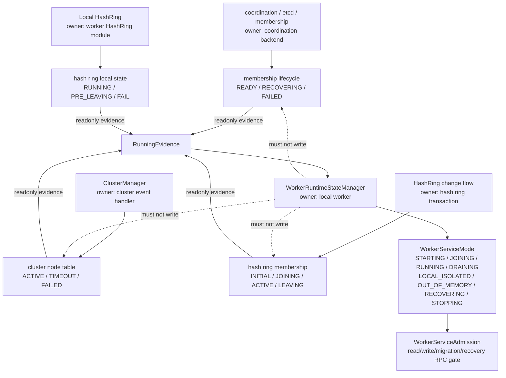
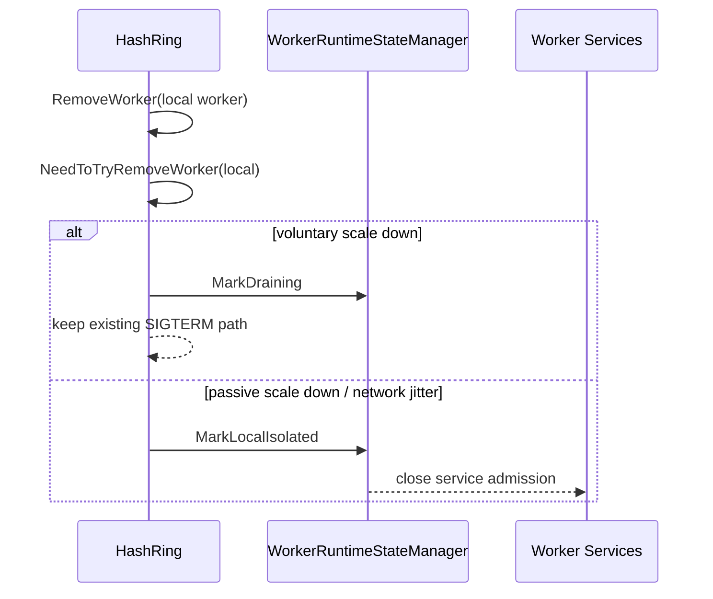
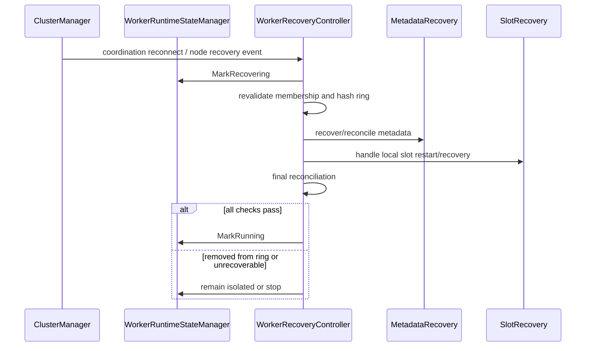
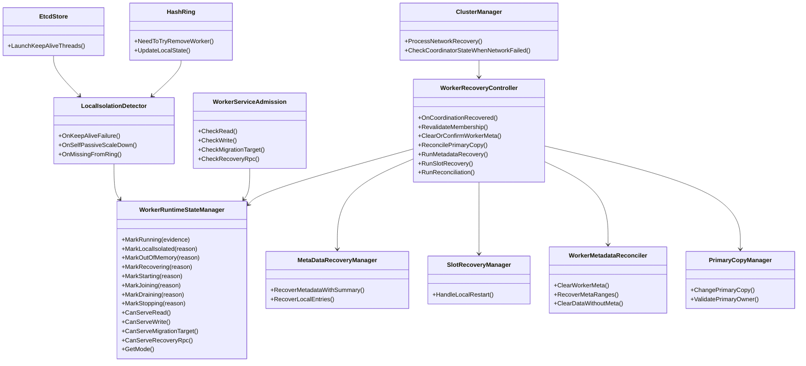

# Worker Isolation Self-Healing Story

关联文档:

+ Source baseline: `main/master`
  `911abcefb36b4ff5e4138ccc5a90f439342dcc24`
+ 相关上一轮 RFC: [UB Data Plane Quarantine](../2026-07-12-ub-data-plane-quarantine/design-and-story.md)

# Story 整体设计

## 功能描述

+ Why: 当前 `auto_del_dead_node=true` 时，worker 发现本地 keepalive/网络隔离或被 hash ring 被动下线后，会通过 `SIGKILL`/`SIGTERM` 退出。网络抖动场景下，这种“自杀”会把一个短暂 TCP/etcd 抖动放大成进程重启、数据迁移、metadata 切主和可见性变化。该特性要把“发现自己被隔离后退出”改成“进入显式隔离状态，停止对外服务，等待 TCP 网络恢复后自愈”。
+ Who: 使用 Object/KV/Stream Client 的业务；依赖 worker 长稳运行、write-back/L2 数据、metadata recovery、slot recovery 的场景；定位 worker 因网络抖动退出、hash ring 被动缩容、元数据切主和数据可见性问题的开发/测试/运维人员。
+ When: `auto_del_dead_node=true` 且 worker 因 keepalive 失败、cluster node remove event、hash ring `del_node_info`、本节点从 ring 消失、被动 scale down 等路径被判定为本地故障时生效。主动缩容、管理员停服、进程真实 crash 不在“避免自杀”范围内。
+ Where: `EtcdStore` keepalive 失败处理；`ClusterManager` node timeout/recovery 处理；`HashRing` local state 和 `RemoveWorker` 路径；`WorkerOCServer` / Object/Stream 服务准入；`MetaDataRecoveryManager`、`SlotRecoveryManager`、reconciliation 事件。
+ How: 抽取轻量 `WorkerServiceMode`，用 `STARTING / JOINING / RUNNING / DRAINING / LOCAL_ISOLATED / OUT_OF_MEMORY / RECOVERING / STOPPING` 明确 worker 对外服务资格。只有被 coordination/etcd、cluster node table、hash ring 和本地恢复流程共同确认的 `RUNNING` 才能正常服务。网络隔离时不 kill 进程，而是进入 `LOCAL_ISOLATED` 并撤销服务资格；网络恢复后进入 `RECOVERING`，完成 membership revalidate、metadata recovery、slot recovery、reconciliation 后才回 `RUNNING`。内存耗尽时进入 `OUT_OF_MEMORY`，阻止继续写入和迁移目标选择，等待资源恢复或进入受控停止。
+ What happen: 保留 voluntary scale down 的正常退出语义；替换 local network isolation/passive scale down caused by jitter 的本地 `SIGKILL` 为状态转换。第一版不重做 hash ring、迁移、metadata recovery，只在现有 kill 点、服务入口和恢复入口加最小 hook。
+ Experience: 短暂网络抖动不会直接导致 worker 退出；业务不会继续访问一个 membership 已不可信的 worker。恢复期间请求快速返回明确状态，恢复完成后 worker 重新服务；如果恢复发现集群已经把该 worker 移除，则按 rejoin/restart 或 `STOPPING` 语义处理。

### 术语说明

| 术语/简写 | 含义 | 本文使用说明 |
| ---- | ---- | ---- |
| self-kill / 自杀 | worker 进程内主动 `raise(SIGKILL)` / `raise(SIGTERM)` 退出 | 本文重点避免网络抖动触发的 `SIGKILL` |
| `auto_del_dead_node` | 当前自动删除故障节点的 flag，默认 true | 代码中实际 flag 名；用户口语中的 `auto_del_node` 指该语义 |
| local network isolation | 本 worker keepalive 失败，但其它节点/coordination store 仍可用 | 应进入 `LOCAL_ISOLATED`，不应直接退出 |
| passive scale down | 其它 worker 认为某 worker failed 后写入 `del_node_info` 的被动下线流程 | 对真实故障仍保留；对本 worker 自己应避免直接 kill |
| runtime state | worker 本地运行状态 | 用于服务准入，不等同于进程是否存活 |
| service admission | 请求入口准入 | 只有 `RUNNING` 可正常读写/迁移；`RECOVERING` 只允许内部恢复 RPC |
| reconciliation / 对账 | 恢复时检查本地数据、master metadata、hash ring、slot recovery 的一致性 | 恢复完成前不对外宣称 RUNNING |

## 现有自杀退出路径分析

### 路径 1: etcd keepalive 失败确认本地网络隔离后 `SIGKILL`

代码位置:

+ `src/datasystem/common/kvstore/etcd/etcd_store.cpp`
+ `EtcdStore::LaunchKeepAliveThreads`

现有逻辑:

```text
keepalive renew 失败
  -> keepAliveTimeout_ = true
  -> 等待 lease 过期窗口
  -> 调用 checkEtcdStateWhenNetworkFailedHandler_
  -> 如果其它节点/coordination store 仍可用，认为是本节点本地网络故障
  -> 连续确认 networkFailedConfirmMinTimes 次
  -> HandleKeepAliveFailed()
  -> 设置 deathTimer
  -> 如果 deathTimer 到期，raise(SIGKILL)
  -> 如果 keepAliveTimeoutTimer > node_dead_timeout_s 且 auto_del_dead_node=true，也 raise(SIGKILL)
```

关键代码语义:

+ `HandleKeepAliveFailed()` 用于模拟/派发 keepalive key 删除事件。
+ `deathTimer` 是“suicide mechanism”的兜底保障。
+ `FLAGS_auto_del_dead_node` 打开时，超过 `node_dead_timeout_s` 会独立触发 `SIGKILL`。

影响:

+ 短暂网络抖动可能导致 worker 进程退出。
+ 进程退出后会触发更重的 restart/rejoin/recovery 路径。
+ 如果本地仍有 write-back/L2 或未完成异步任务，直接 kill 会让数据恢复依赖后续 slot/meta recovery，放大风险。
+ 业务看到的是 worker 掉线，而不是短暂不可服务状态。

### 路径 2: 本 worker 被 hash ring 判定为 passive scale down 后 `SIGKILL`

代码位置:

+ `src/datasystem/worker/hash_ring/hash_ring.cpp`
+ `HashRing::NeedToTryRemoveWorker`
+ `HashRing::RemoveWorkers`

现有逻辑:

```text
ClusterManager 发现 worker timeout/failed
  -> NodeTimeoutEvent
  -> HashRing::RemoveWorkers(failedWorkers)
  -> RemoveWorker(workerAddr)
  -> NeedToTryRemoveWorker(workerAddr)
  -> if workerAddr == local worker:
       SetUnhealthy()
       if state == PRE_LEAVING || voluntaryScaleDownDone:
           raise(SIGTERM)
       else:
           passive scale down
           raise(SIGKILL)
```

这段代码注释里明确写了 passive scale down 场景下发送 `SIGKILL`，目的是避免异步任务卡住。

影响:

+ 本 worker 一旦发现“自己被移除/要被移除”，没有机会进入恢复态。
+ 如果是网络抖动导致其它节点误判，它会把误判固化为真实进程退出。
+ `SIGKILL` 无法做优雅收尾，可能绕过本地恢复/对账前置动作。

### 路径 3: voluntary scale down 完成后的 `SIGTERM`

代码位置:

+ `src/datasystem/worker/hash_ring/hash_ring.cpp`
+ `HashRing::NeedToTryRemoveWorker`

现有逻辑:

```text
workerAddr == local worker
&& (state == PRE_LEAVING || voluntaryScaleDownDone)
  -> raise(SIGTERM)
```

影响:

+ 这是主动缩容/正常退出路径，不属于本需求要禁止的自杀。
+ 方案需要保留 `DRAINING -> STOPPING -> SIGTERM` 语义，避免影响已有 scale down。

### 路径 4: 本 worker 从 ring 消失或进入 `del_node_info` 后进入 `FAIL`

代码位置:

+ `src/datasystem/worker/hash_ring/hash_ring.cpp`
+ `HashRing::UpdateLocalState`

现有逻辑:

```text
UpdateLocalState()
  -> ringInfo.workers 找不到当前 worker:
       state = FAIL
  -> 或 ringInfo.del_node_info 包含当前 worker:
       state = FAIL

后续 RemoveWorkers()
  -> if state == FAIL:
       RemoveWorker(local worker)
       进入路径 2
```

影响:

+ hash ring 视角的 `FAIL` 是 terminate state，后续很难恢复为 RUNNING。
+ 对网络恢复语义不友好：即使 TCP/etcd 后面恢复，本 worker 可能已经自杀或进入不可逆本地状态。

## 现有恢复与元数据重建能力

当前代码里已经有部分恢复能力，本需求应复用，不重做。

| 能力 | 代码入口 | 当前作用 |
| ---- | ---- | ---- |
| 网络恢复事件 | `ClusterManager::ProcessNetworkRecovery` | TIMEOUT/FAILED 节点恢复后触发 reconciliation、migration task recovery 或 request metadata |
| hash ring scale-down 恢复 | `HashRingTaskExecutor::RecoverMetaAndDataOfFaultWorker` | 对 `del_node_info.changed_ranges` 触发 `RecoverMetaRanges` |
| metadata recovery | `MetaDataRecoveryManager` | `enable_metadata_recovery` 打开时，支持从 worker 本地 object table/L2 相关数据恢复 metadata |
| node restart recovery | `WorkerOCServiceImpl::HandleNodeRestartEvent` / `RecoverMetadataOfRestartedWorker` | 节点恢复/重启后请求 worker 发送 metadata |
| slot recovery | `SlotRecoveryManager::HandleLocalRestart` | 本地 restart 后恢复/接管 slot recovery task |
| coordinator backend keepalive | `DsCoordinationBackend::HandleKeepAliveFailure` | 已有“确认本地网络隔离但 keep process alive”的语义，可作为参考 |
| primary copy 切换 | `ChangePrimaryCopy` / `OCNotifyWorkerManager::AsyncChangePrimaryCopy` | 隔离或缩容时把其它 local copy 转成 primary copy |
| worker metadata 清理 | `ClearWorkerMeta` / `StartClearWorkerMeta` | 节点 failed/restart/reconciliation 前清理该 worker 的 master metadata |
| 无 meta 数据清理 | `HashRingEvent::ClearDataWithoutMeta` / `LocalClearDataWithoutMeta` | scale-down/recovery 后清理没有 metadata 支撑的残留数据 |

关键结论:

+ 不是缺恢复模块，而是自杀路径太早，进程退出前没有显式进入恢复/对账语义。
+ 第一版应把 kill 改成 runtime state transition，然后复用现有 recovery/reconciliation。

## 影响与风险

### 业务影响

+ 网络抖动导致 worker 自杀，会让短暂不可达变成长时间不可用。
+ 客户端可能经历 worker 切换、请求失败、metadata owner/data owner 变更。
+ 如果本地 worker 与 client 同节点，进程退出会破坏 SHM/本地读写体验。

### 数据可见性影响

隔离前后可能出现数据可见性不一致:

+ 隔离前本 worker 是 primary，隔离期间集群已切 primary 到其它 worker。
+ 本 worker 本地仍有对象数据，但 master metadata 已删除或指向其它位置。
+ 本 worker 本地版本旧，恢复后不能覆盖 master 上的新版本。
+ write-back/L2 对象本地有数据但 metadata 丢失，需要恢复 metadata。
+ 本 worker 已被写入 `del_node_info` 且部分 scale-down recovery 已执行，恢复时不能直接重新 RUNNING。

建议总语义:

```text
恢复后的可见性以 master/cluster confirmed metadata 为准。
本地数据只有完成 metadata recovery/reconciliation 后才能重新对外可见。
```

### 数据一致性、残留与可用性约束

本特性不能只把 `SIGKILL` 改成“不退出”。进程保活之后，必须显式处理三类约束。

| 约束 | 风险 | 设计原则 |
| ---- | ---- | ---- |
| 数据一致性 | 隔离 worker 上的本地数据可能和 master metadata / primary copy 不一致 | 非 `RUNNING` 不对外提供正常读写；恢复后以 master/cluster confirmed metadata 为准 |
| 数据残留 | worker 恢复后仍残留旧 primary、旧版本、本地有数据但无 meta、或已被 scale-down recovery 接管的数据 | 恢复阶段必须做 reconciliation；旧数据只能降级、恢复 metadata 或清理，不能直接可见 |
| 可用性 | TCP 抖动只影响本 worker，其他 worker 和 etcd/coordination 仍可用；旧逻辑自杀会放大故障 | 本 worker 进入本地隔离并停止服务，其他 worker 继续服务；恢复后再重新加入服务 |

关键语义:

+ **一致性优先于本地可用性**：隔离/恢复期间宁可 fail fast，也不要返回可能和 master metadata 不一致的数据。
+ **残留数据默认不可见**：恢复后本地 object table 中的对象不是天然可见，必须经过 metadata recovery/reconciliation。
+ **隔离 worker 的 metadata 要先从集群视图摘掉**：集群确认 worker failed/isolated 后，master 侧应复用 `ClearWorkerMeta`/`StartClearWorkerMeta` 清理该 worker 对应 metadata，使 client/其它 worker 不再把它当可服务的数据位置。
+ **其它 local copy 可以升 primary**：隔离前如果该 worker 是 primary，现有 `ChangePrimaryCopy` 机制可以把其它 local copy 转成 primary copy。恢复时该 worker 不能凭旧本地状态抢回 primary，只能按 master confirmed metadata 降级为副本、清理残留或重新恢复 metadata。
+ **集群可用性不被单点抖动拖垮**：如果只有本 worker TCP/etcd 断链，其他 worker 没断，其他 worker 继续按现有 membership/ring 服务；本 worker 不自杀但也不服务。
+ **远端故障处理保留**：其它 worker 确认某个远端 worker failed 后，仍可走现有 passive scale down；第一版只改变“本 worker 自己因为隔离而 kill 自己”的路径。

### 运维/DFX 影响

+ 不自杀后，worker 进程仍在，但不代表可服务；需要明确 runtime state 指标。
+ 需要区分 `process alive`、`coordination alive`、`membership confirmed`、`service admitted`。
+ 需要日志能说明为何进入 `LOCAL_ISOLATED`、何时进入 `RECOVERING`、恢复卡在哪个阶段。

## 方案详细设计

### 现状问题抽象

旧语义用进程死亡隐式保证一致性:

```text
发现本地隔离/被动下线
  -> kill worker
  -> 依赖集群把它当 failed/restart 处理
```

新语义应改为显式状态:

```text
发现本地隔离/被动下线
  -> worker 进程保活
  -> runtime state = LOCAL_ISOLATED
  -> 服务准入关闭
  -> 网络恢复后 runtime state = RECOVERING
  -> metadata/slot/reconciliation 完成
  -> runtime state = RUNNING
```

### 与 UB data-plane quarantine 的边界

本 RFC 与 `2026-07-12-ub-data-plane-quarantine` 解决的是相邻但不同的问题。

| 维度 | UB data-plane quarantine | Worker isolation self-healing |
| ---- | ---- | ---- |
| 触发对象 | UB/URMA data-plane path、目的 worker UB 端口、单边写失败 | worker 进程发现自己被 TCP/etcd/coordination/hash ring 隔离或处于本地问题态 |
| 核心目标 | 避免继续向 UB 故障 worker 写入/迁移，默认不 fallback 到 TCP | 避免网络抖动导致 worker 自杀；用本地 service mode、恢复和 ownership 对账代替 kill |
| 状态 owner | higher-level UB path health/admission，`common/rdma` 只提供 URMA outcome/resource | worker runtime/admission，本地只消费 cluster/ring/meta evidence |
| 默认写语义 | 故障 worker 被隔离后默认不能写；fallback 仅显式开启且受大小策略限制 | 非 `RUNNING` worker 默认不能写；`DRAINING/OUT_OF_MEMORY/LOCAL_ISOLATED/RECOVERING` 都拒绝新增写入 |
| 恢复条件 | UB path probe/URMA 状态恢复后解除 data-plane 隔离 | coordination/ring/meta/data ownership 全部对账后才 `RUNNING` |
| 数据归属 | 不决定 primary/local copy/L2 归属，只影响是否允许使用某条 data-plane 写路径 | 必须判断 cluster meta 和本地 data ownership，决定恢复、降级、清理或重新可见 |

协同关系:

+ UB quarantine 可以作为 `WorkerServiceMode` 的外部 evidence：若本 worker 作为数据提供端的 UB 故障且策略要求 hard quarantine，则本地或远端 admission 需要拒绝写入/迁移 target。
+ 本 RFC 不把 UB fallback 策略内嵌进 worker runtime state。是否 fallback TCP 仍由 UB quarantine 的 `UbFallbackPolicy` 决定，且默认关闭。
+ 两个 RFC 都遵循同一个原则：**宁可快速显式失败，也不要让静默故障持续降低成功率或制造不一致数据**。
+ 如果同时发生 UB 故障和 TCP/coordination 隔离，优先以更保守的状态生效：普通读写/迁移 target 均拒绝，恢复后再按 UB path health 与 meta/data ownership 双重对账开放。

### 关联流程清单

本特性只改“本地隔离后的进程生死和服务准入”，但会影响多个现有流程的语义边界。

| 流程 | 现有行为 | 新语义 |
| ---- | ---- | ---- |
| etcd/coordination keepalive | 本地 keepalive 失败确认后可能 `SIGKILL` | 进入本地隔离，撤销服务资格，等待 reconnect |
| cluster node remove event | 本 worker 可能被标 timeout/failed | 只作为隔离/恢复输入，不直接代表进程必须退出 |
| hash ring `UpdateLocalState` | 找不到自己或进入 `del_node_info` 后进入 `FAIL` | `FAIL` 不能再直接等价于 kill；转成本地 service mode 的 isolated/recovering |
| hash ring passive scale down | local worker self path 会 `SIGKILL` | local self path 不 kill；远端 failed worker passive scale down 保留 |
| voluntary scale down | `PRE_LEAVING` / `voluntaryScaleDownDone` 后 `SIGTERM` | 保留，缩容中进入 `DRAINING`，完成后进入 `STOPPING` |
| Object/KV write | worker 还活着可能仍接请求 | 只有 service mode RUNNING 才允许 Create/Put/Publish/Set |
| Object/KV read | 本地残留数据可能被读到 | 第一版非 RUNNING 保守拒绝普通 Get |
| migration/rebalance target | 隔离 worker 可能被选中 | 非 RUNNING 不允许作为 target |
| metadata recovery | restart/recovery 时按事件触发 | 网络恢复后进入 recovering 阶段统一编排 |
| slot recovery | restart 后处理本地 slot 恢复 | recovering 阶段复用，完成前不 RUNNING |
| clear data without meta | scale down/recovery 期间清理无 meta 数据 | 作为残留治理的一部分，恢复对账时复用 |

### 当前状态表达的视角区分

代码里不是完全没有 worker 状态，而是状态分散在不同决策主体。设计上必须区分
**集群/coordination 决策状态** 和 **worker 本地服务状态**，否则很容易把“集群认为我是谁”
和“我现在能不能服务”混成一个状态。

| 状态类别 | 决策主体/写入方 | 现有状态 | 语义边界 | 本需求中的用法 |
| ---- | ---- | ---- | ---- | ---- |
| membership lifecycle | coordinator / etcd / coordination backend | `STARTING / RESTARTING / RECOVERING / READY / EXITING / DOWNGRADE_RESTARTING / FAILED` | 节点注册、恢复、退出的生命周期，不直接等价于业务服务准入 | 作为 worker 是否具备集群身份的 evidence |
| cluster node table | ClusterManager 基于 coordination 事件维护 | `ACTIVE / TIMEOUT / FAILED` | 集群对某个 worker 可达性/故障状态的判断 | 作为其它节点是否应继续访问该 worker 的依据 |
| hash ring membership | hash ring 变更流程 / master 或分布式 ring 决策 | proto: `INITIAL / JOINING / ACTIVE / LEAVING` | worker 是否在 ring 上以及是否参与 scale in/out | 作为数据路由、迁移/rebalance 候选的依据 |
| hash ring local state | worker 本地 HashRing 模块根据 ring 视图推导 | `NO_INIT / INIT / PRE_RUNNING / RUNNING / PRE_LEAVING / FAIL` | 本地 hash ring 是否可用、当前 worker 是否在 ring 内；`FAIL` 当前接近终态 | 作为本地发现“自己不该服务”的输入，不直接触发自杀 |
| worker service mode | worker 进程本地 runtime/admission 模块 | 新增 `STARTING / JOINING / RUNNING / DRAINING / LOCAL_ISOLATED / OUT_OF_MEMORY / RECOVERING / STOPPING` | 当前进程是否允许普通读写、迁移 target、恢复 RPC | 作为所有 worker service 入口的最终准入门禁 |

### 状态 owner、写权限与消费关系

为了避免实现时把 evidence 和 mutable state 混在一起，状态关系按 owner 拆开:

| 状态/数据 | 决策者 | 允许写入/修改者 | worker 本地消费方式 | 消费是否只读 | worker 内部允许改什么 |
| ---- | ---- | ---- | ---- | ---- | ---- |
| membership lifecycle | coordination backend 基于 keepalive、restart/recover/exit 流程决策 | coordination backend / etcd 事务路径 | 读取本 worker 是否 `READY/RECOVERING/FAILED`，作为 `RunningEvidence` | 是。业务 worker 不应绕过 coordination 直接改 lifecycle | 只能通过已有 `UpdateNodeState` 等受控入口表达 restart/recover/exit 意图 |
| cluster node table | ClusterManager 根据 membership/etcd event、timeout/recovery event 决策 | ClusterManager 事件处理线程 | 判断本 worker 或远端 worker 是否 `ACTIVE/TIMEOUT/FAILED` | 是。服务入口只读消费 | 本 worker 可以触发本地 isolation/recovery 流程，但不能直接把自己改成 `ACTIVE` |
| hash ring membership/proto | hash ring 变更流程、scale in/out、master/分布式 ring 决策 | HashRing 变更事务、scale down/recovery task | 判断 worker 是否在 ring、是否在 `del_node_info`，决定路由/迁移/rebalance 候选 | 是。admission/recovery 只读消费 | 不能因本地恢复直接把自己加入 ring；只能走既有 join/rejoin/recovery 流程 |
| hash ring local state | 本地 HashRing 根据 ring snapshot 推导 | 本地 HashRing 模块 | 发现自己 `FAIL`、不在 ring、被动 scale down self 时关闭本地服务 | 对其它模块只读；HashRing 自己可维护 | 可把 self kill 改成通知 `LocalIsolationDetector`，但不承担服务准入最终决策 |
| worker service mode | worker 本地 runtime/admission 决策 | `WorkerRuntimeStateManager` | 所有 worker service 入口调用 `CanServe*` | 其它模块只读；runtime manager 内部可写 | 可以在 `STARTING / JOINING / RUNNING / DRAINING / LOCAL_ISOLATED / OUT_OF_MEMORY / RECOVERING / STOPPING` 间切换 |
| metadata primary/copy 状态 | master metadata manager 基于 object metadata、copy、recovery 决策 | master metadata manager / `ChangePrimaryCopy` / recovery task | 恢复阶段读取并对账本地旧 primary、本地残留数据 | 对 worker 本地恢复流程只读，除非通过已有 RPC/task 请求 master 更新 | 本地只能降级/清理自己的旧状态，不能覆盖 master primary |

简化为一句话:

```text
集群状态由集群组件决策，worker service mode 由本地 worker 决策；
worker service mode 可以更保守地拒绝服务，但不能更激进地声明自己可服务。
```

缺口:

+ `process alive` 和 `service admitted` 没有被显式拆开。现在进程活着时，请求入口很难统一判断是否应该服务。
+ `READY`、`ACTIVE`、`RUNNING`、`FAIL`、`FAILED`、`TIMEOUT` 各自属于不同视角，不能直接作为“本 worker 是否能读写/迁移”的唯一依据。
+ cluster node table、hash ring membership 代表 coordinator/集群侧决策；worker 本地不能用一个本地变量覆盖这些事实。
+ 缺少 `LOCAL_ISOLATED` 这样的本地服务态：确认自己被网络隔离时，进程应该活着，但普通读写、迁移 target、rebalance target 必须被关闭。
+ 缺少恢复 admission gate：网络恢复后不能立刻 `READY/RUNNING`，必须完成 metadata 清理/恢复、primary copy 对账、slot recovery 后再开放服务。

因此本 RFC 不建议重构现有状态体系，只新增一个轻量本地 `WorkerServiceMode`，作为各入口的最终准入门禁。现有 membership/ring/cluster node state 继续由原模块/原决策主体维护，`WorkerServiceMode` 只消费这些状态作为 evidence，不反向伪造集群状态。

推荐的关系是:

```text
coordinator/etcd/membership/hash ring 决策
  -> 产出 cluster node table / hash ring / lifecycle 状态
  -> worker 本地只读消费这些状态作为 RunningEvidence
  -> WorkerServiceMode 决定本进程是否接普通请求
```

状态关联规则:

+ `WorkerServiceMode=RUNNING` 必须满足集群 evidence；它不是单纯本地心跳正常。
+ `WorkerServiceMode=LOCAL_ISOLATED` 可以由本地 keepalive/coordination 异常主动进入，即使集群侧还没把该 worker 标 failed。
+ `WorkerServiceMode=RECOVERING` 只能说明本地正在恢复/对账，不能说明 cluster node table 已经 `ACTIVE` 或 ring membership 已经 `ACTIVE`。
+ cluster node table 中远端 worker `FAILED/TIMEOUT` 可以被 client/worker 路由和迁移逻辑消费，用于避免继续访问该 worker。
+ hash ring membership 仍是数据路由和迁移/rebalance 的主依据；service mode 只额外过滤“本进程是否能接请求/能否作为 target”。



### Worker 数据归属判断

`WorkerServiceMode` 只说明本 worker 当前是否能服务，不说明它在集群里是否拥有数据。
本需求还需要独立判断 **cluster meta 归属** 和 **worker 本地数据归属**，用于隔离、
恢复、OOM、scale-in/rebalance 时决定是否允许读、写、迁移、清理和 metadata recovery。

建议抽象成两个只读快照:

```cpp
struct ClusterMetaOwnership {
    bool inClusterMeta;
    bool isPrimaryOwner;
    bool isLocalCopyLocation;
    bool hasL2Reference;
    uint64_t metaVersion;
};

struct LocalDataOwnership {
    bool hasLocalObjectEntry;
    bool localStateIsPrimary;
    bool hasLocalCopy;
    bool hasL2Object;
    uint64_t localVersion;
};
```

状态来源和写权限:

| 归属维度 | owner/决策者 | 当前代码线索 | worker 本地消费方式 | worker 是否可直接修改 |
| ---- | ---- | ---- | ---- | ---- |
| cluster meta 是否存在 | master metadata manager | `ObjectMetaPb`、`PureQueryMeta`、`CheckObjectDataLocation` | 判断本地数据是否仍被集群承认 | 否，只能通过已有 master RPC/task |
| primary owner | master metadata manager | `ObjectMetaPb.primary_address`、`ReplacePrimary`、`ChangePrimaryCopy` | 判断本 worker 是否是 primary，可否执行 primary-only 操作 | 否，本地旧 primary 只能降级/清理，不能覆盖 master |
| local copy location | master metadata manager | `MetaForMigrationPb.locations/new_locations`、`CreateCopyMeta`、`DeleteAllCopyMeta` | 判断本 worker 是否只是副本位置 | 否，只能通过 copy meta 更新流程 |
| L2/二级存储引用 | master metadata + worker L2/persistence | `need_l2cache_ids`、`wait_async_to_l2_elements`、`MetadataRecoverySelector(includeL2CacheIds)`、`MigrateL2CacheBySlot` | 判断是否可从 L2 恢复 metadata/data，或迁移 L2 slot | 本地只能清理/迁移/恢复本地 L2 数据，metadata 仍以 master 为准 |
| 本地 object table 条目 | worker object table | `MetaDataRecoveryManager`、`ObjectTable`、`stateInfo.IsPrimaryCopy()` | 恢复时发现本地残留、primary/local copy 状态 | 可本地降级、清理、恢复 entry，但对外可见必须等 master meta 对账 |

归属判断结论不应塞进 `WorkerServiceMode`。推荐恢复阶段单独生成:

```cpp
enum class WorkerClusterOwnership {
    NO_CLUSTER_META,
    CLUSTER_PRIMARY_OWNER,
    CLUSTER_LOCAL_COPY_OWNER,
    CLUSTER_L2_ONLY,
    CLUSTER_META_MOVING,
};

enum class WorkerLocalDataRole {
    NO_LOCAL_DATA,
    LOCAL_PRIMARY_COPY,
    LOCAL_SECONDARY_COPY,
    LOCAL_L2_ONLY,
    LOCAL_STALE_OR_ORPHAN,
};
```

对账规则:

| cluster meta 归属 | 本地数据归属 | 处理策略 | 对外可见性 |
| ---- | ---- | ---- | ---- |
| `CLUSTER_PRIMARY_OWNER` | `LOCAL_PRIMARY_COPY` 且版本一致 | 可作为 `RUNNING` evidence 的一部分 | `RUNNING` 后可读写 |
| `CLUSTER_PRIMARY_OWNER` | 本地无数据或版本落后 | 进入 `RECOVERING`，从其它 copy/L2 或恢复流程补齐；失败则更新 meta 或报错 | 恢复前不可见 |
| `CLUSTER_LOCAL_COPY_OWNER` | `LOCAL_SECONDARY_COPY` | 只能作为副本/读优化，不执行 primary-only 写 | 取决于 service mode 和读一致性策略 |
| `CLUSTER_LOCAL_COPY_OWNER` | 本地旧 primary | 本地降级为 local copy，必要时执行 `ChangePrimaryCopy(false)` 等价动作 | 不可按 primary 对外 |
| `CLUSTER_L2_ONLY` | `LOCAL_L2_ONLY` | 可参与 metadata recovery 或 L2 slot migration | recovery 成功前不可作为普通内存 copy |
| `NO_CLUSTER_META` | 本地有 object/L2 数据 | 视为残留；满足 metadata recovery 条件才重建 meta，否则 `ClearDataWithoutMeta` | 默认不可见 |
| meta 指向其它 worker primary | 本地有 primary/local copy | 以 master meta 为准，本地降级或清理 | 不能覆盖集群 primary |
| meta moving / migration 中 | 任意本地数据 | 等待/重试/redirect，不直接开放服务 | 不新增可见性 |

这层判断回答三个问题:

+ **我是否还在集群 meta 里**：由 master metadata 决策。
+ **我是 primary 还是 local copy**：由 `primary_address` 和 copy locations 决策。
+ **我是否只有二级存储数据**：由 L2 metadata/本地 persistence 共同确认，但对外可见仍需 master meta。

隔离恢复时的关键语义:

+ `LOCAL_ISOLATED`/`RECOVERING` worker 即使本地有 primary 数据，也不能直接读写。
+ 如果隔离期间其它 local copy 已升 primary，恢复 worker 的本地 primary 必须降级或清理。
+ 如果 cluster meta 已清理本 worker，但本地还有 L2 或 object table 残留，默认不可见；只有 metadata recovery 成功后才重新可见。
+ OOM 时 cluster meta 可能仍指向本 worker，但 `OUT_OF_MEMORY` 应拒绝新增写入和迁移 target，避免数据继续堆到该 worker。

本地 worker 可以主动做的事情只有:

+ 发现自己 keepalive/coordination 不可信时，进入 `LOCAL_ISOLATED` 并关闭服务入口。
+ 发现网络恢复后，进入 `RECOVERING` 并触发本地恢复/对账。
+ 在集群证据重新满足后，进入 `RUNNING`。

本地 worker 不应该做的事情:

+ 不能仅凭本地网络恢复就把 cluster node table 改成 `ACTIVE`。
+ 不能仅凭本地数据存在就把 hash ring membership 改成 `ACTIVE`。
+ 不能在 master metadata 已切 primary 后，用本地旧 primary 状态覆盖集群事实。

### 核心模块抽象

#### 1. `WorkerRuntimeStateManager`

负责 worker 本地服务门禁和恢复阶段。为了简化状态管理，第一版不复制
cluster node state、hash ring state、etcd lease state；这些仍由原模块持有。
`WorkerRuntimeStateManager` 只维护一个本地 **service mode**，并从现有模块读取
`RunningEvidence` 做准入。它是 worker 自己的状态，不是 coordinator 状态，也不是
hash ring 状态。

充分识别启动、扩缩容、隔离、OOM、恢复和停止后，推荐把 worker 本地对外状态压缩成八个服务态:

```text
STARTING
JOINING
RUNNING
DRAINING
LOCAL_ISOLATED
OUT_OF_MEMORY
RECOVERING
STOPPING
```

状态语义:

| 状态 | 进入依据 | 正常读 | 正常写 | 迁移/rebalance target | 内部 RPC | 说明 |
| ---- | ---- | ---- | ---- | ---- | ---- | ---- |
| `STARTING` | 进程已启动但 service 未 ready，例如 `CommonServer::Start`、端口监听、`SetWorkerReady`、ready file 之前 | 否 | 否 | 否 | 仅健康检查/诊断 | 覆盖“服务没就绪”，避免启动期被 client/worker 当成可服务节点 |
| `JOINING` | hash ring 处于 `PRE_RUNNING`，或 ring membership 为 `INITIAL/JOINING`，或 `add_node_info` 涉及本 worker | 通常否 | 否 | 仅允许 scale-out/migration 接收所需内部 RPC | scale-out/migration 允许 | 覆盖扩容加入中；不把它等同 `RUNNING` |
| `RUNNING` | coordination、cluster node table、hash ring、恢复/对账全部满足 | 是 | 是 | 是 | 是 | 唯一完整服务态 |
| `DRAINING` | 主动 scale-in / voluntary scale down / ring `PRE_LEAVING` / membership `PRE_LEAVING/LEAVING` | 可按现有 metadata 路径保守允许读 | 否 | 否 | scale-in/migration/cleanup 允许 | 覆盖缩容退出中；现有 `VerifyLeavingState` 已体现“写拒绝、读仍可能有效” |
| `LOCAL_ISOLATED` | 本地 keepalive/coordination 不可信，或 self passive scale down 路径确认本 worker 被隔离 | 否 | 否 | 否 | 仅诊断/最小恢复探测 | 进程保活但服务资格撤销 |
| `OUT_OF_MEMORY` | 本地分配路径返回 `K_OUT_OF_MEMORY`，或内存水位/共享内存/tenant arena 达到不可继续写入阈值 | 可按已有 metadata 保守允许读 | 否 | 否 | cleanup/evict/free/diagnostic 允许 | 资源保护态；membership 可能仍健康，但不能继续制造新数据或接收迁移 |
| `RECOVERING` | 网络恢复后，正在 membership revalidate、metadata recovery、slot recovery、primary/copy 对账 | 否 | 否 | 否 | recovery RPC 允许 | 恢复完成前不能服务 |
| `STOPPING` | 管理员停服、SIGTERM、缩容完成后退出、不可恢复错误决定退出 | 否 | 否 | 否 | shutdown/cleanup 允许 | 表达进程正在退出，不参与自愈 |

为什么这是最小集合:

+ `STARTING` 不能省：否则服务未 ready 与恢复态混在一起，client 可能过早访问。
+ `JOINING` 不能省：扩容加入中需要内部迁移/接收能力，但不能完整对外服务。
+ `DRAINING` 不能省：缩容退出中读写语义不同，现有代码已经有 `VerifyLeavingState` 拦截写请求。
+ `LOCAL_ISOLATED` 不能省：这是本需求要替代 self-kill 的核心状态。
+ `OUT_OF_MEMORY` 不能省：OOM 时 membership/ring 可能仍是健康的，但继续写入或接收迁移会放大故障；它需要独立的资源保护语义。
+ `RECOVERING` 不能省：网络恢复不等于数据/metadata 已对账。
+ `STOPPING` 不能省：主动停服/缩容完成要保留退出语义，不能被隔离自愈逻辑误恢复。
+ `RUNNING` 是唯一完整服务态。

现有代码信号到本地状态的映射:

| 现有信号/流程 | 建议本地状态 | 备注 |
| ---- | ---- | ---- |
| `WorkerOCServer::Start` 未完成、`ClusterManager::SetWorkerReady` 前、ready file 未写入 | `STARTING` | 服务端口/health/readiness 还没闭环 |
| membership lifecycle 为 `STARTING/RESTARTING`，本地服务尚未完成 ready | `STARTING` | 只作为 evidence，不直接改 lifecycle |
| hash ring local state 为 `PRE_RUNNING` | `JOINING` | 本 worker 等待 scale-out/add_node_info 完成 |
| ring proto 中本 worker 为 `INITIAL/JOINING` 或 `add_node_info` 涉及本 worker | `JOINING` | 允许内部 scale-out/migration RPC，不开放普通写 |
| hash ring local state 为 `RUNNING`，membership/ring/metadata evidence 全满足 | `RUNNING` | 唯一正常服务态 |
| hash ring local state 为 `PRE_LEAVING`，或 ring/membership 显示本 worker `PRE_LEAVING/LEAVING` | `DRAINING` | 缩容中，停止写和 target 选择，清理/迁移继续 |
| `VerifyLeavingState` 返回 `K_SCALE_DOWN` | `DRAINING` | 现有写拒绝语义应被 service mode 吸收 |
| keepalive 失败且确认本地网络隔离 | `LOCAL_ISOLATED` | 替代 `SIGKILL` |
| self passive scale down / 本 worker 从 ring 消失 / 本 worker 进入 `del_node_info` | `LOCAL_ISOLATED` 或 `DRAINING` | 主动缩容走 `DRAINING`；非预期被动下线走 `LOCAL_ISOLATED` |
| `Allocator/Arena/Jemalloc` 返回 `K_OUT_OF_MEMORY`，或本地内存水位超过保护阈值 | `OUT_OF_MEMORY` | 拒绝写入和迁移 target，允许清理/释放/诊断 |
| coordination reconnect 后开始 metadata/slot/primary 对账 | `RECOVERING` | 恢复未完成前不服务 |
| voluntary scale down 完成、收到 SIGTERM、管理员停服、不可恢复错误 | `STOPPING` | 保留退出路径，不参与自愈 |

对外接口建议:

```cpp
enum class WorkerServiceMode {
    STARTING,
    JOINING,
    RUNNING,
    DRAINING,
    LOCAL_ISOLATED,
    OUT_OF_MEMORY,
    RECOVERING,
    STOPPING,
};

class WorkerRuntimeStateManager {
public:
    Status MarkRunning(RunningEvidence evidence);
    void MarkStarting(StartReason reason);
    void MarkJoining(JoinReason reason);
    void MarkDraining(DrainReason reason);
    void MarkLocalIsolated(IsolationReason reason);
    void MarkOutOfMemory(OomReason reason);
    void MarkRecovering(RecoveryReason reason);
    void MarkStopping(StopReason reason);

    bool CanServeRead() const;
    bool CanServeWrite() const;
    bool CanServeMigrationTarget() const;
    bool CanServeRecoveryRpc() const;
    WorkerServiceMode GetMode() const;
};
```

`RunningEvidence` 至少包含:

+ worker 本地 keepalive/coordination 连接正常。
+ coordination/membership lifecycle 已确认该 worker 具备服务身份。
+ cluster node table 中该 worker 未处于 timeout/failed。
+ hash ring 视图中该 worker 在 ring 中且不在 `del_node_info`。
+ cluster meta ownership 与本地 data ownership 对账完成：本 worker 的 primary/local copy/L2 角色与 master metadata 一致，残留数据已恢复或清理。
+ metadata recovery / slot recovery / reconciliation 已完成或无需执行。

这些 evidence 的含义要保持只读: `WorkerRuntimeStateManager` 可以拒绝服务，但不能替 coordinator/hash ring 做成员关系裁决。

简化规则:

+ `RUNNING` 是唯一正常服务态。
+ `STARTING` 表示“进程在启动，但服务端口、ready 文件或 membership 还没闭环”。
+ `JOINING` 表示“正在 scale out 加入 ring，可以有内部迁移接收，但不能完整服务”。
+ `DRAINING` 表示“正在 scale in/voluntary scale down，停止写入和 target 选择，内部迁移/清理继续”。
+ `LOCAL_ISOLATED` 表示“当前进程活着但 membership 不可信”。
+ `OUT_OF_MEMORY` 表示“membership 可能可信，但本地资源不足，必须停止制造新数据并拒绝作为写入/迁移目标”。
+ `RECOVERING` 表示“membership 正在恢复或数据/metadata 正在对账”。
+ `STOPPING` 表示主动停服、缩容完成或不可恢复错误后的退出流程，不走自愈。
+ 其它细节状态通过 reason/evidence/phase 字段记录在日志和 metrics 中，不进入主状态枚举。

#### 2. `WorkerServiceAdmission`

轻量 wrapper，用于请求入口统一检查 runtime state。

第一版最小准入:

| 请求类型 | `STARTING` | `JOINING` | `RUNNING` | `DRAINING` | `LOCAL_ISOLATED` | `OUT_OF_MEMORY` | `RECOVERING` | `STOPPING` |
| ---- | ---- | ---- | ---- | ---- | ---- | ---- | ---- | ---- |
| Create/Put/Publish/Set | 拒绝 | 拒绝 | 允许 | 拒绝 | 拒绝 | 拒绝 | 拒绝 | 拒绝 |
| Get | 拒绝 | 拒绝或仅内部迁移读 | 允许 | 可按 metadata 保守允许 | 拒绝 | 可按 metadata 保守允许 | 拒绝 | 拒绝 |
| migration target | 拒绝 | 仅 scale-out 指定任务允许 | 允许 | 拒绝 | 拒绝 | 拒绝 | 拒绝 | 拒绝 |
| rebalance target | 拒绝 | 拒绝 | 允许 | 拒绝 | 拒绝 | 拒绝 | 拒绝 | 拒绝 |
| scale-out/migration internal RPC | 拒绝 | 允许 | 允许 | 允许 | 拒绝 | 仅清理/释放相关允许 | 视恢复阶段允许 | 拒绝 |
| recovery metadata RPC | 拒绝 | 拒绝 | 允许 | 允许 | 拒绝 | 允许只读对账 | 允许 | 拒绝 |
| cleanup/evict/free resource RPC | 拒绝 | 允许 | 允许 | 允许 | 拒绝 | 允许 | 允许 | shutdown cleanup |
| heartbeat/diagnostic | 允许 | 允许 | 允许 | 允许 | 允许 | 允许 | 允许 | 允许 |

第一版建议 Get 也保守拒绝，避免隔离期间返回与 master metadata 不一致的数据。后续可细化本地只读。

#### 3. `LocalIsolationDetector`

不是新增大模块，而是对现有触发点做统一汇聚:

+ `EtcdStore::LaunchKeepAliveThreads` keepalive 失败确认 local network isolation。
+ `HashRing::NeedToTryRemoveWorker(local worker)` passive scale down self path。
+ `HashRing::UpdateLocalState` 发现自己不在 ring 或进入 `del_node_info`。

输出统一事件:

```text
WorkerRuntimeStateManager::MarkLocalIsolated(reason)
```

替换第一版 kill 点:

| 现有 kill 点 | 新行为 |
| ---- | ---- |
| `EtcdStore` deathTimer `SIGKILL` | `MarkLocalIsolated(KEEPALIVE_TIMEOUT_LOCAL_ISOLATION)` |
| `EtcdStore` node_dead_timeout_s `SIGKILL` | 保持 isolated + 周期 probe/reconnect，不 kill |
| `HashRing::NeedToTryRemoveWorker` passive `SIGKILL` | `MarkLocalIsolated(PASSIVE_SCALE_DOWN_SELF)` |
| voluntary scale down `SIGTERM` | 保留，缩容中 `DRAINING`，完成退出前 `STOPPING` |

#### 4. `WorkerRecoveryController`

负责从 `LOCAL_ISOLATED` 到 `RECOVERING` 再到 `RUNNING`。

恢复阶段:

```text
1. coordination reconnect
2. keepalive key recreate/renew success
3. cluster node table / membership revalidate
4. hash ring status revalidate
5. 构建 ClusterMetaOwnership / LocalDataOwnership snapshot
6. 清理/确认隔离期间该 worker 的 master metadata
7. primary/local copy/L2 ownership 对账
8. metadata recovery
9. slot recovery
10. residual data reconciliation
11. MarkRunning
```

核心判断:

+ 如果 worker 仍在 ring 且不在 `del_node_info`: 可以走 network recovery + reconciliation。
+ 如果 worker 已在 `del_node_info`: 不能直接 RUNNING；需要等 scale-down task 完成，或按 rejoin/restart 语义加入。
+ 如果 worker 已被从 ring 删除: 按新节点/重启节点恢复，不能保留旧 primary 身份。
+ 如果 master metadata 已有更高版本: 本地旧数据降级/invalid。
+ 如果隔离期间其它 local copy 已经升为 primary: 恢复 worker 只接受 master metadata 的 primary 结果，不能把本地旧 primary 标记重新发布出去。
+ 如果 master metadata 已清理但本地存在可恢复数据: 仅在 metadata recovery 条件满足时重建 metadata，否则数据保持不可见并进入清理候选。
+ 如果本地数据无 metadata 且不满足恢复条件: 复用 `ClearDataWithoutMeta`/本地 clear flow 清理，避免残留数据恢复后被误读。

#### 5. `WorkerMetadataReconciler`

复用现有组件，封装恢复阶段的决策:

+ `MetaDataRecoveryManager`
+ `WorkerOCServiceImpl::RecoverMetadataOfRestartedWorker`
+ `NodeRestartEvent`
+ `RequestMetaFromWorkerEvent`
+ `SlotRecoveryManager::HandleLocalRestart`
+ `ClearDataWithoutMeta`
+ `RecoverMetaRanges`

第一版不要求新建大类，可以先用 `WorkerRecoveryController` 编排这些已有入口。

建议把恢复对账规则写成显式决策表，避免“进程活了就恢复服务”:

| master metadata | 本地数据/状态 | 恢复动作 | 可见性 |
| ---- | ---- | ---- | ---- |
| 指向其它 worker primary | 本地仍认为自己是 primary | 本地降级/invalid，必要时执行 `ChangePrimaryCopy(false)` 等价动作 | 以 master primary 为准，本地不可作为 primary |
| 指向本 worker 且版本一致 | 本地数据存在 | 通过 recovery check 后恢复为可服务副本/primary | 完成 `MarkRunning` 后可见 |
| 已清理该 worker metadata | 本地有可恢复数据 | 走 `MetaDataRecoveryManager` / `RecoverMetadataOfRestartedWorker` 重建 metadata | recovery 成功后可见 |
| 已清理该 worker metadata | 本地无可恢复条件或版本落后 | `ClearDataWithoutMeta` 或标记残留待清理 | 不可见 |
| worker 在 `del_node_info` 或 ring 已删除 | 本地仍有数据 | 等 scale-down/recovery 完成或按 rejoin/restart 加入 | 恢复前不可见 |

这里的重点是复用“隔离会把其它 local copy 转成 primary copy”的现有能力。恢复不是撤销这次切主，而是让恢复 worker 与切主后的集群事实对齐。

### 最小化修改原则

+ 不改 SDK 对外 API。
+ 不重写 hash ring scale down/recovery。
+ 不删除 `auto_del_dead_node`，而是改变“本地网络隔离时自杀”的行为。
+ 不影响 voluntary scale down 正常退出。
+ 不让 `common/kvstore/etcd` 直接依赖 object-cache；通过 callback/event 通知 worker runtime state。
+ 第一版服务准入保守：非 `RUNNING` 不提供正常业务读写。
+ 第一版恢复复用已有 metadata recovery、slot recovery、reconciliation。
+ 不新增复杂 worker health 多维状态；只新增本地 service mode，membership/ring/lease 仍由原模块管理。

### 最小代码落点

| 目标 | 最小接入点 | 不做什么 |
| ---- | ---- | ---- |
| keepalive 本地隔离不自杀 | `EtcdStore::LaunchKeepAliveThreads` 的 `raise(SIGKILL)` 前改为 callback/event | 不让 etcd store 知道 object-cache 细节 |
| passive scale down self 不自杀 | `HashRing::NeedToTryRemoveWorker(workerAddr == local)` | 不改远端 failed worker 的 passive scale down |
| runtime state | `ClusterManager` 或 `WorkerOCServer` 持有 `WorkerRuntimeStateManager` | 不把状态散落到各服务 |
| 服务准入 | Object/Stream worker service 入口统一检查 `CanServe*` | 不逐个业务实现复杂判断 |
| 恢复编排 | 复用 `ProcessNetworkRecovery`、`NodeRestartEvent`、`MetaDataRecoveryManager`、`SlotRecoveryManager` | 不重做恢复数据结构 |
| DFX | runtime state metric/log/event | 不只靠进程存活判断健康 |

## 核心流程

### 场景 1: keepalive 失败但进程不退出

```mermaid
sequenceDiagram
    participant E as EtcdStore
    participant C as ClusterManager
    participant R as WorkerRuntimeStateManager
    participant S as Worker Services
    E->>E: keepalive renew failed
    E->>E: confirm local network isolation
    E->>C: LocalIsolationEvent(reason=KEEPALIVE_TIMEOUT)
    C->>R: MarkLocalIsolated
    R-->>S: CanServeRead/Write=false
    S-->>S: fail fast normal business requests
    Note over E,S: no SIGKILL; process remains alive for recovery
```

### 场景 2: hash ring passive scale down self



### 场景 3: 网络恢复后进入恢复态



## 类图



## 测试 Story

### Story 1: keepalive 本地网络隔离不再 kill

注入 `EtcdStore` keepalive 失败，并让 `CheckCoordinatorStateWhenNetworkFailed` 返回 true。预期 worker 进入 `LOCAL_ISOLATED`，业务读写失败但进程存活，不触发 `SIGKILL`。

### Story 2: voluntary scale down 仍正常退出

触发主动缩容，worker 先进入 `DRAINING`，拒绝写入和迁移/rebalance target，允许必要的 scale-in/migration/cleanup；缩容完成后进入 `STOPPING`，现有 `SIGTERM` 退出路径保留，不被本特性阻断。

### Story 3: passive scale down self 不直接 kill

构造本 worker 被写入 `del_node_info` 或 `RemoveWorker(local)`。预期进入 `LOCAL_ISOLATED`，不 `SIGKILL`；正常业务入口关闭。

### Story 4: 网络恢复后完成 metadata recovery 再 RUNNING

隔离后恢复 coordination，触发 `RECOVERING`。执行 membership/hash ring revalidate、metadata recovery、slot recovery、reconciliation 后才 `RUNNING`。

### Story 5: 恢复期间数据可见性对账

构造 master metadata 版本高于本地、本地有数据但 master 无 meta、本地 primary 已切走等冲突。预期以 master confirmed metadata 为准，本地旧数据不能直接对外可见；满足恢复条件的数据走 metadata recovery。

### Story 6: 隔离后其它 local copy 升主，恢复 worker 不抢主

隔离前对象 primary 在本 worker，隔离期间集群通过 `ChangePrimaryCopy` 将其它 local copy 转为 primary，并清理本 worker metadata。网络恢复后，本 worker 进入 `RECOVERING`，读取 master confirmed metadata，降级/清理本地旧 primary 状态；只有对账完成后才能作为副本或重新加入服务。

## 验收标准

- [ ] local keepalive/network isolation 不再导致 worker 进程 `SIGKILL`。
- [ ] 非 `RUNNING` 状态下 Create/Put/Publish/Set/migration target/rebalance target 快速失败。
- [ ] voluntary scale down 保持原有退出语义。
- [ ] TCP/etcd 恢复后不会直接服务，必须进入 `RECOVERING` 并完成恢复/对账。
- [ ] metadata recovery 和 slot recovery 能在恢复阶段被触发或明确跳过，并有日志说明。
- [ ] 恢复后本地旧 primary 不覆盖 master 新 primary。
- [ ] 隔离 worker 的 master metadata 能被清理或明确保持不可见；恢复后残留数据不能绕过 metadata 对账直接可见。
- [ ] worker runtime state、隔离原因、恢复阶段、恢复结果可观测。

## 待确认策略

1. 第一版 `Get` 在 `LOCAL_ISOLATED` / `RECOVERING` 是否全部拒绝。推荐先全部拒绝，后续再开本地一致性只读。
2. `auto_del_dead_node=true` 是否改为“不 kill 本地隔离 worker，但仍允许删除远端 dead worker”。推荐保留远端被动 scale down，只改 self-kill。
3. 恢复后如果 worker 已被从 ring 删除，是自动 rejoin 还是保持 isolated 等待管理员/重启。推荐第一版保持 isolated 或走已有 restart/rejoin，不直接 RUNNING。
4. `enable_metadata_recovery` 当前默认 false。若本需求依赖元数据重建，是否需要在该场景下默认打开或由恢复流程显式检查并报警。
