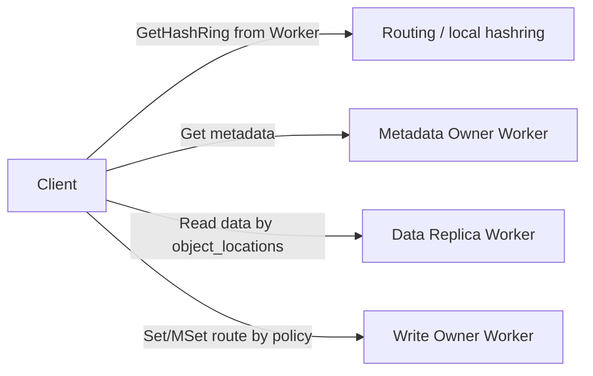
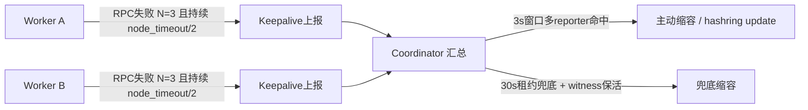
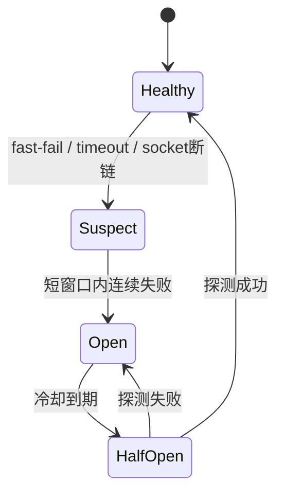

# Client 秒级切流与 3s 隔离结论

源码基线：`yuanrong-datasystem@e63f4270826783757ddfe1911a94ce87fd9b7461`  
PR1804 witness 基线：`refs/tmp/pr-1804-latest@62744bcd2101c7b61eb29d548540257fe5e2f40a`  
场景：商用走 Coordinator，`enableLocalCache=false`。

## 1. 总结论

目标逻辑：

- 数据写入失败：client 可以切走，选择其他可写 Worker。
- 数据读取失败：优先访问本地判定非故障 Worker；如果有其他副本，访问其他可用 Worker。
- meta/data 访问失败：client 可以本地熔断和 fail-fast。
- 元数据访问失败：需要上报 Coordinator 汇总；被动缩容和 hashring update 只能由 Coordinator 触发。

当前代码只部分满足：

- 快速失败时，写入可以局部切流。
- 读取拿到 metadata 后，可以按副本 fallback。
- metadata owner 黑洞时，当前缺少“client 熔断 + 失败上报 + Coordinator 汇总后被动缩容”的闭环。

## 2. 当前访问路径



要点：

- 普通读写热路径是 client -> worker。
- client 不直接依赖 Coordinator 做每次读写。
- Coordinator service discovery / cluster query 是旁路，不是读写热路径。

## 3. 写入失败

写入失败可以切走，但要区分失败阶段：

| 阶段 | 是否适合切走 | 原因 |
|---|---|---|
| Create 前/中失败 | 可以 | 对端大概率未完成写入 |
| 数据传输失败 | 可以 | 数据未完成提交 |
| Publish 明确未发送 | 可以 | 没有双写风险 |
| Publish 是否到达不明确 | 不建议 | 可能双写 |

当前代码已有类似保护：不确定 Publish 是否到达时，不跨 Worker replay。

## 4. 读取失败

读取分两步：

1. 先访问 metadata owner。
2. 再按 metadata 返回的 `object_locations` 读副本。

如果数据读取失败：

- 本地 Worker 判定非故障时，优先读本地。
- 当前副本失败时，尝试其他 `object_locations`。
- 这类失败可以主要在 client 本地完成切流，不一定需要立刻触发全局隔离。

但前提是 metadata 已经拿到。

## 5. 元数据失败

元数据访问失败是更高优先级问题：

- metadata owner 失败会影响大量 key。
- 即使数据副本在其他 Worker 上可读，client 也需要先拿到 metadata。
- client 可以先做本地熔断，避免长时间卡在黑洞 RPC。
- client 不能本地更新权威 hashring；metadata 访问失败需要上报 Coordinator 汇总。

Coordinator 需要看“大面积失败”：

- 多个 client / worker 都访问同一个 metadata owner 失败。
- 多个 worker 观测到访问目标 Worker 的底层 RPC/TCP socket 断链。
- 失败持续超过 `node_timeout_s` 主动隔离窗口。

满足后由 Coordinator 触发被动缩容和 hashring update。witness probe 只保护 `node_dead_timeout_s` 租约兜底路径。

## 6. 主动隔离方案

参数最小化：

| 参数 | 建议值 | 新含义 |
|---|---:|---|
| `node_timeout_s` | 3 | worker RPC 失败汇总触发隔离窗口 |
| `node_dead_timeout_s` | 30 | 无请求/无上报时的租约兜底隔离 |
| keepalive interval | 1s | `node_timeout_s / 3` |
| worker 本地失败持续时间 | 1.5s | `node_timeout_s / 2` |
| worker 连续失败次数 N | 3 | 防单次抖动 |

流程：



时间账：

- worker 本地观察：约 1.5s。
- 上报：复用 keepalive，间隔约 1s。
- Coordinator 汇总/reconcile：CPU 内存操作，应很快。
- 为保证 3s，命中阈值后建议允许立即触发一次带失败列表的 keepalive。

## 7. Worker 侧统计

只记录链路失败，不判断 Worker 死亡。

```cpp
struct RpcFailedState {
    uint64_t failedCount;
    uint64_t firstFailedAtMs;
};

std::unordered_map<HostPort, RpcFailedState> states;
```

失败计数：

- RPC timeout。
- connection refused / reset。
- bRPC unavailable。
- TCP socket 断链。

成功一次即清理该目标状态。

## 8. Coordinator 侧汇总

核心结构：

```cpp
target -> reporter -> lastFailedAtMs
```

触发条件：

```text
validReporterCount >= min(max(totalWorkerCount * 5%, 5), totalWorkerCount - 1)
&& report 在 node_timeout_s 窗口内
&& reporter != target
&& target 仍在 active membership
```

命中后由 Coordinator 触发被动缩容和 hashring update。

## 9. witness probe 定位

PR1804 witness probe 用于保护租约兜底路径：

- `node_dead_timeout_s=30` 到期后，witness reachable 可以续命保活。
- worker-coordinator 闪断，但 worker 间 RPC 正常时，不应隔离。
- 多 worker 连续 RPC 失败命中主动隔离时，不应被单个 witness reachable 绝对阻断。

## 10. 禁止 RPC 逻辑

`node_timeout_s=3` 后不应直接禁止向目标 Worker 发 RPC。

建议：

- 移除/开关关闭原有 node_timeout 触发的 gate。
- 依赖 bRPC 快速失败和本地熔断。
- 隔离只由 Coordinator 汇总后触发。

## 11. 熔断链路状态判断

client 本地只判断访问链路，不判断 Worker 死亡。



建议状态：

| 状态 | 含义 | client 行为 |
|---|---|---|
| Healthy | 链路正常 | 正常访问 |
| Suspect | 出现少量失败 | 降低 timeout，记录证据 |
| Open | 熔断 | fail-fast，不继续打黑洞 |
| HalfOpen | 试探恢复 | 放少量 probe 请求 |

判断输入：

- metadata RPC timeout / unavailable。
- data RPC timeout / unavailable。
- Worker 间 RPC/TCP socket 断链。
- UB/TCP 连接重建失败。
- 多个 key / 多个 client / 多个 worker 指向同一目标失败。

恢复条件：

- HalfOpen probe 成功。
- witness 上报 reachable。
- Coordinator 下发新 topology，目标不再 suspect。
- 冷却窗口内无新增失败。

注意：

- client 熔断状态只影响访问链路。
- Coordinator 聚合后才决定 suspect gate、被动缩容、hashring update。
- 单个 client 熔断不能作为删除 Worker 的依据。

## 12. 一句话方案

写入失败：安全阶段内 client 直接切走。  
读取失败：优先本地健康 Worker，否则读其他副本 Worker。  
metadata/data 访问失败：client 可本地熔断和 fail-fast。  
元数据大面积失败和 worker 间 RPC/TCP socket 断链：上报 Coordinator 汇总。  
`node_timeout_s=3` 走主动失败汇总；`node_dead_timeout_s=30` 走租约兜底；被动缩容和 hashring update 只能由 Coordinator 触发。
