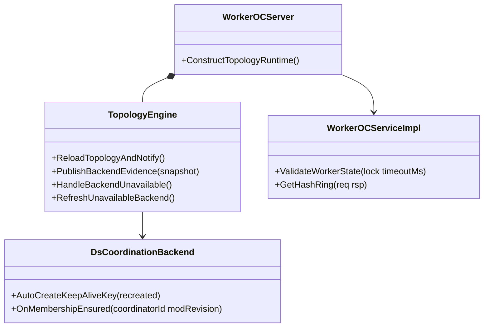
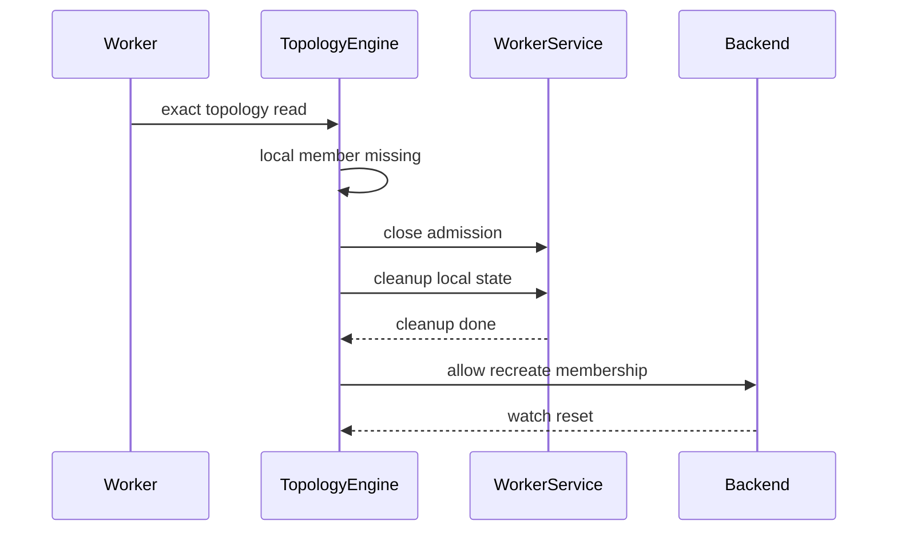
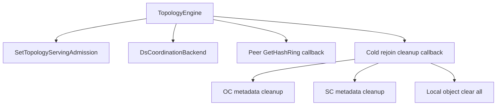

# Submodule: Worker-Coordinator Isolation Rejoin

| Attribute | Value |
|---|---|
| Created | 2026-08-01 from `措施二.md` and exact source inspection |
| Modified | 2026-08-01 initial detailed design |
| Phase | Measure 2 |
| Prerequisite | Measure 1 witness protects reachable workers from mistaken coordinator-side removal |

## 1. Requirement Background And Goals

When a worker loses only its Coordinator link, its membership lease can disappear from the Coordinator side. Current
Worker runtime kills itself if a later topology snapshot no longer contains its local member identity. Measure 2 changes
the Worker side: do not self-kill on local topology removal; close ordinary business, clean local state, recreate
membership, and rejoin as a new member.

| # | Goal | Acceptance | Phase |
|---|---|---|---|
| G1 | A Worker whose local member disappears from topology stays alive. | UT replaces SIGKILL death expectation with process survival and closed admission. | M2 |
| G2 | A Worker whose Coordinator link is unavailable but whose local topology still contains itself does not self-kill. | Existing `CONTROL_DEGRADED` or isolated availability is preserved; no kill path is introduced. | M2 |
| G3 | A removed Worker rejects ordinary business before rejoining. | Object-cache business RPC validation returns `K_NOT_READY` or equivalent closed-admission behavior. | M2 |
| G4 | Membership recreate is blocked until local cleanup succeeds. | UT proves recreate path returns blocked status before cleanup and proceeds after cleanup. | M2 |
| G5 | Cleanup for cold rejoin is local and narrow. | UT proves local meta/data cleanup does not invoke topology failure cleanup/ref rebuild. | M2 |
| G6 | While Coordinator is unavailable, peer `GetHashRing` accepts only newer topology versions and treats missing local member as rejoin-required. | UT covers newer, stale, RPC-failure, and missing-local peer responses. | M2 |

## 2. Requirement Boundary

This module is a Worker-side recovery and rejoin path for Coordinator-backend isolation.

### Concepts

| Term | Meaning |
|---|---|
| local member missing | An exact topology snapshot does not contain `options_.localAddress` after a previous snapshot did. |
| rejoin-required | Worker process remains alive, ordinary business admission is closed, and membership recreate is gated on cleanup. |
| cold rejoin cleanup | Local self-cleaning of metadata and object data before the old identity is discarded. |
| peer-observed topology | Topology/hashring returned by another Worker through existing `GetHashRing`; not authoritative ground truth. |

### In Scope

| Component | Responsibility |
|---|---|
| `TopologyEngine` | Replace local-member-missing SIGKILL with rejoin-required state and invoke cleanup/recreate hooks. |
| `DsCoordinationBackend` | Gate all membership recreate paths on cleanup readiness and preserve watch invalidation after recreate. |
| `WorkerOCServer` | Wire existing admission handler and inject cleanup/peer-refresh lambdas without adding a new class. |
| `WorkerOCServiceImpl` | Provide an internal cold-rejoin cleanup entry and keep ordinary RPC rejection through existing health/admission. |
| `WorkerOcServiceClearDataFlow` | Provide a narrow clear-all-local-data path that does not rebuild refs or query meta owners. |
| `MetadataManagerHolder`, `OCMetadataManager`, `SCMetadataManager` | Reuse or wrap existing per-worker metadata cleanup primitives. |

### Out Of Scope

| Item | Owner |
|---|---|
| Measure 1 witness probing and Coordinator-side suspect decision | Colleague's Measure 1 PR |
| New RPC or protobuf for Measure 2 | Out of scope |
| ETCD backend keepalive SIGKILL fallback removal | Follow-up backend compatibility decision |
| Reusing old data after a Worker was removed from topology | Out of scope for v1 |
| Cross-node compensation for active batches that depend on the isolated Worker | Existing batch retry/failure behavior |

## 3. UseCases


| UseCase | User | Scenario | Need | Design Response | Acceptance |
|---|---|---|---|---|---|
| UC1 | Client | Worker loses Coordinator link but has not been removed | Avoid process death | Keep last snapshot and existing availability decision | Worker process alive |
| UC2 | Client | Worker is later removed from topology | Avoid stale service | Enter rejoin-required and close ordinary admission | RPC returns not ready |
| UC3 | Operator | Coordinator link recovers after removal | Rejoin safely | Cleanup local state before membership recreate | New membership after cleanup |
| UC4 | Worker runtime | Peer has newer topology while Coordinator is unavailable | Reduce stale routing | Pull existing `GetHashRing` from peers and accept only newer versions | Newer version accepted only |
| UC5 | Coordinator and peers | Active batch depends on isolated Worker | Avoid wrong topology | Do not add compensation protocol; recover by exact read or cold rejoin | No incorrect Worker-side self-publish |

## 4. Design

### 4.1 Class Diagram



### 4.2 Development View

```text
src/datasystem/cluster/runtime/topology_engine.*
  Owns Worker topology publication, availability, peer refresh hook, and rejoin-required transition.
src/datasystem/cluster/coordination_backend/ds_coordination_backend.*
  Owns membership lease recreation and watch invalidation; adds cleanup gate.
src/datasystem/worker/worker_oc_server.cpp
  Wires admission, cleanup callback, and peer GetHashRing callback into existing builder.
src/datasystem/worker/object_cache/worker_oc_service_impl.*
  Exposes internal cleanup entry and keeps business validation unchanged.
src/datasystem/worker/object_cache/service/worker_oc_service_clear_data_flow.*
  Adds local clear-all primitive for cold rejoin.
tests/ut/cluster/*
  Covers topology and membership gate state transitions.
tests/ut/worker/object_cache/*
  Covers local cleanup and GetHashRing contract.
tests/st/worker/object_cache/coordinator_backend_cluster_test.cpp
  Holds fast Coordinator-backend smoke cases.
```

### 4.3 Key Interactions



| Step | Rule |
|---|---|
| Detect | Only an exact topology snapshot or accepted newer peer topology can trigger local-member-missing. |
| Close | Admission closes before cleanup starts. |
| Clean | Local cleanup is idempotent and deadline-aware. |
| Recreate | Every `AutoCreateKeepAliveKey(true)` path checks cleanup readiness. |
| Recover | Watch reset and exact topology reload reopen admission only after the new member is committed. |

### 4.4 Dependency Graph



### 4.5 Data Structures

| Structure | Owner | Concurrency |
|---|---|---|
| `TopologyAvailabilityLevel` plus reason | `TopologyEngine` | Existing `stateMutex_` and availability transition mutex |
| cleanup gate boolean/status | `DsCoordinationBackend` or `TopologyEngine` hook result | Guarded by existing membership mutation flow |
| peer-observed response | `TopologyEngine` local method scope | Not persisted and not published as Coordinator authority |
| local object key list | `WorkerOcServiceClearDataFlow` | Snapshot object ids before clearing; clear entries by existing object locks |

### 4.6 Component Interfaces

| Interface | Shape | Rule |
|---|---|---|
| rejoin cleanup hook | `std::function<Status(std::chrono::steady_clock::time_point)>` | Called after admission close and before membership recreate. |
| recreate gate | `std::function<Status(bool waitForCompletion)>` or equivalent existing reconcile hook | Blocks recreate until cleanup succeeds. |
| peer hash ring hook | `std::function<Status(uint64_t currentVersion, ClusterTopologyPb &)>` | Existing RPC only; accept newer version and ignore stale failures. |
| local data cleanup | `Status ClearAllLocalObjectsForRejoin(deadline)` | No meta-owner query and no ref rebuild. |

## 5. External Interfaces

No public SDK API, deployment parameter, environment variable, RPC, or protobuf change is introduced in v1.

## 6. Constraints And Risks

| # | Constraint | Consequence If Violated |
|---|---|---|
| C1 | Coordinator topology remains ground truth. | Peer result could resurrect a removed identity or fork routing. |
| C2 | Cleanup must complete before membership recreate. | New traffic can race stale local data and old metadata. |
| C3 | `GetHashRing` stays non-business admission. | Rejoin-required workers could become unobservable to peers. |
| C4 | Do not use topology failure cleanup for cold rejoin. | Ref rebuild and meta-owner side effects can corrupt rejoin semantics. |
| C5 | No new class in v1. | Review scope grows beyond Measure 2. |
| C6 | Ordinary ST cases target under six seconds. | PR gate becomes noisy and slow. |

| # | Risk | Mitigation |
|---|---|---|
| R1 | Existing ETCD keepalive still kills after timeout. | Document as out of scope unless reviewer asks to broaden backend behavior. |
| R2 | Peer topology refresh overlaps exact Coordinator reload. | Accept only monotonic newer versions and revalidate by exact read on recovery. |
| R3 | Cleanup can fail or time out. | Keep admission closed and do not recreate membership. |
| R4 | Object clear-all can be costly. | Use UT for matrices; ST uses small object counts only. |

## 7. Landing Steps

| PR | Content | Phase |
|---|---|---|
| PR1 | No-kill rejoin-required transition, cleanup gate, local cleanup, peer refresh, focused UT/ST | Measure 2 |
| Follow-up | ETCD backend parity decision if required | After PR1 |

## 8. Test Plan

| Type | File | Coverage |
|---|---|---|
| UT | `tests/ut/cluster/topology_engine_test.cpp` | local member removal no-kill, initial missing unchanged, identity changed, peer newer/stale/missing-local |
| UT | `tests/ut/cluster/ds_coordination_backend_session_test.cpp` | membership recreate blocked before cleanup and watch reset after cleanup |
| UT | `tests/ut/worker/object_cache/worker_oc_service_impl_test.cpp` | rejoin-required ordinary RPC rejection and cleanup failure behavior |
| UT | `tests/ut/worker/object_cache/worker_get_hash_ring_test.cpp` | GetHashRing remains usable as control observation |
| ST | `tests/st/worker/object_cache/coordinator_backend_cluster_test.cpp` | short Coordinator-backend isolation smoke with per-case runtime target under six seconds |
