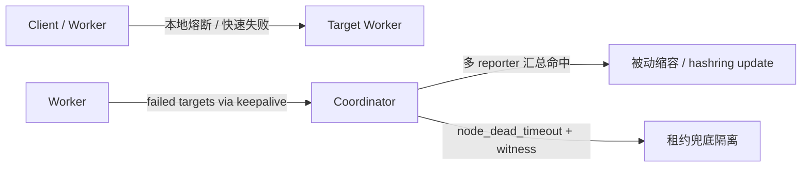

# Client 秒级切流与 3s 隔离 RFC

| 项目 | 内容 |
|---|---|
| Status | **In-Progress** |
| RFC | `2026-08-04-client-fast-failover-isolation` |
| datasystem PR | [openeuler/yuanrong-datasystem!1840](https://gitcode.com/openeuler/yuanrong-datasystem/merge_requests/1840) |
| branch | `feat/fast-failover-isolation-20260804` |
| base | `main/master@ac6b8edd3c4c627bffac886b35f3f01cda1365bd` |
| commit | `d90da667f60992c3ced5da14e7416de9669f85bc` |
| 场景 | 商用 Coordinator 路径，`enableLocalCache=false` |

## 1. 功能域概述

| 项目 | 内容 |
|---|---|
| 背景 | metadata 访问依赖 hashring，metadata owner 黑洞会导致 1/N 读写失败；租约超时隔离容易被 worker-coordinator 抖动误触发。 |
| 目标 | client/worker 1s 内快速失败；真实 worker 故障 3s 内由 Coordinator 更新 hashring。 |
| 范围 | worker RPC 失败统计、keepalive 上报、Coordinator 汇总隔离。 |
| 非目标 | client/worker 本地修改权威 hashring；data 失败单独触发 hashring update。 |

## 2. 总体方案

租约只做兜底；快速隔离依赖多 worker 的 RPC 失败观测。



数据面和元数据面分工：

- data 失败：本地熔断、读副本切换、写安全阶段切走。
- metadata / connectivity 大面积失败：上报 Coordinator，触发 hashring update。

## 3. 规格变更

| 参数 | 建议值 | 新含义 |
|---|---:|---|
| `node_timeout_s` | 3 | RPC 失败汇总触发主动隔离窗口 |
| `node_dead_timeout_s` | 30 | 无请求/无上报时的租约兜底隔离 |
| keepalive interval | 1s | `node_timeout_s / 3` |
| worker 失败持续时间 | 1.5s | `node_timeout_s / 2` |
| worker 连续失败次数 N | 3 | 防单次抖动 |

`node_timeout_s=3` 后不再直接禁止向目标 worker 发 RPC；原 gate 建议移除或开关关闭，依赖 bRPC 快速失败和本地熔断。

## 4. 关键设计

Worker 侧只判断链路，不判断 worker 死亡：

```cpp
target -> { failedCount, firstFailedAtMs }
```

命中条件：

```text
连续失败次数 >= 3
&& 持续时间 >= node_timeout_s / 2
```

成功一次清理该 target 状态。命中后通过 keepalive 上报 failed targets；为保证 3s，可立即触发一次带失败列表的 keepalive。

Coordinator 侧汇总：

```cpp
target -> reporter -> lastFailedAtMs
```

隔离条件：

```text
validReporterCount >= min(max(totalWorkerCount * 5%, 5), totalWorkerCount - 1)
&& report 在 node_timeout_s 窗口内
&& reporter != target
&& target 是 active member
```

## 5. witness 定位

- witness 只保护 `node_dead_timeout_s=30` 的租约兜底路径。
- worker-coordinator 闪断但 worker 间 RPC 正常时，不隔离。
- 多 worker 连续 RPC 失败命中主动隔离时，不被单个 witness reachable 绝对阻断。

## 6. 风险与验证

| 风险 | 约束 |
|---|---|
| 单点误报 | Coordinator 要求多 reporter。 |
| data 抖动误隔离 | data 失败不单独触发 hashring update。 |
| 3s 超时 | worker 命中后允许立即 keepalive 上报。 |
| 无业务请求 | 由 `node_dead_timeout_s=30` + witness 兜底。 |

验证场景：

- worker 真实故障：3s 内 hashring update。
- worker-coordinator 闪断：witness 保活，不主动隔离。
- 单 worker 报错：不隔离。
- 多 worker metadata/connectivity 报错：主动隔离。
- Bazel 全包构建：修复 stale `hashring_parser_file` 和 `st_cluster` 头依赖后通过。

## 7. DFX 约束

| 维度 | 约束 |
|---|---|
| 可靠性 | 不以单 worker、单次 RPC、单条租约过期判死；必须满足本地持续失败 + 多 reporter 汇总。 |
| 可用性 | metadata/connectivity 大面积失败优先 3s 主动隔离；无请求场景退回 30s witness 兜底。 |
| 性能 | worker 热路径只在 RPC 完成后更新小状态；keepalive 通常空 payload；Coordinator 只做窗口内 map 聚合。 |
