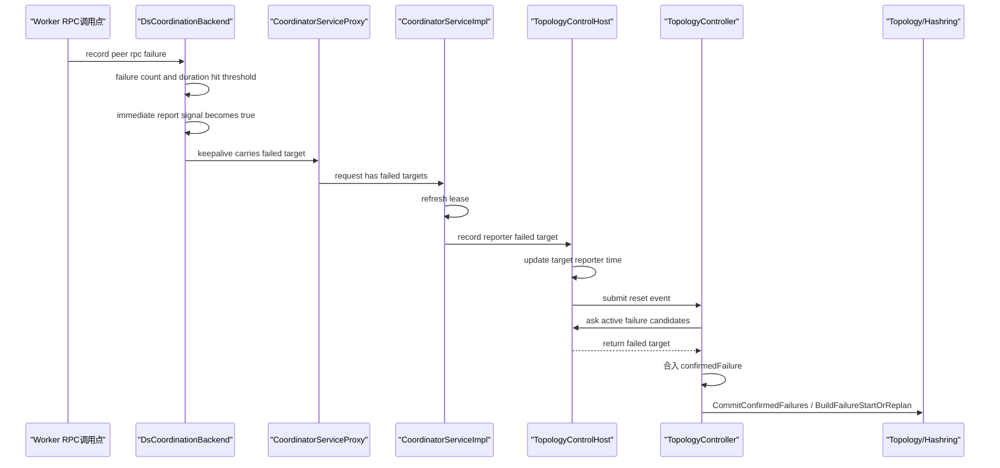
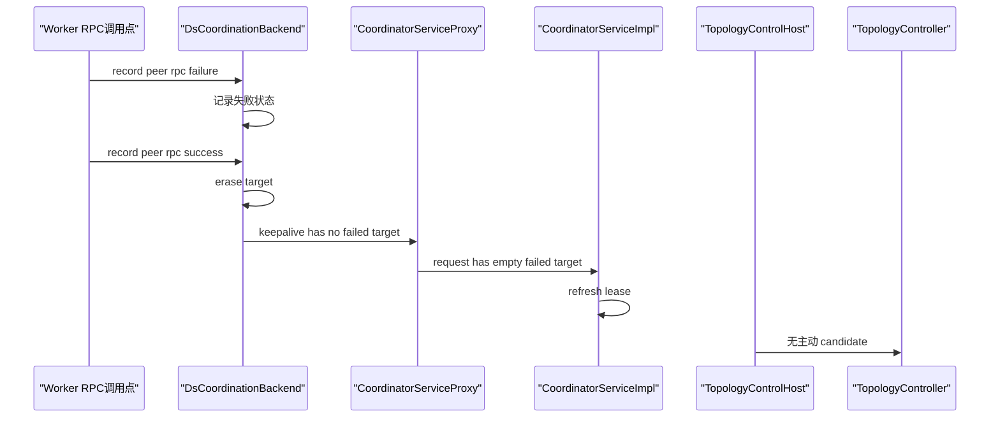
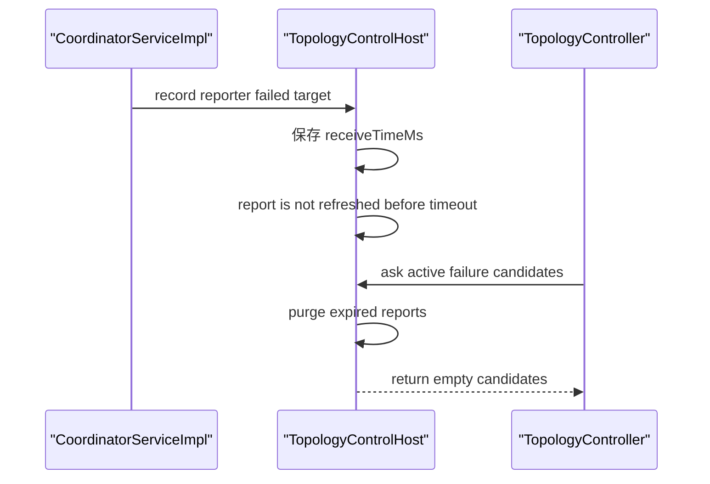
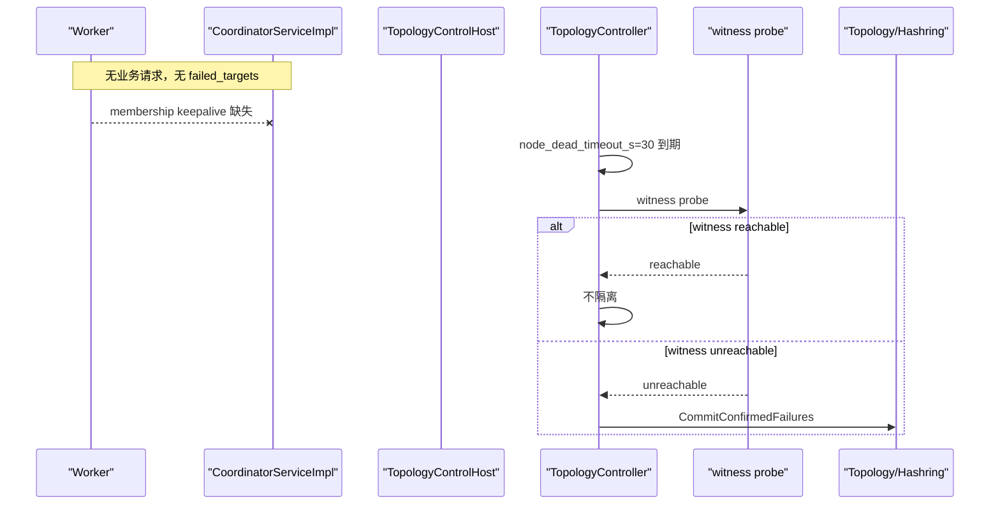

# 3s 主动隔离详细设计

## 1. 结论

采用 **worker 失败 summary 上报 + Coordinator 汇总决策**。

- `node_timeout_s=3`：主动隔离时间窗口。
- `node_dead_timeout_s=30`：无请求场景下的租约兜底。
- worker 负责按目标 worker 统计 RPC 持续失败。
- Coordinator 负责汇总失败 summary，并触发隔离与 hashring update。
- witness probe 只保护租约兜底路径。

## 2. 时间分段

| 阶段 | 时间 | 说明 |
|---|---:|---|
| worker 本地观察 | 1.5s | `node_timeout_s / 2` |
| keepalive 上报 | 1s | `node_timeout_s / 3` |
| Coordinator 汇总 | 快速 | 内存 CPU 操作 |
| 总体目标 | <= 3s | 命中后更新 hashring |

为保证 3s，worker 命中阈值后应允许立即触发一次带 failed targets 的 keepalive。

## 3. Worker 侧设计

在 `DsCoordinationBackend` 内增加本地失败统计，只判断链路，不判断 worker 死亡。

```cpp
void RecordPeerRpcFailure(const HostPort &target);
void RecordPeerRpcSuccess(const HostPort &target);
std::vector<std::string> GetFailedTargets(uint64_t nowMs);
bool ConsumeImmediateReportSignal();
```

核心状态：

```cpp
struct RpcFailedState {
    uint64_t failedCount;
    uint64_t firstFailedAtMs;
    uint64_t lastFailedAtMs;
    bool reported;
};

std::unordered_map<HostPort, RpcFailedState> states;
```

计入失败：

- RPC timeout。
- bRPC unavailable。
- connection reset/refused。
- TCP socket 断链。

不计入失败：

- `NOT_FOUND`。
- 参数错误。
- 权限错误。
- 业务语义失败。

命中条件：

```text
failedCount >= 3
&& now - firstFailedAtMs >= node_timeout_s / 2
```

reset 时机：

- 对同一 `target` 成功一次，清理状态。
- target 被 hashring 剔除，清理状态。
- 进程重启，状态自然清空。

上报内容：

```text
target
```

v1 只上报可触发隔离的失败：`META` / `CONNECTIVITY`。`DATA` 不进入 keepalive summary。

触发时机：

- 普通 keepalive 周期：携带当前命中的 failed summaries。
- 首次跨过命中条件：立即触发一次 keepalive，避免等待下一个 1s 周期。

## 4. Coordinator 侧设计

在 `TopologyControlHost` 内按目标 worker 聚合 reporter。

```cpp
void RecordWorkerFailureSummaries(const HostPort &reporter, const std::vector<std::string> &targets);
std::vector<HostPort> GetIsolationCandidates(const MembershipView &members, uint64_t nowMs);
void ResetFailureSummaryTarget(const HostPort &target);
```

汇总结构：

```cpp
target -> reporter -> FailureReportState

struct FailureReportState {
    uint64_t receiveTimeMs;
};
```

有效 report：

```text
reporter != target
&& target 是 active member
&& now - receiveTimeMs <= node_timeout_s
```

隔离阈值：

```text
threshold = min(max(ceil(totalWorkerCount * 5%), 5), totalWorkerCount - 1)
validReporterCount >= threshold
```

命中后：

1. 将 target 判为主动隔离对象。
2. 触发被动缩容。
3. 更新 hashring。
4. 通过现有 topology/hashring 通知 client/worker。

reset 时机：

- report 超过 `node_timeout_s` 未刷新，过期删除。
- reporter 不再是 active member，删除该 reporter 的报告。
- target 不再是 active member，删除该 target 的报告。
- target 已完成隔离并更新 hashring，删除该 target 的报告。

## 5. 接口与触发点

| 组件 | 接口/触发点 | 作用 |
|---|---|---|
| RPC 调用封装 | `RecordPeerRpcFailure/Success(target)` | 每次 metadata/connectivity RPC 完成后记录成功/失败。 |
| keepalive 构造 | `GetFailedTargets(now)` | 将命中的 failed targets 附加到 keepalive。 |
| keepalive 调度 | `ConsumeImmediateReportSignal()` | 首次命中阈值后立即上报。 |
| Coordinator keepalive 入口 | `RecordWorkerFailureSummaries(reporter, targets)` | 接收并刷新 reporter 观测。 |
| Coordinator reconcile | `GetIsolationCandidates(members, now)` | 计算主动隔离对象。 |
| hashring 更新后 | `ResetTarget(target)` | 清理已隔离对象的历史报告。 |

建议复用 keepalive RPC 扩展字段：

```text
repeated string failed_targets
```

不新增独立上报 RPC，避免多一条控制面链路。

## 6. 计算规则

Worker 侧：

```text
failure:
  failedCount += 1
  firstFailedAtMs = firstFailedAtMs == 0 ? now : firstFailedAtMs
  lastFailedAtMs = now

success:
  erase(target)

eligible:
  failedCount >= 3
  && now - firstFailedAtMs >= node_timeout_s / 2
```

Coordinator 侧：

```text
validReport:
  now - receiveTimeMs <= node_timeout_s
  && reporter != target
  && reporter, target are active members

isolate:
  distinct(validReport.reporter) >= threshold
```

`DATA` 失败不进入 summary，也不参与 `isolate` 计算。

## 7. 与现有参数关系

| 参数 | 新定位 |
|---|---|
| `node_timeout_s` | 主动隔离窗口，不再表示直接禁止 RPC 的 gate 时间。 |
| `node_dead_timeout_s` | 租约兜底隔离，用于无请求/无 summary 场景。 |
| witness probe | 保护 `node_dead_timeout_s` 路径，避免 worker-coordinator 闪断误隔离。 |

`node_timeout_s=3` 后不应直接禁止向 target worker 发 RPC；该逻辑建议移除或通过开关关闭，依赖 bRPC 快速失败和本地熔断。

一致性要求：

- Coordinator 商用路径下，membership lease TTL 不能继续绑定 `node_timeout_s=3`。
- 否则会变成 3s 租约缺失 + `node_dead_timeout_s` 判断，既容易放大 worker-coordinator 闪断，也会让 30s 兜底语义不清晰。
- 实现时应让 `node_timeout_s` 只驱动失败 summary 窗口；租约兜底总时长按 `node_dead_timeout_s=30` 收敛。

## 8. 决策边界

| 场景 | 决策 |
|---|---|
| 多 worker 报告同一 target 的 META/CONNECTIVITY 失败 | 主动隔离。 |
| 单 worker 报告失败 | 不隔离。 |
| 仅 DATA 失败 | 本地熔断/换路，不上报 Coordinator，不触发 hashring update。 |
| worker-coordinator 闪断，worker 间 RPC 正常 | 不主动隔离；走 witness 保护的兜底路径。 |
| 无业务请求，无失败 summary | `node_dead_timeout_s=30` 兜底。 |

## 9. 关键时序

### 9.1 3s 主动隔离



触发点：

- `RecordPeerRpcFailure`：metadata/connectivity RPC 失败返回后。
- `KeepAlive(... failed_targets)`：普通心跳周期，或首次命中阈值后立即触发。
- `RecordWorkerFailureSummaries`：Coordinator 续租成功后。
- `activeFailureCandidateProvider`：Controller reconcile 中 `TryConfirmFailures` 调用。

### 9.2 成功 reset，避免误隔离



reset 时机：

- 同一 target 的 metadata/connectivity RPC 成功。
- target 已从 hashring 剔除。
- worker 进程重启。

### 9.3 Coordinator 侧 report 过期



reset 时机：

- `now - receiveTimeMs > node_timeout_s`。
- reporter 不再是 active member。
- target 不再是 active member。
- target 已完成隔离。

### 9.4 无请求兜底



## 10. 开发视图

### 10.1 影响流程

| 流程 | 当前 | 修改后 |
|---|---|---|
| worker -> Coordinator keepalive | 只续租 membership key | 携带 failed target summary |
| Coordinator keepalive | 只刷新 TTL | 刷新 TTL + 记录 reporter 对 target 的失败观测 |
| Coordinator reconcile | 只基于 membership 缺失确认 failure | 合并 summary candidates，主动触发 failure plan |
| hashring update | 由已有 failure/scale-in 流程更新 | 复用已有 failure plan 和 topology/hashring 通知 |
| node timeout gate | `node_timeout_s` 后可能触发禁止 RPC | 建议移除或开关关闭，避免本地 gate 放大误判 |
| node dead timeout | 租约缺失确认 failure | 保留为 30s 兜底，并受 witness 保护 |

v1 只做 **worker 随 keepalive 上报**。client 本地失败只做熔断/切流，不直接上报 Coordinator。

### 10.2 模块交互


### 10.3 主要文件

原则：v1 不新增独立状态组件文件；小状态结构内聚到现有 keepalive / topology host 流程，不新建 hashring 更新链路。

| 文件 | 修改 | 估算 |
|---|---|---:|
| `src/datasystem/protos/coordinator.proto` | 扩展 `KeepAliveReqPb.failed_targets`，v1 用 `repeated string`。 | 5-10 |
| `src/datasystem/common/coordinator/coordinator_service_proxy.h` | `KeepAlive` 增加可选 failed target 列表。 | 8-15 |
| `src/datasystem/common/coordinator/coordinator_service_proxy.cpp` | 写入 `failed_targets`。 | 8-15 |
| `src/datasystem/cluster/coordination_backend/ds_coordination_backend.h` | 增加最小失败状态和 Record/Reset 入口。 | 35-60 |
| `src/datasystem/cluster/coordination_backend/ds_coordination_backend.cpp` | 失败统计、keepalive 携带 summary、命中后立即上报。 | 120-200 |
| `src/datasystem/coordinator/coordinator_service_impl.cpp` | `KeepAlive` 取 failed targets 并转交 topology host。 | 20-35 |
| `src/datasystem/coordinator/topology_control_host.h` | 增加 summary 接收入口和 target-reporter 状态。 | 40-70 |
| `src/datasystem/coordinator/topology_control_host.cpp` | 记录 summary、过期、计算 candidates、唤醒 reconcile。 | 120-220 |
| `src/datasystem/cluster/control/topology_controller.h` | 在 `TopologyControllerOptions` 增加主动 failure candidate provider。 | 15-30 |
| `src/datasystem/cluster/control/topology_controller.cpp` | reconcile 时合入 candidates，复用 `CommitConfirmedFailures`。 | 50-80 |
| worker RPC 调用点 | metadata/connectivity 失败调用 Record；成功调用 Reset。 | 60-120 |

worker RPC 调用点建议先接最小集：

- metadata owner 访问失败。
- worker-worker connectivity / remote object RPC 失败。
- 不接 DATA-only。

### 10.4 关键接口

Worker 侧：v1 直接放在 `DsCoordinationBackend`，不单独加类文件。

```cpp
void RecordPeerRpcFailure(const HostPort &target);
void RecordPeerRpcSuccess(const HostPort &target);
std::vector<std::string> GetFailedTargets(uint64_t nowMs);
bool ConsumeImmediateReportSignal();
```

Coordinator 侧：v1 直接放在 `TopologyControlHost`，不单独加类文件。

```cpp
void RecordWorkerFailureSummaries(const HostPort &reporter, const std::vector<std::string> &targets);
std::vector<HostPort> GetIsolationCandidates(const MembershipView &members, uint64_t nowMs);
void ResetFailureSummaryTarget(const HostPort &target);
```

Controller 接入：

```cpp
// TopologyControllerOptions
std::function<std::vector<MemberIdentity>(
    const TopologySnapshot &, const std::vector<MembershipRecord> &, std::chrono::steady_clock::time_point)>
    activeFailureCandidateProvider;
```

`TopologyControlHost::StartRuntime` 绑定该 provider；`TopologyController::TryConfirmFailures` 在原 lease classifier 后合入 provider candidates。

keepalive 扩展：

```proto
message KeepAliveReqPb {
  ...
  repeated string failed_targets = 4;
}
```

### 10.5 触发与 reset

| 动作 | 触发 |
|---|---|
| `RecordPeerRpcFailure` | metadata/connectivity RPC 返回 timeout/unavailable/reset/refused/socket broken。 |
| `RecordPeerRpcSuccess` | 同一 target 的 metadata/connectivity RPC 成功。 |
| 普通上报 | 每次 keepalive 构造时读取已命中 summaries。 |
| 立即上报 | 某 target 首次满足 `N=3 && 持续1.5s`。 |
| Coordinator 计算 | keepalive 到达后记录；提交 RESET doorbell 唤醒 Controller，Controller 通过 candidate provider 读取 candidates。 |
| worker reset | RPC 成功、target 已被 hashring 剔除、进程重启。 |
| Coordinator reset | report 过期、reporter/target 非 active、target 已隔离。 |

### 10.6 代码量估算

| 模块 | 估算 |
|---|---:|
| 生产代码 | 470-845 行 |
| UT/ST | 450-700 行 |
| 合计 | 约 0.9k-1.5k 行 |

实现风险主要在 topology 接入：主动 candidates 必须复用现有 `BuildFailureStartOrReplan`，不要新建另一条 hashring 更新路径。

自洽性检查：

- keepalive 链路自洽：`DsCoordinationBackend::RunKeepAliveLoop` 已按 `keepAliveTtlMs / 3` 周期续租，适合携带 summary。
- Coordinator 接收自洽：`CoordinatorServiceImpl::KeepAlive` 当前只刷新 TTL，可在成功续租后记录 failed targets。
- 唤醒路径需补齐：`TopologyControlHost` 现有 `SubmitDoorbell` 只在 `storeDirty` 时提交 RESET；summary 命中时也要提交 RESET doorbell。
- candidate 传递需补齐：`TopologyControllerRuntime` 目前只暴露 `SubmitCoordinationEvent`，不适合 Host 直接调用 Controller 私有逻辑；应通过 `TopologyControllerOptions` 注入 candidate provider。
- hashring 更新自洽：provider candidates 合入 `FailureClassification.confirmedFailure` 后复用 `CommitConfirmedFailures` 和 `BuildFailureStartOrReplan`。

无冗余约束：

- 不新增独立上报 RPC。
- 不新增 client -> Coordinator 上报路径。
- 不新增 hashring 更新流程。
- 不新增通用健康检查框架。
- 不上报 DATA-only 失败。
- 不新增 `RpcFailureTracker` / `WorkerFailureSummaryAggregator` 独立文件；v1 先内聚到现有类。

## 11. DFX

### 11.1 可靠性

目标：提升隔离精准度，避免把局部抖动、单点误报、worker-coordinator 闪断误判为 worker 故障。

| 风险 | 必须满足的约束 |
|---|---|
| 单 worker 误报 | 不隔离；Coordinator 必须满足多 reporter 阈值：`min(max(5% * N, 5), N - 1)`。 |
| 短 RPC 抖动 | 不上报或不上屏；worker 本地必须满足 `failedCount>=3 && 持续>=1.5s`。 |
| 旧 report 残留 | 不参与决策；Coordinator 只采用 `node_timeout_s` 窗口内 report。 |
| worker 时钟不一致 | 不影响 Coordinator 判断；上报只带 target，时间以 Coordinator receive time 为准。 |
| 重复上报 | 幂等；`target -> reporter` 覆盖刷新。 |
| worker 重启或缩容 | 旧 report 清理；Coordinator 按 active membership 过滤 reporter/target。 |
| 绕过现有 topology 流程 | 禁止；主动 candidates 必须复用 `CommitConfirmedFailures` 和现有 hashring update。 |
| witness 与主动隔离冲突 | witness 只保护租约兜底；多 reporter 主动隔离不被单个 witness reachable 绝对阻断。 |

### 11.2 可用性

目标：metadata/connectivity 大面积失败时优先恢复 hashring 可用性；不把 DATA-only 问题升级成全局缩容。

| 场景 | 行为 |
|---|---|
| 有业务请求的真实 worker 故障 | 3s 内主动隔离并更新 hashring。 |
| metadata owner 黑洞 | 多 reporter summary 触发隔离，消除 1/N metadata 失败。 |
| DATA-only 失败 | 本地熔断、读其他 worker、写切走；不触发 hashring update。 |
| worker-coordinator 闪断但 worker 间可达 | 不主动隔离；由 witness 保护兜底路径。 |
| 无业务请求、无 failed summary | `node_dead_timeout_s=30` 兜底。 |
| summary 上报链路失败 | keepalive 重试；仍可由 30s 兜底覆盖。 |
| target 恢复 | worker 成功 RPC 清理本地状态；Coordinator report 过期后不再命中。 |

### 11.3 性能

目标：控制热路径成本，避免为了 3s 隔离引入新的高频控制面压力。

| 项 | 约束 |
|---|---|
| worker RPC 热路径 | RPC 完成后一次 map 更新；不在 RPC 发起前做集中锁判断。 |
| worker 锁 | 小锁保护失败状态；不持锁发 RPC、构造 keepalive 或访问 Coordinator。 |
| keepalive payload | 只上报 `repeated string failed_targets`；正常为空；异常时按 target 去重。 |
| Coordinator KeepAlive | 续租后只做内存 map 刷新；不在 RPC 线程直接执行 hashring update。 |
| reconcile 唤醒 | 首次命中或新增 target 时提交 RESET doorbell；周期上报不反复唤醒。 |
| 状态规模 | `target * reporter`，并按 `node_timeout_s` 窗口过期。 |
| 大集群成本 | 阈值按 reporter 数聚合；计算只扫描 active members 和窗口内 report。 |

## 12. 验证 Cases

### 12.1 3s 隔离

| Case | 场景 | 期望 |
|---|---|---|
| C1 | 目标 worker 进程退出；多 worker 访问该 target 的 metadata/connectivity 失败 | `node_timeout_s=3` 内 hashring 剔除 target。 |
| C2 | 目标 worker 网络黑洞；RPC timeout / unavailable 连续出现 | 多 reporter 命中后 3s 内隔离。 |
| C3 | target 只对部分 worker 不通，达到 reporter 阈值 | 3s 内隔离。 |
| C4 | worker 命中 `N=3` 且持续 1.5s | 立即携带 failed targets 上报，不等下一轮普通心跳。 |

判定口径：

```text
failure_start -> hashring_without_target <= 3s
```

### 12.2 不错误隔离

| Case | 场景 | 期望 |
|---|---|---|
| C5 | 单 worker 上报 target 失败 | 不隔离。 |
| C6 | DATA-only 失败，metadata/connectivity 正常 | 不更新 hashring，仅本地熔断/换路。 |
| C7 | 短暂 RPC 抖动，未持续到 1.5s | 不上报或上报不命中。 |
| C8 | worker-coordinator 闪断，但 worker 间 RPC 正常 | 不主动隔离，witness 保活。 |
| C9 | target 恢复成功 RPC | worker 清理本地失败状态，Coordinator 过期旧 report。 |

判定口径：

```text
hashring_version 不变化
target 仍是 active member
```

### 12.3 兜底生效

| Case | 场景 | 期望 |
|---|---|---|
| C10 | 无业务请求，target 真实故障，无 failed summary | `node_dead_timeout_s=30` 路径触发兜底隔离。 |
| C11 | 无业务请求，worker-coordinator 闪断但 worker 可被 witness 探测到 | 不兜底隔离。 |
| C12 | failed summary 上报链路异常 | 最终仍由 `node_dead_timeout_s=30` 兜底。 |

判定口径：

```text
有请求: 3s 主动隔离优先
无请求/无上报: 30s 兜底路径生效
```
