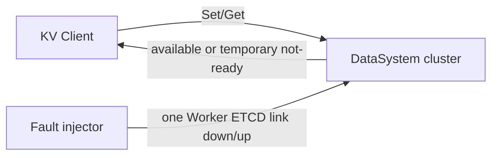
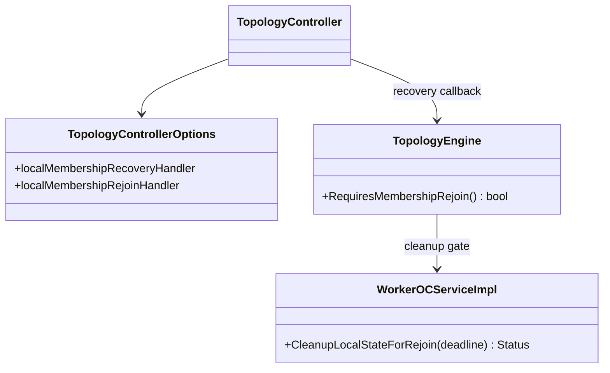
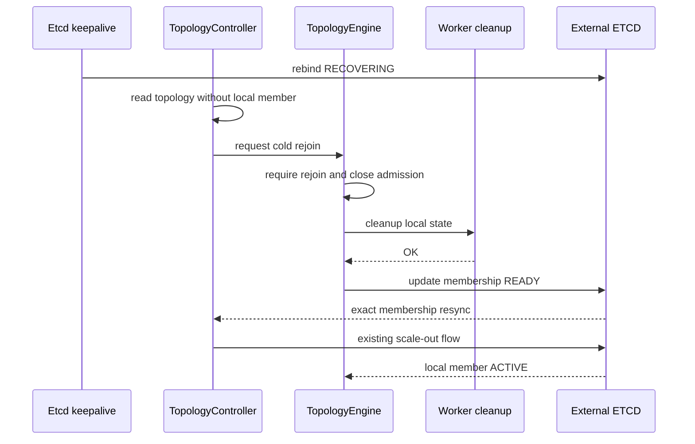
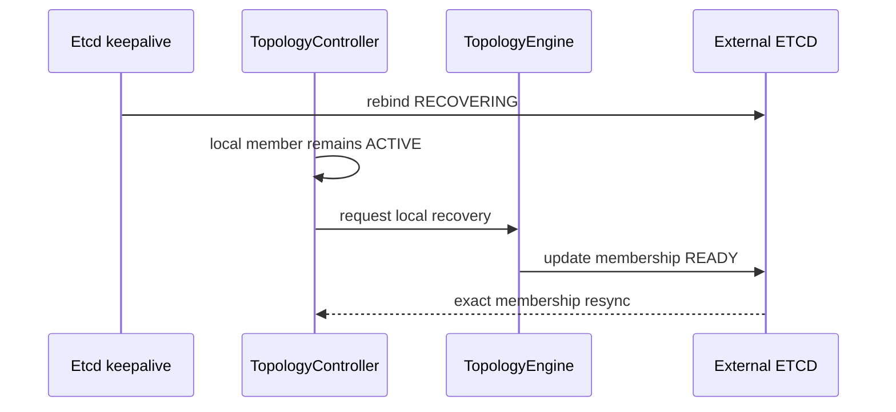
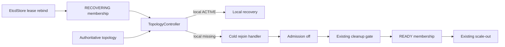

# 子模块：外部 ETCD 成员租约重建后的冷重加恢复（Issue #1027）

| 属性 | 值 |
|---|---|
| 创建 | 2026-08-10（测试日志与源码分析） |
| 修改 | 2026-08-11（补充 voluntary-exit 并发与超时边界） |
| 阶段 | P1 缺陷修复已验证，PR #1981 已提交 |
| 前置 | 措施二 / PR #1821 / Issue #1027 |
| 源码基线 | 起点 `v0.9.2.rc12` (`00c31da53a08`)；已 rebase 最新 `master` (`604b00b52d2a`) |

## §1 需求背景与目标

外部 ETCD 模式下，测试观察到单个 Worker 的 ETCD TCP 链路恢复后，本地 `Get` 可成功，但需要分布式
元数据的访问无法恢复。日志显示该 Worker 的 membership lease 失效并重建后处于 `RECOVERING`；若权威
topology 已经将它删除，现有逻辑不会将其重新加入，Worker 最终保持 `ROLE_ISOLATED`。

源码复核确认，lease 重建发布 `RECOVERING` 是安全设计而非缓存错误：`AutoCreate()` 首次发布
STARTING/RESTARTING 后把后续重绑状态置为 RECOVERING，目的是在重新接纳前核对权威 topology。真正缺口是
措施二的 membership recreate cleanup gate 只接入 Coordinator backend；外部 ETCD 的
`RestoreReadyAfterLocalRecovery()` 仅处理“本地成员仍为 ACTIVE”，对“本地成员已从 topology 删除”直接返回。

### 源码证据

| 结论 | 精确源码 |
|---|---|
| lease 重绑有意发布 RECOVERING | `src/datasystem/common/kvstore/etcd/etcd_store.cpp:487`，状态转换见 `:507` |
| 外部 ETCD 只恢复仍为 ACTIVE 的本地成员 | `src/datasystem/cluster/control/topology_controller.cpp:808` |
| 本地成员缺失会设置 rejoin required 和隔离 | `src/datasystem/cluster/runtime/topology_engine.cpp:1212` |
| cleanup gate 由 Worker 注册 | `src/datasystem/worker/worker_oc_server.cpp:1546` |
| gate 目前仅装入 `DsCoordinationBackend` | `src/datasystem/cluster/runtime/topology_engine.cpp:369` |

| # | 目标 | 验收 | 阶段 |
|---|---|---|---|
| G1 | 保留 lease rebind 隔离语义 | 重绑先发布 RECOVERING，不直接作为新成员接纳 | P1 |
| G2 | 补齐外部 ETCD 冷重加闭环 | 本地已被删除时，先隔离和清理，再发布 READY 参与正常 scale-out | P1 |
| G3 | 单 Worker ETCD 断链可自愈 | 其他 Worker 在线；故障 Worker 被剔除后重连并恢复 ACTIVE，跨 Worker 元数据访问恢复 | P1 |
| G4 | 不违反措施二 | 不接纳 RECOVERING；不绕过 cleanup gate；不恢复旧身份业务 | P1 |

## §2 需求边界

本模块补齐外部 ETCD 的 missing-local rejoin 分支，复用已有状态、cleanup gate 和 scale-out，不新建恢复体系。

### 关键概念定义

| 概念 | 定义 |
|---|---|
| lease rebind | keepalive 超时后获取新 lease，并重新创建同一 membership key |
| RECOVERING | lease 重绑后的隔离状态；不能作为新成员接纳 |
| local recovery | Worker 仍在权威 topology 且为 ACTIVE，重绑后可恢复 READY |
| cold rejoin | Worker 已不在权威 topology，必须清理本地状态后以 READY 候选重新 scale-out |
| cleanup gate | 措施二要求：先关 admission 并清理本地状态，才允许 membership 变为可接纳状态 |

### 做什么

| 组件 | 职责 |
|---|---|
| `TopologyController` | 区分 ACTIVE local recovery 与 missing-local cold rejoin，调用不同 handler |
| `TopologyEngine` | missing-local 时锁存 rejoin、关闭 admission、执行既有 cleanup gate，再更新 READY |
| `TopologyEngine::Builder` | 同一 cleanup callback 同时供 Coordinator backend 和外部 ETCD engine 使用 |
| ST/UT | 看护 RECOVERING 隔离、cleanup 顺序、失败重试和双 Worker 业务恢复 |

### 不做什么

| 事项 | 归属 |
|---|---|
| 修改 `EtcdStore::AutoCreate()` 为直接重发 READY | 不做；会绕过权威 topology 核对与清理 |
| 将 RECOVERING 直接视为可加入 topology | 不做；违反措施二 cleanup-before-rejoin |
| 修改 topology 仲裁优先级或 scale-out 协议 | 不做；复用现有 READY 候选流程 |
| 复用旧身份数据或改变本地清理范围 | 不做；继续遵循措施二 v1 |
| 新增线程、配置项、RPC 或持久化结构 | 不做；现有回调和状态足以闭环 |

## §3 UseCase

### UC1：单 Worker 与 ETCD 断链后恢复



| 操作 | 外部行为 |
|---|---|
| 故障前 | 两个 Worker 均为 ACTIVE，跨 Worker Set/Get 成功 |
| 断链期间 | 仅目标 Worker 的 ETCD lease 路径失败；其他 Worker 与 ETCD 保持连接和服务 |
| 权威剔除后 | 目标 Worker 停止普通业务；旧身份不可被路由 |
| 链路恢复后 | 重绑 membership 为 RECOVERING；确认本地已缺失后执行 cleanup，再发布 READY |
| 验收 | 正常 scale-out 后 topology 恢复两个 ACTIVE Worker，peer 元数据访问成功 |

### UC2：短闪断但本地成员未被删除


| 操作 | 外部行为 |
|---|---|
| lease 重绑 | 先发布 RECOVERING，避免未经核对直接接纳 |
| topology 仍含本地 ACTIVE | 走既有 local recovery，恢复 READY，不执行冷重加清理 |
| 验收 | 不触发 scale-out，不误清理本地状态，业务恢复 |

### UseCase 总表

| UseCase | 使用者 | 场景 | 需要什么 | 设计响应 | 验收 |
|---|---|---|---|---|---|
| UC1 | KV Client / 运维测试 | 单 Worker ETCD TCP down/up 且已被删除 | 清理后重新加入并恢复远端访问 | missing-local rejoin handler | 两个 ACTIVE，peer Get 成功 |
| UC2 | Worker lifecycle | 短闪断且未被删除 | 原身份安全恢复 | 保留现有 ACTIVE local recovery | 无重加，恢复 READY |

## §4 方案设计

### 4.1 类图

不新增类或 public API，只增加 Builder/Options 内部 callback 和 TopologyEngine 私有恢复方法。



### 4.2 开发视图

```text
src/datasystem/cluster/control/
  topology_controller.{h,cpp}            # missing-local rejoin callback branch
src/datasystem/cluster/runtime/
  topology_engine.{h,cpp}                 # isolate, cleanup, READY transition
tests/ut/cluster/
  topology_controller_test.cpp            # controller branch and retry ordering
  topology_engine_test.cpp                # gate before READY and failure semantics
tests/st/client/kv_cache/
  kv_client_etcd_dfx_test.cpp              # single-Worker ETCD fault cluster ST
```

### 4.3 关键交互

#### 4.3.1 已删除 Worker 的外部 ETCD 冷重加



顺序不变量：`ROLE_ISOLATED/admission off` 先于 cleanup；cleanup 成功先于 READY；READY 先于既有 scale-out；
ACTIVE topology 发布后才恢复普通业务。

#### 4.3.2 短闪断恢复



#### 4.3.3 错误语义

| 场景 | 返回/动作 | membership 与业务状态 |
|---|---|---|
| rejoin handler 未配置 | 保持现有 no-op | RECOVERING，不接纳 |
| cleanup 返回 `K_NOT_READY` | Controller 本 tick 不阻塞其他仲裁，后续 tick 重试 | RECOVERING，admission off |
| cleanup 返回其他错误 | 记录并返回，后续事件/tick 重试 | RECOVERING，admission off |
| READY 更新失败 | 不触发 exact resync，后续重试 | RECOVERING，admission off |
| cleanup 与 READY 均成功 | 标记 exact resync required | READY 候选，仍等待 ACTIVE topology |
| voluntary exit | 不进入 cold rejoin | 保持退出语义 |

### 4.4 模块依赖图



### 4.5 关键数据结构

#### `localMembershipRejoinHandler`

- 类型：`std::function<Status()>`，位于 `TopologyControllerOptions`。
- 触发条件：外部 ETCD、local membership 为 RECOVERING、权威 topology 中找不到本地地址。
- 并发：由 Controller reconcile 线程调用；不新增线程。
- 幂等：失败可在后续 tick 重试。现有 `CleanupLocalStateForRejoin()` 必须保持可重复调用。

#### `membershipRecreateGate`

- 来源：既有 `TopologyEngine::Builder::SetMembershipRecreateGate()`。
- 变更：callback 不再只移动到 `DsCoordinationBackend`，TopologyEngine 同时保留一份，用于外部 ETCD cold rejoin。
- Coordinator backend 行为不变；两种 backend 不会在同一 Engine 实例同时执行 gate。

#### `membershipRejoinRequired_`

- missing-local handler 开始时置 true，并切换 `ROLE_ISOLATED`。
- cleanup/READY 失败时保持 true。
- 只有后续权威 topology 再次包含本地有效身份时，沿用现有逻辑清除。

#### `membershipTransitionMutex_`

- 类型：`std::timed_mutex`，仅串行化 voluntary exit intent 与 destructive cold-rejoin cleanup gate。
- 退出先获得 mutex：先锁存 EXITING intent，cold rejoin 不再启动 cleanup。
- cold rejoin 先获得 mutex：完成本地 cleanup 后释放；`MarkExiting(timeoutMs)` 最多等待到调用方 deadline。
- membership RPC 不在 mutex 内执行；等待 mutex 的耗时从传给 backend 的剩余预算中扣除。

### 4.6 组件接口设计

| 接口 | 输入 | 输出 | 语义 |
|---|---|---|---|
| `localMembershipRecoveryHandler` | 无 | `Status` | 本地仍 ACTIVE 的短闪断恢复，不清理 |
| `localMembershipRejoinHandler` | 无 | `Status` | 本地缺失时隔离、清理并发布 READY |
| `membershipRecreateGate` | 无 | `Status` | 复用 Worker 本地清理实现，成功才允许 READY |

## §5 对外接口

### 5.1 SDK 接口

| 接口 | 调用方 | 频率 | 说明 |
|---|---|---|---|
| 无新增 | - | - | KVClient API 和错误码不变 |

本轮只增加内部 callback，完整签名为：

```cpp
Status RestoreReadyAfterLocalRejoin();
TopologyEngine::Builder &SetMembershipRecreateGate(std::function<Status()> gate);
```

### 5.2 部署参数

| 参数名 | 类型 | 默认值 | 说明 |
|---|---|---|---|
| 无新增 | - | - | 沿用 `node_timeout_s`、`node_dead_timeout_s` |

### 5.3 环境变量

| 变量 | 默认值 | 说明 |
|---|---|---|
| 无新增 | - | 不改变部署环境 |

## §6 约束 + 风险

### 约束

| # | 约束 | 违规后果 |
|---|---|---|
| C1 | lease rebind 必须先发布 RECOVERING | 已删除 Worker 可能未经清理直接作为 READY 候选 |
| C2 | admission off 必须先于 cleanup | 清理期间可能进入新业务请求 |
| C3 | cleanup 成功必须先于 READY | 旧身份本地状态可能污染新身份 |
| C4 | READY 后仍需正常 scale-out 到 ACTIVE | membership 存在不等于可服务 |
| C5 | EXITING/voluntary exit 不得进入 cold rejoin | 正常退出节点可能被重新加入 |
| C6 | `MarkExiting(timeoutMs)` 的预算必须覆盖 rejoin 串行等待和 backend write | graceful exit 可能突破调用方 deadline |

### 风险

| # | 风险 | 缓解 |
|---|---|---|
| R1 | cleanup callback 被重复调用 | 复用措施二幂等 cleanup，并用失败重试 UT 看护 |
| R2 | Controller tick 被长时间阻塞 | cleanup 是本地数据结构操作；保持既有 deadline，`K_NOT_READY` 后退出本 tick |
| R3 | callback 复制改变 Coordinator backend 生命周期 | Builder 构建期复制 `std::function`；两个 backend 分支分别使用，补现有 backend UT 回归 |
| R4 | 动态注入不等价于系统级断网 | 同时阻断 Worker1 的 ETCD lease 与 peer `GetClusterState`，稳定构造日志中的单 Worker TCP 隔离和权威剔除；Worker0 不注入故障 |
| R5 | 误把旧数据恢复作为验收 | cluster ST 只验证恢复后新业务；旧身份数据不复用符合措施二 v1 |

## §7 落地步骤

| PR/提交 | 内容 | 阶段 |
|---|---|---|
| Commit 1 | TDD：新增 Controller/Engine UT、exit 并发 UT 与外部 ETCD cluster ST | Red |
| Commit 2 | SDD：接入 missing-local rejoin handler，复用 cleanup gate，保持 RECOVERING 隔离 | Green |
| Commit 3 | 历史措施二 UT/ST、CMake/Bazel 与 Tiantiyun 回归 | Refactor/verify |
| 最终提交 | review 后按需要 squash；PR 描述记录源码/测试意图、case 数量和逐 case/总时长 | Delivery |

实施采用 TDD + SDD。构建复用 `/home/ds-thirdparty-cache`，开启 `URMA_MOCK`；独占时 `-j80`，有其他任务时
降低并发。后台长任务使用 tmux，并保存 exit marker 和测试时长证据。

## §8 测试方案

### 8.1 新增 UT

| UT | 覆盖点 | 核心断言 |
|---|---|---|
| `TopologyControllerTest.MissingLocalRecoveringMembershipColdRejoinsBeforeScaleOut` | RECOVERING + local missing | 调用 rejoin handler，不调用 local recovery；成功后 exact resync，再进入既有 scale-out |
| `TopologyEngineTest.ColdRejoinCleansWhileIsolatedBeforePublishingReady` | Engine 顺序与失败重试 | admission callback、rejoin flag 与隔离先于 gate；首次 `K_NOT_READY` 保持 RECOVERING；重试成功后才发布 READY |
| `TopologyEngineTest.ColdRejoinSerializesVoluntaryExitWithinTimeout` | rejoin/exit 并发与聚合 timeout | cleanup gate 阻塞时 `MarkExiting(20ms)` 按 deadline 返回；释放 gate 后可正常发布 EXITING |

### 8.2 新增 ST

| ST | 层级 | 故障注入 | 关键断言 | 目标时长 |
|---|---|---|---|---|
| `KVClientEtcdSingleWorkerReconnectTest.LEVEL1_WorkerEtcdReconnectColdRejoinsAndRestoresMetadataAccess` | cluster ST | Worker1 lease unavailable + peer `GetClusterState` unavailable，等待剔除后清除 | Worker0 持续可用；Worker1 被移除、清理、重新 ACTIVE；恢复后 peer metadata Set/Get 成功 | 先保证稳定，目标 `<=30s` |

Cluster ST 使用两个 Worker，不能关闭整个 ETCD 集群。故障前确认两个 ACTIVE；故障期间持续从 Worker0 做轻量
Set/Get，证明不是整集群降级；等待权威 topology 删除 Worker1 后清除注入；恢复后等待两个 ACTIVE，再用新 key
从 Worker1 Set、Worker0 Get。旧 key 是否保留不作为断言。

### 8.3 必须回归的既有 UT/ST

| 类型 | Case | 目的 |
|---|---|---|
| UT | `ExternalEtcdDoesNotPromoteBeforeLocalMembershipIsRecovering` | RESTARTING 不触发恢复 |
| UT | `ExternalEtcdDoesNotPromoteRemoteOrNonActiveMember` | 远端 RECOVERING、非 ACTIVE 本地成员不误恢复 |
| UT | `SuccessfulLocalRecoveryForcesExactMembershipResync` | 未删除短闪断恢复保持原语义 |
| UT | `FailedLocalRecoveryRetriesWithoutStartingControlBatch` | 原恢复失败语义不变 |
| UT | `LocalMemberRemovedFromSnapshotRequiresRejoinWithoutSigkill` | missing-local 锁存 rejoin 且不自杀 |
| UT | `RecreateMembershipBlockedUntilCleanupDone` 相关 backend cases | Coordinator backend cleanup gate 不回归 |
| ST | `IsolatedWorkerRemovedThenColdRejoinsWithoutSuicide` | Coordinator backend 措施二完整链路不回归 |

### 8.4 TDD 红绿标准

| 阶段 | 预期 |
|---|---|
| Red-UT | missing-local RECOVERING 直接返回，rejoin handler 未调用 |
| Red-ST | Worker1 重绑后卡在 RECOVERING/ROLE_ISOLATED，无法重新 ACTIVE |
| Green | 3 条新增 UT、1 条新增 ST 及既有回归全部通过 |

### 8.5 构建与回归

| 类型 | 要求 |
|---|---|
| CMake | `URMA_MOCK=ON`，复用 `/home/ds-thirdparty-cache`，构建对应 ST/UT target |
| Bazel | 保证修改源码及 `kv_client_etcd_dfx_test` target 通过构建 |
| 远端 | Tiantiyun；tmux 后台执行，保存 exit marker、逐 case elapsed time 和总时长 |
| 格式 | 仅格式化修改行，避免 `topology_controller_test.cpp` 等历史格式噪声 |
| 静态检查 | clang-tidy 检查修改文件；不因历史告警扩大修改范围 |
| 回归 | Issue #1027 新用例 + 上表措施二用例 + 历史 ETCD/rejoin 失败用例 |

### 8.6 设计一致性判定

| 措施二要求 | 本方案 |
|---|---|
| coordinator/topology 是权威 | missing/ACTIVE 判断来自权威 topology |
| 未被删除可恢复服务 | ACTIVE local recovery 分支保持不变 |
| 已被删除先停服务和清理 | rejoin handler 先隔离，再执行 cleanup gate |
| 清理后重新 membership/watch | cleanup 成功后发布 READY，触发 exact resync 和既有 scale-out |
| 旧身份不可继续服务 | RECOVERING 不接纳，ACTIVE 前 admission 保持关闭 |

结论：本方案补齐措施二在外部 ETCD backend 的实现缺口，不改变措施二状态机和清理语义。
