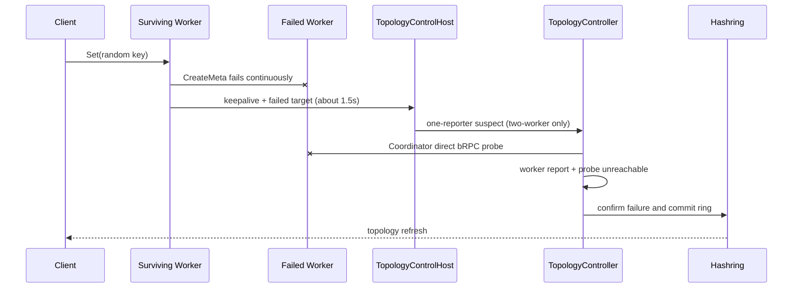

# 两 Worker 主动隔离补强

**Status: In-Progress**

Tracking issue: [yuanrong-datasystem#1028](https://gitcode.com/openeuler/yuanrong-datasystem/issues/1028)

## 1. 问题

两 Worker 集群 Kill 一个元数据 owner 后：

- client 约 150ms 切到存活 Worker；
- 存活 Worker 持续访问故障 owner，CreateMeta 失败；
- Worker 约 1.5s 上报 failure summary；
- Coordinator 最少要求 2 个 reporter，但集群只剩 1 个，3s 主动隔离必然不触发；
- `node_dead_timeout_s=30` 前 hashring 不变，新数据持续失败。

## 2. 复现证据

配置：`node_timeout_s=3`、`node_dead_timeout_s=30`、request timeout 20ms、URMA Mock。

| 时间点 | 结果 |
|---|---:|
| Kill 完成 | 18ms |
| 首次 Set/CreateMeta 失败 | 21ms |
| 单 Worker summary 到达 Coordinator | 约 1.5s |
| 3s 时目标状态 | ACTIVE |
| 3s 内最后一次失败 | 2999ms |
| 失败请求数 | 121 |

对照：7 Worker、5 个健康 reporter、Kill 2 个 owner 时，两个节点分别在 1615ms、1616ms 隔离，1751ms 后连续写成功。

## 3. 根因

```text
ActiveFailureReporterThreshold(2) = 2
max surviving reporters = 1
```

witness probe 在 membership TTL 缺失后启动，但目前只在 `node_dead_timeout_s` 路径阻止误隔离，不能确认 failure summary 的 suspect，因此无法满足 3s。

## 4. 方案

仅补强两 Worker 场景：

1. 单个有效 Worker summary 将目标标记为 suspect，不直接隔离。
2. Coordinator 复用 `memberLivenessProbe` 对 suspect 发起直接 bRPC probe。
3. Worker 视角和 Coordinator 视角均不可达，才加入 `confirmedFailure`。
4. Coordinator probe 可达、返回异常或无匹配结果时保留目标，不更新 hashring。
5. 大于两个 Worker 的现有多 reporter 阈值保持不变。

不新增 gflag。仍使用：

- `node_timeout_s=3`：Worker 失败观察和 summary 有效窗口。
- `node_dead_timeout_s=30`：无请求或证据不足时的租约兜底。

## 5. 关键流程



## 6. 代码落点

| 文件 | 修改 |
|---|---|
| `topology_control_host.cpp` | 两 Worker 时允许 1 份有效 report 形成 candidate；打印 reporter/threshold。 |
| `topology_controller.cpp` | 两 Worker candidate 必须经过 Coordinator direct probe；打印 probe 决策。 |
| `ds_coordination_backend.cpp` | 将 summary 首次命中、成功 reset 提升为 V=0 可见的状态转换日志。 |
| `topology_control_host_test.cpp` | 看护两 Worker candidate 和大集群阈值不变。 |
| `topology_controller_test.cpp` | 看护 probe 不可达才隔离、probe 可达不隔离。 |
| `coordinator_active_failure_stop_resume_test.cpp` | disabled 两 Worker现场复现；保留多 Worker双 Kill 对照。 |

## 7. V=0 关键日志

| 锚点 | 日志 |
|---|---|
| Worker summary 达标 | `CLUSTER_FAILURE_REPORT action=summary_qualified` |
| Coordinator 收到新关系 | `CLUSTER_FAILURE_REPORT action=summary_received` |
| Candidate 达标 | `CLUSTER_FAILURE_DETECT action=active_summary_candidate` |
| Coordinator 探测 | `CLUSTER_FAILURE_DETECT action=active_summary_direct_probe` |
| 确认隔离 | `CLUSTER_FAILURE_DETECT action=active_summary_confirmed` |
| hashring 提交 | `CLUSTER_RING status=cas_committed` |
| 链路恢复清零 | `CLUSTER_FAILURE_OBSERVE action=success_reset` |

逐请求失败仍保留在 `VLOG(1)`，避免 V=0 日志风暴。

## 8. 验证

### UT

- 两 Worker + 1 reporter 生成 suspect candidate。
- 大集群仍满足原有 5%/最少 5 reporter 规则。
- direct probe unavailable/deadline：确认隔离。
- direct probe response/error/cancelled：不隔离。
- 成功 RPC 清理 Worker 失败状态。

### ST

- 两 Worker：Kill 元数据 owner，随机 key 持续 Set，3s 内隔离并恢复新数据读写。
- 七 Worker：Kill 两个 owner，5 个 reporter 同时覆盖两个目标，均在 3s 内隔离。
- 两秒闪断重复 5 轮：不隔离；成功后历史失败状态清零。
- 无业务请求：30s 租约兜底仍生效，witness 可保护可达节点。

验收同时记录 Kill、首次失败、summary、probe、ring commit、最后失败、连续成功时间点。
