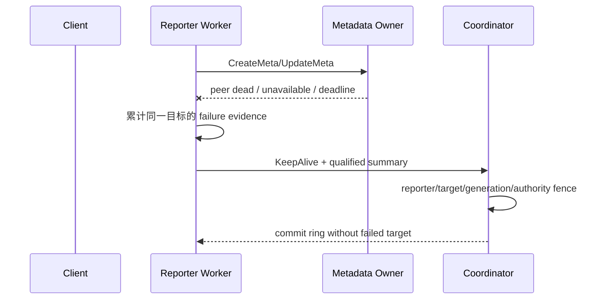

# 53c2 rebase 与新 PR 验证方案

## 1. 目标与权威来源

本轮以 [Issue #1032](https://gitcode.com/openeuler/yuanrong-datasystem/issues/1032) 为需求来源，以
`53c2548301bca4ade95586d838e14b14dae8e3cd` 为已知可恢复实现，rebase 到当前
`main/master@9473a28456f474b7ae17b4b38a4620e49408116a`，在独立分支完成验证并新建 PR。

必须同时闭环两个独立问题：

1. **failure summary 被误清**：topology 发布不能把仍为 ACTIVE 的 peer 当成真实 RPC 成功，覆盖或清除
   metadata RPC 失败证据。
2. **Client HashRing 刷新滞后**：Worker 必须把已确认的下游 metadata owner 故障与 ingress Worker 故障
   区分开，使非 local-cache Client 能及时强制刷新 ring，而不是最多再等待一个 5s 周期。

目标配置为 `node_timeout_s=3`，并分别覆盖 `node_dead_timeout_s=5` 与 `30` 的验收边界。3s 主动隔离来自
业务 RPC failure summary；租约/被动缩容只负责无业务证据时的兜底，不参与主动隔离判定。

## 2. 基线与交付边界

| 项目 | 固定值 |
|---|---|
| 旧父提交 | `888f2073e67d2873f6f4dcb47f284e3099cbd4a1` |
| 功能提交 | `53c2548301bca4ade95586d838e14b14dae8e3cd` |
| 新父提交 | `main/master@9473a28456f474b7ae17b4b38a4620e49408116a` |
| DataSystem worktree | `.worktrees/active-isolation-53c2-rebase` |
| DataSystem 分支 | `codex/active-isolation-53c2-rebase` |
| 交付形式 | 新 GitCode PR，不覆盖 PR1997 |

- 生产代码只以 53c2 patch 为功能来源；`f8b8732b`、`b7726fdd` 只用于回归诊断和测试清单参考。
- 只允许 push 到已核验的 `yche-huawei` fork，禁止 push 到 `openeuler/yuanrong-datasystem`。
- 本 RFC 留在 workbench；DataSystem PR 不携带 `docs/superpowers`、workbench 脚本或私有验证配置。

## 3. 两条正确性链路

### 3.1 summary 所有权与清理条件

summary 的清理必须能证明同一目标已经恢复或旧证据已经失去身份意义：

- 同一目标的真实 metadata RPC 成功；
- 目标已经从成员关系中移除；
- 同地址出现新的 incarnation。

topology 版本发布、仍为 ACTIVE、无关 Worker 成功或 unrelated refresh 均不是清理证据。Coordinator 只统计
窗口内、实例匹配且仍 READY/ACTIVE 的独立 reporter；reporter 故障后其票失效，剩余来源仍达阈值时继续
隔离，否则停止主动隔离并交给 `node_dead_timeout_s` 兜底。

### 3.2 metadata owner 状态与 Client 收敛

Worker 只在真实 metadata RPC 最终失败并满足 failure qualification 后返回
`K_METADATA_OWNER_UNAVAILABLE`。该状态表示 Publish 结果可能未知：

- 不自动重放 Publish；
- 不淘汰健康 ingress Worker；
- 不把下游 metadata owner 故障改写成 ingress Worker 故障。

`local_cache=false` Client 持有 ring，收到该状态后进入 53c2 的 bounded `ForceRefresh`：每 500ms 尝试一次。
Issue #1032 将其描述为“约 3s 的 bounded refresh”；53c2 精确源码使用 6s 窗口，以覆盖 3s 隔离目标及发布
余量。验收指标仍是 3s 内隔离与业务收敛，6s 是刷新持续上限，不是允许的恢复时延。

`local_cache=true` Client 不持有 ring，不调用 Client `ForceRefresh`；它继续访问健康 ingress Worker，并依赖
该 Worker 收到新 topology 后恢复。两种模式都必须恢复，但不能用“走同一 Client ring 刷新路径”描述。

## 4. rebase 冲突策略

将 53c2 的单个功能提交 rebase 到新父提交，逐文件做语义合并：

- 保存 main 中与主动隔离无关的启动恢复、并发、构建和接口演进；
- 保存 53c2 的 failure qualification、summary reset、incarnation 和 authority fence；
- 保存 `K_METADATA_OWNER_UNAVAILABLE` 的 Worker 产生条件和 Client 不重放语义；
- 保存 HashRingRefresher 的合并窗口、500ms cadence、wait/Stop 同步和 local-cache 分支；
- 禁止对冲突文件整体接受 `ours` 或 `theirs`；
- rebase 后搜索冲突标记，运行 `git diff --check`，逐项核对 CMake 与 Bazel target 闭包。

若 main 的接口变化需要兼容适配，只做保持上述语义所需的最小修改。任何额外行为变化必须先由 focused
失败用例复现，再按 TDD 修复。

## 5. 性能、并发与可用性约束

- 正常成功请求热路径不新增 RPC、持久化、参数、全局锁或同步 IO。
- failure summary 继续由 topology/coordination 所有者管理；锁内不得增加 RPC、sleep 或阻塞 IO。
- Client 重复失败合并到一个有界刷新窗口，不为每次失败创建线程或刷新任务。
- `HashRingRefresher::Stop` 必须与 condition-variable 的 wait/wakeup 和 deadline 更新正确同步。
- 3s 内允许故障窗口中的短暂失败，但新 ring 收敛后必须持续成功，不能只以一次 Set 成功作为恢复证据。
- 验收使用随机新 key；旧数据副本丢失、容量不足、20ms 大对象预算或 URMA fallback limiter 错误单独归因，
  不得混入主动隔离结论。

## 6. Tiantiyun 验证矩阵

验证环境为 80C/128G Tiantiyun，CMake Release、`-j80`、复用第三方缓存、
`BUILD_WITH_URMA_MOCK=ON`。长构建和测试必须保留明确 exit marker；共享端口/集群 ST 串行执行。

### 6.1 构建目标

- `ds_ut`
- `ds_ut_object`
- `cluster_topology_contract_ut`
- `ds_st_kv_cache`
- `ds_st_object_cache`
- `ds_st_coordinator_backend_manual`

### 6.2 focused UT

- topology publish 不清理 failure evidence；移除与新 incarnation 正确清理；
- qualification、summary wakeup、reporter reset、generation 和 authority fence；
- 多 reporter 候选与两 Worker 单 reporter 的 direct-probe 歧义路径；
- Coordinator shared deadline 和 control epoch；
- `K_METADATA_OWNER_UNAVAILABLE` 仅在 qualified metadata failure 后产生；Set/MSet 一致；
- HashRing 强制刷新 coalescing、重复失败续窗、500ms cadence、deadline/wait/Stop 竞争；
- metadata owner 失败不淘汰 ingress，不重放 ambiguous Publish；
- local cache false 触发刷新，true 继续使用健康 ingress。

### 6.3 focused 与历史 ST

- 原始双 Client Set/Get，kill metadata owner，覆盖 local cache false/true 与随机新 key；
- stop/resume 同地址 Worker：隔离、ACTIVE rejoin、旧证据清理、恢复后访问；
- 两 Worker 单 reporter：保留两轮直探并在 3s 内收敛；
- Coordinator keepalive 中断 2s、连续五轮，local cache false/true 均不得误隔离，恢复后读写正常；
- PR1997 记录的 6 条历史 Object ST 与 4 条历史 KV ST。

### 6.4 手工 disabled 主动隔离 ST

- 单 Worker stop/kill；
- 两 Worker单 reporter；
- 14 Workers，Kill 2，间隔 0ms、1000ms、2000ms；
- 14 Workers，同时 Kill 3；
- 14 Workers，间隔 500ms Kill 4。

## 7. 验收证据

每个故障场景记录：

- 注入故障时间；
- Coordinator 提交隔离时间；
- 每个目标相对自身故障的隔离耗时；
- Client 最后一次失败和连续成功时间；
- 所有存活 Worker ring 收敛时间；
- resume 后 ACTIVE rejoin 与业务恢复时间；
- local cache 模式、`node_timeout_s/node_dead_timeout_s`、URMA Mock 状态；
- PASS、FAIL 或 UNRUN，以及 setup/capacity/product failure 分类。

完成前执行 DataSystem 的 `$ds-self-verify`，检查 hot path、共享状态、恢复语义、测试覆盖、构建闭包和
`.repo_context` 新鲜度。验证通过后核验 fork URL，push 新分支并创建新 PR；未经单独授权不触发 `/retest`。
