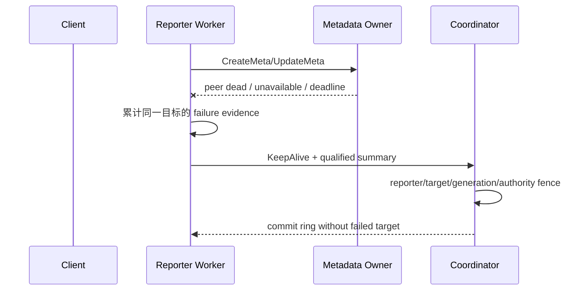

# 53c2 rebase 与新 PR 验证方案

## 1. 目标与权威来源

本轮以 [Issue #1032](https://gitcode.com/openeuler/yuanrong-datasystem/issues/1032) 为需求来源，以
`53c2548301bca4ade95586d838e14b14dae8e3cd` 为已知可恢复实现，rebase 到当前
`main/master@d897aee13b7f20b58a60f81e1b31e094964c996d`，在独立分支完成验证并新建 PR。

必须同时闭环三个独立问题：

1. **failure summary 被误清**：topology 发布不能把仍为 ACTIVE 的 peer 当成真实 RPC 成功，覆盖或清除
   metadata RPC 失败证据。
2. **Client HashRing 刷新滞后**：Worker 必须把已确认的下游 metadata owner 故障与 ingress Worker 故障
   区分开，使非 local-cache Client 能及时强制刷新 ring，而不是最多再等待一个 5s 周期。
3. **local-cache Client 直连故障 Worker 后未及时重绑定**：同机 SHM Get 收到明确的
   `K_RPC_PEER_DEAD` 后，必须异步切换当前绑定 Worker，不能等待 Client heartbeat/service discovery 兜底
   后才停止访问已移除 Worker。

目标配置为 `node_timeout_s=3`，并分别覆盖 `node_dead_timeout_s=5` 与 `30` 的验收边界。3s 主动隔离来自
业务 RPC failure summary；租约/被动缩容只负责无业务证据时的兜底，不参与主动隔离判定。

## 2. 基线与交付边界

| 项目 | 固定值 |
|---|---|
| 旧父提交 | `888f2073e67d2873f6f4dcb47f284e3099cbd4a1` |
| 功能提交 | `53c2548301bca4ade95586d838e14b14dae8e3cd` |
| 新父提交 | `main/master@d897aee13b7f20b58a60f81e1b31e094964c996d` |
| 53c2 rebase 提交 | `ee037795d` |
| local-cache peer-dead 切换提交 | `c30b59fb4` |
| 有界刷新与并发加固提交 | `cf338e05b` |
| 最终格式整理提交 | `ea907ab5b` |
| DataSystem worktree | `.worktrees/active-isolation-53c2-rebase` |
| DataSystem 分支 | `codex/active-isolation-53c2-main` |
| 交付形式 | 新 GitCode PR，不覆盖 PR1997 |

- 生产代码只以 53c2 patch 为功能来源；`f8b8732b`、`b7726fdd` 只用于回归诊断和测试清单参考。
- 只允许 push 到已核验的 `yche-huawei` fork，禁止 push 到 `openeuler/yuanrong-datasystem`。
- 本 RFC 留在 workbench；DataSystem PR 不携带 `docs/superpowers`、workbench 脚本或私有验证配置。

## 3. 两条正确性链路

### 3.1 summary 所有权与清理条件

summary 的清理必须能证明同一目标已经恢复或旧证据已经失去身份意义：

- 同一目标的真实 metadata RPC 成功；
- 目标已经从成员关系中移除；
- 同地址出现新的 incarnation。

topology 版本发布、仍为 ACTIVE、无关 Worker 成功或 unrelated refresh 均不是清理证据。Coordinator 只统计
窗口内、实例匹配且仍 READY/ACTIVE 的独立 reporter；reporter 故障后其票失效，剩余来源仍达阈值时继续
隔离，否则停止主动隔离并交给 `node_dead_timeout_s` 兜底。

### 3.2 metadata owner 状态与 Client 收敛

Worker 只在真实 metadata RPC 最终失败并满足 failure qualification 后返回
`K_METADATA_OWNER_UNAVAILABLE`。该状态表示 Publish 结果可能未知：

- 不自动重放 Publish；
- 不淘汰健康 ingress Worker；
- 不把下游 metadata owner 故障改写成 ingress Worker 故障。

`local_cache=false` Client 持有 ring，收到该状态后进入 53c2 的 bounded `ForceRefresh`：每 500ms 尝试一次。
Issue #1032 将其描述为“约 3s 的 bounded refresh”；53c2 精确源码使用 6s 窗口，以覆盖 3s 隔离目标及发布
余量。验收指标仍是 3s 内隔离与业务收敛，6s 是刷新持续上限，不是允许的恢复时延。

`local_cache=true` Client 在启用 cross-node routing 后同样持有 ring，但同机 key 会优先走绑定 Worker 的 SHM
直连。PR1997 当前实现中，这条路径遇到明确的 `K_RPC_PEER_DEAD` 会直接返回，不会进入 metadata failure
handler，也不会调用 `ForceRefresh` 或 `SwitchWorkerNode`。因此需要同时完成两件事：淘汰/刷新故障路由，且在
后台切走已经死亡的当前绑定 Worker。这个本地直连分支不负责刷新 metadata ring；ring 刷新仍由 routed
metadata-owner failure 路径负责。切换不得在请求线程同步等待，也不得自动重放结果不确定的写请求。

### 3.3 PR1997 当前归档的剩余问题证据

`errCollect.tar.gz` 与 `isolation-key-logs(2).tar.gz` 对应运行提交
`b7726fdd29d95847e87fa6ad059219638123b8e4`。本次双 Worker 故障的关键时间线如下：

| 事件 | 时间 | 相对首次 Client 失败 |
|---|---:|---:|
| 首次 Client 访问失败 | 15:36:22.266 | 0 ms |
| Coordinator 收到首份 qualified summary | 15:36:23.751 | 1,485 ms |
| 第一个/第二个目标确认主动隔离 | 15:36:24.078 / 15:36:24.087 | 1,812 / 1,821 ms |
| 最终 v6 commit，两个目标均移除 | 15:36:24.383 | 2,116 ms |
| 10 个存活 Worker 首次发布 v6 | 15:36:24.417–15:36:24.471 | 2,150–2,204 ms |
| local-cache Client 最后一次直连已移除 Worker | 15:36:25.656 | 3,389 ms |

该运行证明 summary 没有在最终 commit 前被覆盖，且存活 Worker ring 已快速一致收敛；它不能证明 Client 已
及时收敛。三个 `K_RPC_PEER_DEAD` Get 位于 15:36:25.638–25.656，目标均为已经从 v6 移除的
`192.168.235.186:31501`，与精确源码中的直连 Get 缺口一致。

归档的 328 个错误必须分开解释：196 个 code 6 是共享内存容量不足，100 个 code 1001 主要是 8 MiB Get
在约 20 ms API 预算内超时，24 个 code 2005 是旧对象无可用副本，2 个 code 1004 是 URMA wait timeout
后 8 MiB TCP fallback 被 1 MiB limiter 拒绝，5 个 code 1011 中只有故障窗口内的 3 个属于上述绑定 Worker
收敛缺口，1 个 code 39 是故障窗口内的 metadata owner unavailable。不得把前四类计入主动隔离时延。

运行配置还存在 Coordinator `node_timeout_s=60`、Worker `node_timeout_s=3` 的不一致；新 PR 验收必须明确
核对 Coordinator 与 Worker 均为目标配置，避免配置漂移掩盖源码结论。

## 4. rebase 冲突策略

将 53c2 的单个功能提交 rebase 到新父提交，逐文件做语义合并：

- 保存 main 中与主动隔离无关的启动恢复、并发、构建和接口演进；
- 保存 53c2 的 failure qualification、summary reset、incarnation 和 authority fence；
- 保存 `K_METADATA_OWNER_UNAVAILABLE` 的 Worker 产生条件和 Client 不重放语义；
- 保存 HashRingRefresher 的合并窗口、500ms cadence、wait/Stop 同步和 local-cache 分支；
- 禁止对冲突文件整体接受 `ours` 或 `theirs`；
- rebase 后搜索冲突标记，运行 `git diff --check`，逐项核对 CMake 与 Bazel target 闭包。

若 main 的接口变化需要兼容适配，只做保持上述语义所需的最小修改。任何额外行为变化必须先由 focused
失败用例复现，再按 TDD 修复。

## 5. 性能、并发与可用性约束

- 正常成功请求热路径不新增 RPC、持久化、参数、全局锁或同步 IO。
- failure summary 继续由 topology/coordination 所有者管理；锁内不得增加 RPC、sleep 或阻塞 IO。
- Client 重复 failure refresh 合并到一个有界刷新窗口；direct peer-dead 切换按 Worker API 实例去重，使旧
  Worker 的排队任务不会吞掉新绑定 Worker 的切换请求，也不为同一实例的每次失败创建任务。
- `HashRingRefresher::Stop` 必须与 condition-variable 的 wait/wakeup 和 deadline 更新正确同步。
- 后台 HashRing RPC 单次 250ms、每轮最多探测 4 个 Worker；可达但未更新的 Worker 不能遮蔽后续节点上的新
  ring。Coordinator summary 清理按 reporter 反向索引执行，主动直探每轮最多 32 个目标并公平轮转。
- 3s 内允许故障窗口中的短暂失败，但新 ring 收敛后必须持续成功，不能只以一次 Set 成功作为恢复证据。
- 验收使用随机新 key；旧数据副本丢失、容量不足、20ms 大对象预算或 URMA fallback limiter 错误单独归因，
  不得混入主动隔离结论。

## 6. Tiantiyun 验证矩阵

验证环境为 80C/128G Tiantiyun，CMake Release、`-j16`、复用第三方缓存、
`BUILD_WITH_URMA_MOCK=ON`。长构建和测试必须保留明确 exit marker；共享端口/集群 ST 串行执行。

### 6.1 构建目标

- `ds_ut`
- `ds_ut_object`
- `cluster_topology_contract_ut`
- `ds_st_kv_cache`
- `ds_st_object_cache`
- `ds_st_coordinator_backend_manual`

### 6.2 focused UT

- topology publish 不清理 failure evidence；移除与新 incarnation 正确清理；
- qualification、summary wakeup、reporter reset、generation 和 authority fence；
- 多 reporter 候选与两 Worker 单 reporter 的 direct-probe 歧义路径；
- Coordinator shared deadline 和 control epoch；
- `K_METADATA_OWNER_UNAVAILABLE` 仅在 qualified metadata failure 后产生；Set/MSet 一致；
- HashRing 强制刷新 coalescing、重复失败续窗、500ms cadence、deadline/wait/Stop 竞争；
- metadata owner 失败不淘汰 ingress，不重放 ambiguous Publish；
- local cache false 的 metadata owner 失败触发刷新；
- local cache true 的同机 SHM Get 收到 `K_RPC_PEER_DEAD` 后触发合并的异步绑定 Worker 切换；
- 并发多个 Get 只合并为一次切换，不阻塞请求线程，不因旧切换任务覆盖新 current worker；
- 明确 peer-dead 与 deadline/cancelled 分流：瞬时超时不能误切健康 Worker，写请求不能因切换而自动重放。

### 6.3 focused 与历史 ST

- 原始双 Client Set/Get，kill metadata owner，覆盖 local cache false/true 与随机新 key；
- local cache true Client 与被 kill Worker 同机绑定，把 Client heartbeat 拉长到 30s，确认 peer-dead Get
  在 5s 内触发 `SwitchWorkerNode`；
- stop/resume 同地址 Worker：隔离、ACTIVE rejoin、旧证据清理、恢复后访问；
- 两 Worker 单 reporter：保留两轮直探并在 3s 内收敛；
- Coordinator keepalive 中断 2s、连续五轮，local cache false/true 均不得误隔离，恢复后读写正常；
- PR1997 记录的 6 条历史 Object ST 与 4 条历史 KV ST。

### 6.4 手工 disabled 主动隔离 ST

- 单 Worker stop/kill；
- 两 Worker单 reporter；
- 14 Workers，Kill 2，间隔 0ms、1000ms、2000ms；
- 14 Workers，同时 Kill 3；
- 14 Workers，间隔 500ms Kill 4。

## 7. 验收证据

每个故障场景记录：

- 注入故障时间；
- Coordinator 提交隔离时间；
- 每个目标相对自身故障的隔离耗时；
- Client 最后一次失败和连续成功时间；
- 所有存活 Worker ring 收敛时间；
- resume 后 ACTIVE rejoin 与业务恢复时间；
- local cache 模式、`node_timeout_s/node_dead_timeout_s`、URMA Mock 状态；
- PASS、FAIL 或 UNRUN，以及 setup/capacity/product failure 分类。

完成前执行 DataSystem 的 `$ds-self-verify`，检查 hot path、共享状态、恢复语义、测试覆盖、构建闭包和
`.repo_context` 新鲜度。验证通过后核验 fork URL，push 新分支并创建新 PR；未经单独授权不触发 `/retest`。

## 8. 2026-08-15 CMake 验证记录

验证主机：`tiantiyun-80c128g`；源码目录：
`/home/worktrees/active-isolation-53c2-main/datasystem`；构建目录：`build-cmake-urma-mock`；配置为 Release、
`WITH_TESTS=ON`、`BUILD_WITH_URMA_MOCK=ON`，第三方缓存为 `/home/cache/ds-thirdparty-cache`。

- 语义实现固定在 `cf338e05b`；在仅包含仓库格式整理的最终 rebase 头 `ea907ab5b` 上，CMake 构建
  `ds_ut`、`cluster_topology_contract_ut`、`ds_st_kv_cache` 全部成功；未使用 Bazel。
- `ds_ut` focused 51/51 通过：20 条 HashRingRefresher、30 条 TopologyControlHost、1 条 Coordinator
  active-failure 配置用例。新增覆盖“首节点 unchanged、后续节点 changed”、250ms timeout 传递和 Stop
  最多等待一个在途 RPC。
- `cluster_topology_contract_ut` focused 43/43 通过，覆盖 DsCoordinationBackend session、active-failure
  Controller/Engine；新增 70 个候选场景验证每轮最多 32 个直探且轮转无饥饿。
- 最终格式整理提交后再次执行上述 focused UT，`ds_ut` 51/51、`cluster_topology_contract_ut` 43/43 通过。
- Client ST 5/5 通过：mmap switch 3/3（新增
  `LEVEL1_PeerDeadGetTriggersWorkerSwitchBeforeHeartbeatTimeout` 总耗时 10.1s）以及 metadata-owner refresh、
  ambiguous Publish 不重放各 1 条。首次直接运行 mmap 三条在 SetUp 阶段因未设置 CMake 的
  `TEST_SRCDIR/TEST_WORKSPACE` 而找不到 mock OBS 脚本；补齐测试环境后 3/3 通过，未发生产品断言失败。
- disabled 主动隔离 ST 9 个场景中，串行首轮 8/9 通过；Gap2000ms 场景在正式 kill 前有一个 Worker 因
  `Coordinator routing deadline exceeded` 启动失败，单独重跑通过（27.1s），归类为 setup/resource 抖动。
- 单 Worker stop/resume 的隔离与访问恢复分别为 2,374ms、2,359ms；rejoin 为 3,368ms。Client kill 场景
  Set 恢复 3,130ms，local-cache true/false Get 恢复 3,181/3,267ms。两 Worker单 reporter 隔离 2,284ms，
  Client 恢复 2,359ms。
- Kill 2/3/4 的目标相对自身 kill 的隔离耗时范围 2,452–2,839ms（Kill 4 为 2,520–2,595ms）；所有存活
  Worker ring 相对最后一次 kill 的收敛范围 2,486–2,873ms（Kill 4 为 2,625ms）。全部低于 4,000ms
  断言门限并显著低于 9s SLO。
- 本轮 rebase 已包含 upstream 对 `urma_manager.cpp` signed/unsigned `-Werror` 的修复，远端源码无需任何
  验证专用补丁；验证目录与 PR 源码一致。
