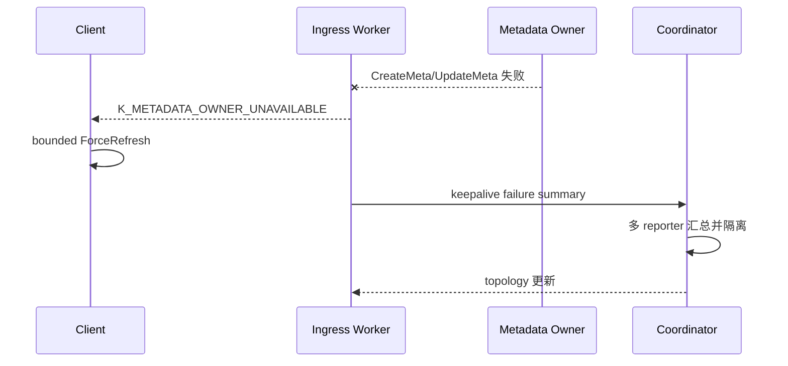

# 3s 主动隔离正确性修复 RFC

| 项目 | 内容 |
|---|---|
| Status | **Review** |
| Issue | [openeuler/yuanrong-datasystem#1032](https://gitcode.com/openeuler/yuanrong-datasystem/issues/1032) |
| 场景 | Coordinator 路径，`node_timeout_s=3` |

## 1. 问题

| 问题 | 现象 | 根因 |
|---|---|---|
| failure summary 被误清 | 双节点故障第二个节点隔离约 `3595ms`，失败可继续放大 | topology 发布把仍为 ACTIVE 的 peer 当成 RPC 成功，清除真实失败证据 |
| Client ring 刷新滞后 | metadata publish 失败后，即使隔离完成仍可能等 5s 周期刷新 | 下游 metadata owner 失败被透传为普通 RPC 错误，Client 无法识别失败来源 |

## 2. 方案

1. topology 发布不再调用 `RecordPeerRpcSuccess`。
2. failure summary 只由同一目标的真实 metadata RPC 成功清理；无新失败时按 active window 过期。
3. Worker 将真实 metadata RPC 最终失败标记为 `K_METADATA_OWNER_UNAVAILABLE`。
4. Client 只触发约 3s 的强制 ring 刷新，不淘汰健康 ingress Worker，不重放结果未知的 Publish。
5. local-cache Client 不持有 ring，继续依赖 ingress Worker 的 topology 收敛。

## 3. Reporter 故障

- Coordinator 只统计窗口内、实例匹配且仍 READY/ACTIVE 的独立 reporter。
- reporter 故障后，其旧票立即失效；其余来源达到阈值则继续隔离。
- 低于阈值时停止主动隔离，避免误杀；`node_dead_timeout_s` 负责兜底。

## 4. 验收

| 用例 | 关键结果 |
|---|---|
| topology publish UT | topology 版本变化后 failure summary 保留 |
| 客户读写 ST | metadata 隔离 `1648ms`；SET 最后失败 `1580ms`；GET 恢复 `1695ms` |
| 两 Worker 单来源 ST | 隔离 `2289ms`；连续恢复 `2361ms` |
| 双节点同时 kill | `1853ms / 1835ms` 隔离；最后隔离后 `175ms` 恢复 |
| 双节点间隔 1s kill | `1858ms / 1950ms` 隔离；最后隔离后 `179ms` 恢复 |
| 双节点间隔 2s kill | `1861ms / 2088ms` 隔离；最后隔离后 `179ms` 恢复 |
| metadata publish ST | local cache false 触发刷新；true 继续使用健康 ingress；均不重放 |
| reporter 故障 UT | 6 个来源中 1 个失效，剩余 5 个仍形成候选 |
| 构建 | CMake 全包，URMA Mock ON，`-j40`，PASS |

## 5. 代码落点

| 模块 | 修改 |
|---|---|
| `TopologyEngine` | 删除 topology 发布伪成功清理 |
| `WorkerOcServicePublishImpl` | 标记下游 metadata owner RPC 失败 |
| `ObjectClientImpl` | 接收标记并触发 bounded ring refresh |
| `TopologyControlHost` UT | 验证 reporter 故障后的 quorum |
| Coordinator active-failure ST | 验证 3s 隔离和隔离后 1s 内停止失败 |
