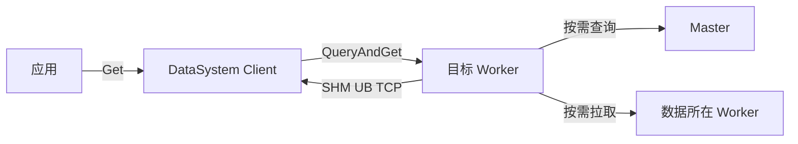
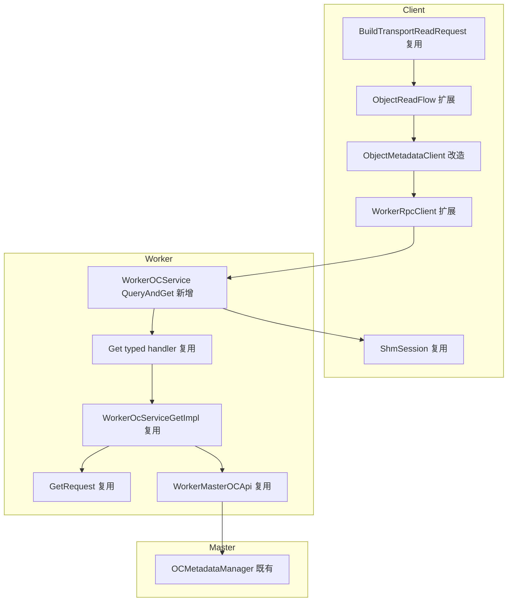
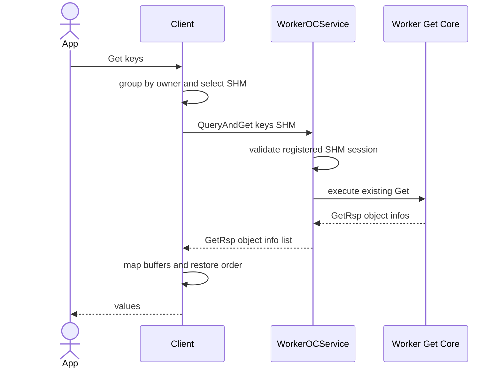
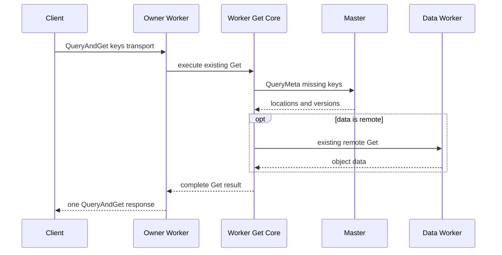
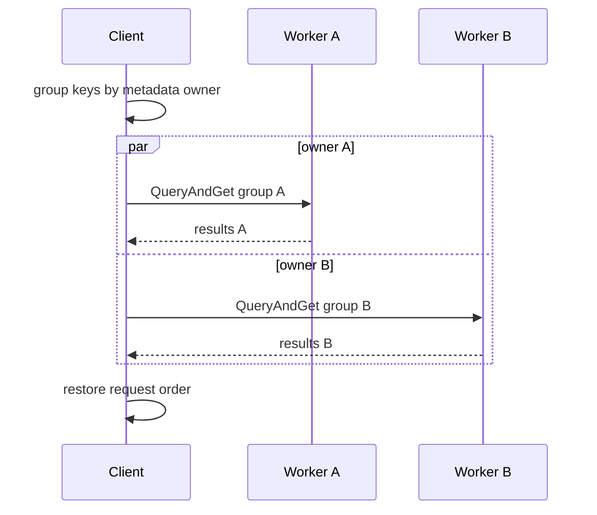

# 子模块：Worker QueryAndGet 快速穿刺

| 属性 | 值 |
|---|---|
| 创建 | 2026-08-19（基于需求图与现有 Get/QueryAndGet 源码） |
| 修改 | 2026-08-19（方案 A 首版） |
| 阶段 | P1 协议与单 Worker 穿刺 / P2 多 key 与异常闭环 / P3 性能验收 |
| 基线 | DataSystem `main/master` `71fada0780e4f3d5475c7d7a9df1f5ae8e1bd042` |

## §1 需求背景与目标

`local_cache=false` 时，Client 先按 `PREFERRED_META_OWNER` 为 key 选择 metadata owner
（`src/datasystem/client/object_cache/object_client_impl.cpp:5256-5307`），随后
`ObjectReadFlow::Run` 先执行 QueryAndGet，再对未携带数据的结果执行第二阶段 replica read
（`src/datasystem/client/transport/object_read/object_read_flow.cpp:267-283`）。现有
`WorkerRpcClient::DoInvokeQueryAndGet` 实际调用目标 Worker 地址上的 `MasterOCService` stub，而不是
`WorkerOCService`（`src/datasystem/client/transport/rpc/worker_rpc_client.cpp:114-118`）。

现有 master QueryAndGet 只为单 key 初始化 inline data 请求；多 key 会退化为 metadata-only，再进入第二阶段
（`src/datasystem/client/transport/metadata/object_metadata_client.cpp:147-159`）。另一方面，既有 Worker Get 已经
具备批量 key、SHM/UB/TCP 返回、本地查找、Worker→Master 元数据查询、跨 Worker 拉取、spill、等待、对象顺序恢复和
SHM 引用维护能力。方案 A 的核心不是再造 Get，而是在正确的 Worker 边界上为它增加一个 QueryAndGet 门面。

| # | 目标 | 验收 | 阶段 |
|---|---|---|---|
| G1 | 保持 Client→Worker→Master 分层 | 新请求只调用 `WorkerOCService::QueryAndGet`；Client 不直调新路径的 Master stub | P1 |
| G2 | 同节点走 SHM | Client 通过 `QueryAndGetShmPb` 明确选择 SHM；复用 `GetRspPb::ObjectInfoPb` mmap 并维护引用 | P1 |
| G3 | 单目标成功请求减少 RPC | 稳态单 key、同目标多 key 全成功时恰好 1 条 Client→Worker QueryAndGet，第二阶段 Get 为 0 | P1/P2 |
| G4 | 最大复用现有模块 | Worker 复用 `WorkerOcServiceGetImpl`、`GetRequest`、`WorkerMasterOCApi` 和现有数据搬运 | P1 |
| G5 | 覆盖四个基础 UseCase 与批量/异常 | 本文 §3 的 UC1-UC10 均有 UT/ST 或明确的性能验收项 | P2/P3 |
| G6 | 控制热点成本和回滚风险 | 无新增逐 key Client RPC；无新持久状态；可按请求回退既有两阶段读取 | P2 |

## §2 需求边界

### 2.1 关键概念

| 概念 | 定义 |
|---|---|
| metadata-affinity Worker | Client 按 `PREFERRED_META_OWNER` 为 key 计算出的 Worker |
| 单目标批次 | 一次 SDK Get 中归属于同一个 metadata-affinity Worker 的 key 子集 |
| 稳态 | Client 已注册、路由就绪、SHM session/FD 已建立，排除连接及预热控制面动作 |
| 精确一次 RPC | 每个单目标批次恰好一条 Client→Worker QueryAndGet RPC；不包含 Worker 内部 RPC |
| QueryAndGetShmPb | QueryAndGet 请求中由 Client 显式声明 SHM 的 marker PB；响应继续复用成熟的 `GetRspPb::ObjectInfoPb` |
| 完整命中 | Worker 在一次服务端流程内为子批次所有 key 构造成功结果，不要求数据最初都驻留该 Worker |

### 2.2 做什么

| 端/组件 | 职责 |
|---|---|
| Client route/read flow | 保持现有 owner 分组；按目标 Worker 判断 SHM/UB/TCP；发送一条新 RPC并直接组装结果 |
| Worker RPC facade | 鉴权、校验 Client 声明的 transport，使用同一 `GetReqPb/GetRspPb` 调用现有 Get 核心 |
| Worker Get core | 继续负责本地对象、Master 元数据、远端副本、spill、等待、批量和超时；响应 transport 使用显式 mode |
| WorkerMasterOCApi | 继续作为唯一 Worker→Master 元数据边界；同进程走 local API，跨进程走 RPC |
| Protobuf | 在 `GetReqPb` 末尾追加 QueryAndGet transport/routed 字段和显式 `QueryAndGetShmPb`；响应完全复用 `GetRspPb` |
| Test/DFX | 断言 RPC 数、transport、结果顺序、fallback 原因与四类基础场景 |

### 2.3 不做什么

| 事项 | 归属/原因 |
|---|---|
| 删除现有 Master QueryAndGet | 保留为兼容和灰度回退路径 |
| Worker 自行猜测 Client 是否同节点 | Client 已有拓扑与 transport advisor；Worker只校验声明是否可用 |
| 为 QueryAndGet 重写远端取数、spill 或等待算法 | 直接复用 Worker Get 核心 |
| 承诺跨多个 metadata owner 的整个批次只有一条 RPC | 每个 owner 一条才符合路由与并行边界 |
| 用 URMA Mock 证明真实 UB 性能 | Mock 只验证协议、选择和生命周期，实机另验收 |
| 改变一致性、引用计数或对象状态语义 | 沿用 Get 语义 |
| 新增持久化状态或恢复格式 | 本特性只有请求态和已有 SHM ref；无新持久状态 |

## §3 UseCase

### 3.1 基础拓扑



| UseCase | 使用者 | 场景 | 需要什么 | 设计响应 | 验收 |
|---|---|---|---|---|---|
| UC1 | 同节点 Client | metadata-affinity Worker 本地命中 | 最短本地路径 | Client 设置 Shm marker；Worker复用 GetRsp object info | 1 QAG RPC、0 phase2、数据正确 |
| UC2 | 跨节点 Client | metadata-affinity Worker 本地命中 | 一次跨节点返回 | Client 选 UB，失败可选 TCP；Worker写入接收区或 payload | 1 QAG RPC、0 phase2 |
| UC3 | 同节点 Client | owner miss，数据 Worker 与 Client 同节点 | Worker 补齐元数据和数据 | owner Worker 查 Master 并复用远端 Get，最终按请求 transport 返回 | 1 Client RPC、数据正确 |
| UC4 | 跨节点 Client | owner miss，数据 Worker 在其它节点 | 服务端完成跨 Worker 取数 | owner Worker 查 Master并远端拉取 | 1 Client RPC、数据正确 |
| UC5 | Client | 同 owner 多 key 全命中 | 批量不退化 | 单请求携带多 key；按 object_index 恢复顺序 | 1 QAG RPC、0 phase2 |
| UC6 | Client | 同 owner 多 key 部分命中 | 一次请求内补齐 | Worker Get core 对 miss 查 Master/拉取 | 1 QAG RPC、逐项状态正确 |
| UC7 | Client | 多 owner 多 key | 有界并行 | Client 现有分组并行，每 owner 一条 QAG | RPC 数等于非空 owner 组数 |
| UC8 | Client | key 不存在或超时 | 可诊断错误 | 沿用 Get 的逐项占位与 last_rc；不伪造 SHM | 状态、顺序、资源释放正确 |
| UC9 | Client | SHM session 无效或 transport 不可用 | 安全降级 | Worker拒绝不匹配声明；Client按既有策略回退两阶段路径 | 无越权 mmap、无引用泄漏 |
| UC10 | 运维/性能人员 | 稳态性能验收 | 可量化收益和回归边界 | 统计 RPC、P50/P99、吞吐、transport | Tiantiyun 对比报告 |

UC1-UC4 来源于需求图；UC5-UC10 是批量、失败、安全和验收必须补齐的边界。

## §4 方案设计

### 4.1 模块和职责



| 模块 | 现状 | 改造方式 |
|---|---|---|
| `BuildTransportReadRequest` | 已按 metadata owner 分组 | 不改路由语义 |
| `ObjectReadFlow` | QueryAndGet 后再读 replica | 扩展：识别 Worker 已完整返回的数据并跳过 phase2 |
| `ObjectMetadataClient` | 直调 Master QueryAndGet；多 key 不 inline | 改造：新路径按 owner 调 Worker QueryAndGet |
| `WorkerRpcClient` | 有 control/data/master stubs | 扩展：在 control stub 上调用 Worker QueryAndGet |
| `WorkerOCServiceImpl` | `Get` 委托现有 get processor | 扩展：新增 QueryAndGet 门面，同样委托 Get 核心 |
| `WorkerOcServiceGetImpl`/`GetRequest` | 完整 Get 能力与 SHM refs | 复用同一 typed handler；无响应转换 |
| `WorkerMasterOCApi` | local/remote QueryMeta | 原样复用 |

### 4.2 关键交互

#### 4.2.1 同节点 SHM 全命中



这条稳态路径只有一条 Client→Worker RPC。`RegisterClient`、Unix socket FD 交换、mmap 建立及连接重建不计入
单次业务 RPC。Worker 仍通过 `GetRequest::ConstructResponse` 增加 SHM 引用，Client 继续承担释放责任。

#### 4.2.2 Worker miss 后访问 Master



Worker→Master 同机时使用 `WorkerLocalMasterOCApi::QueryMeta`，跨进程时使用
`WorkerRemoteMasterOCApi::QueryMeta`；两者都已继承剩余 deadline 和签名逻辑。

#### 4.2.3 多 owner 批量



### 4.3 PB 与 RPC

`object_posix.proto` 不新增第二套请求/响应。新 RPC 直接复用完整的 `GetReqPb/GetRspPb`，从而保留 batch、
`request_timeout`、AK/SK 100-102、对象索引、失败占位、UB provider detail 和 latency 字段。只在
`GetReqPb` 尾部追加两个向后兼容字段：显式 SHM marker 与 routed 鉴权标记。

```protobuf
message QueryAndGetShmPb {
}

message GetReqPb {
  // Existing fields 1 through 14 remain unchanged.
  QueryAndGetShmPb query_and_get_shm = 15;
  bool is_routed = 16;
  // Existing AK and SK fields 100 through 102 remain unchanged.
}
```

```protobuf
// Append at the end of WorkerOCService. Never insert before an existing method.
rpc QueryAndGet(GetReqPb) returns (GetRspPb) {
  option (datasystem.unary_socket_option) = true;
  option (datasystem.recv_payload_option) = true;
}
```

`QueryAndGetShmPb` 是 Client 已判断同节点并已建立 `ShmSession` 的显式声明，不复制 SHM 定位字段。实际响应
继续使用 `GetRspPb::ObjectInfoPb`，并由既有 `ShmSession::ValidateObjectInfo/BuildResult` 完成 fd side-channel、
范围校验、mmap、引用登记与 Buffer owner 构造。UB 继续由既有 `urma_info/ub_buffer_size` 表达；既没有 SHM
marker 也没有有效 UB 信息时为 TCP。`is_routed=true` 只允许 UB/TCP 的目标 Worker 请求使用签名鉴权，避免要求
Client 在每个远端 Worker 建立 SHM 注册；SHM 必须 `is_routed=false` 且 client id 属于目标 Worker 的有效 session。

自定义 ZMQ RPC 以 service 方法 ordinal 作为 wire method index，所以 QueryAndGet 必须追加在
`WorkerOCService` 最后，禁止插入或重排现有方法；同时验证新旧 Client/Worker 的 ZMQ 与 bRPC 混部行为。

### 4.4 Client transport 决策

| 条件 | Client 声明 | Worker 校验 | 返回载体 |
|---|---|---|---|
| target 与 Client 同 host 且 SHM session 已注册 | `query_and_get_shm` 存在且 `is_routed=false` | client id、session、tenant/auth 有效 | `GetRspPb.objects` + fd side-channel |
| 跨 host 且 UB 连接/receive buffer 可用 | `is_routed=true` 且 `urma_info` 有效 | AK/SK、URMA 地址、长度有效，目标无需 SHM 注册 | UB 写 + `payload_info` |
| UB 不可用或策略为 TCP | `is_routed=true` 且无有效 `urma_info` | AK/SK、batch 和 deadline | RPC payload + `payload_info` |

Client 是 locality 和首选 transport 的唯一决策者；Worker不得把 host 字符串或 socket 类型作为隐式同节点
判断。Worker必须把请求 transport 当作不可信输入校验，尤其不能因为声明 `shm` 就绕过注册、租户或引用检查。

### 4.5 Worker 适配与复用

共享入口只做三件事：

1. 校验同一个 `GetReqPb` 的鉴权和 QueryAndGet transport invariant；
2. SHM 使用现有 session 鉴权；routed UB/TCP 使用 `AuthenticateRequest`；
3. 构造现有 `GetRequest` 并原样产生 `GetRspPb`，不做协议转换。

不得复制 `GetObjectsFromAnywhere`、`ConstructResponse`、远端拉取、spill 或 SHM ref 逻辑。现有 Get 入口
与 typed RPC stream 强耦合，应抽取一个仍使用 `ServerUnaryWriterReader<GetRspPb, GetReqPb>` 的共享 handler，
让 `Get` 与 `QueryAndGet` 两个 RPC 入口共用；不增加响应 envelope，不允许序列化后再反序列化。

`GetRequest::ConstructResponse` 仍以 session client id 判定 SHM、以 `urma_info` 判定 UB、否则 TCP。新增 marker
不替代这一成熟选择，只把 Client 的同节点判断显式传给 Worker做一致性校验：QAG 的 SHM marker 与
`ClientShmEnabled` 必须同时为真；routed QAG 必须没有 SHM marker。这样既满足 Client 决策，又避免改写现有
数据 carrier。UB 单项失败回退 TCP 时仍复用既有 mixed payload 语义。

对象生命周期沿用既有模型：Worker arena/shm unit 是所有者；`GetRequest` 在响应构造时增加 client ref；
Client Buffer 持有映射视图并在释放时 decrease ref。新门面不新增跨线程共享状态，也不改变 lock ordering。

### 4.6 失败、回退与兼容

| 失败 | 本次行为 | 后续/回退 |
|---|---|---|
| 注册/拓扑已明确 Worker 不支持新方法 | 请求发送前判定 capability miss | Client 回到现有 Master QueryAndGet + replica read |
| SHM session 校验失败 | 返回明确错误，不附带 fd/offset | 刷新注册后重试或按既有策略回退 |
| UB provider/连接失败 | 保留 provider detail | 在剩余 deadline 内按既有 transport fallback 规则处理 |
| key 不存在 | 对应 object_index 占位，返回既有状态 | 不触发无界重试 |
| Worker 内 metadata redirect | 由既有 Worker Get 内部完成 | Client 不消费 Master redirect |
| 目标 Worker/ring stale | 更新路由 | 仅在确认请求未执行时有界重试，deadline 不重置 |
| Worker→Master 超时 | 沿用剩余 deadline 和 last_rc | 返回 Client，不另启 phase2 掩盖错误 |

滚动升级使用每个 `WorkerRpcClient` 的 `UNKNOWN/SUPPORTED/UNSUPPORTED` 三态缓存。UNKNOWN 最多发起一次新 RPC；
由于新方法追加在 service 末尾，老 Worker 对未知 ordinal 返回明确 method-not-found 且不会进入任何 handler，此时
缓存 UNSUPPORTED 并安全回退旧路径。成功响应后缓存 SUPPORTED。deadline、取消、响应写失败等任何“可能已执行”
错误都不得 replay，也不得标成 UNSUPPORTED。灰度 flag 可直接禁止尝试新路径；回滚无需数据迁移。

### 4.7 热点、并发、安全与可观测性

| 维度 | 设计约束 |
|---|---|
| RPC | 单目标组从最多两阶段变为一条 Client RPC；Worker 内部 RPC 只在 miss 时发生 |
| 分配 | 已知 key 数对 PB/vector reserve；不增加逐 key heap wrapper |
| 拷贝 | SHM 只传元数据；UB 直写；TCP 保持现有 payload，不做 response 二次序列化 |
| 锁 | 复用 Get 锁与 SHM ref 锁；共享 handler 不新增全局锁，不在锁内做新 IO |
| 并发 | 多 owner 继续使用有界 task pool；Worker 内部复用既有 batch/parallel 开关 |
| 安全 | 校验 batch 上限、key、client/tenant/token、Shm marker/routed/UB 组合、buffer bounds、SHM session |
| DFX | Client 统计 QAG attempt/completed、owner group、phase2、fallback reason；Worker 统计 complete/partial、QueryMeta/RemoteGet fanout、bytes、ref reconciliation |
| 日志 | 仅错误/限频诊断，不记录 object payload、token、私有端点或逐 key 热点日志 |

## §5 对外接口与配置

用户公开 `KVClient::Get`/对象 Get API 不变。新增接口均为内部 RPC 或内部适配接口。

| 接口 | 调用方 | 频率 | 说明 |
|---|---|---|---|
| `WorkerOCService::QueryAndGet` | Client transport layer | 每个非空 owner group 一次 | 新 Worker 边界 |
| `WorkerRpcClient::DoInvokeWorkerQueryAndGet` | owner read flow | 同上 | control stub；签名；返回 `GetRspPb` |
| `WorkerOcServiceGetImpl::Get(serverApi, GetRpcKind)` | Worker Get 与 QAG facade | 每个 RPC 一次 | 同一 typed writer；kind 只控制附加校验与鉴权 |

新增内部灰度 flag `enable_worker_query_and_get`，默认关闭；测试和 A/B 显式开启。per-worker 三态能力缓存避免
逐请求探测，基线同二进制性能验证及混版测试通过后再讨论默认开启。

## §6 约束与风险

### 6.1 约束

| # | 约束 | 违规后果 |
|---|---|---|
| C1 | Client→Worker→Master，不允许 Client 新路径直调 Master | 破坏模块分层和 Worker 本地能力复用 |
| C2 | 同节点判断在 Client；Worker验证而不推断 | 错选 SHM、越权或连接状态不一致 |
| C3 | Worker Get core 是数据获取唯一实现 | 两套 spill/remote/ref 语义漂移 |
| C4 | 单目标成功路径无 phase2 | 无法满足一 RPC 性能目标 |
| C5 | deadline 只递减不重置 | 超时放大和重试风暴 |
| C6 | SHM ref 在响应成功交付与 Client 释放间成对 | 泄漏或 use-after-free |
| C7 | 新协议在 CMake/Bazel 生成链闭合 | 构建或发布包不一致 |

### 6.2 风险

| # | 风险 | 缓解 |
|---|---|---|
| R1 | Get 服务入口与 stream 写响应强耦合 | 两个 RPC 使用同一 Req/Rsp 类型和 typed writer；只给 Get 增加 `GetRpcKind` 参数 |
| R2 | SHM ref 在响应交付前已增加 | 不新增响应转换；针对写失败、取消、session generation 变化做 reconciliation 测试 |
| R3 | 多 key 某项失败时 last_rc 与逐项占位语义含糊 | 保持 Get 现状并以 object_index 断言；不在本特性重定义公共语义 |
| R4 | UNKNOWN Worker 首次尝试产生额外 RPC | 仅 method-not-found 缓存 UNSUPPORTED；稳态不得逐请求探测 |
| R5 | Worker miss 增加服务端扇出压力 | 复用既有 batch/parallel、deadline、线程池和背压；压测 partial miss |
| R6 | PB/RPC 多生成器或 mixed-version 兼容问题 | CMake/Bazel 生成闭合；ordinal 稳定性及 ZMQ/bRPC 混版测试 |
| R7 | fast path 行为异常难回滚 | 默认受 capability/灰度保护，保留旧两阶段路径 |
| R8 | 新 RPC 插入 service 中部造成 ZMQ method ordinal 错位 | RPC 只追加在 service 末尾，增加 ZMQ/bRPC 新旧端混版测试 |

## §7 落地步骤

| 阶段 | 内容 | 退出条件 |
|---|---|---|
| P1 | 先补 RPC/phase2 计数和 `QueryAndGetShmPb` 契约测试；复用 Get Req/Rsp；Worker alias；单 key SHM 穿刺 | UC1 通过；1 QAG/0 phase2 |
| P2 | 多 key、UB/TCP、miss、multi-owner、fallback；收敛共享 handler 与生命周期 | UC2-UC9 通过；CMake/Bazel 编译闭合 |
| P3 | Tiantiyun CMake URMA Mock 与本地 SHM 性能对比；门禁、自检、Issue/PR/PR review | UC10 报告、关键门禁通过、评审意见闭环 |

## §8 测试与性能方案

### 8.1 TDD 顺序

| 层级 | 建议文件/目标 | 首个失败断言 |
|---|---|---|
| Proto/UT | Worker RPC/serialization UT | 旧 Get 解析新增字段；Shm marker/routed/AK-SK roundtrip；RPC ordinal 只追加 |
| Client UT | `tests/ut/client/transport_test.cpp` | 同目标单/多 key：QAG=1、phase2 single/batch=0、顺序正确 |
| Worker UT | Worker Get service/request UT | 两个 RPC 进入同一 typed handler；SHM/routed 鉴权；deadline/ref 生命周期 |
| ST | `tests/st/client/kv_cache/kv_client_transport_get_test.cpp` | UC1-UC9，显式写 placement 与 owner/data-worker 证据 |
| CMake ST | `ds_st_kv_cache` 聚焦 filter | 非 URMA 的 TCP+真实 SHM；URMA Mock 的 UB/fallback/lifecycle |

重点新增 ST：

1. 同节点单 key metadata-affinity hit，严格计数 QAG=1、phase2 single/batch=0；
2. 同节点同 owner 多 key，严格计数 QAG=1、phase2 single/batch=0，乱序输入按原序返回；
3. 同 owner partial hit，Worker 内查询 Master/拉取后仍为 1/0；
4. 多 owner，QAG 数等于 owner group 数，任一组不再 phase2；
5. SHM session 失效、UB provider 失败、key not found、deadline、redirect；
6. Client 声明 SHM 但未注册时 Worker拒绝，且不返回可 mmap 信息；
7. 响应写失败/Client 取消后 SHM ref 经既有 reconciliation 收敛；
8. 重复 key、空 batch、最大 batch+1、混合 found/not-found、session generation 过期；
9. 新 Client→老 Worker、老 Client→新 Worker的 ZMQ 与 bRPC 混版。

Client 新增独立注入点/计数器：`client.transport.worker_query_and_get_dispatched`、
`client.transport.phase2_single_enter`、`client.transport.phase2_batch_enter`，以及可选的 owner-group count。
“1/0”只用于稳定 ring、capability 已缓存、无 redirect/retry/连接重建的一次 API 调用；Worker 内部 QueryMeta 和
RemoteGet 单独统计，不计作 Client phase2。异常场景只断言 deadline 单调递减和重试次数有界，不强行要求物理
RPC 恰好一次。

metadata-affinity hit 的 writer 与 reader 必须明确配置：

```cpp
writerOptions.enableLocalCache = false;
writerOptions.dataPlacementPolicy = DataPlacementPolicy::PREFERRED_META_OWNER;
readerOptions.enableLocalCache = false;
```

并通过 hash-ring 与 Worker 注入计数证明 metadata owner 等于 data Worker。UC3/UC4 则用
`PREFERRED_SAME_NODE` 或定向 helper 把数据放到非 owner，再证明 owner local miss 和 Worker 内部拉取，不能只看
最终 value 判断场景。

### 8.2 构建与远端验证

只在 `tiantiyun-80c128g` 构建，使用 CMake、`-j80`，并通过仓库变量
`DS_OPENSOURCE_DIR=/home/cache/ds-thirdparty-cache` 显式使用三方编译缓存。代码同步到隔离远端目录，不污染已有
checkout。至少建立非 URMA 与 URMA Mock 两套 CMake build：前者覆盖 TCP 与真实同机 SHM，后者覆盖 UB 选择、
fallback、buffer/event 生命周期并继续跑 SHM fixture。记录实际生成器、`build.sh` 是否 clamp 并行度、
`CMakeCache.txt` 中的 URMA Mock 与缓存值、目标耗时和日志。Bazel 做受影响 proto/ZMQ/bRPC 生成与 BUILD 闭合，
不用不兼容 Bazel 失败替代 CMake 产品结论。

命令骨架（实际参数以 `$ds-test` 和 exact HEAD 的 `build.sh --help` 为准）：

```bash
DS_OPENSOURCE_DIR=/home/cache/ds-thirdparty-cache bash build.sh -t build -U on -j80
cmake --build build --target ds_ut ds_ut_object ds_st_kv_cache -j80
```

### 8.3 性能验收

固定 `local_cache=false`，由 metadata-affinity write 使读请求落到目标 Worker，完成 SHM session 预热后测量：

| 场景 | 指标 | 门槛 |
|---|---|---|
| 同节点单 key SHM | Client→Worker QAG/phase2 RPC | 1 / 0 |
| 同节点同 owner 多 key SHM | Client→Worker QAG/phase2 RPC | 1 / 0 |
| 多 owner | QAG RPC | 等于 owner group 数 |
| SHM before/after | P50、P99、PMax、TPS、MiB/s | 单 owner P99 至少改善 3% 且吞吐至少改善 5%；报告误差与样本数 |
| UB Mock | 选择、写入、生命周期、fallback | 功能通过，不宣称实机性能 |

使用现有 `dsbench kv`，固定 1 KiB、128 KiB、512 KiB、8 MiB，batch=1/8/32，1x1 与 8x16 并发；单 owner
与三 owner、hit 与 50% miss 分开。每组预热后至少 5 轮，固定请求数/时长，交替 AB/BA，报告中位轮次、错误数
和实际 transport。若远端缺少真实多节点/UB 硬件，只把 SHM 性能作为本次实测门禁；跨节点性能标为硬件
release gate 待验收，不用 Mock 数据代替。

PR 自动门禁包括 proto/生成代码编译、Client RPC/结果契约 UT、Worker GetRequest/SHM ref UT、非 URMA
TCP/SHM 聚焦 ST、URMA Mock UB/fallback ST。Tiantiyun 性能为开启 feature gate 前的 required 手工门禁；默认
CTest、手工 ST、性能结果分别报告，不能合并成一句“CI 通过”。

## §9 完成定义

- 设计经架构、PB/SHM、安全、测试/性能多方评审且意见已落文档；
- 新逻辑从失败测试开始，实现差异保持在 Worker QueryAndGet 穿刺所需最小范围；
- CodeGraph 在编辑前已索引 exact HEAD，编辑后重新运行 query/callers/impact/affected；
- Tiantiyun CMake URMA Mock `-j80` 使用指定缓存构建并执行聚焦测试；
- `$ds-self-verify`、触发门禁与 `$ds-pr-review` 意见闭环；
- Issue 和 PR 只发布到经核验的用户 fork，绝不 push 到 openeuler upstream。
