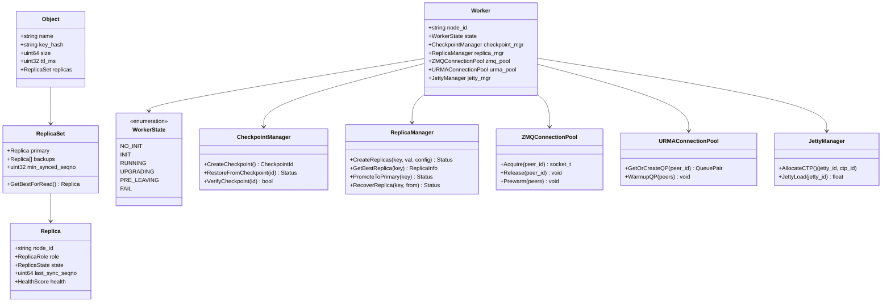
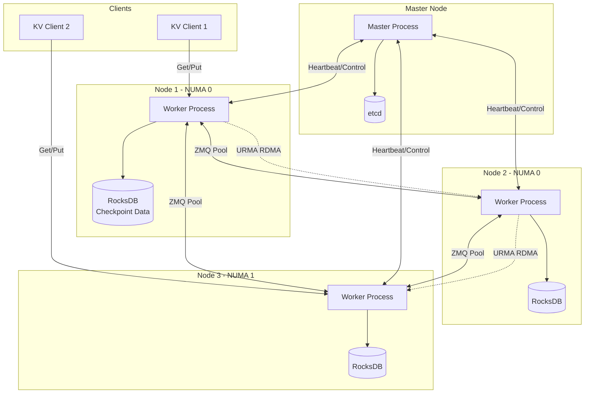
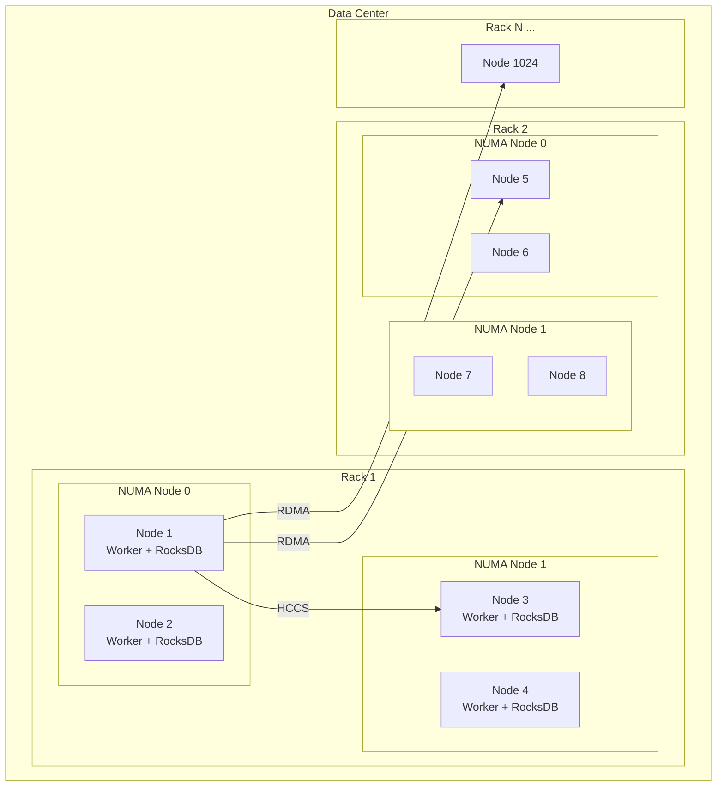
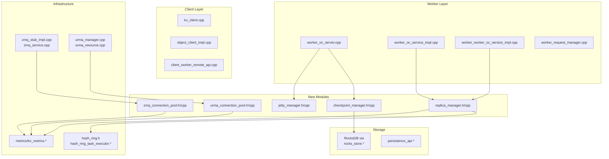
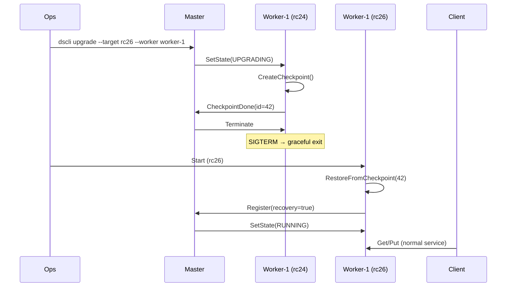
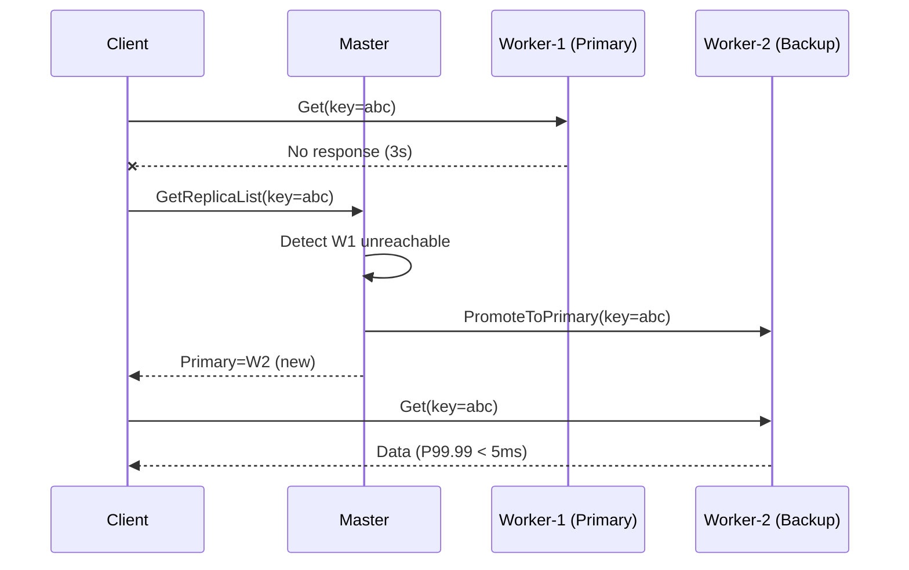
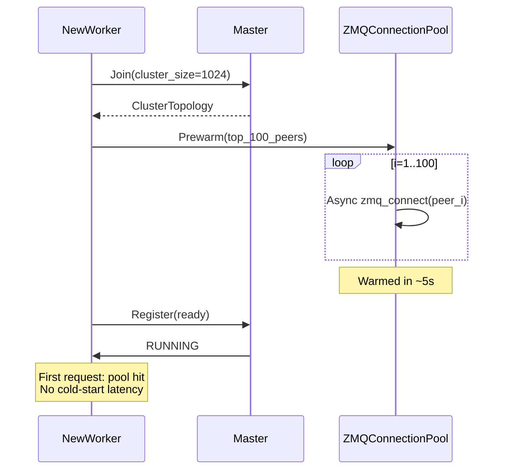

# datasystem 整体 4+1 视图 (三个 RFC 联动)

## 一、逻辑视图 (Logical View)

### 领域概念模型

### 子系统划分

| 子系统 | 职责 | 关联 RFC |
|--------|------|---------|
| **Checkpoint** | 本地持久化 + 快速恢复 | RFC1 |
| **Replica** | 副本生命周期 + 故障切换 | RFC2+3 |
| **Connection** | 连接池 + 复用 + Jetty | RFC4 |
| **HashRing** | 分布 + 反亲和 + 升级态 | RFC1, RFC2 |
| **Metrics** | 副本/恢复/连接相关指标 | RFC1, RFC2, RFC4 |

---

## 二、进程视图 (Process View)

### 系统进程/组件

### 关键交互协议

| 交互 | 协议 | 说明 |
|------|------|------|
| Client ↔ Worker (Put/Get) | ZMQ RPC | 请求/响应 |
| Worker ↔ Worker (Replicate) | ZMQ RPC + URMA RDMA | 副本同步 (控制 + 数据) |
| Worker ↔ Master (Heartbeat) | etcd Lease | 存活检测 |
| Worker → Local RocksDB | RocksDB API | Checkpoint 读写 |

---

## 三、物理视图 (Physical View)

### 1024 节点部署拓扑

### 物理约束

| 约束 | 说明 |
|------|------|
| **NUMA 亲和** | 写入优先同 NUMA node，避免跨 HCCS |
| **Rack 反亲和** | 副本跨 Rack 分布 (N=3 时) |
| **Jetty 限制** | 每 chip Jetty 数有限，CTP 需复用 |
| **本地盘** | 每节点 NVMe SSD 存 Checkpoint |
| **RDMA NIC** | 每 NUMA node 至少 1 块 200Gbps RDMA NIC |

---

## 四、开发视图 (Development View)

### 模块依赖

### 新增文件统计

| RFC | 新增 .h/.cpp | 修改现有 | 新增测试 |
|-----|:-----------:|:------:|:------:|
| RFC1 | 2 | 4 | 3 |
| RFC2+3 | 2 | 8 | 5 |
| RFC4 | 3 | 6 | 4 |
| **合计** | **7** | **18** | **12** |

---

## 五、场景视图 (Scenarios)

### S1: 滚动升级 (Normal Path)

### S2: 故障切换 (Multi-Replica Failover)

### S3: 1K 节点扩容 (Connection Pool)

---

## 接口影响汇总

### StatusCode 新增

| Code | 名称 | 场景 |
|------|------|------|
| 1011 | `K_REPLICA_UNAVAILABLE` | 所有副本不可用 |
| 1012 | `K_REPLICA_OUT_OF_SYNC` | 副本数据落后 |
| 1013 | `K_CHECKPOINT_CORRUPTED` | Checkpoint 损坏 |

### gflags 新增 (跨三个 RFC)

| Flag | Default | RFC | 说明 |
|------|---------|-----|------|
| `checkpoint_enabled` | true | RFC1 | Checkpoint 总开关 |
| `checkpoint_interval_s` | 10 | RFC1 | Checkpoint 间隔 |
| `replica_count` | 2 | RFC2 | 副本数 |
| `replica_anti_affinity` | rack | RFC2 | 反亲和级别 |
| `numa_affinity_enabled` | true | RFC2 | NUMA 亲和写入 |
| `zmq_pool_size` | 10 | RFC4 | ZMQ 连接池大小 |
| `urma_qp_pool_size` | 10 | RFC4 | URMA QP 池大小 |
| `jetty_ctp_per_jetty` | 8 | RFC4 | Jetty CTP 复用度 |

### 跨 RFC 工作量总计

| RFC | 开发 | 测试 | 合计 |
|-----|:--:|:--:|:--:|
| RFC1 滚动升级 | 18d | 8d | 26d |
| RFC2+3 多副本 | 28d | 12d | 40d |
| RFC4 建链优化 | 24d | 10d | 34d |
| **合计** | **70d** | **30d** | **100d** |

> 3 人并行约 6-8 周完成全部三个 RFC。
