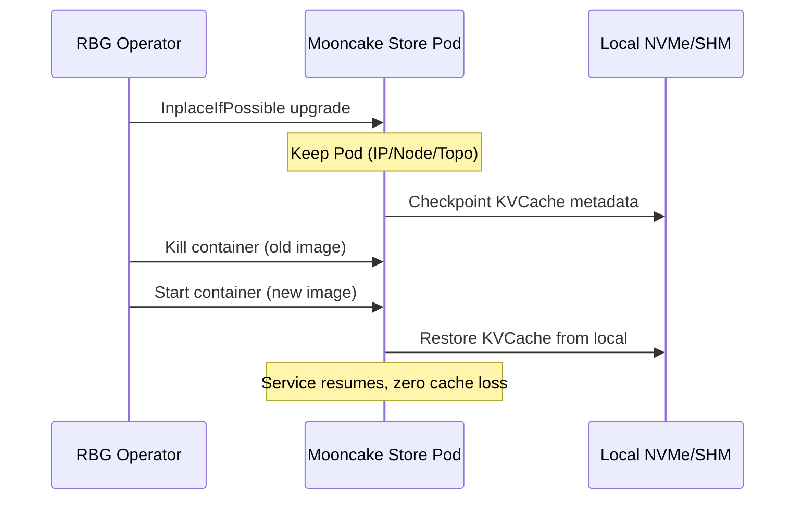
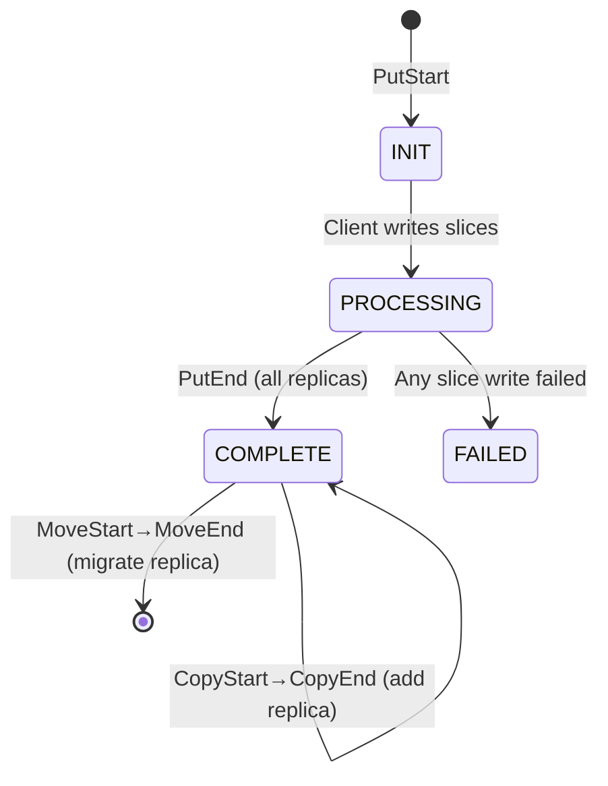

# Mooncake 竞品分析

## 概览

Mooncake 是月之暗面 (Moonshot AI) 开源的 KVCache 中心化分离式架构，
用于支撑 Kimi 大模型推理服务。架构采用 PD (Prefill/Decode) 分离 + 分布式 KVCache 池化。
已开源至 `github.com/kvcache-ai/Mooncake`。

与我们 datasystem 的相似度较高：都是分布式 KV Cache 系统，都是 RDMA 传输，都面向大模型推理场景。

---

## 一、滚动升级与原地恢复

### 1.1 Mooncake 方案

Mooncake 采用两层机制：

**L1: 本地持久化 (PR #1031)**
- KVCache metadata + hot data 快照持久化到 SharedMemory (`/dev/shm`) 或本地 NVMe/SSD
- 进程重启后从本地存储快速恢复 cache 状态
- 避免因 cache 失效触发的全量 Prefill 重算

**L2: RBG In-Place 升级**
- Kubernetes RBG (RoleBasedGroup) Operator 的 `InplaceIfPossible` 策略
- 升级时保持 Pod/Sandbox 不变（同 IP、同 Node、同拓扑）
- 仅重启容器（新镜像），复用本地持久化存储
- 支持跨角色协调升级（Prefill/Decode/Store 同步）



### 1.2 我们的差距

| 维度 | Mooncake | datasystem 当前 |
|------|---------|:--:|
| 本地持久化 | SharedMemory/NVMe 快照 | RocksDB WAL (仅 Replica 同步) |
| 进程重启恢复 | 从本地恢复 cache | 从 etcd 重建或 peer 对账 |
| 滚动升级 | RBG In-Place 容器重启 | 无机制，需全量迁移 |
| 恢复时间 | 秒级（容器重启） | 分钟级（全量重建） |

### 1.3 参考启示

1. **Mooncake 的 SharedMemory 快照机制值得参考**：我们可用 RocksDB 增量 checkpoint 替代全量等重建
2. **RBG In-Place 思路可借鉴**：datasystem 自身有 hash ring 状态机 (NO_INIT→INIT→RUNNING→PRE_LEAVING)，可在 RUNNING 态加入 `UPGRADING` 过渡态
3. **跨角色协调**：我们 Worker/Master/Client 三层也需版本兼容性保证

---

## 二、数据多副本

### 2.1 Mooncake 方案

Mooncake Store 支持多副本的完整实现：

**核心概念：**
- **Slice-level 反亲和**：同一对象的每个 slice 保证在不同 segment（不同节点）
- **ReplicateConfig**：`replica_num`（副本数）、`soft_pin`/`hard_pin`（保留策略）
- **三种副本操作**：
  - `PutStart/PutEnd`：写入时创建副本（两阶段协议）
  - `CopyStart/CopyEnd`：为已有对象添加副本（不删源）
  - `MoveStart/MoveEnd`：迁移副本（删源）

**一致性模型：**
- 对象级别强一致性 + 不可变性 (Immutable after Put)
- Lease 机制防读写竞争（Hard Lease 5s default, Soft Pin 30min）



**Replica 放置算法：**
```
1. 选择 replica_num 个不同 segment（跨节点）
2. 优先 NUMA 本地节点 → 同机架 → 可用区
3. 总容量不足时尽力而为（best-effort）
```

### 2.2 均衡访问机制

Mooncake 的负载均衡：
- **Conductor 全局调度**：track prefix cache hit length + instance load
- **热点自动迁移**：高频 key 通过 `CopyStart/CopyEnd` 异步多副本
- **读副本选择**：从最近/负载最低的副本读取
- **多 NIC 聚合**：4×200Gbps RoCE → 87GB/s，8×400Gbps → 190GB/s

### 2.3 我们的差距

| 维度 | Mooncake | datasystem 当前 |
|------|---------|:--:|
| 多副本 | Put/Copy/Move 三种操作 | 无（仅 WAL 级 Replica） |
| 反亲和 | Slice 级跨节点保证 | Hash ring 分布（无显式反亲和） |
| 一致性 | 两阶段写入 + Lease 保护 | 单副本写入 |
| 故障切换 | 备副本直接读取 | Client 重试/切换 Worker |
| 均衡读取 | Conductor 调度 + 多副本分摊 | 无 |

### 2.4 参考启示

1. **两阶段写入协议**（PutStart/PutEnd）可以防止脏读，我们的 KV 写入需要类似机制
2. **Copy 操作（non-destructive add）**是热点均衡的关键，比 Move（删除源）更安全
3. **Lease 机制**对我们已有的 TTL 体系可复用
4. **Slice 反亲和**是保证故障隔离的基础，我们的 hash ring 需要增加 rack/zone 感知

---

## 三、大规模节点 (1K+)

### 3.1 Mooncake 方案

**Topology-Aware RDMA：**
- 自动拓扑发现：`ibv_get_device_list` → PCI bus ID → NUMA node 绑定
- 每个节点生成 topology matrix 广播全集群
- NIC 分 preferred（本地 NUMA）和 backup 列表
- NUMA 感知内存注册：`numa_alloc_onnode` + hugepages

**连接管理：**
- Transfer Engine 内部 16KB slice 切分 + 多路径并行
- GPUDirect RDMA：GPU VRAM ↔ remote DRAM 零拷贝
- 支持 NVLink（节点内）、RDMA（节点间）、Ascend HCCS（华为 NPU）

**大规模特殊处理：**
- 预测性早拒绝（Conductor 预估负载，HTTP 429 提前拒绝）
- 优先级调度（不同请求等级）
- 内容哈希去重（相同 prefix 只存一份）

### 3.2 我们的差距

| 维度 | Mooncake | datasystem 当前 |
|------|---------|:--:|
| NUMA 感知 | 自动拓扑发现 + NUMA 绑定 | 无显式 NUMA 支持 |
| 连接数 | Transfer Engine 多路复用 | ZMQ 点对点 + URMA 直连 |
| Jetty 优化 | 无（使用 RDMA RDMA） | HCCS 片上 Jetty 瓶颈 |
| 大规模调度 | Conductor 全局负载感知 | etcd + hash ring 分布 |

### 3.3 参考启示

1. **NUMA 亲和是写性能的关键** — Mooncake 的 topology matrix 思路可直接借鉴
2. **连接复用需从 ZMQ/URMA 两个层面做**：ZMQ 侧连接池、URMA 侧 QP 复用
3. **Jetty 问题是海思特有的**，Mooncake 用 NVLink/RDMA 不存在此问题——需要自主设计

---

## 四、竞品对比总结

| 能力 | Mooncake | datasystem (当前) | datasystem (目标) |
|------|:--:|:--:|:--:|
| 本地持久化 | ✅ SHM/NVMe | ⚠️ RocksDB WAL | ✅ Checkpoint + Fast Restore |
| 滚动升级 | ✅ RBG In-Place | ❌ | ✅ Hash Ring UPGRADING 态 |
| 多副本 | ✅ Put/Copy/Move | ❌ | ✅ Primary+Backup Replica |
| 反亲和 | ✅ Slice 级 | ⚠️ Hash ring only | ✅ Rack/Zone 感知 |
| 故障切换 | ✅ 秒级 | ⚠️ 分钟级 | ✅ P99.99 < 5ms |
| 均衡读取 | ✅ Conductor | ❌ | ✅ 副本选择策略 |
| NUMA 亲和 | ✅ 自动发现 | ❌ | ✅ 拓扑感知写入 |
| 连接复用 | ✅ TE 多路复用 | ❌ | ✅ ZMQ Pool + URMA QP |
| 1K 节点 | ✅ 产线验证 | ❌ | ✅ 目标规格 |

---

## 参考来源

- Mooncake GitHub: `github.com/kvcache-ai/Mooncake`
- RFC #1200 Hot Standby Mode for Master HA
- RFC #1159 Replica copy and move support
- Mooncake Store Design: `kvcache-ai.github.io/Mooncake/design/mooncake-store.html`
- Mooncake Paper: arXiv 2407.00079
- SGLang RBG + Mooncake Production: InfoQ Dec 2025
